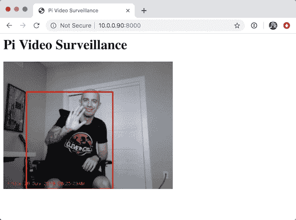
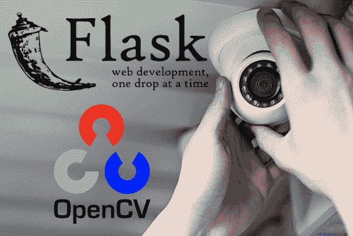

# OpenCV–将视频流传输到网络浏览器/HTML 页面

> 原文：<https://pyimagesearch.com/2019/09/02/opencv-stream-video-to-web-browser-html-page/>

最后更新于 2021 年 7 月 9 日。

在本教程中，您将学习如何使用 OpenCV 通过 Flask 和 Python 将视频从网络摄像头传输到 web 浏览器/HTML 页面。

你的车被偷过吗？

我的在周末被偷了。让我告诉你，我很生气。

我不能透露太多细节，因为这是一项正在进行的刑事调查，但我可以告诉你的是:

大约六个月前，我和妻子从康涅狄格州的诺沃克搬到了宾夕法尼亚州的费城。我有一辆车，不常开，但还是留着以备不时之需。

在我们附近很难找到停车位，所以我需要一个停车库。

我听说有一个车库，就注册了，并开始把车停在那里。

快进到刚刚过去的这个星期天。

我和妻子来到停车场取车。我们正准备去马里兰看望我的父母，吃些青蟹(马里兰以螃蟹闻名)。

我走向我的车，取下盖子。

我立刻被弄糊涂了——这不是我的车。

***# $&@哪里是我的车？***

短短几分钟后，我意识到了现实——我的车被偷了。

在过去的一周里，我关于即将出版的《计算机视觉的树莓派》 的工作被中断了——我一直在与停车场的所有者、费城警察局和我车上的 GPS 跟踪服务合作，以找出发生了什么。

在事情解决之前，我不能公开透露任何细节，但让我告诉你，有一大堆文件、警察报告、律师信和保险索赔需要我去处理。

我*希望*这个问题在下个月得到解决——我讨厌分心，尤其是让我远离我最喜欢做的事情的分心——教授计算机视觉和深度学习*。*

我成功地利用我的挫折激发了一篇新的与安全相关的计算机视觉博文。

在这篇文章中，我们将学习如何使用 Flask 和 OpenCV 将视频流式传输到网络浏览器。

您将能够在不到 5 分钟的时间内**在 Raspberry Pi 上部署该系统:**

*   只需安装所需的软件包/软件并启动脚本。
*   然后打开你的电脑/智能手机浏览器，导航到 URL/IP 地址观看视频(并确保你的东西没有被盗)。

没有什么比一点视频证据更能抓贼了。

当我继续和警察、保险等做文书工作的时候，你可以开始用树莓派相机武装自己，在你生活和工作的任何地方捕捉坏人。

**要了解如何使用 OpenCV 和 Flask 将视频流式传输到网页浏览器 HTML 页面，*请继续阅读！***

*   【2021 年 7 月更新:新增两个章节。第一部分提供了使用 Django 作为 Flask web 框架的替代方案的建议。第二部分讨论使用 ImageZMQ 通过网络从多个摄像机源向单个中央服务器传输实时视频。

## OpenCV–将视频流传输到网络浏览器/HTML 页面

在本教程中，我们将从讨论 Flask 开始，这是 Python 编程语言的一个微型 web 框架。

我们将学习运动检测的基本原理，以便将其应用到我们的项目中。我们将通过背景减法器来实现运动检测。

从那里，我们将结合 Flask 和 OpenCV，使我们能够:

1.  从 RPi 摄像头模块或 USB 网络摄像头访问帧。
2.  处理帧并应用任意算法(这里我们将使用背景减除/运动检测，但是你也可以应用图像分类、对象检测等。).
3.  将结果流式传输到网页/网络浏览器。

**此外，我们将要讨论的代码将能够支持多个客户端**(即，多个人/网络浏览器/标签同时访问流)，这是你在网上找到的绝大多数例子都无法处理的。

将所有这些部件放在一起，家庭监控系统就能够执行运动检测，然后将视频结果传输到您的网络浏览器。

我们开始吧！

### Flask web 框架

在这一节中，我们将简要讨论 Flask web 框架以及如何在您的系统上安装它。

Flask 是一个流行的用 Python 编程语言编写的微型 web 框架。

与 [Django](https://www.djangoproject.com/) 一起，Flask 是使用 Python 构建 web 应用程序时最常见的 web 框架之一。

然而，与 Django 不同，Flask 是非常轻量级的，这使得它非常容易构建基本的 web 应用程序。

正如我们将在本节中看到的，我们只需要少量代码来促进 Flask 的实时视频流——其余代码要么涉及(1) OpenCV 和访问我们的视频流，要么(2)确保我们的代码是线程安全的，可以处理多个客户端。

如果您需要在机器上安装 Flask，只需以下命令即可:

```py
$ pip install flask

```

现在，继续安装 NumPy、OpenCV 和 imutils:

```py
$ pip install numpy
$ pip install opencv-contrib-python
$ pip install imutils

```

***注:**如果你想完整安装 OpenCV，包括“非自由”(专利)算法，请务必[从源代码](https://pyimagesearch.com/opencv-tutorials-resources-guides/)编译 OpenCV。*

### 项目结构

在我们继续之前，让我们看一下项目的目录结构:

```py
$ tree --dirsfirst
.
├── pyimagesearch
│   ├── motion_detection
│   │   ├── __init__.py
│   │   └── singlemotiondetector.py
│   └── __init__.py
├── templates
│   └── index.html
└── webstreaming.py

3 directories, 5 files

```

为了执行背景减除和运动检测，我们将实现一个名为`SingleMotionDetector`的类——这个类将存在于`pyimagesearch`的`motion_detection`子模块中的`singlemotiondetector.py`文件中。

`webstreaming.py`文件将使用 OpenCV 访问我们的网络摄像头，通过`SingleMotionDetector`执行运动检测，然后通过 Flask web 框架将输出帧提供给我们的网络浏览器。

为了让我们的 web 浏览器有所显示，我们需要用 HTML 填充`index.html`的内容来提供视频提要。我们只需要插入一些基本的 HTML 标记——Flask 将为我们处理将视频流发送到我们的浏览器。

### 实现基本的运动检测器

[](https://pyimagesearch.com/wp-content/uploads/2019/09/opencv_stream_video_flask_browser_video_surveillance_result_03.png)

**Figure 2:** Video surveillance with Raspberry Pi, OpenCV, Flask and web streaming. By use of background subtraction for motion detection, we have detected motion where I am moving in my chair.

我们的运动检测器算法将通过 ***背景减法*** 的形式来检测运动。

大多数背景减除算法的工作原理是:

1.  累加前 *N* 帧的加权平均值
2.  取当前帧并将其从帧的加权平均值中减去
3.  对减法的输出进行阈值处理，以突出像素值有显著差异的区域(“白色”用于前景，“黑色”用于背景)
4.  应用诸如腐蚀和膨胀的基本图像处理技术来去除噪声
5.  利用轮廓检测提取包含运动的区域

我们的运动检测实现将存在于`singlemotiondetector.py`中的`SingleMotionDetector`类中。

我们称之为“单个运动检测器”,因为算法本身只对寻找单个最大的运动区域感兴趣。

我们可以很容易地扩展这种方法来处理多个运动区域。

让我们继续**实现运动检测器。**

打开`singlemotiondetector.py`文件并插入以下代码:

```py
# import the necessary packages
import numpy as np
import imutils
import cv2

class SingleMotionDetector:
	def __init__(self, accumWeight=0.5):
		# store the accumulated weight factor
		self.accumWeight = accumWeight

		# initialize the background model
		self.bg = None

```

2-4 号线处理我们所需的进口。

所有这些都是相当标准的，包括用于数字处理的 NumPy、`imutils`用于我们的便利函数，以及`cv2`用于我们的 OpenCV 绑定。

然后我们在**的第 6 行**定义我们的`SingleMotionDetector`类。该类接受一个可选参数`accumWeight`，它是用于我们的累计加权平均值的因子。

`accumWeight`越大，*越小*背景(`bg`)将在累加加权平均值时被考虑在内。

相反地，*越小* `accumWeight`越大，*越大*背景`bg`在计算平均值时会被考虑。

均匀地设置背景和前景的`accumWeight=0.5`权重*——我经常推荐这作为一个起点值(然后你可以根据你自己的实验来调整)。*

接下来，让我们定义`update`方法，它将接受一个输入帧并计算加权平均值:

```py
	def update(self, image):
		# if the background model is None, initialize it
		if self.bg is None:
			self.bg = image.copy().astype("float")
			return

		# update the background model by accumulating the weighted
		# average
		cv2.accumulateWeighted(image, self.bg, self.accumWeight)

```

在我们的`bg`帧是`None`(暗示`update`从未被调用过)的情况下，我们简单的存储`bg`帧(**第 15-18 行**)。

否则，我们计算输入`frame`、现有背景`bg`和我们相应的`accumWeight`因子之间的加权平均值。

给定我们的背景`bg`，我们现在可以通过`detect`方法应用运动检测:

```py
	def detect(self, image, tVal=25):
		# compute the absolute difference between the background model
		# and the image passed in, then threshold the delta image
		delta = cv2.absdiff(self.bg.astype("uint8"), image)
		thresh = cv2.threshold(delta, tVal, 255, cv2.THRESH_BINARY)[1]

		# perform a series of erosions and dilations to remove small
		# blobs
		thresh = cv2.erode(thresh, None, iterations=2)
		thresh = cv2.dilate(thresh, None, iterations=2)

```

`detect`方法需要一个参数和一个可选参数:

*   `image`:将应用运动检测的输入帧/图像。
*   `tVal`:用于标记特定像素是否为“运动”的阈值。

给定我们的输入`image`，我们计算`image`和`bg` ( **第 27 行**)之间的绝对差值。

任何具有差异`> tVal`的像素位置被设置为 *255* (白色；前景)，否则它们被设置为 *0* (黑色；背景)(**第 28 行**)。

执行一系列腐蚀和扩张以去除噪声和小的局部运动区域，否则这些区域会被认为是假阳性的(可能是由于光的反射或快速变化)。

下一步是应用轮廓检测来提取任何运动区域:

```py
		# find contours in the thresholded image and initialize the
		# minimum and maximum bounding box regions for motion
		cnts = cv2.findContours(thresh.copy(), cv2.RETR_EXTERNAL,
			cv2.CHAIN_APPROX_SIMPLE)
		cnts = imutils.grab_contours(cnts)
		(minX, minY) = (np.inf, np.inf)
		(maxX, maxY) = (-np.inf, -np.inf)

```

**第 37-39 行**在我们的`thresh`图像上执行轮廓检测。

然后，我们初始化两组簿记变量，以跟踪包含任何运动的位置(**行 40 和 41** )。这些变量将形成“边界框”，它将告诉我们运动发生的位置。

最后一步是填充这些变量(当然，前提是帧中存在运动):

```py
		# if no contours were found, return None
		if len(cnts) == 0:
			return None

		# otherwise, loop over the contours
		for c in cnts:
			# compute the bounding box of the contour and use it to
			# update the minimum and maximum bounding box regions
			(x, y, w, h) = cv2.boundingRect(c)
			(minX, minY) = (min(minX, x), min(minY, y))
			(maxX, maxY) = (max(maxX, x + w), max(maxY, y + h))

		# otherwise, return a tuple of the thresholded image along
		# with bounding box
		return (thresh, (minX, minY, maxX, maxY))

```

在第 43-45 行上，我们检查轮廓列表是否为空。

如果是这样的话，那么在帧中没有发现运动，我们可以安全地忽略它。

否则，运动*在帧中不存在*，所以我们需要开始在轮廓上循环(**线 48** )。

对于每个轮廓，我们计算边界框，然后更新我们的簿记变量(**第 47-53 行**)，找到最小和最大 *(x，y)*-所有运动发生的坐标。

最后，我们将边界框的位置返回给调用函数。

### 结合 OpenCV 和 Flask

[](https://pyimagesearch.com/wp-content/uploads/2019/09/opencv_stream_video_flask_browser_flask_and_opencv.png)

**Figure 3:** OpenCV and Flask (a Python micro web framework) make the perfect pair for web streaming and video surveillance projects involving the Raspberry Pi and similar hardware.

让我们继续将 OpenCV 和 Flask 结合起来，将视频流中的帧(在 Raspberry Pi 上运行)提供给 web 浏览器。

打开项目结构中的`webstreaming.py`文件，插入以下代码:

```py
# import the necessary packages
from pyimagesearch.motion_detection import SingleMotionDetector
from imutils.video import VideoStream
from flask import Response
from flask import Flask
from flask import render_template
import threading
import argparse
import datetime
import imutils
import time
import cv2

```

**第 2-12 行**处理我们所需的进口:

*   **第 2 行**导入了我们上面实现的`SingleMotionDetector`类。
*   `VideoStream`类( **Line 3** )将使我们能够访问我们的 Raspberry Pi 相机模块或 USB 网络摄像头。
*   **第 4-6 行**处理导入我们需要的 Flask 包——我们将使用这些包来渲染我们的`index.html`模板并提供给客户。
*   **第 7 行**导入了`threading`库，以确保我们可以支持并发性(即多个客户端、web 浏览器和标签同时存在)。

让我们继续执行一些初始化:

```py
# initialize the output frame and a lock used to ensure thread-safe
# exchanges of the output frames (useful when multiple browsers/tabs
# are viewing the stream)
outputFrame = None
lock = threading.Lock()

# initialize a flask object
app = Flask(__name__)

# initialize the video stream and allow the camera sensor to
# warmup
#vs = VideoStream(usePiCamera=1).start()
vs = VideoStream(src=0).start()
time.sleep(2.0)

```

首先，我们在**线 17** 上初始化我们的`outputFrame`——这将是提供给客户端的帧(后期运动检测)。

然后我们在**行 18** 上创建一个`lock`，它将用于确保更新`ouputFrame`时的线程安全行为(即，确保一个线程不会在更新时试图读取帧)。

**第 21 行**初始化我们的烧瓶`app`本身，同时**第 25-27 行**访问我们的视频流:

*   如果您使用的是 USB 网络摄像头，您可以保留代码*不变。*
*   然而，如果你使用 RPi 相机模块，你应该 ***取消注释*第 25 行**和 ***注释掉*第 26 行。**

下一个函数`index`将呈现我们的`index.html`模板，并提供输出视频流:

```py
@app.route("/")
def index():
	# return the rendered template
	return render_template("index.html")

```

这个函数非常简单——它所做的只是在我们的 HTML 文件上调用 Flask `render_template`。

我们将在下一节回顾`index.html`文件，所以在此之前，我们不会对文件内容进行进一步的讨论。

我们的下一个职能部门负责:

1.  循环播放视频流中的帧
2.  应用运动检测
3.  在`outputFrame`上绘制任何结果

此外，该函数必须以线程安全的方式执行所有这些操作，以确保支持并发性。

现在让我们来看看这个函数:

```py
def detect_motion(frameCount):
	# grab global references to the video stream, output frame, and
	# lock variables
	global vs, outputFrame, lock

	# initialize the motion detector and the total number of frames
	# read thus far
	md = SingleMotionDetector(accumWeight=0.1)
	total = 0

```

我们的`detection_motion`函数接受一个参数`frameCount`，这是在`SingleMotionDetector`类中构建背景`bg`所需的最少帧数:

*   如果我们没有至少`frameCount`帧，我们将继续计算累计加权平均值。
*   一旦到达`frameCount`，我们将开始执行背景减除。

**第 37 行**抓取对三个变量的全局引用:

*   `vs`:我们实例化的`VideoStream`对象
*   `outputFrame`:将提供给客户的输出帧
*   `lock`:更新`outputFrame`前必须获得的线程锁

**第 41 行**用值`accumWeight=0.1`初始化我们的`SingleMotionDetector`类，这意味着在计算加权平均值时`bg`值将被赋予更高的权重。

**第 42 行**然后初始化`total`到目前为止读取的帧数——我们需要确保已经读取了足够多的帧数来建立我们的背景模型。

从那里，我们将能够执行背景减法。

完成这些初始化后，我们现在可以开始循环摄像机中的帧:

```py
	# loop over frames from the video stream
	while True:
		# read the next frame from the video stream, resize it,
		# convert the frame to grayscale, and blur it
		frame = vs.read()
		frame = imutils.resize(frame, width=400)
		gray = cv2.cvtColor(frame, cv2.COLOR_BGR2GRAY)
		gray = cv2.GaussianBlur(gray, (7, 7), 0)

		# grab the current timestamp and draw it on the frame
		timestamp = datetime.datetime.now()
		cv2.putText(frame, timestamp.strftime(
			"%A %d %B %Y %I:%M:%S%p"), (10, frame.shape[0] - 10),
			cv2.FONT_HERSHEY_SIMPLEX, 0.35, (0, 0, 255), 1)

```

**48 线**从我们的摄像机读取下一个`frame`，而**49-51 线**执行预处理，包括:

*   调整大小，宽度为 400 像素(我们的输入帧*越小*，数据*越少*，因此我们的算法运行的*越快*)。
*   转换为灰度。
*   高斯模糊(减少噪声)。

然后，我们获取当前时间戳，并将其绘制在`frame` ( **第 54-57 行**)上。

通过最后一项检查，我们可以执行运动检测:

```py
		# if the total number of frames has reached a sufficient
		# number to construct a reasonable background model, then
		# continue to process the frame
		if total > frameCount:
			# detect motion in the image
			motion = md.detect(gray)

			# check to see if motion was found in the frame
			if motion is not None:
				# unpack the tuple and draw the box surrounding the
				# "motion area" on the output frame
				(thresh, (minX, minY, maxX, maxY)) = motion
				cv2.rectangle(frame, (minX, minY), (maxX, maxY),
					(0, 0, 255), 2)

		# update the background model and increment the total number
		# of frames read thus far
		md.update(gray)
		total += 1

		# acquire the lock, set the output frame, and release the
		# lock
		with lock:
			outputFrame = frame.copy()

```

在第 62 行的**上，我们确保我们已经读取了至少`frameCount`帧来构建我们的背景减除模型。**

如果是这样，我们应用运动检测器的`.detect`运动，它返回一个变量`motion`。

如果`motion`是`None`，那么我们知道在当前的`frame`中没有发生运动。否则，如果`motion`是*不是* `None` ( **行 67** )，那么我们需要在`frame`上画出运动区域的包围盒坐标。

**第 76 行**更新我们的运动检测背景模型，而**第 77 行**增加目前从摄像机读取的`total`帧数。

最后，**行 81** 获取支持线程并发所需的`lock`，**行 82** 设置`outputFrame`。

**我们需要获得锁来确保`outputFrame`变量不会在我们试图*更新*它的时候被客户端*读取*。**

我们的下一个函数`generate`，是一个 Python 生成器，用于将我们的`outputFrame`编码为 JPEG 数据——现在让我们来看看:

```py
def generate():
	# grab global references to the output frame and lock variables
	global outputFrame, lock

	# loop over frames from the output stream
	while True:
		# wait until the lock is acquired
		with lock:
			# check if the output frame is available, otherwise skip
			# the iteration of the loop
			if outputFrame is None:
				continue

			# encode the frame in JPEG format
			(flag, encodedImage) = cv2.imencode(".jpg", outputFrame)

			# ensure the frame was successfully encoded
			if not flag:
				continue

		# yield the output frame in the byte format
		yield(b'--frame\r\n' b'Content-Type: image/jpeg\r\n\r\n' + 
			bytearray(encodedImage) + b'\r\n')

```

**第 86 行**抓取对我们的`outputFrame`和`lock`的全局引用，类似于`detect_motion`函数。

然后`generate`在**第 89 行**开始一个无限循环，一直持续到我们杀死这个脚本。

在循环内部，我们:

*   先获取`lock` ( **行 91** )。
*   确保`outputFrame`不为空(**第 94 行**)，如果一帧从摄像机传感器上掉落，可能会发生这种情况。
*   在**行 98** 上将`frame`编码为 JPEG 图像——这里执行 JPEG 压缩是为了减少网络负载并确保帧的更快传输。
*   检查成功`flag`是否失败(**第 101 行和第 102 行**)，暗示 JPEG 压缩失败，我们应该忽略该帧。
*   最后，将编码的 JPEG 帧作为一个字节数组，供 web 浏览器使用。

这在少量的代码中做了大量的工作，所以一定要确保多次查看这个函数，以确保理解它是如何工作的。

下一个函数`video_feed`调用我们的`generate`函数:

```py
@app.route("/video_feed")
def video_feed():
	# return the response generated along with the specific media
	# type (mime type)
	return Response(generate(),
		mimetype = "multipart/x-mixed-replace; boundary=frame")

```

注意这个函数是如何作为`app.route`签名的，就像上面的`index`函数一样。

`app.route`签名告诉 Flask 这个函数是一个 URL 端点，数据是从`http://your_ip_address/video_feed`提供的。

`video_feed`的输出是实时运动检测输出，通过`generate`函数编码为字节数组。您的 web 浏览器足够智能，可以接受这个字节数组，并将其作为实时提要显示在您的浏览器中。

我们的最后一个代码块处理解析命令行参数和启动 Flask 应用程序:

```py
# check to see if this is the main thread of execution
if __name__ == '__main__':
	# construct the argument parser and parse command line arguments
	ap = argparse.ArgumentParser()
	ap.add_argument("-i", "--ip", type=str, required=True,
		help="ip address of the device")
	ap.add_argument("-o", "--port", type=int, required=True,
		help="ephemeral port number of the server (1024 to 65535)")
	ap.add_argument("-f", "--frame-count", type=int, default=32,
		help="# of frames used to construct the background model")
	args = vars(ap.parse_args())

	# start a thread that will perform motion detection
	t = threading.Thread(target=detect_motion, args=(
		args["frame_count"],))
	t.daemon = True
	t.start()

	# start the flask app
	app.run(host=args["ip"], port=args["port"], debug=True,
		threaded=True, use_reloader=False)

# release the video stream pointer
vs.stop()

```

**第 118-125 行**处理解析我们的命令行参数。

这里我们需要三个参数，包括:

*   `--ip`:您从中启动`webstream.py`文件的系统的 IP 地址。
*   `--port`:Flask 应用程序将运行的端口号(通常为该参数提供一个值`8000`)。
*   `--frame-count`:在执行运动检测之前，用于累积和建立背景模型的帧数。默认情况下，我们使用`32`帧来构建背景模型。

**第 128-131 行**启动一个将用于执行运动检测的线程。

使用线程可以确保`detect_motion`功能可以在后台安全运行——它将不断运行并更新我们的`outputFrame`,这样我们就可以向我们的客户提供任何运动检测结果。

最后，**第 134 和 135 行**启动 Flask 应用程序本身。

### HTML 页面结构

正如我们在`webstreaming.py`中看到的，我们正在渲染一个名为`index.html`的 HTML 模板。

模板本身由 Flask web 框架填充，然后提供给 web 浏览器。

然后，您的 web 浏览器获取生成的 HTML 并将其呈现在您的屏幕上。

让我们检查一下`index.html`文件的内容:

```py
<html>
  <head>
    <title>Pi Video Surveillance</title>
  </head>
  <body>
    <h1>Pi Video Surveillance</h1>
    
  </body>
</html>

```

正如我们所看到的，这是超级基本的网页；然而，请密切注意第 7 行——注意我们是如何指示 Flask 动态呈现我们的`video_feed`路线的 URL 的。

由于`video_feed`函数负责从我们的网络摄像头提供帧，图像的`src`将自动填充我们的输出帧。

然后，我们的网络浏览器足够智能，可以正确地呈现网页并提供实时视频流。

### 将碎片拼在一起

既然我们已经编写了项目代码，就让我们来测试一下吧。

打开终端并执行以下命令:

```py
$ python webstreaming.py --ip 0.0.0.0 --port 8000
 * Serving Flask app "webstreaming" (lazy loading)
 * Environment: production
   WARNING: This is a development server. Do not use it in a production deployment.
   Use a production WSGI server instead.
 * Debug mode: on
 * Running on http://0.0.0.0:8000/ (Press CTRL+C to quit)
127.0.0.1 - - [26/Aug/2019 14:43:23] "GET / HTTP/1.1" 200 -
127.0.0.1 - - [26/Aug/2019 14:43:23] "GET /video_feed HTTP/1.1" 200 -
127.0.0.1 - - [26/Aug/2019 14:43:24] "GET /favicon.ico HTTP/1.1" 404 -

```

正如你在视频中看到的，我从多个浏览器打开了与 Flask/OpenCV 服务器的连接，每个浏览器都有多个选项卡。我甚至拿出我的 iPhone，从那里打开了几个连接。服务器没有跳过一拍，继续用 Flask 和 OpenCV 可靠地提供帧。

### **使用 OpenCV 通过其他 web 框架流式传输视频**

在本教程中，您学习了如何使用 Python 的 [Flask web 框架](https://flask.palletsprojects.com/en/2.0.x/)将视频从网络摄像头流式传输到浏览器窗口。

Flask 可以说是最易于使用的轻量级 Python web 框架之一，虽然有许多其他的选择来用 Python 构建网站，但是你可能想要使用的另一个超级框架是 [Django](https://www.djangoproject.com/) 。

在 Django 中构建网站肯定需要更多的代码，但它也包含了 Flask 没有的特性，这使得它成为大型制作网站的潜在更好选择。

我们今天没有讨论 Django，但是如果你有兴趣使用 Django 而不是 Flask，[一定要看看 StackOverflow](https://stackoverflow.com/questions/45906482/how-to-stream-opencv-frame-with-django-frame-in-realtime) 上的这个帖子。

### **视频流的替代方法**

如果你对 OpenCV 的其他视频流选项感兴趣，我的第一个建议是使用 ImageZMQ。

ImageZMQ 由 PyImageSearch 阅读器[杰夫巴斯](https://pyimagesearch.com/2019/04/17/an-interview-with-jeff-bass-creator-of-imagezmq/)创建。该库旨在通过网络实时传输来自多个摄像机的视频帧。

不像 RTSP 或 GStreamer，这两者配置起来都很痛苦，ImageZMQ 非常容易使用，并且非常可靠，这要归功于底层的 ZMQ 消息传递库。

如果您需要一种可靠的方法来传输视频，可能来自多个来源， [ImageZMQ 是我推荐的路线](https://pyimagesearch.com/2019/04/15/live-video-streaming-over-network-with-opencv-and-imagezmq/)。

## 摘要

在本教程中，您学习了如何将帧从服务器传输到客户端 web 浏览器。使用这种网络流，我们能够构建一个基本的安全应用程序来监控我们房间的运动。

背景减除是计算机视觉中非常常用的方法。通常，这些算法计算效率高，适合资源受限的设备，如 Raspberry Pi。

在实现我们的背景减法器之后，我们将它与 Flask web 框架相结合，使我们能够:

1.  从 RPi 摄像头模块/USB 网络摄像头访问帧。
2.  对每一帧应用背景减除/运动检测。
3.  将结果流式传输到网页/网络浏览器。

此外，我们的实现支持多个客户端、浏览器或标签——这是大多数其他实现中所没有的。

每当您需要将帧从设备传输到 web 浏览器时，一定要使用这段代码作为模板/起点。

**要下载这篇文章的源代码，并在以后的文章在 PyImageSearch 上发表时得到通知，*只需在下面的表格中输入您的电子邮件地址！***