# OpenCV 教程:学习 OpenCV 的指南

> 原文：<https://pyimagesearch.com/2018/07/19/opencv-tutorial-a-guide-to-learn-opencv/>

[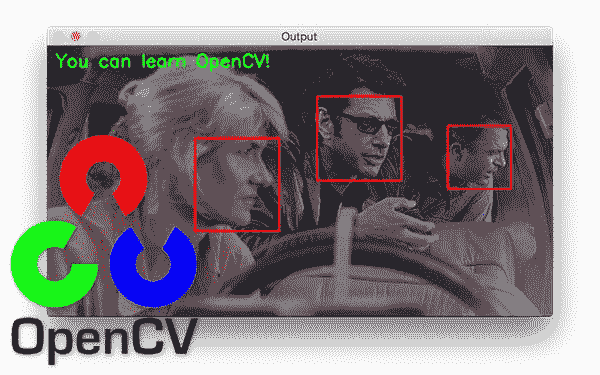](https://pyimagesearch.com/wp-content/uploads/2018/05/opencv_tutorial_header.jpg)

无论您是有兴趣学习如何将面部识别应用于视频流，为图像分类建立一个完整的深度学习管道，还是只想修改您的 Raspberry Pi 并将图像识别添加到一个爱好项目中，**您都需要在这个过程中学习 OpenCV。**

事实是，学习 OpenCV *使用*是相当具有挑战性的。文档很难浏览。这些教程很难理解，也不完整。甚至有些书读起来也有点乏味。

好消息是学习 OpenCV 不像以前那么难了。事实上，我甚至可以说学习 OpenCV 已经变得非常容易。

为了向您证明这一点(并帮助您学习 OpenCV)，我整理了这本使用 Python 编程语言学习 OpenCV 库基础的完整指南。

让我们开始学习 OpenCV 和图像处理的基础知识。在今天的博文结束时，你会理解 OpenCV 的基本原理。

## OpenCV 教程:学习 OpenCV 的指南

这个 OpenCV 教程是为刚刚开始学习基础知识的初学者准备的。在本指南中，您将学习使用 Python 的 OpenCV 库进行基本的图像处理操作。

在本教程结束时，你将完成一个完整的项目，使用轮廓来计算图像中的基本对象。

虽然本教程针对的是刚刚开始学习图像处理和 OpenCV 库的初学者，但我鼓励你即使有一点经验也要读一读。

OpenCV 基础知识的快速复习也将对您自己的项目有所帮助。

### 在系统上安装 OpenCV 和 imutils

今天的第一步是在您的系统上安装 OpenCV(如果您还没有安装的话)。

我维护了一个 [**OpenCV 安装教程**](https://pyimagesearch.com/opencv-tutorials-resources-guides/) 页面，其中包含了之前针对 Ubuntu、macOS 和 Raspberry Pi 的 OpenCV 安装指南的链接。

您应该访问该页面，找到并遵循适合您系统的指南。

一旦新的 OpenCV 开发环境设置好了，**通过 pip 安装 imutils 包。**我为图像处理社区创建并维护了`imutils`(GitHub 上的[资源](https://github.com/jrosebr1/imutils))，它在我的博客上被大量使用。您应该在安装 OpenCV 的同一个环境中安装`imutils`——您将需要它来完成这篇博文，因为它将有助于基本的图像处理操作:

```py
$ pip install imutils

```

***注意:*** *如果你正在使用 Python 虚拟环境，不要忘记在安装`imutils`之前使用`workon`命令进入你的环境！*

### OpenCV 项目结构

在深入兔子洞之前，请务必从今天的博客文章的 ***【下载】*** 部分获取代码和图片。

从那里，导航到您下载的位置。压缩你的终端(`cd`)。然后我们可以`unzip`存档，将工作目录(`cd`)转到项目文件夹，并通过`tree`分析项目结构:

```py
$ cd ~/Downloads
$ unzip opencv-tutorial.zip
$ cd opencv-tutorial
$ tree
.
├── jp.png
├── opencv_tutorial_01.py
├── opencv_tutorial_02.py
└── tetris_blocks.png

0 directories, 4 files

```

在本教程中，我们将创建两个 Python 脚本来帮助您学习 OpenCV 基础知识:

1.  我们的第一个脚本，`opencv_tutorial_01.py`将使用电影*《侏罗纪公园》* ( `jp.png`)中的一个图像来涵盖基本的图像处理操作。
2.  从那里，`opencv_tutorial_02.py`将向您展示如何使用这些图像处理构建块来创建 OpenCV 应用程序，以计算俄罗斯方块图像中的对象数量(`tetris_blocks.png`)。

### 加载和显示图像

[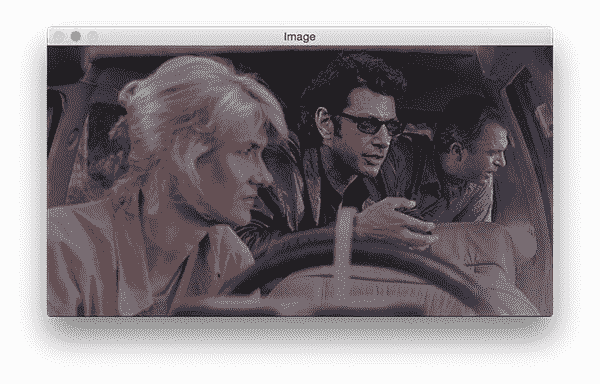](https://pyimagesearch.com/wp-content/uploads/2018/05/opencv_tutorial_load_image.jpg)

**Figure 1:** Learning OpenCV basics with Python begins with loading and displaying an image — a simple process that requires only a few lines of code.

让我们首先在您最喜欢的文本编辑器或 IDE 中打开`opencv_tutorial_01.py`:

```py
# import the necessary packages
import imutils
import cv2

# load the input image and show its dimensions, keeping in mind that
# images are represented as a multi-dimensional NumPy array with
# shape no. rows (height) x no. columns (width) x no. channels (depth)
image = cv2.imread("jp.png")
(h, w, d) = image.shape
print("width={}, height={}, depth={}".format(w, h, d))

# display the image to our screen -- we will need to click the window
# open by OpenCV and press a key on our keyboard to continue execution
cv2.imshow("Image", image)
cv2.waitKey(0)

```

在**的第 2 行和第 3 行**，我们导入了`imutils`和`cv2`。`cv2`包是 OpenCV，尽管嵌入了 2，但它实际上可以是 OpenCV 3(或者可能是 OpenCV 4，可能会在 2018 年晚些时候发布)。`imutils`套餐是我的一系列便民功能。

现在我们已经通过导入获得了所需的软件，让我们将一个映像从磁盘加载到内存中。

为了加载我们的*侏罗纪公园*图像(来自我最喜欢的电影之一)，我们调用`cv2.imread("jp.png")`。正如你在**第 8 行**看到的，我们将结果赋给`image`。我们的`image`实际上只是一个 NumPy 数组。

在这个脚本的后面，我们将需要高度和宽度。所以在第 9 行的**上，我调用`image.shape`来提取高度、宽度和深度。**

高度在宽度之前，这可能看起来令人困惑，但请这样想:

*   我们用*、行数 x 列数*来描述矩阵
*   *排数*就是我们的*高度*
*   而*列的数量*就是我们的*宽度*

因此，表示为 NumPy 数组的图像的尺寸实际上表示为*(高度、宽度、深度)。*

深度是通道的数量——在我们的例子中是三个，因为我们使用 3 个颜色通道:蓝色、绿色和红色。

在**行 10** 显示的打印命令将把数值输出到终端:

```py
width=600, height=322, depth=3

```

为了使用 OpenCV 在屏幕上显示图像，我们在第 14 行的**上使用了`cv2.imshow("Image", image)`。下一行等待按键(**第 15 行**)。这一点很重要，否则我们的图像显示和消失的速度会比我们看到图像的速度更快。**

***注意:*** *你需要实际点击 OpenCV 打开的活动窗口，按下键盘上的一个键来推进脚本。OpenCV 不能监控你的终端输入，所以如果你在终端上按下一个键，OpenCV 不会注意到。同样，您需要单击屏幕上的活动 OpenCV 窗口，并按下键盘上的一个键。*

### 访问单个像素

[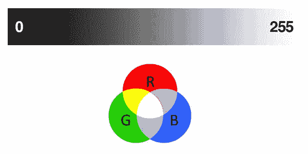](https://pyimagesearch.com/wp-content/uploads/2018/06/opencv_tutorial_gradient_rgb.jpg)

**Figure 2:** *Top*: grayscale gradient where brighter pixels are closer to 255 and darker pixels are closer to 0\. *Bottom*: RGB venn diagram where brighter pixels are closer to the center.

首先，你可能会问:

> 什么是像素？

所有图像都由像素组成，像素是图像的原始构建块。图像由网格中的像素组成。640 x 480 的图像有 640 列(宽度)和 480 行(高度)。一幅图像中有`640 * 480 = 307200`个像素具有这些尺寸。

灰度图像中的每个像素都有一个代表灰度的值。在 OpenCV 中，有 256 种灰度——从 0 到 255。因此灰度图像将具有与每个像素相关联的灰度值。

彩色图像中的像素具有附加信息。随着您对图像处理的了解，您很快就会熟悉几种颜色空间。为了简单起见，让我们只考虑 RGB 颜色空间。

在 OpenCV 中，RGB(红、绿、蓝)色彩空间中的彩色图像有一个与每个像素相关联的三元组:`(B, G, R)`。

请注意，排序是 BGR，而不是 RGB。这是因为当 OpenCV 在许多年前首次被开发时，标准是 BGR 排序。多年来，标准现在已经变成了 RGB，但是 OpenCV 仍然保持这种“传统”的 BGR 排序，以确保没有现有的代码中断。

BGR 三元组中的每个值都有一个范围`[0, 255]`。OpenCV 中一个 RGB 图像的每个像素有多少种颜色的可能性？那很简单:`256 * 256 * 256 = 16777216`。

现在我们已经确切知道了像素是什么，让我们看看如何检索图像中单个像素的值:

```py
# access the RGB pixel located at x=50, y=100, keepind in mind that
# OpenCV stores images in BGR order rather than RGB
(B, G, R) = image[100, 50]
print("R={}, G={}, B={}".format(R, G, B))

```

如前所示，我们的图像尺寸是`width=600, height=322, depth=3`。我们可以通过指定坐标来访问数组中的单个像素值，只要它们在最大宽度和高度范围内。

代码`image[100, 50]`从位于`x=50`和`y=100`的像素产生一个三元组的 BGR 值(再次提醒，记住*高度*是*行*的数量，而*宽度*是*列*的数量——现在花点时间让自己相信这是真的)。如上所述，OpenCV 以 BGR 顺序存储图像(例如，与 Matplotlib 不同)。看看提取第 19 行**像素的颜色通道值有多简单。**

生成的像素值显示在终端上，如下所示:

```py
R=41, G=49, B=37

```

### 数组切片和裁剪

提取“感兴趣区域”是图像处理的一项重要技能。

比方说，你正在研究识别电影中的人脸。首先，你要运行一个人脸检测算法来找到你正在处理的所有帧中人脸的坐标。然后，您需要提取面部感兴趣区域，并保存或处理它们。定位《侏罗纪公园》中包含伊恩·马尔科姆博士的所有帧将是一个伟大的人脸识别迷你项目。

现在，让我们手动*提取一个 ROI。这可以通过数组切片来实现。*

[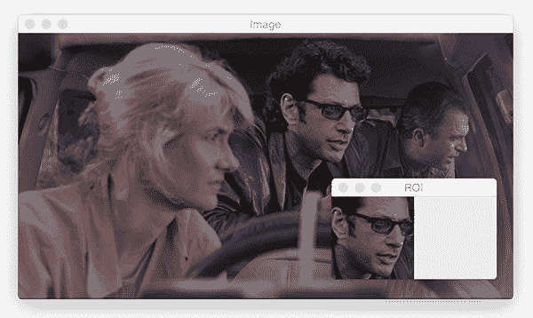](https://pyimagesearch.com/wp-content/uploads/2018/05/opencv_tutorial_array_slicing_and_crop.jpg)

**Figure 3:** Array slicing with OpenCV allows us to extract a region of interest (ROI) easily.

```py
# extract a 100x100 pixel square ROI (Region of Interest) from the
# input image starting at x=320,y=60 at ending at x=420,y=160
roi = image[60:160, 320:420]
cv2.imshow("ROI", roi)
cv2.waitKey(0)

```

数组切片显示在**第 24 行**，格式:`image[startY:endY, startX:endX]`。这段代码抓取了一个`roi`，然后我们将它显示在**的第 25 行**上。就像上次一样，我们显示直到一个键被按下( **Line 26** )。

正如你在图 3 中看到的，我们已经提取了伊恩·马尔科姆博士的面部。在这个例子中，我实际上使用 Photoshop 预先确定了 *(x，y)*-坐标，但是如果你坚持使用我的博客，你可以[自动检测和提取面部 ROI](https://pyimagesearch.com/2018/02/26/face-detection-with-opencv-and-deep-learning/)。

### 调整图像大小

调整图像大小很重要，原因有很多。首先，您可能想要调整大图像的大小以适合您的屏幕。图像处理在较小的图像上也更快，因为需要处理的像素更少。在深度学习的情况下，我们经常调整图像的大小，忽略长宽比，以便体积适合要求图像是正方形并具有一定维度的网络。

让我们将原始图像的大小调整为 200 x 200 像素:

```py
# resize the image to 200x200px, ignoring aspect ratio
resized = cv2.resize(image, (200, 200))
cv2.imshow("Fixed Resizing", resized)
cv2.waitKey(0)

```

在**第 29** 行，我们已经调整了图像的大小，忽略了纵横比。**图 4** ( *右*)显示图像被调整了大小，但现在失真了，因为我们没有考虑宽高比。

[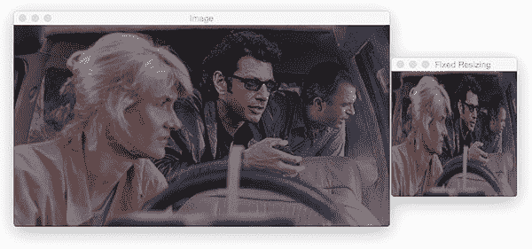](https://pyimagesearch.com/wp-content/uploads/2018/05/opencv_tutorial_resizing.jpg)

**Figure 4:** Resizing an image with OpenCV and Python can be conducted with `cv2.resize` however aspect ratio is not preserved automatically.

让我们计算原始图像的长宽比，并使用它来调整图像的大小，以便它不会出现挤压和扭曲:

```py
# fixed resizing and distort aspect ratio so let's resize the width
# to be 300px but compute the new height based on the aspect ratio
r = 300.0 / w
dim = (300, int(h * r))
resized = cv2.resize(image, dim)
cv2.imshow("Aspect Ratio Resize", resized)
cv2.waitKey(0)

```

回想一下这个脚本的第 9 行**，我们在那里提取了图像的宽度和高度。**

 **假设我们想要将 600 像素宽的图像调整为 300 像素宽，同时保持宽高比不变。

在第 35 行的**上，我们计算了*新宽度*与*旧宽度*的比值(恰好是 0.5)。**

从那里，我们指定新图像的尺寸，`dim`。我们知道我们想要一个 300 像素宽的图像，但是我们必须使用比率通过将`h`乘以`r`来计算高度(分别是原始高度和我们的比率)。

将`dim`(我们的尺寸)输入到`cv2.resize`函数中，我们现在已经获得了一个名为`resized`的没有扭曲的新图像(**第 37 行**)。

为了检查我们的工作，我们使用第 38 行的代码显示图像:

[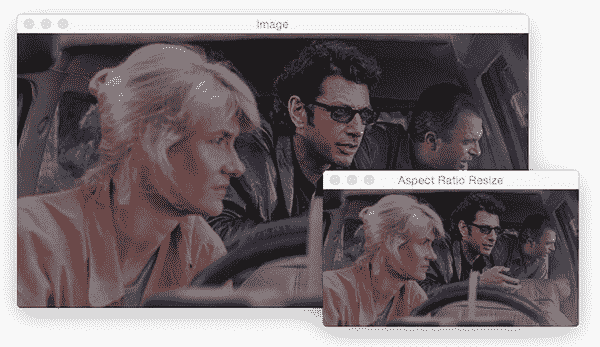](https://pyimagesearch.com/wp-content/uploads/2018/05/opencv_tutorial_ar_resize.jpg)

**Figure 5:** Resizing images while maintaining aspect ratio with OpenCV is a three-step process: (1) extract the image dimensions, (2) compute the aspect ratio, and (3) resize the image (`cv2.resize`) along one dimension and multiply the other dimension by the aspect ratio. See **Figure 6** for an even easier method.

但是我们能不能让这个在调整大小时保持长宽比的过程变得更简单呢？

是啊！

每次我们想要调整图像大小时，计算长宽比都有点繁琐，所以我将代码包装在`imutils`中的一个函数中。

以下是你如何使用`imutils.resize`:

```py
# manually computing the aspect ratio can be a pain so let's use the
# imutils library instead
resized = imutils.resize(image, width=300)
cv2.imshow("Imutils Resize", resized)
cv2.waitKey(0)

```

在一行代码中，我们保留了纵横比并调整了图像的大小。

简单吧？

你只需要提供你的目标`width`或者目标`height`作为关键字参数(**第 43 行**)。

结果如下:

[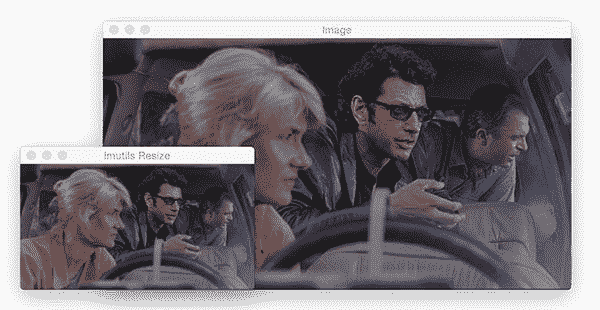](https://pyimagesearch.com/wp-content/uploads/2018/05/opencv_tutorial_imutils_resize.jpg)

**Figure 6:** If you’d like to maintain aspect ratio while resizing images with OpenCV and Python, simply use `imutils.resize`. Now your image won’t risk being “squished” as in **Figure 4**.

### 旋转图像

让我们为下一个例子旋转我们的*侏罗纪公园*图像:

```py
# let's rotate an image 45 degrees clockwise using OpenCV by first
# computing the image center, then constructing the rotation matrix,
# and then finally applying the affine warp
center = (w // 2, h // 2)
M = cv2.getRotationMatrix2D(center, -45, 1.0)
rotated = cv2.warpAffine(image, M, (w, h))
cv2.imshow("OpenCV Rotation", rotated)
cv2.waitKey(0)

```

围绕中心点旋转一幅图像需要我们先计算中心 *(x，y)*——图像的坐标(**线 50** )。

***注:**我们用`//`进行整数数学运算(即无浮点值)*。

从那里我们计算一个旋转矩阵，`M` ( **第 51 行**)。`-45`意味着我们将顺时针旋转图像 45 度。回忆一下初中/高中几何课上关于单位圆的内容，你将能够提醒自己，**正角是逆时针方向的**，而**负角是顺时针方向的。**

从那里，我们使用第 52 行**上的矩阵(有效地旋转它)扭曲图像。**

旋转后的图像显示在**线 52** 的屏幕上，如图**图 7** 所示:

[](https://pyimagesearch.com/wp-content/uploads/2018/05/opencv_tutorial_opencv_rotation.jpg)

**Figure 7:** Rotating an image with OpenCV about the center point requires three steps: (1) compute the center point using the image width and height, (2) compute a rotation matrix with `cv2.getRotationMatrix2D`, and (3) use the rotation matrix to warp the image with `cv2.warpAffine`.

现在让我们使用`imutils`在一行代码中执行相同的操作:

```py
# rotation can also be easily accomplished via imutils with less code
rotated = imutils.rotate(image, -45)
cv2.imshow("Imutils Rotation", rotated)
cv2.waitKey(0)

```

因为我不需要像调整图片大小那样旋转图片(相对来说)，所以我觉得旋转的过程很难记住。因此，我在`imutils`中创建了一个函数来为我们处理它。在一行代码中，我可以完成顺时针旋转图像 45 度(**第 57 行**)，如图**图 8:**

[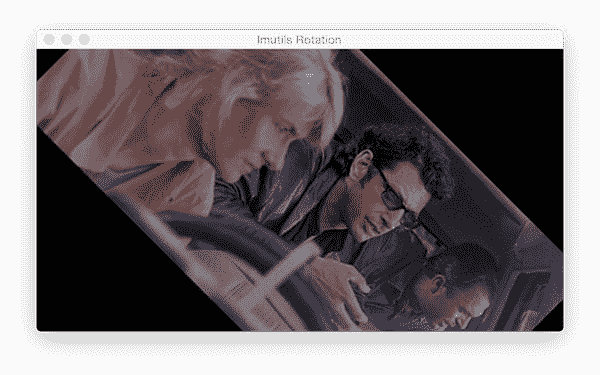](https://pyimagesearch.com/wp-content/uploads/2018/05/opencv_tutorial_imutils_rotation.jpg)

**Figure 8:** With `imutils.rotate`, we can rotate an image with OpenCV and Python conveniently with a single line of code.

此时你必须思考:

> 究竟为什么图像被剪切了？

事情是这样的，OpenCV *并不关心*我们的图像在旋转后是否被裁剪掉了。我发现这很麻烦，所以这是我的`imutils`版本，它将保留整个图像。我称之为`rotate_bound`:

```py
# OpenCV doesn't "care" if our rotated image is clipped after rotation
# so we can instead use another imutils convenience function to help
# us out
rotated = imutils.rotate_bound(image, 45)
cv2.imshow("Imutils Bound Rotation", rotated)
cv2.waitKey(0)

```

在`rotate_bound`的幕后发生了很多事情。如果你对第 64 条线上的**方法是如何工作的感兴趣，一定要看看[这篇博文](https://pyimagesearch.com/2017/01/02/rotate-images-correctly-with-opencv-and-python/)。**

结果如**图 9** 所示:

[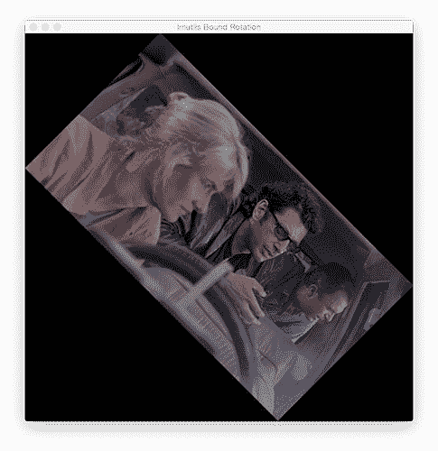](https://pyimagesearch.com/wp-content/uploads/2018/05/opencv_tutorial_bounded_rotation.jpg)

**Figure 9:** The `rotate_bound` function of `imutils` will prevent OpenCV from clipping the image during a rotation. See [this blog post](https://pyimagesearch.com/2017/01/02/rotate-images-correctly-with-opencv-and-python/) to learn how it works!

完美！整个图像都在框架中，并且顺时针正确旋转了 45 度。

### 平滑图像

在许多图像处理管道中，我们必须模糊图像以减少高频噪声，使我们的算法更容易检测和理解图像的实际*内容*，而不仅仅是会“混淆”我们算法的*噪声*。在 OpenCV 中模糊图像非常容易，有很多方法可以实现。

[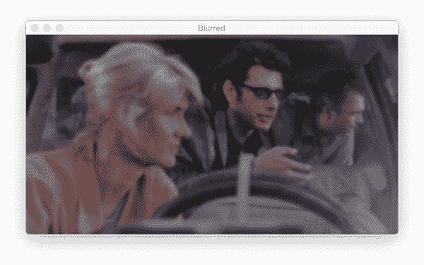](https://pyimagesearch.com/wp-content/uploads/2018/05/opencv_tutorial_blurring.jpg)

**Figure 10:** This image has undergone a Gaussian blur with an `11 x 11` kernel using OpenCV. Blurring is an important step of many image processing pipelines to reduce high-frequency noise.

我经常使用`GaussianBlur`功能:

```py
# apply a Gaussian blur with a 11x11 kernel to the image to smooth it,
# useful when reducing high frequency noise
blurred = cv2.GaussianBlur(image, (11, 11), 0)
cv2.imshow("Blurred", blurred)
cv2.waitKey(0)

```

在第 70 行第 70 行第 71 行，我们用 11×11 的内核进行高斯模糊，结果如图 10(T3)中的**所示。**

更大的颗粒会产生更模糊的图像。更小的内核将创建更少的模糊图像。要阅读更多关于内核的内容，请参考[这篇博客文章](https://pyimagesearch.com/2016/07/25/convolutions-with-opencv-and-python/)或 [PyImageSearch 大师课程](https://pyimagesearch.com/pyimagesearch-gurus/)。

### 在图像上绘图

在这一节中，我们将在输入图像上绘制矩形、圆形和直线。我们还将在图像上覆盖文本。

在我们继续用 OpenCV 在图像上绘图之前，请注意图像上的*绘图操作是就地执行的*。因此，在每个代码块的开始，我们制作原始图像的副本，并将副本存储为`output`。然后我们继续就地绘制名为`output`的图像，这样我们就不会破坏我们的原始图像。

让我们围绕伊恩·马尔科姆的脸画一个矩形:

```py
# draw a 2px thick red rectangle surrounding the face
output = image.copy()
cv2.rectangle(output, (320, 60), (420, 160), (0, 0, 255), 2)
cv2.imshow("Rectangle", output)
cv2.waitKey(0)

```

首先，出于刚才解释的原因，我们复制第 75 行**上的图像。**

然后我们继续画矩形。

在 OpenCV 中绘制矩形再简单不过了。使用预先计算的坐标，我已经向第 76 行的**函数提供了以下参数:**

*   `img`:要绘制的目标图像。我们正在利用`output`。
*   左上角是我们的起始像素坐标。在我们的例子中，左上角是`(320, 60)`。
*   `pt2`:结束像素——右下方。右下角的像素位于`(420, 160)`。
*   `color` : BGR 元组。为了表示红色，我提供了`(0 , 0, 255)`。
*   `thickness`:线条粗细(负值会形成实心矩形)。我已经提供了`2`的厚度。

因为我们使用的是 OpenCV 的函数而不是 NumPy 操作，所以我们可以按照 *(x，y)* 的顺序提供我们的坐标，而不是按照 *(y，x)* 的顺序，因为我们不直接操作或访问 NumPy 数组——OpenCV 会为我们处理这些。

这是我们在图 11 中的结果:

[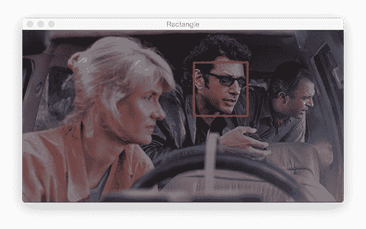](https://pyimagesearch.com/wp-content/uploads/2018/05/opencv_tutorial_drawing_rectangle.jpg)

**Figure 11:** Drawing shapes with OpenCV and Python is an easy skill to pick up. In this image, I’ve drawn a red box using `cv2.rectangle`. I pre-determined the coordinates around the face for this example, but you could use a face detection method to automatically find the face coordinates.

现在让我们在艾丽·塞特勒的脸前面画一个蓝色的实心圆:

```py
# draw a blue 20px (filled in) circle on the image centered at
# x=300,y=150
output = image.copy()
cv2.circle(output, (300, 150), 20, (255, 0, 0), -1)
cv2.imshow("Circle", output)
cv2.waitKey(0)

```

要画圆，需要向`cv2.circle`提供以下参数:

*   `img`:输出图像。
*   `center`:我们圆的中心坐标。我提供的`(300, 150)`就在艾莉眼前。
*   `radius`:以像素为单位的圆半径。我提供了一个`20`像素的值。
*   `color`:圆形颜色。这一次，我选择了蓝色，这是由 BGR 元组`(255, 0, 0)`的 G + R 部分中的 B 和 0 表示的 255。
*   `thickness`:线条粗细。因为我提供了一个负值(`-1`)，所以圆是实心的/填充的。

下面是图 12 中的结果:

[](https://pyimagesearch.com/wp-content/uploads/2018/05/opencv_tutorial_drawing_circle.jpg)

**Figure 12:** OpenCV’s `cv2.circle` method allows you to draw circles anywhere on an image. I’ve drawn a solid circle for this example as is denoted by the `-1` line thickness parameter (positive values will make a circular outline with variable line thickness).

看起来艾莉对恐龙比对我的蓝点更感兴趣，所以我们继续吧！

接下来，我们将画一条红线。这条线穿过埃莉的头，经过她的眼睛，到达伊恩的手。

如果您仔细观察方法参数并将它们与矩形的参数进行比较，您会注意到它们是相同的:

```py
# draw a 5px thick red line from x=60,y=20 to x=400,y=200
output = image.copy()
cv2.line(output, (60, 20), (400, 200), (0, 0, 255), 5)
cv2.imshow("Line", output)
cv2.waitKey(0)

```

就像在矩形中一样，我们提供两个点、一种颜色和一种线条粗细。OpenCV 的后端完成剩下的工作。

**图 13** 显示了来自代码块的**行 89** 的结果:

[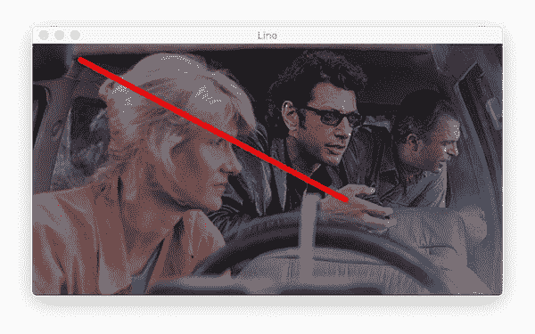](https://pyimagesearch.com/wp-content/uploads/2018/05/opencv_tutorial_drawing_line.jpg)

**Figure 13:** Similar to drawing rectangles and circles, drawing a line in OpenCV using `cv2.line` only requires a starting point, ending point, color, and thickness.

您经常会发现，出于显示目的，您希望在图像上覆盖文本。如果你在做人脸识别，你可能会想把这个人的名字画在他的脸上面。或者，如果你在计算机视觉事业上有所进步，你可以建立一个图像分类器或物体检测器。在这些情况下，您会发现您想要绘制包含类名和概率的文本。

让我们看看 OpenCV 的 putText 函数是如何工作的:

```py
# draw green text on the image
output = image.copy()
cv2.putText(output, "OpenCV + Jurassic Park!!!", (10, 25), 
	cv2.FONT_HERSHEY_SIMPLEX, 0.7, (0, 255, 0), 2)
cv2.imshow("Text", output)
cv2.waitKey(0)

```

OpenCV 的`putText`函数负责在图像上绘制文本。让我们来看看所需的参数:

*   `img`:输出图像。
*   `text`:我们想要在图像上书写/绘制的文本字符串。
*   `pt`:文字的起点。
*   `font`:我经常用`cv2.FONT_HERSHEY_SIMPLEX`。可用的字体是这里列出的。
*   `scale`:字体大小乘数。
*   `color`:文字颜色。
*   `thickness`:笔画的粗细，以像素为单位。

第 95 行和第 96 行的**代码将绘制文本，*“OpenCV+侏罗纪公园！！!"**图 14** 中的`output`图像上绿色的*:**

[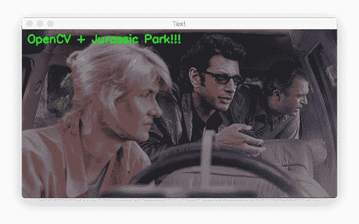](https://pyimagesearch.com/wp-content/uploads/2018/05/opencv_tutorial_drawing_text.jpg)

**Figure 14:** Oftentimes, you’ll find that you want to display text on an image for visualization purposes. Using the `cv2.putText` code shown above you can practice overlaying text on an image with different colors, fonts, sizes, and/or locations.

### 运行第一个 OpenCV 教程 Python 脚本

在我的博客文章中，我通常会提供一个部分，详细说明如何在计算机上运行代码。在博文的这一点上，我做了如下假设:

1.  你已经从这篇博文的 ***【下载】*** 部分下载了代码。
2.  您已经解压缩了文件。
3.  您已经在系统上安装了 OpenCV 和 imutils 库。

要执行我们的第一个脚本，打开一个终端或命令窗口，导航到文件或提取它们(如果需要)。

在那里，输入以下命令:

```py
$ python opencv_tutorial_01.py 
width=600, height=322, depth=3
R=41, G=49, B=37

```

该命令是 bash 提示符`$`字符之后的所有内容。只要在你的终端输入`python opencv_tutorial_01.py`，第一张图片就会出现。

要循环我们刚刚学习的每个步骤，请确保图像窗口处于活动状态，然后按任意键。

我们上面的第一对代码块告诉 Python 在终端中打印信息。如果您的终端可见，您将会看到显示的终端输出(**行 2 和 3** )。

我还附上了一个 GIF 动画，展示了我们依次采取的所有图像处理步骤，一个接一个:

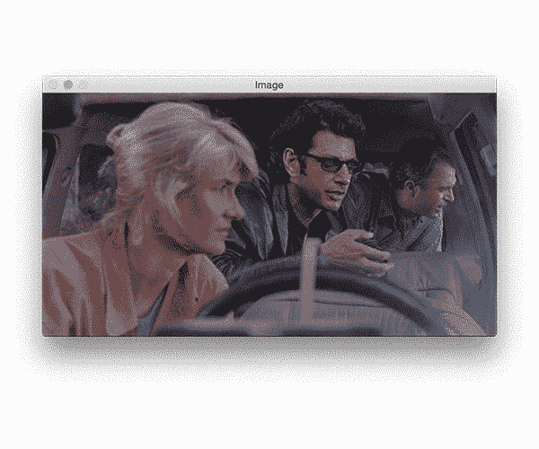

**Figure 15:** Output animation displaying the OpenCV fundamentals we learned from this first example Python script.

### 计数对象

现在我们将改变思路，开始编写与这篇博文相关的 ***【下载】*** 中的第二个脚本。

在接下来的几节中，我们将学习如何使用创建一个简单的 Python + OpenCV 脚本来计算下图中俄罗斯方块的数量:

[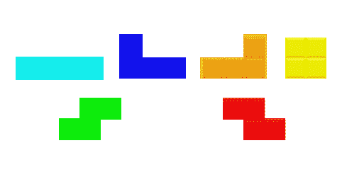](https://pyimagesearch.com/wp-content/uploads/2018/05/tetris_blocks.png)

**Figure 16:** If you’ve ever played Tetris (who hasn’t?), you’ll recognize these familiar shapes. In the 2nd half of this OpenCV fundamentals tutorial, we’re going to find and count the shape contours.

一路上我们会:

*   学习如何使用 OpenCV 将图像转换为灰度
*   执行边缘检测
*   设定灰度图像的阈值
*   查找、计数和绘制等高线
*   进行侵蚀和扩张
*   遮蔽图像

继续并关闭您下载的第一个脚本，打开`opencv_tutorial_02.py`开始第二个示例:

```py
# import the necessary packages
import argparse
import imutils
import cv2

# construct the argument parser and parse the arguments
ap = argparse.ArgumentParser()
ap.add_argument("-i", "--image", required=True,
	help="path to input image")
args = vars(ap.parse_args())

```

在**线 2-4** 我们进口我们的包裹。这在每个 Python 脚本的开始都是必要的。对于第二个脚本，我导入了`argparse`——一个命令行参数解析包，它随 Python 的所有安装一起提供。

快速浏览一下第 7-10 行。这些行允许我们在运行时从终端向程序提供额外的信息。命令行参数在 PyImageSearch 博客和所有其他计算机科学领域中被大量使用。

我鼓励你在这篇文章中阅读它们: *[Python、argparse 和命令行参数](https://pyimagesearch.com/2018/03/12/python-argparse-command-line-arguments/)。*

我们有一个必需的命令行参数`--image`，在**的第 8 行和第 9 行**中有定义。

下面我们将学习如何使用所需的命令行参数运行脚本。现在，只要知道在脚本中遇到`args["image"]`的地方，我们指的是输入图像的路径。

### 将图像转换为灰度

```py
# load the input image (whose path was supplied via command line
# argument) and display the image to our screen
image = cv2.imread(args["image"])
cv2.imshow("Image", image)
cv2.waitKey(0)

# convert the image to grayscale
gray = cv2.cvtColor(image, cv2.COLOR_BGR2GRAY)
cv2.imshow("Gray", gray)
cv2.waitKey(0)

```

我们在**第 14 行**将图像载入内存。`cv2.imread`函数的参数是包含在用`"image"`键`args["image"]`引用的`args`字典中的路径。

从那里，我们显示图像，直到我们遇到第一次按键(**行 15 和 16** )。

我们将很快对图像进行阈值处理和边缘检测。因此，我们通过调用`cv2.cvtColor`并提供`image`和`cv2.COLOR_BGR2GRAY`标志，在**行 19** 上将图像转换成灰度。

我们再次显示图像并等待按键(**行 20 和 21** )。

我们转换成灰度的结果显示在**图 17** ( *底部)。*

[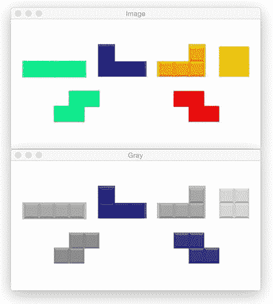](https://pyimagesearch.com/wp-content/uploads/2018/05/opencv_tutorial_grayscale.jpg)

**Figure 17:** (*top*) Our Tetris image. (*bottom*) We’ve converted the image to grayscale — a step that comes before thresholding.

### 边缘检测

边缘检测对于寻找图像中对象的边界是有用的，它对于分割目的是有效的。

让我们执行边缘检测，看看这个过程是如何工作的:

```py
# applying edge detection we can find the outlines of objects in
# images
edged = cv2.Canny(gray, 30, 150)
cv2.imshow("Edged", edged)
cv2.waitKey(0)

```

使用流行的 Canny 算法(由 John F. Canny 于 1986 年开发)，我们可以找到图像中的边缘。

我们为`cv2.Canny`函数提供三个参数:

*   `img`:图像`gray`。
*   `minVal`:最小阈值，在我们的例子中是`30`。
*   `maxVal`:最大阈值，在我们的例子中是`150`。
*   `aperture_size`:索贝尔内核大小。默认情况下，该值为`3`，因此不会显示在**行 25** 上。

最小和最大阈值的不同值将返回不同的边缘图。

在下面的**图 18** 中，注意俄罗斯方块本身的边缘是如何显示的，以及组成俄罗斯方块的子方块:

[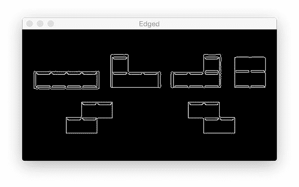](https://pyimagesearch.com/wp-content/uploads/2018/05/opencv_tutorial_edge_detection.jpg)

**Figure 18:** To conduct edge detection with OpenCV, we make use of the Canny algorithm.

### 阈值处理

图像阈值化是图像处理流水线的重要中间步骤。阈值处理可以帮助我们去除图像中较亮或较暗的区域和轮廓。

我强烈建议您尝试阈值处理。我通过反复试验(以及经验)调整了下面的代码，使其适用于我们的示例:

```py
# threshold the image by setting all pixel values less than 225
# to 255 (white; foreground) and all pixel values >= 225 to 255
# (black; background), thereby segmenting the image
thresh = cv2.threshold(gray, 225, 255, cv2.THRESH_BINARY_INV)[1]
cv2.imshow("Thresh", thresh)
cv2.waitKey(0)

```

在单行(**行 32** )中我们是:

*   抓取`gray`图像*中大于 225* 的所有像素，并设置为 0(黑色)，对应于图像的*背景*
*   将小于 225 的像素值*设置为 255(白色)，对应于图像的*前景*(即俄罗斯方块本身)。*

关于 cv2.threshold 函数的更多信息，包括阈值标志如何工作，请务必参考官方 OpenCV 文档。

用二进制图像从背景中分割前景是寻找轮廓的关键 (我们的下一步)。

[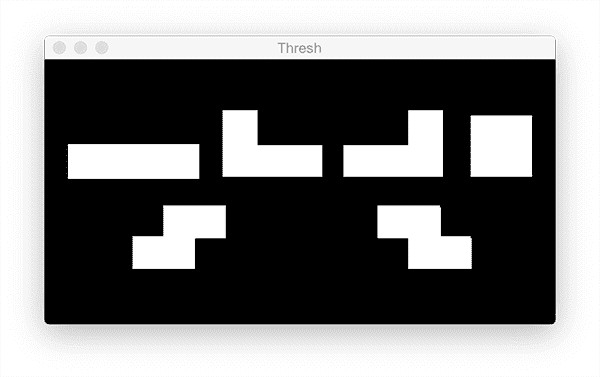](https://pyimagesearch.com/wp-content/uploads/2018/05/opencv_tutorial_thresholding.png)

**Figure 19:** Prior to finding contours, we threshold the grayscale image. We performed a binary inverse threshold so that the foreground shapes become white while the background becomes black.

注意在图 19 中，前景物体是白色的，背景是黑色的。

### 检测和绘制轮廓

[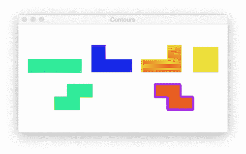](https://pyimagesearch.com/wp-content/uploads/2018/05/opencv_tutorial_contours_animation.gif)

**Figure 20:** We’re working towards finding contour shapes with OpenCV and Python in this OpenCV Basics tutorial.

在**图 20** 动画中，我们有 6 个外形轮廓。让我们通过代码找到并画出它们的轮廓:

```py
# find contours (i.e., outlines) of the foreground objects in the
# thresholded image
cnts = cv2.findContours(thresh.copy(), cv2.RETR_EXTERNAL,
	cv2.CHAIN_APPROX_SIMPLE)
cnts = imutils.grab_contours(cnts)
output = image.copy()

# loop over the contours
for c in cnts:
	# draw each contour on the output image with a 3px thick purple
	# outline, then display the output contours one at a time
	cv2.drawContours(output, [c], -1, (240, 0, 159), 3)
	cv2.imshow("Contours", output)
	cv2.waitKey(0)

```

在**的第 38 行和第 39 行**，我们使用`cv2.findContours`来检测图像中的轮廓。请注意参数标志，但现在让我们保持简单——我们的算法是在`thresh.copy()`图像中找到所有前景(白色)像素。

**第 40 行**非常重要，因为`cv2.findContours`实现在 OpenCV 2.4、OpenCV 3 和 OpenCV 4 之间发生了变化。这条兼容性线出现在博客中涉及轮廓的地方。

我们在第**行第 41** 处复制原始图像，这样我们可以在随后的第**行第 44-49** 处绘制轮廓。

在**的第 47 行**，我们使用适当命名的`cv2.drawContours`从图像上的`cnts`列表中画出每个`c`。我选择了用元组`(240, 0, 159)`表示的紫色。

利用我们在这篇博文中所学的知识，让我们在图片上叠加一些文字:

```py
# draw the total number of contours found in purple
text = "I found {} objects!".format(len(cnts))
cv2.putText(output, text, (10, 25),  cv2.FONT_HERSHEY_SIMPLEX, 0.7,
	(240, 0, 159), 2)
cv2.imshow("Contours", output)
cv2.waitKey(0)

```

**第 52 行**构建一个包含形状轮廓数量的`text`字符串。统计该图像中的对象总数就像检查轮廓列表的长度一样简单— `len(cnts)`。

结果如**图 21** 所示:

[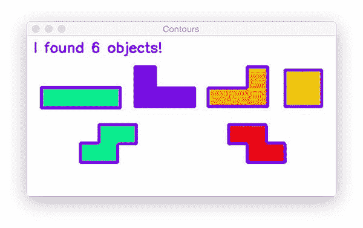](https://pyimagesearch.com/wp-content/uploads/2018/05/opencv_tutorial_object_counting.jpg)

**Figure 21:** Counting contours with OpenCV is as easy as finding them and then calling `len(cnts)`.

### 侵蚀和膨胀

腐蚀和膨胀通常用于减少二进制图像中的噪声(阈值处理的副作用)。

为了减小前景对象的尺寸，我们可以在给定迭代次数的情况下侵蚀掉像素:

```py
# we apply erosions to reduce the size of foreground objects
mask = thresh.copy()
mask = cv2.erode(mask, None, iterations=5)
cv2.imshow("Eroded", mask)
cv2.waitKey(0)

```

在**第 59 行**我们复制了`thresh`图像，并将其命名为`mask`。

然后，利用`cv2.erode`，我们继续用 5 个`iterations` ( **线 60** )减少轮廓尺寸。

如**图 22** 所示，从俄罗斯方块轮廓生成的遮罩略小:

[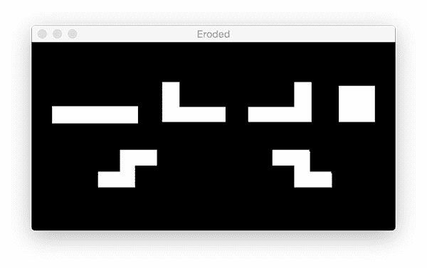](https://pyimagesearch.com/wp-content/uploads/2018/05/opencv_tutorial_erosion.jpg)

**Figure 22:** Using OpenCV we can erode contours, effectively making them smaller or causing them to disappear completely with sufficient iterations. This is typically useful for removing small blobs in mask image.

类似地，我们可以在蒙版中突出区域。要放大区域，只需使用`cv2.dilate`:

```py
# similarly, dilations can increase the size of the ground objects
mask = thresh.copy()
mask = cv2.dilate(mask, None, iterations=5)
cv2.imshow("Dilated", mask)
cv2.waitKey(0)

```

[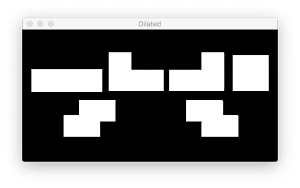](https://pyimagesearch.com/wp-content/uploads/2018/05/opencv_tutorial_dilation.jpg)

**Figure 23:** In an image processing pipeline if you ever have the need to connect nearby contours, you can apply dilation to the image. Shown in the figure is the result of dilating contours with five iterations, but not to the point of two contours becoming one.

### 屏蔽和位运算

蒙版允许我们“屏蔽掉”图像中我们不感兴趣的区域。我们称之为“遮罩”,因为它们会隐藏图像中我们不关心的区域。

如果我们使用图 18 中**的阈值图像，并用原始图像遮盖它，我们会看到**图 23** :**

[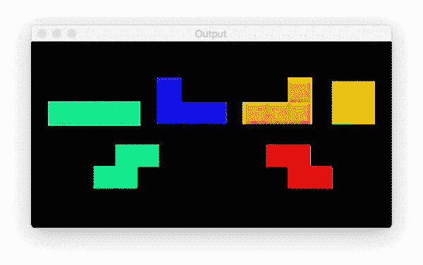](https://pyimagesearch.com/wp-content/uploads/2018/05/opencv_tutorial_bitwise_masking.jpg)

**Figure 24:** When using the thresholded image as the mask in comparison to our original image, the colored regions reappear as the rest of the image is “masked out”. This is, of course, a simple example, but as you can imagine, masks are very powerful.

在**图 24** 中，背景现在是黑色的，我们的前景由彩色像素组成——任何被我们的`mask`图像掩盖的像素。

让我们来学习如何实现这一点:

```py
# a typical operation we may want to apply is to take our mask and
# apply a bitwise AND to our input image, keeping only the masked
# regions
mask = thresh.copy()
output = cv2.bitwise_and(image, image, mask=mask)
cv2.imshow("Output", output)
cv2.waitKey(0)

```

通过复制二进制`thresh`图像(**第 73 行**)来生成`mask`。

在那里，我们使用`cv2.bitwise_and`将两幅图像的像素按位进行 AND 运算。

结果就是上面的**图 24** ，现在我们只显示/突出显示俄罗斯方块。

### 运行第二个 OpenCV 教程 Python 脚本

要运行第二个脚本，请确保您位于包含下载的源代码和 Python 脚本的文件夹中。从那里，我们将打开一个终端，提供脚本名称+ [命令行参数](https://pyimagesearch.com/2018/03/12/python-argparse-command-line-arguments/):

```py
$ python opencv_tutorial_02.py --image tetris_blocks.png

```

参数标志是`--image`，图像参数本身是`tetris_blocks.png`——目录中相关文件的路径。

这个脚本没有终端输出。同样，要循环浏览图像，请确保您点击了一个图像窗口以激活它，从那里您可以按下一个键，它将被捕获以前进到脚本中的下一个`waitKey(0)`。当程序运行结束时，您的脚本将优雅地退出，您的终端中将出现一个新的 bash 提示行。

下面我在我们的示例脚本中加入了一个基本 OpenCV 图像处理步骤的 GIF 动画:

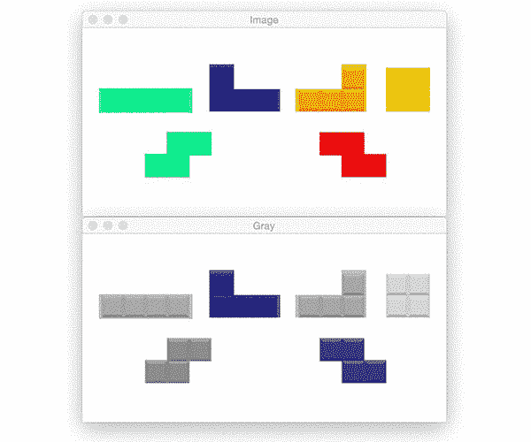

**Figure 25:** Learning OpenCV and the basics of computer vision by counting objects via contours.

## 摘要

在今天的博文中，您学习了使用 Python 编程语言进行图像处理和 OpenCV 的基础知识。

现在，您已经准备好开始使用这些图像处理操作作为“构建模块”,您可以将它们链接在一起，构建一个实际的计算机视觉应用程序——这类项目的一个很好的例子是我们通过计算轮廓创建的基本对象计数器。

希望这篇教程对你学习 OpenCV 有所帮助！

**在 PyImageSearch 上发布 OpenCV 博客文章时，我们会通知您，*请在下面的表格中输入您的电子邮件地址！*****