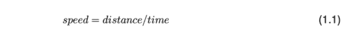
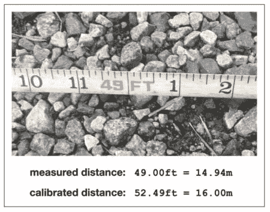
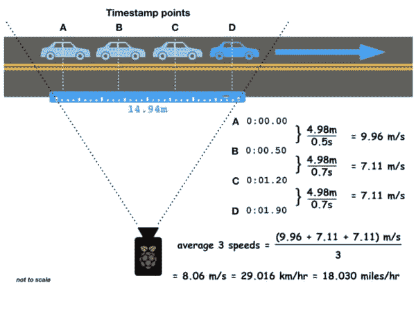
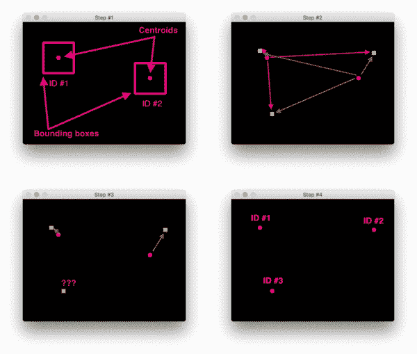
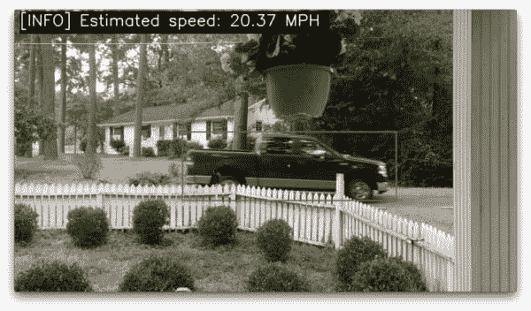
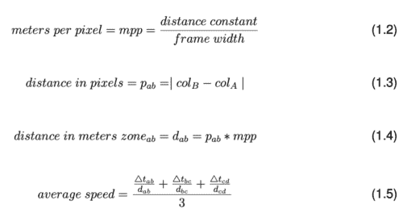
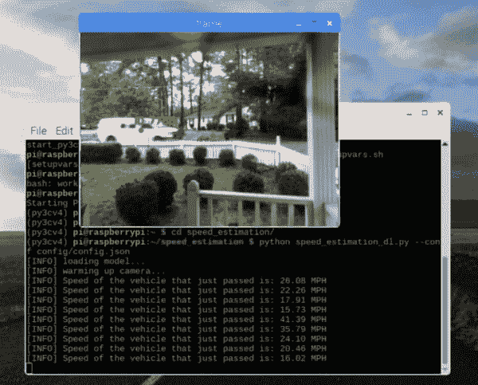
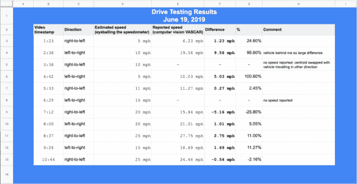

# OpenCV 车辆检测、跟踪和速度估计

> 原文：<https://pyimagesearch.com/2019/12/02/opencv-vehicle-detection-tracking-and-speed-estimation/>

在本教程中，您将学习如何使用 OpenCV 和深度学习来检测视频流中的车辆，跟踪它们，并应用速度估计来检测移动车辆的 MPH/KPH。

本教程的灵感来自 PyImageSearch 的读者，他们给我发邮件询问速度估计计算机视觉解决方案。

当行人带着狗去散步，护送我们的孩子去学校，或者早上去我们的工作场所时，我们都经历过由粗心的司机驾驶的不安全、快速移动的车辆，这些车辆几乎将我们撞倒。

我们中的许多人生活在公寓楼或住宅区，无知的司机无视安全，飞驰而过，以太快的速度行驶。

我们感到几乎无能为力。这些司机完全无视限速、人行横道区、学校区和“儿童玩耍”的标志。当遇到减速带时，他们会加速，就好像他们在试图呼吸新鲜空气一样！

我们能做些什么吗？

不幸的是，在大多数情况下，答案是*“不”*——当我们走在我们居住的街区时，我们必须小心翼翼地保护自己和家人。

但是，如果我们能在行动中抓住这些鲁莽的社区恶棍，并向当地政府提供关于*车辆*、*速度*和*时间*的视频证据，会怎么样呢？

事实上，我们可以。

在本教程中，我们将构建一个 OpenCV 项目:

1.  使用 MobileNet 固态硬盘和英特尔 Movidius 神经计算棒(NCS)检测视频中的车辆
2.  追踪车辆
3.  估计车辆的速度并将证据存储在云中(特别是存储在 Dropbox 文件夹中)。

一旦进入云端，你可以向你选择的任何人提供共享链接。我真诚地希望它能给你的邻居带来变化。

让我们乘坐自己的车，学习如何使用**树莓派**和**英特尔 Movidius NCS** 估算车速。

***注:**今天的教程其实是我新书中的一章，[计算机视觉的树莓派](https://pyimagesearch.com/raspberry-pi-for-computer-vision/)。这本书向您展示了如何突破 Raspberry Pi 的极限来构建真实世界的计算机视觉、深度学习和 OpenCV 项目。如果你喜欢今天的教程，一定要拿起一本书。*

## OpenCV 车辆检测、跟踪和速度估计

在本教程中，我们将回顾 VASCAR 的概念，这是一种警方使用距离和时间戳来测量移动物体速度的方法。我们还将了解这是如何导致错误的人为因素，以及我们的方法如何纠正人为错误。

从那里，我们将设计我们的计算机视觉系统来收集汽车的时间戳以测量速度(以已知的距离)。通过消除人为因素，我们的系统将依赖于我们的物理知识和软件开发技能。

我们的系统依赖于对象检测和对象跟踪的组合来在不同的路点在视频流中找到汽车。我们将简要回顾这些概念，以便我们可以构建 OpenCV 速度估计驱动程序脚本。

最后，我们将部署和测试我们的系统。所有速度测量设备(包括雷达/激光雷达)都需要校准，我们的也不例外。我们将学习如何进行路测以及如何校准我们的系统。

### 什么是 VASCAR，如何用它来测量速度？

[](https://pyimagesearch.com/wp-content/uploads/2019/12/neighborhood_speed_vascar.jpg)

**Figure 1:** Vehicle Average Speed Computer and Recorder (VASCAR) devices allow police to measure speed without RADAR or LIDAR, both of which can be detected. We will use a VASCAR-esque approach with OpenCV to detect vehicles, track them, and estimate their speeds without relying on the human component.

视觉平均速度计算机和记录器(VASCAR)是一种计算车辆速度的方法——它*不*依赖于雷达或激光雷达，但它借用了那些首字母缩写词。相反，VASCAR 是一个简单的计时装置，依赖于以下等式:

[](https://pyimagesearch.com/wp-content/uploads/2019/12/neighborhood_speed_equations1.png)

当雷达和激光雷达是非法的或者当他们不想被雷达/激光雷达检测器检测到时，警察使用 VASCAR。

为了利用 VASCAR 方法，**警察必须知道道路上两个固定点**之间的*距离*

*   当车辆通过第一个参考点时，他们按下按钮启动计时器。
*   当车辆通过第二点时，计时器停止。

速度是自动计算的，因为计算机已经知道根据**等式 1.1 的距离。**

VASCAR 测量的速度受到人为因素的严重限制。

例如，如果警察视力不好或反应时间不好怎么办

**如果他们晚按按钮(第一参考点)，然后早按按钮(第二参考点)，那么计算出的速度会比实际速度快，因为时间分量更小**。

如果警察给你开了一张罚单，上面写着 VASCAR，那么你很有可能在法庭上逃脱。你可以(也应该)与之抗争。准备好上面的**等式 1.1** ，并解释人的因素有多重要。

我们的项目依赖于 VASCAR 方法，但有四个参考点。我们将平均所有四个点之间的速度，目的是更好地估计速度。我们的系统也依赖于*距离*和*时间*组件。

关于 VASCAR 的进一步阅读，请参考 VASCAR 维基百科文章。

### 配置您的 Raspberry Pi 4 + OpenVINO 环境

[](https://pyimagesearch.com/wp-content/uploads/2019/04/openvino_install_header.png)

**Figure 2:** Configuring OpenVINO on your Raspberry Pi for detecting/tracking vehicles and measuring vehicle speed.

**本教程*需要* a `Raspberry Pi 4B`和 Movidius NCS2 (或者更高版本，一旦将来发布更快的版本)。**更低的树莓 Pi 和 NCS 型号根本不够快。另一个选择是使用功能强大的笔记本电脑/台式机，而不使用 OpenVINO。

为这个项目配置您的 Raspberry Pi 4B + Intel Movidius NCS 无疑是一项挑战。

建议你(1)拿一个 [*树莓 Pi 的副本给计算机视觉*](https://pyimagesearch.com/raspberry-pi-for-computer-vision/) ，(2)把预配置的 **[收录闪一下。img](https://pyimagesearch.com/2016/11/21/raspbian-opencv-pre-configured-and-pre-installed/)** 到你的 microSD。的。随书附赠的 img 价值连城。

对于那些固执的想要自己配置他们的 Raspberry Pi 4 + OpenVINO 的人来说，这里有一个简单的指南:

1.  前往我的 [BusterOS 安装指南](https://pyimagesearch.com/2019/09/16/install-opencv-4-on-raspberry-pi-4-and-raspbian-buster/)并按照所有指示创建一个名为 cv 的环境。确保您使用 RPi 4B 型号(1GB、2GB 或 4GB)。
2.  前往我的 [OpenVINO 安装指南](https://pyimagesearch.com/2019/04/08/openvino-opencv-and-movidius-ncs-on-the-raspberry-pi/)，创建第二个名为`openvino`的环境。请务必下载最新的 OpenVINO，而不是旧版本。

在这一点上，你的 RPi 将有*和*一个普通的 OpenCV 环境以及一个 OpenVINO-OpenCV 环境。在本教程中，您将使用`openvino`环境。

现在，只需将您的 NCS2 插入蓝色 USB 3.0 端口(以获得最高速度)，并按照教程的剩余部分进行操作。

**注意事项:**

*   某些版本的 OpenVINO 很难读取. mp4 视频。这是 PyImageSearch 已经向英特尔团队报告的一个已知 bug。我们预先配置的。img 包括一个修复程序— Abhishek Thanki 编辑了源代码，并从源代码编译了 OpenVINO。这篇博文已经够长了，所以我不能包含从源代码编译的说明。如果您遇到这个问题，请鼓励英特尔解决这个问题，或者(A)从源代码编译，或者(B)拿一份用于计算机视觉的[*Raspberry Pi*](https://pyimagesearch.com/raspberry-pi-for-computer-vision/)并使用预配置的. img
*   如果我们发现其他注意事项，我们会添加到此列表中。

### 项目结构

让我们回顾一下我们的项目结构:

```py
|-- config
|   |-- config.json
|-- pyimagesearch
|   |-- utils
|   |   |-- __init__.py
|   |   |-- conf.py
|   |-- __init__.py
|   |-- centroidtracker.py
|   |-- trackableobject.py
|-- sample_data
|   |-- cars.mp4
|-- output
|   |-- log.csv
|-- MobileNetSSD_deploy.caffemodel
|-- MobileNetSSD_deploy.prototxt
|-- speed_estimation_dl_video.py
|-- speed_estimation_dl.py

```

我们的`config.json`文件保存了所有的项目设置——我们将在下一节回顾这些配置。在 [*里面用 Python*](https://pyimagesearch.com/raspberry-pi-for-computer-vision/) 做计算机视觉的树莓 Pi，你会找到大部分章节的配置文件。您可以根据需要调整每个配置。这些以注释 JSON 或 Python 文件的形式出现。使用包`json_minify`，注释被解析出来，以便 JSON Python 模块可以将数据作为 Python 字典加载。

我们将在这个项目中同时利用`CentroidTracker`和`TrackableObject`类。质心跟踪器与*爱好者捆绑包*(第 19 和 20 章)和*黑客捆绑包*(第 13 章)中以前的人/车计数项目相同。另一方面，我们的可跟踪对象类包括我们将跟踪的附加属性，包括时间戳、位置和速度。

我的同事戴夫·霍夫曼(Dave Hoffman)家门前经过的车辆的视频剪辑样本也包括在内。

此视频用于演示目的；然而，**请注意，您不应该依赖视频文件来获得准确的速度** —除了从文件中读取帧的速度之外，视频的 FPS 也会影响速度读数。

提供的视频非常有助于确保程序按预期运行，但同样，从视频文件中获取准确的速度读数是不太可能的— **要获得准确的读数，您应该使用实时视频流。**

`output/`文件夹将存储一个日志文件`log.csv`，其中包括经过摄像机的车辆的时间戳和速度。

我们预先训练的 Caffe MobileNet SSD 对象检测器(用于检测车辆)文件包含在项目的根中。

包含一个测试脚本— `speed_estimation_dl_video.py`。除了使用预先录制的视频文件之外，它与实时脚本完全相同。请参考以下注释:

***注意:*** *OpenCV 无法根据真实帧率自动节流一个视频文件帧率。如果您使用`speed_estimation_dl_video.py`以及提供的`cars.mp4`测试文件，请记住报告的速度将是不准确的。为了获得准确的速度，你必须用一台摄像机设置完整的实验，并让真实的汽车驶过。请参考下一节“校准精度”，了解真实的现场演示，其中录制了现场系统运行的截屏。*

驾驶员脚本`speed_estimation_dl.py`与实时视频流、物体检测器交互，并使用 VASCAR 方法计算车辆速度。这是我们在 [*中为计算机视觉*](https://pyimagesearch.com/raspberry-pi-for-computer-vision/) 讲述的较长脚本之一。

### 速度估计配置文件

当我处理涉及许多可配置常量以及输入/输出文件和目录的项目时，我喜欢创建一个单独的*配置文件。*

在某些情况下，我使用 JSON，其他情况下使用 Python 文件。我们可以整天争论哪个更容易(JSON、YAML、XML 等等)。py 等。)，但是对于大多数使用 Python 的计算机视觉项目[*【Raspberry Pi】*](https://pyimagesearch.com/raspberry-pi-for-computer-vision/)中的项目，我们使用 Python 或 JSON 配置来代替冗长的命令行参数列表。

让我们回顾一下`config.json`，我们的 JSON 配置设置文件:

```py
{
    // maximum consecutive frames a given object is allowed to be
    // marked as "disappeared" until we need to deregister the object
    // from tracking
    "max_disappear": 10,

    // maximum distance between centroids to associate an object --
    // if the distance is larger than this maximum distance we'll
    // start to mark the object as "disappeared"
    "max_distance": 175,

    // number of frames to perform object tracking instead of object
    // detection
    "track_object": 4,

    // minimum confidence
    "confidence": 0.4,

    // frame width in pixels
    "frame_width": 400,

    // dictionary holding the different speed estimation columns
    "speed_estimation_zone": {"A": 120, "B": 160, "C": 200, "D": 240},

    // real world distance in meters
    "distance": 16,

    // speed limit in mph
    "speed_limit": 15,

```

“最大消失”和“最大距离”变量用于[质心跟踪和对象关联](https://pyimagesearch.com/2018/07/23/simple-object-tracking-with-opencv/):

*   当一个物体被标记为消失时，`"max_disappear"`帧计数向我们的质心跟踪器发出信号(**行 5** )。
*   `"max_distance"`值是以像素为单位的最大欧几里德距离，我们将为其关联对象质心(**第 10 行**)。如果质心超过这个距离，我们就标记这个物体消失了。

我们的`"track_object"`值代表执行物体*跟踪*而不是物体*检测* ( **行 14** )的帧数。

对每一帧执行检测对于 RPi 来说计算量太大。相反，我们使用对象跟踪器来减轻 Pi 的负载。然后，我们将每隔 *N* 帧间歇地执行对象检测，以重新关联对象并改进我们的跟踪。

`"confidence"`值是 MobileNet SSD 对物体*检测*的概率阈值。检测物体(如汽车、卡车、公共汽车等。)不满足置信度阈值的被忽略(**第 17 行**)。

每个输入帧的尺寸将被调整到`400`的`"frame_width"`(**第 20 行**)。

如前所述，我们有四个速度估计区域。**第 23 行**保存了一个分隔区域的帧列(即*y*-像素)的字典。这些列显然依赖于`"frame_width"`。

[](https://pyimagesearch.com/wp-content/uploads/2019/12/neighborhood_speed_measuring_tape_calibrated.jpg)

**Figure 3:** The camera’s FOV is measured at the roadside carefully. Oftentimes calibration is required. Refer to the *“Calibrating for Accuracy”* section to learn about the calibration procedure for neighborhood speed estimation and vehicle tracking with OpenCV.

**第 26 行**是该配置中最重要的值。您必须在道路上从车架的一侧到另一侧实际测量`"distance"`。

如果你有助手帮忙，测量会容易些。让助手看着屏幕，告诉你什么时候站在画面的最边缘。把胶带放在地上。将录像带拉到画面的另一边，直到你的助手告诉你，他们在视频流的画面边缘看到了你。**记下距离*，单位为米***——您的所有计算都将依赖于该值。

如**图 3** 所示，相对于我相机上的定位，汽车在画面中行驶的边缘之间有 49 英尺。49 英尺换算成米是 14.94 米。

那么为什么我们配置的**线 26** 反映的是`"distance": 16`？

该值已针对系统校准进行了调整。参见*“校准精度”*部分，了解如何测试和校准您的系统。其次，如果测量是在街道中心进行的(即离摄像机更远)，距离会更长。戴夫·霍夫曼在街道旁边进行了测量，这样他就不会被车撞倒了。

我们这个例子中的`speed_limit`是 15 mph(**29 线**)。行驶速度低于此速度的车辆将不会被记录。超过这个速度的车辆将被记录。如果您需要记录所有速度，您可以将该值设置为 `0`。

其余的配置设置用于在我们的屏幕上显示帧，将文件上传到云(即 Dropbox)，以及输出文件路径:

```py
    // flag indicating if the frame must be displayed
    "display": true,

    // path the object detection model
    "model_path": "MobileNetSSD_deploy.caffemodel",

    // path to the prototxt file of the object detection model
    "prototxt_path": "MobileNetSSD_deploy.prototxt",

    // flag used to check if dropbox is to be used and dropbox access
    // token
    "use_dropbox": false,
    "dropbox_access_token": "YOUR_DROPBOX_APP_ACCESS_TOKEN",

    // output directory and csv file name
    "output_path": "output",
    "csv_name": "log.csv"
}

```

如果你在**第 32 行**设置`"display"`为`true`，一个 OpenCV 窗口会显示在你的 Raspberry Pi 桌面上。

**第 35-38 行**指定了我们的 Caffe 对象检测模型和 prototxt 路径。

如果您选择`"use_dropbox"`，那么您必须将**行 42** 上的值设置为`true`，并在**行 43** 上填写您的访问令牌。车辆通过摄像头的视频将被记录到 Dropbox。确保您有视频的配额！

**第 46 和 47 行**指定日志文件的`"output_path"`。

### 相机定位和常数

[](https://pyimagesearch.com/wp-content/uploads/2019/12/neighborhood_speed_physics_not_cal.jpg)

**Figure 4:** This OpenCV vehicle speed estimation project assumes the camera is aimed perpendicular to the road. Timestamps of a vehicle are collected at waypoints ABCD or DCBA. From there, our `speed = distance / time` equation is put to use to calculate 3 speeds among the 4 waypoints. Speeds are averaged together and converted to km/hr and miles/hr. As you can see, the distance measurement is different depending on where (edges or centerline) the tape is laid on the ground/road. We will account for this by calibrating our system in the *“Calibrating for Accuracy”* section.

**图 4** 显示了项目布局的俯视图。在戴夫·霍夫曼的房子里，RPi 和摄像机就放在他面向马路的窗户里。`"distance"`的测量是在 FOV 线远处的路边拍摄的。点 *A、B、C、*和 *D* 标记一帧中的列。它们应该在你的视频帧中等距分布(在配置中用`"speed_estimation_zone"`像素列表示)。

汽车以任一方向通过 FOV，而 MobileNet SSD 物体检测器结合物体跟踪器，有助于在点 *ABCD* (从左至右)或 *DCBA* (从右至左)获取时间戳。

### 质心跟踪器

[](https://pyimagesearch.com/wp-content/uploads/2019/12/neighboorhood_speed_centroid_tracking_steps.png)

**Figure 5:** *Top-left*: To build a simple object tracking algorithm using centroid tracking, the first step is to accept bounding box coordinates from an object detector and use them to compute centroids. *Top-right*: In the next input frame, three objects are now present. We need to compute the Euclidean distances between each pair of original centroids (*circle*) and new centroids (*square*). *Bottom-left*: Our simple centroid object tracking method has associated objects with minimized object distances. What do we do about the object in the bottom left though? *Bottom-right*: We have a new object that wasn’t matched with an existing object, so it is registered as object ID #3.

通过质心关联进行物体跟踪是一个我们已经在 PyImageSearch 上介绍过的概念[，但是，让我们花点时间来回顾一下。](https://pyimagesearch.com/2018/07/23/simple-object-tracking-with-opencv/)

简单的对象跟踪算法依赖于保持对对象质心的跟踪。

通常一个*物体跟踪器*与一个效率较低的*物体探测器*携手工作。*物体探测器*负责定位物体。*对象跟踪器*负责通过分配和维护标识号(id)来跟踪哪个对象是哪个对象。

我们正在实现的这个对象跟踪算法被称为*质心跟踪*，因为它依赖于(1) *现有*对象质心(即质心跟踪器之前已经看到的对象)和(2)视频中后续帧之间的新对象质心之间的欧几里德距离。质心跟踪算法是一个多步骤的过程。这五个步骤包括:

1.  **步骤#1:** 接受边界框坐标并计算质心
2.  **步骤#2:** 计算新边界框和现有对象之间的欧几里德距离
3.  **步骤#3:** 更新 *(x，y)*-已有物体的坐标
4.  **步骤#4:** 注册新对象
5.  **步骤#5:** 注销旧对象

PyImageSearch 上的以下资源涵盖了`CentroidTracker`类:

*   [*用 OpenCV 进行简单的物体跟踪*](https://pyimagesearch.com/2018/07/23/simple-object-tracking-with-opencv/)
*   [*OpenCV 人物计数器*](https://pyimagesearch.com/2018/08/13/opencv-people-counter/)
*   [*计算机视觉的覆盆子*](https://pyimagesearch.com/raspberry-pi-for-computer-vision/) :
    *   *创建一个人/脚步计数器*—*爱好者捆绑包第 19 章*
    *   *建立一个交通计数器*—*爱好者捆绑包第二十章*
    *   构建一个邻居车辆速度监控器——*黑客捆绑包第七章*
    *   *使用 Movidius NCS 进行目标检测*—*黑客捆绑包第十三章*

### 用 OpenCV 跟踪物体进行速度估计

为了跟踪和计算视频流中对象的速度，我们需要一种简单的方法来存储关于对象本身的信息，包括:

*   它的对象 ID。
*   它以前的质心(所以我们可以很容易地计算出物体移动的方向)。
*   对应于框架中四列中每一列的时间戳字典。
*   *x* 的字典——物体的坐标位置。这些位置反映了记录时间戳的实际位置，因此可以精确计算速度。
*   最后一个布尔点作为一个标志，表示对象已经通过了帧中的最后一个路点(即列)。
*   以英里/小时和 KMPH 为单位的计算速度。我们计算两者，用户可以通过对驱动程序脚本的小修改来选择他/她更喜欢使用哪一个。
*   一个布尔值，表示速度是否已被估计(即计算)。
*   一个布尔值，表示速度是否已记录在`.csv`日志文件中。
*   对象穿过 FOV 的方向(从左到右或从右到左)。

为了实现所有这些目标，我们可以定义一个`TrackableObject`的实例—打开`trackableobject.py`文件并插入以下代码:

```py
# import the necessary packages
import numpy as np

class TrackableObject:
    def __init__(self, objectID, centroid):
        # store the object ID, then initialize a list of centroids
        # using the current centroid
        self.objectID = objectID
        self.centroids = [centroid]

        # initialize a dictionaries to store the timestamp and
        # position of the object at various points
        self.timestamp = {"A": 0, "B": 0, "C": 0, "D": 0}
        self.position = {"A": None, "B": None, "C": None, "D": None}
        self.lastPoint = False

        # initialize the object speeds in MPH and KMPH
        self.speedMPH = None
        self.speedKMPH = None

        # initialize two booleans, (1) used to indicate if the
        # object's speed has already been estimated or not, and (2)
        # used to indidicate if the object's speed has been logged or
        # not
        self.estimated = False
        self.logged = False

        # initialize the direction of the object
        self.direction = None

```

`TrackableObject`构造函数接受一个`objectID`和一个`centroid`。`centroids`列表将包含一个对象的质心位置历史。

我们将有多个可跟踪对象——在帧中被跟踪的每辆汽车一个。每个对象将具有显示在第 8-29 行的**属性(详见上文)**

**第 18 行和第 19 行**以英里/小时和 KMPH 为单位保存速度。我们需要一个函数来计算速度，所以现在让我们定义这个函数:

```py
    def calculate_speed(self, estimatedSpeeds):
        # calculate the speed in KMPH and MPH
        self.speedKMPH = np.average(estimatedSpeeds)
        MILES_PER_ONE_KILOMETER = 0.621371
        self.speedMPH = self.speedKMPH * MILES_PER_ONE_KILOMETER

```

**第 33 行**将`speedKMPH`属性计算为四个点之间三个`estimatedSpeeds`的`average`(作为参数传递给函数)。

一公里有`0.621371`英里(**34 线**)。了解了这一点，**第 35 行**计算了`speedMPH`属性。

### 基于计算机视觉和 OpenCV 的速度估计

[](https://pyimagesearch.com/wp-content/uploads/2019/12/neighborhood_speed_output.jpg)

**Figure 6:** OpenCV vehicle detection, tracking, and speed estimation with the Raspberry Pi.

在我们开始编写我们的驱动程序脚本之前，让我们**回顾一下我们的算法**:

*   我们的速度公式是`speed = distance / time`(方程式 1.1)。
*   我们有一个已知的常数`distance`,是用路边的卷尺测量的。摄像机将垂直于距离测量面向没有障碍物阻挡的道路。
*   通过将距离常数除以以像素为单位的帧宽度来计算每像素米数(等式 1.2)。
*   以像素为单位的距离计算为质心经过区域的列时的差(等式 1.3)。然后计算特定区域的米距离(等式 1.4)。
*   当汽车穿过 FOV，经过视频帧的四个路点列时，将收集四个时间戳( *t* )。
*   四个时间戳中的三对将用于确定三个*δt*值。
*   我们将为每对时间戳和估计距离计算三个速度值(如等式 1.5 的分子所示)。
*   三个速度估计值将被平均为总速度(方程式 1.5)。
*   `speed`被转换并作为`speedMPH`或`speedKMPH`在`TrackableObject`类中可用。我们将以每小时英里数显示速度。如果您更喜欢记录和显示每小时公里数，则需要对脚本进行一些小的修改——请确保在学习本教程时阅读注释。

以下等式代表我们的算法:

[](https://pyimagesearch.com/wp-content/uploads/2019/12/neighborhood_speed_equations2.png)

既然我们已经理解了计算车辆速度的方法，并且我们已经定义了`CentroidTracker`和`TrackableObject`类，那么让我们开始我们的速度估计驱动程序脚本。

打开一个名为`speed_estimation_dl.py`的新文件，插入以下几行:

```py
# import the necessary packages
from pyimagesearch.centroidtracker import CentroidTracker
from pyimagesearch.trackableobject import TrackableObject
from pyimagesearch.utils import Conf
from imutils.video import VideoStream
from imutils.io import TempFile
from imutils.video import FPS
from datetime import datetime
from threading import Thread
import numpy as np
import argparse
import dropbox
import imutils
import dlib
import time
import cv2
import os

```

**第 2-17 行**处理我们的导入，包括用于对象跟踪的`CentroidTracker`和`TrackableObject`。戴维斯·金的`dlib`中的相关跟踪器也是我们的对象跟踪方法的一部分。我们将使用`dropbox` API 将数据存储在云中一个单独的`Thread`中，这样就不会中断主线程的执行流程。

现在让我们实现`upload_file`函数:

```py
def upload_file(tempFile, client, imageID):
    # upload the image to Dropbox and cleanup the tempory image
    print("[INFO] uploading {}...".format(imageID))
    path = "/{}.jpg".format(imageID)
    client.files_upload(open(tempFile.path, "rb").read(), path)
    tempFile.cleanup()

```

我们的`upload_file`函数将在一个或多个单独的线程中运行。它接受`tempFile`对象、Dropbox `client`对象和`imageID`作为参数。使用这些参数，它构建一个`path`，然后将文件上传到 Dropbox ( **第 22 行和第 23 行**)。从那里， **Line 24** 然后从本地存储中删除临时文件。

让我们继续加载我们的配置:

```py
# construct the argument parser and parse the arguments
ap = argparse.ArgumentParser()
ap.add_argument("-c", "--conf", required=True,
    help="Path to the input configuration file")
args = vars(ap.parse_args())

# load the configuration file
conf = Conf(args["conf"])

```

**第 27-33 行**解析`--conf`命令行参数并将配置内容加载到`conf`字典中。

然后，如果需要，我们将初始化预训练的 MobileNet SSD `CLASSES`和 Dropbox `client`:

```py
# initialize the list of class labels MobileNet SSD was trained to
# detect
CLASSES = ["background", "aeroplane", "bicycle", "bird", "boat",
    "bottle", "bus", "car", "cat", "chair", "cow", "diningtable",
    "dog", "horse", "motorbike", "person", "pottedplant", "sheep",
    "sofa", "train", "tvmonitor"]

# check to see if the Dropbox should be used
if conf["use_dropbox"]:
    # connect to dropbox and start the session authorization process
    client = dropbox.Dropbox(conf["dropbox_access_token"])
    print("[SUCCESS] dropbox account linked")

```

从那里，我们将加载我们的对象检测器并初始化我们的视频流:

```py
# load our serialized model from disk
print("[INFO] loading model...")
net = cv2.dnn.readNetFromCaffe(conf["prototxt_path"],
    conf["model_path"])
net.setPreferableTarget(cv2.dnn.DNN_TARGET_MYRIAD)

# initialize the video stream and allow the camera sensor to warmup
print("[INFO] warming up camera...")
#vs = VideoStream(src=0).start()
vs = VideoStream(usePiCamera=True).start()
time.sleep(2.0)

# initialize the frame dimensions (we'll set them as soon as we read
# the first frame from the video)
H = None
W = None

```

**第 50-52 行**加载 MobileNet SSD `net`并将目标处理器设置为 Movidius NCS Myriad。

使用 Movidius NCS 协处理器( **Line 52** )可确保我们的 FPS 足够高，能够进行精确的速度计算。换句话说，如果我们在帧捕获之间有延迟，我们的时间戳可能会变得不同步，并导致不准确的速度读数。如果您喜欢使用笔记本电脑/台式机进行处理(即没有 OpenVINO 和 Movidius NCS)，请务必删除**第 52 行**。

**第 57-63 行**初始化 Raspberry Pi 视频流和帧尺寸。

我们还有一些初始化要处理:

```py
# instantiate our centroid tracker, then initialize a list to store
# each of our dlib correlation trackers, followed by a dictionary to
# map each unique object ID to a TrackableObject
ct = CentroidTracker(maxDisappeared=conf["max_disappear"],
    maxDistance=conf["max_distance"])
trackers = []
trackableObjects = {}

# keep the count of total number of frames
totalFrames = 0

# initialize the log file
logFile = None

# initialize the list of various points used to calculate the avg of
# the vehicle speed
points = [("A", "B"), ("B", "C"), ("C", "D")]

# start the frames per second throughput estimator
fps = FPS().start()

```

出于目标跟踪的目的，**行 68-71** 初始化我们的`CentroidTracker`、`trackers`列表和`trackableObjects`字典。

**线 74** 初始化一个`totalFrames`计数器，该计数器将在每次捕获一帧时递增。我们将使用该值来计算何时执行对象*检测*和对象*跟踪*。

我们的`logFile`对象将在稍后打开(**第 77 行**)。

我们的速度将基于我们框架中的 *ABCD* 列点。**第 81 行**初始化一个将被计算速度的`points`对列表。给定我们的四个点，我们可以计算三个估计速度，然后将它们平均。

第 84 行初始化我们的 FPS 计数器。

完成所有的初始化后，让我们开始在帧上循环:

```py
# loop over the frames of the stream
while True:
    # grab the next frame from the stream, store the current
    # timestamp, and store the new date
    frame = vs.read()
    ts = datetime.now()
    newDate = ts.strftime("%m-%d-%y")

    # check if the frame is None, if so, break out of the loop
    if frame is None:
        break

    # if the log file has not been created or opened
    if logFile is None:
        # build the log file path and create/open the log file
        logPath = os.path.join(conf["output_path"], conf["csv_name"])
        logFile = open(logPath, mode="a")

        # set the file pointer to end of the file
        pos = logFile.seek(0, os.SEEK_END)

        # if we are using dropbox and this is a empty log file then
        # write the column headings
        if conf["use_dropbox"] and pos == 0:
            logFile.write("Year,Month,Day,Time,Speed (in MPH),ImageID\n")

        # otherwise, we are not using dropbox and this is a empty log
        # file then write the column headings
        elif pos == 0:
            logFile.write("Year,Month,Day,Time (in MPH),Speed\n")

```

我们的帧处理循环从**行 87** 开始。我们首先获取一个`frame`并获取我们的第一个时间戳(**第 90-92 行**)。

**第 99-115 行**初始化我们的`logFile`和`write`列标题。注意，如果我们使用 Dropbox，CSV 中会出现一个额外的列——图像 ID。

***注:**如果您更喜欢以千米/小时记录速度，请务必更新**行 110** 和**行 115** 上的 CSV 列标题。*

让我们预处理我们的`frame`并执行一些初始化:

```py
    # resize the frame
    frame = imutils.resize(frame, width=conf["frame_width"])
    rgb = cv2.cvtColor(frame, cv2.COLOR_BGR2RGB)

    # if the frame dimensions are empty, set them
    if W is None or H is None:
        (H, W) = frame.shape[:2]
        meterPerPixel = conf["distance"] / W

    # initialize our list of bounding box rectangles returned by
    # either (1) our object detector or (2) the correlation trackers
    rects = []

```

**第 118 行**直接从配置文件中的`"frame_width"`值调整我们的框架到一个已知的宽度。

***注意:**如果您在配置中更改了`"frame_width"`，请务必同时更新`"speed_estimation_zone"`列。*

**第 119 行**为 dlib 的相关跟踪器将`frame`转换为 RGB 格式。

**第 122-124 行**初始化框架尺寸并计算`meterPerPixel`。每像素米值有助于计算四个点中的三个估计速度。

***注意:**如果您的镜头引入了失真(即广角镜头或鱼眼)，您应该考虑通过内部/外部相机参数进行适当的相机校准，以便`meterPerPixel`值更加准确。校准将是未来 PyImageSearch 博客的主题。*

第 128 行初始化一个空列表来保存由(1)我们的对象检测器或(2)相关跟踪器返回的边界框矩形。

此时，我们准备执行**对象检测**来更新我们的`trackers`:

```py
    # check to see if we should run a more computationally expensive
    # object detection method to aid our tracker
    if totalFrames % conf["track_object"] == 0:
        # initialize our new set of object trackers
        trackers = []

        # convert the frame to a blob and pass the blob through the
        # network and obtain the detections
        blob = cv2.dnn.blobFromImage(frame, size=(300, 300),
            ddepth=cv2.CV_8U)
        net.setInput(blob, scalefactor=1.0/127.5, mean=[127.5,
            127.5, 127.5])
        detections = net.forward()

```

按照**线 132** ，物体跟踪 willy 只发生在`"track_object"`的倍数上。仅每隔 *N* 帧执行对象*检测*减少了昂贵的推断操作。我们将尽可能执行对象*跟踪*以减少计算量。

**第 134 行**初始化我们的新对象列表`trackers`以更新精确的边界框矩形，以便相关跟踪可以稍后完成它的工作。

**第 138-142 行**使用 Movidius NCS 执行推理。

让我们遍历`detections`并更新我们的`trackers`:

```py
        # loop over the detections
        for i in np.arange(0, detections.shape[2]):
            # extract the confidence (i.e., probability) associated
            # with the prediction
            confidence = detections[0, 0, i, 2]

            # filter out weak detections by ensuring the `confidence`
            # is greater than the minimum confidence
            if confidence > conf["confidence"]:
                # extract the index of the class label from the
                # detections list
                idx = int(detections[0, 0, i, 1])

                # if the class label is not a car, ignore it
                if CLASSES[idx] != "car":
                    continue

                # compute the (x, y)-coordinates of the bounding box
                # for the object
                box = detections[0, 0, i, 3:7] * np.array([W, H, W, H])
                (startX, startY, endX, endY) = box.astype("int")

                # construct a dlib rectangle object from the bounding
                # box coordinates and then start the dlib correlation
                # tracker
                tracker = dlib.correlation_tracker()
                rect = dlib.rectangle(startX, startY, endX, endY)
                tracker.start_track(rgb, rect)

                # add the tracker to our list of trackers so we can
                # utilize it during skip frames
                trackers.append(tracker)

```

**行 145** 开始检测循环。

**第 148-159 行**根据`"confidence"`阈值和`CLASSES`类型过滤检测。我们只寻找使用我们预训练的 MobileNet 固态硬盘的“汽车”类。

**第 163 和 164 行**计算对象的边界框。

然后，我们初始化 dlib 关联`tracker`，并开始跟踪由我们的对象检测器找到的`rect`ROI(**行 169-171** )。第 175 行将`tracker`添加到我们的`trackers`列表中。

现在让我们来处理事件，我们将执行**对象跟踪**而不是对象检测:

```py
    # otherwise, we should utilize our object *trackers* rather than
    # object *detectors* to obtain a higher frame processing
    # throughput
    else:
        # loop over the trackers
        for tracker in trackers:
            # update the tracker and grab the updated position
            tracker.update(rgb)
            pos = tracker.get_position()

            # unpack the position object
            startX = int(pos.left())
            startY = int(pos.top())
            endX = int(pos.right())
            endY = int(pos.bottom())

            # add the bounding box coordinates to the rectangles list
            rects.append((startX, startY, endX, endY))

    # use the centroid tracker to associate the (1) old object
    # centroids with (2) the newly computed object centroids
    objects = ct.update(rects)

```

对象跟踪在我们的 RPi 上的计算量较小，所以大多数时候(即除了每隔 *N* `"track_object"`帧)我们将执行*跟踪*。

**第 180-185 行**循环显示可用的`trackers`和`update`每个对象的位置。

**第 188-194 行**将对象的边界框坐标添加到`rects`列表。

**行 198** 然后使用物体*检测*或物体*跟踪* `rects`来更新`CentroidTracker`的`objects`。

现在让我们循环一遍`objects`，并逐步计算速度:

```py
    # loop over the tracked objects
    for (objectID, centroid) in objects.items():
        # check to see if a trackable object exists for the current
        # object ID
        to = trackableObjects.get(objectID, None)

        # if there is no existing trackable object, create one
        if to is None:
            to = TrackableObject(objectID, centroid)

```

每个可跟踪对象都有一个关联的`objectID`。**第 204-208 行**如有必要，创建一个可跟踪对象(带 ID)。

从这里，我们将检查是否已经估计了这个可跟踪对象的速度:

```py
        # otherwise, if there is a trackable object and its speed has
        # not yet been estimated then estimate it
        elif not to.estimated:
            # check if the direction of the object has been set, if
            # not, calculate it, and set it
            if to.direction is None:
                y = [c[0] for c in to.centroids]
                direction = centroid[0] - np.mean(y)
                to.direction = direction

```

如果还没有估计出速度(**行 212** ，那么我们首先需要确定物体运动的`direction`(**行 215-218** )。

正值表示从左向右移动，负值表示从右向左移动。

知道方向是很重要的，这样我们就可以正确估计两点之间的速度。

有了`direction`,现在让我们收集我们的时间戳:

```py
            # if the direction is positive (indicating the object
            # is moving from left to right)
            if to.direction > 0:
                # check to see if timestamp has been noted for
                # point A
                if to.timestamp["A"] == 0 :
                    # if the centroid's x-coordinate is greater than
                    # the corresponding point then set the timestamp
                    # as current timestamp and set the position as the
                    # centroid's x-coordinate
                    if centroid[0] > conf["speed_estimation_zone"]["A"]:
                        to.timestamp["A"] = ts
                        to.position["A"] = centroid[0]

                # check to see if timestamp has been noted for
                # point B
                elif to.timestamp["B"] == 0:
                    # if the centroid's x-coordinate is greater than
                    # the corresponding point then set the timestamp
                    # as current timestamp and set the position as the
                    # centroid's x-coordinate
                    if centroid[0] > conf["speed_estimation_zone"]["B"]:
                        to.timestamp["B"] = ts
                        to.position["B"] = centroid[0]

                # check to see if timestamp has been noted for
                # point C
                elif to.timestamp["C"] == 0:
                    # if the centroid's x-coordinate is greater than
                    # the corresponding point then set the timestamp
                    # as current timestamp and set the position as the
                    # centroid's x-coordinate
                    if centroid[0] > conf["speed_estimation_zone"]["C"]:
                        to.timestamp["C"] = ts
                        to.position["C"] = centroid[0]

                # check to see if timestamp has been noted for
                # point D
                elif to.timestamp["D"] == 0:
                    # if the centroid's x-coordinate is greater than
                    # the corresponding point then set the timestamp
                    # as current timestamp, set the position as the
                    # centroid's x-coordinate, and set the last point
                    # flag as True
                    if centroid[0] > conf["speed_estimation_zone"]["D"]:
                        to.timestamp["D"] = ts
                        to.position["D"] = centroid[0]
                        to.lastPoint = True

```

**第 222-267 行**为我们的每一列 *A、B、C、*和 *D* 收集从**从左到右**移动的汽车的时间戳。

让我们检查列 *A* 的计算:

1.  第 225 行检查是否为点 *A* 制作了时间戳，如果没有，我们将继续这样做。
2.  **行 230** 检查当前 *x* 坐标`centroid`是否大于列 *A* 。
3.  如果是这样，**行 231 和 232** 记录了一个时间戳和`centroid`的确切的*x*–`position`。
4.  列 *B、C、*和 *D* 使用相同的方法收集时间戳和位置，只有一个例外。对于 *D* 列，`lastPoint`标记为`True`。我们稍后将使用此标志来表示是时候执行速度公式计算了。

现在让我们对**从右到左**行驶的汽车(即`direction < 0`)执行相同的时间戳、位置和最后点更新:

```py
            # if the direction is negative (indicating the object
            # is moving from right to left)
            elif to.direction < 0:
                # check to see if timestamp has been noted for
                # point D
                if to.timestamp["D"] == 0 :
                    # if the centroid's x-coordinate is lesser than
                    # the corresponding point then set the timestamp
                    # as current timestamp and set the position as the
                    # centroid's x-coordinate
                    if centroid[0] < conf["speed_estimation_zone"]["D"]:
                        to.timestamp["D"] = ts
                        to.position["D"] = centroid[0]

                # check to see if timestamp has been noted for
                # point C
                elif to.timestamp["C"] == 0:
                    # if the centroid's x-coordinate is lesser than
                    # the corresponding point then set the timestamp
                    # as current timestamp and set the position as the
                    # centroid's x-coordinate
                    if centroid[0] < conf["speed_estimation_zone"]["C"]:
                        to.timestamp["C"] = ts
                        to.position["C"] = centroid[0]

                # check to see if timestamp has been noted for
                # point B
                elif to.timestamp["B"] == 0:
                    # if the centroid's x-coordinate is lesser than
                    # the corresponding point then set the timestamp
                    # as current timestamp and set the position as the
                    # centroid's x-coordinate
                    if centroid[0] < conf["speed_estimation_zone"]["B"]:
                        to.timestamp["B"] = ts
                        to.position["B"] = centroid[0]

                # check to see if timestamp has been noted for
                # point A
                elif to.timestamp["A"] == 0:
                    # if the centroid's x-coordinate is lesser than
                    # the corresponding point then set the timestamp
                    # as current timestamp, set the position as the
                    # centroid's x-coordinate, and set the last point
                    # flag as True
                    if centroid[0] < conf["speed_estimation_zone"]["A"]:
                        to.timestamp["A"] = ts
                        to.position["A"] = centroid[0]
                        to.lastPoint = True

```

**第 271-316 行**在汽车经过列 *D、C、B、*和 *A* 时获取它们的时间戳和位置(同样，用于**从右到左**跟踪)。对于 *A* 来说`lastPoint`被标记为`True`。

现在汽车的`lastPoint`是`True`，我们可以计算速度:

```py
            # check to see if the vehicle is past the last point and
            # the vehicle's speed has not yet been estimated, if yes,
            # then calculate the vehicle speed and log it if it's
            # over the limit
            if to.lastPoint and not to.estimated:
                # initialize the list of estimated speeds
                estimatedSpeeds = []

                # loop over all the pairs of points and estimate the
                # vehicle speed
                for (i, j) in points:
                    # calculate the distance in pixels
                    d = to.position[j] - to.position[i]
                    distanceInPixels = abs(d)

                    # check if the distance in pixels is zero, if so,
                    # skip this iteration
                    if distanceInPixels == 0:
                        continue

                    # calculate the time in hours
                    t = to.timestamp[j] - to.timestamp[i]
                    timeInSeconds = abs(t.total_seconds())
                    timeInHours = timeInSeconds / (60 * 60)

                    # calculate distance in kilometers and append the
                    # calculated speed to the list
                    distanceInMeters = distanceInPixels * meterPerPixel
                    distanceInKM = distanceInMeters / 1000
                    estimatedSpeeds.append(distanceInKM / timeInHours)

                # calculate the average speed
                to.calculate_speed(estimatedSpeeds)

                # set the object as estimated
                to.estimated = True
                print("[INFO] Speed of the vehicle that just passed"\
                    " is: {:.2f} MPH".format(to.speedMPH))

        # store the trackable object in our dictionary
        trackableObjects[objectID] = to

```

当可跟踪对象的(1)最后一点时间戳和位置已被记录，以及(2)速度尚未被估计时( **Line 322** )，我们将继续估计速度。

第 324 行初始化一个列表来保存三个`estimatedSpeeds`。现在来算三个估计。

**线 328** 开始在我们的*对*对`points`上循环:

我们使用`position`值(**第 330-331 行**)来计算`distanceInPixels`。如果距离是 `0`，我们就跳过这一对(**行 335 和 336** )。

接下来，我们以小时为单位计算两点之间经过的时间(**第 339-341 行**)。我们需要以小时为单位的时间，因为我们正在计算每小时*的公里数*和每小时*的英里数。*

然后，我们通过将像素距离乘以估计值`meterPerPixel`(**第 345 行和第 346 行**)来计算距离，单位为千米。回想一下`meterPerPixel`是基于(1)路边 FOV 的宽度和(2)车架的宽度。

速度通过**等式 1.1-1.4** (时间上的距离)计算，并添加到`estimatedSpeeds`列表中。

**第 350 行**调用`TrackableObject`类方法`calculate_speed`，以英里/小时和公里/小时来平均我们的三个`estimatedSpeeds`(**等式 1.5** )。

**353 线**标记速度为`estimated`。

**354 线和 355 线**然后`print`在终点站加速。

***注意:**如果您更喜欢以公里/小时为单位打印速度，请确保将字符串更新为 KMPH，并将格式变量更新为`to.speedKMPH`。*

**行 358** 将可跟踪对象存储到`trackableObjects`字典中。

唷！在这个脚本中，最难的部分不在这里。让我们总结一下，首先在`frame`上标注质心和 id:

```py
        # draw both the ID of the object and the centroid of the
        # object on the output frame
        text = "ID {}".format(objectID)
        cv2.putText(frame, text, (centroid[0] - 10, centroid[1] - 10)
            , cv2.FONT_HERSHEY_SIMPLEX, 0.5, (0, 255, 0), 2)
        cv2.circle(frame, (centroid[0], centroid[1]), 4,
            (0, 255, 0), -1)

```

在行驶的汽车质心上画一个小点，旁边是 id 号。

接下来，我们将继续更新日志文件，并将车辆图像存储在 Dropbox 中:

```py
        # check if the object has not been logged
        if not to.logged:
            # check if the object's speed has been estimated and it
            # is higher than the speed limit
            if to.estimated and to.speedMPH > conf["speed_limit"]:
                # set the current year, month, day, and time
                year = ts.strftime("%Y")
                month = ts.strftime("%m")
                day = ts.strftime("%d")
                time = ts.strftime("%H:%M:%S")

                # check if dropbox is to be used to store the vehicle
                # image
                if conf["use_dropbox"]:
                    # initialize the image id, and the temporary file
                    imageID = ts.strftime("%H%M%S%f")
                    tempFile = TempFile()
                    cv2.imwrite(tempFile.path, frame)

                    # create a thread to upload the file to dropbox
                    # and start it
                    t = Thread(target=upload_file, args=(tempFile,
                        client, imageID,))
                    t.start()

                    # log the event in the log file
                    info = "{},{},{},{},{},{}\n".format(year, month,
                        day, time, to.speedMPH, imageID)
                    logFile.write(info)

                # otherwise, we are not uploading vehicle images to
                # dropbox
                else:
                    # log the event in the log file
                    info = "{},{},{},{},{}\n".format(year, month,
                        day, time, to.speedMPH)
                    logFile.write(info)

                # set the object has logged
                to.logged = True

```

至少，每辆超过限速的车辆都将被记录在 CSV 文件中。可选地，Dropbox 将填充超速车辆的图像。

**第 369-372 行**检查可跟踪对象是否已被记录，速度是否被估计，以及汽车是否超速。

如果是这样的话**行 374-477** 从时间戳中提取`year`、`month`、`day`和`time`。

如果一个图像将被记录到 Dropbox 中，**行 381-391** 存储一个临时文件并产生一个线程将文件上传到 Dropbox。

**使用一个单独的线程来进行可能很耗时的上传是至关重要的，这样我们的主线程就不会被阻塞**，影响 FPS 和速度计算。文件名将是第 383 行**上的`imageID`，这样，如果它与日志文件相关联，以后就可以很容易地找到它。**

**第 394-404 行**将 CSV 数据写入`logFile`。如果使用 Dropbox，`imageID`是最后一个值。

***注:**如果你更喜欢记录公里每小时的速度，只需将**行 395** 和**行 403** 上的`to.speedMPH`更新为`to.speedKMPH`。*

**行 396** 将可跟踪对象标记为`logged`。

让我们总结一下:

```py
    # if the *display* flag is set, then display the current frame
    # to the screen and record if a user presses a key
    if conf["display"]:
        cv2.imshow("frame", frame)
        key = cv2.waitKey(1) & 0xFF

        # if the `q` key is pressed, break from the loop
        if key == ord("q"):
            break

    # increment the total number of frames processed thus far and
    # then update the FPS counter
    totalFrames += 1
    fps.update()

# stop the timer and display FPS information
fps.stop()
print("[INFO] elapsed time: {:.2f}".format(fps.elapsed()))
print("[INFO] approx. FPS: {:.2f}".format(fps.fps()))

# check if the log file object exists, if it does, then close it
if logFile is not None:
    logFile.close()

# close any open windows
cv2.destroyAllWindows()

# clean up
print("[INFO] cleaning up...")
vs.stop()

```

**第 411-417 行**显示带注释的`frame`并寻找`q`按键，在这种情况下我们将退出(`break`)。

**线 421 和 422** 增加`totalFrames`和`update`我们的 FPS 计数器。

当我们跳出帧处理循环时，我们执行内务处理，包括打印 FPS 统计数据、关闭我们的日志文件、销毁 GUI 窗口和停止我们的视频流(**行 424-438** )

### 车速估计部署

现在我们的代码已经实现，我们将部署和测试我们的系统。

我强烈建议你进行一些受控的飞车追逐，并调整配置文件中的变量，直到你获得准确的速度读数。

在任何微调校准之前，我们将确保程序正常工作。在尝试运行应用程序之前，请确保您满足以下要求:

*   按照**图 3** 将您的摄像机垂直对准道路。
*   确保您的摄像机视线清晰，障碍物有限——我们的物体检测器必须能够在车辆穿过摄像机视野时在多个点检测到车辆(FOV)。
*   如果你的相机放置在远离马路的地方是最好的。汽车在道路上通过的点处的点 *A* 和 *D* 彼此离得越远，*距离/时间*的计算就越准确，并产生更准确的速度读数。如果你的相机靠近道路，广角镜头是一个选择，但你需要进行相机校准(未来的 PyImageSearch 博客主题)。
*   如果您使用 Dropbox 功能，请确保您的 RPi 有可靠的 WiFi、以太网甚至蜂窝连接。
*   确保您已经在配置文件中设置了所有常量。我们可以选择在下一节中微调常数。

假设您已经满足了每一个需求，那么现在就可以部署和运行您的程序了。首先，我们必须设置我们的环境。

**[预先配置的 Raspbian。img 用户](https://pyimagesearch.com/2016/11/21/raspbian-opencv-pre-configured-and-pre-installed/) :** 请按如下方式激活您的虚拟环境:

```py
$ source ~/start_openvino.sh

```

使用该脚本可确保(1)激活虚拟环境，以及(2)加载英特尔的环境变量。

**如果你[自己安装了 open vino](https://pyimagesearch.com/2019/04/08/openvino-opencv-and-movidius-ncs-on-the-raspberry-pi/)(也就是说，你没有使用我预先配置的 Raspbian。img):** 请如下获取`setupvars.sh`脚本(根据您的脚本所在的位置调整命令):

```py
$ workon <env_name>
$ source ~/openvino/inference_engine_vpu_arm/bin/setupvars.sh

```

***注意:**您可能已经根据 [OpenVINO 安装说明](https://pyimagesearch.com/2019/04/08/openvino-opencv-and-movidius-ncs-on-the-raspberry-pi/)在您的`~/.bashrc`文件中获取了环境。在这种情况下，当您启动终端或通过 SSH 连接时，会自动设置环境变量。也就是说，您仍然需要使用`workon`命令来激活您的虚拟环境。*

同样，如果你用的是我预先配置的 Raspbian。img 带有 [*实用 Python 和 OpenCV +案例研究*](https://pyimagesearch.com/practical-python-opencv/) (快速入门和硬拷贝)和/或 [*用于计算机视觉的树莓 Pi*](https://pyimagesearch.com/raspberry-pi-for-computer-vision/)(所有捆绑包)，然后`~/start_openvino.sh`将自动调用`setupvars.sh`脚本。

如果您不执行以下任何一个步骤，您将会遇到一个`Illegal Instruction`错误。

输入以下命令启动程序并开始记录速度:

```py
$ python speed_estimation_dl.py --conf config/config.json
[INFO] loading model...
[INFO] warming  up camera...
[INFO] Speed of the vehicle that just passed is: 26.08 MPH
[INFO] Speed of the vehicle that just passed is: 22.26 MPH
[INFO] Speed of the vehicle that just passed is: 17.91 MPH
[INFO] Speed of the vehicle that just passed is: 15.73 MPH
[INFO] Speed of the vehicle that just passed is: 41.39 MPH
[INFO] Speed of the vehicle that just passed is: 35.79 MPH
[INFO] Speed of the vehicle that just passed is: 24.10 MPH
[INFO] Speed of the vehicle that just passed is: 20.46 MPH
[INFO] Speed of the vehicle that just passed is: 16.02 MPH

```

[](https://pyimagesearch.com/wp-content/uploads/2019/12/neighborhood_speed_deployment.jpg)

**Figure 7:** OpenCV vehicle speed estimation deployment. Vehicle speeds are calculated after they leave the viewing frame. Speeds are logged to CSV and images are stored in Dropbox.

如**图 7** 和视频所示，我们的 OpenCV 系统正在测量双向行驶车辆的速度。在下一部分中，我们将执行路过测试，以确保我们的系统报告准确的速度。

***注:**视频经过后期处理，用于演示。请记住，在车辆通过车架后的**之前，我们不知道车速。在视频中，车辆的速度显示为**，而**车辆在帧中，以便更好地可视化。***

***注意:*** *OpenCV 无法根据真实帧率自动节流一个视频文件帧率。如果您使用`speed_estimation_dl_video.py`以及提供的`cars.mp4`测试文件，请记住报告的速度将是不准确的。为了获得准确的速度，你必须用一台摄像机设置完整的实验，并让真实的汽车驶过。请参考下一节“校准精度”，了解真实的现场演示，其中录制了现场系统运行的截屏。要使用这个脚本，运行这个命令:`python speed_estimation_dl_video.py --conf config/config.json --input sample_data/cars.mp4`*

当多辆汽车在某一给定时间通过框架时，速度会被不准确地报告。这可能发生在我们的质心跟踪器混淆质心的时候。这是我们算法的一个已知缺点。为了解决这个问题，作为读者的你需要进行额外的算法工程。一个建议是执行[实例分割](https://pyimagesearch.com/2018/11/26/instance-segmentation-with-opencv/)来精确分割每辆车。

**学分:**

*   演示视频的音频: [BenSound](https://www.bensound.com/royalty-free-music/track/happy-rock)

### 校准准确度

[](https://pyimagesearch.com/wp-content/uploads/2019/12/neighborhood_speed_drive_test_table.png)

**Figure 8:** Neighborhood vehicle speed estimation and tracking with OpenCV drive test results.

你可能会发现该系统对经过的车辆速度的读数稍有不准确。暂时不要忽视这个项目。您可以调整配置文件，使其越来越接近准确的读数。

**我们使用以下方法校准我们的系统，直到我们的读数准确无误:**

*   开始录制 RPi 桌面的截屏，显示视频流和终端。该截屏应记录整个测试过程。
*   与此同时，在你驾驶的整个测试过程中，在你的智能手机上录制一段语音备忘录，同时说明你的驾驶速度。
*   由基于计算机视觉的 VASCAR 系统以预定速度双向驾驶。我们选择了 10 英里/小时、15 英里/小时、20 英里/小时和 25 英里/小时来比较我们的速度和 VASCAR 计算的速度。当你来回开车经过你的房子时，你的邻居可能会觉得你很奇怪，但是给他们一个美好的微笑吧！
*   将截屏与音频文件同步，以便可以播放。
*   回放带有同步音频文件的视频时，可以记下速度+/-差异。
*   根据这些信息，调整常数:
    *   (1)如果你的速度读数有点高，那么*减小*常数`"distance"`
    *   (2)相反，如果你的速度读数稍低，那么*增加*的`"distance"`常数。
*   冲洗，重复，直到你满意为止。别担心，在这个过程中你不会消耗太多的燃料。

PyImageSearch 的同事 Dave Hoffman 和 Abhishek Thanki 发现，Dave 需要将其距离常数从**14.94 米** *增加到***16.00 米**。

请务必参考以下最终测试视频，该视频对应于图 8**中表格的时间戳和速度:**

<https://www.youtube.com/embed/V5Ns3QwEj-c?feature=oembed>