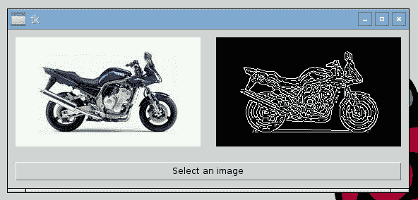
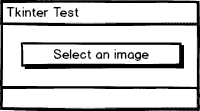
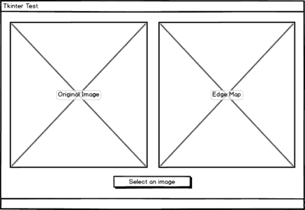
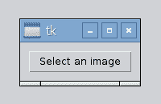
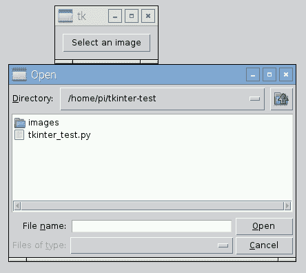
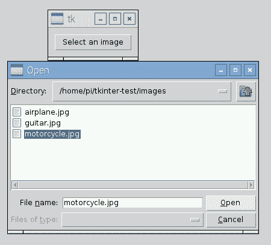
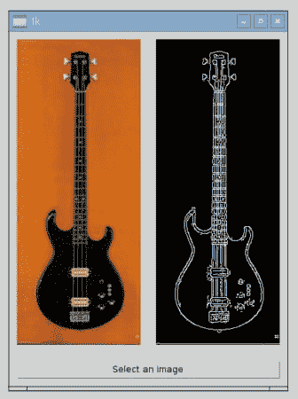

# 带 Tkinter 的 OpenCV

> 原文：<https://pyimagesearch.com/2016/05/23/opencv-with-tkinter/>



我跟你说实话。

我不是一个优秀的图形用户界面开发者。

从来没有，将来也不会有。

我喜欢偶尔用 HTML + CSS 创建用户界面，或者编写一个 WordPress 插件使其更具美感——但是我从来不喜欢编写成熟的 GUI。

也就是说，我会尽我最大的努力来写你，PyImageSearch 的观众们想听到的东西。在过去的几个月里，我收到了一堆电子邮件，询问 Python GUI 库，使用哪些库，更具体地说， ***如何将 OpenCV 与 Tkinter 集成，以在 Tkinter 面板中显示图像。***

我通常会回答:

> 我不是 GUI 开发人员，所以相信我，你不会想听我的建议的。但是如果你想用 Python 来构建图形用户界面，那么看看 [Qt](https://wiki.python.org/moin/PyQt) 、 [Tkinter](https://wiki.python.org/moin/TkInter) 和 [Kivy](https://kivy.org/#home) (如果你想构建移动/自然用户界面的话)。

尽管如此，我最终还是收到了足够多的关于 OpenCV + Tkinter 集成的邮件，这*激起了我的兴趣*和*我必须试一试*。

在接下来的两篇博文中，我将*与 Tkinter 一起玩*，开发一些简单的用户界面，并与您分享我的代码/经验。我之所以在这里强调*在*附近，是因为这些*绝不是*生产应用程序(很可能)不是 GUI 开发实践的好例子。

就像我说的，我不想假装是一个 GUI 开发者——我只是想和你分享我的经验。

## 将 OpenCV 与 Tkinter 一起使用

在本教程中，我们将使用 Tkinter Python 库构建一个简单的用户界面。这个用户界面将允许我们点击一个按钮，触发一个*文件选择器对话框*来从磁盘中选择一个文件。然后我们将使用 OpenCV 加载选中的图像，执行边缘检测，最后在 GUI 中显示*原始图像*和*边缘图*。

我已经包括了下面的第一个模型的粗略线框:



**Figure 1:** Our first screen contains only a button to load our image from disk.

当第一次加载时，我们的应用程序只包含一个允许我们从磁盘加载图像的按钮。

单击此按钮后，我们将被允许导航我们的文件系统并选择要处理的图像。然后我们将在 GUI 中显示*原始图像*和*边缘图*。



**Figure 2:** After selecting an image, we’ll display both the original image and edge map side-by-side in our GUI.

### Tkinter 是什么？

如果你之前没听说过 Tkinter，Tkinter 是围绕 [Tcl/Tk](http://www.tcl.tk/) 的一个薄薄的面向对象层。使用 Tkinter 的一个好处是，在您的系统上安装了 Tkinter 之后，您可以运行任何利用 Tcl/Tk 的 Python GUI 应用程序。

在极少数情况下，我需要为 Python 开发一个 GUI 应用程序，我倾向于使用 [Qt](https://wiki.python.org/moin/PyQt) ，但是自从我上次使用 Tkinter 以来已经有 3-4 年了，我想我应该再试一次。

### 安装 Tkinter

我个人很难在我的 OSX 机器上正确安装和配置 Tkinter，所以我决定恢复使用 Ubuntu/Raspbian。

***注:**如果你有什么好的关于在 OSX 上安装 Tkinter 和 Tcl/Tk 的教程，请在这篇博文的评论区留下链接。*

当我努力在 OSX 上安装 Tkinter 时，在 Ubuntu/Raspbian 上安装却轻而易举，只需要调用`apt-get`:

```py
$ sudo apt-get install python-tk python3-tk python-imaging-tk

```

从那里，Tkinter 顺利安装。

您还应该确保安装了一个简单的基于 Python 的图像库 [Pillow](https://python-pillow.org/) ，因为 Tkinter 将需要它来在我们的 GUI 中显示图像:

```py
$ pip install Pillow

```

我通过启动 Python shell 并导入 PIL/Pillow、Tkinter 和我的 OpenCV 绑定来验证我的安装:

```py
$ python
>>> import PIL
>>> import Tkinter
>>> import cv2
>>>

```

***注意:**我假设你的系统上已经安装了 OpenCV。如果你需要帮助配置、编译和安装 OpenCV，[请查看这个页面](https://pyimagesearch.com/opencv-tutorials-resources-guides/)，我在这里为各种系统编译了一个 OpenCV 安装说明列表。*

### 编写我们的 OpenCV + Tkinter 应用程序

我们现在已经准备好编写简单的 GUI 应用程序了。打开一个新文件，将其命名为`tkinter_test.py`，并插入以下代码:

```py
# import the necessary packages
from Tkinter import *
from PIL import Image
from PIL import ImageTk
import tkFileDialog
import cv2

def select_image():
	# grab a reference to the image panels
	global panelA, panelB

	# open a file chooser dialog and allow the user to select an input
	# image
	path = tkFileDialog.askopenfilename()

```

**第 2-6 行**导入我们需要的 Python 包。我们将需要`Tkinter`来访问我们的 GUI 功能，以及来自 PIL/Pillow 的`Image`和`ImageTk`类来在我们的 GUI 中显示图像。`tkFileDialog`允许我们浏览文件系统并选择要处理的图像。最后，我们为 OpenCV 绑定导入`cv2`。

**第 8 行**定义了我们的`select_image`功能。在这个函数中，我们分别抓取一个*全局引用*到`panelA`和`panelB`。这些是我们的*图片面板* *。*顾名思义，图像面板是用来拍摄图像，然后将其显示在我们的 GUI 中。

第一个面板`panelA`，是我们将从磁盘加载的*原始图像*，而第二个面板`panelB`，是我们将要计算的*边缘图*。

调用第 14 行**上的`tkFileDialog.askopenfilename`会打开一个**文件选择对话框**，我们可以用它来导航我们的文件系统并选择我们选择的图像。**

选择图像后，我们的程序继续:

```py
	# ensure a file path was selected
	if len(path) > 0:
		# load the image from disk, convert it to grayscale, and detect
		# edges in it
		image = cv2.imread(path)
		gray = cv2.cvtColor(image, cv2.COLOR_BGR2GRAY)
		edged = cv2.Canny(gray, 50, 100)

		# OpenCV represents images in BGR order; however PIL represents
		# images in RGB order, so we need to swap the channels
		image = cv2.cvtColor(image, cv2.COLOR_BGR2RGB)

		# convert the images to PIL format...
		image = Image.fromarray(image)
		edged = Image.fromarray(edged)

		# ...and then to ImageTk format
		image = ImageTk.PhotoImage(image)
		edged = ImageTk.PhotoImage(edged)

```

**第 17 行**确保选择了一个文件，并且我们没有点击*“取消”*按钮。假设选择了`path`，我们从磁盘加载图像，将其转换为灰度，然后使用 Canny 边缘检测器检测边缘(**第 20-22 行**)。为了简单起见，我将阈值硬编码到 Canny 边缘检测器中，但是您也可以使用`imutils`包中的`auto_canny`函数来计算边缘图*，而不需要*提供任何参数。[点击此处](https://pyimagesearch.com/2015/04/06/zero-parameter-automatic-canny-edge-detection-with-python-and-opencv/)可了解更多关于 auto-canny 功能的信息。

为了在 Tkinter GUI 中显示我们的图像，我们首先需要更改格式。首先，OpenCV 以 BGR 顺序表示图像；然而，PIL/枕头以 RGB 顺序表示图像，因此我们需要反转通道的顺序(**第 26 行**)。

从那里，我们可以将`image`和`edged`从 OpenCV 格式转换成 PIL/枕头格式(**第 29 行和第 30 行**)。然后最终将 PIL/枕头图像转换为`ImageTk`格式(**第 33 行和第 34 行**)。

我们现在准备将图像添加到我们的 GUI 中:

```py
		# if the panels are None, initialize them
		if panelA is None or panelB is None:
			# the first panel will store our original image
			panelA = Label(image=image)
			panelA.image = image
			panelA.pack(side="left", padx=10, pady=10)

			# while the second panel will store the edge map
			panelB = Label(image=edged)
			panelB.image = edged
			panelB.pack(side="right", padx=10, pady=10)

		# otherwise, update the image panels
		else:
			# update the pannels
			panelA.configure(image=image)
			panelB.configure(image=edged)
			panelA.image = image
			panelB.image = edged

```

如果各个面板都是`None`，我们需要初始化它们(**第 37-46 行**)。首先，我们为每张图片创建一个`Label`实例。然后，我们把 ***特护*** 纳入`panel.image = image`。

为什么这如此重要？

***防止 Python 的垃圾收集例程删除图像！***

如果不存储这个引用，我们的图像将被删除，我们将无法在屏幕上显示它。

否则，我们可以假设我们的图像面板已经被初始化了(**第 49-54 行**)。在这种情况下，我们需要做的就是在每个面板上调用`configure`，然后更新对图像对象的引用。

最后一步是编写实际初始化、创建和启动 GUI 进程的代码:

```py
# initialize the window toolkit along with the two image panels
root = Tk()
panelA = None
panelB = None

# create a button, then when pressed, will trigger a file chooser
# dialog and allow the user to select an input image; then add the
# button the GUI
btn = Button(root, text="Select an image", command=select_image)
btn.pack(side="bottom", fill="both", expand="yes", padx="10", pady="10")

# kick off the GUI
root.mainloop()

```

**第 57 行**初始化`root` Tkinter 窗口，而**第 58 和 59 行**初始化我们的两个图像面板。

然后我们创建一个按钮，并将其添加到 GUI 的第 64 行和第 65 行。当点击时，这个按钮将触发我们的文件选择器，允许我们浏览我们的文件系统并从磁盘中选择一个图像。

最后，**行 68** 开始 GUI 的实际主循环。

### 运行我们的 OpenCV + Tkinter GUI

要运行我们的 OpenCV + Tkinter 应用程序，只需执行以下命令:

```py
$ python tkinter_test.py

```

首先，我们的 GUI 应该包含的只是我们单击以从磁盘中选择图像的按钮:



**Figure 3:** At startup, our GUI only contains a single button, that when clicked, will prompt us to select a file from disk.

单击该按钮后，我们会看到一个文件选择器:



**Figure 4:** The file chooser allows us to navigate our file system and select an image to process.

然后，我们可以导航到想要计算边缘的图像文件，并单击*“打开”*按钮:



**Figure 5:** We can select an image to process by first highlighting the image and then clicking the *“Open”* button.

在我们的图像被选中后，使用 OpenCV 计算边缘图，*原始图像*和*边缘图*都被添加到我们的 Tkinter GUI 中:


**Figure 6:** On the *left*, we have the original, unprocessed image. Then, on the *right*, we have the edge map.

当然，我们也可以对不同的图像重复这个过程:



**Figure 7:** Loading an image, computing edges using the Canny edge detector, and then displaying the result using Tkinter and OpenCV.

让我们做最后一个例子:


**Figure 8:** Displaying images in Tkinter using OpenCV.

## 摘要

在这篇博文中，我演示了如何构建一个非常简单的 GUI 应用程序，它集成了用于计算机视觉的 OpenCV 和用于使用 Python 编程语言开发 GUI 的 Tkinter 库。

我将是第*个*说我是*而不是*GUI 开发者的人，我也没有成为一名 GUI 开发者的打算。这段代码可能远非完美——这没关系。我只是想与你分享我的经验，希望它能帮助其他更投入、更高级的 GUI 开发人员学习如何将 OpenCV 与 Tkinter 集成。

尽管如此，下周我将在 OpenCV 和 Tkinter 上写第二篇博文， ***这一次构建一个“Photo Booth”应用程序，它可以访问我们的网络摄像头，在我们的 GUI 上显示(实时)流，并且单击一个按钮就可以将流的快照保存到磁盘。***

**为了在这篇博文发表时得到通知，*请务必在下面的表格中输入您的电子邮件地址！【T2***