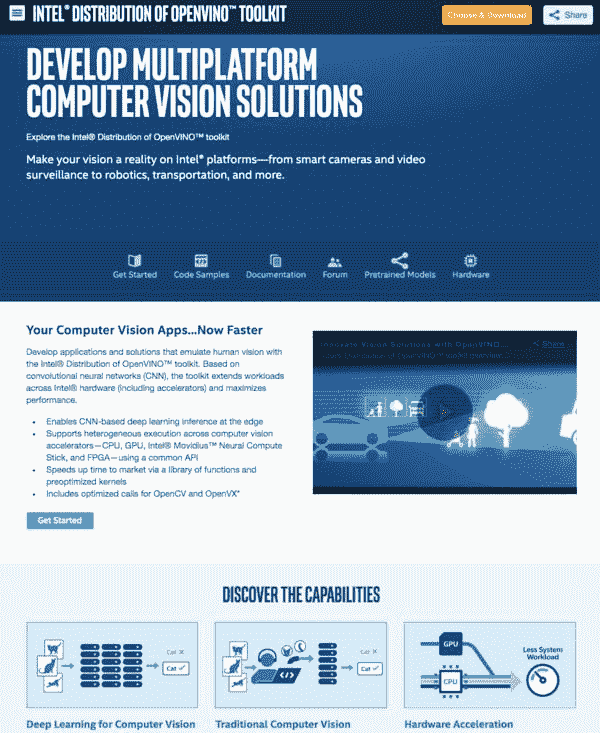
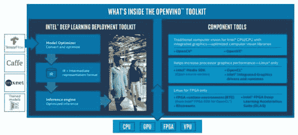
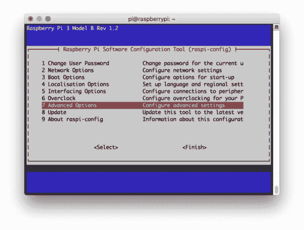
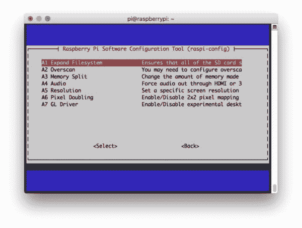
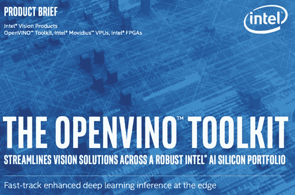
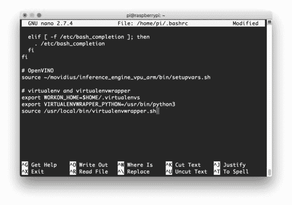
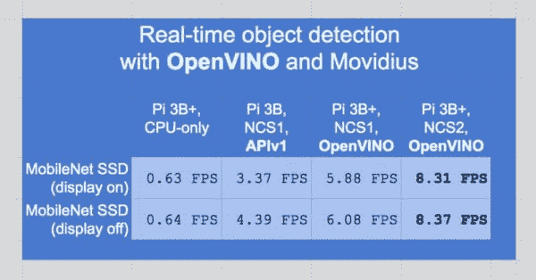
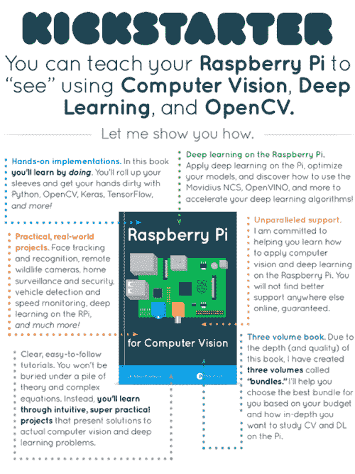

# 树莓 Pi 上的 OpenVINO、OpenCV 和 Movidius NCS

> 原文：<https://pyimagesearch.com/2019/04/08/openvino-opencv-and-movidius-ncs-on-the-raspberry-pi/>

[](https://pyimagesearch.com/wp-content/uploads/2019/04/openvino_install_header.png)

在本教程中，您将了解如何利用 OpenCV 的 OpenVINO 工具包在 Raspberry Pi 上进行更快的深度学习推理。

Raspberry Pis 很棒——我喜欢高质量的硬件和围绕设备建立的支持社区。

也就是说，对于深度学习来说，当前的 Raspberry Pi 硬件天生就是资源受限的，你将很幸运地从大多数最先进的模型(尤其是对象检测和实例/语义分割)中获得超过几个 FPS(单独使用 RPi CPU)。

从我以前的帖子中我们知道，英特尔的 Movidius 神经计算棒允许通过插入 USB 插座的深度学习协处理器进行更快的推断:

*   [*英特尔 Movidius 神经计算棒入门*](https://pyimagesearch.com/2018/02/12/getting-started-with-the-intel-movidius-neural-compute-stick/)
*   [*用 Movidius NCS 在树莓上实时检测物体*](https://pyimagesearch.com/2018/02/19/real-time-object-detection-on-the-raspberry-pi-with-the-movidius-ncs/)

自 2017 年以来，Movidius 团队一直在努力研究他们的无数处理器和消费级 USB 深度学习棒。

附带的 API 的第一个版本运行良好，展示了 Myriad 的强大功能，但仍有许多不足之处。

紧接着，Movidius APIv2 发布，受到 Movidius + Raspberry Pi 社区的欢迎。它比 APIv1 更容易/更可靠，但也存在一些问题。

但是现在，与 Movidius NCS、*尤其是 OpenCV 的*合作变得前所未有的容易。

**了解 OpenVINO，这是一个英特尔硬件优化计算机视觉库，旨在取代 V1 和 V2 API。**

英特尔转而使用 OpenVINO 软件支持 Movidius 硬件，这使得 Movidius 闪耀着金属般的蓝色光辉。

OpenVINO 使用起来非常简单——只需设置目标处理器(一个函数调用)并让 OpenVINO 优化的 OpenCV 处理剩下的事情。

但问题依然存在:

> 如何在树莓 Pi 上安装 OpenVINO？

今天我们将学习这一点，以及一个实用的对象检测演示(剧透警告:现在使用 Movidius 协处理器非常简单)。

***更新 2020-04-06:** 本教程有大量更新，以确保与 OpenVINO 4.2.0 的兼容性。*

**要了解如何在 Raspberry Pi 上安装 OpenVINO(并使用 Movidius 神经计算棒执行对象检测)，*只需遵循本教程！***

## 树莓 Pi 上的 OpenVINO、OpenCV 和 Movidius NCS

在这篇博文中，我们将讨论三个主要话题。

1.  首先，我们将了解什么是 OpenVINO，以及它是如何为树莓派带来一个非常受欢迎的范式转变。
2.  然后我们将介绍如何在您的 Raspberry Pi 上安装 OpenCV 和 OpenVINO。
3.  最后，我们将使用 OpenVINO、OpenCV 和 Movidius NCS 开发一个实时对象检测脚本。

***注:*** *我的博客上有很多树莓派的安装指南，大部分与 Movidius 无关。开始之前，请务必查看我的 **[OpenCV 安装指南](https://pyimagesearch.com/opencv-tutorials-resources-guides/)** 页面上的可用安装教程，并选择最符合您需求的一个。*

让我们开始吧。

### 什么是 OpenVINO？

[](https://pyimagesearch.com/wp-content/uploads/2019/04/openvino_install_intel_webpage.jpg)

**Figure 1:** The Intel OpenVINO toolkit optimizes your computer vision apps for Intel hardware such as the Movidius Neural Compute Stick. Real-time object detection with OpenVINO and OpenCV using Raspberry Pi and Movidius NCS sees a significant speedup. ([source](https://software.intel.com/en-us/openvino-toolkit))

英特尔的 OpenVINO 是一个针对英特尔硬件产品组合优化计算的加速库。

OpenVINO 支持英特尔 CPU、GPU、FPGAs 和 vpu。

你所依赖的深度学习库，比如 TensorFlow、Caffe 和 mxnet，都是由 OpenVINO 支持的。

[](https://pyimagesearch.com/wp-content/uploads/2019/04/openvino_install_whats_inside.jpg)

**Figure 2:** The Intel OpenVINO Toolkit supports intel CPUs, GPUs, FPGAs, and VPUs. TensorFlow, Caffe, mxnet, and OpenCV’s DNN module all are optimized and accelerated for Intel hardware. The Movidius line of vision processing units (VPUs) are supported by OpenVINO and pair well with the Raspberry Pi. (source: [OpenVINO Product Brief](https://www.intel.in/content/www/in/en/internet-of-things/solution-briefs/openvino-toolkit-product-brief.html))

**英特尔甚至优化了 OpenCV 的 DNN 模块，以支持其深度学习硬件。**

事实上，许多较新的智能相机使用英特尔的硬件和 OpenVINO 工具包。OpenVINO 是**边缘计算**和**物联网**的最佳选择——它使资源受限的设备(如 Raspberry Pi)能够与 Movidius 协处理器一起工作，以对现实世界应用有用的速度执行深度学习。

我们将在树莓 Pi 上安装 OpenVINO，这样它就可以在下一节中与 Movidius VPU(视觉处理单元)一起使用。

请务必阅读 [OpenVINO 产品简介 PDF，了解更多信息](https://www.intel.in/content/www/in/en/internet-of-things/solution-briefs/openvino-toolkit-product-brief.html)。

### 在树莓 Pi 上安装 OpenVINO 的优化 OpenCV

在这一节中，我们将介绍在您的 Raspberry Pi 上安装 OpenCV 和 OpenVINO 所需的先决条件和所有步骤。

在开始之前，请务必通读这一节，以便熟悉所需的步骤。

我们开始吧。

#### 硬件、假设和先决条件

在本教程中，我将假设您拥有以下硬件:

*   **树莓 4B 或 3B+** (运行 Raspbian Buster)
*   Movidius NCS 2 (或 Movidius NCS 1)
*   皮卡梅拉·V2(或 USB 网络摄像头)
*   **32GB microSD 卡*带* Raspbian 弹力刚闪**
*   **HDMI 屏幕+键盘/鼠标**(至少对于初始 WiFi 配置)
*   **5V 电源**(我推荐 2.5A 电源，因为 Movidius NCS 很耗电)

如果你没有新刻录的 Raspbian Stretch 的 microSD，你可以[在这里](https://www.raspberrypi.org/downloads/raspbian/)下载。我建议完全安装:

[](https://pyimagesearch.com/wp-content/uploads/2019/09/install_opencv4_buster_download_os.jpg)

**Figure 3:** Download Raspbian Buster for OpenVINO on your Raspberry Pi and Movidius NCS.

从那里，使用 [balenaEtcher](https://www.balena.io/etcher/) (或合适的替代物)来擦写卡片。【T2

准备好之后，将 microSD 卡插入您的 Raspberry Pi 并启动它。

输入您的 WiFi 凭据，并启用 SSH、VNC 和摄像头接口。

从这里开始，您将需要以下之一:

*   ***物理访问*** 您的 Raspberry Pi，以便您可以打开终端并执行命令
*   ***通过 SSH 或 VNC 远程访问***

我将通过 SSH 完成本教程的大部分内容，但是只要您可以访问终端，您就可以轻松地跟着做。

***宋承宪不会吗？*** 如果您在网络上看到您的 Pi，但无法对其进行 ssh，您可能需要启用 SSH。这可以通过 Raspberry Pi 桌面偏好菜单或使用`raspi-config`命令轻松完成。

更改设置并重新启动后，您可以使用本地主机地址直接在 Pi 上测试 SSH。

打开一个终端，输入`ssh pi@127.0.0.1`看看它是否工作。要从另一台计算机进行 SSH，您需要 Pi 的 IP 地址——您可以通过查看路由器的客户端页面或运行`ifconfig`来确定 Pi 本身的 IP 地址。

***你的树莓 Pi 键盘布局给你带来问题了吗？*** 进入 Raspberry Pi 桌面首选项菜单，更改你的键盘布局。我使用标准的美国键盘布局，但是你会想要选择一个适合你的。

#### 步骤 1:在您的 Raspberry Pi 上扩展文件系统

要启动 OpenVINO party，启动您的 Raspberry Pi 并打开一个 SSH 连接(或者使用带有键盘+鼠标的 Raspbian 桌面并启动一个终端)。

如果您刚刚刷新了 Raspbian Stretch，我总是建议您首先检查以确保您的文件系统正在使用 microSD 卡上的所有可用空间。

要检查您的磁盘空间使用情况，请在您的终端中执行`df -h`命令并检查输出:

```py
$ df -h
Filesystem      Size  Used Avail Use% Mounted on
/dev/root        30G  4.2G   24G  15% /
devtmpfs        434M     0  434M   0% /dev
tmpfs           438M     0  438M   0% /dev/shm
tmpfs           438M   12M  427M   3% /run
tmpfs           5.0M  4.0K  5.0M   1% /run/lock
tmpfs           438M     0  438M   0% /sys/fs/cgroup
/dev/mmcblk0p1   42M   21M   21M  51% /boot
tmpfs            88M     0   88M   0% /run/user/1000

```

如您所见，我的 Raspbian 文件系统已经自动扩展到包括所有 32GB 的 micro-SD 卡。这表现在大小是 30GB(接近 32GB)，而我有 24GB 可用(15%的使用率)。

如果你发现你没有使用你全部的存储卡容量，你可以在下面找到如何扩展文件系统的说明。

在您的终端中打开 Raspberry Pi 配置:

```py
$ sudo raspi-config

```

然后选择*【高级选项】*菜单项:

[](https://pyimagesearch.com/wp-content/uploads/2018/08/install-opencv4-rpi-raspiconfig.jpg)

**Figure 4:** Selecting the “Advanced Options” from the `raspi-config` menu to expand the Raspbian file system on your Raspberry Pi is important before installing OpenVINO and OpenCV. Next, we’ll actually expand the filesystem.

接着选择*“扩展文件系统”*:

[](https://pyimagesearch.com/wp-content/uploads/2018/08/install-opencv4-rpi-expandfs.jpg)

**Figure 5:** The Raspberry Pi “Expand Filesystem” menu allows us to take advantage of our entire flash memory card. This will give us the space necessary to install OpenVINO, OpenCV, and other packages.

一旦出现提示，你应该选择第一个选项，***“A1。展开文件系统"*** ， ***点击键盘上的回车键*** ，向下箭头到***<【完成】>***按钮，然后重启你的 Pi——会提示你重启。或者，您可以从终端重新启动:

```py
$ sudo reboot

```

确保再次运行`df -h`命令来检查您的文件系统是否被扩展。

#### 第二步:回收你的树莓派的空间

在 Raspberry Pi 上获得更多空间的一个简单方法是删除 LibreOffice 和 Wolfram engine 来释放一些空间:

```py
$ sudo apt-get purge wolfram-engine
$ sudo apt-get purge libreoffice*
$ sudo apt-get clean
$ sudo apt-get autoremove

```

移除 Wolfram 引擎和 LibreOffice 后，**您可以回收近 1GB 的空间！**

#### 步骤 3:在你的 Raspberry Pi 上安装 OpenVINO + OpenCV 依赖项

这一步显示了我在每个 OpenCV 系统上安装的一些依赖项。虽然您很快就会看到 OpenVINO 已经编译好了，但我还是建议您继续安装这些包，以防您在以后的任何时候[从头开始编译 OpenCV](https://pyimagesearch.com/opencv-tutorials-resources-guides/)。

让我们更新我们的系统:

```py
$ sudo apt-get update && sudo apt-get upgrade

```

然后安装开发者工具包括 [CMake](https://cmake.org/) :

```py
$ sudo apt-get install build-essential cmake unzip pkg-config

```

接下来，是时候安装一系列图像和视频库了——这些是能够处理图像和视频文件的*关键*:

```py
$ sudo apt-get install libjpeg-dev libpng-dev libtiff-dev
$ sudo apt-get install libavcodec-dev libavformat-dev libswscale-dev libv4l-dev
$ sudo apt-get install libxvidcore-dev libx264-dev

```

从那里，让我们安装 GTK，我们的 GUI 后端:

```py
$ sudo apt-get install libgtk-3-dev

```

现在让我们安装一个软件包，它可能有助于减少 GTK 警告:

```py
$ sudo apt-get install libcanberra-gtk*

```

星号确保我们将抓住手臂特定的 GTK。这是必须的。

现在我们需要两个包含 OpenCV 数值优化的包:

```py
$ sudo apt-get install libatlas-base-dev gfortran

```

最后，让我们安装 Python 3 开发头:

```py
$ sudo apt-get install python3-dev

```

一旦安装了所有这些先决条件，您就可以进入下一步。

#### 第四步:为你的树莓 Pi 下载并解压 OpenVINO

[](https://pyimagesearch.com/wp-content/uploads/2019/04/openvino_install_brief.jpg)

**Figure 6:** Download and install the OpenVINO toolkit for Raspberry Pi and Movidius computer vision apps (source: [Intel’s OpenVINO Product Brief)](https://www.intel.in/content/www/in/en/internet-of-things/solution-briefs/openvino-toolkit-product-brief.html).

从现在开始，我们的安装说明主要基于英特尔的 Raspberry Pi OpenVINO 指南。有几个“陷阱”,这就是为什么我决定写一个指南。我们还将使用 PyImageSearch 读者所期望的虚拟环境。

我们的下一步是下载 OpenVINO。

让我们导航到我们的主文件夹并创建一个新目录

```py
$ cd ~

```

从那里开始，通过`wget`获取 OpenVINO 工具包:

```py
$ wget https://download.01.org/opencv/2020/openvinotoolkit/2020.1/l_openvino_toolkit_runtime_raspbian_p_2020.1.023.tgz

```

***更新 2020-04-06:** 下载网址有变化；新的 URL 会反映出来。*

一旦您成功下载了 OpenVINO toolkit，您可以使用以下命令对其进行解归档:

```py
$ tar -xf l_openvino_toolkit_runtime_raspbian_p_2020.1.023.tgz
...
$ mv l_openvino_toolkit_runtime_raspbian_p_2020.1.023 openvino

```

#### 步骤 5:在您的树莓 Pi 上配置 OpenVINO

让我们用`nano`来编辑我们的`~/.bashrc`。我们将添加一行代码，在您每次调用 Pi 终端时加载 OpenVINO 的`setupvars.sh`。继续打开文件:

```py
$ nano ~/.bashrc

```

滚动到底部，添加以下几行:

```py
# OpenVINO
source ~/openvino/bin/setupvars.sh

```

保存并退出 nano 文本编辑器。

然后，继续`source`您的`~/.bashrc`文件:

```py
$ source ~/.bashrc

```

#### 步骤 6:在 Raspberry Pi 上为你的 Movidius NCS 和 OpenVINO 配置 USB 规则

OpenVINO 要求我们设置自定义 USB 规则。这很简单，让我们开始吧。

首先，输入以下命令将当前用户添加到 Raspbian“users”组:

```py
$ sudo usermod -a -G users "$(whoami)"

```

然后注销并重新登录。如果你在 SSH 上，你可以输入`exit`，然后重新建立你的 SSH 连接。通过`sudo reboot now`重启也是一个选项。

回到终端后，运行以下脚本来设置 USB 规则:

```py
$ cd ~
$ sh openvino/install_dependencies/install_NCS_udev_rules.sh

```

#### 步骤 7:在 Raspberry Pi 上创建一个 OpenVINO 虚拟环境

让我们抓取并安装 pip，一个 Python 包管理器。

要安装 pip，只需在终端中输入以下内容:

```py
$ wget https://bootstrap.pypa.io/get-pip.py
$ sudo python3 get-pip.py

```

我们将通过 OpenCV 和 OpenVINO 利用虚拟环境进行 Python 开发。

如果你不熟悉虚拟环境，请花点时间看看 RealPython 上的这篇[文章，或者读一下 PyImageSearch](https://realpython.com/blog/python/python-virtual-environments-a-primer/) 上的[这篇博文的前半部分。](https://pyimagesearch.com/2016/05/02/accessing-rpi-gpio-and-gpio-zero-with-opencv-python/)

虚拟环境将允许您在自己的系统上运行独立的、隔离的 Python 环境。今天我们将只设置一个环境，但是您可以轻松地为每个项目设置一个环境。

现在让我们继续安装`virtualenv`和`virtualenvwrapper`——它们支持 Python 虚拟环境:

```py
$ sudo pip install virtualenv virtualenvwrapper
$ sudo rm -rf ~/get-pip.py ~/.cache/pip

```

为了完成这些工具的安装，我们需要再次更新我们的`~/.bashrc`:

```py
$ nano ~/.bashrc

```

然后添加以下几行:

```py
# virtualenv and virtualenvwrapper
export WORKON_HOME=$HOME/.virtualenvs
export VIRTUALENVWRAPPER_PYTHON=/usr/bin/python3
source /usr/local/bin/virtualenvwrapper.sh
VIRTUALENVWRAPPER_ENV_BIN_DIR=bin

```

[](https://pyimagesearch.com/wp-content/uploads/2019/04/openvino_install_bashrc_openvino_virtualenvwrapper.jpg)

**Figure 7:** Our Raspberry Pi `~/.bashrc` profile has been updated to accommodate OpenVINO and virtualenvwrapper. Now we’ll be able to create a virtual environment for Python packages.

或者，您可以通过 bash 命令直接附加这些行:

```py
$ echo -e "\n# virtualenv and virtualenvwrapper" >> ~/.bashrc
$ echo "export WORKON_HOME=$HOME/.virtualenvs" >> ~/.bashrc
$ echo "export VIRTUALENVWRAPPER_PYTHON=/usr/bin/python3" >> ~/.bashrc
$ echo "source /usr/local/bin/virtualenvwrapper.sh" >> ~/.bashrc
$ echo "VIRTUALENVWRAPPER_ENV_BIN_DIR=bin" >> ~/.bashrc

```

接下来，获取`~/.bashrc`概要文件:

```py
$ source ~/.bashrc

```

**现在让我们创建一个虚拟环境来存放 OpenVINO、OpenCV 和相关的包:**

```py
$ mkvirtualenv openvino -p python3

```

这个命令简单地创建了一个名为`openvino`的 Python 3 虚拟环境。

你可以(也应该)随心所欲地命名你的环境——我喜欢让它们简洁明了，同时提供足够的信息，以便我记住它们的用途。

#### 步骤 8:将软件包安装到您的 OpenVINO 环境中

让我们安装一些今天演示脚本所需的包

```py
$ workon openvino
$ pip install numpy
$ pip install "picamera[array]"
$ pip install imutils

```

现在我们已经在`openvino`虚拟环境中安装了这些包，它们只在`openvino`环境中可用。这是您处理 OpenVINO 项目的隔离区域(我们在这里使用 Python 虚拟环境，所以我们不会冒险破坏您的 Python 系统安装)。

Caffe、TensorFlow 和 mxnet 的附加软件包可以使用 pip 通过 requirements.txt 文件安装。您可以在英特尔文档链接的[处了解更多信息。这是今天教程要求的 ***不是*** 。](https://software.intel.com/en-us/articles/OpenVINO-ModelOptimizer#inpage-nav-2-2)

#### 步骤 9:在你的 Raspberry Pi 上测试你的 OpenVINO 安装

在我们尝试 OpenVINO 示例之前，让我们做一个快速的健全性测试，看看 OpenCV 是否准备好了。

打开终端并执行以下操作:

```py
$ workon openvino
$ source ~/openvino/bin/setupvars.sh
$ python
>>> import cv2
>>> cv2.__version__
'4.2.0-openvino'
>>> exit()

```

第一个命令激活我们的 OpenVINO 虚拟环境。第二个命令用 OpenVINO 设置 Movidius NCS，非常重要。从那里，我们在环境中启动 Python 3 二进制文件并导入 OpenCV。

**OpenCV 的版本表明是 OpenVINO 优化安装！**

### 推荐:创建一个 shell 脚本来启动 OpenVINO 环境

在这一节中，我们将创建一个 shell 脚本，就像我的 **[预配置和预安装的 Raspbian 上的脚本一样。img](https://pyimagesearch.com/2016/11/21/raspbian-opencv-pre-configured-and-pre-installed/)T3。**

打开一个名为`start_openvino.sh`的新文件，并将它放在您的`~/`目录中。插入以下几行:

```py
#!/bin/bash
echo "Starting Python 3.7 with OpenCV-OpenVINO 4.2.0 bindings..."
source ~/openvino/bin/setupvars.sh
workon openvino

```

保存并关闭文件。

从现在开始，您可以用**一个简单的命令**来*激活您的 OpenVINO* 环境(与上一步中的两个命令相反:

```py
$ source ~/start_openvino.sh
Starting Python 3.7 with OpenCV-OpenVINO 4.2.0 bindings...

```

### 基于 Raspberry Pi 和 OpenVINO 的实时目标检测

安装 OpenVINO 非常容易，甚至不需要编译 OpenCV。英特尔团队做得非常好！

现在让我们使用 OpenVINO 让 Movidius 神经计算棒工作。

为了便于比较，我们将运行带有的 MobileNet SSD 对象检测器*和不带*m ovidius 的*来测试我们的 FPS。我们将这些值与之前使用 Movidius NCS APIv1 ( [我在 2018 年初](https://pyimagesearch.com/2018/02/19/real-time-object-detection-on-the-raspberry-pi-with-the-movidius-ncs/)写过的非 OpenVINO 方法)的结果进行比较。*

我们开始吧！

#### 项目结构

去抢今天博文的 ***【下载】*** 。

一旦解压了 zip 文件，就可以使用`tree`命令来检查项目目录:

```py
$ tree
.
├── MobileNetSSD_deploy.caffemodel
├── MobileNetSSD_deploy.prototxt
├── openvino_real_time_object_detection.py
└── real_time_object_detection.py

0 directories, 3 files

```

我们的 MobileNet SSD 对象检测器文件包括。caffemodel 和. prototxt.txt 文件。这些都是经过预先训练的(我们今天不会训练 MobileNet SSD)。

我们将回顾一下`openvino_real_time_object_detection.py`脚本，并将其与最初的实时对象检测脚本(`real_time_object_detection.py`)进行比较。

#### 利用 OpenVINO、Movidius NCS 和 Raspberry Pi 进行实时对象检测

为了通过 Movidius 在 Raspberry Pi 上展示 OpenVINO 的强大功能，我们将执行**实时深度学习对象检测。**

Movidius/Myriad 协处理器将执行实际的深度学习推理，减少 Pi 的 CPU 负载。

我们仍将使用 Raspberry Pi CPU 来处理结果，并告诉 Movidius 该做什么，但我们将深度学习推理保留给 Myriad，因为它的硬件已针对深度学习推理进行了优化和设计。

正如之前在*中讨论的“什么是 OpenVINO？”*部分，OpenVINO with OpenCV 允许我们在使用 OpenCV“DNN”模块时指定用于推理的处理器。

**事实上，使用 Movidius NCS Myriad 处理器只需要*一行代码*(典型的)。**

从那里开始，剩下的代码都是一样的！

在 PyImageSearch 博客上，我提供了所有 Python 脚本的详细介绍。

这是我决定*偏离我的典型格式的少数帖子之一。*

这个帖子首先是一个*安装+配置*的帖子。因此，我将跳过细节，而是通过突出显示插入到[之前的博客文章](https://pyimagesearch.com/2017/09/18/real-time-object-detection-with-deep-learning-and-opencv/)(提供了所有细节)中的新代码行来展示 OpenVINO 的威力。

如果你想通过深度学习和 OpenCV 的 [*实时对象检测进入杂草中，请查看那个帖子，在那里我在**仅用 100 行代码演示了使用 OpenCV 的 DNN 模块的概念。***](https://pyimagesearch.com/2017/09/18/real-time-object-detection-with-deep-learning-and-opencv/)

今天，我们只添加一行执行计算的代码(和一个注释+空白行)。这就带来了**新总**到 ***103* 行代码** [没有使用之前复杂的 Movidius APIv1](https://pyimagesearch.com/2018/02/19/real-time-object-detection-on-the-raspberry-pi-with-the-movidius-ncs/) ( **215 行代码**)。

如果这是你第一次尝试 OpenVINO，我想你会和我一样惊讶和高兴，当我知道它有多简单的时候。

让我们来学习一下为了适应 OpenCV 和 Movidius 的 OpenVINO 的 API 所必须做的改变。

继续打开一个名为`openvino_real_time_object_detection.py`的文件，插入以下几行，密切注意**的第 33-35 行**(用黄色突出显示):

```py
# import the necessary packages
from imutils.video import VideoStream
from imutils.video import FPS
import numpy as np
import argparse
import imutils
import time
import cv2

# construct the argument parse and parse the arguments
ap = argparse.ArgumentParser()
ap.add_argument("-p", "--prototxt", required=True,
	help="path to Caffe 'deploy' prototxt file")
ap.add_argument("-m", "--model", required=True,
	help="path to Caffe pre-trained model")
ap.add_argument("-c", "--confidence", type=float, default=0.2,
	help="minimum probability to filter weak detections")
ap.add_argument("-u", "--movidius", type=bool, default=0,
	help="boolean indicating if the Movidius should be used")
args = vars(ap.parse_args())

# initialize the list of class labels MobileNet SSD was trained to
# detect, then generate a set of bounding box colors for each class
CLASSES = ["background", "aeroplane", "bicycle", "bird", "boat",
	"bottle", "bus", "car", "cat", "chair", "cow", "diningtable",
	"dog", "horse", "motorbike", "person", "pottedplant", "sheep",
	"sofa", "train", "tvmonitor"]
COLORS = np.random.uniform(0, 255, size=(len(CLASSES), 3))

# load our serialized model from disk
print("[INFO] loading model...")
net = cv2.dnn.readNetFromCaffe(args["prototxt"], args["model"])

# specify the target device as the Myriad processor on the NCS
net.setPreferableTarget(cv2.dnn.DNN_TARGET_MYRIAD)

# initialize the video stream, allow the cammera sensor to warmup,
# and initialize the FPS counter
print("[INFO] starting video stream...")
vs = VideoStream(usePiCamera=True).start()
time.sleep(2.0)
fps = FPS().start()

# loop over the frames from the video stream
while True:
	# grab the frame from the threaded video stream and resize it
	# to have a maximum width of 400 pixels
	frame = vs.read()
	frame = imutils.resize(frame, width=400)

	# grab the frame dimensions and convert it to a blob
	(h, w) = frame.shape[:2]
	blob = cv2.dnn.blobFromImage(frame, 0.007843, (300, 300), 127.5)

	# pass the blob through the network and obtain the detections and
	# predictions
	net.setInput(blob)
	detections = net.forward()

	# loop over the detections
	for i in np.arange(0, detections.shape[2]):
		# extract the confidence (i.e., probability) associated with
		# the prediction
		confidence = detections[0, 0, i, 2]

		# filter out weak detections by ensuring the `confidence` is
		# greater than the minimum confidence
		if confidence > args["confidence"]:
			# extract the index of the class label from the
			# `detections`, then compute the (x, y)-coordinates of
			# the bounding box for the object
			idx = int(detections[0, 0, i, 1])
			box = detections[0, 0, i, 3:7] * np.array([w, h, w, h])
			(startX, startY, endX, endY) = box.astype("int")

			# draw the prediction on the frame
			label = "{}: {:.2f}%".format(CLASSES[idx],
				confidence * 100)
			cv2.rectangle(frame, (startX, startY), (endX, endY),
				COLORS[idx], 2)
			y = startY - 15 if startY - 15 > 15 else startY + 15
			cv2.putText(frame, label, (startX, y),
				cv2.FONT_HERSHEY_SIMPLEX, 0.5, COLORS[idx], 2)

	# show the output frame
	cv2.imshow("Frame", frame)
	key = cv2.waitKey(1) & 0xFF

	# if the `q` key was pressed, break from the loop
	if key == ord("q"):
		break

	# update the FPS counter
	fps.update()

# stop the timer and display FPS information
fps.stop()
print("[INFO] elasped time: {:.2f}".format(fps.elapsed()))
print("[INFO] approx. FPS: {:.2f}".format(fps.fps()))

# do a bit of cleanup
cv2.destroyAllWindows()
vs.stop()

```

**第 33-35 行**(以黄色突出显示)是新增的。但其中只有一句是有趣的。

在**第 35 行**，我们通过`net.setPreferableTarget(cv2.dnn.DNN_TARGET_MYRIAD)`告诉 OpenCV 的 DNN 模块使用 Myriad 协处理器。

Myriad 处理器内置于 Movidius 神经计算棒中。如果你在一个嵌入了 Myriad 芯片的设备上运行 OpenVINO + OpenCV，你也可以使用同样的方法。

关于代码的详细解释，请务必[参考本帖](https://pyimagesearch.com/2017/09/18/real-time-object-detection-with-deep-learning-and-opencv/)。

此外，请务必参考 2018 年初的这篇 Movidius APIv1 博文，在这篇博文中，我演示了使用 Movidius 和 Raspberry Pi 进行对象检测。令人难以置信的是，以前的 Movidius API 需要 215 行复杂得多的代码，而使用 OpenVINO 只需要 103 行简单得多的代码。

我认为这些行号差异在降低复杂性、时间和开发成本节约方面不言自明， ***但是实际结果是什么呢？*** **奥本维诺和莫维奇的速度有多快？**

让我们在下一节中找出答案。

#### OpenVINO 对象检测结果


**Figure 8:** Object detection with OpenVINO, OpenCV, and the Raspberry Pi.

要运行今天的脚本，首先，您需要获取与这篇文章相关的 ***【下载】*** 。

从那里，解压缩 zip 并导航到目录。

使用上面推荐的方法激活您的虚拟环境:

```py
$ source ~/start_openvino.sh
Starting Python 3.7 with OpenCV-OpenVINO 4.2.0 bindings...

```

要使用 OpenVINO 执行对象检测，只需执行以下命令:

```py
$ python openvino_real_time_object_detection.py
	--prototxt MobileNetSSD_deploy.prototxt \
	--model MobileNetSSD_deploy.caffemodel
[INFO] loading model...
[INFO] starting video stream...
[INFO] elasped time: 55.35
[INFO] approx. FPS: 8.31

```

如你所见，我们将在大约一分钟内达到 **8.31FPS** 。

我收集了使用 MobileNet SSD 的其他结果，如下表所示:

[](https://pyimagesearch.com/wp-content/uploads/2019/04/openvino_install_benchmark.jpg)

**Figure 9:** A benchmark comparison of the MobileNet SSD deep learning object detector using OpenVINO with the Movidius Neural Compute Stick.

OpenVINO 和 Movidius NCS 2 的速度非常快，是前几个版本的巨大加速。

令人惊讶的是，与仅使用 RPi 3B+ CPU(无 Movidius 协处理器)相比，结果提高了 8 倍以上。

最右边的两列(浅蓝色列 3 和 4)显示了 NCS1 和 NCS2 之间的 OpenVINO 比较。

请注意，第二栏的统计数据是 3B 的零售物价指数(不是 3B+)。它是在 2018 年 2 月使用以前的 API 和以前的 RPi 硬件拍摄的。

## 那么，下一步是什么？



**Figure 10:** Check out my new book, [*Raspberry Pi for Computer Vision*](https://pyimagesearch.com/raspberry-pi-for-computer-vision/) to learn about computer vision and deep learning on embedded and internet of things (IoT) devices.

我写了一本新书，在资源受限的设备上最大化计算机视觉+深度学习的能力，比如 Raspberry Pi 单板计算机(SBC)。

在里面，您将使用我多年来在 Raspberry Pi、Intel Movidius NCS、Google Coral EdgeTPU、NVIDIA Jetson Nano 等计算机视觉领域积累的技术来学习和发展您的技能。

这本书涵盖了嵌入式计算机视觉和深度学习的 40 多个项目(包括 60 多个章节)。

一些突出的项目包括:

*   **交通计数**和**车速检测**
*   实时人脸识别
*   建立**课堂考勤**系统
*   自动**手势识别**
*   白天和夜间**野生动物监测**
*   **安全**应用
*   资源受限设备上的深度学习**分类**、**物体检测、**和**人体姿态估计**
*   …还有更多！

作为奖励，包括的是 [**预配置的 Raspbian。img 文件**](https://pyimagesearch.com/2016/11/21/raspbian-opencv-pre-configured-and-pre-installed/) (针对树莓 Pi 4B/3B+/3B 和树莓 Pi Zero W)和 [**预配置的 Jetson Nano。img 文件**](https://pyimagesearch.com/2020/03/04/nvidia-jetson-nano-img-pre-configured-for-deep-learning-and-computer-vision/) (针对 NVIDIA Jetson Nano A02/B01)，这样您就可以跳过繁琐的安装问题，进入有趣的部分(代码和部署)。

如果你和我一样兴奋，请通过[点击此处](https://pyimagesearch.com/raspberry-pi-for-computer-vision/)获取*免费*目录:

### 故障排除和常见问题(FAQ)

在你的 Raspberry Pi 上安装 OpenCV 和 OpenVINO 遇到错误了吗？

不要变得沮丧。

第一次在你的 Raspberry Pi 上安装这个软件时，你会感到非常沮丧。我最不希望你做的事就是放弃！

这里有一些常见的问题和答案——一定要阅读它们，看看它们是否适用于你。

**问:如何将操作系统闪存到我的 Raspberry Pi 存储卡上？**

 *****A.*** 我推荐你:

*   拿个 32GB 的内存卡。SanDisk 32GB 98MB/s microSD 卡的效果非常好，是我推荐的。
*   Flash Raspbian 用蚀刻机对卡片进行拉伸。大多数主要操作系统都支持 Etcher。
*   将卡片插入你的树莓派，从这篇博文中的*“假设”*和*“第一步”部分*开始。

***Q.*** 我能用 Python 2.7 吗？

***A.*** Python 2.7 到达[2020 年 1 月 1 日日落](https://www.python.org/doc/sunset-python-2/)。我不建议使用它。

***Q.*** 为什么我不能直接 apt-get 安装 OpenCV 并有 OpenVINO 支持？

***A.*** 不惜一切代价避免这个【解决方案】*即使它*可能*有效。首先，这种方法可能不会安装 OpenVINO，直到它更受欢迎。其次，apt-get 不适合虚拟环境，而且您无法控制编译和构建。*

 ****q .***`mkvirtualenv`和`workon`命令产生“命令未找到错误”。我不确定下一步该做什么。

***A.*** 你会看到这个错误消息的原因有很多，都来自于**步骤#4:**

1.  首先，确保你已经使用`pip`软件包管理器正确安装了`virtualenv`和`virtualenvwrapper`。通过运行`pip freeze`进行验证，并确保您看到`virtualenv`和`virtualenvwrapper`都在已安装包列表中。
2.  您的`~/.bashrc`文件可能有错误。检查您的`~/.bashrc`文件的内容，查看正确的`export`和`source`命令是否存在(检查**步骤#4** 中应该附加到`~/.bashrc`的命令)。
3.  你可能忘记了你的 T1。确保编辑完`source ~/.bashrc`后运行它，以确保你可以访问`mkvirtualenv`和`workon`命令。

***问*** 当我打开一个新的终端，注销，或者重启我的树莓派，我无法执行`mkvirtualenv`或者`workon`命令。

***A.*** 如果你在 Raspbian 桌面上，很可能会出现这种情况。由于某种原因，当您启动终端时加载的默认概要文件并不包含`~/.bashrc`文件。请参考上一个问题的 **#2** 。通过 SSH，你可能不会碰到这种情况。

***Q.*** 当我尝试导入 OpenCV 时，遇到了这个消息:`Import Error: No module named cv2`。

**发生这种情况有几个原因，不幸的是，很难诊断。我推荐以下建议来帮助诊断和解决错误:**

 **1.  使用`workon openvino`和`source setupvars.sh`命令确保您的`openvino`虚拟环境处于活动状态。如果这个命令给你一个错误，然后验证`virtualenv`和`virtualenvwrapper`是否正确安装。
2.  尝试在您的`openvino`虚拟环境中研究`site-packages`目录的内容。你可以在`~/.virtualenvs/openvino/lib/python3.5/site-packages/`中找到`site-packages`目录。确保(1)在`site-packages`目录中有一个`cv2`符号链接目录，并且(2)它被正确地符号链接。
3.  务必按照**步骤#6** 中的演示对`cv2*.so`文件进行`find`。

***问*** **如果我的问题没有列在这里怎么办？**

***A.*** 请在下方留言或[发邮件给我](https://pyimagesearch.com/contact/)。如果你在下面发表评论，请注意*代码在评论表格中格式不好，我可能不得不通过电子邮件回复你*。

## 寻找更多免费的 OpenVINO 内容？

我在 PyImageSearch 上有一些[英特尔 Movidius / OpenVINO 博客文章](https://pyimagesearch.com/category/movidius/)供您欣赏。

## 摘要

今天，我们了解了英特尔的 OpenVINO 工具包，以及如何使用它来提高 Raspberry Pi 上的深度学习推理速度。

您还了解了如何在 Raspberry Pi 上安装 OpenVINO 工具包，包括 OpenCV 的 OpenVINO 优化版本。

然后，我们运行了一个简单的 MobileNet SSD 深度学习对象检测模型。**只需要一行代码**就可以将目标设备设置到 Movidius stick 上的 Myriad 处理器。

我们还展示了 Movidius NCS + OpenVINO 的速度相当快，*显著地*超过了 Raspberry Pi 的 CPU 上的对象检测速度。

如果你有兴趣了解更多关于如何在 Raspberry Pi 上构建真实世界的计算机视觉+深度学习项目，一定要看看我的新书，*[Raspberry Pi for Computer Vision](https://pyimagesearch.com/raspberry-pi-for-computer-vision/)。*

**要下载这篇文章的源代码(并在未来教程在 PyImageSearch 上发布时得到通知)，*只需在下面的表格中留下您的电子邮件！********