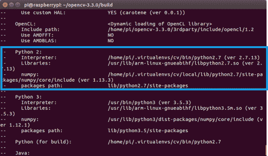
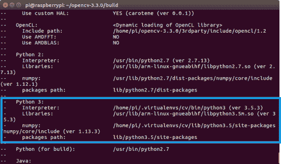
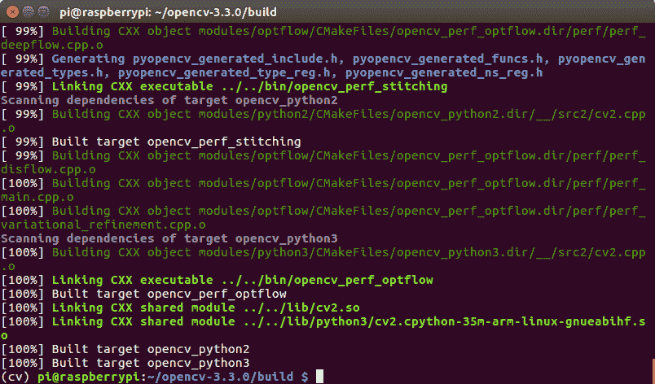
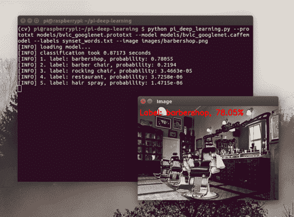
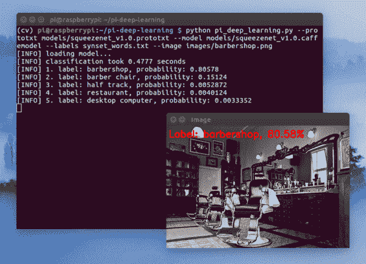

# 在树莓 Pi 上优化 OpenCV

> 原文：<https://pyimagesearch.com/2017/10/09/optimizing-opencv-on-the-raspberry-pi/>


本教程是为 ***高级 Raspberry Pi 用户*** 准备的，他们希望*利用他们的 Pi 的最后一点性能*来使用 OpenCV 进行计算机视觉和图像处理。

我会假设:

1.  你已经完成了我之前的[Raspberry Pi+OpenCV 安装教程](https://pyimagesearch.com/opencv-tutorials-resources-guides/)(最好是*多次*)。
2.  您已经熟悉了命令行和 Unix 环境。

由于这是一个高级指南，我将少做一些手把手的工作，而是专注于*优化本身。*如果你陷入困境或遇到错误，你需要参考我在 PyImageSearch 上提供的[以前的教程](https://pyimagesearch.com/opencv-tutorials-resources-guides/)。

当你完成本教程时，你的树莓 Pi 在执行 OpenCV 和 Python 脚本时将享受到 30%的速度提升**。**

 ****要了解更多关于在您的 Raspberry Pi 上优化 OpenCV 的信息，*请继续阅读。***

## 在树莓 Pi 上优化 OpenCV

几周前，我演示了如何给你的树莓派部署一个深度神经网络。

结果是令人满意的，使用 GoogLeNet 对图像进行分类大约需要 1.7 秒，使用 SqueezeNet 大约需要 0.9 秒。

然而，我想知道我们是否能做得更好。

虽然我们不能在 Raspberry Pi 上 ***训练*** 神经网络，但我们可以 ***将*** 预先训练好的网络部署到我们的 Pi 上——前提是我们能够充分优化 Raspberry Pi(并且网络能够适合 Pi 硬件的有限内存)。

在本教程的剩余部分，我们将讨论在 OpenCV 安装过程中我们将利用的优化，然后完成七个安装步骤。

在我们优化的 OpenCV 编译器安装后，我们将运行一些快速测试来确定我们新的 OpenCV 安装是否比前一个更快。

我在这里的目标是证明优化实际上在树莓 Pi 3 上要快得多，你应该毫不犹豫地在你自己的项目中使用它们。

### 氖和 FVPV3

在我研究如何为 OpenCV 优化 Raspberry Pi 时，我看到了 Sagi Zeevi 的这篇优秀文章。

在教程中，Sagi 建议使用:

1.  氖
2.  VFPV3
3.  以及可选的线程构建模块(TBB)

我不是 TBB 的忠实粉丝，因为(1)性能增益很低，而且(2)安装在树莓派上很麻烦。

最划算的将是 NEON 和 VFPV3。

[ARM NEON](https://developer.arm.com/technologies/neon) 是 ARM 处理器的优化架构扩展。它是由 ARM 工程师专门为更快的视频处理、图像处理、语音识别和机器学习而设计的。这种优化支持[单指令多数据](https://en.wikipedia.org/wiki/SIMD) (SIMD)(与 SISD、MISD、MIMD 相对)，它描述了一种架构，其中流水线中的多个处理元件对多个数据点(硬件)执行操作，所有操作都用单个指令执行。

ARM 工程师还在我们的 Raspberry Pi 3 使用的芯片中内置了浮点优化功能 [VFPV3](https://developer.arm.com/technologies/floating-point) 。此处链接的 ARM 页面描述了此优化中包含的功能，如可配置的舍入模式和可定制的默认非数字(NaN)行为。

这对我们来说意味着我们的神经网络可能会运行得更快，因为 Raspberry Pi 3 上的 ARM 处理器具有硬件优化，我们可以利用 4× ARM Cortex-A53，1.2GHz 处理器。

我想你会对结果印象深刻，所以让我们继续把你优化的 OpenCV 安装到 Raspberry Pi 上。

### 步骤#1:扩展文件系统并回收空间

在本教程的剩余部分，我将做以下假设:

1.  你正在使用全新安装的**拉斯比昂拉伸**。
2.  这不是你第一次使用 Python 虚拟环境在 Raspberry Pi 上安装 OpenCV。如果是的话，请使用我的[介绍性 OpenCV 安装指南](https://pyimagesearch.com/opencv-tutorials-resources-guides/)来体验一下。
3.  您已经熟悉了命令行和 Unix 环境。
4.  您知道如何调试 CMake 输出中的常见错误(找不到 Python 虚拟环境、缺少 Python 库等)。).

同样，本教程是一个**高级指南**,所以我将介绍这些命令，并且只提供相关的解释——总的来说，在执行这些命令之前，你应该知道它们是做什么的。

第一步是运行并扩展您的文件系统:

```py
$ sudo raspi-config

```

然后重启你的 Raspberry Pi:

```py
$ sudo reboot

```

从那里，删除 Wolfram Engine 和 LibreOffice，在您的 Raspberry Pi 上回收大约 1GB 的空间:

```py
$ sudo apt-get purge wolfram-engine
$ sudo apt-get purge libreoffice*
$ sudo apt-get clean
$ sudo apt-get autoremove

```

### 步骤 2:安装依赖项

以下命令将更新和升级任何现有的包，然后安装 OpenCV 的依赖项、I/O 库和优化包:

```py
$ sudo apt-get update && sudo apt-get upgrade
$ sudo apt-get install build-essential cmake pkg-config
$ sudo apt-get install libjpeg-dev libtiff5-dev libjasper-dev libpng12-dev
$ sudo apt-get install libavcodec-dev libavformat-dev libswscale-dev libv4l-dev
$ sudo apt-get install libxvidcore-dev libx264-dev
$ sudo apt-get install libgtk2.0-dev libgtk-3-dev
$ sudo apt-get install libcanberra-gtk*
$ sudo apt-get install libatlas-base-dev gfortran
$ sudo apt-get install python2.7-dev python3-dev

```

整个过程大约需要 5 分钟。

***注:**我增加了`libcanberra-gtk*`这是抓住 GTK 手臂阻止 GTK 的特定警告(不是错误；警告)在 Raspberry Pi 上运行 Python + OpenCV 脚本时可能会遇到。* 

### 步骤 3:下载 OpenCV 源代码

接下来，下载 [opencv](https://github.com/opencv/opencv) 和 [opencv_contrib](https://github.com/opencv/opencv_contrib) 库的 OpenCV 源代码，然后解包:

```py
$ cd ~
$ wget -O opencv.zip https://github.com/opencv/opencv/archive/3.4.7.zip
$ unzip opencv.zip
$ wget -O opencv_contrib.zip https://github.com/opencv/opencv_contrib/archive/3.4.7.zip
$ unzip opencv_contrib.zip

```

***注意:**你需要点击上面代码块工具栏中的< = >按钮来获取 zip 存档的完整路径。*

对于这篇博文，我们将使用 OpenCV 3 . 4 . 7；然而，随着 OpenCV 新版本的发布，您可以更新相应的版本号(**注意:**一些截图显示 3.3.0 是当时收集的可用的最高版本)。

### 步骤 4:创建您的 Python 虚拟环境并安装 NumPy

我们将使用 Python 虚拟环境，这是使用 Python 时的最佳实践。

您可以使用以下命令安装 pip、 [virtualenv](https://virtualenv.pypa.io/en/latest/) 和 [virtualenvwrapper](https://virtualenvwrapper.readthedocs.org/en/latest/) :

```py
$ wget https://bootstrap.pypa.io/get-pip.py
$ sudo python get-pip.py
$ sudo python3 get-pip.py
$ sudo pip install virtualenv virtualenvwrapper
$ sudo rm -rf ~/.cache/pip

```

一旦`virtualenv`和`virtualenvwrapper`都安装好了，打开你的`~/.bashrc`，使用你最喜欢的基于终端的文本编辑器，如`vim`、`emacs`或`nano`，将下面几行添加到文件的*底部*:

```py
# virtualenv and virtualenvwrapper
export WORKON_HOME=$HOME/.virtualenvs
export VIRTUALENVWRAPPER_PYTHON=/usr/bin/python3
source /usr/local/bin/virtualenvwrapper.sh

```

从那里，重新加载您的`~/.bashrc`文件，将更改应用到您当前的 bash 会话:

```py
$ source ~/.bashrc

```

每次在 Pi 中打开一个新的终端/SSH 时，您都需要运行`source ~/.bashrc` ***，以确保您的系统变量设置正确(它还会在启动时加载该文件)。***

接下来，创建 Python 3 虚拟环境:

```py
$ mkvirtualenv cv -p python3

```

在这里，我使用 Python 3 创建了一个名为`cv`的 Python 虚拟环境(或者，您也可以通过将`-p`切换到`python2`来使用 Python 2.7)。

您可以随意命名虚拟环境，但是我在 PyImageSearch 上使用`cv`作为标准命名约定。

最后，将 NumPy 安装到 Python 虚拟环境中:

```py
$ pip install numpy

```

### 步骤#5:编译并安装为 Raspberry Pi 优化的 OpenCV 库

我们现在准备编译和安装优化版的 Raspberry Pi。

使用`workon`命令确保您处于`cv`虚拟环境中:

```py
$ workon cv

```

并从那里配置您的构建:

```py
$ cd ~/opencv-3.4.7/
$ mkdir build
$ cd build
$ cmake -D CMAKE_BUILD_TYPE=RELEASE \
    -D CMAKE_INSTALL_PREFIX=/usr/local \
    -D OPENCV_EXTRA_MODULES_PATH=~/opencv_contrib-3.4.7/modules \
    -D ENABLE_NEON=ON \
    -D ENABLE_VFPV3=ON \
    -D BUILD_TESTS=OFF \
    -D INSTALL_PYTHON_EXAMPLES=OFF \
    -D OPENCV_ENABLE_NONFREE=ON \
    -D CMAKE_SHARED_LINKER_FLAGS='-latomic' \
    -D BUILD_EXAMPLES=OFF ..

```

注意 NEON 和 VFPV3 标志是如何使能的。这些线被突出显示。

此外，我强调了非自由算法标志(给你完整的安装)以及 OpenCV 3.4.7 需要的特殊链接标志。

如果您使用的是 Python 2.7，那么您的*“Python 2”*部分应该如下所示:

[](https://pyimagesearch.com/wp-content/uploads/2017/10/optimizing_opencv_cmake_cv33_python2_box.png)

**Figure 1:** Running CMake to generate the build files for OpenCV 3.3\. OpenCV will correctly be built with Python 2.7 and NumPy from our `cv` virtualenv.

否则，如果您正在为 Python 3 编译 OpenCV，请检查 CMake 的 *"Python 3"* 输出:

[](https://pyimagesearch.com/wp-content/uploads/2017/10/optimizing-opencv_cmake_cv33_python3_box.png)

**Figure 2:** After running CMake, Python 3 + NumPy are correctly set from within our `cv` virtualenv on the Raspberry Pi.

请注意`Interpreter`、`Libraries`、`numpy`和`packages path`变量是如何正确设置的。

在你开始编译之前，我建议 ***增加你的交换空间*** 。这将使你能够用树莓派的 ***所有四个内核*** 编译 OpenCV，而不会因为内存耗尽而导致编译挂起。

打开您的`/etc/dphys-swapfile`文件，然后编辑`CONF_SWAPSIZE`变量:

```py
# set size to absolute value, leaving empty (default) then uses computed value
#   you most likely don't want this, unless you have an special disk situation
# CONF_SWAPSIZE=100
CONF_SWAPSIZE=1024

```

请注意，我将交换空间从 100MB 增加到了 1024MB。这是在 Raspbian Stretch 上编译多核 OpenCV 的秘方。

如果你不执行这个步骤，你的 Pi 很可能会挂起。

从那里，重新启动交换服务:

```py
$ sudo /etc/init.d/dphys-swapfile stop
$ sudo /etc/init.d/dphys-swapfile start

```

***注意:**增加交换空间是烧坏你的 Raspberry Pi microSD 卡的好方法。基于闪存的存储可以执行的写入次数有限，直到卡基本上无法再容纳 1 和 0。我们只会在短时间内启用大规模互换，所以这没什么大不了的。无论如何，一定要在安装 OpenCV + Python 后备份你的`.img`文件，以防你的卡意外提前死亡。你可以在本页的[阅读更多关于大容量交换损坏存储卡的信息。](https://www.bitpi.co/2015/02/11/how-to-change-raspberry-pis-swapfile-size-on-rasbian/)*

现在我们已经更新了交换空间大小，开始使用所有四个内核进行优化的 OpenCV 编译:

```py
$ make -j4

```

[](https://pyimagesearch.com/wp-content/uploads/2017/10/optimizing_opencv_make_complete.png)

**Figure 3:** Our optimized compile of OpenCV 3.3 for the Raspberry Pi 3 has been completed successfully.

假设 OpenCV 编译没有错误(如我上面的截图所示)，您可以在您的 Raspberry Pi 上安装您的 OpenCV 优化版本:

```py
$ sudo make install
$ sudo ldconfig

```

***别忘了回去*** 给你的`/etc/dphys-swapfile`文件还有:

1.  将`CONF_SWAPSIZE`重置为 100MB。
2.  重新启动交换服务。

### 第 6 步:在 Raspberry Pi 上完成安装你的*优化的* OpenCV

如果您为 Python 3 编译了 ***OpenCV，那么您需要发出以下命令来将`cv2.so`绑定符号链接到您的`cv`虚拟环境中:***

```py
$ cd /usr/local/lib/python3.5/site-packages/
$ sudo mv cv2.cpython-35m-arm-linux-gnueabihf.so cv2.so
$ cd ~/.virtualenvs/cv/lib/python3.5/site-packages/
$ ln -s /usr/local/lib/python3.5/site-packages/cv2.so cv2.so

```

请记住，确切的路径需要根据您使用的是 Python 3.4、Python 3.5 还是 Python 3.6 等版本进行更新。

如果您转而编译了用于 Python 2.7 的 **OpenCV，您可以使用这些命令将您的`cv2.so`文件符号链接到`cv`虚拟环境:**

```py
$ cd ~/.virtualenvs/cv/lib/python2.7/site-packages/
$ ln -s /usr/local/lib/python2.7/site-packages/cv2.so cv2.so

```

### 步骤 7:测试您的*优化的* OpenCV + Raspberry Pi 安装

作为快速检查，访问`cv`虚拟环境，启动 Python shell 并尝试导入 OpenCV 库:

```py
$ source ~/.profile
$ workon cv
$ python
>>> import cv2
>>> cv2.__version__
'3.4.7'
>>>

```

**恭喜你！**您刚刚在您的 Raspberry Pi 3 上安装了优化的 OpenCV 3.3。

### 那么，这些优化有多好呢？

阅读完本教程后，你可能会好奇这些 OpenCV + Raspberry Pi 优化有多好。

鉴于我们刚刚针对浮点运算进行了优化，一个很好的测试将是在 Raspberry Pi 上运行预先训练好的深度神经网络，[类似于我们上周所做的](https://pyimagesearch.com/2017/10/02/deep-learning-on-the-raspberry-pi-with-opencv/)。

继续使用这篇博文的 ***【下载】*** 部分来下载我们预先训练好的卷积神经网络+示例图像+分类脚本。

从那里，启动一个 shell 并执行以下命令:

```py
$ python pi_deep_learning.py --prototxt models/bvlc_googlenet.prototxt \
	--model models/bvlc_googlenet.caffemodel --labels synset_words.txt \
	--image images/barbershop.png
[INFO] loading model...
[INFO] classification took 0.87173 seconds
[INFO] 1\. label: barbershop, probability: 0.78055
[INFO] 2\. label: barber chair, probability: 0.2194
[INFO] 3\. label: rocking chair, probability: 3.4663e-05
[INFO] 4\. label: restaurant, probability: 3.7258e-06
[INFO] 5\. label: hair spray, probability: 1.4715e-06

```

[](https://pyimagesearch.com/wp-content/uploads/2017/10/optimizing_opencv_googlenet_barbershop.png)

**Figure 4:** Running an image of a *“barbershop”* through GoogLeNet on the Raspberry Pi 3 with an optimized install of OpenCV 3.3 achieves a 48.82% speedup.

在这里你可以看到 GoogLeNet 将我们的图像分类在 ***0.87 秒*** ，比上周的 1.7 秒有了*海量 **48.82%*** 的提升。

让我们试试 SqueezeNet:

```py
$ python pi_deep_learning.py --prototxt models/squeezenet_v1.0.prototxt \
	--model models/squeezenet_v1.0.caffemodel --labels synset_words.txt \
	--image images/barbershop.png
[INFO] loading model...
[INFO] classification took 0.4777 seconds
[INFO] 1\. label: barbershop, probability: 0.80578
[INFO] 2\. label: barber chair, probability: 0.15124
[INFO] 3\. label: half track, probability: 0.0052872
[INFO] 4\. label: restaurant, probability: 0.0040124
[INFO] 5\. label: desktop computer, probability: 0.0033352

```

[](https://pyimagesearch.com/wp-content/uploads/2017/10/optimizing_opencv_squeezenet_barbershop.png)

**Figure 5:** Squeezenet on the Raspberry Pi 3 also achieves performance gains using our optimized install of OpenCV 3.3.

在这里我们可以看到，SqueezeNet 在 **0.47 秒**内正确地对输入图像进行了分类，与上周的 0.9 秒(47.78%)相比又是一个巨大的进步。

**根据我们的结果，*很明显*我们的 OpenCV 优化已经产生了*显著的*影响。**

## 摘要

在今天的博文中，您了解了如何在 Raspberry Pi 上优化 OpenCV 安装。

这些优化来自于更新我们的 CMake 命令，以包括 NEON 和 VFPV3。当[对 OpenCV](https://www.theimpossiblecode.com/blog/build-faster-opencv-raspberry-pi3/) 进行基准测试时，这导致 ***的速度提高了大约 30%***。然而，当严格应用于 OpenCV 3 中的新`dnn`模块时，我们看到增加了超过 ***48%** ！*

希望你喜欢这个教程，喜欢你优化的 OpenCV + Raspberry Pi！

## **但是在你走之前……**

请务必在我的博客上查看其他 [Raspberry Pi 帖子，并且 ***考虑在下面的表格中输入您的电子邮件地址*，以便在未来深度学习/Raspberry Pi 帖子在 PyImageSearch 上发布时得到通知。**](https://pyimagesearch.com/tag/raspberry-pi/)**