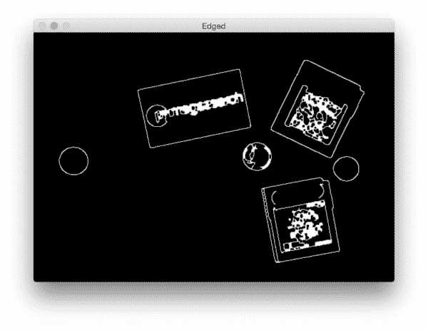
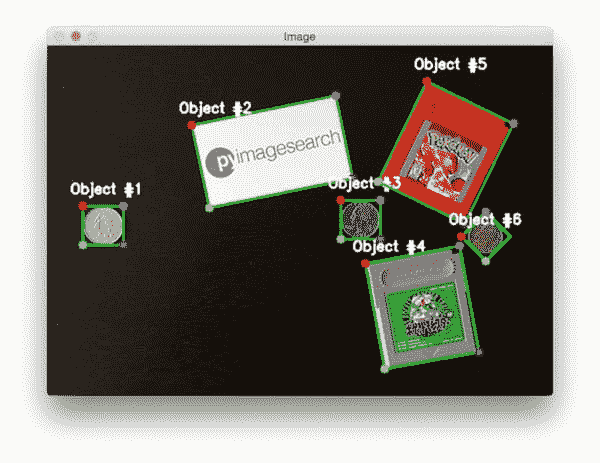

# 用 Python 和 OpenCV 顺时针排序坐标

> 原文：<https://pyimagesearch.com/2016/03/21/ordering-coordinates-clockwise-with-python-and-opencv/>


Today we are going to kick-off a three part series on **calculating the size of objects in images** along with **measuring the *distances* between them**.

这些教程是 PyImageSearch 博客上最受欢迎的课程之一。我非常兴奋能让他们开始——*，我相信你也是。*

然而，在我们开始学习如何测量图像中物体的大小(更不用说它们之间的距离)之前，我们首先需要谈论一些事情…

一年多前，我在 PyImageSearch 博客上写了一篇我最喜欢的教程: **[如何在短短 5 分钟内建立一个强大的移动文档扫描仪](https://pyimagesearch.com/2014/09/01/build-kick-ass-mobile-document-scanner-just-5-minutes/)** 。尽管这个教程已经有一年多的历史了，它的*仍然是 PyImageSearch 上最受欢迎的博客帖子之一。*

构建我们的移动文档扫描仪是基于我们能够 **[使用 OpenCV](https://pyimagesearch.com/2014/08/25/4-point-opencv-getperspective-transform-example/)** 应用 4 点 cv2.getPerspectiveTransform，使我们能够获得自上而下的文档鸟瞰图。

然而。我们的透视变换有一个致命的缺陷**，这使得它不适合在生产环境中使用。**

 **你看，有这样的情况，把我们的四个点按左上、右上、右下、左下顺序排列的预处理步骤会返回*不正确的结果！*

要了解更多关于这种虫子的信息，*以及如何消灭它*，请继续阅读。

## 用 Python 和 OpenCV 顺时针排序坐标

这篇博文的目的有两个:

1.  **的主要目的**是学习如何以左上、右上、右下和左下的顺序排列与旋转的边界框相关的 *(x，y)*-坐标。以这样的顺序组织边界框坐标是执行诸如透视变换或匹配对象的角(例如当我们计算对象之间的距离时)等操作的先决条件。
2.  **的第二个目的**是解决 [imutils 包](https://github.com/jrosebr1/imutils)的`order_points`方法中一个微妙的、难以发现的错误。通过解决这个 bug，我们的`order_points`函数将不再容易受到削弱性 bug 的影响。

说了这么多，让我们从回顾最初的、有缺陷的按顺时针顺序排列边界框坐标的方法开始这篇博文。

### 原始的(有缺陷的)方法

在我们学习如何按照(1)顺时针顺序，更具体地说，(2)左上、右上、右下和左下顺序排列一组边界框坐标之前，我们应该先回顾一下[原创 4 点 getPerspectiveTransform 博文](https://pyimagesearch.com/2014/08/25/4-point-opencv-getperspective-transform-example/)中详细介绍的`order_points`方法。

我已经将(有缺陷的)`order_points`方法重命名为`order_points_old`，这样我们就可以比较我们原始的和更新的方法。首先，打开一个新文件，命名为`order_coordinates.py`:

```py
# import the necessary packages
from __future__ import print_function
from imutils import perspective
from imutils import contours
import numpy as np
import argparse
import imutils
import cv2

def order_points_old(pts):
	# initialize a list of coordinates that will be ordered
	# such that the first entry in the list is the top-left,
	# the second entry is the top-right, the third is the
	# bottom-right, and the fourth is the bottom-left
	rect = np.zeros((4, 2), dtype="float32")

	# the top-left point will have the smallest sum, whereas
	# the bottom-right point will have the largest sum
	s = pts.sum(axis=1)
	rect[0] = pts[np.argmin(s)]
	rect[2] = pts[np.argmax(s)]

	# now, compute the difference between the points, the
	# top-right point will have the smallest difference,
	# whereas the bottom-left will have the largest difference
	diff = np.diff(pts, axis=1)
	rect[1] = pts[np.argmin(diff)]
	rect[3] = pts[np.argmax(diff)]

	# return the ordered coordinates
	return rect

```

**第 2-8 行**处理导入我们需要的 Python 包。我们将在这篇博文的后面使用`imutils`包，所以如果你还没有安装它，一定要通过`pip`安装它:

```py
$ pip install imutils

```

否则，如果你*确实*安装了`imutils`，你应该升级到最新版本(它有更新的`order_points`实现):

```py
$ pip install --upgrade imutils

```

**第 10 行**定义了我们的`order_points_old`函数。这种方法只需要一个参数，即我们要按左上、右上、右下和左下顺序排列的一组点；虽然，正如我们将要看到的，这个方法有一些缺陷。

我们从第 15 行的**开始，定义一个形状为`(4, 2)`的 NumPy 数组，它将用于存储我们的四个 *(x，y)* 坐标。**

给定这些`pts`，我们将 *x* 和 *y* 值加在一起，然后找出最小和最大的和(**第 19-21 行**)。这些值分别给出了我们的左上和右下坐标。

然后我们取 *x* 和 *y* 值之间的差，其中右上点的差最小，左下点的距离最大(**第 26-28 行**)。

最后，**行 31** 将我们排序的 *(x，y)*-坐标返回给我们的调用函数。

说了这么多，你能发现我们逻辑中的漏洞吗？

我给你一个提示:

***当两点之和或之差与*** **相同*时会发生什么？***

总之，悲剧。

如果和数组`s`或差数组`diff`具有相同的值，我们就有选择不正确索引的风险，这会对我们的排序产生级联效应。

选择错误的索引意味着我们从`pts`列表中选择了不正确的点。而如果我们从`pts`取了不正确的点，那么我们顺时针的左上、右上、右下、左下的排序就会被破坏。

那么，我们如何解决这个问题，并确保它不会发生？

为了处理这个问题，我们需要使用更合理的数学原理设计一个更好的`order_points`函数。这正是我们将在下一节讨论的内容。

### 用 OpenCV 和 Python 实现坐标顺时针排序的更好方法

既然我们已经看到了`order_points`函数的*有缺陷的*版本，让我们回顾一下更新的*，正确的*实现。

我们将要回顾的`order_points`函数的实现可以在 [imutils 包](https://github.com/jrosebr1/imutils)中找到；具体来说，在 [perspective.py 文件](https://github.com/jrosebr1/imutils/blob/master/imutils/perspective.py)中。为了完整起见，我在这篇博文中包含了具体的实现:

```py
# import the necessary packages
from scipy.spatial import distance as dist
import numpy as np
import cv2

def order_points(pts):
	# sort the points based on their x-coordinates
	xSorted = pts[np.argsort(pts[:, 0]), :]

	# grab the left-most and right-most points from the sorted
	# x-roodinate points
	leftMost = xSorted[:2, :]
	rightMost = xSorted[2:, :]

	# now, sort the left-most coordinates according to their
	# y-coordinates so we can grab the top-left and bottom-left
	# points, respectively
	leftMost = leftMost[np.argsort(leftMost[:, 1]), :]
	(tl, bl) = leftMost

	# now that we have the top-left coordinate, use it as an
	# anchor to calculate the Euclidean distance between the
	# top-left and right-most points; by the Pythagorean
	# theorem, the point with the largest distance will be
	# our bottom-right point
	D = dist.cdist(tl[np.newaxis], rightMost, "euclidean")[0]
	(br, tr) = rightMost[np.argsort(D)[::-1], :]

	# return the coordinates in top-left, top-right,
	# bottom-right, and bottom-left order
	return np.array([tl, tr, br, bl], dtype="float32")

```

同样，我们从**第 2-4 行**开始，导入我们需要的 Python 包。然后我们在**第 6 行**上定义我们的`order_points`函数，它只需要一个参数——我们想要订购的`pts`的列表。

**第 8 行**然后根据它们的 *x-* 值对这些`pts`进行排序。给定排序后的`xSorted`列表，我们应用[数组切片](http://stackoverflow.com/questions/509211/explain-pythons-slice-notation)来抓取最左边的两个点和最右边的两个点(**第 12 行和第 13 行**)。

因此，`leftMost`点将对应于*左上*和*左下*点，而`rightMost`将是我们的*右上*和*右下*点— **关键是要弄清楚哪个是哪个。**

幸运的是，这并不太具有挑战性。

如果我们根据它们的 *y-* 值对我们的`leftMost`点进行排序，我们可以分别导出左上角和左下角的点(**第 18 行和第 19 行**)。

然后，为了确定右下角和左下角的点，我们可以应用一点几何。

使用左上角的点作为锚点，我们可以应用[勾股定理](https://en.wikipedia.org/wiki/Pythagorean_theorem)并计算左上角和`rightMost`点之间的[欧几里得距离](https://en.wikipedia.org/wiki/Euclidean_distance)。根据三角形的定义，斜边是直角三角形的最大边。

因此，通过将左上角的点作为我们的锚点，右下角的点将具有最大的欧几里德距离，从而允许我们提取右下角和右上角的点(**行 26 和 27** )。

最后，**第 31 行**返回一个 NumPy 数组，以左上、右上、右下和左下的顺序表示我们的有序边界框坐标。

### 测试我们的坐标排序实现

现在我们已经有了`order_points`的*原版*和*更新版*，让我们继续实现我们的`order_coordinates.py`脚本，并让他们都试试:

```py
# import the necessary packages
from __future__ import print_function
from imutils import perspective
from imutils import contours
import numpy as np
import argparse
import imutils
import cv2

def order_points_old(pts):
	# initialize a list of coordinates that will be ordered
	# such that the first entry in the list is the top-left,
	# the second entry is the top-right, the third is the
	# bottom-right, and the fourth is the bottom-left
	rect = np.zeros((4, 2), dtype="float32")

	# the top-left point will have the smallest sum, whereas
	# the bottom-right point will have the largest sum
	s = pts.sum(axis=1)
	rect[0] = pts[np.argmin(s)]
	rect[2] = pts[np.argmax(s)]

	# now, compute the difference between the points, the
	# top-right point will have the smallest difference,
	# whereas the bottom-left will have the largest difference
	diff = np.diff(pts, axis=1)
	rect[1] = pts[np.argmin(diff)]
	rect[3] = pts[np.argmax(diff)]

	# return the ordered coordinates
	return rect

# construct the argument parse and parse the arguments
ap = argparse.ArgumentParser()
ap.add_argument("-n", "--new", type=int, default=-1,
	help="whether or not the new order points should should be used")
args = vars(ap.parse_args())

# load our input image, convert it to grayscale, and blur it slightly
image = cv2.imread("example.png")
gray = cv2.cvtColor(image, cv2.COLOR_BGR2GRAY)
gray = cv2.GaussianBlur(gray, (7, 7), 0)

# perform edge detection, then perform a dilation + erosion to
# close gaps in between object edges
edged = cv2.Canny(gray, 50, 100)
edged = cv2.dilate(edged, None, iterations=1)
edged = cv2.erode(edged, None, iterations=1)

```

**第 33-37 行**处理解析我们的命令行参数。我们只需要一个参数`--new`，它用来表示是否应该使用*新*或*原* `order_points`函数。我们将默认使用最初的*实现。*

从那里，我们从磁盘加载`example.png`,并通过将图像转换为灰度并用高斯滤波器平滑它来执行一点预处理。

我们继续通过应用 Canny 边缘检测器来处理我们的图像，然后通过膨胀+腐蚀来闭合边缘图中轮廓之间的任何间隙。

执行边缘检测过程后，我们的图像应该如下所示:



**Figure 1:** Computing the edge map of the input image.

如你所见，我们已经能够确定图像中物体的轮廓。

现在我们有了边缘图的轮廓，我们可以应用`cv2.findContours`函数来实际*提取*物体的轮廓:

```py
# find contours in the edge map
cnts = cv2.findContours(edged.copy(), cv2.RETR_EXTERNAL,
	cv2.CHAIN_APPROX_SIMPLE)
cnts = imutils.grab_contours(cnts)

# sort the contours from left-to-right and initialize the bounding box
# point colors
(cnts, _) = contours.sort_contours(cnts)
colors = ((0, 0, 255), (240, 0, 159), (255, 0, 0), (255, 255, 0))

```

然后，我们从左到右对物体轮廓进行排序，这不是必需的，但是可以更容易地查看脚本的输出。

下一步是分别遍历每个轮廓:

```py
# loop over the contours individually
for (i, c) in enumerate(cnts):
	# if the contour is not sufficiently large, ignore it
	if cv2.contourArea(c) < 100:
		continue

	# compute the rotated bounding box of the contour, then
	# draw the contours
	box = cv2.minAreaRect(c)
	box = cv2.cv.BoxPoints(box) if imutils.is_cv2() else cv2.boxPoints(box)
	box = np.array(box, dtype="int")
	cv2.drawContours(image, [box], -1, (0, 255, 0), 2)

	# show the original coordinates
	print("Object #{}:".format(i + 1))
	print(box)

```

第 61 条线开始在我们的轮廓上循环。如果轮廓不够大(由于边缘检测过程中的“噪声”)，我们丢弃轮廓区域(**线 63 和 64** )。

否则，**行 68-71** 处理计算轮廓的旋转边界框(注意使用`cv2.cv.BoxPoints`[如果我们使用 OpenCV 2.4]或`cv2.boxPoints`[如果我们使用 OpenCV 3])并在`image`上绘制轮廓。

我们还将打印原始的旋转边界`box`,这样我们可以在排序坐标后比较结果。

我们现在准备按顺时针方向排列边界框坐标:

```py
	# order the points in the contour such that they appear
	# in top-left, top-right, bottom-right, and bottom-left
	# order, then draw the outline of the rotated bounding
	# box
	rect = order_points_old(box)

	# check to see if the new method should be used for
	# ordering the coordinates
	if args["new"] > 0:
		rect = perspective.order_points(box)

	# show the re-ordered coordinates
	print(rect.astype("int"))
	print("")

```

**第 81 行**应用*原始的*(即有缺陷的)`order_points_old`函数按照左上、右上、右下、左下的顺序排列我们的包围盒坐标。

如果`--new 1`标志已经传递给我们的脚本，那么我们将应用我们的*更新的* `order_points`函数(**第 85 和 86 行**)。

就像我们将*原始边界框*打印到我们的控制台一样，我们也将打印*有序点*，这样我们可以确保我们的功能正常工作。

最后，我们可以看到我们的结果:

```py
	# loop over the original points and draw them
	for ((x, y), color) in zip(rect, colors):
		cv2.circle(image, (int(x), int(y)), 5, color, -1)

	# draw the object num at the top-left corner
	cv2.putText(image, "Object #{}".format(i + 1),
		(int(rect[0][0] - 15), int(rect[0][1] - 15)),
		cv2.FONT_HERSHEY_SIMPLEX, 0.55, (255, 255, 255), 2)

	# show the image
	cv2.imshow("Image", image)
	cv2.waitKey(0)

```

我们开始在**线 93** 上循环我们的(希望)有序坐标，并在我们的`image`上绘制它们。

根据`colors`列表，左上角应该是*红色*，右上角*紫色*，右下角*蓝色*，最后是左下角*青色*。

最后，**第 97-103 行**在我们的`image`上画出物体编号并显示输出结果。

要使用最初有缺陷的实现来执行我们的脚本，只需发出以下命令:

```py
$ python order_coordinates.py

```



**Figure 2:** Arranging our rotated bounding box coordinates in top-left, top-right, bottom-right, and bottom-left order…**but with a *major flaw* (take a look at Object #6).**

正如我们所看到的，我们的输出是按照左上、右上、右下和左下排列的顺时针顺序排列的，除了对象#6！

***注:*** *看看输出的圆圈——注意怎么没有蓝色的？*

查看对象#6 的终端输出，我们可以看到原因:


**Figure 3:** Take a look at the bounding box coordinates for Object #6\. And then see what happens what happens when we take their sum and differences.

对这些坐标求和，我们最终得到:

*   520 + 255 = 775
*   491 + 226 = 717
*   520 + 197 = 717
*   549 + 226 = 775

而这种差异给了我们:

*   520 – 255 = 265
*   491 – 226 = 265
*   520 – 197 = 323
*   549 – 226 = 323

正如你所看到的， ***我们最终得到了重复的值！***

由于有重复的值，`argmin()`和`argmax()`函数并不像我们期望的那样工作，给了我们一组不正确的“有序”坐标。

为了解决这个问题，我们可以使用 [imutils 包](https://github.com/jrosebr1/imutils)中更新的`order_points`函数。我们可以通过发出以下命令来验证我们更新的函数是否正常工作:

```py
$ python order_coordinates.py --new 1

```

这一次，我们所有的点都被正确排序，包括对象#6:


**Figure 4:** Correctly ordering coordinates clockwise with Python and OpenCV.

当利用[透视变换](https://pyimagesearch.com/2014/09/01/build-kick-ass-mobile-document-scanner-just-5-minutes/)(或任何其他需要有序坐标的项目)*时，确保使用我们更新的实现！*

## 摘要

在这篇博文中，我们开始了一个由三部分组成的系列，分别是*计算图像中物体的尺寸*和*测量物体之间的距离*。为了实现这些目标，我们需要对与每个对象的旋转边界框相关的 4 个点进行排序。

我们已经在[之前的博客文章](https://pyimagesearch.com/2014/08/25/4-point-opencv-getperspective-transform-example/)中实现了这样的功能；然而，正如我们所发现的，这个实现有一个致命的缺陷——在*非常特殊的*情况下，它会返回*错误的坐标*。

为了解决这个问题，我们定义了一个新的、更新的`order_points`函数，并把它放在 [imutils 包](https://github.com/jrosebr1/imutils)中。这个实现确保了我们的点总是被正确排序。

既然我们可以以可靠的方式排序我们的 *(x，y)*-坐标，我们可以继续进行*测量图像中物体的大小*，这正是我将在我们的下一篇博客文章中讨论的。

**请务必在下面的表格中输入您的电子邮件地址，注册 PyImageSearch 时事通讯— *您一定不想错过这一系列的帖子！【T2*****