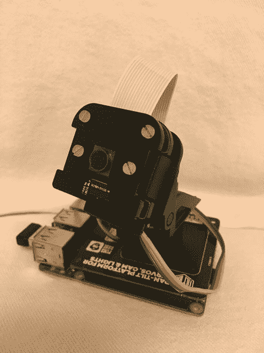
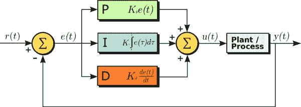
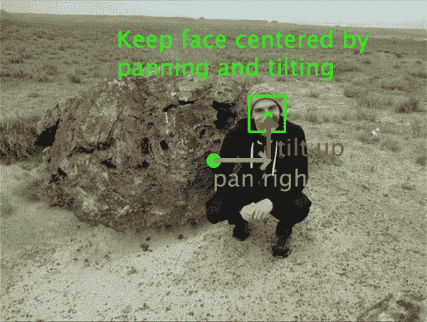

# 使用 Raspberry Pi 和 OpenCV 进行平移/倾斜人脸跟踪

> 原文：<https://pyimagesearch.com/2019/04/01/pan-tilt-face-tracking-with-a-raspberry-pi-and-opencv/>


在本教程中，您将学习如何使用 Raspberry Pi、Python 和计算机视觉来执行平移和倾斜对象跟踪。

我最喜欢的 Raspberry Pi 的一个特性是可以连接到 Pi 上的大量额外硬件。无论是摄像头、温度传感器、陀螺仪/加速度计，甚至是触摸传感器，围绕 Raspberry Pi 的社区让它几乎可以完成任何事情。

但是我最喜欢的树莓派的*附件之一是**云台相机。***

使用两个伺服系统，这个附加组件使我们的相机能够同时从左到右和上下移动*，允许我们检测和跟踪物体，即使它们会“超出画面”(如果一个物体接近传统相机的画面边界，就会发生这种情况)。*

 *今天我们将使用云台摄像机进行**物体跟踪**，更具体地说，是**面部跟踪。**

**要了解如何使用树莓派和 OpenCV、** ***执行平移和倾斜跟踪，请继续阅读！***

## 使用 Raspberry Pi 和 OpenCV 进行平移/倾斜人脸跟踪

在本教程的第一部分，我们将简要介绍什么是云台跟踪，以及如何使用伺服系统来完成。我们还将配置我们的 Raspberry Pi 系统，以便它可以与 PanTiltHAT 通信并使用摄像机。

从那里我们还将回顾 PID 控制器的概念，它是控制系统中常用的控制回路反馈机制。

然后，我们将实现我们的 PID 控制器，面部检测器+对象跟踪器，以及用于执行平移/倾斜跟踪的驱动程序脚本。

我还将介绍手动 PID 调节基础——一项基本技能。

让我们开始吧！

### 什么是平移/倾斜物体跟踪？

[](https://pyimagesearch.com/wp-content/uploads/2019/04/pi_pan_tilt_hardware.jpg)

**Figure 1:** The Raspberry Pi [pan-tilt servo HAT by Pimoroni](https://shop.pimoroni.com/products/pan-tilt-hat).

平移和倾斜目标跟踪的目标是使摄像机保持在目标的中心。

通常这种跟踪是由两个伺服系统完成的。在我们的例子中，我们有一个伺服系统用于左右移动。我们有单独的伺服系统用于 ***上下倾斜*。**

我们的每个伺服系统和夹具本身都有 180 度的范围(有些系统的范围比这个更大)。

#### 今天项目的硬件要求

您将需要以下硬件来复制今天的项目:

*   **树莓派**–我推荐 3B+或 3B，但其他型号也可以，只要它们有相同的插头引脚布局。
*   我推荐皮卡梅拉·V2
*   [**皮莫尔尼云台帽全套套件**](https://shop.pimoroni.com/products/pan-tilt-hat)–皮莫尔尼套件是一款优质产品，它没有让我失望。安排大约 30 分钟的集合时间。我不推荐 [SparkFun 套件](https://www.sparkfun.com/products/14329)，因为它需要焊接和额外的组装。
*   **2.5A、5V 电源**–如果您提供的电源低于 2.5A，您的 Pi 可能没有足够的电流使其复位。为什么？因为伺服系统把必要的电流带走了。获得一个电源，并将其专用于此项目硬件。
*   **HDMI 屏幕**–当你四处走动时，在你的相机旁边放置一个 HDMI 屏幕将允许你进行可视化和调试，这对于手动调谐是必不可少的。不要尝试 X11 转发，它对于视频应用程序来说太慢了。如果你没有 HDMI 屏幕，VNC 是可能的，但我还没有找到一种简单的方法来启动 VNC，而不需要插入实际的屏幕。
*   **键盘/鼠标**——显而易见的原因。

### 为 PantiltHat 安装软件

对于今天的项目，您需要以下软件:

*   OpenCV
*   smbus
*   潘蒂尔特
*   imutils

除了 smbus 的 之外，任何东西都可以通过 pip ***轻松安装。让我们回顾一下这些步骤:***

**步骤#1:** 创建一个虚拟环境并安装 OpenCV

前往我的 [*pip install opencv*](https://pyimagesearch.com/2018/09/19/pip-install-opencv/) 博客帖子，你将学习如何在安装了 opencv 的 Python 虚拟环境中设置你的 Raspberry Pi。我把我的虚拟环境命名为`py3cv4`。

**第二步:**将`smbus`符号链接到您的`py3cv4`虚拟环境中

按照以下说明安装`smbus`:

```py
$ cd ~/.virtualenvs/py3cv4/lib/python3.5/site-packages/
$ ln -s /usr/lib/python3/dist-packages/smbus.cpython-35m-arm-linux-gnueabihf.so smbus.so

```

**步骤#3:** 启用 i2c 接口和摄像头接口

启动 Raspbian 系统配置，打开 i2c 和摄像头接口(可能需要重启)。

```py
$ sudo raspi-config
# enable the i2c and camera interfaces via the menu

```

**步骤#4:** 安装`pantilthat`、`imutils`和摄像头

使用 pip，继续安装剩余的工具:

```py
$ workon py3cv4
$ pip install pantilthat
$ pip install imutils
$ pip install "picamera[array]"

```

从现在开始你应该都准备好了！

### 什么是 PID 控制器？

常见的反馈控制回路是所谓的 PID 或**比例积分微分控制器。**

PID 通常用于自动化，使得机械致动器可以快速准确地达到最佳值(由反馈传感器读取)。

它们被用于制造业、发电厂、机器人等等。

PID 控制器计算误差项(期望的设定点和传感器读数之间的差),并且具有补偿误差的目标。

PID 计算输出一个值，该值用作“过程”(机电过程，不是美国计算机科学/软件工程师认为的“计算机过程”)的输入。

传感器输出被称为“过程变量”，并作为等式的输入。在整个反馈环路中，定时被捕获，并被输入到等式中。

维基百科有一个很棒的 PID 控制器图:

[](https://pyimagesearch.com/wp-content/uploads/2019/04/pi_pan_tilt_pid.jpg)

**Figure 2**: A Proportional Integral Derivative (PID) control loop will be used for each of our panning and tilting processes ([image source](https://en.wikipedia.org/wiki/PID_controller)).

注意输出是如何循环回到输入的。还要注意比例、积分和导数值是如何计算和求和的。

该数字可以用等式形式写成:

 = K_\text{p} e(t) + K_\text{i} \int_0^t e(t') \,dt' + K_\text{d} \frac{de(t)}{dt}")

我们来复习一下 **P，I，**和 **D:**

*   **P(比例):**如果*电流*误差较大，则输出将按比例增大，从而导致显著校正。
*   **I(积分):** *误差的历史*值随时间积分。进行不太重要的校正以减少误差。如果消除了误差，这一项就不会增长。
*   **D(导数):**这一项预见了*的未来*。实际上，这是一种阻尼方法。如果 P 或 I 将导致某个值超调(例如，伺服系统转过某个对象或方向盘转得太远)，D 将在到达输出之前抑制该效果。

#### 我需要学习更多关于 PIDs 的知识吗？哪里是最好的地方？

PID 是一个基本的控制理论概念。

有大量的资源。有些偏重数学，有些偏重概念。有些容易理解，有些不容易。

也就是说，作为一个软件程序员，你只需要知道如何实现一个和调优一个。**即使你认为数学方程看起来很复杂，当你看到代码时，你将能够理解和理解。**

如果你理解 PID 是如何工作的，那么它就更容易调优，*但是只要你遵循本文后面演示的手动调优指南，*你就不需要一直熟悉上面的等式。

**只要记住:**

*   **P**–比例，存在(大修正)
*   **I**–积分，“在过去”(历史)
*   **D**–导数，阻尼(预测未来)

更多信息，[维基百科 PID 控制器页面](https://en.wikipedia.org/wiki/PID_controller)真的很棒，还链接到其他很棒的指南。

### 项目结构

一旦你抓取了今天的 ***【下载】*** 并提取它们，你会看到下面的目录结构:

```py
$ tree --dirsfirst
.
├── pyimagesearch
│ ├── __init__.py
│ ├── objcenter.py
│ └── pid.py
├── haarcascade_frontalface_default.xml
└── pan_tilt_tracking.py

1 directory, 5 files

```

今天我们将回顾三个 Python 文件:

*   `objcenter.py`:使用 Haar Cascade 人脸检测器计算人脸包围盒的中心。如果您愿意，您可以检测不同类型的对象，并将逻辑放在这个文件中。
*   如上所述，这是我们的控制回路。我喜欢将 PID 保存在一个类中，这样我就可以根据需要创建新的`PID`对象。今天我们有两个:(1)平移和(2)倾斜。
*   这是我们的平移/倾斜物体跟踪驱动脚本。它使用四个独立过程的多处理(其中两个用于平移和倾斜，一个用于寻找对象，一个用于以新的角度值驱动伺服系统)。

`haarcascade_frontalface_default.xml`是我们预先训练的 Haar Cascade 人脸检测器。Haar 与 Raspberry Pi 一起工作很好，因为它比 HOG 或深度学习需要更少的计算资源。

### 创建 PID 控制器

以下 PID 脚本基于[乐儿机器人公司 GitBook](http://erlerobot.github.io/erle_gitbook/en/beaglepilot/SimpleAutopilot.html) 的例子以及[维基百科伪代码](https://en.wikipedia.org/wiki/PID_controller#Pseudocode)。我添加了我自己的风格和格式，这是我的博客的读者(像你一样)所期望的。

继续打开`pid.py`。让我们回顾一下:

```py
# import necessary packages
import time

class PID:
	def __init__(self, kP=1, kI=0, kD=0):
		# initialize gains
		self.kP = kP
		self.kI = kI
		self.kD = kD

```

这个脚本实现了 PID 公式。基础数学很重。我们不需要导入高等数学库，但是我们需要导入第 2 行的**中的`time`(我们唯一的导入)。**

我们在第 4 行的**上定义了一个名为`PID`的类。**

`PID`类有三个方法:

*   `__init__`:构造者。
*   `initialize`:初始化数值。这个逻辑可以在构造函数中，但是这样你就没有在任何时候重新初始化的便利选项了。
*   `update`:这是进行计算的地方。

我们的构造函数在第 5-9 行的**中定义，接受三个参数:`kP`、`kI`和`kD`。这些值是**常量**，在我们的驱动程序脚本中指定。在方法体中定义了三个相应的实例变量。**

现在让我们回顾一下`initialize`:

```py
	def initialize(self):
		# initialize the current and previous time
		self.currTime = time.time()
		self.prevTime = self.currTime

		# initialize the previous error
		self.prevError = 0

		# initialize the term result variables
		self.cP = 0
		self.cI = 0
		self.cD = 0

```

`initialize`方法在**的第 13 行和第 14 行**设置我们当前的时间戳和之前的时间戳(因此我们可以在`update`方法中计算时间增量)。

我们不言自明的先前误差项在第 17 行的**中定义。**

P、I 和 D 变量建立在**行 20-22** 上。

让我们转到 PID 类的核心——`update`方法:

```py
	def update(self, error, sleep=0.2):
		# pause for a bit
		time.sleep(sleep)

		# grab the current time and calculate delta time
		self.currTime = time.time()
		deltaTime = self.currTime - self.prevTime

		# delta error
		deltaError = error - self.prevError

		# proportional term
		self.cP = error

		# integral term
		self.cI += error * deltaTime

		# derivative term and prevent divide by zero
		self.cD = (deltaError / deltaTime) if deltaTime > 0 else 0

		# save previous time and error for the next update
		self.prevtime = self.currTime
		self.prevError = error

		# sum the terms and return
		return sum([
			self.kP * self.cP,
			self.kI * self.cI,
			self.kD * self.cD])

```

我们的更新方法接受两个参数:以秒为单位的`error`值和`sleep`。

在`update`方法中，我们:

*   在**线 26** 上睡眠预定的时间，从而防止更新太快，以至于我们的伺服系统(或另一个致动器)不能足够快地响应。应该根据对机械、计算甚至通信协议限制的了解来明智地选择`sleep`值。在没有先验知识的情况下，你应该尝试看起来最有效的方法。
*   计算`deltaTime` ( **第 30 行**)。更新不会总是在同一时间到来(我们无法控制)。因此，我们计算前一次更新和现在(当前更新)之间的时间差。这将影响我们的`cI`和`cD`条款。
*   计算`deltaError` ( **第 33 行**)提供的`error`和`prevError`之差。

然后我们计算我们的`PID`控制项:

*   `cP`:我们的比例项等于`error`项。
*   `cI`:我们的积分项就是`error`乘以`deltaTime`。
*   `cD`:我们的导数项是`deltaError`对`deltaTime`。被零除是有原因的。

最后，我们:

*   设置`prevTime`和`prevError` ( **线 45 和 46** )。我们将在下一次`update`中需要这些值。
*   返回计算项乘以常数项的总和(**第 49-52 行**)。

请记住，更新将以快节奏的循环方式进行。根据您的需要，您应该调整`sleep`参数(如前所述)。

### 实现面部检测器和对象中心跟踪器

[](https://pyimagesearch.com/wp-content/uploads/2019/04/pi_pan_tilt_face_tracking.jpg)

**Figure 3:** Panning and tilting with a Raspberry Pi camera to keep the camera centered on a face.

我们的云台追踪器的目标是让摄像机以物体本身为中心。

为了实现这一目标，我们需要:

*   检测对象本身。
*   计算对象的中心 *(x，y)*-坐标。

让我们继续实现我们的`ObjCenter`类，它将实现这两个目标:

```py
# import necessary packages
import imutils
import cv2

class ObjCenter:
	def __init__(self, haarPath):
		# load OpenCV's Haar cascade face detector
		self.detector = cv2.CascadeClassifier(haarPath)

```

该脚本需要导入`imutils`和`cv2`。

我们的`ObjCenter`类定义在**行第 5** 上。

在第 6 行的**上，构造函数接受一个参数 Haar Cascade 人脸检测器的路径。**

我们用哈尔方法来寻找人脸。请记住，树莓派(即使是 3B+)是一个资源有限的设备。如果你选择使用较慢(但更准确)的 HOG 或 CNN，请记住，你会希望减慢 PID 计算，这样它们不会比你实际检测新的面部坐标更快。

***注:**您也可以选择使用 Movidius NCS 或谷歌珊瑚 TPU USB 加速器进行人脸检测。我们将在未来的教程/计算机视觉的*Raspberry Pi*书中涉及这个概念。*

在**线 8** 上`detector`被初始化。

让我们定义`update`方法，该方法将**找到一个面的中心 *(x，y)-* 坐标:**

```py
	def update(self, frame, frameCenter):
		# convert the frame to grayscale
		gray = cv2.cvtColor(frame, cv2.COLOR_BGR2GRAY)

		# detect all faces in the input frame
		rects = self.detector.detectMultiScale(gray, scaleFactor=1.05,
			minNeighbors=9, minSize=(30, 30),
			flags=cv2.CASCADE_SCALE_IMAGE)

		# check to see if a face was found
		if len(rects) > 0:
			# extract the bounding box coordinates of the face and
			# use the coordinates to determine the center of the
			# face
			(x, y, w, h) = rects[0]
			faceX = int(x + (w / 2.0))
			faceY = int(y + (h / 2.0))

			# return the center (x, y)-coordinates of the face
			return ((faceX, faceY), rects[0])

		# otherwise no faces were found, so return the center of the
		# frame
		return (frameCenter, None)

```

今天的项目有*两个`update`方法*，所以我在这里花点时间解释一下它们的区别:

1.  我们之前回顾了`PID` `update`方法。该方法执行 PID 计算，以帮助计算伺服角度，从而将面部保持在相机视图的中心。
2.  现在我们在复习`ObjCcenter` `update`法。这个方法简单地找到一个面并返回它的中心坐标。

`update`方法(用于查找面部)在**行 10** 上定义，接受两个参数:

*   理想的包含一张脸的图像。
*   `frameCenter`:框架的中心坐标。

该帧在第 12 行**转换为灰度。**

从那里我们**使用哈尔级联`detectMultiScale`方法执行面部检测**。

在**行 20-26** 上，我们检查人脸是否已经被检测到，并从那里计算中心 *(x，y)*——人脸本身的坐标。

**第 20-24 行**做了一个重要的**假设:**我们假设在任何时候只有*一个*面在帧中，并且那个面可以被`rects`的第 *0* 个索引访问。

***注:**如果没有这个假设成立，将需要额外的逻辑来确定**要跟踪哪个**。参见本帖的“*树莓 Pi 对平移/倾斜人脸跟踪的改进”*部分。在这里我描述了如何用 Haar 处理多个人脸检测。*

面的中心以及边界框坐标在第 29 行**返回。为了显示的目的，我们将使用边界框坐标在面的周围画一个框。**

否则，当没有发现人脸时，我们简单地返回帧的中心(这样伺服停止并且不做任何修正，直到再次发现人脸)。

### 我们的平移和倾斜驱动程序脚本

让我们把这些部分放在一起，实现我们的**平移和倾斜驱动程序脚本！**

打开`pan_tilt_tracking.py`文件并插入以下代码:

```py
# import necessary packages
from multiprocessing import Manager
from multiprocessing import Process
from imutils.video import VideoStream
from pyimagesearch.objcenter import ObjCenter
from pyimagesearch.pid import PID
import pantilthat as pth
import argparse
import signal
import time
import sys
import cv2

# define the range for the motors
servoRange = (-90, 90)

```

在第 2-12 行我们导入必要的库。值得注意的是，我们将使用:

*   `Process`和`Manager`将帮助我们处理`multiprocessing`和共享变量。
*   允许我们从相机中抓取画面。
*   `ObjCenter`将帮助我们定位帧中的对象，而`PID`将通过计算我们的伺服角度来帮助我们将对象保持在帧的中心。
*   `pantilthat`是用于与树莓派[皮莫尔尼云台帽](https://shop.pimoroni.com/products/pan-tilt-hat)接口的库。

我们在云台上的伺服范围为 180 度(-90 度到 90 度)，如**行 15** 所定义。这些值应该反映出你的伺服系统的局限性。

我们来定义一个*【ctrl+c】*`signal_handler`:

```py
# function to handle keyboard interrupt
def signal_handler(sig, frame):
	# print a status message
	print("[INFO] You pressed `ctrl + c`! Exiting...")

	# disable the servos
	pth.servo_enable(1, False)
	pth.servo_enable(2, False)

	# exit
	sys.exit()

```

这个多重处理脚本可能很难退出。有很多方法可以实现它，但我决定采用一种`signal_handler`方法。

`signal_handler`是一个在后台运行的线程，将使用 Python 的`signal`模块调用它。它接受两个参数，`sig`和`frame`。`sig`就是信号本身(一般是*“ctrl+c”*)。`frame`是 ***不是视频帧*** 实际上是**执行帧** 。

我们需要在每个进程中启动`signal_handler`线程。

**第 20 行**打印状态信息。**23 号线和 24 号线**关闭我们的伺服系统。而**第 27 行**退出我们的节目。

您可能会把这个脚本作为一个整体来看，并且认为*“如果我有四个进程，并且`signal_handler`正在其中的每一个中运行，那么这将会发生四次。”*

你说的完全正确，但是这是一种简洁且易于理解的终止进程的方式，而不是在一秒钟内尽可能多地按下 *"ctrl + c"* 来尝试终止所有进程。想象一下，如果您有 10 个进程，并且试图用*“ctrl+c”*方法杀死它们。

现在我们知道了我们的流程将如何退出，让我们定义我们的第一个流程:

```py
def obj_center(args, objX, objY, centerX, centerY):
	# signal trap to handle keyboard interrupt
	signal.signal(signal.SIGINT, signal_handler)

	# start the video stream and wait for the camera to warm up
	vs = VideoStream(usePiCamera=True).start()
	time.sleep(2.0)

	# initialize the object center finder
	obj = ObjCenter(args["cascade"])

	# loop indefinitely
	while True:
		# grab the frame from the threaded video stream and flip it
		# vertically (since our camera was upside down)
		frame = vs.read()
		frame = cv2.flip(frame, 0)

		# calculate the center of the frame as this is where we will
		# try to keep the object
		(H, W) = frame.shape[:2]
		centerX.value = W // 2
		centerY.value = H // 2

		# find the object's location
		objectLoc = obj.update(frame, (centerX.value, centerY.value))
		((objX.value, objY.value), rect) = objectLoc

		# extract the bounding box and draw it
		if rect is not None:
			(x, y, w, h) = rect
			cv2.rectangle(frame, (x, y), (x + w, y + h), (0, 255, 0),
				2)

		# display the frame to the screen
		cv2.imshow("Pan-Tilt Face Tracking", frame)
		cv2.waitKey(1)

```

我们的`obj_center`线程从**第 29 行**开始，接受五个变量:

*   我们的命令行参数字典(在我们的主线程中创建)。
*   `objX`和`objY`:物体的 *(x，y)*——坐标。我们会不断计算。
*   `centerX`和`centerY`:框架的中心。

在第 31 条线上，我们开始了我们的`signal_handler`。

然后，在**线 34 和 35** 上，我们为`PiCamera`启动`VideoStream`，让它预热两秒钟。

我们的`ObjCenter`在**第 38 行**被实例化为`obj`。我们的级联路径被传递给构造函数。

从这里开始，我们的流程进入第 41 行的无限循环。摆脱循环的唯一方法是用户键入*“ctrl+c”*，因为你会注意到没有`break`命令。

我们的`frame`在**线 44 和 45** 上被抓取和翻转。我们必须`flip`T2，因为按照设计`PiCamera`在云台固定装置中是上下颠倒的。

**第 49-51 行**设置我们的框架宽度和高度，并计算框架的中心点。你会注意到我们使用`.value`来访问我们的中心点变量——这是在进程间共享数据的`Manager`方法所需要的。

为了计算我们的对象在哪里，我们将简单地调用`obj`上的`update`方法，同时传递视频`frame`。我们也传递中心坐标的原因是，如果没有看到 Haar 面，我们就让`ObjCenter`类返回框架中心。实际上，这使得 PID 误差 `0`，因此，伺服停止移动，并留在他们当前的位置，直到一个脸被发现。

***注意:**如果检测不到人脸，我选择返回画面中心。或者，您可能希望返回检测到人脸的最后位置的坐标。这是一个实施选择，我将留给你。*

在第 55 行的**上解析`update`的结果，在那里我们的对象坐标和边界框被赋值。**

最后的步骤是在我们的脸周围画一个矩形(**行 58-61** )并显示视频帧(**行 64 和 65** )。

让我们定义下一个流程，`pid_process`:

```py
def pid_process(output, p, i, d, objCoord, centerCoord):
	# signal trap to handle keyboard interrupt
	signal.signal(signal.SIGINT, signal_handler)

	# create a PID and initialize it
	p = PID(p.value, i.value, d.value)
	p.initialize()

	# loop indefinitely
	while True:
		# calculate the error
		error = centerCoord.value - objCoord.value

		# update the value
		output.value = p.update(error)

```

我们的`pid_process`很简单，因为繁重的工作由`PID`级负责。这些过程中的两个将在任何给定时间运行(平移和倾斜)。如果你有一个复杂的机器人，你可能有更多的 PID 进程在运行。

该方法接受六个参数:

*   `output`:由我们的 PID 控制器计算出的伺服角度。这将是一个平移或倾斜角度。
*   `p`、`i`、`d`:我们的 PID 常数。
*   `objCoord`:这个值被传递给进程，以便进程可以跟踪对象的位置。对于平移，它是一个 *x* 坐标。同样，对于倾斜，它是一个 *y* 坐标。
*   `centerCoord`:用来计算我们的`error`，这个值正好是画面的中心(或者是 *x* 或者是 *y* 取决于我们是平移还是倾斜)。

一定要追踪每个参数，直到在这个程序的主线程中进程开始的地方。

在 69 号线的**上，我们开始了我们的特别节目`signal_handler`。**

然后我们在第 72 行**上实例化我们的 PID，传递 P、I 和 D 值。**

随后，`PID`对象被初始化(**第 73 行**)。

现在，有趣的部分只出现在两行代码中:

*   计算第 78 行**上的`error`。例如，这可能是框架的*y*-中心减去对象的*y*-倾斜位置。**
*   调用`update` ( **第 81 行**)，传递新的错误(如果需要，还有一个睡眠时间)。返回值是`output.value`。继续我们的例子，这将是以度为单位的倾斜角。

我们有另一个线程“监视”每个`output.value`来驱动伺服系统。

说到驱动我们的伺服系统，现在让我们实现一个伺服范围检查器和我们的伺服驱动器:

```py
def in_range(val, start, end):
	# determine the input value is in the supplied range
	return (val >= start and val <= end)

def set_servos(pan, tlt):
	# signal trap to handle keyboard interrupt
	signal.signal(signal.SIGINT, signal_handler)

	# loop indefinitely
	while True:
		# the pan and tilt angles are reversed
		panAngle = -1 * pan.value
		tiltAngle = -1 * tlt.value

		# if the pan angle is within the range, pan
		if in_range(panAngle, servoRange[0], servoRange[1]):
			pth.pan(panAngle)

		# if the tilt angle is within the range, tilt
		if in_range(tiltAngle, servoRange[0], servoRange[1]):
			pth.tilt(tiltAngle)

```

**第 83-85 行**定义了一个`in_range`方法来确定一个值是否在一个特定的范围内。

从那里，我们将用`set_servos`方法驱动我们的伺服系统到特定的平移和倾斜角度。

我们的`set_servos`方法将在另一个进程中运行。它接受`pan`和`tlt`值，并将观察这些值的更新。这些值本身通过我们的`pid_process`不断调整。

我们把我们的`signal_handler`建立在**线 89** 上。

从那里，我们将开始我们的无限循环，直到捕捉到一个信号:

*   我们的`panAngle`和`tltAngle`值为负，以适应伺服系统和摄像机的方向(**行 94 和 95** )。
*   然后，我们检查每个值，确保其在范围内，并将伺服驱动到新的角度(**行 98-103** )。

那很容易。

现在让我们[解析命令行参数](https://pyimagesearch.com/2018/03/12/python-argparse-command-line-arguments/):

```py
# check to see if this is the main body of execution
if __name__ == "__main__":
	# construct the argument parser and parse the arguments
	ap = argparse.ArgumentParser()
	ap.add_argument("-c", "--cascade", type=str, required=True,
		help="path to input Haar cascade for face detection")
	args = vars(ap.parse_args())

```

执行主体从**行 106** 开始。

我们在第 108-111 行解析我们的命令行参数。我们只有一个——磁盘上的哈尔级联路径。

现在让我们使用进程安全变量并开始我们的进程:

```py
	# start a manager for managing process-safe variables
	with Manager() as manager:
		# enable the servos
		pth.servo_enable(1, True)
		pth.servo_enable(2, True)

		# set integer values for the object center (x, y)-coordinates
		centerX = manager.Value("i", 0)
		centerY = manager.Value("i", 0)

		# set integer values for the object's (x, y)-coordinates
		objX = manager.Value("i", 0)
		objY = manager.Value("i", 0)

		# pan and tilt values will be managed by independed PIDs
		pan = manager.Value("i", 0)
		tlt = manager.Value("i", 0)

```

在`Manager`块中，建立了我们的过程安全变量。我们有相当多的。

首先，我们启用**线 116 和 117** 上的伺服系统。没有这些线，硬件就不行。

让我们看看我们的第一批过程安全变量:

*   帧中心坐标为整数(用`"i"`表示)，初始化为 `0` ( **第 120 行和第 121 行**)。
*   物体中心坐标，也是整数，并初始化为 `0` ( **第 124 行和第 125 行**)。
*   我们的`pan`和`tlt`角度(**第 128 和 129 行**)是整数，我已经设置为从中心开始指向一个面(角度为 `0`度)。

现在我们将设置 P、I 和 D 常数:

```py
		# set PID values for panning
		panP = manager.Value("f", 0.09)
		panI = manager.Value("f", 0.08)
		panD = manager.Value("f", 0.002)

		# set PID values for tilting
		tiltP = manager.Value("f", 0.11)
		tiltI = manager.Value("f", 0.10)
		tiltD = manager.Value("f", 0.002)

```

我们的平移和倾斜 PID 常量(过程安全)在**行 132-139** 上设置。这些是彩车。请务必查看下一节的 PID 调节，了解我们如何找到合适的值。**为了从这个项目中获得最大的价值，我建议将每个设置为零，并遵循调优方法/过程**(不要与计算机科学方法/过程混淆)。

所有流程安全变量准备就绪后，让我们启动流程:

```py
		# we have 4 independent processes
		# 1\. objectCenter  - finds/localizes the object
		# 2\. panning       - PID control loop determines panning angle
		# 3\. tilting       - PID control loop determines tilting angle
		# 4\. setServos     - drives the servos to proper angles based
		#                    on PID feedback to keep object in center
		processObjectCenter = Process(target=obj_center,
			args=(args, objX, objY, centerX, centerY))
		processPanning = Process(target=pid_process,
			args=(pan, panP, panI, panD, objX, centerX))
		processTilting = Process(target=pid_process,
			args=(tlt, tiltP, tiltI, tiltD, objY, centerY))
		processSetServos = Process(target=set_servos, args=(pan, tlt))

		# start all 4 processes
		processObjectCenter.start()
		processPanning.start()
		processTilting.start()
		processSetServos.start()

		# join all 4 processes
		processObjectCenter.join()
		processPanning.join()
		processTilting.join()
		processSetServos.join()

		# disable the servos
		pth.servo_enable(1, False)
		pth.servo_enable(2, False)

```

每个过程在**行 147-153** 开始，传递所需的过程安全值。我们有四个流程:

1.  **在帧**中找到对象的过程。在我们的例子中，它是一张脸。
2.  **用 **PID** 计算摇摄(左右)角度**的过程。
3.  **用 **PID** 计算倾斜(上下)角度**的过程。
4.  **驱动伺服系统**的过程。

每个过程被启动，然后被加入(**行 156-165** )。

当所有程序退出时，伺服系统被禁用(**行 168 和 169** )。这也发生在`signal_handler`中以防万一。

### 独立调整平移和倾斜 PID，这是关键的一步

那是很大的工作量！

现在我们已经理解了代码，我们需要对两个独立的 PID(一个用于平移，一个用于倾斜)进行手动调谐。

调整 PID 可以确保我们的伺服系统平稳地跟踪物体(在我们的例子中，是一张脸)。

请务必参考 PID 维基百科文章中的[手动调谐部分。](https://en.wikipedia.org/wiki/PID_controller#Manual_tuning)

本文指导您按照这个过程来调整 PID:

1.  将`kI`和`kD`设置为零。
2.  从零开始增加`kP`直到输出振荡(即伺服来回或上下)。然后将该值设置为一半。
3.  增加`kI`,直到偏移被快速校正，知道值太高会导致不稳定。
4.  增加`kD`,直到负载扰动后输出快速稳定在所需的输出参考值(即，如果你快速移动你的脸)。过多的`kD`会导致过度的响应，使你的输出在需要的地方过冲。

**我再怎么强调这一点也不为过:*在调优时做一些小的改变。***

让我们准备手动调整这些值。

即使您已经完成了前面的部分，也要确保使用本教程的 ***“下载”*** 部分来下载本指南的源代码。

使用 SCP 或其他方法将 zip 文件传输到您的 Raspberry Pi。在您的 Pi 上，解压文件。

**我们将独立调整 PID，**首先通过**调整倾斜过程。**

继续 ***注释掉*驱动脚本中的平移过程**:

```py
		# start all 4 processes
		processObjectCenter.start()
		#processPanning.start()
		processTilting.start()
		processSetServos.start()

		# join all 4 processes
		processObjectCenter.join()
		#processPanning.join()
		processTilting.join()
		processSetServos.join()

```

从那里，打开一个终端并执行以下命令:

```py
$ python pan_tilt_tracking.py --cascade haarcascade_frontalface_default.xml

```

您需要遵循上面的手动调谐指南来调谐倾斜过程。

在此过程中，您需要:

*   启动程序，上下移动面部，导致相机倾斜。我推荐做屈膝深蹲，直视镜头。
*   停止程序+根据调谐指南调整值。
*   重复**直到你对结果**(以及值)满意。它应该倾斜得很好，位移很小，脸的位置变化很大。一定要两个都测试。

此时，让我们**切换到另一个 PID。**这些值是相似的，但是也有必要对它们进行调整。

继续， ***注释掉*倾斜过程**(完全调谐)。

从那里**取消平移过程的注释:**

```py
		# start all 4 processes
		processObjectCenter.start()
		processPanning.start()
		#processTilting.start()
		processSetServos.start()

		# join all 4 processes
		processObjectCenter.join()
		processPanning.join()
		#processTilting.join()
		processSetServos.join()

```

再次执行以下命令:

```py
$ python pan_tilt_tracking.py --cascade haarcascade_frontalface_default.xml

```

现在再次按照上述步骤**调整平移过程。**

### 利用 Raspberry Pi 和 OpenCV 进行云台跟踪

有了新调整的 PID 常数，让我们来测试一下我们的云台摄像机。

**假设您遵循了上一节，确保两个过程(平移和倾斜)都已取消注释并准备就绪。**

从那里，打开一个终端并执行以下命令:

```py
$ python pan_tilt_tracking.py --cascade haarcascade_frontalface_default.xml

```

一旦脚本完成并运行，你就可以走到你的摄像机前了。

如果一切顺利，你应该看到你的脸被*检测到*和*追踪到*，类似于下面的 GIF:


**Figure 4:** Raspberry Pi pan tilt face tracking in action.

如你所见，云台摄像机很好地跟踪了我的脸。

### 使用 Raspberry Pi 改进平移/倾斜跟踪

有时相机会遇到一个假阳性脸，导致控制回路失控。不要被骗了！您的 PID 工作正常，但是您的计算机视觉环境用错误信息影响了系统。

我们选择 Haar 是因为它速度快，但是请记住 Haar 可能会导致假阳性:

*   哈尔没有猪那么准确。生猪是伟大的，但与哈尔相比是资源饥饿。
*   与深度学习人脸检测方法相比，Haar 远不准确。DL 方法太慢，不能在 Pi 上实时运行。如果你尝试使用它，平移和倾斜会很不平稳。

我的建议是你在一个新的环境中设置你的云台摄像机，看看这样是否能改善拍摄效果。例如，我们正在测试面部跟踪，我们发现由于地板、冰箱等的反射，它在厨房中工作得不好。然而，当我们将相机瞄准窗外，我站在外面时，跟踪效果显著提高，因为`ObjCenter`为面部提供了合法的值，因此我们的 PID 可以完成它的工作。

框架里有两张脸怎么办？

或者如果我是画面中唯一的一张脸，但总是有一个假阳性呢？

这是一个很棒的问题。一般来说，您可能只想跟踪一张脸，所以有很多选择:

*   使用**置信度值，选择置信度最高的人脸。**这是**不可能使用默认的 Haar 检测器代码**，因为它不报告置信度值。相反，让我们探索其他选择。
*   **设法得到`rejectLevels`和`rejectWeights`T3。我从未尝试过，但以下链接可能会有所帮助:**
    *   [OpenCV 回答线程](http://answers.opencv.org/question/95620/detectmultiscale-with-outputrejectlevels-true-doesnt-return-anything/)
    *   [堆栈溢出线程](http://answers.opencv.org/question/95620/detectmultiscale-with-outputrejectlevels-true-doesnt-return-anything/)
*   **抓取最大的边界框** —简单易行。
*   **选择最靠近框架中心的面部。**由于相机试图保持面部最接近中心，我们可以计算所有质心边界框和中心 *(x，y)*-帧坐标之间的欧几里德距离。将选择最靠近质心的边界框。

## 摘要

在本教程中，您学习了如何使用 Raspberry Pi、OpenCV 和 Python 执行平移和倾斜跟踪。

为了完成这个任务，我们首先需要一个[云台摄像机](https://shop.pimoroni.com/products/pan-tilt-hat)。

从那里我们实现了反馈控制回路中使用的 PID。

一旦我们有了 PID 控制器，我们就能够实现人脸检测器本身。

人脸检测器有一个目标——检测输入图像中的人脸，然后返回人脸边界框的中心 *(x，y)* 坐标，使我们能够将这些坐标传递到我们的平移和倾斜系统中。

从那里开始，伺服系统会将摄像机对准物体本身。

我希望你喜欢今天的教程！

*****要下载这篇文章的源代码，并在未来教程在 PyImageSearch、*** ***上发布时得到通知，只需在下面的表格中输入您的电子邮件地址！******