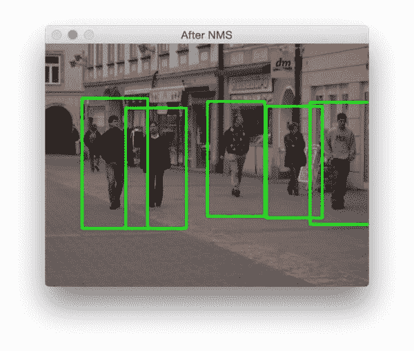
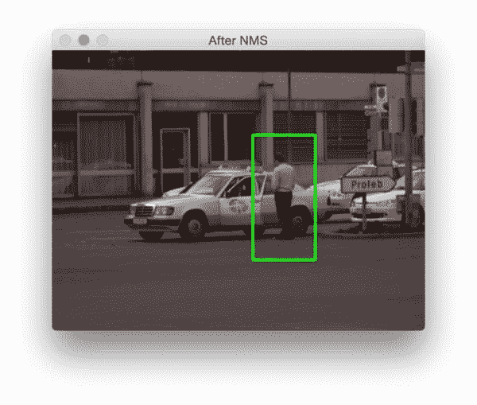
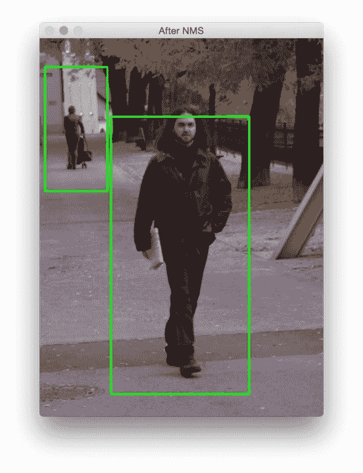
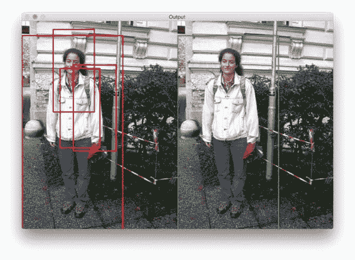
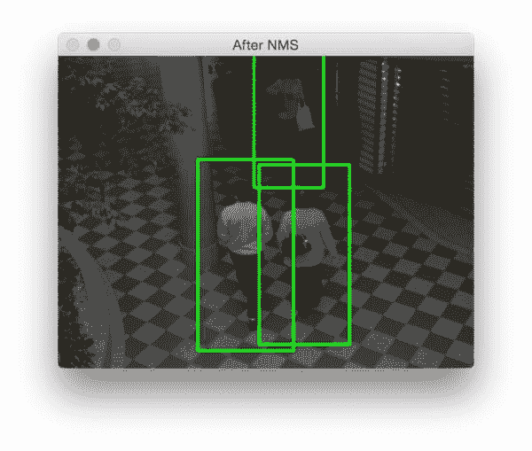
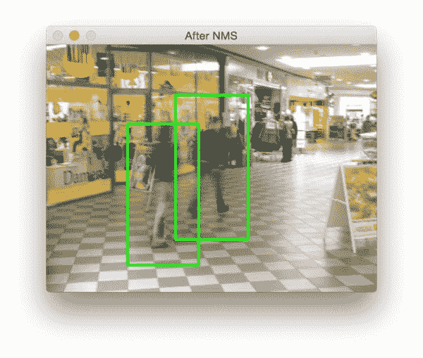
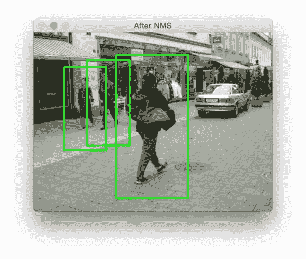
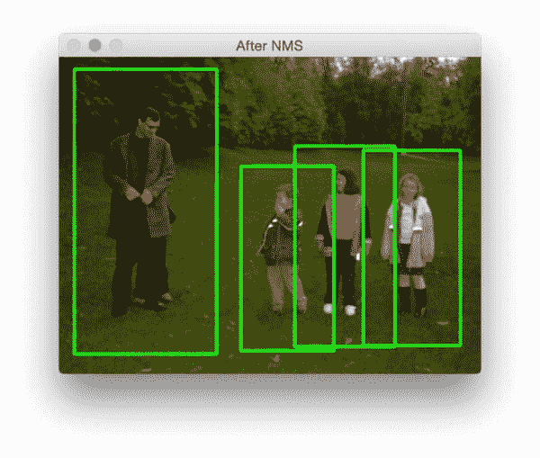
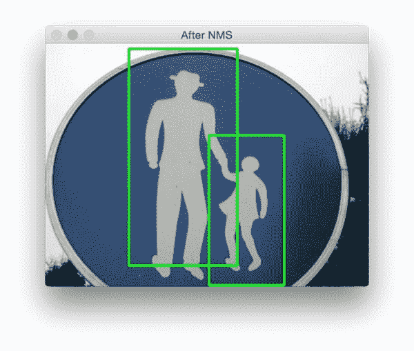

# 行人检测 opencv

> 原文：<https://pyimagesearch.com/2015/11/09/pedestrian-detection-opencv/>

[](https://pyimagesearch.com/wp-content/uploads/2015/11/pedestrian_detection_person_175.jpg)

这些年来，我遇到了很多令人惊讶、令人振奋的人。帮助我读完研究生的博士导师。我的父亲总是在我小时候陪着我，现在也是。还有我的女朋友，她一直都很积极，乐于助人，支持我(即使我可能不配)。

我也遇到过一些令人沮丧、气馁的人。竭尽全力阻止我创业和为自己工作的家人。那些要么不喜欢我，要么不喜欢我的工作，并选择以公开的方式表达他们的鄙视的同事们。还有一些人在电子邮件、推特和其他网络渠道上说了一些令人沮丧的话。

我们都熟悉这些类型的人。然而，不管他们的态度如何(无论积极还是消极)，我们都是由四种核碱基的相同遗传物质构成的:胞嘧啶、鸟嘌呤、腺嘌呤和胸腺嘧啶。

这些碱基对以这样一种方式组合在一起，使得我们的身体都具有相同的基本结构*，而不管性别、种族或民族如何。**在最结构的层面上，我们都有一个*头*、*两条胳膊*、一个*躯干*和*两条腿*。***

我们可以使用计算机视觉来开发这种*半刚性*结构，并提取特征来量化人体。这些特征可以传递给机器学习模型，当经过训练时，这些模型可以用来在图像和视频流中 ***检测*** 和 ***跟踪*** 人类。这对于 ***行人检测*** 的任务特别有用，这也是我们今天博文要讨论的话题。

请继续阅读，了解如何使用 OpenCV 和 Python 来执行行人检测。

## 行人检测 opencv

您知道 OpenCV 有 ***内置方法*** 来执行行人检测吗？

OpenCV 附带了一个预训练的 HOG +线性 SVM 模型，可用于在图像和视频流中执行行人检测。如果你不熟悉梯度方向直方图和线性 SVM 方法，我建议你阅读这篇博客文章，我在这里讨论了 6 步框架 。

如果你已经熟悉这个过程(或者如果你只是想看一些关于如何使用 OpenCV 进行行人检测的代码)，只需打开一个新文件，命名为`detect.py`，我们就会得到代码:

```py
# import the necessary packages
from __future__ import print_function
from imutils.object_detection import non_max_suppression
from imutils import paths
import numpy as np
import argparse
import imutils
import cv2

# construct the argument parse and parse the arguments
ap = argparse.ArgumentParser()
ap.add_argument("-i", "--images", required=True, help="path to images directory")
args = vars(ap.parse_args())

# initialize the HOG descriptor/person detector
hog = cv2.HOGDescriptor()
hog.setSVMDetector(cv2.HOGDescriptor_getDefaultPeopleDetector())

```

**2-8 线**从导入我们必要的包开始。我们将导入`print_function`以确保我们的代码兼容 Python 2.7 和 Python 3(该代码也适用于 OpenCV 2.4.X 和 OpenCV 3)。从那里，我们将从我的 [imutils](https://github.com/jrosebr1/imutils) 包中导入`non_max_suppression`函数。

如果您的 ***没有*** 安装`imutils`，让`pip`为您安装:

```py
$ pip install imutils

```

如果你 ***做*** 安装了`imutils`，你需要升级到最新版本( *v0.3.1* )，其中包括`non_max_suppression`功能的实现，以及其他一些小的更新:

```py
$ pip install --upgrade imutils

```

我已经在 PyImageSearch 博客上讨论过两次非极大值抑制，一次是在这篇[介绍性文章](https://pyimagesearch.com/2014/11/17/non-maximum-suppression-object-detection-python/)中，另一次是在这篇关于[实现更快的 NMS 算法](https://pyimagesearch.com/2015/02/16/faster-non-maximum-suppression-python/)的文章中。在任一情况下，非最大值抑制算法的要点是采用*多个重叠的*边界框，并将它们减少到只有一个边界框:

[](https://pyimagesearch.com/wp-content/uploads/2015/11/pedestrian_detection_person_032.jpg)

**Figure 1:** *(Left)* Multiple bounding boxes are falsely detected for the person in the image. *(Right)* Applying non-maxima suppression allows us to suppress overlapping bounding boxes, leaving us with the correct final detection.

这有助于减少最终对象检测器报告的误报数量。

**第 11-13 行**处理解析我们的命令行参数。这里我们只需要一个开关，`--images`，它是到包含我们将要对其执行行人检测的图像列表的目录的路径。

最后，**16 号线和 17 号线**初始化我们的行人探测器。首先，我们调用`hog = cv2.HOGDescriptor()`来初始化梯度方向直方图描述符。然后，我们调用`setSVMDetector`将支持向量机设置为预训练的行人检测器，通过`cv2.HOGDescriptor_getDefaultPeopleDetector()`函数加载。

此时，我们的 OpenCV 行人检测器已完全加载，我们只需将其应用于一些图像:

```py
# loop over the image paths
for imagePath in paths.list_images(args["images"]):
	# load the image and resize it to (1) reduce detection time
	# and (2) improve detection accuracy
	image = cv2.imread(imagePath)
	image = imutils.resize(image, width=min(400, image.shape[1]))
	orig = image.copy()

	# detect people in the image
	(rects, weights) = hog.detectMultiScale(image, winStride=(4, 4),
		padding=(8, 8), scale=1.05)

	# draw the original bounding boxes
	for (x, y, w, h) in rects:
		cv2.rectangle(orig, (x, y), (x + w, y + h), (0, 0, 255), 2)

	# apply non-maxima suppression to the bounding boxes using a
	# fairly large overlap threshold to try to maintain overlapping
	# boxes that are still people
	rects = np.array([[x, y, x + w, y + h] for (x, y, w, h) in rects])
	pick = non_max_suppression(rects, probs=None, overlapThresh=0.65)

	# draw the final bounding boxes
	for (xA, yA, xB, yB) in pick:
		cv2.rectangle(image, (xA, yA), (xB, yB), (0, 255, 0), 2)

	# show some information on the number of bounding boxes
	filename = imagePath[imagePath.rfind("/") + 1:]
	print("[INFO] {}: {} original boxes, {} after suppression".format(
		filename, len(rects), len(pick)))

	# show the output images
	cv2.imshow("Before NMS", orig)
	cv2.imshow("After NMS", image)
	cv2.waitKey(0)

```

在**第 20 行**我们开始循环浏览`--images`目录中的图像。这篇博文中的示例(以及本文源代码下载中包含的其他图片)是来自流行的 [INRIA 个人数据集](http://pascal.inrialpes.fr/data/human/)的样本(具体来说，来自 GRAZ-01 子集)。

从那里，**第 23-25 行**处理从磁盘上加载我们的图像，并调整它的最大宽度为 400 像素。我们试图减少图像尺寸的原因有两个:

1.  减小图像尺寸确保需要评估[图像金字塔](https://pyimagesearch.com/2015/03/16/image-pyramids-with-python-and-opencv/)中的更少的[滑动窗口](https://pyimagesearch.com/2015/03/23/sliding-windows-for-object-detection-with-python-and-opencv/)(即，从线性 SVM 中提取 HOG 特征，然后传递给线性)，从而减少检测时间(并增加整体检测吞吐量)。
2.  调整我们的图像大小也提高了我们的行人检测的整体准确性(即，更少的误报)。

通过调用`hog`描述符的`detectMultiScale`方法，第**行第 28 行和第 29 行**实际检测图像中的行人。`detectMultiScale`方法分别在 *x* 和 *y* 方向上构建具有`scale=1.05`和`(4, 4)`像素的滑动窗口步长的[图像金字塔](https://pyimagesearch.com/2015/03/16/image-pyramids-with-python-and-opencv/)。

滑动窗口的大小固定在*64×128 像素*，如开创性的 Dalal 和 Triggs 论文 *[用于人体检测的定向梯度直方图](http://lear.inrialpes.fr/people/triggs/pubs/Dalal-cvpr05.pdf)所建议的。*`detectMultiScale`函数返回一个二元组的`rects`，或边界框 *(x，y)*-图像中每个人的坐标，以及`weights`，SVM 为每个检测返回的置信度值。

较大的`scale`尺寸将评估图像金字塔中的*较少的*层，这可以使算法运行得更快。然而，使*的比例过大*(即图像金字塔中的层数较少)会导致无法检测到行人。类似地，使`scale`尺寸的*过小*会显著增加*需要评估的图像金字塔层数。这不仅会造成计算上的浪费，还会显著增加行人检测器检测到的误报数量。也就是说，在执行行人检测时，`scale`是最重要的参数之一。我将在以后的博客文章中对`detectMultiScale`的每个参数进行更彻底的回顾。*

第 32 行和第 33 行获取我们的初始边界框，并把它们画在我们的图像上。

然而，对于一些图像，你会注意到为每个人检测到了*多个重叠的*边界框(如上面的**图 1** 所示)。

在这种情况下，我们有两个选择。我们可以检测一个边界框是否*完全包含在另一个内*(作为 [OpenCV 示例](https://github.com/Itseez/opencv/blob/master/samples/python2/peopledetect.py)实现的一个)。或者我们可以应用[非最大值抑制](https://pyimagesearch.com/2015/02/16/faster-non-maximum-suppression-python/)和*抑制与重要阈值重叠的*边界框——这正是**第 38 行和第 39 行**所做的。

***注意:*** *如果你有兴趣了解更多关于 HOG 框架和非极大值抑制的知识，我会从阅读这篇关于 6 步框架的[介绍文章开始。从那里，查看](https://pyimagesearch.com/2014/11/10/histogram-oriented-gradients-object-detection/)[这篇关于简单非最大值抑制的文章](https://pyimagesearch.com/2014/11/17/non-maximum-suppression-object-detection-python/)，随后是一篇实现优化的 [Malisiewicz 方法](https://pyimagesearch.com/2015/02/16/faster-non-maximum-suppression-python/)的更新文章。*

在应用非最大值抑制后，我们在第 42 行和第 43 行的**上绘制最终的边界框，在第 46-48 行**的**上显示图像的一些基本信息和边界框的数量，最后在第 51-53 行**的**上将我们的输出图像显示到我们的屏幕上。**

## 图像中行人检测的结果

要查看我们的行人检测脚本的运行情况，只需发出以下命令:

```py
$ python detect.py --images images

```

下面我提供了检测脚本的结果示例:

[](https://pyimagesearch.com/wp-content/uploads/2015/11/pedestrian_detection_person_258.jpg)

**Figure 2**: The first result of our pedestrian detection script.

这里我们发现一个人站在警车旁边。

[](https://pyimagesearch.com/wp-content/uploads/2015/11/pedestrian_detection_person_014.jpg)

**Figure 3:** Detecting a single person in the foreground and another person in the background.

在上面的例子中，我们可以看到在图像的前景中检测到一个男人，而在背景中检测到一个推着婴儿车的女人。

[](https://pyimagesearch.com/wp-content/uploads/2015/11/pedestrian_detection_person_032.jpg)

**Figure 4:** An example of why applying non-maxima suppression is important.

上图提供了一个例子，说明为什么应用非最大值抑制很重要。`detectMultiScale`函数错误地检测到两个边界框(以及正确的边界框)，两者都与图像中的真人重叠。通过应用非最大值抑制，我们能够抑制无关的边界框，留给我们真正的检测

[](https://pyimagesearch.com/wp-content/uploads/2015/11/pedestrian_detection_person_029.jpg)

**Figure 5:** A second example demonstrating non-maxima suppression in action.

同样，我们看到检测到多个错误的边界框，但是通过应用 NMS，我们可以移除它们，给我们留下图像中的真实检测。

[](https://pyimagesearch.com/wp-content/uploads/2015/11/pedestrian_detection_person_156.jpg)

**Figure 6:** Detecting pedestrians in a shopping mall.

这里，我们正在检测购物中心的行人。请注意，有两个人正朝着*远离*摄像机的方向走去，而另一个人正朝着摄像机的方向走去*。在这两种情况下，我们的 HOG 方法都能够检测到人。`non_maxima_suppression`函数中较大的`overlapThresh`确保边界框不被抑制，即使它们部分重叠。*

[](https://pyimagesearch.com/wp-content/uploads/2015/11/pedestrian_detection_person_390.jpg)

**Figure 7:** Detecting people in a blurred image.

上图的结果让我特别惊讶。通常 HOG 描述符在存在运动模糊的情况下表现不佳，但是我们仍然能够检测出该图像中的行人。

[](https://pyimagesearch.com/wp-content/uploads/2015/11/pedestrian_detection_person_293.jpg)

**Figure 8:** Detecting pedestrians outdoors, walking along the street.

这是多个重叠边界框的另一个例子，但是由于更大的`overlapThresh`，它们被*而不是*抑制，留给我们正确的人物检测。

[](https://pyimagesearch.com/wp-content/uploads/2015/11/pedestrian_detection_person_265.jpg)

**Figure 9:** Detecting four members of a family.

上图展示了我们的 HOG + SVM 行人探测器的多功能性。我们不仅能探测到成年男性，还能探测到三个小孩。(注意，检测器不能发现躲在他[假定是]父亲后面的另一个孩子)。

[](https://pyimagesearch.com/wp-content/uploads/2015/11/pedestrian_detection_person_454.jpg)

**Figure 10:** Detecting a depiction of pedestrians.

我把这张图片放在最后只是因为我觉得它很有趣。我们清楚地看到一个路标，很可能是用来指示人行横道的。然而，我们的 HOG + SVM 检测器将此图像中的两个人标记为阳性分类！

## 摘要

在这篇博文中，我们学习了如何使用 OpenCV 库和 Python 编程语言来执行行人检测。

OpenCV 库实际上搭载了一个*预先训练好的* [HOG +线性 SVM 检测器](https://pyimagesearch.com/2014/11/10/histogram-oriented-gradients-object-detection/)基于 Dalal 和 Triggs 方法来*自动检测图像中的行人*。

虽然 HOG 方法比 Haar 方法更精确，但它仍然需要正确设置`detectMultiScale`的参数。在以后的博客文章中，我将回顾`detectMultiScale`的每个参数，详细说明如何调整它们，并描述准确性和性能之间的权衡。

无论如何，我希望你喜欢这篇文章！我计划在未来做更多的物体检测教程，所以如果你想在这些帖子发布时得到通知，请考虑使用下面的表格订阅时事通讯。

我还在 **PyImageSearch 大师课程**、*、**、[中详细介绍了使用 HOG +线性 SVM 方法的物体检测，所以一定要看一看！](https://pyimagesearch.com/pyimagesearch-gurus/)***