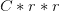

# 利用 TensorFlow、Keras 和深度学习实现像素混洗超分辨率

> 原文：<https://pyimagesearch.com/2021/09/27/pixel-shuffle-super-resolution-with-tensorflow-keras-and-deep-learning/>

当图像的尺寸增加时(***，**)沿着宽度和高度，传统方法导致新的像素信息被创建，这经常降低图像质量，给出柔和且模糊的图像作为输出。值得庆幸的是，正如近年来的大多数话题一样，深度学习给了我们许多可行的解决方案来解决这个问题。*

 *在今天的博客中，我们将学习如何实现像素洗牌超分辨率，这是一个美丽的概念，让我们领略了深度学习对超分辨率领域的贡献。

该博客将涵盖:

*   利用 BSDS500 数据集
*   了解剩余密集块体系结构
*   实现像素洗牌
*   展示一系列预处理和后处理方法
*   训练我们自己的超分辨率模型
*   从模型结果中得出推论
*   根据标准指标评估结果
*   在模型上测试你自己的图像

在本教程结束时，你将对像素洗牌和这里显示的概念有一个清晰的理解。

您还可以定义自己的超分辨率架构，享受自定义图像带来的乐趣！如果这听起来很有趣，那就让我们开始吧。

**要了解如何实现像素洗牌超分辨率，** ***继续阅读。***

## **使用 TensorFlow、Keras 和深度学习的像素混合超分辨率**

最近，NVIDIA 制造了一个名为 [**深度学习超级采样**【DLSS】](https://www.nvidia.com/en-in/geforce/technologies/dlss/)的发明。它使用深度学习将低分辨率图像提升到更高的分辨率，以适应高分辨率显示器的显示。问题是，放大的图像显示的质量类似于以更高的分辨率自然渲染图像的质量。

与此同时，大部分计算是在图像分辨率较低的情况下完成的。这有效地使计算机基础较弱的人能够享受游戏而不损害质量。那么，这是怎么发生的？

### **配置您的开发环境**

要遵循本指南，您需要在系统上安装 TensorFlow 机器学习库。对于额外的图像处理目的，您将使用 Python 图像库(PIL)和 Imutils 库。

幸运的是，上面所有的库都是 pip 安装的！

```py
$ pip install tensorflow
$ pip install pillow
$ pip install imutils 
```

以上是本指南所需的环境配置！

### **在配置开发环境时遇到了问题？**

说了这么多，你是:

*   时间紧迫？
*   了解你雇主的行政锁定系统？
*   想要跳过与命令行、包管理器和虚拟环境斗争的麻烦吗？
*   **准备好在您的 Windows、macOS 或 Linux 系统上运行代码*****？***

 *那今天就加入 [PyImageSearch 大学](https://pyimagesearch.com/pyimagesearch-university/)吧！

**获得本教程的 Jupyter 笔记本和其他 PyImageSearch 指南，这些指南是** ***预先配置的*** **，可以在您的网络浏览器中运行在 Google Colab 的生态系统上！**无需安装。

最棒的是，这些 Jupyter 笔记本可以在 Windows、macOS 和 Linux 上运行！

### **项目结构**

在我们开始实现像素洗牌超分辨率之前，让我们看看项目结构。

一旦我们下载了我们的项目目录，它应该看起来像这样:

```py
$ tree .
.
├── generate_super_res.py
├── output
│   ├── super_res_model
│   │   ├── saved_model.pb
│   │   └── variables
│   │       ├── variables.data-00000-of-00001
│   │       └── variables.index
│   ├── training.png
│   └── visualizations
│       ├── 0_viz.png
│       ├── 1_viz.png
│       ├── 2_viz.png
│       ├── 3_viz.png
│       ├── 4_viz.png
│       ├── 5_viz.png
│       ├── 6_viz.png
│       ├── 7_viz.png
│       ├── 8_viz.png
│       └── 9_viz.png
├── pyimagesearch
│   ├── config.py
│   ├── data_utils.py
│   ├── __init__.py
│   └── subpixel_net.py
└── train.py

5 directories, 20 files
```

父目录有两个 python 脚本和两个文件夹。

*   `generate_super_res.py`:包含使用我们训练好的模型生成超分辨率图像的脚本。它还包含几个将用于图像预处理和后处理的函数。
*   python 脚本将调用我们定义的模型，训练它，并评估它的质量。它还包含我们将在模型中使用的定制度量函数。

接下来，让我们进入`pyimagesearch`目录！在其中，我们将找到 4 个 python 脚本:

*   `__init__.py`:这将使 python 把`pyimagesearch`目录当作一个模块
*   `config.py`:该脚本包含各种超参数预设，并定义数据路径
*   这个脚本将有助于在训练期间输入到我们的模型之前处理输入
*   `subpixel_net.py`:这个脚本包含了我们的超分辨率模型，它将被`train.py`脚本调用

最后，我们有一个`output`目录，其中包含:

*   `super_res_model`:我们训练好的模型将被存储的目录
*   `training.png`:样本模型评估图
*   `visualizations`:存储我们生成的所有超分辨率图像的目录。

### **什么是像素洗牌超分辨率？**

**超分辨率**是一类技术的总称，其中添加了精确或接近精确的像素信息，以从其低分辨率形式构建高分辨率图像，同时保持其原始质量。

**像素混洗超分辨率**是一种上采样技术，其中**图像超分辨率**以一种相当巧妙的方法实现。特征地图是在它的 **LR** (低分辨率)空间中提取的(与在 **HR** (高分辨率)空间中完成的早期技术相反)。

然而，这种方法的亮点是一种新颖的**高效亚像素卷积层**，它学习一系列过滤器来将最终的 LR 特征映射放大到 HR 输出中。这种方法不仅取得了巨大的成功，而且降低了时间复杂度，因为大量的计算是在图像处于低分辨率状态时完成的。

我们还使用了**剩余密集块** (RDBs)，这是一种架构，主要关注保持在先前层提取的信息有效，同时计算当前层的输出。

### **配置先决条件**

对于今天的任务，我们将使用 **BSDS500** ，也称为伯克利分段数据集。该数据集是专门为图像分割领域提供帮助而创建的，包含 500 幅图像。

如果使用的是非 Linux 系统，可以在这里获取数据集[(右键保存链接)](http://www.eecs.berkeley.edu/Research/Projects/CS/vision/grouping/BSR/BSR_bsds500.tgz)。这将启动压缩数据集的下载。将这个 zip 文件的内容解压缩到项目的目录中。

如果您使用的是 Linux 系统，您可以简单地导航到项目的目录并执行以下命令:

```py
$ wget http://www.eecs.berkeley.edu/Research/Projects/CS/vision/grouping/BSR/BSR_bsds500.tgz
$ tar xvf BSR_bsds500.tgz
```

在开始实现之前，让我们设置路径和超参数。为此，我们将进入模块`config.py`。我们项目中的大多数其他脚本将调用这个模块并使用它的预置。

```py
# import the necessary packages
import os

# specify root path to the BSDS500 dataset
ROOT_PATH = os.path.join("BSR", "BSDS500", "data", "images")

# specify paths to the different splits of the dataset
TRAIN_SET = os.path.join(ROOT_PATH, "train")
VAL_SET = os.path.join(ROOT_PATH, "val")
TEST_SET = os.path.join(ROOT_PATH, "test")
```

首先，我们将把我们的`ROOT_PATH`设置为数据集，如**第 5 行**所示。从`ROOT_PATH`开始，我们分别定义我们的训练、验证和测试集路径(**第 8-10 行**)。为了方便起见， **BSDS500** 已经以数据集被分为训练集、验证集和测试集的方式进行了设置。

```py
# specify the initial size of the images and downsampling factor
ORIG_SIZE = (300, 300)
DOWN_FACTOR = 3

# specify number of RDB blocks, batch size, number of epochs, and
# initial learning rate to train our model
RDB_LAYERS = 3
BATCH_SIZE = 8
EPOCHS = 100
LR = 1e-3

#define paths to serialize trained model, training history plot, and
# path to our inference visualizations
SUPER_RES_MODEL = os.path.join("output", "super_res_model")
TRAINING_PLOT = os.path.join("output", "training.png")
VISUALIZATION_PATH = os.path.join("output", "visualizations")
```

我们的下一步工作是设置一些重要的超参数:

*   `ORIG_SIZE`:将是我们图像的原始和目标形状(**第 13 行**)
*   `DOWN_FACTOR`:确定我们将缩减原始图像的采样量(**第 14 行**)
*   `RDB_LAYERS`:指定单个 RDB 内的卷积层数(**第 18 行**)

除此之外，我们还设置**批量大小、时期、**和**学习速率** ( **第 19-21 行**)，并定义路径来序列化我们训练过的模型和历史图(**第 25 和 26 行**)。我们还创建了一个路径来保存将要创建的可视化效果( **Line 27** )。

### **数据(图像)处理步骤**

我们的下一步是创建一个处理图像处理任务的模块。为此，我们转到`data_utils.py`脚本。

```py
# import the necessary packages
from . import config
import tensorflow as tf

def process_input(imagePath, downFactor=config.DOWN_FACTOR):
	# determine size of the downsampled images
	resizeShape = config.ORIG_SIZE[0] // downFactor

	# load the original image from disk, decode it as a JPEG image,
	# scale its pixel values to [0, 1] range, and resize the image
	origImage = tf.io.read_file(imagePath)
	origImage = tf.image.decode_jpeg(origImage, 3)
	origImage = tf.image.convert_image_dtype(origImage, tf.float32)
	origImage = tf.image.resize(origImage, config.ORIG_SIZE,
		method="area")
```

根据我们的图像处理要求，我们编写了一个以`imagePath`和`downFactor`为参数的函数`process_input` ( **Line 5** )。我们直接使用在`config.py`模块中设置的下采样因子。在**第 7 行**上，注意我们正在使用`downFactor`和原始图像尺寸来创建缩小尺寸所需的值。这一步的意义将在后面解释。

**第 11-15 行**包含基本的图像处理步骤，例如从指定的路径读取图像，将图像转换成必要的数据类型(本例中为`Float32`)，以及根据我们之前在`config.py`模块中设置的大小调整图像大小。

```py
	# convert the color space from RGB to YUV and only keep the Y
	# channel (which is our target variable)
	origImageYUV = tf.image.rgb_to_yuv(origImage)
	(target, _, _) = tf.split(origImageYUV, 3, axis=-1)

	# resize the target to a lower resolution
	downImage = tf.image.resize(target, [resizeShape, resizeShape],
		method="area")

	# clip the values of the input and target to [0, 1] range
	target = tf.clip_by_value(target, 0.0, 1.0)
	downImage = tf.clip_by_value(downImage, 0.0, 1.0)

	# return a tuple of the downsampled image and original image
	return (downImage, target)
```

接下来，我们做剩下的处理。在**的第 19 和 20 行，**我们使用`tf.image.rgb_to_yuv`函数将我们的图像从`RGB`转换成`YUV`格式，并分离出 **Y 通道**(因为它将是我们的目标变量)。在**第 23 和 24 行**上，我们使用`tf.image.resize`创建缩小的图像，最后，在**第 27 和 28 行上，**我们使用`tf.clip_by_value`功能，通过范围`[0.0, 1.0]`裁剪目标和缩小图像的值。

### **用剩余密集块(RDB)实现亚像素 CNN**

在我们进入`subpixel_net.py`模块之前，让我们试着去理解**剩余密集块**背后的动机。

当我们第一次了解 CNN 时，关于它们的一个主要主题是，当我们从最初的层到后来的层时，CNN 的层提取简单的特征到越来越复杂/抽象/高级的特征。

RDB 打算尽可能地利用这一想法，用卷积层的密集连接网络提取尽可能多的层次特征。为了更好地理解这一点，让我们来看看 RDB。

**图 2** 显示了在一个 RDB 中，所有层都是相互连接的，以确保充分提取局部特征。每一层都从所有前面的层(通过连接)获得额外的输入，并将自己的特征映射传递给后面的层。

这样，也保留了网络的前馈性质。注意另一件重要的事情；来自先前层的输出与当前 RDB 内的所有本地连接有直接链接。最简单的含义是，来自前一层的信息将总是与当前状态一起可用，这使得我们的模型能够自适应地从各种特征中选择和区分优先级。这样，每一点信息都被保存了！

*如果你听说过* ***ResNets*** *和* ***密集块*******图 2*** *可能看起来很熟悉，因为 RDB 利用了这两个概念。**

 *我们来看一下`subpixel_net.py`中剩余密集块的代码。

```py
# import the necessary packages
from . import config
from tensorflow.keras.layers import Add
from tensorflow.keras.layers import Conv2D
from tensorflow.keras.layers import Input
from tensorflow.keras.models import Model
import tensorflow as tf

def rdb_block(inputs, numLayers):
	# determine the number of channels present in the current input
	# and initialize a list with the current inputs for concatenation
	channels = inputs.get_shape()[-1]
	storedOutputs = [inputs]
```

我们从`rdb_block`函数(**第 9 行**)开始，它接受一个层输入和块数作为参数。在**的第 12 行和第 13 行**，我们将通道的数量存储在一个变量中以备后用，同时创建一个列表`storedOutputs`，当遇到它们时，它将连接输出。

```py
	# iterate through the number of residual dense layers
	for _ in range(numLayers):
		# concatenate the previous outputs and pass it through a
		# CONV layer, and append the output to the ongoing concatenation
		localConcat = tf.concat(storedOutputs, axis=-1)
		out = Conv2D(filters=channels, kernel_size=3, padding="same",
			activation="relu",
			kernel_initializer="Orthogonal")(localConcat)
		storedOutputs.append(out)
```

这里，我们实现了 RDB 的内部结构。我们直接遍历 RDB 中的每个图层，并存储每个输出。在第 19 行**上，** `localConcat`充当到每个先前层的链接，如前所述。当我们遍历给定数量的层时，`localConcat`会遇到之前的每个输出，这些输出会在每次迭代结束时被追加到`storedOutputs`列表中(*回显一个密集块*)。在**线 20-22** 上，`localConcat`然后被送到`Conv2D`层。

```py
	# concatenate all the outputs, pass it through a pointwise
	# convolutional layer, and add the outputs to initial inputs
	finalConcat = tf.concat(storedOutputs, axis=-1)
	finalOut = Conv2D(filters=inputs.get_shape()[-1], kernel_size=1,
		padding="same", activation="relu",
		kernel_initializer="Orthogonal")(finalConcat)
	finalOut = Add()([finalOut, inputs])

	# return the final output
	return finalOut
```

在**的第 27 行**，我们将所有先前存储在`storedOutputs`中的输出连接起来，并为其分配一个新变量`finalConcat`。`finalConcat`然后被送入`Conv2D`层，这样就完成了 RDB 的内部结构。**行 3** 1 的最后一步是将我们的初始输入与我们的最终级联输出相加(*回显剩余块*)。这样，我们就完成了对剩余密集块的编码。可以对 RDB 中的图层数量进行实验，以了解结果是如何受到影响的。

接下来是我们的整体模型架构，在这里我们将实现**像素混洗。**

```py
def get_subpixel_net(downsampleFactor=config.DOWN_FACTOR, channels=1,
	rdbLayers=config.RDB_LAYERS):
	# initialize an input layer
	inputs = Input((None, None, 1))

	# pass the inputs through a CONV => CONV block
	x = Conv2D(64, 5, padding="same", activation="relu",
		kernel_initializer="Orthogonal")(inputs)
	x = Conv2D(64, 3, padding="same", activation="relu",
		kernel_initializer="Orthogonal")(x)

	# pass the outputs through an RDB => CONV => RDB block
	x = rdb_block(x, numLayers=rdbLayers)
	x = Conv2D(32, 3, padding="same", activation="relu",
		kernel_initializer="Orthogonal")(x)
	x = rdb_block(x, numLayers=rdbLayers)
```

我们从第 37 和 38 行的**开始，定义`get_subpixel_net`的参数，这也是我们的模型函数。当`rdbBlocks`参数使用在`config.py`中设置的单个块中的层数时，在`config.py`中定义的下采样因子对于我们知道我们需要用什么因子来放大图像是必要的。我们还有参数`channels`，默认设置为`1`，因为我们已经将图像预处理为 **YUV** 格式并隔离了 Y 通道。**

模型架构包括添加两个`Conv2D`层(**行 43-46** )，之后我们调用前面定义的`rdb_block`函数(**行 49** )。接着是另一个`Conv2D`层和一个 RDB 块(**行 50-52** )。

我们代码的下一部分是奇迹发生的地方。在开始之前，让我们感谢 [TensorFlow](https://www.tensorflow.org/) 的人们给了我们这么漂亮的效用函数`tf.nn.depth_to_space`。

根据其正式定义，它是一种将深度数据重新排列成空间数据块的功能。理解这一点是我们揭开**像素错位**之谜的关键。

当我们谈论深度时，我们指的是张量中的通道数量(用图像术语来说)。因此，如果我们有一个形状为**`2, 2, 12`的**张量**，并且我们想要将`depth_to_space`应用于一个因子(也称为`block_size`)为`2`的张量，我们必须看到通道大小是如何除以`block_size` × `block_size`的。对于通道大小`12`，我们看到`12/(2×2)`给出了新的通道大小`3`。**

 **但是，由于我们的通道大小减少到`3`，我们显然必须增加我们的高度和宽度**维持张量的整体大小，因为我们没有丢失数据，只是重新排列它**。这给了我们`4, 4, 3`的最终**张量**形状。

*这种现象就是我们所说的* ***像素洗牌*** *，这里我们是重新排列* ")的元素

*to*  \times (W*r) \times C")**.**

```py
	# pass the inputs through a final CONV layer such that the
	# channels of the outputs can be spatially organized into
	# the output resolution
	x = Conv2D(channels * (downsampleFactor ** 2), 3, padding="same",
		activation="relu", kernel_initializer="Orthogonal")(x)
	outputs = tf.nn.depth_to_space(x, downsampleFactor)

	# construct the final model and return it
	model = Model(inputs, outputs)
	return model
```

注意在第 57 行的**上，`Conv2D`层的滤镜数量被设置为`channels` × `downsampleFactor`的平方。我们本质上是在实现**

step before proceeding to use the `tf.nn.depth_to_space` (**Line 59**) function, where the tensor will be rearranged.

注意，即使这是我们的最终输出，`tf.nn.depth_to_space`是**而不是**模型的可学习参数。这意味着`Conv2D`层必须正确学习其放大滤波器，以便最终输出在反向传播期间产生最小的损耗。

### **训练像素混洗超分辨率模型**

随着所有繁重工作的完成，留给我们的就是训练我们的模型，并在不同的图像上测试它。为此，让我们进入`train.py`模块。

在导入必要的包后，我们定义一个名为`psnr`的函数，它以一幅原始图像和一幅预测图像作为它的参数。我们的主要目的是通过比较原始图像和预测图像来计算**峰值信噪比(PSNR)** 。

```py
# USAGE
# python train.py

# import the necessary packages
from pyimagesearch.data_utils import process_input
from pyimagesearch import config
from pyimagesearch import subpixel_net
from imutils import paths
import matplotlib.pyplot as plt
import tensorflow as tf

def psnr(orig, pred):
	# cast the target images to integer
	orig = orig * 255.0
	orig = tf.cast(orig, tf.uint8)
	orig = tf.clip_by_value(orig, 0, 255)

	# cast the predicted images to integer
	pred = pred * 255.0
	pred = tf.cast(pred, tf.uint8)
	pred = tf.clip_by_value(pred, 0, 255)

	# return the psnr
	return tf.image.psnr(orig, pred, max_val=255)
```

注意在**第 14-16 行**和**第 19-21 行**上，我们是如何将像素值从范围`[0.0, 1.0]`提升到`[0, 255]`的。为了便于计算，张量也被转换成整数。对于 PSNR 计算，我们使用`tf.image.psnr`函数(**第 24 行**)。顾名思义，比值越高，噪声值越低。`psnr`函数也将作为我们的模型度量。

我们的下一个任务是为训练和验证路径分配变量，并相应地创建我们的训练和验证数据集。

```py
# define autotune flag for performance optimization
AUTO = tf.data.AUTOTUNE

# load the image paths from disk and initialize TensorFlow Dataset
# objects
print("[INFO] loading images from disk...")
trainPaths = list(paths.list_images(config.TRAIN_SET))
valPaths = list(paths.list_images(config.VAL_SET))
trainDS = tf.data.Dataset.from_tensor_slices(trainPaths)
valDS = tf.data.Dataset.from_tensor_slices(valPaths)
```

第 32 行和第 33 行上的`paths.list_images`函数为我们提供了所需目录中的所有可用图像，然后我们将这些图像作为列表传递给`tf.data.Dataset.from_tensor_slices`函数来初始化一个`TensorFlow Dataset Object` ( **第 34 行和第 35 行**)。

接下来，我们创建训练和验证数据加载器，并编译我们的模型。

```py
# prepare data loaders
print("[INFO] preparing data loaders...")
trainDS = trainDS.map(process_input,
					  num_parallel_calls=AUTO).batch(
	config.BATCH_SIZE).prefetch(AUTO)
valDS = valDS.map(process_input,
				  num_parallel_calls=AUTO).batch(
	config.BATCH_SIZE).prefetch(AUTO)

# initialize, compile, and train the model
print("[INFO] initializing and training model...")
model = subpixel_net.get_subpixel_net()
model.compile(optimizer="adam", loss="mse", metrics=psnr)
H = model.fit(trainDS, validation_data=valDS, epochs=config.EPOCHS)
```

在**第 39-44 行**，我们使用`tf.data.Dataset.map`函数将数据集元素映射到一个函数，并返回一个新的数据集。我们正在使用的函数是`process_input`，它是我们在`data_utils`模块中定义的。这样，我们训练和验证数据加载器就准备好了。

正如你在**第 49 行**看到的，我们使用`psnr`作为我们的模型度量，这意味着我们模型的目标将是最大化**峰值信噪比**。我们使用`adam`优化器，并选择`mse`(均方差)作为我们的损失函数。在**第 50 行**上，我们继续用数据加载器装配我们的模型。

```py
# prepare training plot of the model and serialize it
plt.style.use("ggplot")
plt.figure()
plt.plot(H.history["loss"], label="train_loss")
plt.plot(H.history["val_loss"], label="val_loss")
plt.plot(H.history["psnr"], label="train_psnr")
plt.plot(H.history["val_psnr"], label="val_psnr")
plt.title("Training Loss and PSNR")
plt.xlabel("Epoch #")
plt.ylabel("Loss/PSNR")
plt.legend(loc="lower left")
plt.savefig(config.TRAINING_PLOT)

# serialize the trained model
print("[INFO] serializing model...")
model.save(config.SUPER_RES_MODEL)
```

在第 53-63 行上，我们绘制了一些图表来评估我们的模型进展如何。我们的模型现在已经准备好了，我们将在一些测试图像上使用它，看看结果如何。所以，别忘了保存你的模型( **Line 67** )！

### **培训结果和损失可视化**

在执行文件`train.py`时，我们的模型得到训练。下面是该模型在历史上的培训历史，一旦您运行该模块，您将完全可以使用它。

```py
$ python train.py
[INFO] loading images from disk...
[INFO] preparing data loaders...
[INFO] initializing and training model...
Epoch 1/100
25/25 [==============================] - 4s 65ms/step - loss: 0.0859 - psnr: 11.9725 - val_loss: 0.0105 - val_psnr: 18.9549
Epoch 2/100
25/25 [==============================] - 1s 42ms/step - loss: 0.0084 - psnr: 20.2418 - val_loss: 0.0064 - val_psnr: 20.6150
Epoch 3/100
25/25 [==============================] - 1s 42ms/step - loss: 0.0055 - psnr: 22.3704 - val_loss: 0.0043 - val_psnr: 22.2737
...
Epoch 98/100
25/25 [==============================] - 1s 42ms/step - loss: 0.0019 - psnr: 27.2354 - val_loss: 0.0021 - val_psnr: 26.2384
Epoch 99/100
25/25 [==============================] - 1s 42ms/step - loss: 0.0019 - psnr: 27.2533 - val_loss: 0.0021 - val_psnr: 25.9284
Epoch 100/100
25/25 [==============================] - 1s 42ms/step - loss: 0.0019 - psnr: 27.2359 - val_loss: 0.0021 - val_psnr: 25.9741
[INFO] serializing model...
```

因此，我们得到最终的**验证损失**为 **0.0021** 和**验证 PSNR** 得分 **25.9741** 。

**图 3** 显示了训练历史曲线，显示了不同时期的训练损失和 PSNR 分数**。**

### **像素混洗生成超分辨率图像**

既然我们的模特培训结束了，那就来讨论几件事吧。我们模型的图表和分数表明，RDB 的使用并没有显著提高 PSNR 的统计数据。那么，我们的模型擅长于哪里呢？让我们测试一下，自己看看。

为了最终通过使用经过训练的具有 RDB 的亚像素 CNN 应用超分辨率来生成图像，让我们打开`generate_super_res.py`并开始编码。

```py
# USAGE
# python generate_super_res.py

# import the necessary packages
from pyimagesearch import config
from PIL import Image
from tensorflow.keras.preprocessing.image import load_img
from tensorflow.keras.models import load_model
from imutils import paths
import matplotlib.pyplot as plt
import tensorflow as tf
import numpy as np

def psnr(orig, pred):
	# cast the target images to integer
	orig = orig * 255.0
	orig = tf.cast(orig, tf.uint8)
	orig = tf.clip_by_value(orig, 0, 255)

	# cast the predicted images to integer
	pred = pred * 255.0
	pred = tf.cast(pred, tf.uint8)
	pred = tf.clip_by_value(pred, 0, 255)

	# return the psnr
	return tf.image.psnr(orig, pred, max_val=255)
```

我们从第 15 行的**开始，定义另一个函数`psnr`，它计算预测输出和原始图像的 **PSNR** 。如前所述，PSNR 越高，结果越好。**

```py
def load_image(imagePath):
	# load image from disk and downsample it using the bicubic method
	orig = load_img(imagePath)
	downsampled = orig.resize((orig.size[0] // config.DOWN_FACTOR,
		orig.size[1] // config.DOWN_FACTOR), Image.BICUBIC)

	# return a tuple of the original and downsampled image
	return (orig, downsampled)
```

在第 29 行**，**上，我们编写了一个辅助函数`load_image`，它将图像路径作为参数，并返回原始图像和缩减采样后的图像。注意在第 32 和 33 行的**上，我们根据在`config.py`模块中定义的`DOWN_FACTOR`对图像进行下采样。这是非常重要的一步，因为我们模型的输出尺寸取决于此。**

```py
def get_y_channel(image):
	# convert the image to YCbCr colorspace and then split it to get the
	# individual channels
	ycbcr = image.convert("YCbCr")
	(y, cb, cr) = ycbcr.split()

	# convert the y-channel to a numpy array, cast it to float, and
	# scale its pixel range to [0, 1]
	y = np.array(y)
	y = y.astype("float32") / 255.0

	# return a tuple of the individual channels
	return (y, cb, cr)
```

接下来，我们定义一个名为`get_y_channel`的函数，它将 **RGB** 图像转换为其等效的 **YCbCr** 形式，以隔离 **Y 通道**。根据我们在整个博客中维护的东西，在通过我们的模型之前，我们将像素值缩放到范围`[0.0, 1.0]` ( **Line 47** )。

```py
def clip_numpy(image):
	# cast image to integer, clip its pixel range to [0, 255]
	image = tf.cast(image * 255.0, tf.uint8)
	image = tf.clip_by_value(image, 0, 255).numpy()

	# return the image
	return image
```

**第 52-58 行**包含我们最后的辅助函数`clip_numpy`，它根据给定的范围裁剪图像的值。由于该函数是我们后处理步骤的一部分，我们将从`[0.0, 1.0]` ( **行 54** )再次将范围扩大到`[0, 255]`，并剪裁任何超出给定边界(**行 55** )的值。

```py
def postprocess_image(y, cb, cr):
	# do a bit of initial preprocessing, reshape it to match original
	# size, and then convert it to a PIL Image
	y = clip_numpy(y).squeeze()
	y = y.reshape(y.shape[0], y.shape[1])
	y = Image.fromarray(y, mode="L")

	# resize the other channels of the image to match the original
	# dimension
	outputCB= cb.resize(y.size, Image.BICUBIC)
	outputCR= cr.resize(y.size, Image.BICUBIC)

	# merge the resized channels altogether and return it as a numpy
	# array
	final = Image.merge("YCbCr", (y, outputCB, outputCR)).convert("RGB")
	return np.array(final)
```

在这里，让我提醒你，我们的模型只适用于 Y 通道，因此也将输出一个 Y 通道。**第 60-75 行**包含`postprocess_image`将我们的预测结果转换成 **RGB** 图像。

完成所有的效用函数后，我们终于可以继续生成一些超分辨率图像了。我们创建一个名为`testPaths`的变量，它将包含所有可用测试图像的路径。第二个变量`currentTestPaths`将在每次被调用时从可用的测试路径中随机选择 10 个值。我们还加载了之前保存的模型。

```py
# load the test image paths from disk and select ten paths randomly
print("[INFO] loading test images...")
testPaths = list(paths.list_images(config.TEST_SET))
currentTestPaths = np.random.choice(testPaths, 10)

# load our super-resolution model from disk
print("[INFO] loading model...")
superResModel = load_model(config.SUPER_RES_MODEL,
	custom_objects={"psnr" : psnr})
```

遍历`currentTestPaths` ( **第 80 行**)中可用的测试图像路径，我们将图像通过我们的模型，并将预测与使用朴素双三次方法(用于放大图像的旧技术之一)调整大小的图像进行比较。

```py
# iterate through our test image paths
print("[INFO] performing predictions...")
for (i, path) in enumerate(currentTestPaths):
	# grab the original and the downsampled images from the
	# current path
	(orig, downsampled) = load_image(path)

	# retrieve the individual channels of the current image and perform
	# inference
	(y, cb, cr) = get_y_channel(downsampled)
	upscaledY = superResModel.predict(y[None, ...])[0]

	# postprocess the output and apply the naive bicubic resizing to
	# the downsampled image for comparison
	finalOutput = postprocess_image(upscaledY, cb, cr)
	naiveResizing = downsampled.resize(orig.size, Image.BICUBIC)

	# visualize the results and save them to disk
	path = os.path.join(config.VISUALIZATION_PATH, f"{i}_viz.png")
	(fig, (ax1, ax2)) = plt.subplots(ncols=2, figsize=(12, 12))
	ax1.imshow(naiveResizing)
	ax2.imshow(finalOutput.astype("int"))
	ax1.set_title("Naive Bicubic Resizing")
	ax2.set_title("Super-res Model")
	fig.savefig(path, dpi=300, bbox_inches="tight")
```

一旦进入循环，我们从第 92 行的**开始，将当前迭代中的路径传递给`load_image`函数，然后用`get_y_channel`函数隔离 **Y 通道**。在**行 97** 上，我们将隔离的 Y 通道传递给我们的超分辨率模型。注意格式是怎样的`superResModel.predict(y)[0]`。这是因为我们只需要模型输出的列表中第一个元素的值。我们通过`postprocess_image`函数传递预测的输出。**

我们已经完成了推理代码。在第**行第 105** 处，我们引用了为保存可视化效果而创建的目录。现在是时候浏览由**106-111**行生成的剧情了。

### **可视化生成的超分辨率图像**

有了所有的代码，我们剩下要做的就是在 shell 脚本中运行`python generate_super_res.py`命令。

```py
$ python generate_super_res.py
[INFO] loading test images...
[INFO] loading model...
[INFO] performing predictions...
```

如前所述，使用**剩余密集块**对 **PSNR** 属性没有任何显著影响。然而，通过对图像**(图 4-7)** 的可视化，我们看到它们在视觉质量上比简单的双三次方法优越。从这些可视化中可以得出一个微妙的结论； **RDNs** 很好地学习了**层次特征**，足以让图像升级到如此值得称赞的视觉质量。

## **总结**

在本教程中，我们学习了一种方法来实现超分辨率的帮助下，一个有效的亚像素 CNN 拟合剩余密集块。在这个过程中，我们还遇到了几个在实现中使用的漂亮概念。

最后，我们观察到子像素 CNN 产生了与原始图像几乎相同质量的图像。鼓励读者修改参数(例如，RDB 内的层数)以查看结果是如何受到影响的。当你与全世界分享你的结果时，一定要标记 PyImageSearch([@ PyImageSearch](https://twitter.com/hashtag/pyimagesearch?src=hashtag_click))！

### **引用信息**

**Chakraborty，D.** “使用 TensorFlow、Keras 和深度学习的像素混洗超分辨率”， *PyImageSearch* ，2021 年，[https://PyImageSearch . com/2021/09/27/Pixel-shuffle-super-resolution-with-tensor flow-Keras-and-deep-learning/](https://pyimagesearch.com/2021/09/27/pixel-shuffle-super-resolution-with-tensorflow-keras-and-deep-learning/)

`@article{dev2021, author = {Devjyoti Chakraborty}, title = {Pixel Shuffle Super Resolution with {TensorFlow}, {K}eras, and Deep Learning}, journal = {PyImageSearch}, year = {2021}, note = {https://pyimagesearch.com/2021/09/27/pixel-shuffle-super-resolution-with-tensorflow-keras-and-deep-learning/}, }`

**要下载这篇文章的源代码(并在未来教程在 PyImageSearch 上发布时得到通知)，*只需在下面的表格中输入您的电子邮件地址！********