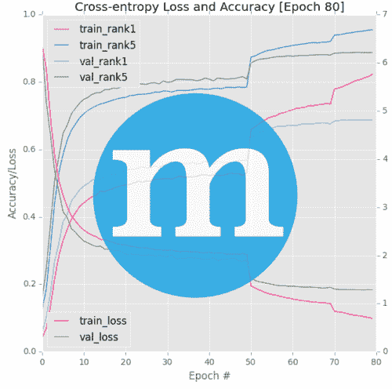
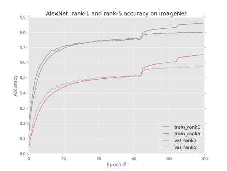

# 如何用 mxnet 绘制精度和损耗图

> 原文：<https://pyimagesearch.com/2017/12/25/plot-accuracy-loss-mxnet/>



当谈到在多个 GPU(更不用说多台机器)上进行高性能深度学习时，我倾向于使用 [mxnet 库](https://mxnet.apache.org/)。

作为 Apache 孵化器的一部分，mxnet 是一个灵活、高效和可扩展的深度学习库( [Amazon 甚至在他们自己的内部深度学习中使用它](https://www.infoworld.com/article/3144025/cloud-computing/why-amazon-picked-mxnet-for-deep-learning.html))。

在我的书《用 Python 进行计算机视觉深度学习的 [*的 ImageNet 捆绑包中，我们使用 mxnet 库来重现最先进的出版物的结果，并在大规模 ImageNet 数据集上训练深度神经网络，*事实上的*图像分类基准(由大约 120 万张图像组成)。*](https://pyimagesearch.com/deep-learning-computer-vision-python-book/)

尽管 mxnet 具有可扩展性，但不幸的是，它缺少一些我们可能在 Keras、TensorFlow/TensorBoard 和其他深度学习库中找到的便利功能。

mxnet misses 的这些便利方法之一是绘制精度和随时间的损失。

mxnet 库将训练进度记录到您的终端或文件中，类似于 Caffe。

但是为了构建一个显示准确性和时间损失的图表，我们需要手动解析日志。

将来，我希望我们可以使用 mxnet 提供的回调方法来获取这些信息，但是我个人发现它们很难使用(特别是在利用多个 GPU 或多台机器时)。

相反，我建议您在使用 mxnet 构建准确性和损失图时解析原始日志文件。

**在今天的博文中，我将展示如何解析 mxnet 的训练日志文件，然后绘制准确性和随时间的损失——要了解如何继续阅读**、**、*、*。**

## 如何用 mxnet 绘制精度和损耗图

在今天的教程中，我们将使用 mxnet 库绘制精度和损耗。mxnet v.0.11 和 v0.12 之间的日志文件格式略有变化，因此我们将在这里讨论这两个版本。

特别是，我们将绘制:

*   培训损失
*   验证损失
*   训练 1 级准确度
*   验证等级-1 准确度
*   训练等级-5 准确度
*   验证等级-5 准确度

这六个指标通常是在 ImageNet 数据集上训练深度神经网络时测量的。

我们将解析的相关日志文件来自我们在 AlexNet inside [*中的章节，使用 Python 进行计算机视觉的深度学习*](https://pyimagesearch.com/deep-learning-computer-vision-python-book/) ，我们在 ImageNet 数据集上训练开创性的 AlexNet 架构。

***对我的书的免费样章感兴趣？**免费目录+示例章节包括 ImageNet 捆绑包第 5 章“在 ImageNet 上培训 AlexNet”。在[本页](https://pyimagesearch.com/deep-learning-computer-vision-python-book/)右下方的表格中输入您的电子邮件，获取免费章节。*

当解析 mxnet 日志文件时，我们通常在磁盘上有一个或多个`.log`文件，如下所示:

```py
(dl4cv) pyimagesearch@pyimagesearch-dl4cv:~/plot_log$ ls -al
total 108
drwxr-xr-x  2 pyimagesearch pyimagesearch  4096 Dec 25 15:46 .
drwxr-xr-x 23 pyimagesearch pyimagesearch  4096 Dec 25 16:48 ..
-rw-r--r--  1 pyimagesearch pyimagesearch  3974 Dec 25  2017 plot_log.py
-rw-r--r--  1 pyimagesearch pyimagesearch 60609 Dec 25  2017 training_0.log
-rw-r--r--  1 pyimagesearch pyimagesearch 20303 Dec 25  2017 training_65.log
-rw-r--r--  1 pyimagesearch pyimagesearch 12725 Dec 25  2017 training_85.log

```

这里您可以看到我有三个 mxnet 日志文件:

*   `training_0.log`
*   `training_65.log`
*   `training_85.log`

每个日志文件中的整数值是我开始训练我的深度神经网络时的**。**

 **在大型数据集上训练深度卷积神经网络时，我们通常必须:

1.  停止训练
2.  降低学习率
3.  恢复早期的训练

这个过程使我们能够打破局部最优，下降到较低损失的区域，并提高我们的分类精度。

根据上面文件名中的整数值，您可以看到 I:

1.  从零纪元(第一个日志文件)开始训练
2.  停止训练，降低学习率，并从纪元 65(第二个日志文件)开始恢复训练
3.  再次停止训练，这一次是在第 85 个纪元，降低学习率，并恢复训练(第三个也是最后一个日志文件)

我们的目标是编写一个 Python 脚本，该脚本可以解析 mxnet 日志文件，并创建一个类似于下图的图，其中包括有关我们训练准确性的信息:

[](https://pyimagesearch.com/wp-content/uploads/2017/12/mxnet_plot_alexnet_imagenet_rank1_rank5_acc.png)

**Figure 1:** mxnet was used to train AlexNet on the ImageNet dataset. Using `plot_logs.py` we’ve parsed the log files in order to generate this plot utilizing matplotlib.

首先，让我们来看一个`mxnet <= 0.11`的 mxnet 培训日志格式的例子:

```py
INFO:root:Epoch[73] Batch [500]	Speed: 1694.57 samples/sec	Train-accuracy=0.584035
INFO:root:Epoch[73] Batch [500]	Speed: 1694.57 samples/sec	Train-top_k_accuracy_5=0.816547
INFO:root:Epoch[73] Batch [500]	Speed: 1694.57 samples/sec	Train-cross-entropy=1.740517
INFO:root:Epoch[73] Batch [1000]	Speed: 1688.18 samples/sec	Train-accuracy=0.589742
INFO:root:Epoch[73] Batch [1000]	Speed: 1688.18 samples/sec	Train-top_k_accuracy_5=0.820633
INFO:root:Epoch[73] Batch [1000]	Speed: 1688.18 samples/sec	Train-cross-entropy=1.714734
INFO:root:Epoch[73] Resetting Data Iterator
INFO:root:Epoch[73] Time cost=728.322
INFO:root:Saved checkpoint to "imagenet/checkpoints/alexnet-0074.params"
INFO:root:Epoch[73] Validation-accuracy=0.559794
INFO:root:Epoch[73] Validation-top_k_accuracy_5=0.790751
INFO:root:Epoch[73] Validation-cross-entropy=1.914535

```

我们可以清楚地看到`Epoch[*]`文本中的纪元编号— **这将使提取纪元编号**变得容易。

可以通过解析出以下值来提取所有验证信息，包括验证准确性、验证 top-k(即排名-5)和验证交叉熵:

*   `Validation-accuracy`
*   `Validation-top_k_accuracy_5`
*   `Validation-cross-entropy`

唯一棘手的提取是我们的训练集信息。

如果 mxnet 能像他们为验证所做的那样，在纪元结束时记录最终的训练精度和损失，那就太好了——但不幸的是，mxnet 没有这样做。

相反，mxnet 库基于“批处理”记录训练信息。在每`N`批(其中`N`是用户在训练期间提供的值)之后，mxnet 将训练准确度和损失记录到磁盘。

因此，如果我们提取以下各项的最终批次值:

*   `Train-accuracy`
*   `Train-top_k_accuracy`
*   `Train-cross-entropy`

…我们将能够获得给定时期的训练精度和损失的近似值。

你可以通过在训练过程中调整`Speedometer`回调，让你的训练精度和损耗更细粒度或者更不啰嗦。

让我们继续创建负责实际解析日志的`plot_log.py`文件。

打开一个新文件，将其命名为`plot_log.py`，并插入以下代码:

```py
# import the necessary packages
import matplotlib.pyplot as plt
import numpy as np
import argparse
import re

# construct the argument parse and parse the arguments
ap = argparse.ArgumentParser()
ap.add_argument("-n", "--network", required=True,
	help="name of network")
ap.add_argument("-d", "--dataset", required=True,
	help="name of dataset")
args = vars(ap.parse_args())

```

今天我们还将利用`re`，Python 的正则表达式解析器(**第 5 行**)。

我一直认为 Google 关于 Python 正则表达式的文档是最好的——如果你不熟悉 Python 中的正则表达式解析，一定要去[看看](https://developers.google.com/edu/python/regular-expressions)。

另一个我最喜欢的网站是 Regex101.com。这个网站将允许你用最流行的编码语言测试你的正则表达式。我发现它对解析软件的开发非常有帮助。

现在我们已经准备好完成今天工作所需的工具，让我们解析一下第 8-13 行的命令行参数。

我们的`plot_log.py`脚本需要两个命令行参数:

*   `--network`:网络的名称。
*   `--dataset`:数据集的名称。

我们将在脚本的后面引用这些`args`。

现在我们将创建一个`logs`列表:

```py
# define the paths to the training logs
logs = [
	(65, "training_0.log"),			# lr=1e-2
	(85, "training_65.log"),		# lr=1e-3
	(100, "training_85.log"),		# lr=1e-4
]

```

考虑到`logs`列表作为命令行参数包含起来有点棘手，我在这里为这个示例脚本硬编码了**。当您绘制自己的日志时，您将需要编辑此列表。
**

一种替代方法是为每个实验创建一个 JSON(或等效的)配置文件，然后在执行`plot_logs.py`时从磁盘加载它。

正如您在**第 16-20 行**中看到的，我已经在一个元组列表中定义了日志文件路径以及它们对应的时期。

请务必阅读上面关于日志文件名的讨论。简而言之，**文件名本身包含开始时期**，元组的**第一个元素包含结束时期**。

对于这个例子，我们有三个日志文件，因为训练被停止两次以调整学习率。您可以根据自己的需要轻松地添加或删除列表中的内容。

从这里开始，我们将只执行一些紧凑列表初始化:

```py
# initialize the list of train rank-1 and rank-5 accuracies, along
# with the training loss
(trainRank1, trainRank5, trainLoss) = ([], [], [])

# initialize the list of validation rank-1 and rank-5 accuracies,
# along with the validation loss
(valRank1, valRank5, valLoss) = ([], [], [])

```

**第 24 行和第 28 行**简单地以 Pythonic 的方式将变量初始化为空列表。我们将很快更新这些列表。

现在让我们遍历日志，开始正则表达式匹配:

```py
# loop over the training logs
for (i, (endEpoch, p)) in enumerate(logs):
	# load the contents of the log file, then initialize the batch
	# lists for the training and validation data
	rows = open(p).read().strip()
	(bTrainRank1, bTrainRank5, bTrainLoss) = ([], [], [])
	(bValRank1, bValRank5, bValLoss) = ([], [], [])

	# grab the set of training epochs
	epochs = set(re.findall(r'Epoch\[(\d+)\]', rows))
	epochs = sorted([int(e) for e in epochs])

```

在第 31 行的**上，我们开始循环遍历`logs`，我们的元组列表。**

我们在第 34 行的**上`open`和`read`一个日志文件，同时去掉不必要的空白。**

训练和验证数据将存储在批处理列表中，所以我们继续初始化/设置这些列表为空(**行 35 和 36** )。

***注意:**如果你没有注意到，让我在这里指出，我们已经初始化了 13 个列表。人们很容易对每个列表的目的感到困惑。十三也往往是一个不吉利的数字，所以让我们现在就把事情搞清楚。为了澄清，以`b`开头的 6 个列表是批列表——我们将成批地填充这些列表，然后将它们按元素追加(扩展)到在循环之前定义的相应的 6 个训练和验证列表。第 13 个列表`logs`很简单，因为它只是我们的纪元编号和日志文件路径。如果你是解析日志的新手或者在理解代码时有困难，确保你插入了`print`语句进行调试，并确保你理解了代码在做什么。* 

我们第一次使用`re`是在**第 39 行**。这里我们从日志文件的行中解析纪元编号。

正如我们在这篇文章的前面所知道的，日志文件包含`Epoch[*]`，所以如果你仔细阅读，你会看到我们正在从括号中提取十进制数字`\d+`。请务必参考 [Google Python 正则表达式文档](https://developers.google.com/edu/python/regular-expressions#basic-patterns)来理解语法，或者继续阅读，在那里我将更详细地解释下一个正则表达式。

对这个正则表达式找到的`epochs`进行排序是在第 40 行的**中完成的。**

现在，我们将遍历列表中的每个时期，并提取+附加训练信息到相应的列表:

```py
	# loop over the epochs
	for e in epochs:
		# find all rank-1 accuracies, rank-5 accuracies, and loss
		# values, then take the final entry in the list for each
		s = r'Epoch\[' + str(e) + '\].*Train-accuracy=(.*)'
		rank1 = re.findall(s, rows)[-1]
		s = r'Epoch\[' + str(e) + '\].*Train-top_k_accuracy_5=(.*)'
		rank5 = re.findall(s, rows)[-1]
		s = r'Epoch\[' + str(e) + '\].*Train-cross-entropy=(.*)'
		loss = re.findall(s, rows)[-1]

		# update the batch training lists
		bTrainRank1.append(float(rank1))
		bTrainRank5.append(float(rank5))
		bTrainLoss.append(float(loss))

```

在第 43 行上，我们开始循环所有的时期。

我们提取三个值:

*   我们排名第一的准确性。
*   这是我们 5 级的精确度。
*   `Train-cross-entropy`:这个值是我们的损失。

…为了干净利落地做到这一点，每次提取都跨越两行代码。

我将在第**行的第 46 行和第 47 行的第**行分解等级 1 的准确性提取—其他提取遵循相同的格式。

对于时段 3，批次 500，日志文件如下所示(从第 38 行的**开始):**

```py
INFO:root:Epoch[3] Batch [500]	Speed: 1692.63 samples/sec	Train-accuracy=0.159705
INFO:root:Epoch[3] Batch [500]	Speed: 1692.63 samples/sec	Train-top_k_accuracy_5=0.352742
INFO:root:Epoch[3] Batch [500]	Speed: 1692.63 samples/sec	Train-cross-entropy=4.523639

```

等级 1 精度位于“=”之后的第 38 行的末端**。**

所以我们要寻找“Epoch[**3**]”+*<any char(s)>*+“Train-accuracy = "+*<**”rank-1 浮点值** >* 。

首先，我们构建正则表达式格式字符串`s`。我们匹配(寻找)的内容大部分是拼写出来的，但是也有一些特殊的正则表达式格式字符混合在一起:

*   反斜杠(“\”)是转义字符。因为我们明确地寻找'['和']'，所以我们在每个前面加了一个反斜杠。
*   的”。* "表示任何字符—在这种情况下，它位于格式字符串的中间，这意味着中间可能有任何字符。
*   关键字符是'('和')'，它标记我们的提取。在这种情况下，我们提取的是行中“=”后面的字符。

然后，在我们构造了`s`之后，在下一行我们调用`re.findall`。使用我们的格式字符串，`s`和`rows`,`re.findall`函数找到所有匹配项并提取排名 1 的精确度。神奇！

***旁注:**我们只对最后一个值感兴趣，因此有了`[-1]`列表索引。*

要查看这个 Python 正则表达式的运行情况，我们来看一个来自[Regex101.com](http://regex101.com)的截图(点击图片放大):

[](https://pyimagesearch.com/wp-content/uploads/2017/12/mxnet_regex101_not_scaled.png)

**Figure 2:** Using [Regex101.com](http://regex101.com), we can easily work on Regular Expressions with Python.

我再次强烈推荐 Regex101 从正则表达式开始。它对于解析高级和复杂的字符串也非常有用(幸运的是我们的相对简单)。

接下来的两个表达式在第 48-51 行以同样的方式被解析。

我们已经成功提取了这些值，所以下一步是将这些值以浮点形式添加到它们各自的列表中的第 54-56 行上。

从那里，我们可以用同样的方式获取验证信息:

```py
	# extract the validation rank-1 and rank-5 accuracies for each
	# epoch, followed by the loss
	bValRank1 = re.findall(r'Validation-accuracy=(.*)', rows)
	bValRank5 = re.findall(r'Validation-top_k_accuracy_5=(.*)', rows)
	bValLoss = re.findall(r'Validation-cross-entropy=(.*)', rows)

	# convert the validation rank-1, rank-5, and loss lists to floats
	bValRank1 = [float(x) for x in bValRank1]
	bValRank5 = [float(x) for x in bValRank5]
	bValLoss = [float(x) for x in bValLoss]

```

我不会再重复复杂的正则表达式匹配了。因此，一定要研究上面的例子，并将其应用到第 60-63 行中，在这里我们提取验证等级 1、等级 5 和损失值。如果需要，将日志文件数据和正则表达式字符串插入 Regex101，如图**图 2** 所示。

和以前一样，我们将字符串转换成浮点型(这里是列表理解)并将列表附加到各自的批处理列表中(**第 65-67 行**)。

接下来，我们将计算出我们的数组切片，以便我们可以更新将用于绘图的列表:

```py
	# check to see if we are examining a log file other than the
	# first one, and if so, use the number of the final epoch in
	# the log file as our slice index
	if i > 0 and endEpoch is not None:
		trainEnd = endEpoch - logs[i - 1][0]
		valEnd = endEpoch - logs[i - 1][0]

	# otherwise, this is the first epoch so no subtraction needs
	# to be done
	else:
		trainEnd = endEpoch
		valEnd = endEpoch

```

这里需要设置`trainEnd`和`valEnd`。这些临时值将用于切片。

为此，我们检查当前正在解析哪个日志文件。我们知道哪个日志正在被解析，因为我们在开始循环时枚举了这些值。

如果我们碰巧检查的不是第一个日志，我们将使用日志文件中最后一个时期的时期号作为我们的片索引(**第 72-74 行**)。

否则，不需要发生减法，所以我们简单地将`trainEnd`和`valEnd`设置为`endEpoch` ( **第 78-80 行**)。

最后但同样重要的是，我们需要更新培训和验证列表:

```py
	# update the training lists
	trainRank1.extend(bTrainRank1[0:trainEnd])
	trainRank5.extend(bTrainRank5[0:trainEnd])
	trainLoss.extend(bTrainLoss[0:trainEnd])

	# update the validation lists
	valRank1.extend(bValRank1[0:valEnd])
	valRank5.extend(bValRank5[0:valEnd])
	valLoss.extend(bValLoss[0:valEnd])

```

使用来自循环每次迭代的批列表，我们将它们以元素的方式(这在 Python 中被称为扩展)添加到各自的训练列表(**第 83-85 行**)和验证列表(**第 88-90 行**)。

在我们遍历每个日志文件之后，我们有 6 个方便的列表可以绘制。

现在，我们的数据已经在这些有用的列表中进行了解析和组织，让我们继续使用 matplotlib 构建图表:

```py
# plot the accuracies
plt.style.use("ggplot")
plt.figure()
plt.plot(np.arange(0, len(trainRank1)), trainRank1,
	label="train_rank1")
plt.plot(np.arange(0, len(trainRank5)), trainRank5,
	label="train_rank5")
plt.plot(np.arange(0, len(valRank1)), valRank1,
	label="val_rank1")
plt.plot(np.arange(0, len(valRank5)), valRank5,
	label="val_rank5")
plt.title("{}: rank-1 and rank-5 accuracy on {}".format(
	args["network"], args["dataset"]))
plt.xlabel("Epoch #")
plt.ylabel("Accuracy")
plt.legend(loc="lower right")

```

这里我们绘制了训练+验证的 1 级和 5 级精度。我们还从命令行参数中为我们的图指定了一个标题。

同样，让我们绘制训练+验证损失:

```py
# plot the losses
plt.style.use("ggplot")
plt.figure()
plt.plot(np.arange(0, len(trainLoss)), trainLoss,
	label="train_loss")
plt.plot(np.arange(0, len(valLoss)), valLoss,
	label="val_loss")
plt.title("{}: cross-entropy loss on {}".format(args["network"],
	args["dataset"]))
plt.xlabel("Epoch #")
plt.ylabel("Loss")
plt.legend(loc="upper right")
plt.show()

```

在 mxnet 0.12 和更高版本中，日志文件的格式略有变化。

主要区别是训练精度和损失现在显示在同一行。这里有一个来自第三纪元的例子，批次 500:

```py
INFO:root:Epoch[3] Batch [500]	Speed: 1997.40 samples/sec	accuracy=0.013391	top_k_accuracy_5=0.048828	cross-entropy=6.878449

```

确保向右滚动以查看**行 47** 的全部输出。

感谢澳大利亚国立大学医学院的丹尼尔·邦纳博士，我们有了一个更新的剧本:

```py
	# loop over the epochs
	for e in epochs:
		# find all rank-1 accuracies, rank-5 accuracies, and loss
		# values, then take the final entry in the list for each
		s = r'Epoch\[' + str(e) + '\].*accuracy=([0]*\.?[0-9]+)'
		rank1 = re.findall(s, rows)[-2]
		s = r'Epoch\[' + str(e) + '\].*top_k_accuracy_5=([0]*\.?[0-9]+)'
		rank5 = re.findall(s, rows)[-2]
		s = r'Epoch\[' + str(e) + '\].*cross-entropy=([0-9]*\.?[0-9]+)'
		loss = re.findall(s, rows)[-2]

		# update the batch training lists
		bTrainRank1.append(float(rank1))
		bTrainRank5.append(float(rank5))
		bTrainLoss.append(float(loss))

```

请务必查看下面的 ***“下载”*** 部分，在那里您可以下载这两个版本的脚本。

### 结果

我用 [mxnet](https://mxnet.apache.org/) 框架在 [ImageNet 数据集](http://image-net.org/)上训练了 Krizhevsky 等人的 [AlexNet](https://papers.nips.cc/paper/4824-imagenet-classification-with-deep-convolutional-neural-networks.pdf) CNN，在我的书《用 Python 进行计算机视觉的 [*中有详细介绍。*](https://pyimagesearch.com/deep-learning-computer-vision-python-book/)

一路上，我一边调整学习率，一边停止/开始训练过程。这个过程产生了前面提到的三个日志文件。

现在，通过一个命令，使用这篇博文中描述的方法，我已经解析了所有三个日志文件，并使用 matplotlib 生成了训练进度图:

```py
$ python plot_log.py --network AlexNet --dataset ImageNet

```

[](https://pyimagesearch.com/wp-content/uploads/2017/12/mxnet_plot_logs_screenshot.png)

**Figure 3:** The `plot_logs.py` script has been used to plot data from mxnet training log files using Python and matplotlib.

## 摘要

在今天的博文中，我们学习了如何解析 mxnet 日志文件，提取训练和验证信息(包括损失和准确性)，然后绘制这些信息。

解析 mxnet 日志可能有点乏味，所以我希望这篇博客文章中提供的代码可以帮助你。

如果你有兴趣学习如何使用 mxnet 库训练自己的卷积神经网络，一定要看看我的新书《用 Python 进行计算机视觉的深度学习[](https://pyimagesearch.com/deep-learning-computer-vision-python-book/)*》的 ImageNet 包。*

 ***否则，*请务必在下面的表格中输入您的电子邮件地址*，以便在以后的博客文章发布时得到通知！*****