# 用 Python 预配置亚马逊 AWS 深度学习 AMI

> 原文：<https://pyimagesearch.com/2017/09/20/pre-configured-amazon-aws-deep-learning-ami-with-python/>


[Image credit](https://www.youtube.com/watch?time_continue=1703&v=thiAjdh_TvQ)

我的书 [*用 Python*](https://pyimagesearch.com/deep-learning-computer-vision-python-book/) 进行计算机视觉的深度学习所附带的 Ubuntu VirtualBox 虚拟机，包含了你需要的所有必要的深度学习和计算机视觉库(比如 Keras、TensorFlow、scikit-learn、scikit-image、OpenCV 等。)*预装。*

然而，尽管深度学习虚拟机易于使用，但它也有许多缺点，包括:

*   比在本机上执行指令要慢得多。
*   无法访问您的 GPU(以及连接到主机的其他外围设备)。

虚拟机在*便利性*方面所拥有的东西，你最终会为其在*性能*方面所付出的代价——这对于初来乍到的读者来说是一个很好的选择，但是如果你希望能够 ***大幅提升速度*** ，同时 ***仍然保持预先配置的环境*** ，你应该考虑使用亚马逊网络服务(AWS)和我预先构建的深度学习亚马逊机器映像(AMI)。

使用本教程中概述的步骤，您将学习如何登录(或创建)您的 AWS 帐户，旋转一个新实例(*带*或*不带*GPU)，并安装我预先配置的深度学习映像。这将使你能够享受预先构建的深度学习环境*而不*牺牲速度。

***(2019-01-07)发布 DL4CV 的 v 2.1:****AMI 2.1 版本发布有更多环境陪伴我的深度学习书的加成章节。*

**要了解如何使用我的深度学习 AMI，*继续阅读*。**

## 用 Python 预配置亚马逊 AWS 深度学习 AMI

在本教程中，我将向您展示如何:

1.  登录/创建您的 AWS 帐户。
2.  启动我预配置的深度学习 AMI。
3.  登录到服务器并执行您的代码。
4.  完成后停止机器。

然而，在我们走得太远之前，我想提一下:

*   深度学习 AMI 是 ***基于 Linux 的*** 所以我建议对 Unix 环境、*特别是*命令行有一些基本的了解。
*   AWS 不是免费的，需要按小时付费。时薪的多少取决于你选择的机器(无 GPU、一个 GPU、八个 GPU 等等。).不到 1 美元/小时，你就可以使用带有 GPU 的机器，这将大大加快深度神经网络的训练速度。你只为机器运行的时间付费。完成后，您可以关闭您的机器。

### 步骤 1:设置亚马逊网络服务(AWS)账户

为了启动我预先配置的深度学习，你首先需要一个亚马逊网络服务账户。

首先，进入[亚马逊网络服务主页](https://aws.amazon.com/)，点击*“登录控制台”*链接:

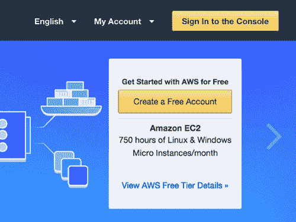

**Figure 1:** The Amazon Web Services homepage.

如果您已经有一个帐户，您可以使用您的电子邮件地址和密码登录。否则，您需要点击*“创建新的 AWS 帐户”*按钮并创建您的帐户:

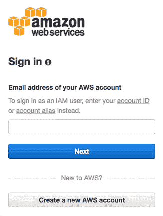

**Figure 2:** Logging in to your Amazon Web services account.

我鼓励你使用现有的 Amazon.com 的*登录，因为这将加快这个过程。*

### 步骤 2:选择并启动深度学习 AWS 实例

现在，您已经准备好启动预配置的深度学习 AWS 实例。

首先，您应该将您的地区/区域设置为*“美国西部(俄勒冈州)”* *。*我在俄勒冈地区创建了深度学习 AMI，所以你需要在这个地区找到它，启动它，并访问它:

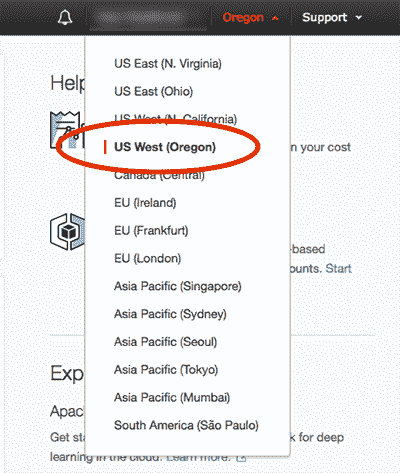

**Figure 3:** Setting your AWS region to *“US West (Oregon)”*.

将您的地区设置为俄勒冈州后，单击*“服务”*选项卡，然后选择*“EC2”*(弹性云计算):

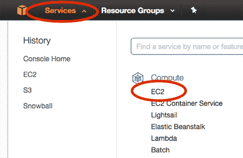

**Figure 4:** Accessing the Amazon EC2 dashboard.

在这里，您应该单击*“启动实例”*按钮:

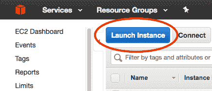

**Figure 5:** Launching an Amazon AWS instance for deep learning.

然后选择*“社区 ami”*，搜索 ***“用 python-v2.1 深度学习计算机视觉-ami-089 c 8796 ad 90 c 7807”:***

[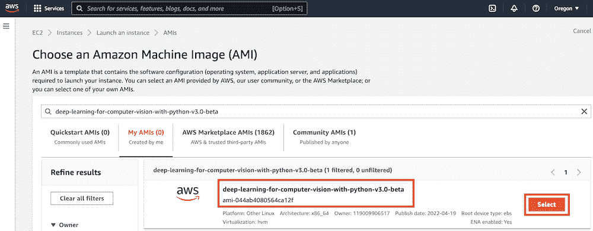](https://pyimagesearch.com/wp-content/uploads/2017/09/dl4cv-ami-v3.0-beta-2.png)

**Figure 6:** Searching for the Deep Learning for Computer Vision with Python AMI.

点击 AMI 旁边的*“选择”*。

现在可以选择实例类型了。亚马逊提供了大量虚拟服务器，用于运行各种各样的应用程序。这些实例具有不同数量的 CPU 能力、存储、网络容量或 GPU，因此您应该考虑:

1.  你想推出什么类型的机器。
2.  你特定的预算。

GPU 实例往往比标准 CPU 实例花费*更多*。然而，他们可以在很短的时间内训练深度神经网络。当您计算出在 CPU 上训练网络与在 GPU 上训练网络的平均时间时，您可能会意识到使用 GPU 实例将为您节省资金。

对于 CPU 实例，我建议您使用*“计算优化”* ***c4。**** 实例。特别是， **c4.xlarge** 实例是一个很好的尝试。

如果你想使用 GPU，我强烈推荐*“GPU 计算”*实例。 **p2.xlarge** 实例有一个 NVIDIA K80 (12GB 内存)。

其中**p 2.8x large**sports*8 GPU*。而 **p2.16xlarge** 有 *16 个 GPU*。

我已经列出了以下每个实例的价格(在撰写本文时):

*   **C4 . xlarge:**$ 0.199/小时
*   **p2 . x large:**$ 0.90/小时
*   **p 2.8 x 大:**$ 7.20/小时
*   **2.16 倍大:**$ 14.40/小时

如您所见，GPU 实例要贵得多；然而，你可以用成本的一小部分来训练网络，使它们成为一个更经济可行的选择。因此，如果这是你第一次使用 GPU 进行深度学习，我建议使用 **p2.xlarge** 实例。

在下面的示例截图中，您可以看到我选择了 p2.xlarge 实例:

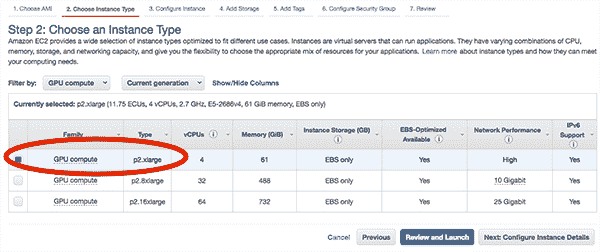

**Figure 7:** Selecting the p2.xlarge instance for deep learning using the GPU.

***(2019-01-07)DL4CV 2.1 版本:** AWS 目前在**【GPU 实例】**下有他们的 **p2** 实例，而不是“GPU 计算”。*

接下来，我可以单击*“查看并启动”*，然后单击*“启动”*来启动我的实例。

点击*“Launch”*后，系统会提示您选择您的密钥对或创建新的密钥对:

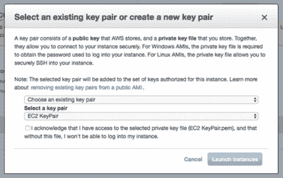

**Figure 8:** Selecting a key pair for our Elastic Cloud Compute instance.

如果您有一个现有的密钥对，您可以从下拉菜单中选择*“选择一个现有的密钥对”*。否则，您需要选择*【创建新的密钥对】*，然后下载密钥对。密钥对用于登录 AWS 实例。

在确认并接受来自 Amazon 的登录信息后，您的实例将开始启动。向下滚动到页面底部，然后单击*“查看实例”*。您的实例需要一分钟左右的时间才能启动。

一旦实例联机，您将看到实例的*“实例状态”*列被更改为*“正在运行”*。

选择它，您将能够查看实例的信息，包括 IP 地址:

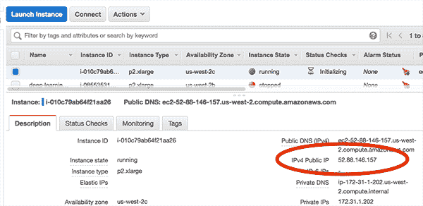

**Figure 9:** Examining the IP address of my deep learning AWS instance.

这里可以看到我的 IP 地址是`52.88.146.157`。**您的 IP 地址会有所不同。**

启动一个终端，您就可以将 SSH 引入到您的 AWS 实例中:

```py
$ ssh -i EC2KeyPair.pem ubuntu@52.88.146.157

```

您需要将上面的命令更新为:

1.  使用您为密钥对创建的文件名。
2.  使用实例的 IP 地址。

### 步骤 3:(仅 GPU 仅适用于 AMI 版本 1.0 和 1.2)重新安装 NVIDIA 深度学习驱动程序

***(2019-01-07)发布 DL4CV 2.1:**这一步是**对于**AMI 2.1 版本不需要**。**既不需要更新驱动程序，也不需要重新启动。启动并运行。但是，请注意下面的`nvidia-smi`命令，因为它对验证驱动程序操作很有用。*

如果您选择了 GPU 实例，您将需要:

1.  通过命令行重启您的 AMI
2.  卸载 nvidia 驱动程序

这两个步骤的原因是因为从预先配置的 AMI 中启动的实例可能会以略有不同的内核重新启动，因此导致加载新的(默认)驱动程序，而不是 NVIDIA 驱动程序。

要避免这种情况，您可以:

1.  重启你的系统*现在*，本质上是“锁定”当前内核，然后重新安装 NVIDA 驱动*一次*。
2.  每次从 AWS admin 启动/重启实例时，请重新安装 NVIDIA 驱动程序*。*

这两种方法各有利弊，但我推荐第一种。

首先，通过命令行重新启动实例:

```py
$ sudo reboot

```

您的 SSH 连接将在重启过程中终止。

一旦实例重新启动，重新 SSH 到实例，并重新安装 NVIDIA 内核驱动程序。幸运的是，这很容易，因为我已经将驱动程序文件包含在实例的主目录中。

如果您列出`installers`目录的内容，您会看到三个文件:

```py
$ ls -l installers/
total 1435300
-rwxr-xr-x 1 root root 1292835953 Sep  6 14:03 cuda-linux64-rel-8.0.61-21551265.run
-rwxr-xr-x 1 root root  101033340 Sep  6 14:03 cuda-samples-linux-8.0.61-21551265.run
-rwxr-xr-x 1 root root   75869960 Sep  6 14:03 NVIDIA-Linux-x86_64-375.26.run

```

将目录更改为`installers`，然后执行以下命令:

```py
$ cd installers
$ sudo ./NVIDIA-Linux-x86_64-375.26.run --silent

```

按照屏幕上的提示操作(包括覆盖任何现有的 NVIDIA 驱动程序文件),将会安装您的 NVIDIA 深度学习驱动程序。

您可以通过运行`nvidia-smi`命令来验证 NVIDIA 驱动程序是否安装成功:

```py
$ nvidia-smi
Wed Sep 13 12:51:43 2017       
+-----------------------------------------------------------------------------+
| NVIDIA-SMI 375.26                 Driver Version: 375.26                    |
|-------------------------------+----------------------+----------------------+
| GPU  Name        Persistence-M| Bus-Id        Disp.A | Volatile Uncorr. ECC |
| Fan  Temp  Perf  Pwr:Usage/Cap|         Memory-Usage | GPU-Util  Compute M. |
|===============================+======================+======================|
|   0  Tesla K80           Off  | 0000:00:1E.0     Off |                    0 |
| N/A   43C    P0    59W / 149W |      0MiB / 11439MiB |     97%      Default |
+-------------------------------+----------------------+----------------------+

+-----------------------------------------------------------------------------+
| Processes:                                                       GPU Memory |
|  GPU       PID  Type  Process name                               Usage      |
|=============================================================================|
|  No running processes found                                                 |
+-----------------------------------------------------------------------------+

```

### 步骤 4:在 AWS 上访问深度学习 Python 虚拟环境

***(2019-01-07)DL4CV 2.1 版本:**AMI 2.1 版本有以下环境:`dl4cv`、`mxnet`、`tfod_api`、`retinanet`、`mask_rcnn`。确保您在与您正在学习的 DL4CV 书籍章节相对应的正确环境中工作。此外，请务必参考 DL4CV 配套网站，了解有关这些虚拟环境的更多信息。*

您可以通过使用`workon dl4cv`命令访问 Python 虚拟虚拟环境来访问我们的深度学习和计算机视觉库:


**Figure 10:** Accessing the dl4cv Python virtual environment for deep learning.

注意，现在我的提示前面有了文本`(dl4cv)`，这意味着我在`dl4cv` Python 虚拟环境中。

您可以运行`pip freeze`来查看所有安装的 Python 库。

我在下面附上了一个截图，演示了如何从 Python shell 导入 Keras、TensorFlow、mxnet 和 OpenCV:

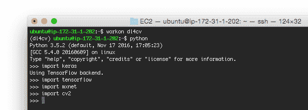

**Figure 11:** Importing Keras, TensorFlow, mxnet, and OpenCV into our deep learning Python virtual environment.

如果您在导入 mxnet 时遇到错误，只需重新编译它:

```py
$ cd ~/mxnet
$ make -j4 USE_OPENCV=1 USE_BLAS=openblas USE_CUDA=1 \
	USE_CUDA_PATH=/usr/local/cuda USE_CUDNN=1

```

这是由于我在**步骤#3** 中提到的 NVIDIA 内核驱动程序问题。你只需要重新编译 mxnet *一次*和*，如果*你在导入时收到一个错误。

使用 Python 的计算机视觉深度学习 的代码+数据集到 *[默认情况下是**而不是**包含在预先配置的 AMI 中(因为 AMI 是公开可用的，并且可以用于除了通过使用 Python 的计算机视觉深度学习*读取*之外的任务*)。*](https://pyimagesearch.com/deep-learning-computer-vision-python-book/)*

要将您本地系统上的书中的代码上传到 AMI，我建议使用`scp`命令:

```py
$ scp -i EC2KeyPair.pem ~/Desktop/sb_code.zip ubuntu@52.88.146.157:~

```

在这里，我指定:

*   使用 Python 代码+数据集的*计算机视觉深度学习的`.zip`文件路径。*
*   我的亚马逊实例的 IP 地址。

从那里，`.zip`文件被上传到我的主目录。

然后，您可以解压缩归档文件并执行代码:

```py
$ unzip sb_code.zip
$ cd sb_code/chapter12-first_cnn/
$ workon dl4cv
$ python shallownet_animals.py --dataset ../datasets/animals
Using TensorFlow backend.
[INFO] loading images...
...
Epoch 100/100
2250/2250 [==============================] - 0s - loss: 0.3429 - acc: 0.8800 - val_loss: 0.7278 - val_acc: 0.6720
[INFO] evaluating network...
             precision    recall  f1-score   support

        cat       0.67      0.52      0.58       262
        dog       0.59      0.64      0.62       249
      panda       0.75      0.87      0.81       239

avg / total       0.67      0.67      0.67       750

```

### 步骤 5:停止深度学习 AWS 实例

一旦您完成了 AMI 的工作，请返回到 EC2 仪表板上的*“Instances”*菜单项，并选择您的实例。

选中实例后，单击*“动作= >“实例状态= >“停止”*:

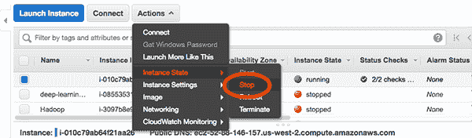

**Figure 12:** Stopping my deep learning AWS instance.

这个过程将关闭你的深度学习实例(你将不再为此按小时付费)。

如果您想删除实例，您可以选择*“终止”*。删除一个实例会破坏您的所有数据，所以如果需要的话，请确保您已经将训练好的模型放回到您的笔记本电脑上。终止一个实例还会阻止您对该实例产生任何进一步的费用。

### 故障排除和常见问题

在这一部分中，我将详细解答关于预先配置的深度学习 AMI 的常见问题。

#### 如何用深度学习 AMI 的 Python 执行*计算机视觉深度学习的代码？*

请参见上面的*“在 AWS 上访问深度学习 Python 虚拟环境”*部分。要点是您将通过`scp`命令上传代码的`.zip`到您的 AMI。下面是一个命令示例:

```py
$ scp -i EC2KeyPair.pem path/to/code.zip ubuntu@your_aws_ip_address:~

```

#### 我可以在深度学习 AMI 中使用 GUI/窗口管理器吗？

不，急性心肌梗塞只是晚期。我建议使用深度学习 AMI，如果你是:

1.  熟悉 Unix 环境。
2.  有使用终端的经验。

否则我会推荐用 Python 代替 [*计算机视觉深度学习的深度学习虚拟机部分。*](https://pyimagesearch.com/deep-learning-computer-vision-python-book/)

AMI 可以使用 X11 转发。当您 SSH 到机器时，只需像这样提供`-X`标志:

```py
$ ssh -X -i EC2KeyPair.pem ubuntu@52.88.146.157

```

#### 如何使用 GPU 实例进行深度学习？

请参见上面的*“步骤 2:选择并启动您的深度学习 AWS 实例”*部分。当选择你的亚马逊 EC2 实例时，选择一个 **p2。*** (即*“GPU 计算”或“GPU 实例”*)实例。这些实例分别有一个、八个和十六个 GPU。

## 摘要

在今天的博客文章中，你学习了如何在亚马逊 Web 服务生态系统中使用我预先配置的 AMI 进行深度学习。

与预先配置的虚拟机相比，使用我的 AMI 的优势在于:

*   亚马逊网络服务和弹性云计算生态系统为您提供了大量系统供您选择，包括纯 CPU、单 GPU 和多 GPU。
*   你可以将你的深度学习环境扩展到*多台*机器。
*   您可以保留使用预先配置的深度学习环境的能力，但仍然可以通过专用硬件获得更快的速度。

缺点是 AWS:

*   需要花钱(通常是按小时收费)。
*   对于那些不熟悉 Unix 环境的人来说可能是令人畏惧的。

在你使用我的虚拟机体验了深度学习之后，我强烈建议你也尝试一下 AWS 你会发现额外的速度提升是值得的。

**要了解更多，看看我的新书， *[用 Python 进行计算机视觉的深度学习](https://pyimagesearch.com/deep-learning-computer-vision-python-book/)。***