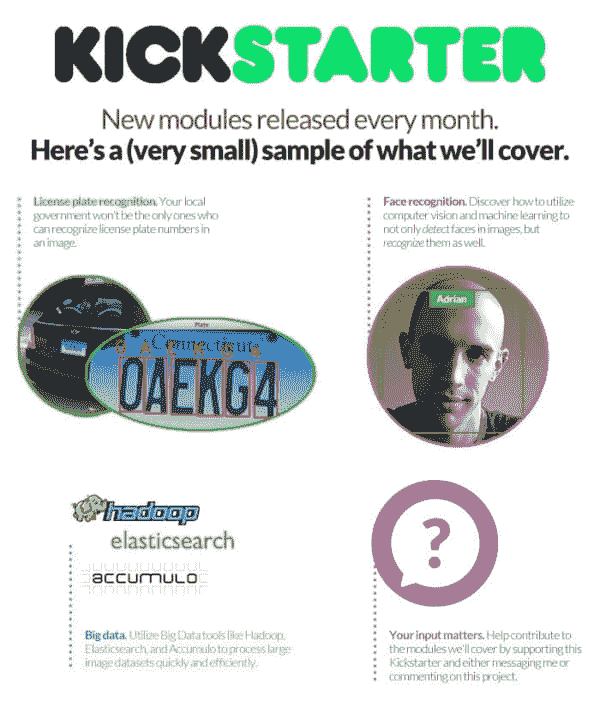

# PyImageSearch 大师:在我的课程中你将掌握的计算机视觉主题的大列表。

> 原文：<https://pyimagesearch.com/2015/01/09/pyimagesearch-gurus-big-list-computer-vision-topics-youll-master-inside-course/>

[几天前](https://pyimagesearch.com/2015/01/07/my-kickstarter-will-go-live-wednesday-january-14th-10am/) 前我提到在**1 月 14 日星期三**我将启动一个 Kickstarter 来资助我的新项目——**PyImageSearch Gurus:**一个 ***课程、社区、*** 和 ***开发环境*** 致力于把你变成一个计算机视觉大师。

正如我所承诺的，这是 PyImageSearch 大师课程中包含的完整主题列表。如果你有一个主题的建议，就在这个帖子上留下评论或给我发消息，我会看看我们是否能做到！

**计算机视觉和 OpenCV 基础知识**

*   图像基础
*   加载、显示和保存图像
*   图画
*   图像处理
*   直方图
*   平滑和模糊
*   形态学运算
*   阈值处理
*   梯度和边缘检测
*   轮廓

**自动车牌识别**

*   准备您的培训数据
*   在图像中寻找车牌
*   训练您的分类器
*   分类车牌号码和数字

**深度学习**

*   深度学习基础介绍
*   案例研究:
    *   深度信念网络
    *   卷积神经网络
    *   …适用于各种数据集，例如
        *   梦妮丝
        *   西法尔

**人脸识别**

*   准备和预处理您的数据
*   特征脸

**打造您自己的定制物体检测器**

*   准备您的培训数据
*   选择图像描述符
*   滑动窗口技术
*   训练分类器
*   硬负开采
*   目标检测

**基于内容的图像检索/图像搜索引擎**

*   构建一个视觉单词包
    *   码本构造
    *   矢量量化
    *   硬码字分配与软码字分配
*   搜索
*   倒排索引
*   Tf-idf 加权
*   空间验证

**标准图像分类**

*   图像金字塔
*   选择合适的图像描述符
*   对各种数据集的评估，包括:
    *   加州理工学院-101
    *   鲜花 17
    *   …以及更多

**用图像描述符描述图像**

*   关键点(狗、哈里斯等。)
*   局部不变描述符(SIFT、SURF 等。)
*   方向梯度直方图
*   哈拉里克纹理
*   局部二元模式
*   泽尔尼克矩
*   胡瞬间
*   …以及更多

**计算机视觉案例研究**

*   图像和照片中的人脸检测
*   眼球追踪
*   视频中的目标跟踪
*   手写识别
*   植物分类
*   车牌识别
*   在文档图像中查找文本区域
*   测量相机到图像中物体的距离

**Hadoop +大数据**

*   准备用于 HDFS 的图像
*   Hadoop 和 MapReduce 简介
*   在 MapReduce 上运行计算机视觉作业
*   用于索引和检索的弹性搜索和累积
*   高通量人脸检测
*   高通量特征提取

所以你有它！PyImageSearch 大师们所涉及的主题的完整列表。我希望看完这份清单后，你会和我一样兴奋！

请记住，如果你看到一个你想让我介绍的话题不在列表上，[只要给我发消息](https://pyimagesearch.com/contact/)——**这是*你的*课程，我想把它调到你想学的内容。**

为了在 Kickstarter 奖励列表上线时得到通知， [**请务必注册接收 PyImageSearch 大师的更新！**](https://www.getdrip.com/forms/3607544/submissions/new)

周一，我们将带着最终确定的 Kickstarter 奖励列表再见…