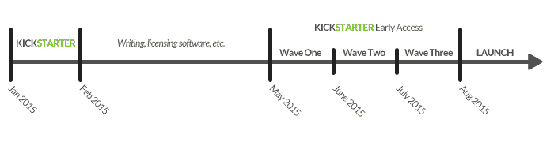

# 最终确定的 Kickstarter 奖励清单。

> 原文：<https://pyimagesearch.com/2015/01/12/pyimagesearch-gurus-finalized-kickstarter-reward-list/>

所以在过去的一周里，我已经宣布了 PyImageSearch 大师的 Kickstarter。我已经[给了你一个独家预览](https://pyimagesearch.com/2015/01/08/sneak-preview-pyimagesearch-gurus/)。我甚至详细列出了 PyImageSearch 大师们的[完整主题列表。](https://pyimagesearch.com/2015/01/9/pyimagesearch-gurus-big-list-computer-vision-topics-youll-master-inside-course/)

但是现在我有了更特别的东西…

今天，我*非常兴奋*与大家分享 Kickstarter 奖励等级。

这份奖励名单**只对 PyImageSearch 博客读者**开放，在 1 月 14 日美国东部时间上午 10 点**Kickstarter 活动启动之前，不会在其他任何地方提供。**

那为什么我现在要和你分享悬赏名单呢？当然是为了给你优势！

当 1 月 14 日 PyImageSearch 大师 Kickstarter 活动启动时，将有 100 名 PyImageSearch 读者(更不用说其他 Kickstarter 用户)阅读活动页面，并试图决定选择哪种奖励。

问题是 ***如果你等太久*** 才选择你想要的奖励等级， ***你可能会错过！***

**你看，只有少数几个低价的早鸟名额&提前进入，所以如果你想得到你的名额，你一定要*提前计划*和*快速行动*！**

但是因为你是一个忠实的 PyImageSearch 读者，我希望你提前拿到这个 Kickstarter 奖励列表，这样你就可以查看列表并决定你想要支持的奖励级别。现在决定将节省你周三的时间，并有助于确保你的位置被要求！

下面你可以找到 Kickstarter 奖励的完整分类。**一定要提前计划，挑选出自己想要的奖励！**请记住，其他 PyImageSearch 读者和 Kickstarter 用户也将试图获得这些位置！

# Kickstarter 奖励

主要奖励是在*或 ***大幅度折扣年度会员*** 获得 PyImageSearch 大师的 **Kickstarter 专属**早期访问通行证。请记住，本课程完全是自定进度的，因此您可以在闲暇时完成课程。**但是，这些月费率和年费率仅适用于 Kickstarter 活动，在八月份 PyImageSearch Gurus 正式推出后将不再提供。***

 *我还提供了我的书的独家印刷版本**、[实用 Python 和 OpenCV](https://pyimagesearch.com/practical-python-opencv/) 、T3。此前，这本书只作为电子书存在。但是对于这个 Kickstarter 活动，我将制作实体副本，并且**为每个副本单独编号并亲笔签名，只为你**。一定要看看这个奖励，*我不确定我的书是否会再版！***

根据您选择的奖励等级，以下是 PyImageSearch 大师的访问时间表:

# 每月会员奖励

### **认捐 25 美元或以上:**

早鸟特惠—成为 PyImageSearch Gurus +锁定 25 美元/月会员费率的第一波用户的一部分。**有限(5 个中的 5 个左边)**

### **认捐 35 美元或以上:**

早期采用者——成为 PyImageSearch Gurus +锁定 35 美元/月会员费率的第二波用户的一部分。**有限(10 个中的 10 个左边)**

### **认捐 45 美元或以上:**

第三波英雄——成为 PyImageSearch Gurus + lock 第三波用户的一部分，会员费为每月 45 美元。**有限(20 个中的 20 个左边)**

### **认捐 50 美元或以上:**

早鸟特别版——我的书、实用 Python 和 OpenCV 的单独编号和亲笔签名的独家 Kickstarter 印刷 PyImageSearch Gurus 的第一波访问+以 25 美元/月的会员费率锁定**有限(10 个中的 10 个剩余)**

### **认捐 55 美元或以上:**

前三波后，进入 PyImageSearch 大师+锁定会员费 55 美元/月。**无限制**

### **认捐 75 美元或以上:**

我的书，实用 Python 和 OpenCV 的单独编号和亲笔签名的独家 Kickstarter 印刷 PyImageSearch Gurus 的第二波访问+每月 35 美元的会员费锁定。**有限(15 个中的 15 个左边)**

### **认捐 100 美元或以上:**

我的书、实用 Python 和 OpenCV 的单独编号和亲笔签名的独家 Kickstarter 印刷 PyImageSearch Gurus 的第三波访问+每月 45 美元的会员费锁定。**有限(20 个中的 20 个左边)**

### **认捐 120 美元或以上:**

我的书，实用的 Python 和 OpenCV 的单独编号和亲笔签名的独家 Kickstarter 印刷+前 3 波后进入 PyImageSearch 大师+锁定会员费 55 美元/月。**无限制**

# 年度会员奖励

### **认捐 250 美元或以上:**

早鸟特惠 PyImageSearch 大师的 1 年使用权。成为第一波 inside +一个单独编号和手写签名的独家 Kickstarter 印刷我的书，实用 Python 和 OpenCV 的一部分。**有限(3 个中的 3 个左边)**

### **认捐 350 美元或以上:**

PyImageSearch 大师的 1 年使用权。成为第二波 inside +一个单独编号和手写签名的独家 Kickstarter 印刷我的书，实用 Python 和 OpenCV 的一部分。**有限(5 个中的 5 个左边)**

### **认捐 400 美元或以上:**

PyImageSearch 大师的 1 年使用权。成为第三波 inside +的一部分，一个单独编号和手写签名的独家 Kickstarter 印刷我的书，实用 Python 和 OpenCV。**有限(8 个中的 8 个左边)**

### **认捐 500 美元或以上:**

PyImageSearch 大师的 1 年使用权。在前 3 波之后，可以访问 PyImageSearch Gurus，这是我的书、Practical Python 和 OpenCV 的单独编号和亲笔签名的独家 Kickstarter 印刷版本。**无限制**

# *点菜*奖励

### **认捐 125 美元或以上:**

点菜:给 PyImageSearch 大师们一个机会。一旦 PyImageSearch Gurus 启动，该奖励将使您能够访问您选择的一个模块。**无限制**

### **认捐 300 美元或以上:**

单点 3 包:乘坐 PyImageSearch 大师兜风。一旦 PyImageSearch Gurus 启动，此奖励将让您获得三个您选择的模块。**无限制**

# 特殊奖励

### **认捐 1，000 美元或以上:**

与我进行 60 分钟的 Skype 通话+ 2 年会员资格+第一波访问+亲笔签名的我的书。在通话中，我们可以讨论您自己的计算机视觉项目，或者谈论 PyImageSearch 以及您希望我在 PyImageSearch 大师中涉及的主题。**有限(5 个中的 5 个左边)**

### **认捐 2，500 美元或以上:**

2 年会员+第一波访问+我的书的亲笔签名副本+在纽约地区与我共进晚餐。晚餐时，我们可以讨论你自己的计算机视觉项目或谈论 PyImageSearch 大师和你感兴趣的话题。**有限(3 个中的 3 个左边)**

正如你所看到的，尽早为项目提供资金会有很大的折扣，**所以一定要在 Kickstarter 活动开始之前*确定你想要的奖励级别！***

记住，美国东部时间周三上午 10 点是个大日子！

别忘了，在**大幅降价**的**提前获得**的奖励数量非常有限，所以当你在**周三启动 Kickstarter 时，你肯定想立即领取你的奖励！**

明天我会在这个博客上发布一个 Kickstarter 的链接，但是如果你想在 Kickstarter ***发布的那一刻收到电子邮件 ***，[就在这里注册吧！](https://www.getdrip.com/forms/3607544/submissions/new/)******

我希望在 Kickstarter 支持者名单上看到你！*