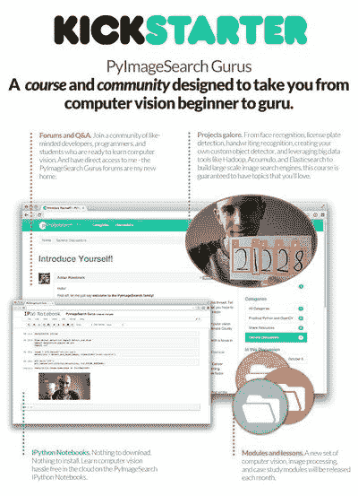

# PyImageSearch Kickstarter 大师们已经结束了……但是你仍然可以在队伍中占有一席之地。

> 原文：<https://pyimagesearch.com/2015/02/15/pyimagesearch-gurus-kickstarter-can-still-claim-spot-line/>

刚刚过去的这个周五 [PyImageSearch 大师 Kickstarter](https://www.kickstarter.com/projects/1186001332/pyimagesearch-gurus-become-a-computer-vision-openc) 落下帷幕。该活动取得了巨大成功，有 253 名 T4 支持者加入进来。

看到来自你、PyImageSearch 的读者和 Kickstarter 的观众的支持，我感到非常惭愧。我感到非常幸运，能够每天醒来，做我喜欢的事情— *为您提供计算机视觉和 OpenCV 内容*。

如果你错过了 PyImageSearch 大师 Kickstarter，但仍想在 8 月课程启动时申请你的位置， [只需使用此链接](https://pyimagesearch.com/pyimagesearch-gurus/) 。

一旦你排队认领了你的位置，你将收到**独家预览**、**最终发布日期**，以及更多关于**的信息，一旦大门打开，PyImageSearch 大师们将优先访问**。

你还在等什么？！ [现在就去排队领取你的位置吧。](https://pyimagesearch.com/pyimagesearch-gurus/)