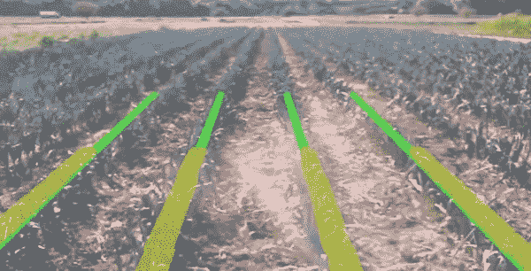

# PyImageSearch 大师成员聚焦:Saideep Talari

> 原文：<https://pyimagesearch.com/2017/06/12/pyimagesearch-gurus-member-spotlight-saideep-talari/>

在今天的博文中，我采访了赛迪普·塔拉里，他是一名 PyImageSearch 大师的毕业生，最近被印度的一家初创公司聘为计算机视觉工程师。

赛义德·迪普的故事在我心中有着特殊的地位，因为它是如此难以置信地*真诚*、*真诚*、*真挚*。

你看，Saideep 来自一个收入很低的印度家庭。他们没有多少钱。事实上，在线教育(如 PyImageSearch Gurus 课程、Udacity 等。)被认为是“奢侈品”。

但这并没有阻止赛义德·迪普——他承担起学习计算机视觉的责任，不仅因为他觉得这是他的激情所在，也因为他想帮助他的家人。

事实上，Saideep 对学习计算机视觉的感觉是如此强烈，以至于他从自己的个人银行获得了教育贷款，以帮助补充 PyImageSearch 大师课程的费用。

Saideep 于 2016 年 8 月加入 PyImageSearch Gurus，随后于 2017 年 2 月毕业。我一直对他的奉献精神、T2 的职业道德和 T4 对掌握计算机视觉的承诺印象深刻。

早在 4 月份，我收到了 Saideep 的一封电子邮件，表达了他的快乐——他最近在印度的一家计算机视觉初创公司获得了一份工作，从事基于无人机的人工智能解决方案。

在面试过程中，公司给赛迪普布置了一项计算机视觉任务。他的解决方案*令人印象深刻，以至于他们 ***立即雇佣了他*** 并让他加入公司，成为一名计算机视觉工程师。*

 *今天，我说:

*   拥有一份收入很高的工作。
*   能不能*照顾他的家人*赡养他们。
*   已经还清了他/他家人的所有债务。
*   目前正在做他喜欢的事情——从事计算机视觉工作。

更令人印象深刻的是，仅仅在六个月多一点的时间里，他就从计算机视觉学生变成了计算机视觉 T2 工程师。

老实说，这是我听过的最感人的计算机视觉成功故事之一，我为塞迪普和他的成就感到无比骄傲。

和我一起接受采访，了解 Saideep 如何通过研究计算机视觉改变了他的生活(和他家人的生活)。

## PyImageSearch 大师成员聚焦:Saideep Talari

***注:**英语不是 Saideep 的第一语言，所以他友好地请我编辑他的语法和拼写，以使回答更具可读性。我做了很少的编辑(因为他的英语很容易理解)，尽可能地保留了他的原文。再次感谢您接受我们的采访。*

阿德里安:嗨，赛德普！谢谢你同意接受这次采访。通过 PyImageSearch 博客和图片搜索大师课程认识你是我的荣幸。

你好，阿德里安！很荣幸能接受像您这样伟大的计算机视觉研究者的采访！

阿德里安:你能告诉我们你最初是如何对计算机视觉感兴趣的吗？

**Saideep:** 这是一个很长的故事，但为了简单起见，我首先开始学习安全分析，这涉及到网络和 web 应用程序的渗透测试，但后来我通过数据分析和机器学习找到了我的兴趣。

驱使我从事计算机视觉的项目是当我试图创建一个破解验证码图片的机器人时。破解验证码涉及大量的图像处理和机器学习，所以这就是我如何从我的兴趣到安全分析开始我的计算机视觉之旅。

我试着在网上浏览资源，让自己接受计算机视觉方面的培训，但资源很少，我发现很多都不是很好解释。幸运的是，我在谷歌搜索上找到了你的[PyImageSearch]博客，并阅读了你发布的内容。

你的博客真的激励了我，提高了我学习计算机视觉的兴趣，因为现在我有了一个搜索计算机视觉问题的平台。

阿德里安:你在电子邮件中提到，你最近被一家印度初创公司聘为计算机视觉工程师。你能告诉我们这份工作的情况和面试过程吗？

**Saideep:** 耶！首先，非常感谢！如果我没有参加[图片搜索大师课程](https://pyimagesearch.com/pyimagesearch-gurus/)，我就不会得到这份工作。是的，这是一家位于印度的早期创业公司，我们通过无人机处理空中情报。它有助于农业、矿业、太阳能工厂等。，通过为无人机提供人工智能和计算机视觉来解决他们的问题。

我和其他人一样申请了计算机视觉工程师的职位。我被分配了一个处理作物行检测和斑块识别的任务。

**Figure 1:** An example of detecting rows of crops in an image ([source](https://www.youtube.com/watch?v=0VIwuCaTHPM)).

我花了 15 分钟才明白实际问题。我最初的计划是应用机器学习，但我发现它可以通过图像处理技术来实现。我尝试了我的方法，得到了有希望的结果。并非数据集中的每张图像都处于相同的光照条件下，但我记得您在 PyImageSearch 大师课上讲过如何处理不同的光照条件和不同的颜色通道。

我把问题反过来了。我没有检测空行，而是检测了包含树和其他东西的实际行，经过一些形态学运算，最终我得到了最有希望的解决方案。

从你在课程中的话语中我明白了一件事:

> 有时，巧妙使用图像处理技术可以节省大量时间，并避免更高级(和乏味)的算法。——阿德里安·罗斯布鲁克，[图片搜索大师](https://pyimagesearch.com/pyimagesearch-gurus/)

后来我面试了使用深度学习、RCNNs 等优化方法的图像分割。我做得很好。

阿德里安:当你第一次给我发邮件，告诉我加入 PyImageSearch 大师课程时，我知道你最关心的问题之一是价格。你认为这个课程值得吗？

**Saideep:** 是的！最初我觉得价格很高。**但在我参加课程的第一周之后，我相信即使 95 美元也非常便宜，因为你提供的内容是非常宝贵的。你不仅写下了教训，还写下了你的经历，这是任何金钱都无法衡量的。**

坦率地说，这门课程比你收取的费用更有价值。我感觉到这一点，因为没有人能在地球上找到像这样从头开始的端到端的详尽课程。

Adrian: 你会向其他试图学习计算机视觉(并获得一份工作)的学生和开发者推荐 PyImageSearch Gurus 课程吗？

当然，肯定的。我已经向我的一些朋友推荐了 PyImageSearch 大师。从这门课开始非常好，因为它涵盖了广泛的现实生活问题。此外，学生们不必担心“练习”，因为你组织[课程]的方式推动人们获得尽可能多的实践经验。不仅如此，该课程还包括访问令人敬畏的社区[论坛]线程，在那里我们可以找到可以帮助我们解决计算机视觉问题的人。

如果一个人非常有激情，那么 PyImageSearch 大师对于获得计算机视觉领域的工作肯定是一个很大的肯定，因为这个领域非常复杂。你[和 PyImageSearch 大师课程]已经将复杂的事情分解为简单的，非常清晰易懂。

阿德里安:你还有什么想分享的吗？

**Saideep:** 我急切地等待你的 [*用 Python 进行计算机视觉深度学习*](https://pyimagesearch.com/deep-learning-computer-vision-python-book/) 的书发布。我打算购买 *ImageNet 套装*。你真的把你所有的经历都放在了创作牛逼的内容上。

**Adrian:** 如果一个 PyImageSearch 的读者想聊天，在哪里和你联系最好？

**Saideep:** 请在 [LinkedIn](https://www.linkedin.com/in/saideep-talari-08650778/) 或 [GitHub](https://github.com/saideeptalari) 上联系我。

## 摘要

在今天的博文中，我采访了 Saideep Talari，他是一名 PyImageSearch 大师课程的毕业生，最近在印度的一家初创公司找到了一份计算机视觉工程师的工作。

通过这份工作，Saideep 现在能够供养和照顾他的家人。

这确实是我听过的最令人惊讶、最发自内心的计算机视觉成功故事之一，我为 Saideep 和他的成就感到骄傲。请和我一起在这篇博文的评论区祝贺他。

**如果你想了解更多关于 PyImageSearch Gurus 的课程(并跟随 Saideep 的脚步)， [*只需点击这里*](https://pyimagesearch.com/pyimagesearch-gurus/) 。***