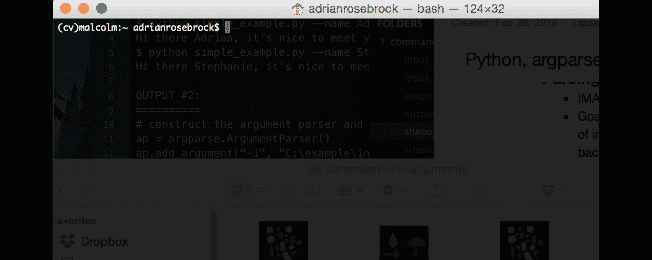
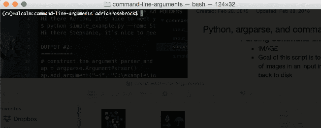
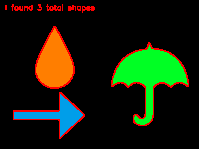

# Python、argparse 和命令行参数

> 原文：<https://pyimagesearch.com/2018/03/12/python-argparse-command-line-arguments/>

[](https://pyimagesearch.com/wp-content/uploads/2018/03/command_line_arguments_example01.gif)

今天，我们将讨论一项基本的开发人员、工程师和计算机科学家技能— **命令行参数。**

具体来说，我们将讨论:

*   什么是命令行参数
*   为什么我们使用命令行参数
*   如何用 Python 解析命令行参数

命令行参数是您必须学会如何使用的基本技能，尤其是如果您试图应用更高级的计算机视觉、图像处理或深度学习概念。

如果你不熟悉命令行参数或者不知道如何使用它们，没关系！ **但是你仍然需要花时间自学如何使用它们**——这篇文章将帮助你做到这一点。

在今天的帖子结束时，你将对命令行参数，它们如何工作，以及如何使用它们有一个深刻的理解。

## Python、argparse 和命令行参数

每天我都会收到 3-5 封来自 PyImageSearch 读者的邮件或评论，他们都在为命令行争论而挣扎。

事实上，就在我决定写这篇博文的一个小时前，我收到了 Arjun 的如下邮件:

> 嗨，阿德里安，我刚刚下载了你的[深度学习人脸检测博文](https://pyimagesearch.com/2018/02/26/face-detection-with-opencv-and-deep-learning/)的源代码，但是当我执行它时，我得到了以下错误:
> 
> $ python detect_faces.py
> 用法:detect _ faces . py[-h]-I IMAGE-p proto txt-m MODEL[-c CONFIDENCE]
> detect _ faces . py:错误:需要下列参数:-I/–IMAGE，-p/–proto txt，-m/–MODEL
> 
> 救命啊！

Arjun 并不是唯一一个在这个错误中挣扎的人。

许多其他读者在使用命令行参数时也会遇到类似的问题，但是诚实的事实是，几乎所有这些错误都可以通过花时间自学命令行参数来避免。

在今天这篇文章的剩余部分，你将了解到命令行参数比看起来容易使用得多(即使你以前从未使用过它们)。

你会发现你不需要修改一行代码就可以使用它们。在这篇文章的最后，你将能够像专家一样使用命令行参数。

让我们开始吧。

### 什么是命令行参数？

命令行参数是在运行时给程序/脚本的标志。它们包含我们程序的附加信息，以便它能够执行。

不是所有的程序都有命令行参数，因为不是所有的程序都需要它们。也就是说，在这个博客上，我们在 Python 脚本中大量使用了命令行参数，我甚至可以说这个博客上 98%的文章都使用了它们。

### 为什么我们使用命令行参数？

如上所述，命令行参数在运行时为程序提供了额外的信息。

这允许我们在不改变代码的情况下给我们的程序不同的输入*。*

您可以将命令行参数类比为函数参数。如果您知道在各种编程语言中函数是如何声明和调用的，那么当您发现如何使用命令行参数时，您会立即感到如鱼得水。

鉴于这是一个计算机视觉和图像处理博客，你将在这里看到的许多论点是图像路径或视频路径。

在深度学习的情况下，这个博客也是众所周知的，你会看到模型路径或纪元计数作为命令行参数。

在今天帖子的剩余部分，我们将通过两个脚本示例了解 Python argparse 包。

我还将展示 PyCharm 用户如何在不离开 PyCharm 的情况下运行脚本，如果他们愿意的话。

### argparse Python 库

[](https://pyimagesearch.com/wp-content/uploads/2018/03/command_line_arguments_example01.gif)

**Figure 1:** My terminal screen is used to run a Python script with command line arguments.

首先，让我们制作一个新的脚本，命名为`simple_example.py`:

```py
# import the necessary packages
import argparse

# construct the argument parse and parse the arguments
ap = argparse.ArgumentParser()
ap.add_argument("-n", "--name", required=True,
	help="name of the user")
args = vars(ap.parse_args())

# display a friendly message to the user
print("Hi there {}, it's nice to meet you!".format(args["name"]))

```

首先，我们需要`argparse`包，所以我们在第 2 行**导入它。**

在**的第 5 行**，我们将`ArgumentParser`对象实例化为`ap`。

然后在**的第 6 行和第 7 行**我们添加了唯一的参数`--name`。我们必须指定*简写* ( `-n`)和*简写*(`--name`)版本，其中任何一个标志都可以在命令行中使用。如`required=True`所示，这是一个必需的参数。

来自**行 7** 的`help`字符串将在终端中给出额外的信息，如果你需要的话。要查看命令用法帮助，您可以在终端中输入以下内容(直接在下面输出):

```py
$ python simple_example.py --help
usage: simple_example.py [-h] -n NAME

optional arguments:
  -h, --help            show this help message and exit
  -n NAME, --name NAME  name of the user

```

请注意我是如何指定以下三项的:

1.  可执行文件(`python`)
2.  我们的 Python 脚本文件(`simple_example.py`)
3.  和一个参数(`--help`)以便打印用法。

**脚本的第 8 行**指示 Python 和`argparse`库解析命令行参数。我还调用对象上的`vars`将解析的命令行参数转换成 Python 字典，其中字典的*键*是命令行参数的名称，值是为命令行参数提供的字典的*值*。为了看到这一点，我建议在代码中插入一个`print(args)`语句。

虽然是可选的，但我更喜欢将 arguments 对象转换成字典，这样我就可以通过命令行或在 Jupyter 笔记本中执行脚本。当使用 Jupyter 笔记本时，我可以简单地删除解析代码的命令行参数，并插入一个名为`args`的带有任何硬编码值的字典。

现在你可能想知道:**我如何从命令行参数 argument 中访问这个值？**

这很简单，在脚本的第 11 行**有一个例子。**

在格式字符串中，我们指定`args["name"]`。您很快就会看到，我们将使用这个命令行参数动态地将我们的名字打印到屏幕上。

为了执行我们的`simple_example.py`脚本，我们需要采取以下步骤:

1.  **步骤 1:** 从 ***【下载】*** 部分下载这篇博文的压缩文件到你选择的机器上的一个位置(为了简单起见，我建议是桌面)。
2.  **第二步:**打开一个终端，把目录换到 zip 所在的位置。
3.  **第三步:**拉开拉链。
4.  **第四步:**再次改变目录，这次进入刚刚提取的新目录。
5.  **步骤 5:** 使用`workon`命令激活您的虚拟环境。例如:`workon cv`或`workon py3cv4`(取决于您的环境名称)。如果你用的是我的[预配置的 Raspbian。img](https://pyimagesearch.com/2016/11/21/raspbian-opencv-pre-configured-and-pre-installed/) ，建议对 home 文件夹中的脚本使用`source`命令。例如:`source ~/start_py3cv4.sh`或`source ~/start_openvino.sh`。对于 OpenVINO 来说，使用`source`命令尤其重要，因为除了激活虚拟环境之外，它还会加载一些环境变量。
6.  **步骤 6:** 执行程序(带命令行参数)并查看输出。

在这篇博客上，我在一个“shell”代码块中展示了命令及其参数。提示符开头的`$`是您的队列，表明这是一个终端命令，您应该在`$`字符后输入该命令，以及您喜欢的与所写内容相似或完全相同的参数。

我已经将本课的代码下载到桌面上的 PyImageSearch 目录中，以便于访问，从而完成了第**步**。

在那里，我输入了以下命令并生成了相应的输出:

```py
$ cd ~/Desktop/PyImageSearch
$
$ unzip command-line-arguments.zip
...
$
$ cd command-line-arguments
$ pwd
/Users/adrianrosebrock/Desktop
$
$ python simple_example.py --name Adrian
Hi there Adrian, it's nice to meet you!
$
$ python simple_example.py --name Stephanie
Hi there Stephanie, it's nice to meet you!
$
$ python simple_example.py --name YourNameHere
Hi there YourNameHere, it's nice to meet you!

```

让我们在参考**步骤 2-5** 的同时，浏览一下我在上面的终端中演示的内容。

**第二步:**

我*把目录*换成了我下载本课压缩文件的地方(**第一行**)。

我按下**行 2** 上的 enter/return 按钮，使输出更容易阅读。这是可选的。

**第三步:**

我拉开了拉链。与本课相关的 zip 文件(**第 3 行**)。

**第 4 行**上的`...`表示解压缩过程有输出，但我没有在这里显示出来。注意，输出没有前面的`$`。

**第四步:**

接下来我需要*将目录*转换到我刚刚解压的文件夹中(**第 6 行**)。

为了确保我在我需要的地方，我*在**第 7** 行打印我的工作目录*，输出显示在**第 8** 行。

**第五步:**

我*在**第 10 行**执行带参数*的命令。我在`--name`标志后指定我的名字。只要我的名字没有空格，它就会正确地显示在输出中。

输出显示在**行 11 上。**注意脚本*如何动态地*显示我在命令中输入的名字。命令行参数非常强大，允许您在不更改一行代码的情况下用不同的输入测试您的程序。

**第 13-17 行**演示了两个额外的例子，我的脚本在没有修改代码的情况下将打印一个给定的名字。用你自己的名字或者你的仇人的名字来试试吧。

***注意:**如果我执行**步骤 5** 而没有命令行参数(或者有不正确的参数)，我将会看到如下所示的用法/错误信息。*

```py
$ python simple_example.py
usage: simple_example.py [-h] -n NAME
simple_example.py: error: argument -n/--name is required

```

这个简单的例子帮助我们理解了命令行参数的概念；然而，打印一个包含我们名字的句子不是很有用。

在下一节中，我将提供一个使用命令行参数的更实际的例子

### 用 Python 解析命令行参数

[](https://pyimagesearch.com/wp-content/uploads/2018/03/command_line_arguments_example02.gif)

**Figure 2:** Using the argparse Python package you can easily parse command line arguments in the terminal/command line.

在下一个例子中，我们将对任何给定的输入图像中的形状进行计数，同时对写入磁盘的输出图像进行注释。

我们将再次使用命令行参数来指定输入图像路径和输出图像路径。

对于这个解释来说，图像处理技术很简单——毕竟我们只是为了命令行参数的目的而举这个例子。

因此，让我们创建一个名为`shape_counter.py`的新文件，并开始编码:

```py
Codeblock #1: Lines 1-20# import the necessary packages
import argparse
import imutils
import cv2

# construct the argument parser and parse the arguments
ap = argparse.ArgumentParser()
ap.add_argument("-i", "--input", required=True,
	help="path to input image")
ap.add_argument("-o", "--output", required=True,
	help="path to output image")
args = vars(ap.parse_args())

# load the input image from disk
image = cv2.imread(args["input"])

# convert the image to grayscale, blur it, and threshold it
gray = cv2.cvtColor(image, cv2.COLOR_BGR2GRAY)
blurred = cv2.GaussianBlur(gray, (5,5), 0)
thresh = cv2.threshold(blurred, 60, 255, cv2.THRESH_BINARY)[1]

```

我们在第 2 行的**上导入`argparse`——这是帮助我们解析和访问命令行参数的包。**

然后，在第 7-12 行我们解析两个命令行参数。这几行代码可读性很强，你可以看到如何格式化一个参数。

我们以`--input`论证为例。

在**的第 7 行**，我们将`ArgumentParser`对象实例化为`ap`。

然后在第 8 行和第 9 行我们添加了我们的`--input`参数。我们必须指定速记和手写版本(`-i`和`--input`)，其中任何一个标志都可以在命令行中使用。如`required=True`所示，这是一个必需的参数。正如我上面演示的那样，`help`字符串将在终端中给出额外的信息。

类似地，在**第 10 行和第 11 行**，我们指定了我们的`--output`参数，这也是必需的。

从那里，我们使用路径加载图像。记住，输入图像路径包含在`args["input"]`中，所以这是`cv2.imread`的参数。

简单吧？

其余几行是特定于图像处理的，所以如果您在没有任何 OpenCV 或图像处理技能的情况下登陆这个博客，您可能想要在档案中寻找关于这些概念的进一步解释。

在第**行第 18-20** 行，我们完成了三个操作:

1.  将`image`转换为灰度。
2.  模糊灰度图像。
3.  对`blurred`图像进行阈值处理。

我们已经准备好寻找并画出形状轮廓:

```py
# extract contours from the image
cnts = cv2.findContours(thresh.copy(), cv2.RETR_EXTERNAL,
	cv2.CHAIN_APPROX_SIMPLE)
cnts = imutils.grab_contours(cnts)

# loop over the contours and draw them on the input image
for c in cnts:
	cv2.drawContours(image, [c], -1, (0, 0, 255), 2)

# display the total number of shapes on the image
text = "I found {} total shapes".format(len(cnts))
cv2.putText(image, text, (10, 20), cv2.FONT_HERSHEY_SIMPLEX, 0.5,
		(0, 0, 255), 2)

# write the output image to disk
cv2.imwrite(args["output"], image)

```

在**第 23-25 行**中，我们在`thresh`图像中找到了形状轮廓。

从那里，我们在输入图像上绘制轮廓(**行 28 和 29** )。

要了解更多关于轮廓的信息，请参见 *[使用 Python 和 OpenCV](https://pyimagesearch.com/2014/10/20/finding-shapes-images-using-python-opencv/) 在图像中查找形状*和[轮廓标签档案](https://pyimagesearch.com/tag/contours/)。我还在我的书 *[实用 Python 和 OpenCV +案例研究](https://pyimagesearch.com/practical-python-opencv/)* 中讨论轮廓和其他图像处理基础知识。

然后，我们组装并在图像上放置文本(**第 32-34 行**)。该文本包含形状的总数。

最后，我们使用我们的`--output`映像路径参数，通过`cv2.imwrite` ( **第 37 行**)将映像写入磁盘。

让我们用两个参数来执行命令:

```py
$ python shape_counter.py --input input_01.png --output output_01.png

```

如果检查您的工作目录，您会注意到现在出现了`output_01.png`图像:

[](https://pyimagesearch.com/wp-content/uploads/2018/03/output_01.png)

**Figure 3:** Shapes have been counted with our Python + OpenCV script which takes in command line arguments.

让我们使用不同的参数再次执行该命令:

```py
$ python shape_counter.py --input input_02.png --output output_02.png

```

同样，您会注意到在您的目录中有一个新的输出文件:`output_02.png`。

[](https://pyimagesearch.com/wp-content/uploads/2018/03/command_line_arguments_output02.png)

**Figure 4:** Three shapes have been detected with OpenCV and Python by simply changing the command line arguments.

现在，后退一步。从命令行参数的角度考虑我们做了什么。

我们在这里做的是使用*的一个脚本*和*的不变*，并为它提供*不同的参数*。`--input`参数包含输入图像的路径/文件名，同样的还有`--output`。

这个概念非常简单，我希望这已经阐明了如何使用命令行参数。在我们结束这篇文章之前，让我们来看看*不*要做什么。

### 如何*而不是*解析命令行参数

我不时会看到一些读者试图修改代码本身来接受命令行参数。

如何不解析命令行参数的一个很好的例子可以从上一节的第 6-12 行的**命令行参数开始:**

```py
# construct the argument parser and parse the arguments
ap = argparse.ArgumentParser()
ap.add_argument("-i", "--input", required=True,
	help="path to input image")
ap.add_argument("-o", "--output", required=True,
	help="path to output image")
args = vars(ap.parse_args())

```

我见过读者错误地试图更新参数解析代码，以包含输入图像的实际路径:

```py
# construct the argument parser and parse the arguments
ap = argparse.ArgumentParser()
ap.add_argument("-i", "C:\example\input_image.png", required=True,
	help="path to input image")
ap.add_argument("-o", "C:\example\output_image.png", required=True,
	help="path to output image")
args = vars(ap.parse_args())

```

或者在列表沟工作中，尝试使用`help`参数来包含文件路径:

```py
# construct the argument parser and parse the arguments
ap = argparse.ArgumentParser()
ap.add_argument("-i", "--input", required=True,
	help="/home/pi/my_input.png")
ap.add_argument("-o", "--output", required=True,
	help="/home/pi/output_image.png")
args = vars(ap.parse_args())

```

记住 ***代码本身不需要更新。***

花点时间打开您的终端，导航到您的代码所在的位置，然后执行脚本，确保提供命令行参数。

我想和你分享另一个“发现”。有时在这个博客上，我的命令行参数标志中有一个'-'(破折号)，比如`--features-db`。当获取参数包含的值时，您需要使用一个' _ '(下划线)，这有点令人困惑，也有点不安全。

这一点在 [PyImageSearch 大师课程](https://pyimagesearch.com/pyimagesearch-gurus/)基于内容的图像检索模块的摘录中得到了证明:

```py
# construct the argument parser and parse the arguments
ap = argparse.ArgumentParser()
ap.add_argument("-d", "--dataset", required=True, help="Path to the directory of indexed images")
ap.add_argument("-f", "--features-db", required=True, help="Path to the features database")
ap.add_argument("-c", "--codebook", required=True, help="Path to the codebook")
ap.add_argument("-o", "--output", required=True, help="Path to output directory")
args = vars(ap.parse_args())

# load the codebook and open the features database
vocab = pickle.loads(open(args["codebook"], "rb").read())
featuresDB = h5py.File(args["features_db"], mode="r")
print("[INFO] starting distance computations...")

```

请注意突出显示的行，我已经将参数定义为`--features-db`(带破折号)，但是我用`args["features_db"]`(带下划线)引用它。这是因为`argparse` Python 库在解析过程中用下划线替换了破折号。

### 你能做到的！

如果你是一个终端新手，命令行参数可能需要一些练习或习惯，但是我对你有信心！

不要气馁。

慢慢来。

并且坚持练习。

不知不觉中，您已经掌握了命令行参数——**现在就花时间投资于您的教育和这项宝贵的技能吧！**

### 通过 IDE 设置命令行参数

我不时收到电子邮件和博客评论，询问如何在他们的 IDE 中运行 Python 脚本。

大约 90%的情况下，问题类似于:

> 嗨阿德里安，
> 
> 救命啊！我无法运行代码。
> 
> 如何用 PyCharm 运行你的博客文章中的代码？

PyCharm 和其他 ide 都是很棒的工具，具有丰富的特性。我喜欢 PyCharm，我每天都用它。

虽然可以在 IDE 中运行带有命令行参数的脚本，*但我不建议这样做*。

当你进行开发时，你真的需要熟悉命令行。实际上，使用终端比点击 IDE 的 GUI 并设置参数更节省时间。

为了服务社区，我提供了两个由大卫·霍夫曼拍摄的截屏视频，当我录制画外音来解释这些步骤时，你会听到我熟悉的声音。

**第一步**是通过 ***【下载】*** 部分获取本教程(或者本博客上的另一个教程)的代码。

正如您将在视频中看到的，David 将代码下载到了他桌面上的一个文件夹中。一旦您将下载内容放在方便的地方，请按播放并跟随:

<https://www.youtube.com/embed/Byta5WkeNiA?feature=oembed>