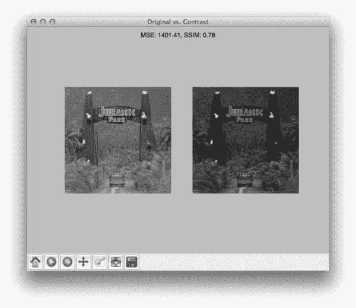
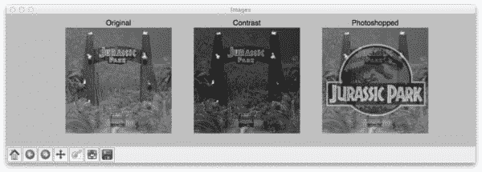
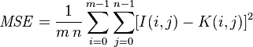
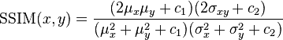
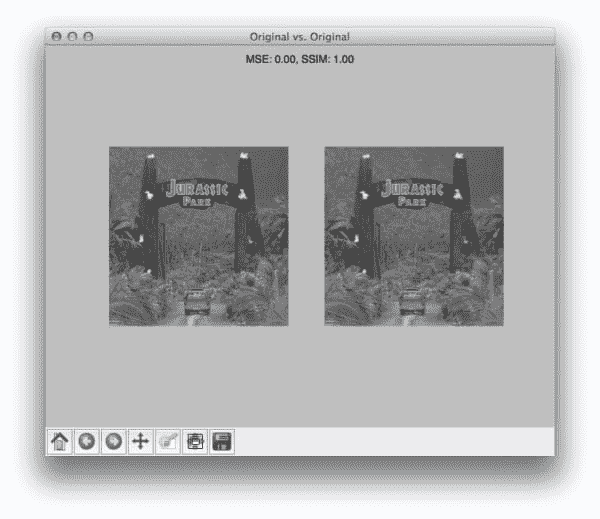
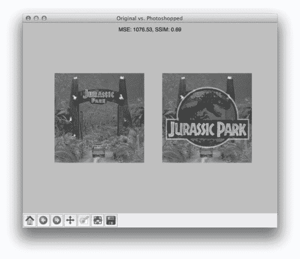

# 如何:Python 比较两幅图像

> 原文：<https://pyimagesearch.com/2014/09/15/python-compare-two-images/>

最后更新于 2021 年 7 月 1 日

[](https://pyimagesearch.com/wp-content/uploads/2014/06/compare_original_contrast.jpg)

你能猜到我是一个集邮者吗？

开玩笑的。我没有。

但是让我们玩一个假装的小游戏。

让我们假设我们有一个巨大的邮票图像数据集。我们想要拍摄两张任意的邮票图像，并对它们进行比较，以确定它们是否相同，或者在某些方面是否接近相同。

一般来说，我们可以通过两种方式来实现这一点。

第一种方法是使用本地敏感散列，我将在以后的博客文章中介绍。

第二种方法是使用算法，如均方差(MSE)或结构相似性指数(SSIM)。

在这篇博文中，我将向你展示如何使用 Python 通过均方误差和结构相似性指数来比较两幅图像。

*   【2021 年 7 月更新:根据最新 API 更新，更新了 SSIM 从 scikit-image 的导入。添加了替代图像比较方法的部分，包括暹罗网络上的资源。

# 我们的示例数据集

让我们先来看看我们的示例数据集:

[](https://pyimagesearch.com/wp-content/uploads/2014/06/compare_dataset.jpg)

**Figure 1:** Our example image dataset. *Left:* The original image. *Middle:* The original image with contrast adjustments. *Right:* The original image with Photoshopped overlay.

在这里，你可以看到我们有三个图像:*(左)*我们来自*侏罗纪公园*的朋友的原始图像，他们的第一次(也是唯一一次)旅行，*(中)*应用了对比度调整的原始图像，*(右)*，原始图像，上面通过 Photoshop 处理覆盖了*侏罗纪公园*的标志。

现在，我们很清楚左边和中间的图像彼此更“相似”——中间的图像就像第一个图像一样，只是它“更暗”。

但是我们会发现,“均方误差”实际上会说经过 PS 处理的图像比经过对比度调整的中间图像更接近原始图像。很奇怪，对吧？

# 均方误差与结构相似性度量

让我们来看看均方误差方程:

[](https://pyimagesearch.com/wp-content/uploads/2014/06/compare_mse.png)

**Equation 1:** Mean Squared Error

虽然这个等式看起来很复杂，但我向你保证它并不复杂。

为了证明这一点，我将把这个等式转换成一个 Python 函数:

```py
def mse(imageA, imageB):
	# the 'Mean Squared Error' between the two images is the
	# sum of the squared difference between the two images;
	# NOTE: the two images must have the same dimension
	err = np.sum((imageA.astype("float") - imageB.astype("float")) ** 2)
	err /= float(imageA.shape[0] * imageA.shape[1])

	# return the MSE, the lower the error, the more "similar"
	# the two images are
	return err

```

这就是你要的——去掉注释后，只有四行 Python 代码的均方误差。

让我们把它拆开，看看发生了什么:

*   在第 7 行的**上，我们定义了我们的`mse`函数，它有两个参数:`imageA`和`imageB`(即我们想要比较相似性的图像)。**
*   所有真正的工作都在**线 11** 上处理。首先，我们将图像从无符号的 8 位整数转换为浮点，这样我们就不会遇到任何模数运算“回绕”的问题。然后，我们通过减去像素强度来获得图像之间的差异。接下来，我们将这些差平方(因此意味着*平方*误差)，最后将它们相加。
*   **第 12 行**处理均方误差的*平均值*。我们所做的就是将我们的平方和除以图像中的像素总数。
*   最后，我们将我们的 MSE 返回给调用者 one **Line 16** 。

MSE 实现起来非常简单——但是当使用它进行相似性分析时，我们可能会遇到问题。主要的一点是，像素强度之间的大距离*不一定意味着图像的内容显著不同。在这篇文章的后面，我会提供一些证据来证明这个观点，但是同时，请相信我的话。*

值得注意的是，MSE 值为 0 表示*完全相似*。大于 1 的值意味着相似性较低，并且将随着像素强度之间的平均差异的增加而继续增加。

为了弥补与图像比较的 MSE 相关的一些问题，我们有了由[王等人](http://www.cns.nyu.edu/pub/eero/wang03-reprint.pdf)开发的结构相似性指数:

[](https://pyimagesearch.com/wp-content/uploads/2014/06/compare_ssim.png)

**Equation 2:** Structural Similarity Index

SSIM 方法显然比 MSE 方法更复杂，但要点是 SSIM 试图模拟图像结构信息中的感知变化，而 MSE 实际上是估计感知误差。这两者之间有细微的差别，但结果是戏剧性的。

此外，等式 2 中的等式用于比较两个*窗口*(即小的子样本)，而不是 MSE 中的*整个图像*。这样做产生了一种更健壮的方法，能够考虑图像结构的变化，而不仅仅是感知到的变化。

等式 2 的参数包括每个图像中的*N×N*窗口的 *(x，y)* 位置、在 *x* 和 *y* 方向上的像素强度的平均值、 *x* 和 *y* 方向上的强度的方差以及协方差。

与 MSE 不同，SSIM 值可以在-1 和 1 之间变化，其中 1 表示完全相似。

幸运的是，正如您将看到的，我们不必手动实现这个方法，因为 [scikit-image](http://scikit-image.org/) 已经为我们准备好了一个实现。

让我们直接跳到代码中。

# 如何:使用 Python 比较两幅图像

```py
# import the necessary packages
from skimage.metrics import structural_similarity as ssim
import matplotlib.pyplot as plt
import numpy as np
import cv2

```

我们首先导入我们需要的包——`matplotlib`用于绘图，NumPy 用于数值处理，而`cv2`用于 OpenCV 绑定。scikit-image 已经为我们实现了我们的[结构相似性指数](https://scikit-image.org/docs/dev/api/skimage.metrics.html?highlight=ssim#skimage.metrics.structural_similarity)方法，所以我们将只使用他们的实现。

```py
def mse(imageA, imageB):
	# the 'Mean Squared Error' between the two images is the
	# sum of the squared difference between the two images;
	# NOTE: the two images must have the same dimension
	err = np.sum((imageA.astype("float") - imageB.astype("float")) ** 2)
	err /= float(imageA.shape[0] * imageA.shape[1])

	# return the MSE, the lower the error, the more "similar"
	# the two images are
	return err

def compare_images(imageA, imageB, title):
	# compute the mean squared error and structural similarity
	# index for the images
	m = mse(imageA, imageB)
	s = ssim(imageA, imageB)

	# setup the figure
	fig = plt.figure(title)
	plt.suptitle("MSE: %.2f, SSIM: %.2f" % (m, s))

	# show first image
	ax = fig.add_subplot(1, 2, 1)
	plt.imshow(imageA, cmap = plt.cm.gray)
	plt.axis("off")

	# show the second image
	ax = fig.add_subplot(1, 2, 2)
	plt.imshow(imageB, cmap = plt.cm.gray)
	plt.axis("off")

	# show the images
	plt.show()

```

**第 7-16 行**定义了我们的`mse`方法，你已经很熟悉了。

然后我们在**行的第 18** 处定义`compare_images`函数，我们将用它来比较两幅使用 MSE 和 SSIM 的图像。`mse`函数有三个参数:`imageA`和`imageB`，这是我们要比较的两个图像，然后是我们图形的`title`。

然后，我们计算第 21 行和第 22 行上的两幅图像之间的 MSE 和 SSIM。

第 25-39 行处理一些简单的 matplotlib 绘图。我们只显示与我们正在比较的两幅图像相关的 MSE 和 SSIM。

```py
# load the images -- the original, the original + contrast,
# and the original + photoshop
original = cv2.imread("images/jp_gates_original.png")
contrast = cv2.imread("images/jp_gates_contrast.png")
shopped = cv2.imread("images/jp_gates_photoshopped.png")

# convert the images to grayscale
original = cv2.cvtColor(original, cv2.COLOR_BGR2GRAY)
contrast = cv2.cvtColor(contrast, cv2.COLOR_BGR2GRAY)
shopped = cv2.cvtColor(shopped, cv2.COLOR_BGR2GRAY)

```

**第 43-45 行**处理使用 OpenCV 从磁盘加载我们的图像。我们将使用我们的原始图像(**第 43 行**)、对比度调整后的图像(**第 44 行**)，以及叠加了《侏罗纪公园》标志的 Photoshopped 图像(**第 45 行**)。

然后我们在第 48-50 行将我们的图像转换成灰度。

```py
# initialize the figure
fig = plt.figure("Images")
images = ("Original", original), ("Contrast", contrast), ("Photoshopped", shopped)

# loop over the images
for (i, (name, image)) in enumerate(images):
	# show the image
	ax = fig.add_subplot(1, 3, i + 1)
	ax.set_title(name)
	plt.imshow(image, cmap = plt.cm.gray)
	plt.axis("off")

# show the figure
plt.show()

# compare the images
compare_images(original, original, "Original vs. Original")
compare_images(original, contrast, "Original vs. Contrast")
compare_images(original, shopped, "Original vs. Photoshopped")

```

现在我们的图像已经从磁盘上加载了，让我们来展示一下。在第 52-65 行上，我们简单地生成一个 matplotlib 图形，逐个循环我们的图像，并将它们添加到我们的绘图中。然后我们的情节在**第 65 行**显示给我们。

最后，我们可以使用第 68-70 行的**函数来比较我们的图像。**

我们可以通过发出以下命令来执行我们的脚本:

```py
$ python compare.py

```

# 结果

一旦我们的脚本执行完毕，我们应该首先看到我们的测试用例——将原始图像与其自身进行比较:

[](https://pyimagesearch.com/wp-content/uploads/2014/06/compare_original_original.jpg)

**Figure 2:** Comparing the two original images together.

不足为奇的是，原始图像与自身完全相同，MSE 值为 0.0，SSIM 值为 1.0。请记住，随着 MSE *增加*，图像的*相似度降低*，与 SSIM 相反，其中*较小的值*表示*相似度降低*。

现在，看一下对比原始图像和对比度调整后的图像:

[](https://pyimagesearch.com/wp-content/uploads/2014/06/compare_original_contrast.jpg)

**Figure 3:** Comparing the original and the contrast adjusted image.

在这种情况下，MSE 增加了，SSIM 减少了，这意味着图像不太相似。这确实是真的——调整对比度肯定会“损害”图像的表现。

但是事情并不有趣，直到我们将原始图像与 PS 过的覆盖图进行比较:

[](https://pyimagesearch.com/wp-content/uploads/2014/06/compare_original_photoshopped1.jpg)

**Figure 4:** Comparing the original and Photoshopped overlay image.

将原始图像与 Photoshop 叠加图进行比较，得到的 MSE 为 1076，SSIM 为 0.69。

等一下。

1076 的 MSE 小于之前的 1401。但是很明显，PS 过的覆盖图与简单地调整对比度相比有很大的不同。但同样，这是我们在全局使用原始像素亮度时必须接受的限制。

另一方面，SSIM is 返回值 0.69，这确实小于将原始图像与对比度调整后的图像进行比较时获得的 0.78。

# 替代图像比较方法

MSE 和 SSIM 是传统的计算机视觉和图像处理方法来比较图像。当图像几乎完全对齐时，它们往往工作得最好(否则，像素位置和值不会匹配，从而失去相似性得分)。

当两幅图像在不同的视角、光照条件等条件下拍摄时，另一种可行的方法。，就是使用关键点检测器和局部不变描述符，包括 SIFT，SURF，ORB 等。本教程向您展示如何实现 RootSIFT ，它是流行的 SIFT 检测器和描述符的一个更精确的变体。

**此外，我们可以利用基于深度学习的图像相似性方法，特别是*暹罗网络。*** 暹罗网络是超级强大的模型，可以用*很少的数据*进行训练，计算出准确的图像相似度得分。

以下教程将向您介绍暹罗网络:

1.  [使用 Python 构建暹罗网络的图像对](https://pyimagesearch.com/2020/11/23/building-image-pairs-for-siamese-networks-with-python/)
2.  [包含 Keras、TensorFlow 和深度学习的连体网络](https://pyimagesearch.com/2020/11/30/siamese-networks-with-keras-tensorflow-and-deep-learning/)
3.  [使用 siamese 网络、Keras 和 TensorFlow 比较图像的相似性](https://pyimagesearch.com/2020/12/07/comparing-images-for-similarity-using-siamese-networks-keras-and-tensorflow/)

此外，暹罗网络在 [PyImageSearch 大学](https://pyimagesearch.com/pyimagesearch-university/)中有详细介绍。

# 摘要

在这篇博文中，我向您展示了如何使用 Python 比较两幅图像。

为了进行比较，我们使用了均方误差(MSE)和结构相似性指数(SSIM)函数。

虽然 MSE 的计算速度要快得多，但它的主要缺点是:( 1)全局应用*和(2)仅估计图像的感知误差。*

另一方面，SSIM 虽然较慢，但能够通过比较图像的局部*区域*而不是全局来感知图像结构信息的变化。

那么应该用哪种方法呢？

看情况。

总的来说，SSIM 会给你更好的结果，但你会失去一点表现。

但在我看来，准确性的提高是非常值得的。

绝对要给 MSE 和 SSIM 一个机会，亲自看看！