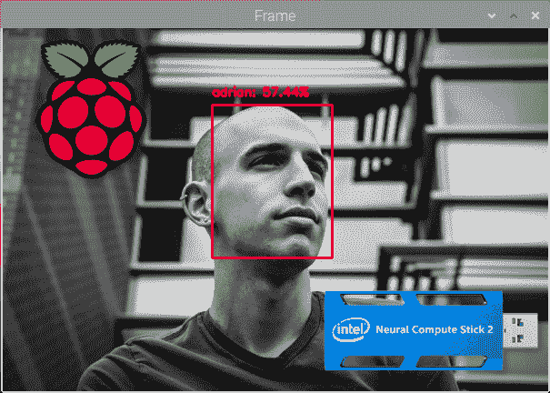
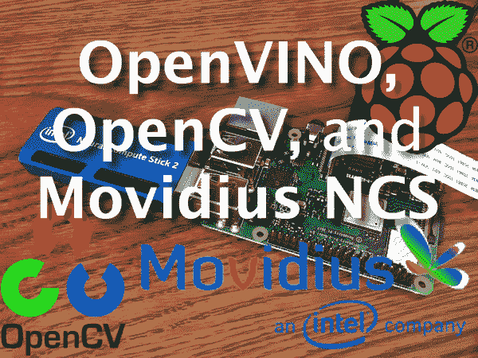
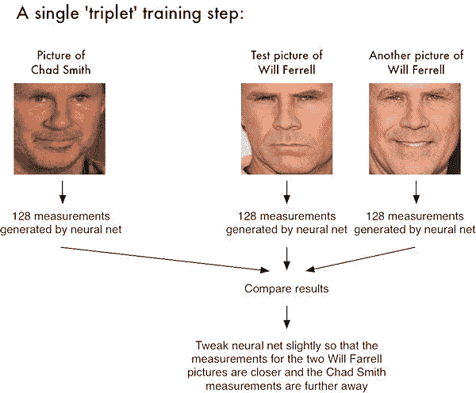
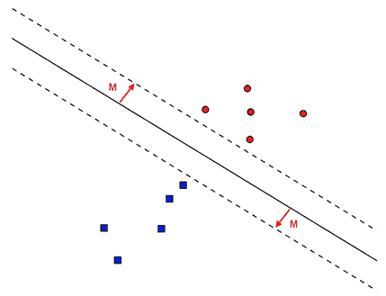
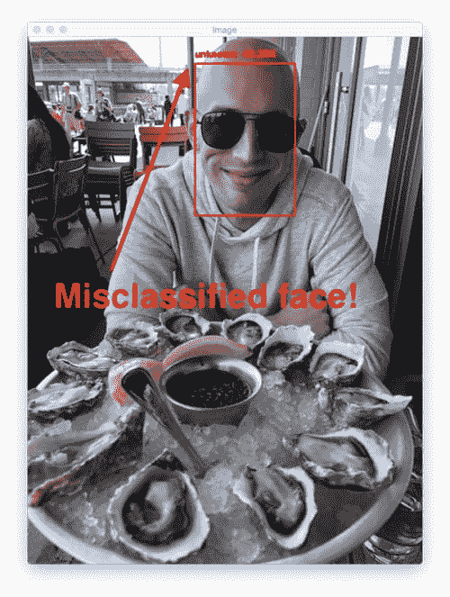

# Raspberry Pi 和 Movidius NCS 人脸识别

> 原文：<https://pyimagesearch.com/2020/01/06/raspberry-pi-and-movidius-ncs-face-recognition/>



在本教程中，您将学习如何使用 Movidius NCS 将 Raspberry Pi ***上的人脸检测和人脸识别速度提高 243%以上！***

如果你曾经试图在树莓派上执行基于深度学习的人脸识别，你可能会注意到明显的滞后。

是人脸检测还是人脸识别模型本身有问题？

不，绝对不行。

问题是你的 Raspberry Pi CPU 处理帧的速度不够快。你需要更强的计算能力。

正如本教程的标题所示，我们将把我们的 Raspberry Pi 与**英特尔 Movidius 神经计算棒协处理器**配对。NCS Myriad 处理器将处理要求更高的*人脸检测*，而 RPi CPU 将处理*提取人脸嵌入*。RPi CPU 处理器还将使用来自面部嵌入的结果来处理最终的机器学习分类。

**将最昂贵的深度学习任务**卸载到 Movidius NCS 的过程释放了 Raspberry Pi CPU 来处理其他任务。然后每个处理器处理适当的负载。我们当然正在将我们的 Raspberry Pi 推向极限，但除了使用完全不同的单板计算机(如 NVIDIA Jetson Nano)之外，我们没有太多选择。

到本教程结束时，你将拥有一个运行速度为 **6.29FPS** 的全功能人脸识别脚本，运行在 RPi 和 Movidius NCS 上，与只使用 RPi 相比， **243%的加速比**！

***注:**本教程包括转贴自我的新计算机视觉书《树莓派》的内容(黑客包第 14 章)。您可以了解更多信息，并在这里领取您的副本。*

**要了解如何使用 Raspberry Pi 和 Movidius 神经计算棒进行人脸识别，*继续阅读！***

## Raspberry Pi 和 Movidius NCS 人脸识别

在本教程中，我们将学习如何使用 Movidius NCS 进行人脸识别。

首先，你需要了解使用深度度量学习的深度学习人脸识别，以及如何创建人脸识别数据集。不理解这两个概念，你可能会在阅读本教程时感到迷失。

在阅读本教程之前，您应该阅读以下任何*:*

 *1.  **[*人脸识别用 OpenCV，Python，还有深度学习*](https://pyimagesearch.com/2018/06/18/face-recognition-with-opencv-python-and-deep-learning/)** ，我第一篇关于深度学习人脸识别的博文。
2.  **[*OpenCV 人脸识别*](https://pyimagesearch.com/2018/09/24/opencv-face-recognition/)** ，我的第二篇关于使用 OpenCV 自带的模型进行深度学习人脸识别的博文。这篇文章还包括一个标题为*“缺点，限制，以及如何获得更高的人脸识别准确率”*的部分，我强烈推荐阅读。
3.  ***[计算机视觉的树莓](https://pyimagesearch.com/raspberry-pi-for-computer-vision/)的**《树莓上的人脸识别》*(*黑客捆绑*第五章)。

此外，您必须阅读以下*:*

 *1.  ***[如何构建自定义人脸识别数据集](https://pyimagesearch.com/2018/06/11/how-to-build-a-custom-face-recognition-dataset/)*** ，一个解释三种方法构建你的人脸识别数据集的教程。
2.  ***[计算机视觉的树莓派](https://pyimagesearch.com/raspberry-pi-for-computer-vision/)的**《第一步:收集你的数据集》*(*黑客捆绑包*第 5 章 5.4.2 节)、

成功阅读并理解这些资源后，您将为 Raspberry Pi 和 Movidius NCS 人脸识别做好准备。

在本教程的剩余部分，我们将开始用 OpenVINO 设置我们的 Raspberry Pi，包括安装必要的软件。

从那里，我们将回顾我们的项目结构，确保我们熟悉今天的可下载 zip 的布局。

然后我们将回顾为 NCS 提取嵌入的过程。我们将在嵌入数据的基础上训练一个机器学习模型。

最后，我们将开发一个快速演示脚本，以确保我们的脸被正确识别。

让我们开始吧。

### 配置您的 Raspberry Pi + OpenVINO 环境

[](https://pyimagesearch.com/wp-content/uploads/2019/04/openvino_install_header.png)

**Figure 1:** Configuring OpenVINO on your Raspberry Pi for face recognition with the Movidius NCS.

**本教程*需要*一个树莓 Pi** (推荐 3B+或 4B)***和* Movidius NCS2** (或更高版本，一旦将来发布更快的版本)**。较低的树莓 Pi 和 NCS 型号可能很难跟上。另一个选择是使用功能强大的笔记本电脑/台式机，而不使用 OpenVINO。**

在这个项目中，为您的 Raspberry Pi 配置英特尔 Movidius NCS 无疑具有挑战性。

建议你(1)拿一个 **[*的副本给计算机视觉*](https://pyimagesearch.com/raspberry-pi-for-computer-vision/)** ，还有(2)把预先配置好的 **[收录闪存。img](https://pyimagesearch.com/2016/11/21/raspbian-opencv-pre-configured-and-pre-installed/)** 到你的 microSD。的。这本书附带的 img 是物有所值的，因为它会节省你无数个小时的辛苦和挫折。

对于那些固执的想要自己配置他们的 Raspberry Pi + OpenVINO 的人来说，这里有一个简单的指南:

1.  前往我的 **[BusterOS 安装指南](https://pyimagesearch.com/2019/09/16/install-opencv-4-on-raspberry-pi-4-and-raspbian-buster/)** 并按照所有指示创建一个名为`cv`的环境。推荐使用 Raspberry Pi 4B 型号(1GB、2GB 或 4GB)。
2.  前往我的 **[OpenVINO 安装指南](https://pyimagesearch.com/2019/04/08/openvino-opencv-and-movidius-ncs-on-the-raspberry-pi/)** 并创建第二个名为`openvino`的环境。一定要用 OpenVINO 4.1.1，因为 4.1.2 有问题。

在这一点上，你的 RPi 将有*和*一个普通的 OpenCV 环境以及一个 OpenVINO-OpenCV 环境。在本教程中，您将使用`openvino`环境。

现在，只需将 NCS2 插入蓝色 USB 3.0 端口(RPi 4B 具有 USB 3.0 以获得最高速度)，并使用以下任一方法启动您的环境:

**选项 A:** 在我的 [*预配置的 Raspbian 上使用 shell 脚本。img*](https://pyimagesearch.com/2016/11/21/raspbian-opencv-pre-configured-and-pre-installed/) (在我的 [OpenVINO 安装指南](https://pyimagesearch.com/2019/04/08/openvino-opencv-and-movidius-ncs-on-the-raspberry-pi/)的*“推荐:创建一个用于启动您的 OpenVINO 环境的 shell 脚本”*部分中描述了相同的 shell 脚本)。

从现在开始，您可以用**一个简单的命令**来*激活您的 OpenVINO* 环境(与上一步中的两个命令相反:

```py
$ source ~/start_openvino.sh
Starting Python 3.7 with OpenCV-OpenVINO 4.1.1 bindings...

```

**选项 B:** 一二冲法。

打开终端并执行以下操作:

```py
$ workon openvino
$ source ~/openvino/bin/setupvars.sh

```

第一个命令激活我们的 OpenVINO 虚拟环境。第二个命令用 OpenVINO 设置 Movidius NCS(非常重要)。从那里，我们在环境中启动 Python 3 二进制文件并导入 OpenCV。

**选项 A** 和**选项 B** 都假设你要么使用我的 [*预配置的 Raspbian。img*](https://pyimagesearch.com/2016/11/21/raspbian-opencv-pre-configured-and-pre-installed/) 或者说你按照我的 [OpenVINO 安装指南](https://pyimagesearch.com/2019/04/08/openvino-opencv-and-movidius-ncs-on-the-raspberry-pi/)自己用你的树莓 Pi 安装了 OpenVINO。

**注意事项:**

*   某些版本的 OpenVINO 很难读取. mp4 视频。这是 PyImageSearch 已经向英特尔团队报告的一个已知 bug。我们的[已预先配置。img](https://pyimagesearch.com/2016/11/21/raspbian-opencv-pre-configured-and-pre-installed/) 包括一个修复——Abhishek Thanki 编辑了源代码，并从源代码编译了 OpenVINO。这篇博文已经够长了，所以我不能包含从源代码编译的说明。如果您遇到这个问题，请鼓励英特尔解决这个问题，或者(A) [使用我们的客户门户说明](https://rpi4cv.pyimagesearch.com/how-to-compile-opencv-openvino/)从源代码编译，或者(B)拿一份[*Raspberry Pi for Computer Vision*](https://pyimagesearch.com/raspberry-pi-for-computer-vision/)并使用预配置的. img
*   如果我们发现其他注意事项，我们会添加到此列表中。

### 项目结构

去拿今天的。从这篇博文的 ***【下载】*** 部分解压文件。

我们的项目按以下方式组织:

```py
|-- dataset
|   |-- abhishek
|   |-- adrian
|   |-- dave
|   |-- mcCartney
|   |-- sayak
|   |-- unknown
|-- face_detection_model
|   |-- deploy.prototxt
|   |-- res10_300x300_ssd_iter_140000.caffemodel
|-- face_embedding_model
|   |-- openface_nn4.small2.v1.t7
|-- output
|   |-- embeddings.pickle
|   |-- le.pickle
|   |-- recognizer.pickle
|-- setupvars.sh
|-- extract_embeddings.py
|-- train_model.py
|-- recognize_video.py

```

包括一个 5 人`dataset/`的例子。每个子目录包含相应人的 20 个图像。

我们的人脸检测器*将检测/定位待识别图像中的人脸。预训练的 Caffe 人脸检测器文件(由 OpenCV 提供)包含在`face_detection_model/`目录中。请务必参考这篇[深度学习人脸检测博文](https://pyimagesearch.com/2018/06/18/face-recognition-with-opencv-python-and-deep-learning/)，以了解更多关于检测器的信息以及如何将其投入使用。*

我们将使用包含在`face_embedding_model/`目录中的预训练的 OpenFace PyTorch 模型来提取人脸嵌入。作为 [OpenFace 项目](https://cmusatyalab.github.io/openface/)的一部分，卡耐基梅隆大学的团队对`openface_nn4.small2.v1.t7`文件进行了训练。

当我们执行`extract_embeddings.py`时，会生成两个 pickle 文件。如果您选择的话，`embeddings.pickle`和`le.pickle`都将存储在`output/`目录中。嵌入由数据集中每个人脸的 128 维向量组成。

然后，我们将通过执行`train_model.py`脚本，在嵌入的基础上训练一个支持向量机(SVM)机器学习模型。训练我们 SVM 的结果将被序列化到`output/`目录中的`recognizer.pickle`。

***注意:**如果您选择使用您自己的数据集(而不是我在下载中提供的数据集)，您应该删除`output/`目录中包含的文件，并生成与您自己的人脸数据集相关联的新文件。*

`recognize_video.py`脚本只需激活您的相机，并在每一帧中检测+识别人脸。

### 我们的环境设置脚本

除非设置了额外的系统环境变量`OPENCV_DNN_IE_VPU_TYPE`，否则我们的 Movidius 人脸识别系统将无法正常工作。

除了启动虚拟环境的之外，一定要设置这个环境变量*。*

这可能会在 OpenVINO 的未来版本中有所改变，但是目前，与本教程相关的项目中提供了一个 shell 脚本。

打开`setup.sh`并检查脚本:

```py
#!/bin/sh

export OPENCV_DNN_IE_VPU_TYPE=Myriad2

```

第一行的**上的“shebang”(`#!`)表示这个脚本是可执行的。**

**第 3 行**使用`export`命令设置环境变量。当然，您可以在终端中手动键入命令，但是这个 shell 脚本让您不必记住变量名和设置。

让我们继续执行 shell 脚本:

```py
$ source setup.sh

```

假设您已经执行了这个脚本，那么您应该不会在项目的其余部分看到任何奇怪的与 OpenVINO 相关的错误。

如果您在下一部分遇到以下**错误信息**，请务必执行`setup.sh`:

```py
Traceback (most recent call last):
       File "extract_embeddings.py", line 108 in 
cv2.error: OpenCV(4.1.1-openvino) /home/jenkins/workspace/OpenCV/
OpenVINO/build/opencv/modules/dnn/src/op*inf*engine.cpp:477
error: (-215:Assertion failed) Failed to initialize Inference Engine
backend: Can not init Myriad device: NC_ERROR in function 'initPlugin'

```

### 利用 Movidius NCS 提取人脸嵌入

[](https://pyimagesearch.com/wp-content/uploads/2018/06/face_recognition_opencv_triplet.jpg)

**Figure 2:** Raspberry Pi facial recognition with the Movidius NCS uses deep metric learning, a process that involves a “triplet training step.” The triplet consists of 3 unique face images — 2 of the 3 are the same person. The NN generates a 128-d vector for each of the 3 face images. For the 2 face images of the same person, we tweak the neural network weights to make the vector closer via distance metric. (image credit: [Adam Geitgey](https://medium.com/@ageitgey/machine-learning-is-fun-part-4-modern-face-recognition-with-deep-learning-c3cffc121d78))

为了执行深度学习人脸识别，我们需要实值特征向量来训练模型。本节中的脚本用于提取数据集中所有面的 128 维特征向量。

同样，如果您不熟悉面部嵌入/编码，请参考上述三个资源之一。

让我们打开`extract_embeddings.py`来回顾一下:

```py
# import the necessary packages
from imutils import paths
import numpy as np
import argparse
import imutils
import pickle
import cv2
import os

# construct the argument parser and parse the arguments
ap = argparse.ArgumentParser()
ap.add_argument("-i", "--dataset", required=True,
	help="path to input directory of faces + images")
ap.add_argument("-e", "--embeddings", required=True,
	help="path to output serialized db of facial embeddings")
ap.add_argument("-d", "--detector", required=True,
	help="path to OpenCV's deep learning face detector")
ap.add_argument("-m", "--embedding-model", required=True,
	help="path to OpenCV's deep learning face embedding model")
ap.add_argument("-c", "--confidence", type=float, default=0.5,
	help="minimum probability to filter weak detections")
args = vars(ap.parse_args())

```

**第 2-8 行**导入提取人脸嵌入所需的包。

**第 11-22 行**解析五个[命令行参数](https://pyimagesearch.com/2018/03/12/python-argparse-command-line-arguments/):

*   `--dataset`:人脸图像输入数据集的路径。
*   `--embeddings`:输出嵌入文件的路径。我们的脚本将计算面部嵌入，我们将序列化到磁盘。
*   `--detector`:OpenCV 基于 Caffe 的深度学习人脸检测器的路径，用于实际*定位*图像中的人脸。
*   `--embedding-model`:OpenCV 深度学习火炬嵌入模型的路径。这个模型将允许我们*提取*一个 128-D 的面部嵌入向量。
*   `--confidence`:筛选周人脸检测的可选阈值。

我们现在准备好**加载我们的面部*检测器*和面部*嵌入器* :**

```py
# load our serialized face detector from disk
print("[INFO] loading face detector...")
protoPath = os.path.sep.join([args["detector"], "deploy.prototxt"])
modelPath = os.path.sep.join([args["detector"],
	"res10_300x300_ssd_iter_140000.caffemodel"])
detector = cv2.dnn.readNetFromCaffe(protoPath, modelPath)
detector.setPreferableTarget(cv2.dnn.DNN_TARGET_MYRIAD)

# load our serialized face embedding model from disk and set the
# preferable target to MYRIAD
print("[INFO] loading face recognizer...")
embedder = cv2.dnn.readNetFromTorch(args["embedding_model"])
embedder.setPreferableTarget(cv2.dnn.DNN_TARGET_MYRIAD)

```

这里我们加载人脸检测器和嵌入器:

*   `detector`:通过**线 26-29** 加载。我们使用基于 Caffe 的 DL 人脸检测器来定位图像中的人脸。
*   `embedder`:装在**33 线**上。这个模型是基于 Torch 的，负责*通过深度学习特征提取提取*面部嵌入。

注意，我们使用各自的`cv2.dnn`函数来加载两个独立的模型。`dnn`模块由英特尔 OpenVINO 开发人员优化。

正如你在**行 30** 和**行 36** 看到的，我们调用`setPreferableTarget`并传递无数常量设置。这些调用确保 Movidius 神经计算棒将为我们进行深度学习。

接下来，让我们获取图像路径并执行初始化:

```py
# grab the paths to the input images in our dataset
print("[INFO] quantifying faces...")
imagePaths = list(paths.list_images(args["dataset"]))

# initialize our lists of extracted facial embeddings and
# corresponding people names
knownEmbeddings = []
knownNames = []

# initialize the total number of faces processed
total = 0

```

建立在第 40 行**上的`imagePaths`列表包含数据集中每个图像的路径。`imutils`功能，`paths.list_images`自动遍历目录树，找到所有图像路径。**

我们的嵌入和相应的名称将保存在两个列表中:(1) `knownEmbeddings`，和(2) `knownNames` ( **第 44 行和第 45 行**)。

我们还将记录我们已经处理了多少张脸的`total`变量(**第 48 行**)。

让我们开始在`imagePaths`上循环——这个循环将负责从每个图像中找到的人脸中提取嵌入:

```py
# loop over the image paths
for (i, imagePath) in enumerate(imagePaths):
	# extract the person name from the image path
	print("[INFO] processing image {}/{}".format(i + 1,
		len(imagePaths)))
	name = imagePath.split(os.path.sep)[-2]

	# load the image, resize it to have a width of 600 pixels (while
	# maintaining the aspect ratio), and then grab the image
	# dimensions
	image = cv2.imread(imagePath)
	image = imutils.resize(image, width=600)
	(h, w) = image.shape[:2]

```

我们开始在**线 51** 的`imagePaths`上循环。

首先，我们从路径中提取人名( **Line 55** )。为了解释其工作原理，请考虑 Python shell 中的以下示例:

```py
$ python
>>> from imutils import paths
>>> import os
>>> datasetPath = "../datasets/face_recognition_dataset"
>>> imagePaths = list(paths.list_images(datasetPath))
>>> imagePath = imagePaths[0]
>>> imagePath
'dataset/adrian/00004.jpg'
>>> imagePath.split(os.path.sep)
['dataset', 'adrian', '00004.jpg']
>>> imagePath.split(os.path.sep)[-2]
'adrian'
>>>

```

请注意，通过使用`imagePath.split`并提供拆分字符(操作系统路径分隔符——Unix 上的“`/`”和非 Unix 系统上的“`\`”)，该函数生成了一个文件夹/文件名(字符串)列表，这些名称沿着目录树向下排列。我们获取倒数第二个索引，即人名，在本例中是`adrian`。

最后，我们通过加载`image`并将其调整到已知的宽度(**第 60 行和第 61 行**)来结束上面的代码块。

让我们检测和定位人脸:

```py
	# construct a blob from the image
	imageBlob = cv2.dnn.blobFromImage(
		cv2.resize(image, (300, 300)), 1.0, (300, 300),
		(104.0, 177.0, 123.0), swapRB=False, crop=False)

	# apply OpenCV's deep learning-based face detector to localize
	# faces in the input image
	detector.setInput(imageBlob)
	detections = detector.forward()

```

在**的第 65-67 行**，我们构造了一个`blob`。blob 将图像打包成与 OpenCV 的`dnn`模块兼容的数据结构。要了解这个过程的更多信息，请阅读 [*深度学习:OpenCV 的 blobFromImage 如何工作*](https://pyimagesearch.com/2017/11/06/deep-learning-opencvs-blobfromimage-works/) 。

从那里，我们通过让`imageBlob`通过检测器网络(**线 71 和 72** )来检测图像中的人脸。

现在，让我们来处理`detections`:

```py
	# ensure at least one face was found
	if len(detections) > 0:
		# we're making the assumption that each image has only ONE
		# face, so find the bounding box with the largest probability
		j = np.argmax(detections[0, 0, :, 2])
		confidence = detections[0, 0, j, 2]

		# ensure that the detection with the largest probability also
		# means our minimum probability test (thus helping filter out
		# weak detection)
		if confidence > args["confidence"]:
			# compute the (x, y)-coordinates of the bounding box for
			# the face
			box = detections[0, 0, j, 3:7] * np.array([w, h, w, h])
			(startX, startY, endX, endY) = box.astype("int")

			# extract the face ROI and grab the ROI dimensions
			face = image[startY:endY, startX:endX]
			(fH, fW) = face.shape[:2]

			# ensure the face width and height are sufficiently large
			if fW < 20 or fH < 20:
				continue

```

`detections`列表包含概率和边界框坐标来定位图像中的人脸。假设我们至少有一个检测，我们将进入`if`-语句的主体(**第 75 行**)。

我们假设图像中只有*张*人脸，因此我们提取具有最高`confidence`的检测，并检查以确保置信度满足用于过滤弱检测的最小概率阈值(**第 78-84 行**)。

当我们达到阈值时，我们提取面部 ROI 并抓取/检查尺寸以确保面部 ROI 足够大(**第 87-96 行**)。

从那里，我们将利用我们的`embedder` CNN 和**提取人脸嵌入:**

```py
			# construct a blob for the face ROI, then pass the blob
			# through our face embedding model to obtain the 128-d
			# quantification of the face
			faceBlob = cv2.dnn.blobFromImage(face, 1.0 / 255,
				(96, 96), (0, 0, 0), swapRB=True, crop=False)
			embedder.setInput(faceBlob)
			vec = embedder.forward()

			# add the name of the person + corresponding face
			# embedding to their respective lists
			knownNames.append(name)
			knownEmbeddings.append(vec.flatten())
			total += 1

```

我们构建另一个斑点，这一次是从脸部 ROI ( *而不是像我们之前做的那样*整个图像)在**线 101 和 102** 上。

随后，我们将`faceBlob`通过`embedder` CNN ( **行 103 和 104** )。这会生成一个 128 维的矢量(`vec`)来量化面部。我们将利用这些数据，通过机器学习来识别新面孔。

然后我们简单地将`name`和嵌入`vec`分别添加到`knownNames`和`knownEmbeddings`(**第 108 行和第 109 行**)。

我们也不能忘记我们设置的用于跟踪`total`张面孔数量的变量——我们继续增加**行 110** 的值。

我们继续这个循环遍历图像、检测人脸以及为数据集中的每个图像提取人脸嵌入的过程。

当循环结束时，剩下的就是将数据转储到磁盘:

```py
# dump the facial embeddings + names to disk
print("[INFO] serializing {} encodings...".format(total))
data = {"embeddings": knownEmbeddings, "names": knownNames}
f = open(args["embeddings"], "wb")
f.write(pickle.dumps(data))
f.close()

```

我们将名称和嵌入数据添加到字典中，然后在第 113-117 行将它序列化到 pickle 文件中。

此时，我们已经准备好**通过执行我们的脚本**来提取嵌入。在运行嵌入脚本之前，确保您的`openvino`环境和附加环境变量已经设置，如果您在上一节中没有这样做的话。这里有一个最快的方法来提醒你:

```py
$ source ~/start_openvino.sh
Starting Python 3.7 with OpenCV-OpenVINO 4.1.1 bindings...
$ source setup.sh

```

在那里，打开一个终端，执行以下命令，用 OpenCV 和 Movidius 计算人脸嵌入:

```py
$ python extract_embeddings.py \
	--dataset dataset \
	--embeddings output/embeddings.pickle \
	--detector face_detection_model \
	--embedding-model face_embedding_model/openface_nn4.small2.v1.t7
[INFO] loading face detector...
[INFO] loading face recognizer...
[INFO] quantifying faces...
[INFO] processing image 1/120
[INFO] processing image 2/120
[INFO] processing image 3/120
[INFO] processing image 4/120
[INFO] processing image 5/120
...
[INFO] processing image 116/120
[INFO] processing image 117/120
[INFO] processing image 118/120
[INFO] processing image 119/120
[INFO] processing image 120/120
[INFO] serializing 116 encodings...

```

此过程在 RPi 4B 上用**57 秒**完成，NCS2 插入 USB 3.0 端口。在加载模型时，您可能会注意到开始时的延迟。从那里开始，每幅图像将会被快速处理。

***注意:**通常我不推荐使用 Raspberry Pi 来提取嵌入，因为这个过程可能需要大量时间(对于大型数据集，建议使用全尺寸、更强大的计算机)。由于我们相对较小的数据集(120 张图片)和 Movidius NCS 的额外“魅力”,这一过程在合理的时间内完成。*

正如你所看到的，我们已经为数据集中的 120 张人脸照片提取了 120 个嵌入。`embeddings.pickle`文件现在也可以在`output/`文件夹中找到:

```py
ls -lh output/*.pickle
-rw-r--r-- 1 pi pi 66K Nov 20 14:35 output/embeddings.pickle

```

序列化嵌入文件大小为 66KB 嵌入文件根据数据集的大小线性增长。请务必回顾本教程后面的*“如何获得更高的人脸识别准确度”*部分，了解足够大的数据集对于实现高准确度的重要性。

### 在面部嵌入的顶部训练 SVM 模型

[](https://pyimagesearch.com/wp-content/uploads/2019/01/python_ml_svm.png)

**Figure 3:** Python machine learning practitioners will often apply Support Vector Machines (SVMs) to their problems (such as deep learning face recognition with the Raspberry Pi and Movidius NCS). SVMs are based on the concept of a hyperplane and the perpendicular distance to it as shown in 2-dimensions (the hyperplane concept applies to higher dimensions as well). For more details, refer to my **[*Machine Learning in Python*](https://pyimagesearch.com/2019/01/14/machine-learning-in-python/)** blog post.

在这一点上，我们已经为每张脸提取了 128 维嵌入，但是我们如何基于这些嵌入来识别一个人呢？

答案是我们需要训练一个[“标准”的机器学习模型](https://pyimagesearch.com/2019/01/14/machine-learning-in-python/)(比如 SVM、k-NN 分类器、随机森林等。)在嵌入的顶部。

对于小数据集，k-最近邻(k-NN)方法可以用于通过 dlib ( [戴维斯·金](https://pyimagesearch.com/2017/03/13/an-interview-with-davis-king-creator-of-the-dlib-toolkit/))和`face_recognition` ( [亚当·盖特基](https://pyimagesearch.com/2018/07/11/an-interview-with-adam-geitgey-creator-of-the-face_recognition-python-library/))库创建的 128 维嵌入的人脸识别。

然而，在本教程中，我们将在嵌入的基础上构建一个更强大的分类器(支持向量机)——如果您愿意，也可以在基于 dlib 的人脸识别管道中使用相同的方法。

打开`train_model.py`文件并插入以下代码:

```py
# import the necessary packages
from sklearn.model_selection import GridSearchCV
from sklearn.preprocessing import LabelEncoder
from sklearn.svm import SVC
import argparse
import pickle

# construct the argument parser and parse the arguments
ap = argparse.ArgumentParser()
ap.add_argument("-e", "--embeddings", required=True,
	help="path to serialized db of facial embeddings")
ap.add_argument("-r", "--recognizer", required=True,
	help="path to output model trained to recognize faces")
ap.add_argument("-l", "--le", required=True,
	help="path to output label encoder")
args = vars(ap.parse_args())

```

我们在第 2-6 行导入我们的包和模块。我们将使用 scikit-learn 实现的支持向量机(SVM)，一种常见的机器学习模型。

**第 9-16 行**解析三个*必需的* [命令行参数](https://pyimagesearch.com/2018/03/12/python-argparse-command-line-arguments/):

*   `--embeddings`:序列化嵌入的路径(我们通过运行前面的`extract_embeddings.py`脚本将它们保存到磁盘)。
*   `--recognizer`:这将是*识别*面对的我们的输出模型。我们将把它保存到磁盘上，以便在接下来的两个识别脚本中使用。
*   `--le`:我们的标签编码器输出文件路径。我们将把我们的标签编码器序列化到磁盘，以便我们可以在图像/视频人脸识别脚本中使用它和识别器模型。

让我们加载我们的面部嵌入和编码我们的标签:

```py
# load the face embeddings
print("[INFO] loading face embeddings...")
data = pickle.loads(open(args["embeddings"], "rb").read())

# encode the labels
print("[INFO] encoding labels...")
le = LabelEncoder()
labels = le.fit_transform(data["names"])

```

在这里，我们在第 20 行上加载了上一节中的嵌入。我们不会在这个模型训练脚本中生成任何嵌入——我们将使用之前生成并序列化的嵌入。

然后我们初始化我们的 scikit-learn `LabelEncoder`并编码我们的名字标签(**第 24 和 25 行**)。

现在是时候训练我们的 SVM 模型来识别人脸了:

```py
# train the model used to accept the 128-d embeddings of the face and
# then produce the actual face recognition
print("[INFO] training model...")
params = {"C": [0.001, 0.01, 0.1, 1.0, 10.0, 100.0, 1000.0],
	"gamma": [1e-1, 1e-2, 1e-3, 1e-4, 1e-5]}
model = GridSearchCV(SVC(kernel="rbf", gamma="auto",
	probability=True), params, cv=3, n_jobs=-1)
model.fit(data["embeddings"], labels)
print("[INFO] best hyperparameters: {}".format(model.best_params_))

```

我们正在使用一个具有[径向基函数(RBF)核](https://en.wikipedia.org/wiki/Radial_basis_function_kernel)的机器学习支持向量机(SVM)，它通常比线性核更难调整。因此，我们将经历一个称为“网格搜索”的过程，这是一种为模型找到最佳机器学习超参数的方法。

**第 30-33 行**设置我们的 gridsearch 参数并执行这个过程。注意`n_jobs=1`。如果使用一个更强大的系统，可以运行多个作业并行执行网格搜索。我们在一个树莓派，所以我们将使用一个工人。

**第 34 行**处理在人脸嵌入向量上训练我们的人脸识别`model`。

***注:**你可以也应该尝试替代的机器学习分类器。 [PyImageSearch 大师课程](https://pyimagesearch.com/pyimagesearch-gurus/)深入涵盖了流行的机器学习算法。*

从这里开始，我们将把人脸识别器模型和标签编码器序列化到磁盘:

```py
# write the actual face recognition model to disk
f = open(args["recognizer"], "wb")
f.write(pickle.dumps(model.best_estimator_))
f.close()

# write the label encoder to disk
f = open(args["le"], "wb")
f.write(pickle.dumps(le))
f.close()

```

要执行我们的培训脚本，请在您的终端中输入以下命令:

```py
$ python train_model.py --embeddings output/embeddings.pickle \
	--recognizer output/recognizer.pickle --le output/le.pickle
[INFO] loading face embeddings...
[INFO] encoding labels...
[INFO] training model...
[INFO] best hyperparameters: {'C': 100.0, 'gamma': 0.1}

```

现在让我们检查一下`output/`文件夹:

```py
ls -lh output/*.pickle
-rw-r--r-- 1 pi pi 66K Nov 20 14:35 output/embeddings.pickle
-rw-r--r-- 1 pi pi 470 Nov 20 14:55 le.pickle
-rw-r--r-- 1 pi pi 97K Nov 20 14:55 recognizer.pickle

```

借助我们的序列化人脸识别模型和标签编码器，我们可以识别图像或视频流中的人脸。

### 基于 Movidius NCS 的视频流实时人脸识别

在本节中，我们将编写一个快速演示脚本，使用您的 PiCamera 或 USB 网络摄像头识别人脸。继续打开`recognize_video.py`并插入以下代码:

```py
# import the necessary packages
from imutils.video import VideoStream
from imutils.video import FPS
import numpy as np
import argparse
import imutils
import pickle
import time
import cv2
import os

# construct the argument parser and parse the arguments
ap = argparse.ArgumentParser()
ap.add_argument("-d", "--detector", required=True,
	help="path to OpenCV's deep learning face detector")
ap.add_argument("-m", "--embedding-model", required=True,
	help="path to OpenCV's deep learning face embedding model")
ap.add_argument("-r", "--recognizer", required=True,
	help="path to model trained to recognize faces")
ap.add_argument("-l", "--le", required=True,
	help="path to label encoder")
ap.add_argument("-c", "--confidence", type=float, default=0.5,
	help="minimum probability to filter weak detections")
args = vars(ap.parse_args())

```

在这一点上，我们的进口应该是熟悉的。

我们的五个[命令行参数](https://pyimagesearch.com/2018/03/12/python-argparse-command-line-arguments/)在**的第 12-24 行**被解析:

*   `--detector`:OpenCV 深度学习人脸检测器的路径。我们将使用这个模型来*检测*面部感兴趣区域在图像中的位置。
*   `--embedding-model`:OpenCV 深度学习人脸嵌入模型的路径。我们将使用这个模型从人脸 ROI 中提取 128 维人脸嵌入图，我们将把数据输入识别器。
*   `--recognizer`:我们的识别器模型的路径。我们在上一节中训练了 SVM 识别器。这个模型实际上将决定谁是 T2。
*   `--le`:我们的标签编码器之路。这包含了我们的面部标签，如`adrian`或`unknown`。
*   `--confidence`:过滤弱脸的可选阈值*检测*。

一定要研究这些命令行参数——了解这两种深度学习模型和 SVM 模型之间的区别至关重要。如果您发现自己在本脚本的后面感到困惑，您应该参考这里。

现在我们已经处理了导入和命令行参数，让我们将三个模型从磁盘加载到内存中:

```py
# load our serialized face detector from disk
print("[INFO] loading face detector...")
protoPath = os.path.sep.join([args["detector"], "deploy.prototxt"])
modelPath = os.path.sep.join([args["detector"],
	"res10_300x300_ssd_iter_140000.caffemodel"])
detector = cv2.dnn.readNetFromCaffe(protoPath, modelPath)
detector.setPreferableTarget(cv2.dnn.DNN_TARGET_MYRIAD)

# load our serialized face embedding model from disk and set the
# preferable target to MYRIAD
print("[INFO] loading face recognizer...")
embedder = cv2.dnn.readNetFromTorch(args["embedding_model"])
embedder.setPreferableTarget(cv2.dnn.DNN_BACKEND_OPENCV)

# load the actual face recognition model along with the label encoder
recognizer = pickle.loads(open(args["recognizer"], "rb").read())
le = pickle.loads(open(args["le"], "rb").read())

```

我们在这个街区装了三个模型。冒着被重复的风险，下面是这些模型之间的差异的简要总结:

1.  `detector`:一个*预训练的* Caffe DL 模型*来检测人脸在图像中的位置* ( **第 28-32 行**)。
2.  `embedder`:一个*预先训练好的*火炬 DL 模型来*计算我们的 128-D 人脸嵌入*(**37 线和 38 线**)。
3.  `recognizer`:我们的 SVM *人脸识别*模型(**41 线**)。

一个和两个是*预训练的*深度学习模型，意味着它们是由 OpenCV 按原样提供给你的。Movidius NCS 将仅使用*探测器* ( **线 32** )进行推断。如果在 Pi CPU 上运行*嵌入器*会更好。

第三个`recognizer`模型不是深度学习的一种形式。相反，它是我们的 SVM 机器学习人脸识别模型。RPi CPU 将不得不使用它来处理面部识别预测。

我们还加载了我们的标签编码器，它保存了我们的模型可以识别的人的名字( **Line 42** )。

让我们初始化我们的视频流:

```py
# initialize the video stream, then allow the camera sensor to warm up
print("[INFO] starting video stream...")
#vs = VideoStream(src=0).start()
vs = VideoStream(usePiCamera=True).start()
time.sleep(2.0)

# start the FPS throughput estimator
fps = FPS().start()

```

第 47 行初始化并启动我们的`VideoStream`对象。我们等待摄像机传感器在**线 48** 预热。

第 51 行初始化我们的 FPS 计数器用于基准测试。

帧处理从我们的`while`循环开始:

```py
# loop over frames from the video file stream
while True:
	# grab the frame from the threaded video stream
	frame = vs.read()

	# resize the frame to have a width of 600 pixels (while
	# maintaining the aspect ratio), and then grab the image
	# dimensions
	frame = imutils.resize(frame, width=600)
	(h, w) = frame.shape[:2]

	# construct a blob from the image
	imageBlob = cv2.dnn.blobFromImage(
		cv2.resize(frame, (300, 300)), 1.0, (300, 300),
		(104.0, 177.0, 123.0), swapRB=False, crop=False)

	# apply OpenCV's deep learning-based face detector to localize
	# faces in the input image
	detector.setInput(imageBlob)
	detections = detector.forward()

```

我们从**线 56** 的网络摄像头上抓拍到一张`frame`。我们`resize`帧(**线 61** )，然后在检测脸部所在位置(**线 65-72** )之前构建斑点。

给定我们的新`detections`，让我们在画面中识别人脸。但是，首先我们需要过滤弱`detections`并提取人脸 ROI:

```py
	# loop over the detections
	for i in range(0, detections.shape[2]):
		# extract the confidence (i.e., probability) associated with
		# the prediction
		confidence = detections[0, 0, i, 2]

		# filter out weak detections
		if confidence > args["confidence"]:
			# compute the (x, y)-coordinates of the bounding box for
			# the face
			box = detections[0, 0, i, 3:7] * np.array([w, h, w, h])
			(startX, startY, endX, endY) = box.astype("int")

			# extract the face ROI
			face = frame[startY:endY, startX:endX]
			(fH, fW) = face.shape[:2]

			# ensure the face width and height are sufficiently large
			if fW < 20 or fH < 20:
				continue

```

在这里，我们对第 75 条线上的`detections`进行循环，并提取第 78 条线上的**的每个的置信度。**

然后，我们将置信度与命令行`args`字典中包含的最小概率检测阈值进行比较，确保计算出的概率大于最小概率(**第 81 行**)。

从那里，我们提取出`face` ROI ( **第 84-89 行**，并确保其空间维度足够大(**第 92 和 93 行**)。

识别脸部 ROI 的名称只需要几个步骤:

```py
			# construct a blob for the face ROI, then pass the blob
			# through our face embedding model to obtain the 128-d
			# quantification of the face
			faceBlob = cv2.dnn.blobFromImage(cv2.resize(face,
				(96, 96)), 1.0 / 255, (96, 96), (0, 0, 0),
				swapRB=True, crop=False)
			embedder.setInput(faceBlob)
			vec = embedder.forward()

			# perform classification to recognize the face
			preds = recognizer.predict_proba(vec)[0]
			j = np.argmax(preds)
			proba = preds[j]
			name = le.classes_[j]

```

首先，我们构造一个`faceBlob`(来自`face` ROI)并通过`embedder`来生成一个 128-D 向量，该向量量化了人脸(**第 98-102 行**

然后，我们将`vec`通过我们的 SVM 识别器模型(**第 105 行**，其结果是我们对谁在面部 ROI 中的*的预测。*

我们取最大概率索引，并查询我们的标签编码器以找到`name` ( **行 106-108** )。

***注意:**您可以通过对概率应用额外的阈值测试来进一步过滤掉弱的人脸识别。例如，插入 if `proba < T`(其中`T`是您定义的变量)可以提供一个额外的过滤层，以确保更少的误报人脸识别。*

现在，让我们显示这个特定帧的人脸识别结果:

```py
			# draw the bounding box of the face along with the
			# associated probability
			text = "{}: {:.2f}%".format(name, proba * 100)
			y = startY - 10 if startY - 10 > 10 else startY + 10
			cv2.rectangle(frame, (startX, startY), (endX, endY),
				(0, 0, 255), 2)
			cv2.putText(frame, text, (startX, y),
				cv2.FONT_HERSHEY_SIMPLEX, 0.45, (0, 0, 255), 2)

	# update the FPS counter
	fps.update()

	# show the output frame
	cv2.imshow("Frame", frame)
	key = cv2.waitKey(1) & 0xFF

	# if the `q` key was pressed, break from the loop
	if key == ord("q"):
		break

# stop the timer and display FPS information
fps.stop()
print("[INFO] elasped time: {:.2f}".format(fps.elapsed()))
print("[INFO] approx. FPS: {:.2f}".format(fps.fps()))

# do a bit of cleanup
cv2.destroyAllWindows()
vs.stop()

```

为了结束脚本，我们:

*   在人脸和人名周围画一个包围框和对应的预测概率(**第 112-117 行**)。
*   更新我们的`fps`计数器( **Line 120** )。
*   显示带注释的帧(**第 123 行**)并等待按下`q`键，此时我们退出循环(**第 124-128 行**)。
*   停止我们的`fps`计数器并在终端中打印统计数据(**第 131-133 行**)。
*   通过关闭窗口和释放指针(**行 136 和 137** )进行清理。

### 基于 Movidius NCS 结果的人脸识别

现在，我们已经(1)提取了人脸嵌入，(2)在嵌入上训练了机器学习模型，以及(3)在视频流驱动脚本中编写了我们的人脸识别，让我们看看最终的结果。

确保您遵循了以下步骤:

1.  **步骤#1:** [收集你的人脸识别数据集](https://pyimagesearch.com/2018/06/11/how-to-build-a-custom-face-recognition-dataset/)。
2.  **步骤#2:** 提取面部嵌入(通过`extract_embeddings.py`脚本)。
3.  **步骤#3:** 使用`train_model.py`在嵌入集合上训练机器学习模型(例如今天例子中的支持向量机)。

在这里，设置您的 Raspberry Pi 和 Movidius NCS 进行面部识别:

*   连接您的 PiCamera 或 USB 摄像头，并配置实时人脸识别脚本的 **Line 46** 或 **Line 47** (但不是两者)来启动您的视频流。
*   插入您的英特尔 m ovidius NC S2(NC S1 也是兼容的)。
*   启动您的`openvino`虚拟环境，并设置如下所示的关键环境变量:

```py
$ source ~/start_openvino.sh
Starting Python 3.7 with OpenCV-OpenVINO 4.1.1 bindings...
$ source setup.sh

```

使用 OpenVINO 4.1.1 很关键。较新的 4.1.2 有许多问题导致它不能很好地工作。

从那里，打开一个终端并执行以下命令:

```py
$ python recognize_video.py --detector face_detection_model \
	--embedding-model face_embedding_model/openface_nn4.small2.v1.t7 \
	--recognizer output/recognizer.pickle \
	--le output/le.pickle
[INFO] loading face detector...
[INFO] loading face recognizer...
[INFO] starting video stream...
[INFO] elasped time: 60.30
[INFO] approx. FPS: 6.29

```

***注意:**确保您用于部署的 scikit-learn 版本与您用于培训的版本相匹配。如果版本不匹配，那么当您试图从磁盘加载模型时，可能会遇到问题。特别是你可能会遇到`AttributeError: 'SVC' object has no attribute '_n_support'`。如果您在笔记本电脑/台式机/云环境中进行培训并部署到 Raspberry Pi，这一点尤为重要。版本很容易不同步，所以一定要通过`pip freeze | grep scikit`在两个地方检查它们。要在您的环境中安装一个特定的版本，只需使用这个命令:`pip install scikit-learn==0.22.1`，根据需要替换这个版本。*

如你所见，人脸已经被正确识别。更重要的是，与严格使用 CPU 的 **2.59 FPS** 相比，我们使用 Movidius NCS 实现了 **6.29 FPS** 。使用 RPi 4B 和 Movidius NCS2，**加速达到 243%** 。

我请 PyImageSearch 团队成员 Abhishek Thanki 录制了一段我们的 Movidius NCS 人脸识别演示。您可以在下面找到演示:

正如你所看到的，Raspberry Pi 和 Movidius NCS 的结合能够近乎实时地识别 Abhishek 的面部——仅使用*和*Raspberry Pi CPU 不足以获得这样的速度。

## 我的人脸识别系统无法正确识别人脸

[](https://pyimagesearch.com/wp-content/uploads/2020/01/face_reco_misclassified.jpg)

**Figure 4:** Misclassified faces occur for a variety of reasons when performing Raspberry Pi and Movidius NCS face recognition.

提醒一下，请务必参考以下两个资源:

1.  [*OpenCV 人脸识别*](https://pyimagesearch.com/2018/09/24/opencv-face-recognition/) 包含一个名为*“弊端、局限性，以及如何获得更高的人脸识别准确率”的章节。*
2.  *“如何获得更高的人脸识别*准确率”，第十四章的一个章节，*树莓上的人脸识别([树莓用于计算机视觉](https://pyimagesearch.com/raspberry-pi-for-computer-vision/) )* 。

在 OpenCV 无法正确识别人脸的情况下，这两种资源都可以帮助您。

简言之，您可能需要:

*   更多数据。这是人脸识别系统失败的首要原因。作为一般规则，我建议你的数据集中每人有 20-50 张人脸图像。
*   当每个面部 ROI 经历嵌入过程时，执行[面部对准](https://pyimagesearch.com/2017/05/22/face-alignment-with-opencv-and-python/)。
*   来调整你的机器学习分类器超参数。

同样，如果你的人脸识别系统不匹配人脸或将人脸标记为“未知”，请务必花时间改进你的人脸识别系统。

## 摘要

在本教程中，我们使用 OpenVINO 和我们的 Movidius NCS 来执行人脸识别。

我们的人脸识别渠道由四个阶段组成:

1.  **步骤#1:** 创建你的面部图像数据集。当然，如果您遵循当今项目的相同数据集目录结构，您可以换入自己的人脸数据集。
2.  **步骤#2:** 提取数据集中每个人脸的人脸嵌入。
3.  **步骤#3:** 在人脸嵌入的基础上训练机器学习模型(支持向量机)。
4.  **步骤#4:** 利用 OpenCV 和我们的 Movidius NCS 来识别视频流中的人脸。

我们将我们的 Movidius NCS 仅用于以下深度学习任务之一:

*   **人脸检测:**在图像中定位人脸(运动)
*   **提取人脸嵌入:**生成 128 维向量，对人脸进行数值量化(CPU)

然后，我们使用 Raspberry Pi CPU 来处理用于对 128-D 嵌入进行预测的*非 DL* 机器学习分类器。

这看起来好像 CPU 正在做更多的任务，只是要记住，深度学习人脸检测是一个非常计算“昂贵”的操作。

这种职责分离的过程允许 CPU 发号施令，同时使用 NCS 来承担重任。我们使用 Movidius NCS 在视频流中进行人脸识别，实现了 243% 的**加速。**

**要下载这篇文章的源代码(并在未来教程在 PyImageSearch 上发布时得到通知)，*只需在下面的表格中留下您的电子邮件！*****