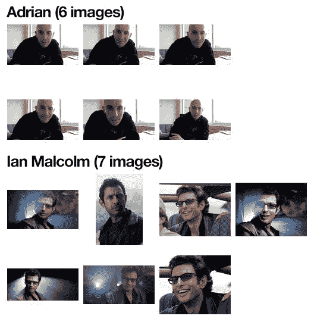
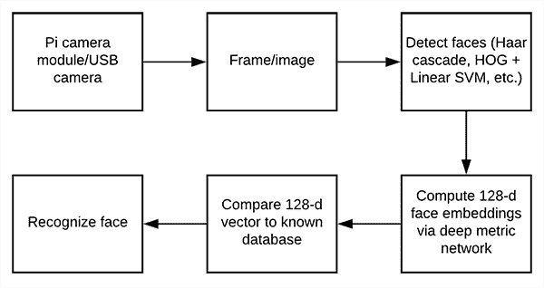
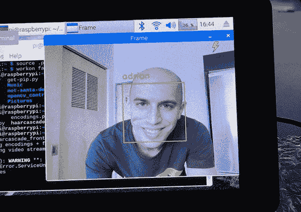

# 树莓 Pi 人脸识别

> 原文：<https://pyimagesearch.com/2018/06/25/raspberry-pi-face-recognition/>

在上周的博文中，你学习了如何用 Python、OpenCV 和深度学习 执行 [*人脸识别。*](https://pyimagesearch.com/2018/06/18/face-recognition-with-opencv-python-and-deep-learning/)

但正如我在帖子中暗示的那样，为了在 **Raspberry Pi** 上执行人脸识别，你首先需要考虑一些优化——否则，人脸识别管道将彻底失败。

也就是说，在 Raspberry Pi 上执行人脸识别时，您应该考虑:

*   你在哪个机器上 ***为你的训练集计算你的人脸识别嵌入*** (例如，在 Raspberry Pi 上，在笔记本电脑/台式机上，在带有 GPU 的机器上)
*   你用于 ***人脸检测的方法*** (哈尔喀斯，HOG +线性 SVM，或 CNN)
*   你如何从你的相机传感器 ***轮询帧*** (线程与非线程)

当在 Raspberry Pi 上执行准确的人脸识别时，所有这些考虑因素和相关假设都是至关重要的，我将在这里指导您完成这些工作。

**要了解更多关于使用 Raspberry Pi 进行人脸识别的信息，*请跟随。***

## 树莓 Pi 人脸识别

**这篇文章假设你已经通读了上周关于 OpenCV 人脸识别的文章——如果你还没有阅读，请回到文章中阅读，然后再继续。**

在今天博客文章的第一部分，我们将讨论在训练图像集上计算面部嵌入时应该考虑的因素。

在那里，我们将回顾可用于在 Raspberry Pi 上执行人脸识别的源代码，包括许多不同的优化。

最后，我将提供一个使用我的 Raspberry Pi 在视频流中识别人脸(包括我自己)的演示。

### 为面部识别配置您的 Raspberry Pi

让我们为今天的博文配置我们的 Raspberry Pi。

首先，如果你还没有安装 OpenCV 的话，安装它。你可以按照我在这个 **[OpenCV 安装教程](https://pyimagesearch.com/opencv-tutorials-resources-guides/)** 页面上链接的说明来获取最新的说明。

接下来，让我们将 Davis King 的 [dlib toolkit](http://dlib.net/) 软件安装到您安装 OpenCV 的同一个 Python 虚拟环境中(假设您正在使用一个虚拟环境):

```py
$ workon <your env name> # optional
$ pip install dlib

```

如果你想知道戴维斯·金是谁，看看我 2017 年对戴维斯的采访！

从那里，只需使用 pip 安装 Adam Geitgey 的[面部识别模块](https://github.com/ageitgey/face_recognition):

```py
$ workon <your env name> # optional
$ pip install face_recognition

```

别忘了安装我的便利功能包:

```py
$ workon <your env name> # optional
$ pip install imutils

```

### PyImageConf 2018，一场 PyImageSearch 大会

[](https://pyimagesearch.com/wp-content/uploads/2018/03/dsvm_pyimageconf.jpg)

您愿意在加州旧金山举行的 PyImageSearch 大会上接受我、Davis King、Adam Geitgey 和其他人的现场培训吗？

无论是**戴维斯·金**([dlib](http://dlib.net/)的创造者)还是**亚当·盖特基**(*[的作者)机器学习都很有趣！](https://medium.com/@ageitgey/machine-learning-is-fun-80ea3ec3c471)* 系列)将在 **PyImageConf 2018** 授课，你不想错过！你还可以向其他 ***杰出的计算机视觉******深度学习行业演讲人、*** 包括我！

你会遇到业内的其他人，你可以向他们学习并与之合作。您甚至可以在晚间活动中与与会者交流。

只剩下少数几张票了，一旦我总共卖出 200 张，我就没有地方给你了。**不要拖延！**

[I want to attend *PyImageConf* 2018!](https://www.pyimageconf.com)

### 项目结构

如果你今天想在你的树莓派上执行面部识别，请前往这篇博客文章的 ***【下载】*** 部分并获取代码。从那里，将 zip 文件复制到您的 Raspberry Pi(我使用 SCP)中，让我们开始吧。

在您的 Pi 上，您应该解压缩归档文件，更改工作目录，并查看项目结构，就像我下面所做的那样:

```py
$ unzip pi-face-recognition.zip
...
$ cd pi-face-recognition
$ tree
.
├── dataset
│   ├── adrian
│   │   ├── 00000.png
│   │   ├── 00001.png
│   │   ├── 00002.png
│   │   ├── 00003.png
│   │   ├── 00004.png
│   │   └── 00005.png
│   └── ian_malcolm
│       ├── 00000000.jpg
│       ├── 00000001.jpg
│       ├── 00000003.jpg
│       ├── 00000005.jpg
│       ├── 00000007.jpg
│       ├── 00000008.jpg
│       └── 00000009.jpg
├── encode_faces.py
├── encodings.pickle
├── haarcascade_frontalface_default.xml
└── pi_face_recognition.py

3 directories, 17 files

```

我们的项目有一个包含两个子目录的目录:

*   这个目录应该包含你希望你的面部识别系统识别的每个人的子目录。
    *   这个子目录包含了我的照片。你想把它换成你自己的照片？。
    *   `ian_malcolm/`:侏罗纪公园的*角色*、[伊恩·马尔科姆](http://jurassicpark.wikia.com/wiki/Ian_Malcolm)的照片都在这个文件夹里，但是你很可能会用你想认识的其他人的目录来替换这个目录。

从那里开始，我们在`pi-face-recognition/`中有四个文件:

*   这个文件将在我们的数据集中找到人脸，并将它们编码成 128 维向量。
*   我们的人脸编码(128 维向量，每个人脸一个)存储在这个 pickle 文件中。
*   为了检测和定位帧中的人脸，我们依靠 OpenCV 预先训练的 Haar 级联文件。
*   这是我们的主要执行脚本。我们将在这篇文章的后面回顾它，这样你就能理解代码和在引擎盖下发生了什么。从那里开始，你可以随意地为你自己的项目进行修改。

现在我们已经熟悉了项目文件和目录，让我们讨论为您的 Raspberry Pi 构建人脸识别系统的第一步。

### 第一步:收集你的面部数据集

[](https://pyimagesearch.com/wp-content/uploads/2018/06/pi_face_recognition_dataset.jpg)

**Figure 1:** A face recognition dataset is necessary for building a face encodings file to use with our Python + OpenCV + Raspberry Pi face recognition method.

在应用人脸识别之前，我们首先需要收集我们想要识别的示例图像的数据集。

我们可以通过多种方式收集此类图像，包括:

1.  通过使用相机+面部检测来收集样本面部，从而执行面部注册
2.  使用各种 API(例如、谷歌、脸书、推特等。)来自动下载示例面孔
3.  手动收集图像

这篇文章假设你已经收集了一个人脸数据集，但如果你还没有，或者正在收集人脸数据集，请确保阅读我的博客文章 **[*如何创建自定义人脸识别数据集*](https://pyimagesearch.com/2018/06/11/how-to-build-a-custom-face-recognition-dataset/)** 来帮助你开始。

为了这篇博文，我收集了两个人的照片:

*   本人(共 5 人)
*   [伊恩·马尔科姆博士](http://jurassicpark.wikia.com/wiki/Ian_Malcolm)来自电影 [*侏罗纪公园*](https://en.wikipedia.org/wiki/Jurassic_Park) (共 6 部)

仅使用这少量的图像，我将演示如何创建一个能够部署到 Raspberry Pi 的准确的人脸识别应用程序。

### 第二步:计算你的人脸识别嵌入

[](https://pyimagesearch.com/wp-content/uploads/2018/06/pi_face_recognition_flowchart.png)

**Figure 2:** Beginning with capturing input frames from our Raspberry Pi, our workflow consists of detecting faces, computing embeddings, and comparing the vector to the database via a voting method. OpenCV, dlib, and `face_recognition` are required for this face recognition method.

我们将使用深度神经网络来计算 128-d 向量(即，128 个浮点值的列表)，该向量将量化数据集中的每个面部。我们已经在上周的博客文章中回顾了(1)我们的深度神经网络如何执行面部识别以及(2)相关的源代码，但是为了完整起见，我们也将在这里回顾代码。

让我们从 ***【下载】*** 中打开`encode_faces.py`与这篇博文相关的评论:

```py
# import the necessary packages
from imutils import paths
import face_recognition
import argparse
import pickle
import cv2
import os

# construct the argument parser and parse the arguments
ap = argparse.ArgumentParser()
ap.add_argument("-i", "--dataset", required=True,
	help="path to input directory of faces + images")
ap.add_argument("-e", "--encodings", required=True,
	help="path to serialized db of facial encodings")
ap.add_argument("-d", "--detection-method", type=str, default="cnn",
	help="face detection model to use: either `hog` or `cnn`")
args = vars(ap.parse_args())

```

首先，我们需要导入所需的包。值得注意的是，这个脚本需要安装`imutils`、`face_recognition`和 OpenCV。向上滚动到*“为面部识别配置您的 Raspberry Pi”*部分，安装必要的软件。

从那里，我们用`argparse`处理我们的[命令行参数](https://pyimagesearch.com/2018/03/12/python-argparse-command-line-arguments/):

*   `--dataset`:我们数据集的路径(我们使用上周博文中的[方法 2 创建了一个数据集)。](https://pyimagesearch.com/2018/06/11/how-to-build-a-custom-face-recognition-dataset/)
*   我们的面部编码被写到这个参数指向的文件中。
*   `--detection-method`:在我们能够*编码图像中的*张脸之前，我们首先需要*检测*张脸。我们的两种人脸检测方法包括`hog`或`cnn`。这两个标志是唯一适用于`--detection-method`的标志。

***注:*** *树莓派是**不具备运行 CNN 检测方法的能力。**如果你想运行 CNN 检测方法，你应该使用一个有能力的计算，如果你正在处理一个大数据集，最好是一个带有 GPU 的计算。否则，使用`hog`人脸检测方法。*

现在我们已经定义了参数，让我们获取数据集中图像文件的路径(并执行两次初始化):

```py
# grab the paths to the input images in our dataset
print("[INFO] quantifying faces...")
imagePaths = list(paths.list_images(args["dataset"]))

# initialize the list of known encodings and known names
knownEncodings = []
knownNames = []

```

从这里开始，我们将继续遍历数据集中的每个面:

```py
# loop over the image paths
for (i, imagePath) in enumerate(imagePaths):
	# extract the person name from the image path
	print("[INFO] processing image {}/{}".format(i + 1,
		len(imagePaths)))
	name = imagePath.split(os.path.sep)[-2]

	# load the input image and convert it from BGR (OpenCV ordering)
	# to dlib ordering (RGB)
	image = cv2.imread(imagePath)
	rgb = cv2.cvtColor(image, cv2.COLOR_BGR2RGB)

	# detect the (x, y)-coordinates of the bounding boxes
	# corresponding to each face in the input image
	boxes = face_recognition.face_locations(rgb,
		model=args["detection_method"])

	# compute the facial embedding for the face
	encodings = face_recognition.face_encodings(rgb, boxes)

	# loop over the encodings
	for encoding in encodings:
		# add each encoding + name to our set of known names and
		# encodings
		knownEncodings.append(encoding)
		knownNames.append(name)

```

在循环内部，我们:

*   从路径中提取人物的`name`(**行 32** )。
*   加载并转换`image`到`rgb` ( **第 36 和 37 行**)。
*   定位图像中的人脸(**第 41 行和第 42 行**)。
*   计算面部嵌入，并将它们添加到`knownEncodings`中，同时将它们的`name`添加到`knownNames` ( **第 45-52 行**)中相应的列表元素中。

让我们将面部编码导出到磁盘，以便在面部识别脚本中使用:

```py
# dump the facial encodings + names to disk
print("[INFO] serializing encodings...")
data = {"encodings": knownEncodings, "names": knownNames}
f = open(args["encodings"], "wb")
f.write(pickle.dumps(data))
f.close()

```

**第 56 行**用两个键`"encodings"`和`"names"`构造一个字典。与键相关联的值包含编码和名称本身。

然后在第 57-59 行的**上将`data`字典写入磁盘。**

要创建我们的面部嵌入，打开一个终端并执行以下命令:

```py
$ python encode_faces.py --dataset dataset --encodings encodings.pickle \
	--detection-method hog
[INFO] quantifying faces...
[INFO] processing image 1/11
[INFO] processing image 2/11
[INFO] processing image 3/11
...
[INFO] processing image 9/11
[INFO] processing image 10/11
[INFO] processing image 11/11
[INFO] serializing encodings...

```

运行脚本后，您将拥有一个 pickle 文件。我的文件被命名为`encodings.pickle`——这个文件包含我们数据集中每个人脸的 128-d 人脸嵌入。

**等等！你在树莓派上运行这个脚本吗？**

没问题，用`--detection-method hog`命令行参数就行了。`--detection-method cnn`不能在树莓派上工作，但如果你用一台有能力的机器对你的脸进行编码，肯定可以使用。如果你不熟悉命令行参数，只要确保[快速阅读这篇文章](https://pyimagesearch.com/2018/03/12/python-argparse-command-line-arguments/)，你很快就会成为专家！

### 第三步:在你的 Raspberry Pi 上识别视频流中的人脸

[](https://pyimagesearch.com/wp-content/uploads/2018/06/pi_face_recognition_example.jpg)

**Figure 3:** Face recognition on the Raspberry Pi using OpenCV and Python.

我们的`pi_face_recognition.py`脚本与[上周的](https://pyimagesearch.com/2018/06/18/face-recognition-with-opencv-python-and-deep-learning/) `recognize_faces_video.py`脚本非常相似，只有一个显著的变化。在这个脚本中，我们将使用 OpenCV 的 Haar cascade 来*检测和定位*面部。从那里，我们将继续用同样的方法来实际上*识别*这张脸。

事不宜迟，让我们开始编码吧:

```py
# import the necessary packages
from imutils.video import VideoStream
from imutils.video import FPS
import face_recognition
import argparse
import imutils
import pickle
import time
import cv2

# construct the argument parser and parse the arguments
ap = argparse.ArgumentParser()
ap.add_argument("-c", "--cascade", required=True,
	help = "path to where the face cascade resides")
ap.add_argument("-e", "--encodings", required=True,
	help="path to serialized db of facial encodings")
args = vars(ap.parse_args())

```

首先，让我们导入包并解析[命令行参数](https://pyimagesearch.com/2018/03/12/python-argparse-command-line-arguments/)。我们从`imutils`以及`imutils`本身导入了两个模块(`VideoStream`和`FPS`)。我们还导入了`face_recognition`和`cv2` (OpenCV)。列出的其余模块是 Python 安装的一部分。请参阅*“为面部识别配置您的 Raspberry Pi”*安装软件。

然后我们解析两个命令行参数:

*   `--cascade`:OpenCV 的 Haar cascade 路径(包含在本文的源代码下载中)。
*   `--encodings`:我们面部编码系列数据库的路径。我们刚刚在前一节构建了编码。

从这里开始，在我们开始从我们的相机循环帧之前，让我们实例化几个对象:

```py
# load the known faces and embeddings along with OpenCV's Haar
# cascade for face detection
print("[INFO] loading encodings + face detector...")
data = pickle.loads(open(args["encodings"], "rb").read())
detector = cv2.CascadeClassifier(args["cascade"])

# initialize the video stream and allow the camera sensor to warm up
print("[INFO] starting video stream...")
vs = VideoStream(src=0).start()
# vs = VideoStream(usePiCamera=True).start()
time.sleep(2.0)

# start the FPS counter
fps = FPS().start()

```

在这一部分中，我们:

*   加载面部编码`data` ( **第 22 行**)。
*   使用哈尔级联方法实例化我们的脸`detector`(**第 23 行**)。
*   初始化我们的`VideoStream` —我们将使用 USB 摄像头，但是 ***如果你想使用 PiCamera 与你的 Pi*** ，只需注释**第 27 行**并取消注释**第 28 行**。
*   等待相机预热(**第 29 行**)。
*   开始我们的每秒帧数，`fps`，计数器(**第 32 行**)。

从这里，让我们开始从相机捕捉帧并识别人脸:

```py
# loop over frames from the video file stream
while True:
	# grab the frame from the threaded video stream and resize it
	# to 500px (to speedup processing)
	frame = vs.read()
	frame = imutils.resize(frame, width=500)

	# convert the input frame from (1) BGR to grayscale (for face
	# detection) and (2) from BGR to RGB (for face recognition)
	gray = cv2.cvtColor(frame, cv2.COLOR_BGR2GRAY)
	rgb = cv2.cvtColor(frame, cv2.COLOR_BGR2RGB)

	# detect faces in the grayscale frame
	rects = detector.detectMultiScale(gray, scaleFactor=1.1, 
		minNeighbors=5, minSize=(30, 30))

	# OpenCV returns bounding box coordinates in (x, y, w, h) order
	# but we need them in (top, right, bottom, left) order, so we
	# need to do a bit of reordering
	boxes = [(y, x + w, y + h, x) for (x, y, w, h) in rects]

	# compute the facial embeddings for each face bounding box
	encodings = face_recognition.face_encodings(rgb, boxes)
	names = []

```

我们继续抓取一个`frame`并对其进行预处理。预处理步骤包括调整大小，然后转换成灰度和`rgb` ( **第 38-44 行**)。

用伊恩·马尔科姆的话说:

> 你们的科学家太专注于他们是否能做到，他们没有停下来想想他们是否应该。

他指的是成长中的恐龙。至于人脸识别，我们*可以*并且我们*应该*用我们的树莓派检测和识别人脸。我们只需要**小心**不要用复杂的深度学习方法让 Pi 有限的内存超载。因此，我们将使用一种稍微过时但非常突出的方法来进行人脸检测— **Haar cascades！**

哈尔级联也被称为 Viola-Jones 算法，他们的论文发表于 2001 年。

这篇被高度引用的论文提出了他们的方法，以实时检测多尺度图像中的对象。对于 2001 年来说，这是一个巨大的发现和知识共享——哈尔瀑布至今仍广为人知。

我们将利用 OpenCV 训练过的人脸 Haar 级联，这可能需要一点点参数调整(与用于人脸检测的[深度学习方法](https://pyimagesearch.com/2018/02/26/face-detection-with-opencv-and-deep-learning/)相比)。

`detectMultiScale`方法的参数包括:

*   `gray`:灰度图像。
*   `scaleFactor`:指定每个图像比例下图像尺寸缩小多少的参数。
*   `minNeighbors`:指定每个候选矩形应该有多少个邻居来保留它的参数。
*   `minSize`:可能的最小物体(面)尺寸。小于该值的对象将被忽略。

有关这些参数以及如何调整它们的更多信息，请务必参考我的书， [*实用 Python 和 OpenCV*](https://pyimagesearch.com/practical-python-opencv/) 以及 [PyImageSearch 大师课程](https://pyimagesearch.com/pyimagesearch-gurus/)。

我们的面部检测的结果是`rects`，一个面部包围盒矩形的列表，它对应于帧中的面部位置(**行 47 和 48** )。我们转换并重新排列这个列表在第 53 行的坐标。

然后，我们计算第 56 行的**上的每个人脸的 128-d `encodings`，从而量化人脸。**

现在让我们循环面部编码并检查匹配:

```py
	# loop over the facial embeddings
	for encoding in encodings:
		# attempt to match each face in the input image to our known
		# encodings
		matches = face_recognition.compare_faces(data["encodings"],
			encoding)
		name = "Unknown"

		# check to see if we have found a match
		if True in matches:
			# find the indexes of all matched faces then initialize a
			# dictionary to count the total number of times each face
			# was matched
			matchedIdxs = [i for (i, b) in enumerate(matches) if b]
			counts = {}

			# loop over the matched indexes and maintain a count for
			# each recognized face face
			for i in matchedIdxs:
				name = data["names"][i]
				counts[name] = counts.get(name, 0) + 1

			# determine the recognized face with the largest number
			# of votes (note: in the event of an unlikely tie Python
			# will select first entry in the dictionary)
			name = max(counts, key=counts.get)

		# update the list of names
		names.append(name)

```

上面代码块的目的是识别人脸。在这里我们:

1.  检查`matches` ( **行 63 和 64** )。
2.  如果找到匹配，我们将使用投票系统来决定谁的脸最有可能是(**68-87**)**。**这种方法的工作原理是检查数据集中哪个人匹配最多(如果出现平局，则选择字典中的第一个条目)。

然后，我们简单地在每张脸周围画出矩形，并附上预测的人名:

```py
	# loop over the recognized faces
	for ((top, right, bottom, left), name) in zip(boxes, names):
		# draw the predicted face name on the image
		cv2.rectangle(frame, (left, top), (right, bottom),
			(0, 255, 0), 2)
		y = top - 15 if top - 15 > 15 else top + 15
		cv2.putText(frame, name, (left, y), cv2.FONT_HERSHEY_SIMPLEX,
			0.75, (0, 255, 0), 2)

	# display the image to our screen
	cv2.imshow("Frame", frame)
	key = cv2.waitKey(1) & 0xFF

	# if the `q` key was pressed, break from the loop
	if key == ord("q"):
		break

	# update the FPS counter
	fps.update()

```

在绘制了框和文本之后，我们显示图像并检查是否按下了 quit(“q”)键。我们还更新了我们的`fps`计数器。

最后一点。让我们清理并将性能诊断写入终端:

```py
# stop the timer and display FPS information
fps.stop()
print("[INFO] elasped time: {:.2f}".format(fps.elapsed()))
print("[INFO] approx. FPS: {:.2f}".format(fps.fps()))

# do a bit of cleanup
cv2.destroyAllWindows()
vs.stop()

```

### 人脸识别结果

请务必使用 ***“下载”*** 部分来获取这篇博文的源代码和示例数据集。

从那里，打开您的 Raspberry Pi 终端并执行以下命令:

```py
$ python pi_face_recognition.py --cascade haarcascade_frontalface_default.xml \
	--encodings encodings.pickle
[INFO] loading encodings + face detector...
[INFO] starting video stream...
[INFO] elasped time: 20.78
[INFO] approx. FPS: 1.21

```


**我在下面附上了一个演示视频和附加评论，所以请一定要看:**

<https://www.youtube.com/embed/DMwk4c4bTJE?feature=oembed>