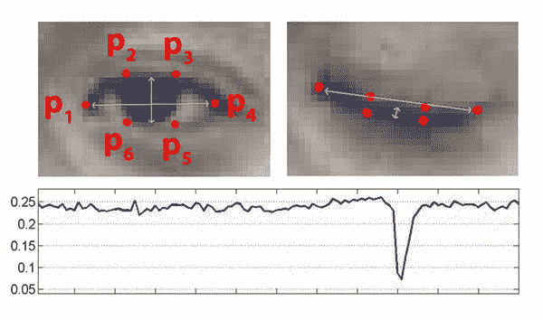
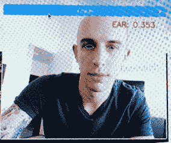
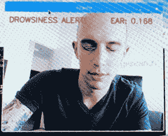
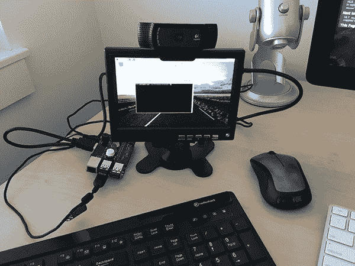

# Raspberry Pi:面部标志 OpenCV 和 dlib 睡意检测

> 原文：<https://pyimagesearch.com/2017/10/23/raspberry-pi-facial-landmarks-drowsiness-detection-with-opencv-and-dlib/>

今天的博文是期待已久的关于**树莓派上实时睡意检测的教程！**

```py
$ workon cv
$ pip install RPi.GPIO
$ pip install gpiozero

```

在那里，如果您想检查虚拟环境中的所有组件是否安装正确，您可以直接运行 Python 解释器:

```py
$ workon cv
$ python
>>> import RPi.GPIO
>>> import gpiozero
>>> import numpy
>>> import dlib
>>> import cv2
>>> import imutils

```

***注意:**我假设您正在使用的虚拟环境**已经**安装了上述软件包。我的`cv`虚拟环境已经安装了 NumPy、dlib、OpenCV 和 imutils，所以通过使用`pip`安装`RPi.GPIO`和`gpiozero`安装各自的 GPIO 包，我能够从同一个环境中访问所有六个库。你可以`pip install`每个包(OpenCV 除外)。要在你的 Raspberry Pi 上安装一个优化的 OpenCV，只需按照[上一篇文章](https://pyimagesearch.com/2017/10/09/optimizing-opencv-on-the-raspberry-pi/)进行操作。如果您在安装 dlib 时遇到问题，[请遵循本指南](https://pyimagesearch.com/2017/05/01/install-dlib-raspberry-pi/)。
*

驾驶员睡意检测算法与我们在[之前的教程](https://pyimagesearch.com/2017/05/08/drowsiness-detection-opencv/)中实现的算法相同。

首先，我们将应用 OpenCV 的 Haar 级联来检测图像中的人脸，这归结为找到边界框 *(x，y)*——人脸在帧中的坐标。

给定面部的边界框，我们可以应用 dlib 的面部标志预测器来获得用于定位眼睛、眉毛、鼻子、嘴和下颌线的 68 个显著点**:**

[](https://pyimagesearch.com/wp-content/uploads/2017/04/facial_landmarks_68markup.jpg)

**Figure 2:** Visualizing the 68 facial landmark coordinates from the iBUG 300-W dataset.

正如我在本教程的[中讨论的，dlib 的 68 个面部标志是*可索引的*，这使我们能够使用简单的 Python 数组切片提取各种面部结构。](https://pyimagesearch.com/2017/04/10/detect-eyes-nose-lips-jaw-dlib-opencv-python/)

给定与眼睛相关联的面部标志，我们可以应用由苏库波娃和 Čech's 在他们 2017 年的论文 [*中介绍的*眼睛纵横比(耳朵)*算法，利用面部标志*](https://vision.fe.uni-lj.si/cvww2016/proceedings/papers/05.pdf) :

[](https://pyimagesearch.com/wp-content/uploads/2017/04/blink_detection_plot.jpg)

**Figure 3:** *Top-left:* A visualization of eye landmarks when then the eye is open. *Top-right:* Eye landmarks when the eye is closed. *Bottom:* Plotting the eye aspect ratio over time. The dip in the eye aspect ratio indicates a blink (Image credit: Figure 1 of Soukupová and Čech).

在左上角的*图中，我们有一只完全睁开的眼睛，并且绘制了眼睛面部标志。然后在右上角的*上*我们有一只眼睛是闭着的。底部的*随后绘制出眼睛长宽比随时间的变化曲线。我们可以看到，眼睛的纵横比是恒定的(表示眼睛是睁开的)，然后迅速下降到接近零，然后再次增加，表示眨眼已经发生。**

你可以在这篇关于眨眼检测的文章中阅读更多关于眨眼检测算法和眼睛长宽比的内容。

在我们的困倦检测器的情况下，我们将监控眼睛纵横比，以查看值*是否下降*但*不再增加*，从而暗示驾驶员/用户已经闭上眼睛。

一旦实现，我们的算法将从在提取眼睛区域时定位面部标志开始:

[](https://pyimagesearch.com/wp-content/uploads/2017/10/pi_drowsiness_normal.jpg)

**Figure 4:** Me with my eyes open — I’m not drowsy, so the Eye Aspect Ratio (EAR) is high.

然后，我们可以监控眼睛的纵横比，以确定眼睛是否闭合:

[](https://pyimagesearch.com/wp-content/uploads/2017/10/pi_drowsiness_eyes_closed.jpg)

**Figure 5:** The EAR is low because my eyes are closed — I’m getting drowsy.

然后如果眼睛纵横比在足够长的时间内低于预定义的阈值，则最终发出警报(指示驾驶员/用户疲劳):

[](https://pyimagesearch.com/wp-content/uploads/2017/10/pi_drowsiness_alarm.jpg)

**Figure 6:** My EAR has been below the threshold long enough for the drowsiness alarm to come on.

在下一节中，我们将使用 OpenCV、dlib 和 Python 在 Raspberry Pi 上实现上述优化的睡意检测算法。

### 基于 OpenCV 和 dlib 的树莓 Pi 实时睡意检测器

在您最喜欢的编辑器或 IDE 中打开一个新文件，并将其命名为`pi_drowsiness_detection.py`。从那里，让我们开始编码:

```py
# import the necessary packages
from imutils.video import VideoStream
from imutils import face_utils
import numpy as np
import argparse
import imutils
import time
import dlib
import cv2

```

**第 1-9 行**处理我们的导入—确保您的虚拟环境中安装了这些导入。

让我们从这里定义一个距离函数:

```py
def euclidean_dist(ptA, ptB):
	# compute and return the euclidean distance between the two
	# points
	return np.linalg.norm(ptA - ptB)

```

在第**行第 11-14** 行，我们定义了一个使用 NumPy 计算[欧几里德距离](https://thepihut.com/products/traffichat?variant=1647159172)的便利函数。欧几里得无疑是最广为人知且必须使用的距离度量。欧几里得距离通常被描述为两点之间的“直线”距离。

现在让我们定义我们的**眼睛纵横比(EAR)函数**，它用于计算垂直眼睛标志之间的距离与水平眼睛标志之间的距离的比率:

```py
def eye_aspect_ratio(eye):
	# compute the euclidean distances between the two sets of
	# vertical eye landmarks (x, y)-coordinates
	A = euclidean_dist(eye[1], eye[5])
	B = euclidean_dist(eye[2], eye[4])

	# compute the euclidean distance between the horizontal
	# eye landmark (x, y)-coordinates
	C = euclidean_dist(eye[0], eye[3])

	# compute the eye aspect ratio
	ear = (A + B) / (2.0 * C)

	# return the eye aspect ratio
	return ear

```

当眼睛睁开时，返回值将近似恒定，并且在眨眼期间将向零减小。如果眼睛是闭着的，眼睛纵横比将保持恒定在一个小得多的值。

从那里，我们需要解析我们的命令行参数:

```py
# construct the argument parse and parse the arguments
ap = argparse.ArgumentParser()
ap.add_argument("-c", "--cascade", required=True,
	help = "path to where the face cascade resides")
ap.add_argument("-p", "--shape-predictor", required=True,
	help="path to facial landmark predictor")
ap.add_argument("-a", "--alarm", type=int, default=0,
	help="boolean used to indicate if TrafficHat should be used")
args = vars(ap.parse_args())

```

我们在第 33-40 行中定义了两个必需参数和一个可选参数:

*   `--cascade`:用于人脸检测的 Haar cascade XML 文件的路径。
*   `--shape-predictor`:dlib 面部标志预测器文件的路径。
*   `--alarm`:一个布尔值，表示当检测到困倦时是否应该使用交通蜂鸣器。

`--cascade`和`--shape-predictor`文件都可以在文章末尾的 ***【下载】*** 部分找到。

如果设置了`--alarm`标志，我们将设置流量:

```py
# check to see if we are using GPIO/TrafficHat as an alarm
if args["alarm"] > 0:
	from gpiozero import TrafficHat
	th = TrafficHat()
	print("[INFO] using TrafficHat alarm...")

```

如**第 43-46 行**所示，如果提供的参数大于 0，我们将导入 TrafficHat 函数来处理我们的蜂鸣器警报。

让我们也定义一组重要的配置变量:

```py
# define two constants, one for the eye aspect ratio to indicate
# blink and then a second constant for the number of consecutive
# frames the eye must be below the threshold for to set off the
# alarm
EYE_AR_THRESH = 0.3
EYE_AR_CONSEC_FRAMES = 16

# initialize the frame counter as well as a boolean used to
# indicate if the alarm is going off
COUNTER = 0
ALARM_ON = False

```

**线 52 和 53** 上的两个常数分别定义了认为困倦时眼睛必须闭上的耳阈值和连续帧数。

然后，我们初始化帧计数器和一个报警布尔值(**行 57 和 58** )。

从那里，我们将加载我们的哈尔级联和面部标志预测文件:

```py
# load OpenCV's Haar cascade for face detection (which is faster than
# dlib's built-in HOG detector, but less accurate), then create the
# facial landmark predictor
print("[INFO] loading facial landmark predictor...")
detector = cv2.CascadeClassifier(args["cascade"])
predictor = dlib.shape_predictor(args["shape_predictor"])

```

**第 64 行**与我们[之前关于睡意检测的帖子](https://pyimagesearch.com/2017/05/08/drowsiness-detection-opencv/)中的面部检测器初始化不同——这里我们使用了更快的检测算法(哈尔级联)，同时牺牲了准确性。Haar cascades 比 dlib 的人脸检测器(基于 HOG +线性 SVM)更快，这使它成为树莓派的绝佳选择。

第 65 行的**没有变化，在这里我们加载 dlib 的`shape_predictor`，同时提供文件的路径。**

接下来，我们将初始化每只眼睛的面部标志的索引:

```py
# grab the indexes of the facial landmarks for the left and
# right eye, respectively
(lStart, lEnd) = face_utils.FACIAL_LANDMARKS_IDXS["left_eye"]
(rStart, rEnd) = face_utils.FACIAL_LANDMARKS_IDXS["right_eye"]

```

这里，我们提供数组切片索引，以便从面部标志集中提取眼睛区域。

我们现在准备开始我们的视频流线程:

```py
# start the video stream thread
print("[INFO] starting video stream thread...")
vs = VideoStream(src=0).start()
# vs = VideoStream(usePiCamera=True).start()
time.sleep(1.0)

```

***如果您正在使用 PiCamera 模块*** ，请务必*注释掉* **第 74 行**和*取消注释* **第 75 行**以将视频流切换到树莓 Pi 摄像机。否则，如果您使用的是 USB 摄像头，您可以保持不变。

我们有一秒钟的睡眠时间，以便摄像头传感器可以预热。

从这里开始，让我们循环视频流中的帧:

```py
# loop over frames from the video stream
while True:
	# grab the frame from the threaded video file stream, resize
	# it, and convert it to grayscale
	# channels)
	frame = vs.read()
	frame = imutils.resize(frame, width=450)
	gray = cv2.cvtColor(frame, cv2.COLOR_BGR2GRAY)

	# detect faces in the grayscale frame
	rects = detector.detectMultiScale(gray, scaleFactor=1.1, 
		minNeighbors=5, minSize=(30, 30),
		flags=cv2.CASCADE_SCALE_IMAGE)

```

如果你读过上一篇文章，这个循环的开始应该看起来很熟悉。我们读取一帧，调整它的大小(为了效率)，并将其转换为灰度(**行 83-85** )。

然后我们用我们的检测器在第 88-90 行上检测灰度图像中的人脸。

现在让我们循环检查检测结果:

```py
	# loop over the face detections
	for (x, y, w, h) in rects:
		# construct a dlib rectangle object from the Haar cascade
		# bounding box
		rect = dlib.rectangle(int(x), int(y), int(x + w),
			int(y + h))

		# determine the facial landmarks for the face region, then
		# convert the facial landmark (x, y)-coordinates to a NumPy
		# array
		shape = predictor(gray, rect)
		shape = face_utils.shape_to_np(shape)

```

**第 93 行**开始了一个冗长的 for 循环，这里被分解成几个代码块。首先，我们提取`rects`检测的坐标和宽度+高度。然后，在**的第 96 行和第 97 行**，我们使用从哈尔级联包围盒中提取的信息构建了一个 dlib `rectangle`对象。

从那里，我们确定面部区域的面部标志(**线 102** )并将面部标志 *(x，y)*-坐标转换为 NumPy 数组。

给定我们的 NumPy 数组，`shape`，我们可以提取每只眼睛的坐标并计算耳朵:

```py
		# extract the left and right eye coordinates, then use the
		# coordinates to compute the eye aspect ratio for both eyes
		leftEye = shape[lStart:lEnd]
		rightEye = shape[rStart:rEnd]
		leftEAR = eye_aspect_ratio(leftEye)
		rightEAR = eye_aspect_ratio(rightEye)

		# average the eye aspect ratio together for both eyes
		ear = (leftEAR + rightEAR) / 2.0

```

利用眼睛标志的索引，我们可以对`shape`数组进行切片，以获得每只眼睛的 *(x，y)*——坐标(**行 107 和 108** )。

然后我们在第 109 行和第 110 行计算每只眼睛的耳朵。

Soukupová和 ech 建议将两只眼睛的纵横比平均在一起，以获得更好的估计值(**第 113 行**)。

下一个模块严格用于可视化目的:

```py
		# compute the convex hull for the left and right eye, then
		# visualize each of the eyes
		leftEyeHull = cv2.convexHull(leftEye)
		rightEyeHull = cv2.convexHull(rightEye)
		cv2.drawContours(frame, [leftEyeHull], -1, (0, 255, 0), 1)
		cv2.drawContours(frame, [rightEyeHull], -1, (0, 255, 0), 1)

```

通过使用`cv2.drawContours`并提供每只眼睛的`cv2.convexHull`计算值(**第 117-120 行**，我们可以在我们的帧上可视化每个眼睛区域。这几行代码对于调试我们的脚本非常有用，但是如果您正在制作一个没有屏幕的嵌入式产品，就没有必要了。

从那里，我们将检查我们的眼睛纵横比(`ear`)和帧计数器(`COUNTER`)，以查看眼睛是否闭合，同时发出警报，以在需要时提醒昏昏欲睡的驾驶员:

```py
		# check to see if the eye aspect ratio is below the blink
		# threshold, and if so, increment the blink frame counter
		if ear < EYE_AR_THRESH:
			COUNTER += 1

			# if the eyes were closed for a sufficient number of
			# frames, then sound the alarm
			if COUNTER >= EYE_AR_CONSEC_FRAMES:
				# if the alarm is not on, turn it on
				if not ALARM_ON:
					ALARM_ON = True

					# check to see if the TrafficHat buzzer should
					# be sounded
					if args["alarm"] > 0:
						th.buzzer.blink(0.1, 0.1, 10,
							background=True)

				# draw an alarm on the frame
				cv2.putText(frame, "DROWSINESS ALERT!", (10, 30),
					cv2.FONT_HERSHEY_SIMPLEX, 0.7, (0, 0, 255), 2)

		# otherwise, the eye aspect ratio is not below the blink
		# threshold, so reset the counter and alarm
		else:
			COUNTER = 0
			ALARM_ON = False

```

在**行 124** 上，我们对照`EYE_AR_THRESH`检查`ear`——如果它小于阈值(眼睛闭上)，我们增加我们的`COUNTER` ( **行 125** )并随后检查它以查看眼睛是否已经闭了足够的连续帧来发出警报(**行 129** )。

如果闹钟没响，我们就打开它几秒钟，叫醒昏昏欲睡的司机。这是在**行 136-138** 上完成的。

可选地(如果你用屏幕实现这个代码)，你可以在框架上画出警报，就像我在第**行第 141 和 142** 行所做的那样。

这让我们想到了`ear`不小于`EYE_AR_THRESH`的情况——在这种情况下，我们将`COUNTER`重置为 0，并确保我们的闹铃关闭(**第 146-148 行**)。

我们差不多完成了——在最后一个代码块中，我们将在`frame`上绘制耳朵，显示`frame`，并做一些清理工作:

```py
		# draw the computed eye aspect ratio on the frame to help
		# with debugging and setting the correct eye aspect ratio
		# thresholds and frame counters
		cv2.putText(frame, "EAR: {:.3f}".format(ear), (300, 30),
			cv2.FONT_HERSHEY_SIMPLEX, 0.7, (0, 0, 255), 2)

	# show the frame
	cv2.imshow("Frame", frame)
	key = cv2.waitKey(1) & 0xFF

	# if the `q` key was pressed, break from the loop
	if key == ord("q"):
		break

# do a bit of cleanup
cv2.destroyAllWindows()
vs.stop()

```

如果你正在集成一个屏幕或者调试，你可能希望在框架上显示计算出的眼睛纵横比，就像我在第**行第 153 和 154** 上所做的那样。该画面显示在**线 157 和 158** 的实际屏幕上。

当按下键盘上的“q”键时，程序停止(**行 157 和 158** )。

你可能会想，*“我不会在我的车里安装键盘的！”如果你在办公桌前使用网络摄像头和电脑进行调试，你肯定会这么做。如果你想使用 TrafficHAT 上的按钮来打开/关闭睡意检测算法，这是非常好的——第一个在评论中发布使用 Pi 按钮打开和关闭睡意检测器的解决方案的读者应该得到一杯冰冷的精酿啤酒或一杯热的 artisan 咖啡。*

最后，我们通过关闭任何打开的窗口并停止视频流来清理(**行 165 和 166** )。

### 睡意检测结果

要在自己的树莓 Pi 上运行这个程序，请务必使用本文底部的 ***【下载】*** 部分来获取源代码、面部检测 Haar cascade 和 dlib 面部标志检测器。

我没有足够的时间在我的车里连接所有的东西，并在[时记录屏幕，就像我之前做的那样](https://pyimagesearch.com/2017/05/08/drowsiness-detection-opencv/)。在开车的时候录制树莓 Pi 屏幕也是相当具有挑战性的。

相反，我将在我的办公桌上演示——然后你可以将这个实现用于你自己的汽车内，在你认为合适的时候进行睡意检测。

您可以在下面看到我的设置图像:

[](https://pyimagesearch.com/wp-content/uploads/2017/10/pi_drowsiness_setup.jpg)

**Figure 7:** My desk setup for coding, testing, and debugging the Raspberry Pi Drowsiness Detector.

要运行该程序，只需执行以下命令:

```py
$ python pi_detect_drowsiness.py --cascade haarcascade_frontalface_default.xml \
	--shape-predictor shape_predictor_68_face_landmarks.dat --alarm 1

```

我在下面的树莓派上放了一段自己演示实时睡意检测器的视频:

<https://www.youtube.com/embed/UxeQzUUQM0E?feature=oembed>