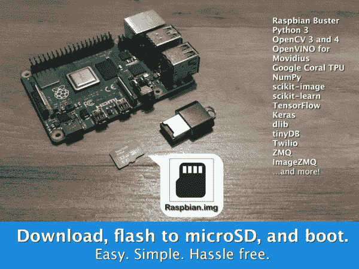
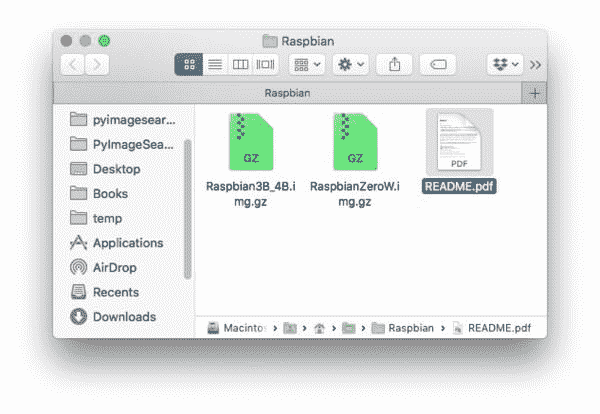
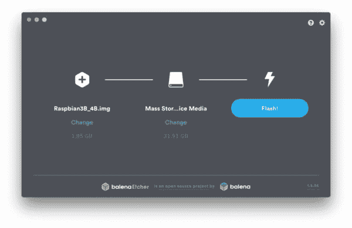
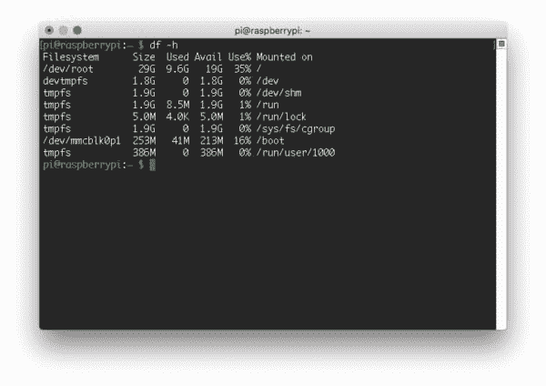
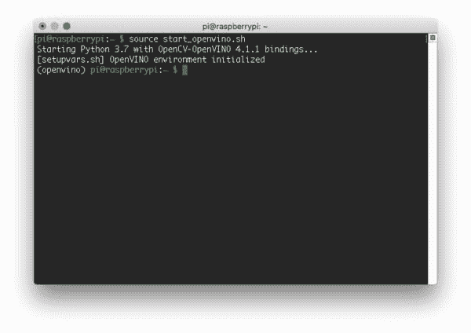
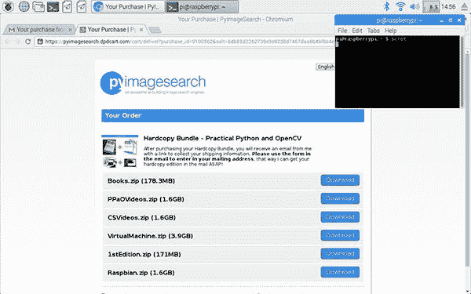
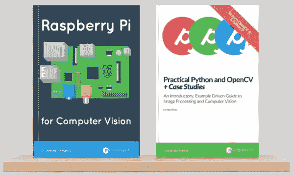

# Raspbian + OpenCV 预配置预安装。

> 原文：<https://pyimagesearch.com/2016/11/21/raspbian-opencv-pre-configured-and-pre-installed/>

[](https://pyimagesearch.com/wp-content/uploads/2016/11/raspbian_img_header.jpg)

***更新:**2019 年 9 月 16 日*

自从我在 2015 年 2 月写了第一篇关于在 Raspberry Pi B+上安装 [OpenCV + Python 的 PyImageSearch 教程](https://pyimagesearch.com/2015/02/23/install-opencv-and-python-on-your-raspberry-pi-2-and-b/)以来，我的*梦想*就是提供一个 ***可下载的、预配置的*** Raspbian。预装 OpenCV 的 img 文件。

**自 2016 年 11 月**(本帖最初发布日期)**这个梦想已经成为现实**。

我很高兴地宣布，我的可下载 Raspbian 附带了以下产品。img 文件 ***预配置预安装:***

*   ***[实用 Python 和 OpenCV](https://pyimagesearch.com/practical-python-opencv/)*** ( *快速入门*和*硬拷贝捆绑)*
*   *[**计算机视觉的树莓**](https://pyimagesearch.com/raspberry-pi-for-computer-vision/) (业余爱好者、黑客、*和*完整捆绑)*

有两个文件包含在内:

*   `Raspbian3B_4B.img.gz`(与 RPi 3B、3B+、4B [1GB、2GB 和 4GB 型号]兼容)
*   `RaspbianZeroW.img.gz`(兼容 Pi Zero W)

你所要做的就是下载。img 文件，使用 BalenaEtcher 将相应的文件闪存到您的 SD 卡中，然后启动您的 Pi。

从那里开始，您将拥有一个*完整的 Python + OpenCV 开发环境*，完全没有配置、编译和安装 OpenCV 的麻烦。

了解更多关于拉斯扁人的信息。img 文件，*继续阅读。*

## Raspbian Buster + OpenCV 4 开箱即用

我回顾了最近在 Raspberry Pi 上安装 OpenCV 的教程，并计算了执行每一步所需的时间。

你知道我发现了什么吗？

即使你确切地知道*你正在做什么*，在你的 Raspberry Pi 上编译和安装 OpenCV 也要花费大量的时间:

*   树莓码头 4B 上超过 **55 分钟**
*   历时 ***2.2 小时*** 编译出树莓派 3B+。
*   历时 **14 个小时**在 Raspberry Pi Zero W 上编译

在过去，我曾经给那些在 Pi 上成功安装 OpenCV 的新手读者发邮件，询问他们完成编译和安装过程需要多长时间。

也许并不奇怪，我发现新手读者在他们的树莓派 3B+上安装 OpenCV 的时间增加了近*4 倍*到超过 ***8.7 小时(零 W)*** 甚至更长。我没有对 Raspberry Pi 4 进行过类似的调查，但我猜测大多数人会花大约 4 个小时来配置他们的 Raspberry Pi 4。

显然，对于许多试图学习 OpenCV 和计算机视觉的 PyImageSearch 读者来说，入门的障碍是将 OpenCV 本身安装在他们的 Raspberry Pi 上。

为了帮助这些读者充分利用他们的树莓派，我决定发布我自己的*个人* Raspbian。预配置和预安装了 OpenCV**T3 的 img 文件。**

**通过捆绑预先配置的 Raspbian。img 连同要么(1) [*实用 Python 和 OpenCV*](https://pyimagesearch.com/practical-python-opencv/) ，和/或(2) [*计算机视觉的树莓派*](https://pyimagesearch.com/raspberry-pi-for-computer-vision/) 我的目标是:**

1.  跳过在您的 Raspberry Pi 上安装 OpenCV + Python 的繁琐过程，开始您的计算机视觉教育。
2.  为你提供一本书，里面有你可能得到的对计算机视觉和图像处理世界的最好的介绍。

当然，我将继续*创建*、*支持*、*为任何使用我提供的关于在 Raspberry Pi 上安装 OpenCV + Python 的[免费教程的 PyImageSearch 读者提供帮助](https://pyimagesearch.com/opencv-tutorials-resources-guides/)*。

同样，这个预先配置的 Raspbian。img 的目标读者是 PyImageSearch 的读者，他们希望 ***节省时间*** 和 ***快速启动他们的计算机视觉教育。***

如果这听起来不像你，不要担心，我完全理解——我仍然会提供免费教程来帮助你在你的 Raspberry Pi 上安装和运行 OpenCV。请记住，我的[客户从我这里获得优先支持](https://pyimagesearch.com/faqs/single-faq/can-i-send-you-emails-or-ask-you-questions/)(当你在那个页面[时，一定要查看我的其他常见问题](https://pyimagesearch.com/faqs))。

## Raspbian Buster + OpenCV 4 预配置预安装

本文档的其余部分描述了如何 ***安装和使用*** 预配置的 Raspbian。img 文件包含在您购买的 *:* 中

*   ***[实用 Python 和 OpenCV](https://pyimagesearch.com/practical-python-opencv/)*** ( *快速入门*和*硬拷贝捆绑)*
*   *[**计算机视觉的树莓**](https://pyimagesearch.com/raspberry-pi-for-computer-vision/) (业余爱好者、黑客、*和*完整捆绑)*

在本指南的末尾，您还可以找到关于 Raspbian + OpenCV 的常见问题的答案。img 文件。如果您有 FAQ 中未涉及的问题，[请给我发消息](https://pyimagesearch.com/contact/)。

### 下载并解压缩归档文件

当您收到购买链接时，一定要下载这本书、代码、视频和 Raspbian。每个文件都是. zip 格式的。`Raspbian.zip`包含预配置的图像和一个`README.txt`文件。

继续使用你最喜欢的解压工具(7zip，Keka 等)解压文件。).没有必要提取包含的。gz 文件，因为我们将直接使用它们。

解压缩`Raspbian.zip`后，你的文件夹应该是这样的:

[](https://pyimagesearch.com/wp-content/uploads/2016/11/raspbian_img_files.jpg)

**Figure 1:** After downloading the Raspbian.zip file, unpack it to obtain the .img.gz file that you’ll flash to your SD card directly with BalenaEtcher.

### 使用 BalenaEtcher 将操作系统映像写入 32GB microSD 卡

这个拉斯扁人。img 在 **32GB microSD 卡**上只能**工作。的。对于 8GB 或 16GB 的卡，img 太大。据我所知，树莓 Pi 不支持 64GB+ microSD 卡。**

 **我*推荐*优质的闪迪 32GB 98MB/s 卡。它们在[亚马逊](https://www.amazon.com/SanDisk-Ultra-microSDXC-Memory-Adapter/dp/B073JWXGNT/ref=sr_1_1?keywords=sandisk+microsd+32gb&qid=1568666896&sr=8-1)和许多在线分销商处都有售。

来编写预先配置的 Raspbian。只需按照官方的 Raspberry Pi 文档进行操作。推荐的工具是 [**BalenaEtcher**](https://www.balena.io/etcher/) (兼容 Mac、Linux、Windows)。

**BalenaEtcher 可以处理压缩文件**比如。gz *(加载到蚀刻机前不需要解压. img . gz)*。

[](https://pyimagesearch.com/wp-content/uploads/2016/11/raspbian_img_balenaetcher.jpg)

**Figure 2:** Flashing your pre-configured Raspbian .img with BalenaEtcher for your Raspberry Pi.

### 第一次启动您的 Pi

写完拉斯扁之后。img 到您的卡，将卡插入您的 Pi 并启动它。

用户名是`pi`，密码是`raspberry`。

在第一次启动时，您的 Raspbian 文件系统需要扩展以适应 SD 卡。

这意味着你必须手动运行`raspi-config => Advanced => Expand Filesystem`。

扩展完成后，您的 Pi 将重新启动，您将能够正常使用它(只有在第一次启动时才需要扩展文件系统)。

下面是自动扩展后我的 Pi 上的磁盘利用率的屏幕截图:

[](https://pyimagesearch.com/wp-content/uploads/2016/11/raspbian_img_df-h.jpg)

**Figure 3:** After booting my Raspberry Pi for the first time your filesystem will be expanded to utilize the entire disk.

请注意，我的整个*32GB 卡是可用的，其中 35%在使用中。*

### 默认 WiFi

默认情况下，您的 Raspberry Pi 将尝试使用密码短语`computervision`连接到名为`pyimagesearch`的网络。

如果你陷入困境，这很有用:

*   也许你刚刚刷新了你的 microSD，你需要快速连接。
*   也许您不在典型的无线网络附近，并且您想要热点化您的电话，以便您的 Pi 和笔记本电脑通过您的电话的无线网络连接。适用于 iPhone 和 Android。
*   也许你忘记了你的键盘/鼠标/HDMI 屏幕，你需要通过 SSH 和 VNC 做所有的事情，但是你现在不能轻易地连接到你的 Pi。参考本教程关于[远程开发和与您的 Raspberry Pi](https://pyimagesearch.com/2019/07/01/remote-development-on-the-raspberry-pi-or-amazon-ec2/) 连接。

我们在野外已经用这种方法联系过很多次了。这很方便，但存在安全风险。虽然我们不建议长期使用这个无线网络，因为这个密码是公开的(在几乎所有的部署应用程序中，您应该从 Pi 中删除 network +密码)，但如果您只是闪存了一个 microSD，这是一个很好的连接方式。我们还建议更改与您的 Raspberry Pi 用户名相关的默认密码。

### 在您的树莓 Pi 上使用 Python 和 OpenCV

为了通过 Python 3 绑定访问 OpenCV 4(和 OpenCV 3 ),我们利用了 Python 虚拟环境。每个 Python 虚拟环境完全相互独立，确保没有依赖性或版本问题。

在本节的剩余部分，我将解释(1)什么是 Python 虚拟环境，以及(2)如何访问 Python 3 + OpenCV 3/4 环境。

#### 什么是 Python 虚拟环境？

最核心的是，Python 虚拟环境允许我们为每个 Python 项目创建*隔离的、独立的*环境。这意味着**每个项目可以有自己的一组** **依赖项**、*而不管另一个项目有哪些*依赖项。

在 OpenCV 的上下文中，这允许我们为 OpenCV 4 拥有一个虚拟环境，然后为 OpenCV 3 拥有另一个虚拟环境。此外，我们可以拥有英特尔 OpenVINO 和谷歌 Coral 虚拟环境。

要详细了解 Python 虚拟环境，请参考本教程。

#### Python 2.7 支持已被否决

2020 年 1 月 1 日，Python.org 将不再更新 Python 2.7(安全更新也是如此)。在这里阅读 [Python 2.7 的日落公告](https://www.python.org/doc/sunset-python-2/)。

**PyImageSearch 官方不再支持 Python 2.7。**所有未来的代码只兼容 Python 3。

#### 上有哪些虚拟环境？imgs？

**树莓派 3B/3B+/4B** 。img 包含以下环境:

*   `py3cv4` : Python 3.7 和 OpenCV 4.1.1
*   `py3cv3` : Python 3.7 和 OpenCV 3.4.7
*   `openvino` : Python 3.7 和 OpenCV 4 . 1 . 1——OpenVINO([OpenVINO](https://software.intel.com/en-us/openvino-toolkit)是英特尔深度学习+硬件优化的工具包)
*   `coral` : Python 3.7 和 OpenCV 4.1.1
*   `gopigo` : Python 3.7 和 OpenCV 4.1.1

**树莓派零瓦特**。img 包含以下环境:

*   `py3cv4` : Python 3.7 和 OpenCV 4.1.1
*   `py3cv3` : Python 3.7 和 OpenCV 3.4.7

#### 访问虚拟环境

有两种方法可以访问 Raspbian .imgs 上的虚拟环境。

**选项 1:** 使用`workon`命令

例如，如果您希望使用 Python 3 + OpenCV 4.1.1 环境，只需使用 workon 命令和环境名:

```py
$ workon py3cv4
(py3cv4) $

```

注意，bash 提示符的前面是括号中的环境名。

***注意:****OpenVINO**环境要求你使用下面的**选项 2** 方法。*

**选项 2:** 使用`source`命令

您也可以对位于您的主目录中的启动脚本使用以下命令:

```py
$ source ~/start_py3cv4.sh
Starting Python 3.7 with OpenCV 4.1.1 bindings...
(py3cv4) $

```

如果您使用 OpenVINO，将通过“开始”脚本自动调用英特尔提供的附加脚本:

```py
$ source ~/start_openvino.sh
Starting Python 3.7 with OpenCV-OpenVINO 4.1.1 bindings...
[setupvars.sh] OpenVINO environment initialized
(py3cv4) $

```

您的终端看起来将与此类似(我从 macOS 进入我的 Raspberry Pi):

[](https://pyimagesearch.com/wp-content/uploads/2016/11/raspbian_img_openvino.jpg)

**Figure 4:** Starting the OpenVINO environment for the Movidius NCS on a Raspberry Pi pre-configured .img.

### 在您的 Raspberry Pi 上执行我的书中的代码

有多种方法可以在你的 Pi 上访问*实用 Python 和 OpenCV* 或*计算机视觉树莓 Pi*的源代码。第一种是使用 Chromium，Raspbian 的内置网络浏览器来下载。zip 存档:



**Figure 5:** Downloading the source code from Practical Python and OpenCV using the Raspberry Pi web browser.

只需下载。直接压缩到您的 Pi。

如果代码当前位于您的笔记本电脑/台式机上，您也可以使用您最喜欢的 SFTP/FTP 客户端，将代码从您的系统传输到您的 Pi:


**Figure 6:** Utilize a SFTP/FTP client to transfer the Practical Python and OpenCV code from your system to the Raspberry Pi.

或者，您可能希望在阅读书籍时，使用内置的文本编辑器在 Pi 上手动编写代码:


**Figure 7:** Using the built-in text editor that ships with the Raspberry Pi to write code.

我建议要么通过网络浏览器下载这本书的源代码，要么使用 SFTP/FTP，因为这也包括书中使用的*数据集*。然而，手动编码是学习的*好方法，我也强烈推荐它！*

想了解更多关于如何用你的树莓 Pi 远程工作的技巧，请务必阅读我在树莓 Pi 博客上的 [***远程开发。***](https://pyimagesearch.com/2019/07/01/remote-development-on-the-raspberry-pi-or-amazon-ec2/)

### 常见问题(FAQ)

在这一节中，我详细介绍了有关树莓派的常见问题的答案。img 文件。

#### 哪些 Raspbian 映像与相应的硬件兼容？

以下是兼容性列表:

*   `Raspbian3B_4B.img.gz`:
    *   Raspberry Pi 4B (1GB、2GB 和 4GB 型号)
    *   树莓派 3B+
    *   树莓派 3B
*   `RaspbianZeroW.img.gz`:
    *   树莓派零度 W

#### 想自己在树莓派上安装 OpenCV + Python 怎么办？

无论如何，我鼓励你这样做。这是一个很好的练习，你会学到很多关于 Linux 环境的知识。我建议你跟随我的 ***[的许多免费教程](https://pyimagesearch.com/opencv-tutorials-resources-guides/)*** 安装 OpenCV + Python 你的树莓派。

同样，这个预先配置的 Raspbian 映像是为那些想要*跳过安装过程*和*快速开始他们的教育*的读者准备的。

#### 手工安装 Python + OpenCV 需要多长时间？

我计算过数据，即使你确切地知道你在做什么，在树莓 Pi 4 上编译和安装 OpenCV 最少需要 **55 分钟**，在树莓 Pi Zero W 上大约需要 **14 个小时**

根据我对成功在树莓 Pi 上安装 OpenCV 的新手读者的调查，如果你以前从未安装过 OpenCV，或者你是不熟悉基于 Linux 的环境的 T2，这个数字会很容易地增加很多倍。

事实上，在 **Raspberry Pi Zero W** 上安装所有东西，包括 2 个环境(OpenCV 的 2 次编译)**大约需要 6 天**(包括通宵编译)。

这真的取决于*你有多重视你的时间*和*你想多快开始学习计算机视觉*。我总是鼓励你使用我的关于在 Raspberry Pi 上安装 OpenCV 的[免费教程，但是如果你想节省自己的时间(和头痛)，那么一定要考虑使用预配置的 Raspbian .img](https://pyimagesearch.com/opencv-tutorials-resources-guides/)

#### Raspbian 图像包含在哪个*实用 Python 和 OpenCV* 包中？

预先配置好的 Raspbian 镜像包含在 *[实用 Python 和 OpenCV](https://pyimagesearch.com/practical-python-opencv/)* 的 ***快速启动包*** 和 ***硬拷贝包*** 中。预配置的 Raspbian 图像是*而不是*包含在基本包中。

#### Raspbian 图像包含在哪个*Raspberry Pi for Computer Vision*包中？

预先配置好的 Raspbian 镜像包含在所有捆绑包中: ***爱好者、黑客、*** 和 ***完整捆绑包。***

#### 安装了你的 Raspbian 发行版之后，我如何访问 Python + OpenCV？

参见上面的*“在您的 Raspberry Pi 上使用 Python 和 OpenCV”*部分。

#### Wolfram 的 Mathematica 包含在你的 Raspbian 发行版中吗？

不，法律不允许我发布安装了 Mathematica 的 Raspbian 的修改版本(这是产品的一部分)。

#### 您是如何减小 Raspbian 图像文件的大小的？

首先，我删除了不需要的软件，如 Wolfram 的 Mathematica 和 LibreOffice。仅删除这两个软件就节省了近 1GB 的空间。

从那里开始，通过将所有位归零并将文件压缩到。gz 格式。

#### **Raspbian 包含哪个操作系统版本？**

最新的。imgs 运行拉斯扁克星。

#### 我有你以前的照片。为什么`workon`命令不起作用？

我以前的。img 在`~/.bashrc`中没有 virtualenvwrapper 设置(它们被放在`~/.profile`)。

因此，您需要(1)将 virtualenvwrapper 设置从`~/.profile`复制到`~/.bashrc`，或者(2)首先通过`source ~/.profile`获取概要文件。

#### 树莓派上安装了哪些 Python 包？

访问任何虚拟环境后(参见*“访问虚拟环境”*)，运行`pip freeze`查看安装的 Python 包的完整列表。

简而言之，我已经包含了 ***所有必要的 Python 包*** 你将需要成功地执行 ***树莓 Pi for Computer Vision*** 和 ***实用 Python 和 OpenCV*** 中的例子，包括 OpenCV、NumPy、SciPy、scikit-learn、scikit-image、mahotas 和*许多其他的*。单击下面的图像将其放大，这样您就可以看到所有的包:

[](https://pyimagesearch.com/wp-content/uploads/2016/11/raspbian_img_pip_freeze.jpg)

**Figure 8:** A listing of the packages installed in each of the environments on the Raspberry Pi Raspbian .img.

#### 在哪里可以了解更多关于 Python 虚拟环境的信息？

我最喜欢的资源和对 Python 虚拟环境的介绍可以在这里找到。我也在[这篇博文](https://pyimagesearch.com/2016/05/02/accessing-rpi-gpio-and-gpio-zero-with-opencv-python/)的前半部分讨论了它们。

#### 哪里可以购买到*实用 Python 和 OpenCV 的副本？*

要购买您的*实用 Python 和 OpenCV* 、[副本，只需点击这里](https://pyimagesearch.com/practical-python-opencv/)，选择您的包(我推荐*快速入门包*或*硬拷贝包*，然后结账。

#### 哪里可以买到一份用于计算机视觉的 *Raspberry Pi？*

要购买您的计算机视觉、[版*树莓派，只需点击这里*](https://pyimagesearch.com/raspberry-pi-for-computer-vision/)，选择您的捆绑包(如果您真的想掌握树莓派，我推荐*黑客捆绑包*或*完整捆绑包*，然后结账。

#### 我可以购买。img 作为独立产品？

的。img 文件旨在作为额外的好处伴随我的书。我建议购买一本书来访问. img。

#### 我还有一个问题。

如果您有本常见问题解答中未列出的问题，[请给我发消息](https://pyimagesearch.com/contact/)。

## 听起来不错吧？

[](https://pyimagesearch.com/faqs/single-faq/what-books-and-courses-do-you-offer-2/)

**Figure 9:** Purchase (1) [*Raspberry Pi for Computer Vision*](https://pyimagesearch.com/raspberry-pi-for-computer-vision/), or (2) [*Practical Python and OpenCV + Case Studies*](https://pyimagesearch.com/practical-python-opencv/) to get ahold of the pre-configured Raspbian .img files!

如果你准备好把。要在你所有的树莓上使用，只需购买我的一本书。

要购买您的计算机视觉、*、[、**版*树莓派，只需点击此处***、](https://pyimagesearch.com/raspberry-pi-for-computer-vision/)。*所有包都带有预配置的 Raspbian。img 文件。

或者购买你的*实用 Python 和 OpenCV* 、*、**、[的副本只需使用这个链接](https://pyimagesearch.com/practical-python-opencv/)、**、*。你会发现预先配置的 Raspbian。在*快速启动包*和*硬拷贝包*中的 img 文件(*基本包*不包括 Raspbian。img)。

要查看我提供的所有产品， *[点击这里](https://pyimagesearch.com/faqs/single-faq/what-books-and-courses-do-you-offer-2/)* 。**