# 使用 Python 和 OpenMV 读取条形码

> 原文：<https://pyimagesearch.com/2018/03/19/reading-barcodes-with-python-and-openmv/>

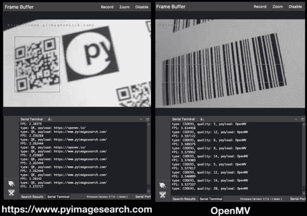

如果我说有一个摄像头:

*   是低成本的 **$65** 。
*   运行 **MicroPython** 。
*   并且可以像 Arduino/RPi 一样用**护盾**扩展。

相约 [OpenMV](https://openmv.io/) ！

2015 年 1 月，在视频搜索大师 Kickstarter 活动期间，我遇到了 OpenMV 的创始人夸贝纳·阿杰曼。那时，Kwabena 和 OpenMV 团队正在运行他们自己的的 [Kickstarter。Kwabena 的 Kickstarter 筹集的资金*比我多得多*，这确实证明了(OpenMV 产品的价值和(2)嵌入式社区对使用这样一个工具的渴望。](https://www.kickstarter.com/projects/botthoughts/openmv-cam-embedded-machine-vision)

自从 OpenMV Kickstarter 以来，OpenMV 团队一直致力于**为从事**嵌入式计算机视觉项目的开发人员和工程师提供低成本、Python 就绪且易于使用的相机系统**。**

鉴于 OpenMV 到目前为止的成功，有一个活跃的开发者社区也就不足为奇了。你肯定会得到项目成功所需的支持。当我开始为这篇文章构建条形码扫描系统时，他们的用户和论坛的响应速度给我留下了难以置信的印象。

在今天的博客文章中，将向您介绍 OpenMV，他们的花哨 IDE，我们甚至将**构建您自己的条形码扫描系统。**

**要开始使用 OpenMV cam 和计算机视觉条形码解码，*请继续阅读。***

## 使用 Python 和 OpenMV 读取条形码

[](https://pyimagesearch.com/wp-content/uploads/2018/03/openmv-barcode-py-barcode.jpg)

**Figure 1:** The OpenMV can read QR codes among many types of codes — all with built in libraries!

在今天的世界里，没有办法绕过条形码。

你收到的每一件杂货或亚马逊包裹都有它们。每次登机或租车时，都会用到条形码。但愿不会，在急诊时，医院腕带上的条形码可能会与你的身份相关联！

但是为什么呢？

简而言之，条形码是计算机将物品与数据库相关联的一种简单方式。因此，正确解码条形码非常重要，这样才能更新数据库。

典型的条形码阅读器使用光电管来“看到”代码。查看克里斯伍德福德关于 *[条形码和条形码扫描仪](http://www.explainthatstuff.com/barcodescanners.html)* 的这篇文章。

鉴于当今时代相机的重要性，我们实际上可以使用图像处理来检测和解码条形码。

在 PyImageSearch 的上一篇文章中，我演示了如何用 Python 和 OpenCV 检测条形码。

探测是拼图的一部分。

另一部分是将条形码解码成有用的字符串。

遗憾的是，OpenCV 不包含内置的条形码检测+读取功能…

…但是有一些流行的条形码检测库，其中之一是 [ZBar](http://zbar.sourceforge.net/) 。Satya Mallick， [PyImageConf 2018](https://www.pyimageconf.com/) 主持人，上个月在他的博客上写了一篇关于 ZBar [的精彩文章。](https://www.learnopencv.com/barcode-and-qr-code-scanner-using-zbar-and-opencv/)

使用 ZBar 和其他类似的条形码读取库是完成这项任务的一种方法。

另一个选择是使用嵌入式工具和库，如 OpenMV。

事实上，OpenMV 让*检测和读取条形码变得如此简单*,以至于您可以:

*   构建您自己的条形码扫描设备
*   在装配线上创建自动化零件检测系统
*   在业余爱好项目中利用 OpenMV 来帮助您扫描和组织工作间中的组件和外围设备
*   使用 OpenMV 向初中或高中学生讲授嵌入式编程

### OpenMV 摄像头

[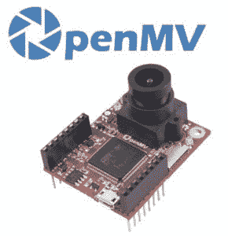](https://pyimagesearch.com/wp-content/uploads/2018/03/openmv_cam_and_logo.jpg)

**Figure 2:** The OpenMV camera is a powerful embedded camera board that runs MicroPython.

OpenMV cam 的目标是成为 ***“机器视觉的 Arduino”***，它是嵌入式的(没有操作系统)，并且可以通过几个可用的屏蔽进行扩展(就像一个 [Arduino](https://www.arduino.cc/) )。

它使用起来也非常简单——你可以用 [MicroPython](https://micropython.org/) 编写代码(不像 Arduino)。

Python 用户和本博客的读者在用 MicroPython 为 OpenMV 构建嵌入式计算机视觉项目时会有宾至如归的感觉。

OpenMV 摄像机非常强大，非常适合带有伺服电机的小型机器人项目，甚至是自动化零件检测装配线。

您可以通过 SPI、I2C、WiFi 和 USB 等通信协议轻松地将 OpenMV 与其他硬件、传感器、微控制器和 SBC 进行接口。

如果 OpenMV 只有一两个任务要执行，它通常会工作得最好，因为它的内存有限 (31KB 分配给脚本)。如果你需要录制静止图像或视频，你可以插入一个 microSD。

OpenMV 的图像处理能力包括:

*   瀑布式头发
*   阈值处理
*   斑点检测
*   画直线、圆和矩形
*   录制 gif 和 MJPEGs
*   阅读条形码(这篇文章)
*   模板匹配
*   *…还有更多！*

如需完整列表，请务必[查看文档](http://docs.openmv.io/library/index.html#libraries-specific-to-the-openmv-cam)。

你的应用需要特殊的镜头吗？一个不同点是**标准 M12 镜头支架**。现在，您可以为您的项目安装望远镜变焦镜头或鱼眼镜头。我真的希望树莓 Pi PiCamera 像 OpenMV 一样有一个镜头支架。

### 使用 OpenMV 和 Python 进行条形码检测和解码

一旦你安装了 OpenMV IDE，启动它。我们将在 **OpenMV IDE** 中完成所有的编码。

让我们首先创建一个名为`openmv_barcode.py`的文件:

```py
# import necessary packages
import sensor
import time
import image

# import the lcd optionally
# to use the LCD, uncomment Lines 9, 24, 33, and 100
# and comment Lines 19 and 20 
#import lcd

```

在第 2-4 行上，我们导入我们需要的 MicroPython/OpenMV 包。

可选地，在**线 9** 上，您可以导入`lcd`包，如果您想要使用 LCD 屏蔽，则需要该包。

接下来，让我们设置摄像头传感器:

```py
# reset the camera
sensor.reset()

# sensor settings
sensor.set_pixformat(sensor.GRAYSCALE)

# non LCD settings
# comment the following lines if you are using the LCD
sensor.set_framesize(sensor.VGA)
sensor.set_windowing((640, 240))

# LCD settings
# uncomment this line to use the LCD with valid resolution
#sensor.set_framesize(sensor.QQVGA2)

# additional sensor settings
sensor.skip_frames(2000)
sensor.set_auto_gain(False)
sensor.set_auto_whitebal(False)

```

第 12-29 行上的设置是不言自明的，所以请阅读代码和注释。

我想指出的是，LCD 需要适合屏幕的分辨率。

***注:**我试了又试，想弄清楚如何使用全分辨率，然后制作一个适合 LCD 的缩放图像，但就是做不到。因此，如果您选择使用 LCD，您将尝试以较低的分辨率解码条形码(这对于传统的 1D 条形码来说不是最佳选择)。不用说，LCD 仍然是一个很好的调试工具，我想把它包括进来，这样你就可以看到它非常容易使用。一如既往，如果你能够解决这个问题，那么我鼓励你在帖子下面给我留下评论，与我和社区分享。*

我还想指出**27 号线**。在“hello world”示例中，您将看到一个关键字参数`time=2000`到`sensor.skip_frames`。在这个上下文中不支持关键字参数，所以一定要使用在**第 27 行**显示的语法(特别是如果你正在处理“hello world”)。

接下来，让我们执行初始化:

```py
# initialize the LCD
# uncomment if you are using the LCD
#lcd.init()

# initialize the clock
clock = time.clock()

```

如果你正在使用 LCD，你需要取消对第 33 行的注释(参见前面的代码块)。

**第 36 行**为 FPS 计算初始化我们的时钟

在这里，我们将创建(1)一个查找表和(2)一个用于确定条形码类型的便利函数:

```py
# barcode type lookup table
barcode_type = {
	image.EAN2: "EAN2",
	image.EAN5: "EAN5",
	image.EAN8: "EAN8",
	image.UPCE: "UPCE",
	image.ISBN10: "ISBN10",
	image.EAN13: "EAN13",
	image.ISBN13: "ISBN13",
	image.I25: "I25",
	image.DATABAR: "DATABAR",
	image.DATABAR_EXP: "DATABAR_EXP",
	image.CODABAR: "CODABAR",
	image.CODE39: "CODE39",
	image.PDF417: "PDF417",
	image.CODE93: "CODE93",
	image.CODE128: "CODE128"
}

def barcode_name(code):
	# if the code type is in the dictionary, return the value string
	if code.type() in barcode_type.keys():
		return barcode_type[code.type()]

	# otherwise return a "not defined" string
	return "NOT DEFINED"

```

正如你在**第 39 行**看到的，我在那里定义了一个`barcode_type`字典，OpenMV 可以检测和解码相当多不同的条形码样式。

话虽如此，我并没有幸运地找到所有的条形码，所以这篇博文的 ***【下载】*** 部分包含的 PDF 并没有包括所有类型的条形码。

**第 57-63 行**定义了一个获取条形码类型的便利函数，没有抛出 Python key 异常的风险(OpenMV 不能很好地处理异常)。

从那里，让我们进入正题，开始捕捉和处理帧！我们将从开始一个`while`循环开始:

```py
# loop over frames and detect + decode barcodes
while True:
	# tick the clock for our FPS counter
	clock.tick()

	# grab a frame
	img = sensor.snapshot()

```

第一步是为我们的 FPS 计数器滴答时钟(**行 68** )。

从那里你应该用`sensor.snapshot` ( **线 71** )抓取一个画面。

现在，让乐趣开始吧！

我们已经有了一个图像，让我们看看我们能做些什么:

```py
	# loop over standard barcodes that are detected in the image
	for code in img.find_barcodes():
		# draw a rectangle around the barcode
		img.draw_rectangle(code.rect(), color=127)

		# print information in the IDE terminal
		print("type: {}, quality: {}, payload: {}".format(
			barcode_name(code),
			code.quality(),
			code.payload()))

		# draw the barcode string on the screen similar to cv2.putText
		img.draw_string(10, 10, code.payload(), color=127)

```

这里我们找到了标准的非二维码。我们需要做的就是调用`img.find_barcodes`(它封装了所有的条形码检测+读取功能)并循环结果(**第 74 行**)。

给定检测到的条形码，我们可以:

*   在检测到的条形码周围画一个边框矩形(**行 76** )。
*   打印类型、质量和有效载荷(**第 79-82 行**)。
*   在屏幕上画出字符串(**行 85** )。不幸的是(根据[文档](http://docs.openmv.io/library/omv.image.html?highlight=draw_string#image.image.draw_string))目前没有办法用更大的字体来绘制字符串。

真的就是这么回事！

QR 码解码以类似的方式完成:

```py
	# loop over QR codes that are detected in the image
	for code in img.find_qrcodes():
		# draw a rectangle around the barcode
		img.draw_rectangle(code.rect(), color=127)

		# print information in the IDE terminal
		print("type: QR, payload: {}".format(code.payload()))

		# draw the barcode string on the screen similar to cv2.putText
		img.draw_string(10, 10, code.payload(), color=127)

	# display the image on the LCD
	# uncomment if you are using the LCD
	#lcd.display(img)

	# print the frames per second for debugging
	print("FPS: {}".format(clock.fps()))

```

此循环模拟标准条形码循环，因此请务必查看详细信息。

在循环之外，如果你正在使用 LCD，你将想要在它上面显示( **Line 100** )。

最后，我们可以很容易地在终端的第 103 行上打印 FPS(每秒帧数)。

### OpenMV 条形码解码结果。

[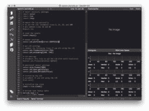](https://pyimagesearch.com/wp-content/uploads/2018/03/openmv-ide.jpg)

**Figure 3:** The OpenMV team has put together an awesome **IDE for computer vision development**. This is what you see when you first open the IDE and load a program.

首先，通过 USB 将您的 OpenMV cam 连接到您的计算机。

然后启动 IDE，如**图 3** 所示。

在那里，单击左下角的连接按钮。

IDE 可能会提示您更新固件(我通过单击按钮并等待大约 3-5 分钟就顺利完成了)。

当您准备好在编辑器中载入您的节目时，点按左下方的绿色播放/节目按钮。此按钮将使用您的代码设置 OpenMV。

耐心点。MicroPython 代码编译成机器代码并在处理器上刷新大约需要 45-90 秒。*没有状态指示器，所以你只需要耐心。*

不久，如果你正在打印到终端，你会看到数据，如 FPS 或条形码信息-这是你的队列，一切都在工作。你还可以在右上角的取景器中看到相机传感器的实时画面。

现在让我们来试试条形码！

在 ***“下载”*** 部分，我包含了一个 PDF 格式的条形码，供您打印和扫描。这是我们正在研究的东西:

[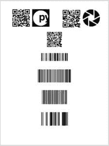](https://pyimagesearch.com/wp-content/uploads/2018/03/openmv-barcodes-pdf-screenshot.jpg)

**Figure 4:** Sample barcodes for testing with the OpenMV camera. Included are QR, CODE128, CODE93, CODE39, and DATABAR barcode images. You may print a PDF from the “Downloads” section of this blog post.

您可以从 IDE 的内置终端看到结果:

```py
FPS: 2.793296
type: QR, payload: https://pyimagesearch.com/
FPS: 2.816901
type: QR, payload: https://openmv.io/
FPS: 2.941176
type: QR, payload: http://pyimg.co/dl4cv
FPS: 3.831418
type: CODE128, quality: 48, payload: guru
FPS: 4.484305
ype: CODE93, quality: 15, payload: OpenMV
FPS: 3.849856
type: CODE39, quality: 68, payload: DL4CV
FPS: 3.820961
type: DATABAR, quality: 83, payload: 0100000000020183
FPS: 4.191617

```

每个代码和终端的屏幕截图如下:

[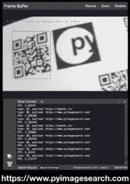](https://pyimagesearch.com/wp-content/uploads/2018/03/openmv_bc1_crop.jpg)

**Figure 5:** Scanning a **QR** code with a link to the PyImageSearch homepage.

[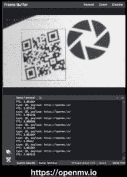](https://pyimagesearch.com/wp-content/uploads/2018/03/openmv_bc2_crop.jpg)

**Figure 6:** Scanning a **QR** code that contains a payload of “https://openmv.io” — the OpenMV homepage.

[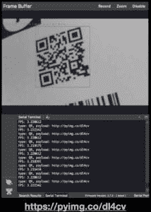](https://pyimagesearch.com/wp-content/uploads/2018/03/openmv_bc3_crop.jpg)

**Figure 7:** This **QR** code contains a payload directing you to the [*Deep Learning for Computer Vision with Python* book](https://pyimagesearch.com/2017/09/23/getting-started-deep-learning-computer-vision-python/) information page.

[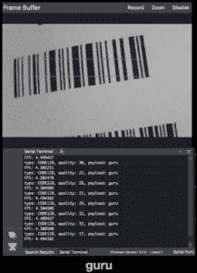](https://pyimagesearch.com/wp-content/uploads/2018/03/openmv_bc4_crop.jpg)

**Figure 8:** A **CODE128** barcode that says “guru” is decoded by the OpenMV.

[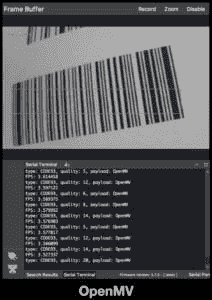](https://pyimagesearch.com/wp-content/uploads/2018/03/openmv_bc5_crop.jpg)

**Figure 9:** The OpenMV can decode **CODE93** barcodes such as this one that has a payload of “OpenMV”.

[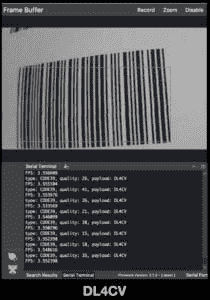](https://pyimagesearch.com/wp-content/uploads/2018/03/openmv_bc6_crop.jpg)

**Figure 10:** **CODE39** barcodes are easy with the OpenMV. The Payload here is “DL4CV”.

[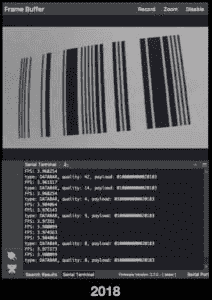](https://pyimagesearch.com/wp-content/uploads/2018/03/openmv_bc7_crop.jpg)

**Figure 11:** The OpenMV can decode **DATABAR** codes which are fixed-width and only contain digits. I coded “2018” into this barcode, but as you can see, the OpenMV camera actually reads 16 characters.

最后，这里有一张 IDE 运行的图片。请注意它是如何读取多个代码的，在条形码周围画出方框，还包含一个漂亮的颜色直方图。

[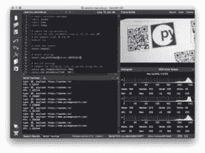](https://pyimagesearch.com/wp-content/uploads/2018/03/openmv-live.jpg)

**Figure 12:** The OpenMV in action detecting barcodes and printing results to the IDE. As you can see, there’s a terminal in the bottom left which is scrolling data. There’s also a live view of the camera feed in the top right of the IDE and color histograms in the bottom right.

下面是使用 IDE 运行系统的视频:

<https://www.youtube.com/embed/s6Jh7eJ1k7g?feature=oembed>