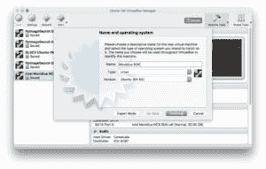
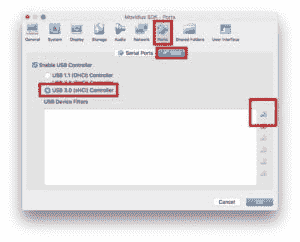
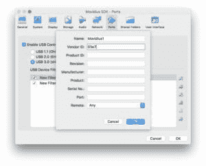
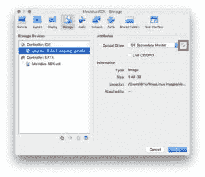
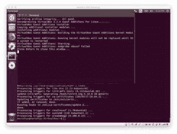
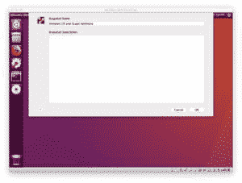
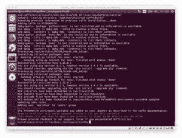
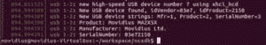

# 基于 Movidius NCS 的树莓派实时目标检测

> 原文：<https://pyimagesearch.com/2018/02/19/real-time-object-detection-on-the-raspberry-pi-with-the-movidius-ncs/>


今天的帖子是受丹妮尔的启发，丹妮尔是一位 PyImageSearch 的读者，她上周给我发了一封电子邮件，问我:

> 嗨阿德里安，
> 
> 我很喜欢你的博客，我尤其喜欢上周关于英特尔 Movidius NCS 的[图像分类的帖子。](https://pyimagesearch.com/2018/02/12/getting-started-with-the-intel-movidius-neural-compute-stick/)
> 
> 我仍在考虑为个人项目购买一台英特尔 Movidius NCS。
> 
> 我的项目包括使用 Raspberry Pi 进行对象检测，在这里我使用了自己定制的 Caffe 模型。您提供的用于在 Pi 的 CPU 上应用对象检测的[基准脚本](https://pyimagesearch.com/2017/10/16/raspberry-pi-deep-learning-object-detection-with-opencv/)太慢了，我需要更快的速度。
> 
> NCS 对我的项目来说是个好选择吗？它能帮助我实现更高的 FPS 吗？

问得好，丹妮尔。谢谢你的关心。

简短的回答是肯定的，你可以使用 Movidius NCS 和你自己定制的 Caffe 模型进行物体检测。如果您正在处理直播或录制的视频，您甚至可以获得高帧速率。

但是有一个条件。

我告诉 Danielle，她需要在她的(Ubuntu 16.04)机器上安装成熟的 Movidius SDK。我还提到从 Caffe 模型生成图形文件并不总是简单明了的。

在今天的帖子中，你将学习如何:

*   在您的机器上安装 Movidius SDK
*   使用 SDK 生成对象检测图形文件
*   为 Raspberry Pi + NCS 编写一个实时对象检测脚本

看完这篇文章后，你会对 Movidius NCS 有一个很好的了解，并且知道它是否适合你的 Raspberry Pi +对象检测项目。

**要开始在 Raspberry Pi 上进行实时物体检测，*继续阅读。***

***弃用声明:*** *本文使用 Movidius SDK 和 APIv1/APIv2，API v1/API v2 现已被 Intel 的 OpenVINO 软件取代，用于使用 Movidius NCS。[在这篇 PyImageSearch 文章](https://pyimagesearch.com/2019/04/08/openvino-opencv-and-movidius-ncs-on-the-raspberry-pi/)中了解更多关于 OpenVINO 的信息。*

## 树莓派上的实时目标检测

今天的博文分为五个部分。

首先，我们将安装 Movidius SDK，然后学习如何使用 SDK 来生成 Movidius 图形文件。

在此基础上，我们将编写一个脚本，使用英特尔 Movidius Neural compute stick 进行实时对象检测，该计算棒可用于 Pi(或稍加修改的替代单板计算机)。

接下来，我们将测试脚本并比较结果。

在之前的帖子中，我们学习了如何使用 CPU 和 OpenCV DNN 模块在 Raspberry Pi 上执行[实时视频对象检测。我们实现了大约 0.9 FPS，这是我们的基准比较。今天，我们将看看与 Pi 配对的 NCS 如何与使用相同模型的 Pi CPU 进行比较。](https://pyimagesearch.com/2017/10/16/raspberry-pi-deep-learning-object-detection-with-opencv/)

最后，我收集了一些常见问题(FAQ)。请经常参考这一部分——我希望随着我收到的评论和电子邮件的增多，这一部分会越来越多。

### 安装英特尔 Movidius SDK

[](https://pyimagesearch.com/wp-content/uploads/2018/02/ncs-workflow.png)

**Figure 1:** The Intel Movidius NCS workflow (image credit: [Intel](https://qconsf.com/sf2017/system/files/presentation-slides/qconf_presentation.pdf))

***弃用声明:*** *本文使用 Movidius SDK 和 APIv1/APIv2，API v1/API v2 现已被 Intel 的 OpenVINO 软件取代，用于使用 Movidius NCS。[在这篇 PyImageSearch 文章](https://pyimagesearch.com/2019/04/08/openvino-opencv-and-movidius-ncs-on-the-raspberry-pi/)中了解更多关于 OpenVINO 的信息。*

上周，我回顾了 Movidius 的工作流程。该工作流程有四个基本步骤:

1.  使用全尺寸机器训练模型
2.  使用 SDK 和 NCS 将模型转换成可部署的图形文件
3.  编写一个 Python 脚本来部署图形文件并处理结果
4.  将 Python 脚本和图形文件部署到配有英特尔 Movidius NCS 的单板计算机上

在本节中，我们将学习如何安装 SDK，其中包括 TensorFlow、Caffe、OpenCV 和英特尔的 Movidius 工具套件。

要求:

*   **独立的**机器或虚拟机。我们会在上面安装 **Ubuntu 16.04 LTS**
*   根据下载速度和机器性能，需要 30-60 分钟
*   NCS USB stick 移动器

我强调了*“单机”*，因为这台机器*仅*用于 Movidius 开发非常重要。

换句话说，**不要在“日常开发和生产力使用”的机器**上安装 SDK，那里可能已经安装了 Python 虚拟环境和 OpenCV。安装过程并不是完全孤立的，它可能会改变系统中现有的库。

然而，还有一种选择:

使用 VirtualBox 虚拟机(或其他虚拟化系统)并在虚拟机中运行独立的 Ubuntu 16.04 操作系统。

VM 的优点是你可以把它安装在日常使用的机器上，并且仍然保持 SDK 的独立性。缺点是你不能通过虚拟机访问 GPU。

Danielle 想要使用 Mac，而 VirtualBox 在 Mac 上运行良好，所以让我们沿着这条路走下去。请注意，您也可以在 Windows 或 Linux 主机上运行 VirtualBox，这可能会更容易。

在我们开始之前，我想提醒大家注意我们将要进行的非标准虚拟机设置。我们将配置 USB 设置，这将允许 Movidius NCS 保持正常连接。

据我从论坛上看，这些是 Mac 专用的 VM USB 设置(但我不确定)。请在评论区分享你的经历。

#### 下载 Ubuntu 和 Virtualbox

让我们开始吧。

首先，下载 Ubuntu 16.04 64 位。iso 图片来自这里[LTS 官方 Ubuntu 16.04.3 下载](http://releases.ubuntu.com/16.04/)页面。你可以抓住。iso 直接或种子也将适合更快的下载。

在 Ubuntu 下载的时候，如果你没有 Oracle VirtualBox，就抓取适合你操作系统的安装程序(我运行的是 macOS)。你可以[在这里](https://www.virtualbox.org/wiki/Downloads)下载 VirtualBox。

**非虚拟机用户:**如果你不打算在虚拟机上安装 SDK，那么你可以跳过下载/安装 Virtualbox。相反，向下滚动到“安装操作系统”,但忽略关于虚拟机和虚拟光驱的信息——您可能会使用 USB 拇指驱动器进行安装。

当你下载了 VirtualBox，而 Ubuntu。iso 继续下载，可以安装 VirtualBox。通过向导安装非常容易。

从那里，因为我们将使用 USB 直通，我们需要扩展包。

#### 安装扩展包

让我们导航回 [VirtualBox 下载页面](https://www.virtualbox.org/wiki/Downloads)并下载 Oracle VM 扩展包(如果您还没有的话)。

扩展包的版本必须与您正在使用的 Virtualbox 的版本相匹配。如果您有任何正在运行的虚拟机，您会想要关闭它们以便安装扩展包。安装扩展包轻而易举。

#### 创建虚拟机

一旦下载了 Ubuntu 16.04 映像，启动 VirtualBox，并创建一个新的虚拟机:

[](https://pyimagesearch.com/wp-content/uploads/2018/02/pi_ncs_objectdetection_create_vm.jpg)

**Figure 2:** Creating a VM for the Intel Movidius SDK.

为您的虚拟机提供合理的设置:

*   我暂时选择了 2048MB 的内存。
*   我选择了 2 个虚拟 CPU。
*   我设置了一个 40Gb 的动态分配 VDI (Virtualbox 磁盘映像)。

前两个设置很容易在以后更改，以获得主机和来宾操作系统的最佳性能。

至于第三个设置，为操作系统和 SDK 提供足够的空间是很重要的。如果空间不足，您可以随时“连接”另一个虚拟磁盘并装载它，或者您可以扩展操作系统磁盘(仅限高级用户)。

#### USB 直通设置

根据定义，虚拟机实际上是作为软件运行的。本质上，这意味着它没有访问硬件的权限，除非您特别授予它权限。这包括相机、USB、磁盘等。

这是我必须在英特尔表单上做一些挖掘的地方，以确保 Movidius 可以与 MacOS 一起工作(因为最初它在我的设置上不工作)。

Ramana @ Intel 在论坛上提供了关于如何设置 USB [的“非官方”指导。您的里程可能会有所不同。](https://ncsforum.movidius.com/discussion/140/mac-os-x#latest)

为了让虚拟机访问 USB NCS，我们需要更改设置。

转到虚拟机的*“设置”*，编辑*“端口”>“USB”，以反映一个“USB 3.0 (xHCI)控制器”*。

您需要为 Movidius 设置 USB2 和 USB3 设备过滤器，以无缝保持连接。

为此，点击*“添加新 USB 过滤器”*图标，如图所示:

[](https://pyimagesearch.com/wp-content/uploads/2018/02/pi_ncs_objectdetection_vm_usbfilter.jpg)

**Figure 3:** Adding a USB Filter in VirtualBox settings to accommodate the Intel Movidius NCS on MacOS.

在那里，您需要创建两个 USB 设备过滤器。大多数字段可以留空。我只是给了每个人一个名字，并提供了供应商 ID。

1.  **名称:** *Movidius1* ，**厂商 ID:** *03e7* ，**其他字段:** *空白*
2.  **名称:** *Movidius2* ，**厂商 ID:** *040e* ，**其他字段:** *空白*

下面是第一个例子:

[](https://pyimagesearch.com/wp-content/uploads/2018/02/pi_ncs_objectdetection_vm_usbfilterdetails.jpg)

**Figure 4:** Two Virtualbox USB device filters are required for the Movidius NCS to work in a VM on MacOS.

请务必保存这些设置。

#### 安装操作系统

要安装操作系统，请“插入”。iso 镜像到虚拟光驱中。为此，请转到*“设置”*，然后在*“存储”*下选择*“控制器:IDE >空”*，并点击磁盘图标(用红框标出)。然后找到并选择你新下载的 Ubuntu .iso。

[](https://pyimagesearch.com/wp-content/uploads/2018/02/pi_ncs_objectdetection_vm_insertdisk.jpg)

**Figure 5:** Inserting an Ubuntu 16.04 .iso file into a Virtualbox VM.

验证所有设置，然后启动您的机器。

按照提示进入*“安装 Ubuntu”*。如果您的互联网连接速度很快，您可以选择“安装 Ubuntu 时下载更新”。我*没有*选择*“安装第三方软件……”*选项。

下一步是*“擦除磁盘并安装 Ubuntu”*—这是一个安全的操作，因为我们刚刚创建了空的 VDI 磁盘。在那里，设置系统名称和用户名+密码。

一旦指示您重新启动并移除虚拟光盘，您就差不多准备好了。

首先，让我们更新我们的系统。打开终端并键入以下内容来更新您的系统:

```py
$ sudo apt-get update && sudo apt-get upgrade

```

#### 安装来宾附件

**非虚拟机用户:**您应该跳过这一部分。

从这里开始，因为我们将使用 USB 设备(Intel NCS)，所以让我们安装来宾附件。Guest additions 还支持虚拟机和主机之间的双向复制/粘贴，以及其他不错的共享工具。

可以通过转到虚拟箱的设备菜单并点击*“插入来宾附件 CD 映像……”*来安装来宾附件:

[](https://pyimagesearch.com/wp-content/uploads/2018/02/pi_ncs_objectdetection_vm_guestadditions.jpg)

**Figure 6:** Virtualbox Guest Additions for Ubuntu has successfully been installed.

按照提示按*“返回关闭此窗口……”*完成安装。

#### 拍快照

**非虚拟机用户:**您可以跳过这一部分，或者通过您喜欢的方法备份您的*台式机/笔记本电脑*。

从那里开始，我喜欢**重启**，然后**拍摄我的虚拟机的“快照”**。

重启很重要，因为我们刚刚更新并安装了很多软件，希望确保更改生效。

此外，如果我们在安装过程中出现任何错误或问题，快照将允许我们进行回滚——正如我们将发现的那样，在安装过程中会遇到一些问题，可能会让您被 Movidius SDK 绊倒，因此这是一个值得的步骤。

一定要花时间给你的系统拍快照。进入 VirtualBox 菜单栏，按下*“机器>拍摄快照”*。

您可以为快照命名，如*“已安装的操作系统和来宾添加项”*，如下所示:

[](https://pyimagesearch.com/wp-content/uploads/2018/02/pi_ncs_objectdetection_vm_snapshot.jpg)

**Figure 7:** Taking a snapshot of the Movidius SDK VM prior to actually installing the SDK.

#### 在 Ubuntu 上安装英特尔 Movidius SDK

本节假设你(a)按照上面的说明在虚拟机上安装了 Ubuntu 16.04 LTS，或者(b)正在台式机/笔记本电脑上使用全新安装的 Ubuntu 16.04 LTS *。*

英特尔使安装 SDK 的过程变得非常简单。为此干杯！

但是就像我上面说的，我希望有一种先进的方法。我喜欢简单，但我也喜欢控制我的电脑。

让我们从终端安装 Git:

```py
$ sudo apt-get install git

```

从那里开始，让我们非常紧密地遵循英特尔的指示，这样就不会有任何问题。

打开一个终端并跟随:

```py
$ cd ~
$ mkdir workspace
$ cd workspace

```

现在我们在工作区中，让我们克隆出 **NCSDK** 和 **NC App Zoo** :

```py
$ git clone https://github.com/movidius/ncsdk.git
$ git clone https://github.com/movidius/ncappzoo.git

```

从那里，您应该导航到`ncsdk`目录并安装 SDK:

```py
$ cd ~/workspace/ncsdk
$ make install

```

你可能想出去呼吸点新鲜空气，或者给自己拿杯咖啡(或者啤酒，看时间了)。这个过程大约需要 15 分钟，取决于您的主机性能和下载速度。

[](https://pyimagesearch.com/wp-content/uploads/2018/02/pi_ncs_objectdetection_vm_movidius_sdk_installed.jpg)

**Figure 8:** The Movidius SDK has been successfully installed on our Ubuntu 16.04 VM.

**虚拟机用户:**现在安装已经完成，这是**拍摄另一个快照**的好时机，这样我们可以在将来需要时恢复。你可以按照上面同样的方法再拍一张快照(我把我的命名为*“SDK installed”*)。请记住，快照要求主机上有足够的磁盘空间。

#### 将 NCS 连接到 USB 端口并验证连通性

*此步骤应在您的台式机/笔记本电脑上执行。*

**非虚拟机用户:**您可以跳过这一步，因为您可能不会遇到任何 USB 问题。相反，插入 NCS 并滚动到*“测试 SDK”*。

首先，将您的 NCS 连接到笔记本电脑或台式机上的物理 USB 端口。

***注:**鉴于我的 Mac 有雷电 3 / USB-C 端口，我最初插上了苹果的 USB-C 数字 AV 多端口适配器，它有一个 USB-A 和 HDMI 端口。这不管用。相反，我选择使用一个简单的适配器，而不是 USB 集线器。基本上，如果您正在使用 VM，您应该尝试消除对任何额外的必需驱动程序的需求。*

然后，我们需要让虚拟机可以访问 u 盘。因为我们已经安装了**访客插件**和**扩展包**，所以我们可以从 VirtualBox 菜单中完成这项工作。在虚拟机菜单栏中，点击*“设备>USB>' m ovidius ltd . m ovidius ma 2x5x '”*(或一个类似名称的设备)。*movid us 旁边可能已经有一个复选标记，表示它已连接到虚拟机。*

在虚拟机中打开一个终端。您可以运行以下命令来验证操作系统是否知道 USB 设备:

```py
$ dmesg

```

您应该看到，通过读取最近的 3 或 4 条日志消息，可以识别出 Movidius，如下所示:

[](https://pyimagesearch.com/wp-content/uploads/2018/02/pi_ncs_objectdetection_vm_usb_dmesg.jpg)

**Figure 9:** Running the `dmesg` command in a terminal allows us to see that the Movidius NCS is associated with the OS.

如果您看到了 Movidius 设备，那么是时候测试安装了。

#### 测试 SDK

*此步骤应在您的台式机/笔记本电脑上执行。*

既然已经安装了 SDK，您可以通过运行预构建的示例来测试安装:

```py
$ cd ~/workspace/ncsdk
$ make examples

```

这可能需要大约五分钟的时间来运行，您将会看到大量的输出(上面的块中没有显示)。

如果您在所有示例运行时没有看到错误消息，这是好消息。您会注意到 Makefile 已经执行了代码，从 Github 下载模型和权重，并从那里运行 mvNCCompile。我们将在下一节学习 mvNCCompile。我对 Movidius 团队在 Makefiles 中所做的努力印象深刻。

另一项检查(这与我们上周对 Pi [进行的检查相同)：](https://pyimagesearch.com/2018/02/12/getting-started-with-the-intel-movidius-neural-compute-stick/)

```py
$ cd ~/workspace/ncsdk/examples/apps
$ make all
$ cd hello_ncs_py
$ python hello_ncs.py
Hello NCS! Device opened normally.
Goodbye NCS! Device closed normally.
NCS device working.

```

该测试确保到 API 的链接和到 NCS 的连接正常工作。

如果你没有遇到太多麻烦就走到了这一步，那么恭喜你！

### 从您自己的 Caffe 模型生成 Movidius 图形文件

***弃用声明:*** *本文使用 Movidius SDK 和 APIv1/APIv2，API v1/API v2 现已被 Intel 的 OpenVINO 软件取代，用于使用 Movidius NCS。[在这篇 PyImageSearch 文章](https://pyimagesearch.com/2019/04/08/openvino-opencv-and-movidius-ncs-on-the-raspberry-pi/)中了解更多关于 OpenVINO 的信息。*

*此步骤应在您的台式机/笔记本电脑上执行。*

借助英特尔的 SDK，生成图形文件变得非常容易。在某些情况下，您实际上可以使用 Pi 来计算图形。其他时候，你需要一台内存更大的机器来完成任务。

我想和你分享一个主要工具:`mvNCCompile`。

这个命令行工具同时支持 TensorFlow 和 Caffe。我希望 Keras 将来能得到英特尔的支持。

对于 Caffe，命令行参数采用以下格式(TensorFlow 用户应参考类似的[文档](https://movidius.github.io/ncsdk/tools/compile.html)):

```py
$ mvNCCompile network.prototxt -w network.caffemodel \
	-s MaxNumberOfShaves -in InputNodeName -on OutputNodeName \
	-is InputWidth InputHeight -o OutputGraphFilename

```

让我们回顾一下论点:

*   `network.prototxt`:网络文件的路径/文件名
*   `-w network.caffemodel`:caffe model 文件的路径/文件名
*   `-s MaxNumberOfShaves` : SHAVEs (1、2、4、8 或 12)用于网络层(我想默认是 12，但是文档不清楚)
*   `-in InputNodeNodeName`:您可以选择指定一个特定的输入层(它将匹配 prototxt 文件中的名称)
*   `-on OutputNodeName`:默认情况下，网络通过输出张量进行处理，该选项允许用户选择网络中的替代端点
*   `-is InputWidth InputHeight`:输入形状非常重要，应该与您的网络设计相匹配
*   `-o OutputGraphFilename`:如果没有指定文件/路径，默认为当前工作目录中非常模糊的文件名`graph`

批量参数在哪里？

NCS 的批次大小始终为 1，颜色通道的数量假定为 3。

如果您以正确的格式向`mvNCCompile`提供命令行参数，并插入 NCS，那么您将很快拥有一个图形文件。

有一点需要注意(至少从我目前使用 Caffe 文件的经验来看)。`mvNCCompile`工具要求 prototxt 采用特定的格式。

**你可能需要修改你的 prototxt** 来让`mvNCCompile`工具工作。如果你有困难， [Movidius 论坛](https://ncsforum.movidius.com/)也许可以指导你。

今天，我们将使用经过 Caffe 培训的 MobileNet 单次检测器(SSD)。GitHub 用户 [chuanqui305](https://github.com/chuanqi305/MobileNet-SSD) 因在 MS-COCO 数据集上训练模型而获得积分。谢谢川 qui305！

我已经在 ***【下载】*** 部分提供了川奎 305 的文件。要编译图形，您应该执行以下命令:

```py
$ mvNCCompile models/MobileNetSSD_deploy.prototxt \
	-w models/MobileNetSSD_deploy.caffemodel \
	-s 12 -is 300 300 -o graphs/mobilenetgraph
mvNCCompile v02.00, Copyright @ Movidius Ltd 2016

/usr/local/bin/ncsdk/Controllers/FileIO.py:52: UserWarning: You are using a large type. Consider reducing your data sizes for best performance
  "Consider reducing your data sizes for best performance\033[0m")

```

你应该期待版权信息和可能的附加信息，或者像我上面遇到的警告。我毫不费力地忽略了警告。

### 使用英特尔 Movidius 神经计算棒进行物体检测

***弃用声明:*** *本文使用 Movidius SDK 和 APIv1/APIv2，API v1/API v2 现已被 Intel 的 OpenVINO 软件取代，用于使用 Movidius NCS。[在这篇 PyImageSearch 文章](https://pyimagesearch.com/2019/04/08/openvino-opencv-and-movidius-ncs-on-the-raspberry-pi/)中了解更多关于 OpenVINO 的信息。*

可以在您的台式机/笔记本电脑或您的 Pi 上编写此代码，但是您应该在下一节中在您的 Pi 上运行它。

让我们写一个实时对象检测脚本。该脚本与我们在[上一篇文章](https://pyimagesearch.com/2017/10/16/raspberry-pi-deep-learning-object-detection-with-opencv/)中构建的非 NCS 版本非常接近。

你可以在这篇博文的 ***【下载】*** 部分找到今天的脚本和相关文件。如果您想继续学习，我建议您下载源代码和模型文件。

下载完文件后，打开`ncs_realtime_objectdetection.py`:

```py
# import the necessary packages
from mvnc import mvncapi as mvnc
from imutils.video import VideoStream
from imutils.video import FPS
import argparse
import numpy as np
import time
import cv2

```

我们在第 2-8 行的**中导入我们的包，注意到`mvncapi`，它是 Movidius NCS Python API 包。**

从这里开始，我们将执行初始化:

```py
# initialize the list of class labels our network was trained to
# detect, then generate a set of bounding box colors for each class
CLASSES = ["background", "aeroplane", "bicycle", "bird",
	"boat", "bottle", "bus", "car", "cat", "chair", "cow",
	"diningtable", "dog", "horse", "motorbike", "person",
	"pottedplant", "sheep", "sofa", "train", "tvmonitor"]
COLORS = np.random.uniform(0, 255, size=(len(CLASSES), 3))

# frame dimensions should be sqaure
PREPROCESS_DIMS = (300, 300)
DISPLAY_DIMS = (900, 900)

# calculate the multiplier needed to scale the bounding boxes
DISP_MULTIPLIER = DISPLAY_DIMS[0] // PREPROCESS_DIMS[0]

```

我们的类标签和相关的随机颜色(每个类标签一种随机颜色)在第 12-16 行初始化。

我们的 MobileNet SSD 需要 300×300 的尺寸，但我们将以 900×900 显示视频流，以便更好地显示输出(**第 19 行和第 20** )。

因为我们正在改变图像的尺寸，我们需要计算标量值来缩放我们的对象检测框( **Line 23** )。

从这里我们将定义一个`preprocess_image`函数:

```py
def preprocess_image(input_image):
	# preprocess the image
	preprocessed = cv2.resize(input_image, PREPROCESS_DIMS)
	preprocessed = preprocessed - 127.5
	preprocessed = preprocessed * 0.007843
	preprocessed = preprocessed.astype(np.float16)

	# return the image to the calling function
	return preprocessed

```

该预处理功能中的操作是特定于我们的 MobileNet SSD 模型的。我们调整大小，执行均值减法，缩放图像，并将其转换为`float16`格式(**第 27-30 行**)。

然后我们将`preprocessed`图像返回给调用函数(**第 33 行**)。

要了解更多关于深度学习的预处理，一定要参考我的书， *[用 Python 进行计算机视觉的深度学习](https://pyimagesearch.com/deep-learning-computer-vision-python-book/)* 。

从这里我们将定义一个`predict`函数:

```py
def predict(image, graph):
	# preprocess the image
	image = preprocess_image(image)

	# send the image to the NCS and run a forward pass to grab the
	# network predictions
	graph.LoadTensor(image, None)
	(output, _) = graph.GetResult()

	# grab the number of valid object predictions from the output,
	# then initialize the list of predictions
	num_valid_boxes = output[0]
	predictions = []

```

这个`predict`功能适用于 Movidius NC 的用户，它主要基于 [Movidius NC 应用程序 Zoo GitHub 示例](https://github.com/movidius/ncappzoo/tree/master/caffe/SSD_MobileNet)——我做了一些小的修改。

该函数需要一个`image`和一个`graph`对象(我们将在后面实例化)。

首先我们预处理图像(**第 37 行**)。

从那里，我们利用 NCS 向前通过神经网络，同时获取预测(**行 41 和 42** )。

然后我们提取有效对象预测的数量(`num_valid_boxes`)并初始化我们的`predictions`列表(**第 46 和 47 行**)。

从这里开始，让我们遍历有效的结果:

```py
	# loop over results
	for box_index in range(num_valid_boxes):
		# calculate the base index into our array so we can extract
		# bounding box information
		base_index = 7 + box_index * 7

		# boxes with non-finite (inf, nan, etc) numbers must be ignored
		if (not np.isfinite(output[base_index]) or
			not np.isfinite(output[base_index + 1]) or
			not np.isfinite(output[base_index + 2]) or
			not np.isfinite(output[base_index + 3]) or
			not np.isfinite(output[base_index + 4]) or
			not np.isfinite(output[base_index + 5]) or
			not np.isfinite(output[base_index + 6])):
			continue

		# extract the image width and height and clip the boxes to the
		# image size in case network returns boxes outside of the image
		# boundaries
		(h, w) = image.shape[:2]
		x1 = max(0, int(output[base_index + 3] * w))
		y1 = max(0, int(output[base_index + 4] * h))
		x2 = min(w,	int(output[base_index + 5] * w))
		y2 = min(h,	int(output[base_index + 6] * h))

		# grab the prediction class label, confidence (i.e., probability),
		# and bounding box (x, y)-coordinates
		pred_class = int(output[base_index + 1])
		pred_conf = output[base_index + 2]
		pred_boxpts = ((x1, y1), (x2, y2))

		# create prediciton tuple and append the prediction to the
		# predictions list
		prediction = (pred_class, pred_conf, pred_boxpts)
		predictions.append(prediction)

	# return the list of predictions to the calling function
	return predictions

```

好吧，上面的代码可能看起来很丑。让我们后退一步。这个循环的目标是以一种有组织的方式将预测数据附加到我们的`predictions`列表中，以便我们以后使用它。这个循环只是为我们提取和组织数据。

但是`base_index`究竟是什么？

基本上，我们所有的数据都存储在一个长数组/列表中(`output`)。使用`box_index`，我们计算我们的`base_index`，然后我们将使用它(用更多的偏移量)来提取预测数据。

我猜写 Python API/绑定的人是 C/C++程序员。我可能选择了一种不同的方式来组织数据，比如我们将要构建的元组列表。

为什么我们要确保第 55-62 行上的值是有限的？

这确保了我们拥有有效的数据。如果无效，我们`continue`回到循环的顶部(**第 63 行**)并尝试另一个预测。

`output`列表的格式是什么？

输出列表具有以下格式:

0.  `output[0]`:我们在**第 46 行**提取这个值为`num_valid_boxes`
1.  `output[base_index + 1]`:预测类索引
2.  `output[base_index + 2]`:预测置信度
3.  `output[base_index + 3]`:对象框点 x1 值(需要缩放)
4.  `output[base_index + 4]`:对象框点 y1 值(需要缩放)
5.  `output[base_index + 5]`:对象框点 x2 值(需要缩放)
6.  `output[base_index + 6]`:对象框点 y2 值(需要缩放)

**第 68-82 行**处理构建单个预测元组。预测由`(pred_class, pred_conf, pred_boxpts)`组成，我们将`prediction`添加到**列表的第 83 行**上。

在我们循环完数据后，我们将`predictions`列表`return`给**行 86** 上的调用函数。

从那里，让我们解析我们的命令行参数:

```py
# construct the argument parser and parse the arguments
ap = argparse.ArgumentParser()
ap.add_argument("-g", "--graph", required=True,
	help="path to input graph file")
ap.add_argument("-c", "--confidence", default=.5,
	help="confidence threshold")
ap.add_argument("-d", "--display", type=int, default=0,
	help="switch to display image on screen")
args = vars(ap.parse_args())

```

我们在第 89-96 行解析我们的三个命令行参数。

我们需要图形文件的路径。可选地，我们可以指定一个不同的置信度阈值或将图像显示到屏幕上。

接下来，我们将连接到 NCS 并将图形文件加载到它上面:

```py
# grab a list of all NCS devices plugged in to USB
print("[INFO] finding NCS devices...")
devices = mvnc.EnumerateDevices()

# if no devices found, exit the script
if len(devices) == 0:
	print("[INFO] No devices found. Please plug in a NCS")
	quit()

# use the first device since this is a simple test script
# (you'll want to modify this is using multiple NCS devices)
print("[INFO] found {} devices. device0 will be used. "
	"opening device0...".format(len(devices)))
device = mvnc.Device(devices[0])
device.OpenDevice()

# open the CNN graph file
print("[INFO] loading the graph file into RPi memory...")
with open(args["graph"], mode="rb") as f:
	graph_in_memory = f.read()

# load the graph into the NCS
print("[INFO] allocating the graph on the NCS...")
graph = device.AllocateGraph(graph_in_memory)

```

上面这个块和上周的[是一样的，我就不详细回顾了。本质上，我们检查是否有可用的 NCS，连接并加载图形文件。](https://pyimagesearch.com/2018/02/12/getting-started-with-the-intel-movidius-neural-compute-stick/)

结果是我们在上面的预测函数中使用的一个`graph`对象。

让我们开始我们的视频流:

```py
# open a pointer to the video stream thread and allow the buffer to
# start to fill, then start the FPS counter
print("[INFO] starting the video stream and FPS counter...")
vs = VideoStream(usePiCamera=True).start()
time.sleep(1)
fps = FPS().start()

```

我们启动相机`VideoStream`，让我们的相机预热，并实例化我们的 FPS 计数器。

现在让我们一帧一帧地处理摄像机画面:

```py
# loop over frames from the video file stream
while True:
	try:
		# grab the frame from the threaded video stream
		# make a copy of the frame and resize it for display/video purposes
		frame = vs.read()
		image_for_result = frame.copy()
		image_for_result = cv2.resize(image_for_result, DISPLAY_DIMS)

		# use the NCS to acquire predictions
		predictions = predict(frame, graph)

```

在这里，我们从视频流中读取一帧，制作一个副本(这样我们以后可以在上面画画)，并调整它的大小(**第 135-137 行**)。

然后，我们将该帧通过我们的对象检测器发送，该检测器将返回`predictions`给我们。

接下来让我们循环一遍`predictions`:

```py
		# loop over our predictions
		for (i, pred) in enumerate(predictions):
			# extract prediction data for readability
			(pred_class, pred_conf, pred_boxpts) = pred

			# filter out weak detections by ensuring the `confidence`
			# is greater than the minimum confidence
			if pred_conf > args["confidence"]:
				# print prediction to terminal
				print("[INFO] Prediction #{}: class={}, confidence={}, "
					"boxpoints={}".format(i, CLASSES[pred_class], pred_conf,
					pred_boxpts))

```

在`predictions`上循环，我们首先提取对象的类、置信度和盒点(**行 145** )。

如果`confidence`高于阈值，我们将预测打印到终端，并检查我们是否应该在屏幕上显示图像:

```py
				# check if we should show the prediction data
				# on the frame
				if args["display"] > 0:
					# build a label consisting of the predicted class and
					# associated probability
					label = "{}: {:.2f}%".format(CLASSES[pred_class],
						pred_conf * 100)

					# extract information from the prediction boxpoints
					(ptA, ptB) = (pred_boxpts[0], pred_boxpts[1])
					ptA = (ptA[0] * DISP_MULTIPLIER, ptA[1] * DISP_MULTIPLIER)
					ptB = (ptB[0] * DISP_MULTIPLIER, ptB[1] * DISP_MULTIPLIER)
					(startX, startY) = (ptA[0], ptA[1])
					y = startY - 15 if startY - 15 > 15 else startY + 15

					# display the rectangle and label text
					cv2.rectangle(image_for_result, ptA, ptB,
						COLORS[pred_class], 2)
					cv2.putText(image_for_result, label, (startX, y),
						cv2.FONT_HERSHEY_SIMPLEX, 1, COLORS[pred_class], 3)

```

如果我们正在显示图像，我们首先构建一个`label`字符串，它将包含百分比形式的类名和置信度(**第 160-161 行**)。

从那里我们提取矩形的角，并计算出`label`相对于这些点的位置(**第 164-168 行**)。

最后，我们在屏幕上显示矩形和文本标签。如果框架中有多个相同类别的对象，则框和标签将具有相同的颜色。

从那里，让我们显示图像并更新我们的 FPS 计数器:

```py
		# check if we should display the frame on the screen
		# with prediction data (you can achieve faster FPS if you
		# do not output to the screen)
		if args["display"] > 0:
			# display the frame to the screen
			cv2.imshow("Output", image_for_result)
			key = cv2.waitKey(1) & 0xFF

			# if the `q` key was pressed, break from the loop
			if key == ord("q"):
				break

		# update the FPS counter
		fps.update()

	# if "ctrl+c" is pressed in the terminal, break from the loop
	except KeyboardInterrupt:
		break

	# if there's a problem reading a frame, break gracefully
	except AttributeError:
		break

```

在预测循环之外，我们再次检查是否应该在屏幕上显示该帧。如果是，我们显示该帧(**行 181** )并等待“q”键被按下，如果用户想要退出(**行 182-186** )。

我们在第 189 行更新我们的每秒帧数计数器。

从那里，我们很可能会继续逐帧循环的顶部，再次完成这个过程。

如果用户碰巧在终端中按下了“ctrl+c ”,或者在读取一个帧时出现了问题，我们就会跳出这个循环。

```py
# stop the FPS counter timer
fps.stop()

# destroy all windows if we are displaying them
if args["display"] > 0:
	cv2.destroyAllWindows()

# stop the video stream
vs.stop()

# clean up the graph and device
graph.DeallocateGraph()
device.CloseDevice()

# display FPS information
print("[INFO] elapsed time: {:.2f}".format(fps.elapsed()))
print("[INFO] approx. FPS: {:.2f}".format(fps.fps()))

```

这最后一个代码块处理一些内务处理(**行 200-211** )，最后将经过的时间和每秒帧数的流水线信息打印到屏幕上。这些信息允许我们对我们的脚本进行基准测试。

### Movidius NCS 对象检测结果

*这一步应该在您连接了 HDMI 线缆+屏幕的 Raspberry Pi + NCS 上执行。你还需要一个键盘和鼠标，正如我在图 2 中的[之前的教程中所描述的，你可能需要一根加密狗延长线来为 USB 键盘/鼠标腾出空间。也可以在台式机/笔记本电脑上运行这个步骤，但是速度可能会比使用 CPU 慢。](https://pyimagesearch.com/2018/02/12/getting-started-with-the-intel-movidius-neural-compute-stick/)*

让我们使用以下命令在 NCS 上运行我们的实时对象检测器:

```py
$ python ncs_realtime_objectdetection.py --graph graph --display 1

```

预测结果将打印在终端上，图像将显示在我们的 Raspberry Pi 监视器上。

下面我提供了一个用智能手机拍摄视频，然后在 Raspberry Pi 上进行后期处理的 GIF 动画示例:


以及完整的视频剪辑示例:

<https://www.youtube.com/embed/AfNZviiJYaA?feature=oembed>