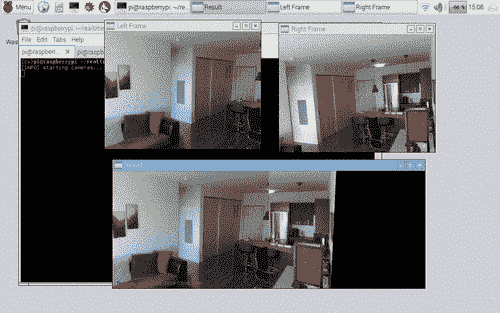
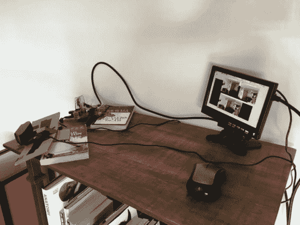
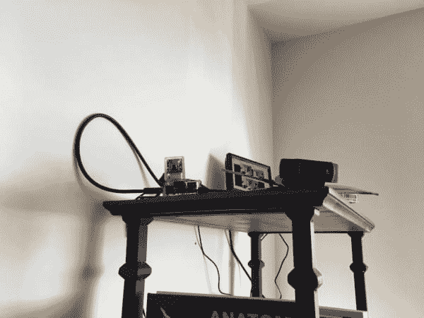

# 用 OpenCV 实现实时全景和图像拼接

> 原文：<https://pyimagesearch.com/2016/01/25/real-time-panorama-and-image-stitching-with-opencv/>

[](https://pyimagesearch.com/wp-content/uploads/2016/01/realtime_panorama_stitching_animation.gif)

运行 PyImageSearch 博客我最喜欢的部分之一是能够*将以前的博客文章*和*链接在一起，创建一个特定问题的解决方案* — ***在这种情况下，使用 Python 和 OpenCV 进行实时全景和图像拼接。***

在过去的一个半月里，我们已经学会了如何[提高内置/USB 网络摄像头](https://pyimagesearch.com/2015/12/21/increasing-webcam-fps-with-python-and-opencv/)和 [Raspberry Pi 摄像头模块](https://pyimagesearch.com/2015/12/28/increasing-raspberry-pi-fps-with-python-and-opencv/)的 FPS 处理速率。我们还学习了如何[将对**USB 网络摄像头和 Raspberry Pi 摄像头的访问统一到一个*单个类***](https://pyimagesearch.com/2016/01/04/unifying-picamera-and-cv2-videocapture-into-a-single-class-with-opencv/) **，使得 PyImageSearch 博客上的所有视频处理和示例能够在 USB 和 Pi 摄像头设置上运行，而无需修改一行代码。**

 **就在几周前，我们讨论了如何使用关键点检测、局部不变描述符、关键点匹配和单应矩阵估计来[构建全景并将图像拼接在一起](https://pyimagesearch.com/2016/01/11/opencv-panorama-stitching/)。

今天我们将链接过去 1.5 个月的帖子，并使用 Python 和 OpenCV 使用它们来执行 **[实时全景和图像拼接](https://pyimagesearch.com/2016/01/11/opencv-panorama-stitching/)** 。我们的解决方案将能够运行在笔记本电脑/台式机系统上，以及树莓派。

**此外，我们还将应用上周的[帖子中的*基本运动检测*实现对全景图像进行运动检测。](https://pyimagesearch.com/2016/01/18/multiple-cameras-with-the-raspberry-pi-and-opencv/)**

这种解决方案尤其适用于您想要测量大范围运动，但又不想在相机视野中出现“盲点”的情况。

继续阅读以了解更多信息…

## 用 OpenCV 实现实时全景和图像拼接

正如我在这篇文章的介绍中提到的，我们将把我们在之前 1.5 个月的 PyImageSearch 文章中学到的概念联系起来:

1.  使用我们改进的 FPS 处理速率 Python 类来访问我们的内置/USB 网络摄像头和/或 Raspberry Pi 摄像头模块。
2.  一次访问*多个*摄像机流。
3.  对这些视频流中的帧应用图像拼接和全景构建。
4.  在全景图像中执行运动检测。

同样，在*全景图像*与*两个独立的帧*中执行运动检测的好处是，我们的视野中不会有任何“盲点”。

### 硬件设置

对于这个项目，我将使用我的 Raspberry Pi 2，虽然你当然可以使用你的笔记本电脑或台式机系统。我只是选择了 Pi 2，因为它的外形小巧，易于在空间有限的地方操作。

我还将使用我的[罗技 C920 网络摄像头](http://www.amazon.com/gp/product/B006JH8T3S/ref=as_li_tl?ie=UTF8&camp=1789&creative=390957&creativeASIN=B006JH8T3S&linkCode=as2&tag=trndingcom-20&linkId=BWJJLCCXZCBM465P)(即插即用，与树莓派兼容)以及[树莓派相机模块](http://www.amazon.com/gp/product/B00E1GGE40/ref=as_li_tl?ie=UTF8&camp=1789&creative=390957&creativeASIN=B00E1GGE40&linkCode=as2&tag=trndingcom-20&linkId=XF5KMO3TGBUENU5T)。同样，如果你决定使用笔记本电脑/台式机系统，你可以简单地将多个网络摄像头连接到你的机器上——本文中讨论的相同概念仍然适用。

下面你可以看到我的设置:

[](https://pyimagesearch.com/wp-content/uploads/2016/01/realtime_panorama_setup_02.jpg)

**Figure 1:** My the Raspberry Pi 2 + USB webcam + Pi camera module setup.

这是另一个角度来看这个装置:

[](https://pyimagesearch.com/wp-content/uploads/2016/01/realtime_panorama_setup_03.jpg)

**Figure 2:** Placing my setup on top of a bookcase so it has a good viewing angle of my apartment.

这个装置正对着我的前门、厨房和走廊，让我可以看到我公寓里发生的一切:

[](https://pyimagesearch.com/wp-content/uploads/2016/01/realtime_panorama_setup_01.jpg)

**Figure 3:** Getting ready for real-time panorama construction.

目标是从我的两个视频流中获取帧，将它们拼接在一起，然后在全景图像中执行运动检测。

构建一个全景图，而不是[使用多个摄像机并在每个流中独立执行运动检测](https://pyimagesearch.com/2016/01/18/multiple-cameras-with-the-raspberry-pi-and-opencv/)确保了我的视野中没有任何“盲点”。

### 项目结构

在我们开始之前，让我们看一下我们的项目结构:

```py
|--- pyimagesearch
|    |---- __init__.py
|    |--- basicmotiondetector.py
|    |--- panorama.py
|--- realtime_stitching.py

```

如您所见，我们已经为组织目的定义了一个`pyimagesearch`模块。然后我们有了上周关于[的帖子中的`basicmotiondetector.py`实现，用 Python 和 OpenCV](https://pyimagesearch.com/2016/01/18/multiple-cameras-with-the-raspberry-pi-and-opencv/) 访问多个摄像机。这个类根本没有改变，所以我们*不会在这篇文章中回顾它的实现。要彻底复习基本的运动检测器，请务必阅读上周的文章。*

然后我们有了我们的`panorama.py`文件，它定义了用于将图像拼接在一起的`Stitcher`类。我们最初在 [OpenCV 全景拼接教程](https://pyimagesearch.com/2016/01/11/opencv-panorama-stitching/)中使用这个类。

然而，正如我们将在本文后面看到的，我对构造函数和`stitch`方法做了*轻微的*修改，以促进实时全景图的构建——我们将在本文后面了解更多关于这些轻微修改的内容。

最后，`realtime_stitching.py`文件是我们的主要 Python 驱动程序脚本，它将访问多个视频流(当然是以高效、线程化的方式)，将帧拼接在一起，然后对全景图像执行运动检测。

### 更新图像拼接器

为了(1)创建实时图像拼接器和(2)在全景图像上执行运动检测，我们将假设两个摄像机都是*固定的*和*非移动的*，如上面的**图 1** 所示。

为什么固定不动的假设如此重要？

好吧，记得回到我们关于[全景和图像拼接](https://pyimagesearch.com/2016/01/11/opencv-panorama-stitching/)的课程。

执行关键点检测、局部不变量描述、关键点匹配和单应性估计是一项*计算量很大的*任务。如果我们使用我们以前的实现，我们将不得不对每组帧的*执行拼接，这使得它几乎不可能实时运行(特别是对于资源受限的硬件，如 Raspberry Pi)。*

然而，如果我们假设摄像机是固定的， ***我们只需要执行一次单应矩阵估计！***

在初始单应性估计之后，我们可以使用相同的矩阵来变换和扭曲图像，以构建最终的全景图——这样做使我们能够跳过关键点检测、局部不变特征提取和每组帧中的关键点匹配这些计算量大的步骤。

下面我提供了对`Sticher`类的相关更新，以便于缓存单应矩阵:

```py
# import the necessary packages
import numpy as np
import imutils
import cv2

class Stitcher:
	def __init__(self):
		# determine if we are using OpenCV v3.X and initialize the
		# cached homography matrix
		self.isv3 = imutils.is_cv3()
		self.cachedH = None

```

这里唯一增加的是在第 11 行的**上，我定义了`cachedH`，缓存的单应矩阵。**

我们还需要更新`stitch`方法，以便在计算完单应矩阵后缓存它:

```py
	def stitch(self, images, ratio=0.75, reprojThresh=4.0):
		# unpack the images
		(imageB, imageA) = images

		# if the cached homography matrix is None, then we need to
		# apply keypoint matching to construct it
		if self.cachedH is None:
			# detect keypoints and extract
			(kpsA, featuresA) = self.detectAndDescribe(imageA)
			(kpsB, featuresB) = self.detectAndDescribe(imageB)

			# match features between the two images
			M = self.matchKeypoints(kpsA, kpsB,
				featuresA, featuresB, ratio, reprojThresh)

			# if the match is None, then there aren't enough matched
			# keypoints to create a panorama
			if M is None:
				return None

			# cache the homography matrix
			self.cachedH = M[1]

		# apply a perspective transform to stitch the images together
		# using the cached homography matrix
		result = cv2.warpPerspective(imageA, self.cachedH,
			(imageA.shape[1] + imageB.shape[1], imageA.shape[0]))
		result[0:imageB.shape[0], 0:imageB.shape[1]] = imageB

		# return the stitched image
		return result

```

在第**行第 19** 处，我们检查单应矩阵之前是否已经计算过。如果不是，我们检测关键点并从两幅图像中提取局部不变描述符，然后应用关键点匹配。然后我们在第 34 行的**缓存单应矩阵。**

对`stitch`的后续调用将使用这个缓存的矩阵，允许我们避开检测关键点、提取特征以及对每一组帧的*执行关键点匹配。*

关于`panorama.py`的其余源代码，请参见[图像拼接教程](https://pyimagesearch.com/2016/01/11/opencv-panorama-stitching/)或使用本文底部的表格下载源代码。

### 执行实时全景拼接

既然我们的`Stitcher`类已经更新，让我们继续到`realtime_stitching.py`驱动程序脚本:

```py
# import the necessary packages
from __future__ import print_function
from pyimagesearch.basicmotiondetector import BasicMotionDetector
from pyimagesearch.panorama import Stitcher
from imutils.video import VideoStream
import numpy as np
import datetime
import imutils
import time
import cv2

# initialize the video streams and allow them to warmup
print("[INFO] starting cameras...")
leftStream = VideoStream(src=0).start()
rightStream = VideoStream(usePiCamera=True).start()
time.sleep(2.0)

```

我们从导入所需的 Python 包开始。`BasicMotionDetector`和`Stitcher`类是从`pyimagesearch`模块导入的。我们还需要 [imutils](https://github.com/jrosebr1/imutils) 包中的`VideoStream`类。

如果您的系统上还没有安装`imutils`，您可以使用以下命令安装它:

```py
$ pip install imutils

```

如果您已经安装了它，请确保您已经升级到了最新版本(该版本为`video`子模块添加了 Python 3 支持):

```py
$ pip install --upgrade imutils

```

**第 14 行和第 15 行**然后初始化我们的两个`VideoStream`类。这里我假设`leftStream`是 USB 摄像头，`rightStream`是树莓 Pi 摄像头(用`usePiCamera=True`表示)。

如果您想使用*两个 USB 摄像头*，您只需将流初始化更新为:

```py
leftStream = VideoStream(src=0).start()
rightStream = VideoStream(src=1).start()

```

`src`参数控制系统上摄像机的*指数*。

还是那句话，正确初始化`leftStream`和`rightStream`是**命令式 T7。当*站在*相机后面时，`leftStream`应该是你左手边的相机，`rightStream`应该是你右手边的相机。**

**未能正确设置这些流变量将导致“全景图”只包含两个帧中的*一个*。**

现在，让我们初始化图像拼接器和运动检测器:

```py
# initialize the image stitcher, motion detector, and total
# number of frames read
stitcher = Stitcher()
motion = BasicMotionDetector(minArea=500)
total = 0

```

现在我们进入驱动程序脚本的主循环，在这里我们无限循环遍历帧，直到被指示退出程序:

```py
# loop over frames from the video streams
while True:
	# grab the frames from their respective video streams
	left = leftStream.read()
	right = rightStream.read()

	# resize the frames
	left = imutils.resize(left, width=400)
	right = imutils.resize(right, width=400)

	# stitch the frames together to form the panorama
	# IMPORTANT: you might have to change this line of code
	# depending on how your cameras are oriented; frames
	# should be supplied in left-to-right order
	result = stitcher.stitch([left, right])

	# no homograpy could be computed
	if result is None:
		print("[INFO] homography could not be computed")
		break

	# convert the panorama to grayscale, blur it slightly, update
	# the motion detector
	gray = cv2.cvtColor(result, cv2.COLOR_BGR2GRAY)
	gray = cv2.GaussianBlur(gray, (21, 21), 0)
	locs = motion.update(gray)

```

**第 27 行和第 28 行**从各自的视频流中读取`left`和`right`帧。然后，我们调整帧的大小，使其宽度为 400 像素，然后将它们拼接在一起，形成全景图。记住，提供给`stitch`方法的帧需要按照*从左到右的顺序提供！*

在图像不能被拼接的情况下(即，不能计算单应矩阵)，我们从循环中脱离(**行 41-43** )。

假设全景图可以被构建，那么我们通过将其转换为灰度并稍微模糊化来处理它(**行 47 和 48** )。然后，处理后的全景图像被传送到运动检测器中(**线 49** )。

然而，在我们能够检测任何运动之前，我们首先需要允许运动检测器“运行”一段时间，以获得背景模型的精确运行平均值:

```py
	# only process the panorama for motion if a nice average has
	# been built up
	if total > 32 and len(locs) > 0:
		# initialize the minimum and maximum (x, y)-coordinates,
		# respectively
		(minX, minY) = (np.inf, np.inf)
		(maxX, maxY) = (-np.inf, -np.inf)

		# loop over the locations of motion and accumulate the
		# minimum and maximum locations of the bounding boxes
		for l in locs:
			(x, y, w, h) = cv2.boundingRect(l)
			(minX, maxX) = (min(minX, x), max(maxX, x + w))
			(minY, maxY) = (min(minY, y), max(maxY, y + h))

		# draw the bounding box
		cv2.rectangle(result, (minX, minY), (maxX, maxY),
			(0, 0, 255), 3)

```

我们使用初始视频流的前 32 帧作为背景的估计——在这 32 帧*期间，不应该发生*运动。

否则，假设我们已经处理了用于背景模型初始化的 32 个初始帧，我们可以检查`locs`的`len`以查看它是否大于零。如果是，那么我们可以假设全景图像中正在发生“运动”。

然后，我们初始化与包含运动的位置相关联的最小和最大 *(x，y)-* 坐标。给定该列表(即`locs`)，我们逐个循环遍历轮廓区域，计算边界框，并确定包含所有轮廓的最小区域。然后在全景图像上绘制这个边界框。

正如上周的帖子中提到的[，我们使用的运动检测器假设一次只有*一个*物体/人在移动。对于*多个对象*，需要一个更高级的算法(我们将在未来的 PyImageSearch 帖子中讨论)。](https://pyimagesearch.com/2016/01/18/multiple-cameras-with-the-raspberry-pi-and-opencv/)

最后，最后一步是在 panorama 上绘制时间戳并显示输出图像:

```py
	# increment the total number of frames read and draw the 
	# timestamp on the image
	total += 1
	timestamp = datetime.datetime.now()
	ts = timestamp.strftime("%A %d %B %Y %I:%M:%S%p")
	cv2.putText(result, ts, (10, result.shape[0] - 10),
		cv2.FONT_HERSHEY_SIMPLEX, 0.35, (0, 0, 255), 1)

	# show the output images
	cv2.imshow("Result", result)
	cv2.imshow("Left Frame", left)
	cv2.imshow("Right Frame", right)
	key = cv2.waitKey(1) & 0xFF

	# if the `q` key was pressed, break from the loop
	if key == ord("q"):
		break

# do a bit of cleanup
print("[INFO] cleaning up...")
cv2.destroyAllWindows()
leftStream.stop()
rightStream.stop()

```

**第 82-86 行**检查`q`键是否被按下。如果是，我们就从视频流循环中脱离出来，做一些清理工作。

### 运行我们的 panorama builder +运动探测器

要执行我们的脚本，只需发出以下命令:

```py
$ python realtime_stitching.py

```

下面你可以找到我的结果的 GIF 示例:

[](https://pyimagesearch.com/wp-content/uploads/2016/01/realtime_panorama_stitching_animation.gif)

**Figure 4:** Applying motion detection on a panorama constructed from multiple cameras on the Raspberry Pi, using Python + OpenCV.

在*左上角的*我们有**左边的视频流**。在右上角的*上，我们有右侧的**视频流**。**在*底部*，我们可以看到两个画面被拼接成一幅全景图。**然后对全景图像和围绕运动区域绘制的边界框执行运动检测。*

 *完整的视频演示可以在下面看到:

<https://www.youtube.com/embed/n3CsQEC4Z3U?feature=oembed>***