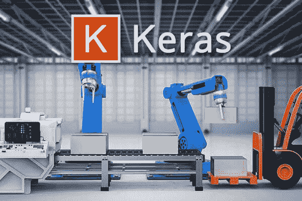
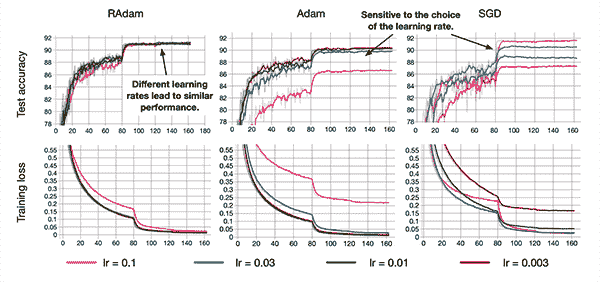
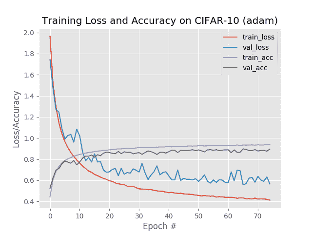

# 修正了带有 Keras 的 Adam (RAdam)优化器

> 原文：<https://pyimagesearch.com/2019/09/30/rectified-adam-radam-optimizer-with-keras/>

[](https://pyimagesearch.com/wp-content/uploads/2019/09/rectified_adam_keras_header.jpg)

在本教程中，您将学习如何使用 Keras 和修正的 Adam 优化器作为标准 Adam 优化器的替代产品，*潜在地*产生更高精度的模型(并且在更少的时期内)。

今天我们将开始一个关于**修正亚当优化器的**两部分系列**:**

1.  *修正了带有 Keras 的 Adam (RAdam)优化器*(今天的帖子)
2.  *整流亚当真的比亚当更好吗？*(下周教程)

整流亚当是一个全新的深度学习模型优化器，由伊利诺伊大学、佐治亚理工学院和微软研究院的成员合作推出。

调整后的 Adam 优化器有两个目标:

1.  获得一个 ***更精确/更可推广的*** 深度神经网络
2.  在*完成训练**更少的时期***

听起来好得难以置信？

嗯，可能只是。

你需要阅读本教程的其余部分来找到答案。

**要了解如何将修正的 Adam 优化器用于 Keras，*请继续阅读！***

## 修正了带有 Keras 的 Adam (RAdam)优化器

在本教程的第一部分，我们将讨论修正的 Adam 优化器，包括它与标准 Adam 优化器的不同之处(以及为什么我们应该关注它)。

从那以后，我将向您展示如何将修正的 Adam 优化器与 Keras 深度学习库一起使用。

然后，我们将运行一些实验，比较亚当和纠正亚当。

### 什么是修正的 Adam 优化器？

[](https://pyimagesearch.com/wp-content/uploads/2019/09/rectified_adam_keras_paper.png)

**Figure 1:** Using the Rectified Adam (RAdam) deep learning optimizer with Keras. (image source: [Figure 6 from Liu et al.](https://arxiv.org/abs/1908.03265v1))

几周前，在刘等人发表了一篇名为 [*的关于自适应学习速率的方差和超越*](https://arxiv.org/abs/1908.03265v1)的全新论文之后，深度学习社区议论纷纷。

本文介绍了一种新的深度学习优化器，称为**修正亚当**(或简称**雷达姆**)。

修正的 Adam 旨在替代标准的 Adam 优化器。

那么，为什么刘等人的贡献如此重要呢？为什么深度学习社区对此如此兴奋？

这里有一个关于你为什么应该关心它的简要概述:

*   学习率热身试探法对稳定训练很有效。
*   这些试探法也能很好地提高泛化能力。
*   刘等人决定**研究学习率热身背后的理论**…
*   …但是他们发现了自适应学习率的一个问题——在前几批**中，模型没有很好地概括**并且**具有非常高的方差**。
*   作者详细研究了该问题，并得出结论，该问题可以通过以下方式解决/缓解:
    *   1.以较低的初始学习率进行热身。
    *   2.或者，简单地**关闭最初几组输入批次的动量项**。
*   随着训练的继续，方差将稳定下来，从那里开始，**学习率可以增加**并且**动量项可以添加回**。

作者将这种优化器称为**修正的 Adam (RAdam)** ，Adam 优化器的一种变体，因为它“修正”(即纠正)了其他自适应学习率优化器中明显存在的差异/泛化问题。

但是问题依然存在——修正亚当真的比标准亚当更好吗？

要回答这个问题，你需要读完这篇教程，并阅读下周的帖子，其中包括一个完整的比较。

欲了解更多关于修正 Adam 的信息，包括理论和实证结果的细节，[请务必参考刘等人的论文](https://arxiv.org/pdf/1908.03265.pdf)。

### 项目结构

让我们检查一下我们的项目布局:

```py
$ tree --dirsfirst
.
├── pyimagesearch
│   ├── __init__.py
│   └── resnet.py
├── cifar10_adam.png
├── cifar10_rectified_adam.png
└── train.py

1 directory, 5 files

```

我们的 ResNet CNN 包含在`pyimagesearch`模块中。`resnet.py`文件包含使用 Python 进行计算机视觉深度学习的 [*中包含的精确 ResNet 模型类。*](https://pyimagesearch.com/deep-learning-computer-vision-python-book/)

我们将使用`train.py`中的 Adam 或 RAdam 优化器在 CIFAR-10 数据集上训练 ResNet，我们将在本教程的稍后部分回顾这一点。训练脚本将在每次运行时生成一个精度/损失图—两个。每个 Adam 和整流 Adam 实验的 png 文件都包含在 ***【下载】*** 中。

### 为 keras 安装整流器 adam

本教程要求在您的环境中安装以下软件:

*   TensorFlow
*   Keras
*   keras 整流器 adam
*   scikit-learn
*   matplotlib

幸运的是，所有的软件都是 pip 安装的。如果你曾经关注过我的[安装教程](https://pyimagesearch.com/opencv-tutorials-resources-guides/)，那么你会知道我是管理 Python 虚拟环境的 [virtualenv](https://virtualenv.pypa.io/en/stable/) 和 [virtualenvwrapper](https://virtualenvwrapper.readthedocs.io/en/stable/) 的粉丝。下面的第一个命令`workon`假设您已经安装了这些软件包，但是它是可选的。

让我们现在安装软件:

```py
$ workon <env_name> # replace "<env_name>" with your environment
$ pip install tensorflow # or tensorflow-gpu
$ pip install keras
$ pip install scikit-learn
$ pip install matplotlib

```

刘等人的 RAdam 的最初实现是在 PyTorch 然而，的赵 HG 创造了一个 Keras 实现。

您可以通过以下命令**安装修正 Adam** 的 Keras 实现:

```py
$ pip install keras-rectified-adam

```

要验证 Keras + RAdam 包是否已成功安装，请打开 Python shell 并尝试导入`keras_radam`:

```py
$ python
>>> import keras_radam
>>>

```

如果导入过程中没有错误，您可以假设已修正的 Adam 已成功安装在您的深度学习设备上！

### 使用 Keras 实施修正的 Adam

现在，让我们学习如何将修正的 Adam 与 Keras 一起使用。

如果你对 Keras 和/或深度学习不熟悉，请参考我的 [Keras 教程](https://pyimagesearch.com/2018/09/10/keras-tutorial-how-to-get-started-with-keras-deep-learning-and-python/)。关于深度学习优化器的完整回顾，请参考以下章节的 [***用 Python 进行计算机视觉的深度学习***](https://pyimagesearch.com/deep-learning-computer-vision-python-book/) :

*   *启动包*–第九章:*“优化方法和正则化技术”*
*   *从业者捆绑包*–第七章:*“高级优化方法”*

否则，如果你准备好了，让我们开始吧。

打开一个新文件，将其命名为`train.py`，并插入以下代码:

```py
# set the matplotlib backend so figures can be saved in the background
import matplotlib
matplotlib.use("Agg")

# import the necessary packages
from pyimagesearch.resnet import ResNet
from sklearn.preprocessing import LabelBinarizer
from sklearn.metrics import classification_report
from keras.preprocessing.image import ImageDataGenerator
from keras.optimizers import Adam
from keras_radam import RAdam
from keras.datasets import cifar10
import matplotlib.pyplot as plt
import numpy as np
import argparse

# construct the argument parser and parse the arguments
ap = argparse.ArgumentParser()
ap.add_argument("-p", "--plot", type=str, required=True,
	help="path to output training plot")
ap.add_argument("-o", "--optimizer", type=str, default="adam",
	choices=["adam", "radam"],
	help="type of optmizer")
args = vars(ap.parse_args())

```

**第 2-15 行**导入我们的包和模块。最值得注意的是，**第 10 行和第 11 行**导入了`Adam`和`RAdam`优化器。我们将使用 matplotlib 的 `"Agg"`后端，这样我们可以将我们的训练图保存到磁盘上( **Line 3** )。

**第 18-24 行**然后解析两个[命令行参数](https://pyimagesearch.com/2018/03/12/python-argparse-command-line-arguments/):

*   `--plot`:输出训练图的路径。
*   `--optimizer`:我们将用于训练的优化器的类型(或者是`adam`或者是`radam`)。

从这里开始，让我们继续执行一些初始化:

```py
# initialize the number of epochs to train for and batch size
EPOCHS = 75
BS = 128

# load the training and testing data, then scale it into the
# range [0, 1]
print("[INFO] loading CIFAR-10 data...")
((trainX, trainY), (testX, testY)) = cifar10.load_data()
trainX = trainX.astype("float") / 255.0
testX = testX.astype("float") / 255.0

# convert the labels from integers to vectors
lb = LabelBinarizer()
trainY = lb.fit_transform(trainY)
testY = lb.transform(testY)

# construct the image generator for data augmentation
aug = ImageDataGenerator(width_shift_range=0.1,
	height_shift_range=0.1, horizontal_flip=True,
	fill_mode="nearest")

# initialize the label names for the CIFAR-10 dataset
labelNames = ["airplane", "automobile", "bird", "cat", "deer",
	"dog", "frog", "horse", "ship", "truck"]

```

**第 27 行和第 28 行**初始化要训练的时期数以及我们的批量大小。请随意调整这些超参数，只是要记住它们会影响结果。

**第 33-35 行**加载并预处理我们的 CIFAR-10 数据，包括缩放数据到范围 *[0，1]* 。

**第 38-40 行**然后将我们的类标签从整数二进制化为向量。

**第 43-45 行**构建我们的数据增强对象。如果你是数据增强的新手，请务必参考我的[数据增强教程](https://pyimagesearch.com/2019/07/08/keras-imagedatagenerator-and-data-augmentation/)，它是如何工作的，或者我们为什么使用它。

我们的 CIFAR-10 级`labelNames`列在**线 48 和 49** 上。

现在我们进入本教程的核心部分— **初始化*亚当*或*雷达姆*优化器:**

```py
# check if we are using Adam
if args["optimizer"] == "adam":
	# initialize the Adam optimizer
	print("[INFO] using Adam optimizer")
	opt = Adam(lr=1e-3)

# otherwise, we are using Rectified Adam
else:
	# initialize the Rectified Adam optimizer
	print("[INFO] using Rectified Adam optimizer")
	opt = RAdam(total_steps=5000, warmup_proportion=0.1, min_lr=1e-5)

```

根据`--optimizer`命令行参数，我们将初始化:

*   `Adam`学习率为`1e-3` ( **第 52-55 行**)
*   或者`RAdam`以最小学习率`1e-5`热身(**第 58-61 行**)。务必参照[原来的预热实施注意事项](https://github.com/LiyuanLucasLiu/RAdam#why-does-warmup-have-a-bigger-impact-on-some-models-than-others)其中[赵 HG](https://github.com/CyberZHG/keras-radam) 也实施了

优化器准备就绪，现在我们将编译和训练我们的模型:

```py
# initialize our optimizer and model, then compile it
model = ResNet.build(32, 32, 3, 10, (9, 9, 9),
	(64, 64, 128, 256), reg=0.0005)
model.compile(loss="categorical_crossentropy", optimizer=opt,
	metrics=["accuracy"])

# train the network
H = model.fit_generator(
	aug.flow(trainX, trainY, batch_size=BS),
	validation_data=(testX, testY),
	steps_per_epoch=trainX.shape[0] // BS,
	epochs=EPOCHS,
	verbose=1)

```

我们通过第 64-67 行用我们指定的优化器(Adam 或 r Adam)编译`ResNet`。

**第 70-75 行**启动培训流程。如果你是使用这个函数来训练 Keras 深度神经网络的新手，请务必参考我关于 Keras 的 fit_generator 方法的[教程。](https://pyimagesearch.com/2018/12/24/how-to-use-keras-fit-and-fit_generator-a-hands-on-tutorial/)

最后，我们打印分类报告，并绘制训练期内的损失/准确度曲线:

```py
# evaluate the network
print("[INFO] evaluating network...")
predictions = model.predict(testX, batch_size=BS)
print(classification_report(testY.argmax(axis=1),
	predictions.argmax(axis=1), target_names=labelNames))

# determine the number of epochs and then construct the plot title
N = np.arange(0, EPOCHS)
title = "Training Loss and Accuracy on CIFAR-10 ({})".format(
	args["optimizer"])

# plot the training loss and accuracy
plt.style.use("ggplot")
plt.figure()
plt.plot(N, H.history["loss"], label="train_loss")
plt.plot(N, H.history["val_loss"], label="val_loss")
plt.plot(N, H.history["acc"], label="train_acc")
plt.plot(N, H.history["val_acc"], label="val_acc")
plt.title(title)
plt.xlabel("Epoch #")
plt.ylabel("Loss/Accuracy")
plt.legend()
plt.savefig(args["plot"])

```

### 标准 Adam 优化器结果

要使用 Adam optimizer 在 CIFAR-10 数据集上训练 ResNet，请确保使用本博客文章的 ***【下载】*** 部分下载本指南的源代码指南。

从那里，打开一个终端并执行以下命令:

```py
$ python train.py --plot cifar10_adam.png --optimizer adam
[INFO] loading CIFAR-10 data...
[INFO] using Adam optimizer
Epoch 1/75
390/390 [==============================] - 205s 526ms/step - loss: 1.9642 - acc: 0.4437 - val_loss: 1.7449 - val_acc: 0.5248
Epoch 2/75
390/390 [==============================] - 185s 475ms/step - loss: 1.5199 - acc: 0.6050 - val_loss: 1.4735 - val_acc: 0.6218
Epoch 3/75
390/390 [==============================] - 185s 474ms/step - loss: 1.2973 - acc: 0.6822 - val_loss: 1.2712 - val_acc: 0.6965
Epoch 4/75
390/390 [==============================] - 185s 474ms/step - loss: 1.1451 - acc: 0.7307 - val_loss: 1.2450 - val_acc: 0.7109
Epoch 5/75
390/390 [==============================] - 185s 474ms/step - loss: 1.0409 - acc: 0.7643 - val_loss: 1.0918 - val_acc: 0.7542
...
Epoch 71/75
390/390 [==============================] - 185s 474ms/step - loss: 0.4215 - acc: 0.9358 - val_loss: 0.6372 - val_acc: 0.8775
Epoch 72/75
390/390 [==============================] - 185s 474ms/step - loss: 0.4241 - acc: 0.9347 - val_loss: 0.6024 - val_acc: 0.8819
Epoch 73/75
390/390 [==============================] - 185s 474ms/step - loss: 0.4226 - acc: 0.9350 - val_loss: 0.5906 - val_acc: 0.8835
Epoch 74/75
390/390 [==============================] - 185s 474ms/step - loss: 0.4198 - acc: 0.9369 - val_loss: 0.6321 - val_acc: 0.8759
Epoch 75/75
390/390 [==============================] - 185s 474ms/step - loss: 0.4127 - acc: 0.9391 - val_loss: 0.5669 - val_acc: 0.8953
[INFO] evaluating network...
[INFO] evaluating network...
              precision    recall  f1-score   support

    airplane       0.81      0.94      0.87      1000
  automobile       0.96      0.96      0.96      1000
        bird       0.86      0.87      0.86      1000
         cat       0.84      0.75      0.79      1000
        deer       0.91      0.91      0.91      1000
         dog       0.86      0.84      0.85      1000
        frog       0.89      0.95      0.92      1000
       horse       0.93      0.92      0.93      1000
        ship       0.97      0.88      0.92      1000
       truck       0.96      0.92      0.94      1000

   micro avg       0.90      0.90      0.90     10000
   macro avg       0.90      0.90      0.90     10000
weighted avg       0.90      0.90      0.90     10000

```

[](https://pyimagesearch.com/wp-content/uploads/2019/09/cifar10_adam.png)

**Figure 2:** To achieve a baseline, we first train ResNet using the Adam optimizer on the CIFAR-10 dataset. We will compare the results to the Rectified Adam (RAdam) optimizer using Keras.

查看我们的输出，您可以看到我们在测试集上获得了 90%的准确率。

检查**图 2** 显示几乎没有过度配合的情况发生— **我们的训练进度相当稳定。**

### 整流器 adam 优化器结果

现在，让我们使用修正的 Adam 优化器在 CIFAR-10 上训练 ResNet:

```py
$ python train.py --plot cifar10_rectified_adam.png --optimizer radam
[INFO] loading CIFAR-10 data...
[INFO] using Rectified Adam optimizer
Epoch 1/75
390/390 [==============================] - 212s 543ms/step - loss: 2.4813 - acc: 0.2489 - val_loss: 2.0976 - val_acc: 0.3921
Epoch 2/75
390/390 [==============================] - 188s 483ms/step - loss: 1.8771 - acc: 0.4797 - val_loss: 1.8231 - val_acc: 0.5041
Epoch 3/75
390/390 [==============================] - 188s 483ms/step - loss: 1.5900 - acc: 0.5857 - val_loss: 1.4483 - val_acc: 0.6379
Epoch 4/75
390/390 [==============================] - 188s 483ms/step - loss: 1.3919 - acc: 0.6564 - val_loss: 1.4264 - val_acc: 0.6466
Epoch 5/75
390/390 [==============================] - 188s 483ms/step - loss: 1.2457 - acc: 0.7046 - val_loss: 1.2151 - val_acc: 0.7138
...
Epoch 71/75
390/390 [==============================] - 188s 483ms/step - loss: 0.6256 - acc: 0.9054 - val_loss: 0.7919 - val_acc: 0.8551
Epoch 72/75
390/390 [==============================] - 188s 482ms/step - loss: 0.6184 - acc: 0.9071 - val_loss: 0.7894 - val_acc: 0.8537
Epoch 73/75
390/390 [==============================] - 188s 483ms/step - loss: 0.6242 - acc: 0.9051 - val_loss: 0.7981 - val_acc: 0.8519
Epoch 74/75
390/390 [==============================] - 188s 483ms/step - loss: 0.6191 - acc: 0.9062 - val_loss: 0.7969 - val_acc: 0.8519
Epoch 75/75
390/390 [==============================] - 188s 483ms/step - loss: 0.6143 - acc: 0.9098 - val_loss: 0.7935 - val_acc: 0.8525
[INFO] evaluating network...
              precision    recall  f1-score   support

    airplane       0.86      0.88      0.87      1000
  automobile       0.91      0.95      0.93      1000
        bird       0.83      0.76      0.79      1000
         cat       0.76      0.69      0.72      1000
        deer       0.85      0.81      0.83      1000
         dog       0.79      0.79      0.79      1000
        frog       0.81      0.94      0.87      1000
       horse       0.89      0.89      0.89      1000
        ship       0.94      0.91      0.92      1000
       truck       0.88      0.91      0.89      1000

   micro avg       0.85      0.85      0.85     10000
   macro avg       0.85      0.85      0.85     10000
weighted avg       0.85      0.85      0.85     10000

```

[](https://pyimagesearch.com/wp-content/uploads/2019/09/cifar10_rectified_adam.png)

**Figure 3:** The Rectified Adam (RAdam) optimizer is used in conjunction with ResNet using Keras on the CIFAR-10 dataset. But how to the results compare to the standard Adam optimizer?

请注意，在第二次运行我们的训练脚本时，`--optimizer`开关是如何设置为`radam`的。

但是等一下，为什么我们只获得了 85%的准确率？

调整后的 Adam 优化器不是应该*优于*标准 Adam 吗？

为什么我们的准确性不知何故*不如*？

让我们在下一节讨论这个问题。

### 整流亚当真的比亚当好吗？

如果你看看我们的结果，你会发现标准的 Adam 优化器优于新的 Adam 优化器。

这是怎么回事？

大半年的亚当不是应该获得 ***更高的精度*** 而在 ***更少的历元吗？***

为什么整流 Adam 的性能*比标准 Adam 的性能*差？

首先，请记住，我们在这里只查看来自一个*单个*数据集的结果——一个**真实评估**将查看来自*多个*数据集的结果。

这正是我下周要做的事情！

要查看 Adam 和 Rectified Adam 之间的全面比较，并确定哪个优化器更好*，**，您需要收听下周的博客帖子！***

 *## 摘要

在本教程中，您学习了如何使用修正的 Adam 优化器，作为使用 Keras 深度学习库的标准 Adam 优化器的替代产品。

然后，我们运行了一组实验，将 Adam 性能与修正后的 Adam 性能进行比较。**我们的结果显示，标准 Adam 实际上*优于*RAdam 优化器。**

那么是什么原因呢？

刘等人在他们的论文中报告了更高的精确度和更少的时期，我们做错了什么吗？

我们修正过的 Adam 优化器有什么问题吗？

要回答这些问题，你需要在下周收听，届时我将提供一整套比较亚当和修正亚当的基准实验。你不会想错过下周的帖子，这将是一篇好文章！

**要下载这篇文章的源代码(并在下周教程上线时得到通知)，*请务必在下面的表格中输入您的电子邮件地址！****