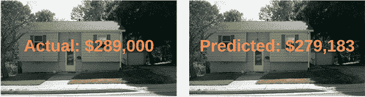

# 带 Keras 的回归

> 原文：<https://pyimagesearch.com/2019/01/21/regression-with-keras/>

在本教程中，您将学习如何使用 Keras 和深度学习来执行回归。您将学习如何为回归和连续值预测训练 Keras 神经网络，特别是在房价预测的背景下。

今天的帖子开始了关于深度学习、回归和连续价值预测的 3 部分系列。

我们将在房价预测的背景下研究 Keras 回归预测:

*   **第一部分:**今天我们将训练一个 Keras 神经网络来**根据分类和数字属性**预测房价，例如卧室/浴室的数量、平方英尺、邮政编码等。
*   **第二部分:**下周我们将训练一个 Keras **卷积神经网络，根据房屋本身的输入图像**(即房屋、卧室、浴室和厨房的正面视图)来预测房价。
*   **第三部分:**在两周内，我们将定义并训练一个神经网络， ***将*我们的分类/数字属性与我们的图像相结合，**从而比单独的属性或图像更好、更准确地预测房价。

与分类(预测 ***标签*** )不同，回归使我们能够预测 ***连续值*** 。

比如分类也许能预测出以下某个值:*{便宜，买得起，贵}* 。

另一方面，回归将能够预测精确的美元金额，例如*“这栋房子的估计价格是 489，121 美元”*。

在许多现实世界的情况下，比如房价预测或股市预测，应用回归而不是分类对于获得好的预测是至关重要的。

**要了解如何使用 Keras 执行回归，*请继续阅读！***

## 带 Keras 的回归

***2020-06-12 更新:**此博文现已兼容 TensorFlow 2+!*

在本教程的第一部分，我们将简要讨论分类和回归之间的区别。

然后，我们将探索我们在这一系列 Keras 回归教程中使用的房价数据集。

从那里，我们将配置我们的开发环境，并审查我们的项目结构。

在这个过程中，我们将学习如何使用 Pandas 加载我们的房价数据集，并定义一个用于 Keras 回归预测的神经网络。

最后，我们将训练我们的 Keras 网络，然后评估回归结果。

### 分类与回归

通常在 PyImageSearch 博客上，我们在分类的背景下讨论 Keras 和深度学习——预测一个标签来表征图像或输入数据集的内容。

**回归**，另一方面，使我们能够预测连续值。让我们再次考虑房价预测的任务。

我们知道，分类是用来预测一个类别标签的。

对于房价预测，我们可以将分类标签定义为:

```py
labels = {very cheap, cheap, affordable, expensive, very expensive}

```

如果我们执行分类，我们的模型可以根据一组输入特征学习预测这五个值中的一个。

然而，这些标签仅仅是——代表房子潜在价格范围的类别，但并不代表房子的实际成本(T2)。

为了预测房屋的实际成本，我们需要进行回归分析。

使用回归，我们可以训练一个模型来预测一个连续值。

例如，虽然分类可能只能预测一个标签，但回归可以说:

根据我的输入数据，我估计这栋房子的价格是 781，993 美元

**上面的图 1** 提供了执行分类和回归的可视化。

在本教程的其余部分，您将学习如何使用 Keras 为回归训练神经网络。

### 房价数据集

我们今天要使用的数据集来自 Ahmed 和 Moustafa 于 2016 年发表的论文[](https://github.com/emanhamed/Houses-dataset)*根据视觉和文字特征进行房价估算。*

 ***数据集包括 535 个数据点的*数字/分类*属性以及*图像*，**使其成为研究回归和混合数据预测的优秀数据集。

房屋数据集包括**四个数字和分类属性:**

1.  卧室数量
2.  浴室数量
3.  面积(即平方英尺)
4.  邮政区码

这些属性以 CSV 格式存储在磁盘上。

我们将在本教程的后面使用`pandas`从磁盘加载这些属性，这是一个用于数据分析的流行 Python 包。

**也为每个房屋提供总共四个图像:**

1.  卧室
2.  浴室
3.  厨房
4.  房子的正面图

**房屋数据集的最终目标是预测房屋本身的*价格*。**

在今天的教程中，我们将使用*和*数字和分类数据。

下周的博客文章将讨论如何处理图像数据。

最后，两周后，我们将*结合*数字/分类数据和图像，以获得我们的最佳表现模型。

但是在我们为回归训练我们的 Keras 模型之前，我们首先需要配置我们的开发环境并获取数据。

### 配置您的开发环境

对于这个由 3 部分组成的博客文章系列，您需要安装以下软件包:

*   **NumPy**
*   **scikit-learn**
*   熊猫
*   **Keras** 与 **TensorFlow** 后端(CPU 或 GPU)
*   OpenCV (本系列接下来的两篇博文)

要为这一系列教程配置您的系统，我建议您遵循以下任一教程:

*   [*如何在 Ubuntu 上安装 tensor flow 2.0*](https://pyimagesearch.com/2019/12/09/how-to-install-tensorflow-2-0-on-ubuntu/)
*   *[如何在 macOS 上安装 tensor flow 2.0](https://pyimagesearch.com/2019/12/09/how-to-install-tensorflow-2-0-on-macos/)*

这两个教程都将帮助您在一个方便的 Python 虚拟环境中，用这篇博文所需的所有软件来配置您的系统。

请注意 [PyImageSearch 不推荐也不支持 CV/DL 项目](https://pyimagesearch.com/faqs/single-faq/can-you-help-me-do-___-on-windows/)的窗口。

### 下载房价数据集

在下载数据集之前，使用 ***“下载”*** 部分获取这篇文章的源代码。

从那里，解压缩文件并导航到目录:

```py
$ cd path/to/downloaded/zip
$ unzip keras-regression.zip
$ cd keras-regression

```

在那里，您可以使用以下命令下载房价数据集:

```py
$ git clone https://github.com/emanhamed/Houses-dataset

```

当我们准备好训练我们的 Keras 回归网络时，你需要通过[命令行参数](https://pyimagesearch.com/2018/03/12/python-argparse-command-line-arguments/)提供到`Houses-dataset`目录的路径。

### 项目结构

现在您已经有了数据集，接下来使用带有如下所示相同参数的`tree`命令来打印项目的目录+文件列表:

```py
$ tree --dirsfirst --filelimit 10
.
├── Houses-dataset
│   ├── Houses Dataset [2141 entries]
│   └── README.md
├── pyimagesearch
│   ├── __init__.py
│   ├── datasets.py
│   └── models.py
└── mlp_regression.py

3 directories, 5 files

```

从 GitHub 下载的数据集现在位于`Houses-dataset/`文件夹中。

`pyimagesearch/`目录实际上是一个包含代码 ***【下载】*** 的模块，在里面你会发现:

*   `datasets.py`:我们从数据集加载数字/分类数据的脚本
*   `models.py`:我们的多层感知器架构实现

这两个脚本将在今天复习。此外，我们将在接下来的两个教程中重用`datasets.py`和`models.py`(带修改)，以保持我们的代码有组织和可重用。

regression + Keras 脚本包含在`mlp_regression.py`中，我们也将回顾它。

### 加载房价数据集

在训练我们的 Keras 回归模型之前，我们首先需要为 houses 数据集加载数值和分类数据。

打开`datasets.py`文件并插入以下代码:

```py
# import the necessary packages
from sklearn.preprocessing import LabelBinarizer
from sklearn.preprocessing import MinMaxScaler
import pandas as pd
import numpy as np
import glob
import cv2
import os

def load_house_attributes(inputPath):
	# initialize the list of column names in the CSV file and then
	# load it using Pandas
	cols = ["bedrooms", "bathrooms", "area", "zipcode", "price"]
	df = pd.read_csv(inputPath, sep=" ", header=None, names=cols)

```

我们首先从 scikit-learn、pandas、NumPy 和 OpenCV 导入库和模块。OpenCV 将在下周使用，因为我们将添加加载图像到这个脚本的能力。

在**第 10 行**上，我们定义了接受输入数据集路径的`load_house_attributes`函数。

在函数内部，我们首先定义 CSV 文件中的列名(**第 13 行**)。从那里，我们使用 pandas 的函数，`read_csv`将 CSV 文件加载到内存中，作为第 14 行**上的日期帧(`df`)。**

下面您可以看到我们的输入数据示例，包括卧室数量、浴室数量、面积(即平方英尺)、邮政编码、代码，以及我们的模型应训练预测的最终目标价格:

```py
   bedrooms  bathrooms  area  zipcode     price
0         4        4.0  4053    85255  869500.0
1         4        3.0  3343    36372  865200.0
2         3        4.0  3923    85266  889000.0
3         5        5.0  4022    85262  910000.0
4         3        4.0  4116    85266  971226.0

```

让我们完成剩下的`load_house_attributes`函数:

```py
	# determine (1) the unique zip codes and (2) the number of data
	# points with each zip code
	zipcodes = df["zipcode"].value_counts().keys().tolist()
	counts = df["zipcode"].value_counts().tolist()

	# loop over each of the unique zip codes and their corresponding
	# count
	for (zipcode, count) in zip(zipcodes, counts):
		# the zip code counts for our housing dataset is *extremely*
		# unbalanced (some only having 1 or 2 houses per zip code)
		# so let's sanitize our data by removing any houses with less
		# than 25 houses per zip code
		if count < 25:
			idxs = df[df["zipcode"] == zipcode].index
			df.drop(idxs, inplace=True)

	# return the data frame
	return df

```

在剩余的行中，我们:

*   确定唯一的邮政编码集，然后计算每个唯一邮政编码的数据点数(**第 18 行和第 19 行**)。
*   过滤掉低计数的邮政编码(**第 28 行**)。对于一些邮政编码，我们只有一两个数据点，这使得获得准确的房价估计非常具有挑战性，如果不是不可能的话。
*   将数据帧返回给调用函数(**第 33 行**)。

现在让我们创建用于预处理数据的`process_house_attributes`函数:

```py
def process_house_attributes(df, train, test):
	# initialize the column names of the continuous data
	continuous = ["bedrooms", "bathrooms", "area"]

	# performin min-max scaling each continuous feature column to
	# the range [0, 1]
	cs = MinMaxScaler()
	trainContinuous = cs.fit_transform(train[continuous])
	testContinuous = cs.transform(test[continuous])

```

我们在第 35 行定义函数。`process_house_attributes`函数接受三个参数:

*   `df`:我们由 pandas 生成的数据框(前面的函数帮助我们从数据框中删除一些记录)
*   `train`:我们的房价数据集的训练数据
*   我们的测试数据。

然后在第 37 行上，我们定义连续数据的列，包括卧室、浴室和房子的大小。

我们将获取这些值，并使用 scikit-learn 的`MinMaxScaler`将连续特征缩放到范围*【0，1】*(**第 41-43 行**)。

现在我们需要预处理我们的分类特征，即邮政编码:

```py
	# one-hot encode the zip code categorical data (by definition of
	# one-hot encoing, all output features are now in the range [0, 1])
	zipBinarizer = LabelBinarizer().fit(df["zipcode"])
	trainCategorical = zipBinarizer.transform(train["zipcode"])
	testCategorical = zipBinarizer.transform(test["zipcode"])

	# construct our training and testing data points by concatenating
	# the categorical features with the continuous features
	trainX = np.hstack([trainCategorical, trainContinuous])
	testX = np.hstack([testCategorical, testContinuous])

	# return the concatenated training and testing data
	return (trainX, testX)

```

首先，我们将对邮政编码进行一次性编码(**第 47-49 行**)。

然后，我们将使用 NumPy 的`hstack`函数(**第 53 行和第 54 行**)将*分类特征*与*连续特征*连接起来，将得到的训练和测试集作为元组(**第 57 行**)返回。

请记住，现在*我们的分类特征和连续特征都在 *[0，1]范围内*所有*。**

### 实现用于回归的神经网络

在我们为回归训练 Keras 网络之前，我们首先需要定义架构本身。

今天我们将使用一个简单的多层感知器(MLP)，如图 5 所示。

打开`models.py`文件并插入以下代码:

```py
# import the necessary packages
from tensorflow.keras.models import Sequential
from tensorflow.keras.layers import BatchNormalization
from tensorflow.keras.layers import Conv2D
from tensorflow.keras.layers import MaxPooling2D
from tensorflow.keras.layers import Activation
from tensorflow.keras.layers import Dropout
from tensorflow.keras.layers import Dense
from tensorflow.keras.layers import Flatten
from tensorflow.keras.layers import Input
from tensorflow.keras.models import Model

def create_mlp(dim, regress=False):
	# define our MLP network
	model = Sequential()
	model.add(Dense(8, input_dim=dim, activation="relu"))
	model.add(Dense(4, activation="relu"))

	# check to see if the regression node should be added
	if regress:
		model.add(Dense(1, activation="linear"))

	# return our model
	return model

```

首先，我们将从 Keras 导入所有必需的模块(**第 2-11 行**)。我们将在下周的教程的*中给这个文件添加一个卷积神经网络，因此今天这里没有使用额外的导入。*

让我们通过编写一个名为`create_mlp`的函数来定义 MLP 架构。

该函数接受两个参数:

*   `dim`:定义我们的输入尺寸
*   `regress`:一个布尔值，定义是否应该添加我们的回归神经元

我们将着手开始用`dim-8-4`架构(**第 15-17 行**)建造我们的 MLP。

如果我们正在执行回归，我们添加一个包含具有线性激活函数的单个神经元的`Dense`层(**行 20 和 21** )。通常我们使用基于 ReLU 的激活，但是因为我们正在执行回归，所以我们需要一个线性激活。

最后，我们的`model`在**行 24** 返回。

### 实现我们的 Keras 回归脚本

现在是时候把所有的碎片放在一起了！

打开`mlp_regression.py`文件并插入以下代码:

```py
# import the necessary packages
from tensorflow.keras.optimizers import Adam
from sklearn.model_selection import train_test_split
from pyimagesearch import datasets
from pyimagesearch import models
import numpy as np
import argparse
import locale
import os

# construct the argument parser and parse the arguments
ap = argparse.ArgumentParser()
ap.add_argument("-d", "--dataset", type=str, required=True,
	help="path to input dataset of house images")
args = vars(ap.parse_args())

```

我们从导入必要的包、模块和库开始。

也就是说，我们需要来自 Keras 的`Adam`优化器，来自 scikit-learn 的`train_test_split`，以及来自`pyimagesearch`模块的`datasets` + `models`函数。

此外，在评估我们的模型时，我们将使用 NumPy 的数学特性来收集统计数据。

`argparse`模块用于[解析命令行参数。](https://pyimagesearch.com/2018/03/12/python-argparse-command-line-arguments/)

我们的脚本只需要一个命令行参数`--dataset` ( **第 12-15 行**)。当您在终端中运行训练脚本时，您需要提供`--dataset`开关和数据集的实际路径。

让我们加载房屋数据集属性，并构建我们的培训和测试拆分:

```py
# construct the path to the input .txt file that contains information
# on each house in the dataset and then load the dataset
print("[INFO] loading house attributes...")
inputPath = os.path.sep.join([args["dataset"], "HousesInfo.txt"])
df = datasets.load_house_attributes(inputPath)

# construct a training and testing split with 75% of the data used
# for training and the remaining 25% for evaluation
print("[INFO] constructing training/testing split...")
(train, test) = train_test_split(df, test_size=0.25, random_state=42)

```

使用我们方便的`load_house_attributes`函数，并通过将`inputPath`传递给数据集本身，我们的数据被加载到内存中(**第 20 行和第 21 行**)。

我们的培训(75%)和测试(25%)数据是通过**第 26 行**和 scikit-learn 的`train_test_split`方法构建的。

让我们来衡量我们的房价数据:

```py
# find the largest house price in the training set and use it to
# scale our house prices to the range [0, 1] (this will lead to
# better training and convergence)
maxPrice = train["price"].max()
trainY = train["price"] / maxPrice
testY = test["price"] / maxPrice

```

正如评论中所说，将我们的房价调整到范围*【0，1】*将使我们的模型更容易训练和收敛。将输出目标缩放至*【0，1】*将缩小我们的输出预测范围(相对于*【0，`maxPrice`】*)，不仅使 ***更容易、更快地训练我们的网络*** ，而且使我们的模型 ***也能获得更好的结果。***

因此，我们获取训练集中的最高价格(**行 31** )，并相应地扩展我们的训练和测试数据(**行 32 和 33** )。

现在让我们处理房屋属性:

```py
# process the house attributes data by performing min-max scaling
# on continuous features, one-hot encoding on categorical features,
# and then finally concatenating them together
print("[INFO] processing data...")
(trainX, testX) = datasets.process_house_attributes(df, train, test)

```

回想一下`datasets.py`脚本中的`process_house_attributes`函数:

*   预处理我们的分类和连续特征。
*   通过最小-最大缩放将我们的连续特征缩放到范围*【0，1】*。
*   一键编码我们的分类特征。
*   连接分类特征和连续特征以形成最终的特征向量。

现在，让我们根据数据拟合 MLP 模型:

```py
# create our MLP and then compile the model using mean absolute
# percentage error as our loss, implying that we seek to minimize
# the absolute percentage difference between our price *predictions*
# and the *actual prices*
model = models.create_mlp(trainX.shape[1], regress=True)
opt = Adam(lr=1e-3, decay=1e-3 / 200)
model.compile(loss="mean_absolute_percentage_error", optimizer=opt)

# train the model
print("[INFO] training model...")
model.fit(x=trainX, y=trainY, 
	validation_data=(testX, testY),
	epochs=200, batch_size=8)

```

我们的`model`被`Adam`优化器初始化(**第 45 和 46 行**，然后被编译(**第 47 行**)。注意，我们使用*平均绝对百分比误差*作为我们的损失函数，表明我们寻求最小化预测价格和实际价格之间的*平均百分比差异*。

实际培训过程从第 51-53 行**开始。**

培训完成后，我们可以评估我们的模型并总结我们的结果:

```py
# make predictions on the testing data
print("[INFO] predicting house prices...")
preds = model.predict(testX)

# compute the difference between the *predicted* house prices and the
# *actual* house prices, then compute the percentage difference and
# the absolute percentage difference
diff = preds.flatten() - testY
percentDiff = (diff / testY) * 100
absPercentDiff = np.abs(percentDiff)

# compute the mean and standard deviation of the absolute percentage
# difference
mean = np.mean(absPercentDiff)
std = np.std(absPercentDiff)

# finally, show some statistics on our model
locale.setlocale(locale.LC_ALL, "en_US.UTF-8")
print("[INFO] avg. house price: {}, std house price: {}".format(
	locale.currency(df["price"].mean(), grouping=True),
	locale.currency(df["price"].std(), grouping=True)))
print("[INFO] mean: {:.2f}%, std: {:.2f}%".format(mean, std))

```

第 57 行指示 Keras 在我们的测试集上进行预测。

使用预测，我们计算:

1.  *预测*房价与*实际*房价之差(**62 线**)。
2.  百分比差异(**第 63 行**)。
3.  绝对百分比差异(**第 64 行**)。

从那里，在第 68 和 69 行上，我们计算绝对百分比差的平均值和标准偏差。

结果通过**行 73-76** 打印出来。

用 Keras 回归并不困难，不是吗？

我们来训练模型，分析结果！

### Keras 回归结果

[](https://pyimagesearch.com/wp-content/uploads/2019/01/keras_regression_predicted.png)

**Figure 6:** For today’s blog post, our Keras regression model takes four numerical inputs, producing one numerical output: the predicted value of a home.

要训练我们自己的 Keras 网络进行回归和房价预测，请确保您:

1.  根据上述指导配置您的开发环境。
2.  使用本教程的 ***【下载】*** 部分下载源代码。
3.  根据上面*“房价数据集”*部分的说明下载房价数据集。

从那里，打开一个终端并提供以下命令(确保`--dataset` [命令行参数](https://pyimagesearch.com/2018/03/12/python-argparse-command-line-arguments/)指向您下载房价数据集的位置):

```py
$ python mlp_regression.py --dataset Houses-dataset/Houses\ Dataset/
[INFO] loading house attributes...
[INFO] constructing training/testing split...
[INFO] processing data...
[INFO] training model...
Epoch 1/200
34/34 [==============================] - 0s 4ms/step - loss: 73.0898 - val_loss: 63.0478
Epoch 2/200
34/34 [==============================] - 0s 2ms/step - loss: 58.0629 - val_loss: 56.4558
Epoch 3/200
34/34 [==============================] - 0s 1ms/step - loss: 51.0134 - val_loss: 50.1950
Epoch 4/200
34/34 [==============================] - 0s 1ms/step - loss: 47.3431 - val_loss: 47.6673
Epoch 5/200
34/34 [==============================] - 0s 1ms/step - loss: 45.5581 - val_loss: 44.9802
Epoch 6/200
34/34 [==============================] - 0s 1ms/step - loss: 42.4403 - val_loss: 41.0660
Epoch 7/200
34/34 [==============================] - 0s 1ms/step - loss: 39.5451 - val_loss: 34.4310
Epoch 8/200
34/34 [==============================] - 0s 2ms/step - loss: 34.5027 - val_loss: 27.2138
Epoch 9/200
34/34 [==============================] - 0s 2ms/step - loss: 28.4326 - val_loss: 25.1955
Epoch 10/200
34/34 [==============================] - 0s 2ms/step - loss: 28.3634 - val_loss: 25.7194
...
Epoch 195/200
34/34 [==============================] - 0s 2ms/step - loss: 20.3496 - val_loss: 22.2558
Epoch 196/200
34/34 [==============================] - 0s 2ms/step - loss: 20.4404 - val_loss: 22.3071
Epoch 197/200
34/34 [==============================] - 0s 2ms/step - loss: 20.0506 - val_loss: 21.8648
Epoch 198/200
34/34 [==============================] - 0s 2ms/step - loss: 20.6169 - val_loss: 21.5130
Epoch 199/200
34/34 [==============================] - 0s 2ms/step - loss: 19.9067 - val_loss: 21.5018
Epoch 200/200
34/34 [==============================] - 0s 2ms/step - loss: 19.9570 - val_loss: 22.7063
[INFO] predicting house prices...
[INFO] avg. house price: $533,388.27, std house price: $493,403.08
[INFO] mean: 22.71%, std: 18.26%

```

正如您从我们的输出中看到的，我们的初始平均绝对百分比误差开始高达 73%，然后迅速下降到 30%以下。

当我们完成训练时，我们可以看到我们的网络开始有点超载。我们的培训损耗低至~ 20%；然而，我们的验证损失约为 23%。

计算我们的最终平均绝对百分比误差，我们得到最终值 **22.71%。**

**这个值是什么意思？**

我们的最终平均绝对百分比误差意味着，平均而言，我们的网络在房价预测中会有约 23%的误差，标准差约为 18%。

### 房价数据集的局限性

房价预测下降 22%是一个好的开始，但肯定不是我们想要的那种精确度。

也就是说，这种预测准确性也可以被视为房价数据集本身的一种*限制*。

请记住，数据集只包括四个属性:

1.  卧室数量
2.  浴室数量
3.  面积(即平方英尺)
4.  邮政区码

大多数其他房价数据集包括更多属性。

例如，[波士顿房价数据集](https://www.kaggle.com/c/boston-housing)包括总共*14 个属性*，这些属性可用于房价预测(尽管该数据集确实有一些种族歧视)。

[Ames House 数据集](https://www.kaggle.com/c/house-prices-advanced-regression-techniques) *包括超过 79 种不同的属性*，可用于训练回归模型。

当你想到这一点，事实上，我们甚至能够获得 26%的平均绝对百分比误差，而没有一个专业的房地产经纪人的知识是相当合理的给定:

1.  数据集中总共只有 535 栋房屋(出于本指南的目的，我们只使用了 **362 栋房屋**)。
2.  我们只有**四个属性**来训练我们的回归模型。
3.  这些属性本身，虽然在描述房屋本身时很重要，但对房屋周围区域的特征描述却很少。
4.  **房价的变化令人难以置信**均值为 53.3 万美元，标准差为 49.3 万美元(基于我们过滤后的 362 套房屋的数据集)。

综上所述，学习如何使用 Keras 执行回归是一项重要的技能！

在本系列的下两篇文章中，我将向您展示如何:

1.  利用房价数据集提供的图像来训练 CNN。
2.  将我们的数字/分类数据与房屋图像相结合，得到一个优于我们之前所有 Keras 回归实验的模型。

## 摘要

在本教程中，您学习了如何使用 Keras 深度学习库进行回归。

具体来说，我们使用 Keras 和回归来预测基于四个数字和分类属性的房价:

*   卧室数量
*   浴室数量
*   面积(即平方英尺)
*   邮政区码

总体而言，我们的神经网络获得了 22.71%的平均绝对百分比误差，这意味着，平均而言，我们的房价预测将偏离 22.71%。

这就提出了问题:

*   怎样才能*提高*我们的房价预测准确率？
*   如果我们*利用每栋房子的图片*会怎么样？这会提高准确性吗？
*   有什么方法可以将我们的分类/数字属性和图像数据结合起来？

要回答这些问题，您需要继续关注 Keras 回归系列中的其他教程。

**要下载这篇文章的源代码(下一篇教程在 PyImageSearch 上发布时会通知您)，*只需在下面的表格中输入您的电子邮件地址。****