# Raspberry Pi(或 Amazon EC2)上的远程开发

> 原文：<https://pyimagesearch.com/2019/07/01/remote-development-on-the-raspberry-pi-or-amazon-ec2/>

[](https://pyimagesearch.com/wp-content/uploads/2019/07/remote_development_header.jpg)

在这篇博文中，您将学习如何在 Raspberry Pi(或 Amazon EC2 服务器)上执行远程开发。您将发现如何配置您的主机以连接到这些系统并远程执行 Python 开发。

今天的教程实际上是我即将出版的书的一个章节， [*计算机视觉的树莓派*](https://pyimagesearch.com/raspberry-pi-for-computer-vision/) 。

在我写这一章的时候，我意识到这个指南并不是专门针对 RPi 的，它实际上可以用于任何需要配置远程系统进行开发的人(特别是使用 Python 编程语言的人)。

因此，我决定把这一章转换成一篇博文。

**通过本教程，您将学习如何配置:**

1.  用于远程计算机视觉开发的树莓 Pi
2.  用于远程深度学习的亚马逊 AWS 服务器
3.  ***…或任何其他可以远程连接的系统！***

**要了解如何为远程 Python 开发配置您的 Raspberry Pi、Amazon EC2 实例或服务器，*请继续阅读！***

## Raspberry Pi(或 Amazon EC2)上的远程开发

在本教程的第一部分，我们将讨论**远程开发**的概念，以及为什么它不仅对我们这些程序员来说*方便*，而且为什么你*应该在你的非宿主机器上写代码时使用它。*

在这里，我将向您提供我最喜欢的三种连接到 Raspberry Pi、AWS 实例或远程服务器的方法。

然后，我们将讨论将文件从主机传输到远程系统的两种简单易用的方法。

**最后，我们将在文章的最后讨论可用于在远程系统上编写代码的 Python IDEs。**

### 什么是远程开发？

[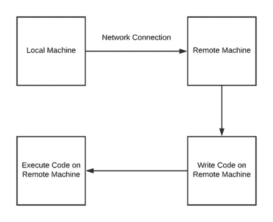](https://pyimagesearch.com/wp-content/uploads/2019/07/remote_development_flowchart.png)

**Figure 1:** Remote Python development flowchart.

**远程开发**假设您有两台计算机:

1.  您的**主机**(也称为您的**本地机器**)连接了您的显示器、键盘和鼠标。
2.  执行代码的远程机器。

或者，更简单地说:

1.  你的主机是你的笔记本电脑/台式机，放在你平时工作的桌子上。
2.  您的远程机器是您通过主机登录的机器。

要执行开发，首先要从主机连接到远程机器。

有许多方法可以连接到远程机器，包括 SSH、VNC、Jupyter 笔记本等等。我们将在本指南的后面介绍这些方法。

连接到远程机器后，您可以:

1.  在远程机器上编写代码
2.  **在远程机器上执行代码**

**图 1** 说明了使用您的主机登录到设备，在远程系统上编写代码，然后执行代码的概念。

当您仍然在本地系统上使用键盘输入时，命令/代码本身实际上正在远程机器上执行。

### 为什么我要远程编写我的代码？

**如果你正在使用基于云的实例**，比如 Amazon EC2、Microsoft Azure 等。，那么您没有物理接触到机器(意味着没有键盘/鼠标可以使用)。

在这种情况下，您需要登录到服务器并执行远程开发——并且您希望确保您的本地主机针对远程开发进行了正确配置。

**如果你用的是树莓派**，那么你当然*可以*连接键盘、显示器和鼠标，*但这并不总是必要的！*

首先，您会遇到设置额外硬件的麻烦—设置起来很笨重，您会失去桌面上的空间，最糟糕的是，您会不断地在 RPi 键盘和笔记本电脑/台式机键盘之间来回切换。

其次，即使发布了 Raspberry Pi 4，与您的笔记本电脑/台式机相比，RPi 本身仍然非常不够强大——您不会(也不应该)能够在 Pi 本身上利用强大的编程 ide。

说到 Python 开发， [PyCharm](https://www.jetbrains.com/pycharm/) 简直就是标准。

然而，像 PyCharm 这样的 IDE 虽然超级强大，但却是资源消耗大户，消耗相当多的 RAM 和 CPU 周期——在 RPi 这样的资源受限设备上，运行这样的 IDE 在计算上是很浪费的。

相反，您应该:

*   配置您的本地机器以连接到 Pi
*   笔记本电脑/台式机上的代码
*   然后将这些文件传输(可能是自动传输)到 Pi，这样您就可以在远程机器上运行代码本身。

在本教程的剩余部分，我将向你展示如何配置你的主机来创建一个*无缝转换*，让*感觉到*就像你在你的主机上写代码，但实际上*是在远程系统上写代码*。

### 连接到远程机器或 Raspberry Pi

有许多方法、协议和程序可以连接到远程机器。

本节中讨论的方法*当然*不是详尽的，但是它们*是*我最喜欢的，也是你*在执行远程开发时绝对*会遇到的。

#### 安全外壳(SSH)


**Figure 2:** Secure Shell (SSH) is essential to remote development with Unix systems such as Ubuntu, macOS, EC2, and Raspbian.

第一种方法，也可以说是最简单的方法，是利用安全 Shell (SSH)，这是 Unix 机器上的`ssh`命令。

要使用 SSH，您需要:

*   远程机器上安装并运行的 SSH 服务器。
*   安装在本地机器上的 SSH 客户端。
*   远程系统的 IP 地址、用户名和密码。

大多数系统都有 SSH **服务器**。在 Ubuntu 上，如果需要安装 SSH 服务器，只需:

```py
$ sudo apt-get install openssh-server

```

在 macOS 上，你只需要开启*“远程登录”*:

```py
sudo systemsetup -setremotelogin on

```

**参见下面的**了解在 Raspberry Pi 上启用 **SSH 服务器的两个选项。**

如果你使用的是基于 Unix 的机器(比如 Linux 或 macOS)，默认情况下会安装`ssh` **客户端**。如果您使用的是 Windows，您可能需要安装它

***注意:**我已经 10 多年没用过 Windows 了，在 PyImageSearch 博客上也没有正式支持 Windows。我最后一次检查 [PuTTY](https://www.putty.org/) 仍然是一个很好的选择，但我会把 SSH 安装在 Windows 上留给你。*

如果您已经安装了 SSH，首先在您的主机上打开一个终端/命令行。

然后，您将需要以下内容:

1.  您正在连接的机器的 IP 地址。
2.  您将在远程机器上登录的用户的用户名。
3.  相应用户的密码。

获得这些信息后，您可以使用以下命令作为模板:

```py
$ ssh username@ip_address

```

如果您使用的是 Amazon EC2，您可能需要提供一个私钥来代替密码:

```py
$ ssh -i ~/keyfile.pem username@ip_address # AWS EC2

```

例如，如果我的远程机器的 IP 地址是`10.0.0.90`，我的用户名是`adrian`，那么`ssh`命令就变成:

```py
$ ssh adrian@10.0.0.90

```

然后，我可以提供我的密码并登录到远程机器。登录后，我现在可以在远程机器上执行任何我想执行的命令(当然，前提是我有适当的权限)。

#### X11 转发

[](https://pyimagesearch.com/wp-content/uploads/2019/07/remote_development_x11_forwarding_header.png)

**Figure 3:** X11 forwarding allows a remote system to render a GUI window on your local system. X forwarding is useful for remote development over high-speed connections and when the GUI is relatively static. It does not perform well for animations and video.

您知道可以使用 SSH 从 Python 脚本和程序中查看基本的 GUI 窗口吗？

首先，您需要一个 X-Window 管理器:

*   如果你的主机是 **Ubuntu** (或者另一个 Linux 发行版)，它是内置的。
*   如果你的主机是 **macOS** ，你要下载+安装 [xQuartz](https://www.xquartz.org/) 。
*   如果你的主机是 **Windows** ，我*认为*这些天你仍然需要 [Xming](https://sourceforge.net/projects/xming/) (我使用 Windows 已经超过 10 年了，所以你应该自己做研究)。

您需要做的就是通过`-X`开关启用 X11 转发:

```py
$ ssh -X username@ip_address

```

[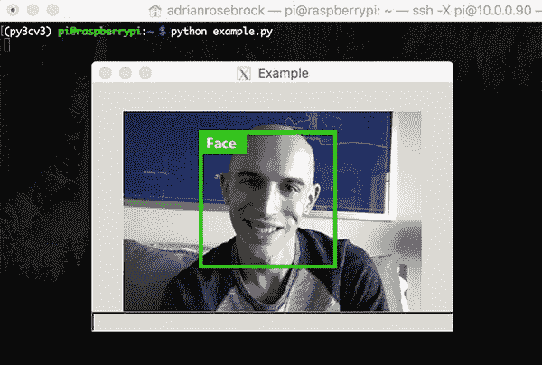](https://pyimagesearch.com/wp-content/uploads/2019/07/remote_development_x11_forwarding.jpg)

**Figure 4:** A remote X11 window displayed on my Mac using the Xquartz app and an SSH connection.

这里我启动了一个名为`example.py`的 Python 脚本。这个脚本从磁盘加载一个图像，并通过`cv2.imshow`调用将它显示到我的本地主机的屏幕上。

因为我启用了 X11 转发，所以通过 OpenCV 打开的窗口显示在我的主机上。请记住，代码是远程执行的，图像是远程呈现的，但在本地显示。

你可能想知道:

X11 转发对视频流有用吗？

简而言之，答案是“不，不用麻烦了。”X11 转发协议根本不压缩图像，也不能有效地使视频流成为可能。**不要尝试将 X11 转发用于内容经常变化或有视频内容的应用。**

#### 树莓 Pi 上的 SSH 的一个快速注释

值得注意的是，SSH 在 Raspberry Pi 上默认是关闭的，这意味着如果不先启用它，您就不能通过 SSH 连接到您的 RPi。

有几种方法可以在 Raspberry Pi 上启用 SSH。

**选项 1:** 您可以通过*桌面用户界面:*启用

[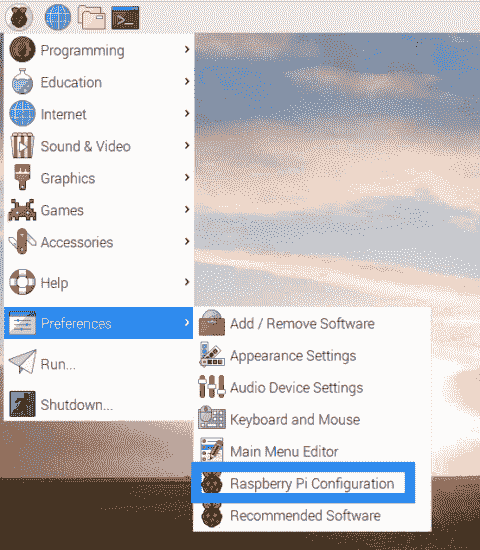](https://pyimagesearch.com/wp-content/uploads/2019/07/remote_development_raspbian_desktop_rpi_configuration.png)

**Figure 5:** The Raspberry Pi Configuration desktop GUI is accessed from the main menu.

从那里，找到*“Interfaces”*选项卡并启用 SSH:

[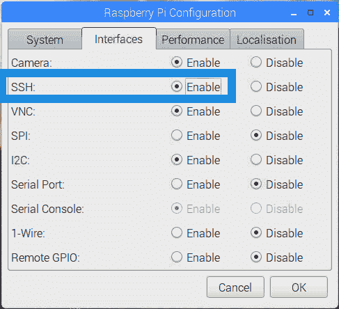](https://pyimagesearch.com/wp-content/uploads/2019/07/remote_development_raspbian_ssh.png)

**Figure 6:** Enabling SSH on the Raspberry Pi via the Desktop. SSH is essential for remote development on the Raspberry Pi.

**选项 2:** 第二种方法是使用下面的命令来启用它:

```py
$ sudo service ssh start

```

这种方法的问题是，需要物理访问 RPi 才能键入命令。

第二个问题是，如果您重新启动 Raspberry Pi，SSH 将不会自动启动(也就是说，启动 SSH 将不会在重新启动后持续)。

**选项 3:** 与*选项 1* 类似，您可以通过*命令行:*进入树莓 Pi 配置

[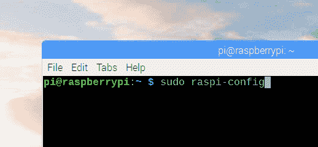](https://pyimagesearch.com/wp-content/uploads/2019/07/remote_development_raspbian_ssh_01.png)

**Figure 7:** The `raspi-config` command allows you to change system settings.

从那里，您将看到一个终端菜单:

[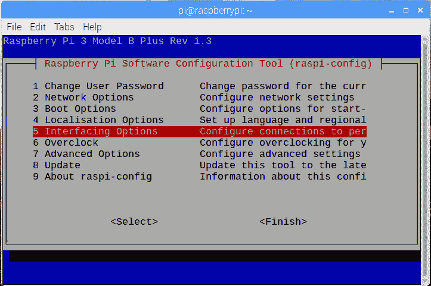](https://pyimagesearch.com/wp-content/uploads/2019/07/remote_development_raspbian_ssh_02.png)

**Figure 8:** Select *“5 Interfacing Options”* to find SSH and other interface settings for the Raspberry Pi. Once you turn on SSH you can begin remote development with your Raspberry Pi.

然后您将看到一些界面，其中一个是 SSH:

[](https://pyimagesearch.com/wp-content/uploads/2019/07/remote_development_raspbian_ssh_03.png)

**Figure 9:** SSH for Raspberry Pi can be turned on from the *“P2 SSH”* menu item.

将需要重新启动。从那里你可以使用 Raspberry Pi 的 IP 地址远程连接到它。要找到您的 RPi 的 IP 地址，只需使用`ifconfig`命令:

[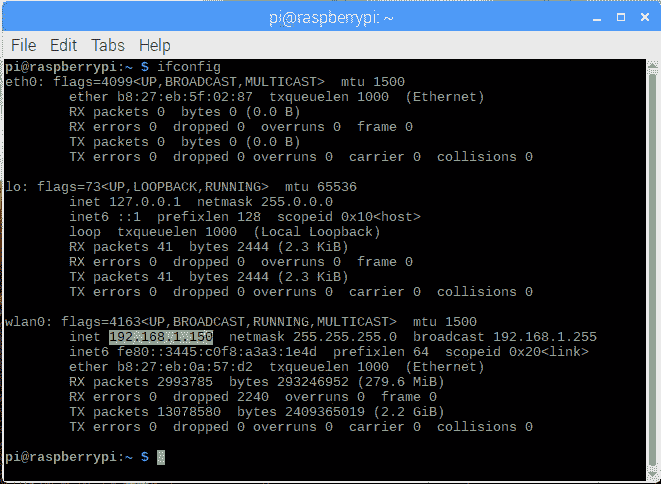](https://pyimagesearch.com/wp-content/uploads/2019/07/remote_development_raspbian_ifconfig.png)

**Figure 10:** To find the IP address of your Raspberry Pi, use the `ifconfig` command. Here my RPi is connected to my `wlan0` interface on the `192.168.1.150` IP.

另一种在你的网络上找到 Raspberry Pi 的方法是访问我们路由器的客户端页面。如果您当时没有将屏幕和键盘/鼠标连接到 RPi，这将非常有用。

### 虚拟网络计算(VNC)


**Figure 11:** VNC is a graphical way to connect to remote systems such as the Raspberry Pi or another computer on your network that has a desktop environment.

如果您在远程机器上工作时更喜欢图形用户界面(GUI)而不是命令行，那么您可以使用 VNC。

要使用 VNC，您需要:

*   远程机器上安装并运行的 VNC 服务器。
*   安装在本地计算机上的 VNC 客户端。
*   远程系统的 IP 地址、用户名和密码。

然而，请记住，VNC 假设您的远程系统上运行着 GUI/桌面管理器。

对于 Raspberry Pi，这是一个非常好的假设 RPi 在启动时启动一个窗口管理器(当然，前提是您使用的是 Raspbian 的标准安装)。

然而，对于远程服务器，比如 Amazon EC2 或 Microsoft Azure，*您可能没有窗口管理器*。

在这些情况下，你不能使用 VNC，而应该使用 SSH。

如何安装 VNC 服务器取决于你的操作系统，所以你需要自己研究一下(因为我不能为每个操作系统提供指导)。

也就是说，我已经为 Raspbian 和 Ubuntu 提供了 VNC 服务器的安装说明，这是你想安装 VNC 服务器的两个最流行的操作系统。

#### 在 Raspbian 上安装 VNC 服务器

对我们来说幸运的是，很容易让 VNC 运行 Raspbian 操作系统。

你有两个选择:

**选项 1:** 使用*桌面配置*更改设置:

参见**图 5** 打开*“树莓派配置”*用户界面。然后通过单选按钮启用 VNC:

[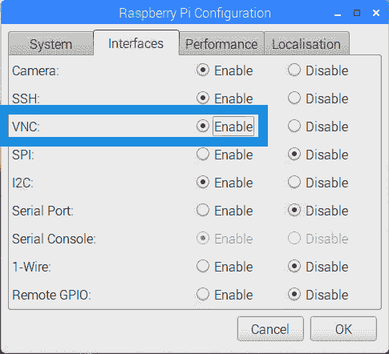](https://pyimagesearch.com/wp-content/uploads/2019/07/remote_development_raspbian_vnc_00.png)

**Figure 12:** Enabling VNC on the Raspberry Pi via the desktop user interface.

这种方法需要重新启动。

**选项 2:** 使用*命令行启用 VNC 服务器:*

在命令行运行`sudo raspi-config`(参见**图 7** )。

然后，导航到*“5 接口选项”*菜单项(参见**图 8** )。

最后，选择*“P3 VNC”:*

[](https://pyimagesearch.com/wp-content/uploads/2019/07/remote_development_raspbian_vnc_01.png)

**Figure 13:** Enabling VNC via the command line on the Raspberry Pi. We used the `raspi-config` command to open the configuration settings.

启用 VNC，重启后就可以运行了。

#### 在 Ubuntu 上安装 VNC 服务器

在 Ubuntu 上安装 VNC 服务器有多种方法。

**选项 1:** 鉴于我的偏好是**皇家 VNC** (对于服务器和客户端)，你可以从[安装他们的。deb 文件](https://www.realvnc.com/en/connect/download/vnc/linux/)为最简单的方法:

[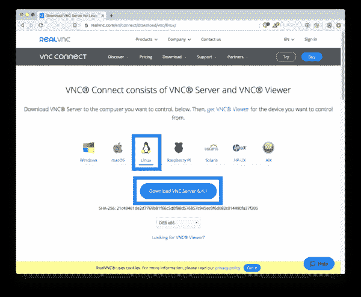](https://pyimagesearch.com/wp-content/uploads/2019/07/remote_development_ubuntu_vnc_server.png)

**Figure 14:** Installing the RealVNC branded VNC Server on Linux can be accomplished with their .deb package file.

要在 Ubuntu 中安装. deb 文件，可以双击文件浏览器/桌面中的图标。或者，你可以跑。命令行中的 deb 文件:

```py
$ sudo dpkg -i VNC-Server-6.4.1-Linux-x64.deb

```

另外，关于如何从命令行手动安装 VNC 服务器，网上有很多信息。

我不会在这里重复别人的安装指南，而是提供一些有前途的教程的链接:

*   [https://www . cyber Citi . biz/FAQ/install-and-configure-tigervnc-server-on-Ubuntu-18-04/](https://www.cyberciti.biz/faq/install-and-configure-tigervnc-server-on-ubuntu-18-04/)
*   [https://www . digital ocean . com/community/tutorials/how-to-install-and-configure-VNC-on-Ubuntu-18-04](https://www.digitalocean.com/community/tutorials/how-to-install-and-configure-vnc-on-ubuntu-18-04)

如果你找到一个你特别喜欢的通过命令行安装 VNC 的教程，请在这篇文章的评论部分分享。

#### realvnc 客户端

我首选的 VNC 客户端是适用于 macOS、Linux、Windows 和其他操作系统的 [**皇家 VNC**](https://www.realvnc.com/en/) 。

您可以使用此链接下载适合您系统的 [Real VNC 客户端。](https://www.realvnc.com/en/connect/download/viewer/)

一旦(1) VNC 服务器在您的远程机器上运行，并且(2)VNC 客户端在您的本地机器上运行，遵循图 11 中的步骤:

1.  输入远程机器的 IP 地址。
2.  输入远程系统上该帐户的用户名和密码。
3.  享受您的 VNC 连接！

从那里，您可以远程访问远程机器上的桌面和 GUI 管理器。

那么，有什么条件呢？

VNC 的问题是它由于网络延迟而很慢。即使在本地网络上，VNC 有时也会显得有点“落后”。

**我个人只在以下情况下使用 VNC:**

1.  我需要在本地网络上访问我的树莓派。
2.  我需要运行利用`cv2.imshow`的 Python 脚本，这样我就可以可视化输出。

如果你的网络连接比较强，可以使用 VNC 和`cv2.imshow`调用调试实时 Python 和 OpenCV 脚本；然而，如果您的连接很弱，并且您一直需要使用`cv2.imshow`，您应该简单地使用一个连接到您的“远程”机器的物理监视器。

### jupyter 笔记本

[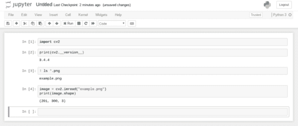](https://pyimagesearch.com/wp-content/uploads/2019/07/remote_development_jupyter_notebook.png)

**Figure 15:** Jupyter Notebooks are great environments if you can stay contained in your web browser. The community loves Jupyter Notebooks for sharing code demos. There are times when you’ll find that Jupyter limits your development, however.

Jupyter 笔记本已经成为 Python 开发的超级热门。

我鼓励你使用它们，**只要你明白 Jupyter 笔记本是*而不是*命令** **行的替代品——*它们只是你工具箱里的一个不同的工具*。**

仅仅因为你可以通过 Jupyter 笔记本执行命令和代码，并不意味着你可以忽略学习命令行(反之亦然)。

要成为一名全面发展的开发人员，你需要学习如何使用两个。

Jupyter 笔记本电脑的优势在于，您可以通过网络浏览器访问一个交互式的空闲环境，只需将网络浏览器指向运行在远程机器上的 Jupyter 笔记本电脑的 IP 地址/端口，就可以访问它。要使用 Jupyter 笔记本，您首先需要将它安装在您的远程计算机上:

```py
$ workon your_env_name
$ pip install jupyter

```

如果您使用的是 Python 虚拟环境(推荐)，您需要将 jupyter 包安装到您在其中使用 Jupyter 笔记本的任何 Python 环境中。

作为快速检查，您可以通过以下方式启动 jupyter 笔记本:

```py
$ jupyter notebook

```

如果您的笔记本在本地计算机上运行，并且您也在本地计算机上，您的 web 浏览器将自动启动。

[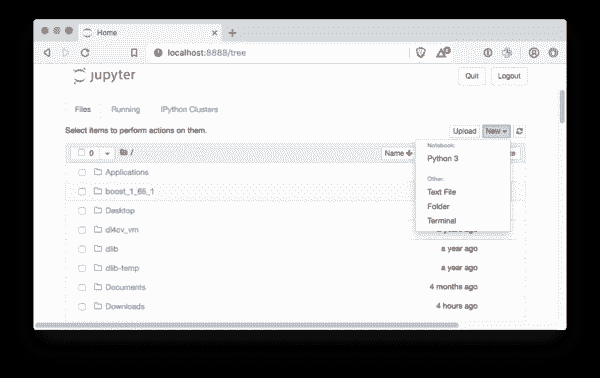](https://pyimagesearch.com/wp-content/uploads/2019/07/remote_development_jupyter.png)

**Figure 16:** To create a new Python Jupyter Notebook file, simply use the *“New”* menu in the corner. You may also launch a web-based terminal from this menu.

如果您的笔记本电脑正在远程运行，您需要启动网络浏览器，并在 URL 框中输入服务器 IP 地址和端口(`http://10.0.0.90:8888`)。

在那里，您可以通过点击*【新建】*和*【Python 3】*创建一个新的笔记本，如图**图 16** 所示。

您可以将 Python 代码或系统命令插入到*“Cells”*中的笔记本中。继续按下*“插入”* > *“在下方插入单元格”*几次。从那里，您可以正常地输入 Python 代码。系统命令以`!` 开头(参见图 15**的【3】中的*)。***

#### 在 Jupyter 中显示图像怎么样？

Jupyter 无权访问您的系统 GUI。

因此，`cv2.imshow`和任何其他 GUI 命令都不起作用。

如果你想在你的 Jupyter 笔记本上显示图片，我推荐你使用 matplotlib。

唯一需要注意的是，matplotlib 的默认显示通道顺序是 RGB。您可能知道，OpenCV 的默认名称是 BGR。因此，在 Jupyter 笔记本中使用 matplotlib 显示之前，您必须交换蓝色和红色通道(`cv2.cvtColor`)。这里有一个简单的例子:

[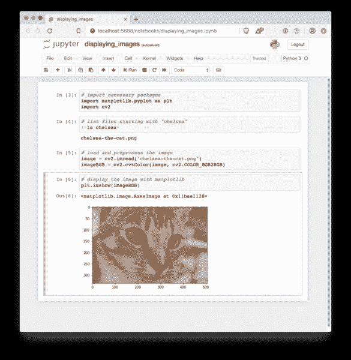](https://pyimagesearch.com/wp-content/uploads/2019/07/remote_development_jupyter_image.png)

**Figure 17:** Displaying images in Jupyter notebooks for remote computer vision development or developing tutorials.

要了解更多细节，请务必[参考我之前的帖子](https://pyimagesearch.com/2014/11/03/display-matplotlib-rgb-image/)。

### 将文件传输到远程机器或 Raspberry Pi

在本节中，您将学习如何将文件从您的主机传输到您的远程机器。

有许多方法可以完成这项任务，但我最喜欢的两种方法包括使用 SCP/SFTP 或使用远程安装的驱动器。

#### 手动 SCP 或 SFTP

[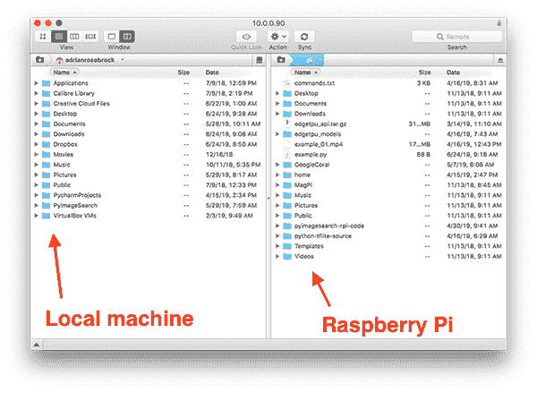](https://pyimagesearch.com/wp-content/uploads/2019/07/remote_development_transmit.png)

**Figure 18:** Transmit is a macOS app for uploading/downloading files to/from remote machines using FTP/SFTP.

如果你需要将文件转移到你的远程机器上(比如将与你购买的 [*计算机视觉树莓 Pi*](https://pyimagesearch.com/raspberry-pi-for-computer-vision/)相关的代码从你的笔记本电脑转移到你的 RPi 上)，**我强烈推荐使用 SCP/SFTP。**

如果您使用的是基于 Unix 的计算机，您可以使用 SCP 命令:

```py
$ scp foo.py username@ip_address:~/foobar_project

```

**我正在把一个名为`foo.py` *的文件从*本地机器*移动到*我的远程机器的`~/foobar_project`文件夹中。**

请注意我是如何提供文件名以及远程机器的 IP 地址和用户名的(密码是在我执行命令后提供的)。

**同样，我可以将文件从我的远程机器传输回我的本地机器:**

```py
$ scp username@ip_address:~/foobar_project/bar.py ~/foobar_project

```

该命令将名为`bar.py`的文件传输回本地机器的`~/foobar_project`文件夹中。

如果你更喜欢为 SCP/SFTP 使用基于 GUI 的程序，我会推荐使用 [FileZilla](https://filezilla-project.org/) (所有操作系统)或 [Transmit](https://www.panic.com/transmit/) for macOS ( **图 18** )。

使用这些程序，你可以简单地来回“拖放”文件。

当然 SCP 和 SFTP 最大的问题就是*手动*——**你无法*自动*来回传输文件**(至少不需要额外的命令)。

本教程的*“通过 IDE 远程开发 Python 脚本”*部分将向您展示如何将文件从您的主机自动传输到您的远程系统，但是现在，让我们来看看远程安装的驱动器。

#### 远程安装驱动器

[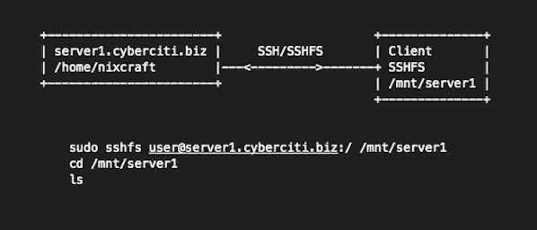](https://pyimagesearch.com/wp-content/uploads/2019/07/remote_development_sshfs.png)

**Figure 19:** Using the SSH file system (SSHFS) you can remotely mount a remote system and access its file system, just like you would on your host machine (i.e., via macOS Finder, the Ubuntu/Raspbian GUI, Windows Explorer, etc.). ([image source](https://www.cyberciti.biz/faq/how-to-mount-remote-directory-filesystems-with-sshfs-on-linux/))

我不是远程安装机器或驱动器的最大粉丝，但它们在这里值得一提。

使用 SSH 文件系统(SSHFS ),您可以远程挂载远程系统并访问其文件系统，就像在您的主机上一样(例如，通过 macOS Finder、Ubuntu/Raspbian GUI、Windows Explorer 等)。).

我经常遇到的远程安装设备的问题是:

1.  连接神秘地消失了。
2.  文件并不总是传输。

相反，如果我想要一个文件自动同步(比如当我保存/更新一个文件时)，我使用一个专用的 IDE，这正是我们将在下一节讨论的。

### 通过 IDE 远程开发 Python 脚本

在本节中，您将了解两个软件开发 ide，它们将使在远程机器上使用 Python 变得轻而易举。

#### 崇高的文本与 SFTP 插件

**[崇高文字](https://www.sublimetext.com/3)** 是一个流行的代码编辑器。

编辑器是免费的，但是你可以[购买一个可选的许可证](https://www.sublimetext.com/buy?v=3.0)(如果你发现自己在使用 Sublime Text，我建议你这么做——一定要支持那些开发你经常使用的软件的人！).

Sublime Text 的好处之一是它允许通过插件/包进行扩展。

对于远程开发你应该使用 **[崇高文本 SFTP 插件](https://codexns.io/products/sftp_for_sublime)** 。这个插件也是免费的，但有一个[可选付费版本](https://codexns.io/products/sftp_for_sublime/buy)(如果你经常使用 SFTP 插件，你应该考虑购买)。此处列出了插件的[安装说明](https://codexns.io/products/sftp_for_sublime/install)。

安装后，您可以启动 Sublime 文本编辑器:

[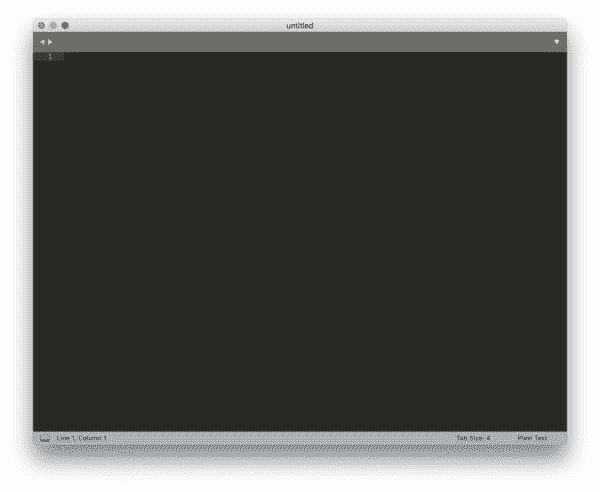](https://pyimagesearch.com/wp-content/uploads/2019/07/remote_development_sublime_text_001.jpg)

**Figure 20:** Sublime Text, a popular text/code editor can work with remote files using a plugin.

通过*“shift+command+p”*打开命令面板。

在那里，选择*“SFTP:设置服务器…”*:

[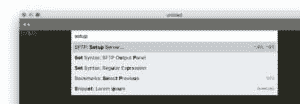](https://pyimagesearch.com/wp-content/uploads/2019/07/remote_development_sublime_text_002.jpg)

**Figure 21:** Selecting the SFTP setup via Sublime Text’s command palette.

然后会提示您一个 JSON 模板文件，其中包含您可以填写的选项。

[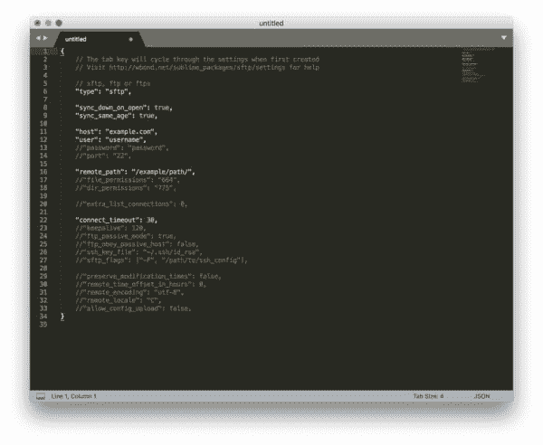](https://pyimagesearch.com/wp-content/uploads/2019/07/remote_development_sublime_text_003.jpg)

**Figure 22:** Sublime Text’s SFTP configuration file needs to be updated before you can connect to a remote system for development.

您需要将`host`和`user`编辑成您的远程机器的 IP 地址和用户名。如果您想避免每次都输入密码，也可以指定密码。

您还应该指定`remote_path`，这是您登录时的默认路径— **我通常建议将`remote_path`设置为用户主目录的路径。**

编辑后，我的 SFTP 配置如下所示:

[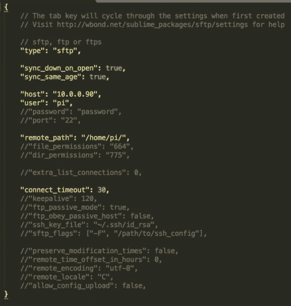](https://pyimagesearch.com/wp-content/uploads/2019/07/remote_development_sublime_text_004.jpg)

**Figure 23:** A custom Sublime Text SFTP configuration for a Raspberry Pi on my network.

接下来，保存文件:

[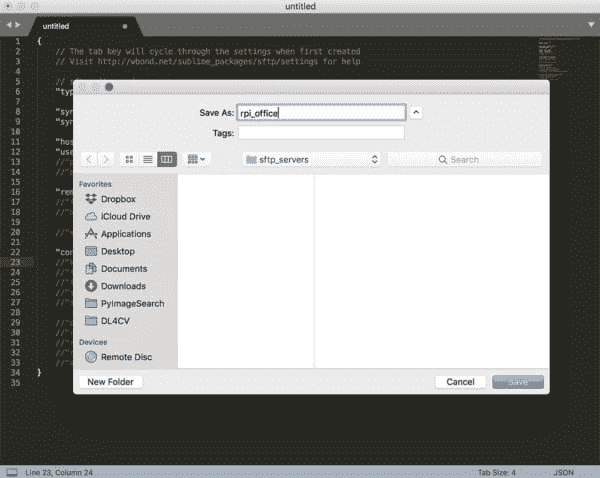](https://pyimagesearch.com/wp-content/uploads/2019/07/remote_development_sublime_text_005.jpg)

**Figure 24:** Saving the SFTP configuration with a name that I’ll recognize later if I want to work on this remote system using Sublime Text again.

请注意，一个对话框会提示我如何给文件命名。你应该给这个文件一个描述性的名字。在这里，我将我的文件命名为`rpi_office`，以表明这是我办公室里的树莓派。

保存文件后，我可以选择*“SFTP:浏览器服务器……”*(再次通过命令面板):

[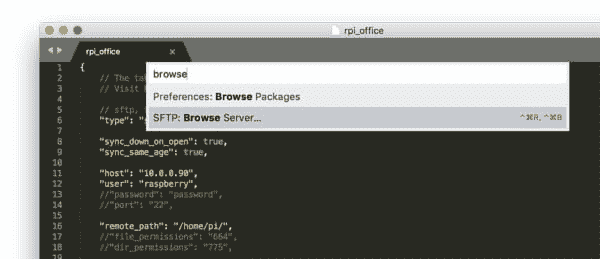](https://pyimagesearch.com/wp-content/uploads/2019/07/remote_development_sublime_text_006.jpg)

**Figure 25:** From the Sublime Text command palette, select “SFTP: Browse Server…” so that you can log in to a remote system and list files.

然后选择我的*“rpi _ office”*:

[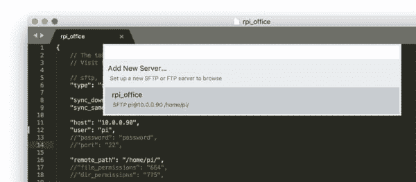](https://pyimagesearch.com/wp-content/uploads/2019/07/remote_development_sublime_text_007.jpg)

**Figure 26:** Selecting my “rpi_office” remote SFTP configuration in Sublime Text.

然后我输入我的密码，进入了`/home/pi`目录。

在那里，我选择*“文件夹操作”*，然后选择*“新文件”*，创建一个名为`test.py`的新文件:

[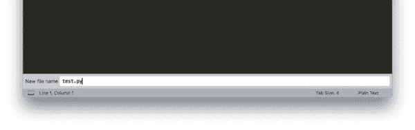](https://pyimagesearch.com/wp-content/uploads/2019/07/remote_development_sublime_text_008.jpg)

**Figure 27:** Creating plus naming a new file called `test.py` on a remote system (Raspberry Pi) via the Sublime Text SFTP plugin.

然后我可以保存这个文件，它的内容会在 Raspberry Pi 上自动更新。

从 SSH 连接执行脚本，您可以看到文本*“您好，PyImageSearch Reader！”*显示在我的终端上(再次注意，代码本身是在 Raspberry Pi 上执行的，而不是在我的本地机器上)。

[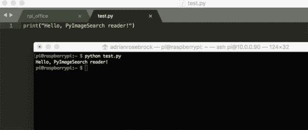](https://pyimagesearch.com/wp-content/uploads/2019/07/remote_development_sublime_text_009.jpg)

**Figure 28:** As you can see, I’m SSH’ed into my remote Raspberry Pi. I’ve executed the Python script that was just saved to the remote system automatically via Sublime Text’s SFTP plugin.

#### 给 Amazon EC2 用户的一个快速提示

如果您使用 Amazon EC2 或任何其他需要 SSH 密钥的认证方法，您需要在服务器设置期间编辑`sftp_flags`选项。

具体来说，您会希望编辑成如下所示:

[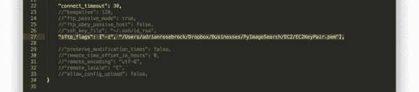](https://pyimagesearch.com/wp-content/uploads/2019/07/remote_development_sublime_text_010.jpg)

**Figure 29:** Using Sublime Text’s SFTP plugin with Amazon EC2 systems requires that you insert the path to your encryption key (.pem file) in your configuration.

注意我是如何更新`sftp_flags`来包含`-i`选项的，后面是我的 SSH 密钥的路径。SFTP 插件然后知道使用这个文件来执行正确的认证。

***注意:*** *当你在本地机器上编辑远程代码时，你的系统会自动生成/下载你在屏幕上看到的临时文件。当您“保存”您的代码时，它会自动更新到远程机器。如果您还需要本地系统上的这些文件，我建议您使用 SCP/SFTP 来传输这些文件。您也可以使用 Sublime 中的“另存为”命令在本地保存文件。*

### 具有自动上传部署的 PyCharm

如果你正在寻找一个更加成熟的 IDE，我推荐使用 **[PyCharm](https://www.jetbrains.com/pycharm/)** ，它已经成为 Python IDEs 事实上的标准。

我是 PyCharm 的超级粉丝，如果我的 Python 代码跨越了 1-2 个以上的文件，我倾向于使用 PyCharm 而不是 Sublime Text。也就是说，PyCharm 是一个*大的*IDE——它是*而不是*小的和最小的，就像 Sublime Text 一样。

与 Sublime Text 类似，我们也可以将 PyCharm 配置为:

1.  使用远程 Python 解释器(包括远程机器上的 Python 虚拟环境)。
2.  自动传输编辑过的文件，确保代码在远程机器上得到更新。

这个功能要求你已经安装了**py charm Professional**([点击这里查看 **PyCharm Professional**](https://www.jetbrains.com/pycharm/features/editions_comparison_matrix.html) 的功能和好处)。

假设您已经安装了 PyCharm，让我们创建一个执行自动上传部署的项目。

首先创建一个新项目:

[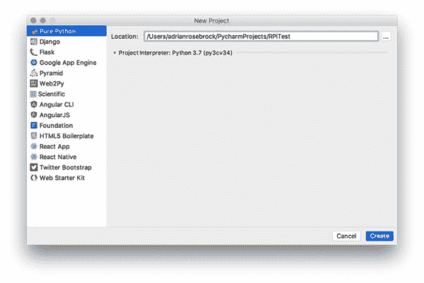](https://pyimagesearch.com/wp-content/uploads/2019/07/remote_development_pycharm_001.jpg)

**Figure 30:** Creating a new project in PyCharm locally prior to setting it up for remote development.

我将这个项目命名为*“rpi test”*。**

然后，您需要扩展*“项目解释器”*选项，以扩展 Python 解释器选项:

[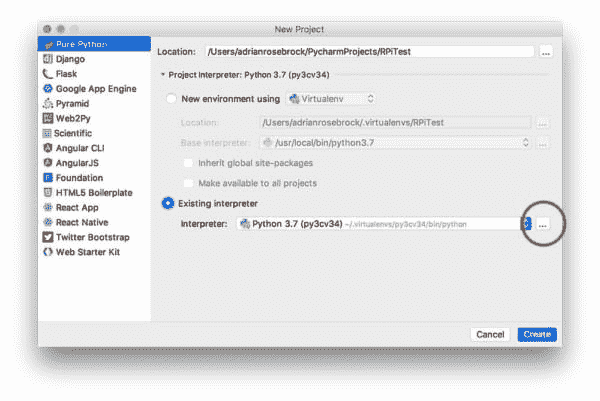](https://pyimagesearch.com/wp-content/uploads/2019/07/remote_development_pycharm_002.jpg)

**Figure 31:** In PyCharm, select *“Python Interpreter”* to configure the Python environment for the project.

选择*“现有解释器”*单选按钮，然后点击*“…”*，将打开一个类似如下的新窗口:

[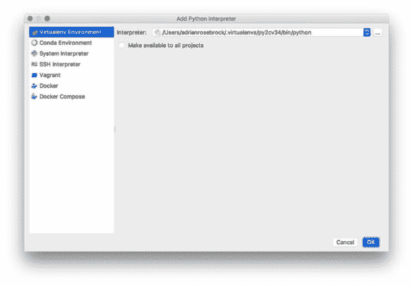](https://pyimagesearch.com/wp-content/uploads/2019/07/remote_development_pycharm_003.jpg)

**Figure 32:** Select the *“Existing Interpreter”* option in PyCharm.

选择*“SSH 解释器”*选项，然后选择*“新服务器配置”*:

[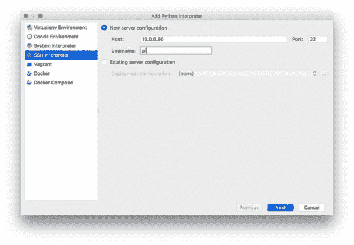](https://pyimagesearch.com/wp-content/uploads/2019/07/remote_development_pycharm_004.jpg)

**Figure 33:** Select *“New server configuration”* and enter the IP address, and username of the remote system.

在这里，我已经输入了 IP 地址和用户名我的树莓派。

点击*“下一步”*按钮，然后输入您的服务器的密码:

[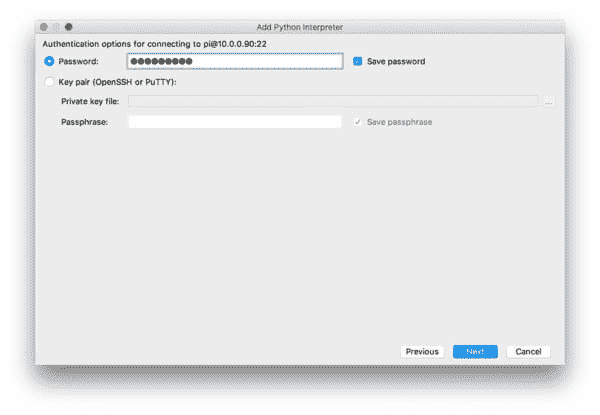](https://pyimagesearch.com/wp-content/uploads/2019/07/remote_development_pycharm_005.jpg)

**Figure 34:** Enter your remote system’s password and ensure that you save the password (checkbox) so that you don’t need to enter it upon each save.

确保您选中了*“保存密码”*复选框，以确保您的密码被保存，否则每次您想要保存/修改文件时，您都必须重新输入密码(这将变得非常令人沮丧和乏味)。

下一个窗口将提示您选择一个 Python 解释器，默认为`/usr/bin/python`:

[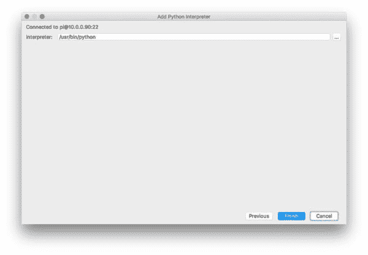](https://pyimagesearch.com/wp-content/uploads/2019/07/remote_development_pycharm_006.jpg)

**Figure 35:** Be sure to select the virtual environment on the remote system that you’d like to use as your Python interpreter.

由于我们使用的是 Python 虚拟环境，我们应该点击*“…”*并导航到`/home/pi/.virtualenvs/py3cv3/bin/python`目录中的`python`二进制文件:

[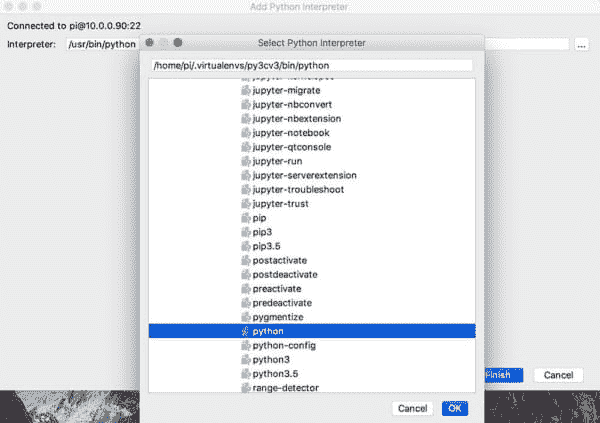](https://pyimagesearch.com/wp-content/uploads/2019/07/remote_development_pycharm_007.jpg)

**Figure 36:** Navigate to the Python executable within the appropriate .virtualenvs folder to select your remote interpreter.

选择*“确定”*确认 Python 虚拟环境选择。注意 Python 解释器路径现在已经更新为`/home/pi/.virtualenvs/py3cv3/bin/python`。单击“完成”按钮，完成 Python 虚拟环境的创建。

PyCharm 现在将向我们提供关于我们的*“现有口译员”*以及*“远程项目位置”*的详细信息:

[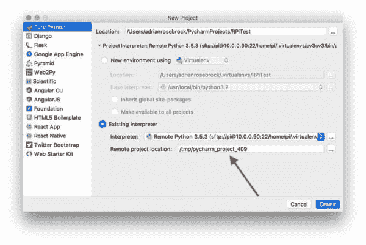](https://pyimagesearch.com/wp-content/uploads/2019/07/remote_development_pycharm_008.jpg)

**Figure 37:** Be sure to edit the PyCharm *“Remote project location”* under the *“Existing Interpreter”* section so that your project files are stored in a known location.

然而，我们不希望我们的项目生活在树莓派的`/tmp/pycharm_project_409`里。**相反，我们希望这个项目存在于`/home/pi/RPiTest`。**要进行更新，您可以使用*“…”*按钮进行导航，或者直接在字段中手动输入路径。

点击*“创建”*按钮，然后 PyCharm IDE 将加载:

[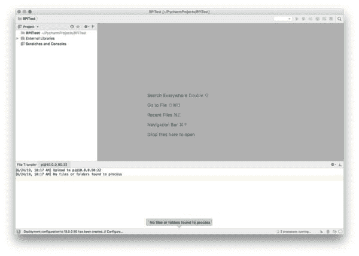](https://pyimagesearch.com/wp-content/uploads/2019/07/remote_development_pycharm_009.jpg)

**Figure 38:** PyCharm Professional has now been configured for remote development over an SSH/SFTP connection.

PyCharm 在您的 Raspberry Pi 上索引 Python 虚拟环境和项目文件可能需要 5-10 分钟，请耐心等待。

让我们向项目添加一个新文件。

右键单击项目中的 RPiTest 目录，然后选择*【新建】**【文件】*:

[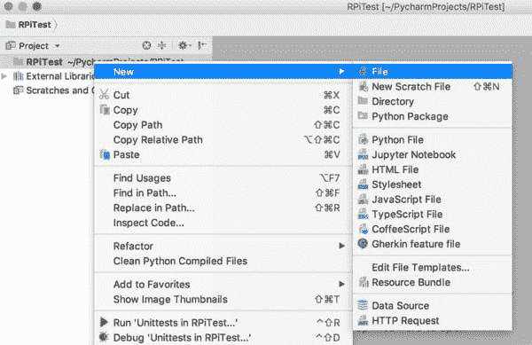](https://pyimagesearch.com/wp-content/uploads/2019/07/remote_development_pycharm_010.jpg)

**Figure 39:** Adding a new Python file to our PyCharm remote project.

我们将这个文件命名为`pycharm_test.py`:

[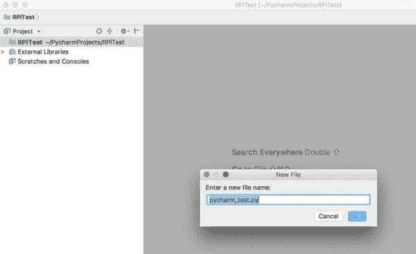](https://pyimagesearch.com/wp-content/uploads/2019/07/remote_development_pycharm_011.jpg)

**Figure 40:** Saving a Python script on a remote machine via PyCharm called `pycharm_test.py`.

我已经更新了该文件，以包含以下代码:

[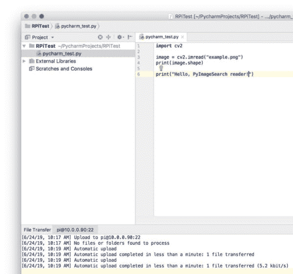](https://pyimagesearch.com/wp-content/uploads/2019/07/remote_development_pycharm_012.jpg)

**Figure 41:** A test script was developed and saved to a remote system via PyCharm.

注意 PyCharm 是如何指示文件已经被**自动上传到 Raspberry Pi 的。您可以通过终端登录 Raspberry Pi 并检查文件内容来验证文件是否已自动上传:**

**[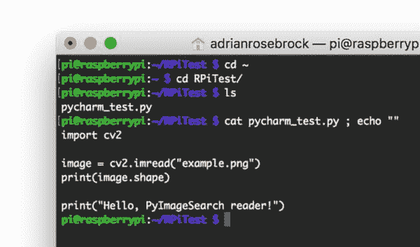](https://pyimagesearch.com/wp-content/uploads/2019/07/remote_development_pycharm_013.jpg)

**Figure 42:** Over an SSH connection in my terminal, I’ve verified that after saving a file via PyCharm to my remote Raspberry Pi, that the file is, in fact, updated.

谈到远程 Python 开发，很难用自动上传来击败 PyCharm。

是的，这涉及到更多的步骤(至少与配置 Sublime 文本相比)，但是一旦你让它工作起来，*这是非常值得的！*

***注意:*** *当你在本地机器上编辑远程代码时，你的系统会自动生成/下载你在屏幕上看到的临时文件。当您“保存”您的代码时，它会自动更新到远程机器。*

### 通过命令行执行代码

当执行远程 Python 开发时，我个人的建议是:

1.  在启用自动 SFTP 的情况下，使用**崇高文本**或 **PyCharm** 。
2.  使用 SSH 通过**命令行执行我的 Python 脚本。**

你可以自由选择你喜欢的选项。也许你喜欢用 Jupyter 笔记本。或者也许你觉得使用手动 SFTP 上传你有更多的控制权。所有选项都没问题，只是你自己的喜好问题。

也就是说，我将向您快速演示如何通过 SSH 命令行执行脚本。

首先，我将使用 SSH 登录到我的 Raspberry Pi(或 AWS 服务器):

```py
$ ssh pi@192.168.1.150
$ ls *.py
simple_example.py

```

我已经列出了我的主目录的内容，并且看到我已经有了一个名为`simple_example.py`的文件。

我想编辑这个文件，所以我也要通过 Sublime Text 登录并打开它:

[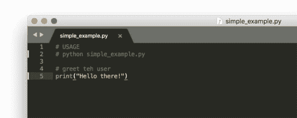](https://pyimagesearch.com/wp-content/uploads/2019/07/remote_development_simple_example_editor.jpg)

**Figure 43:** I’ve opened a file on my remote system using Sublime Text’s SFTP plugin. Now we’re going to edit the file an execute it.

这里你可以看到`simple_example.py`现在已经在 Sublime Text 中打开了。

我将借此机会编辑这个文件，并包含一个[命令行参数](https://pyimagesearch.com/2018/03/12/python-argparse-command-line-arguments/) —代码清单现在看起来像这样:

```py
# import the necessary packages
import argparse

# construct the argument parser and parse the arguments
ap = argparse.ArgumentParser()
ap.add_argument("-n", "--name", help="your name")
args = vars(ap.parse_args())

# greet the user
print("Hello there, {}!".format(args["name"]))

```

我通过 Sublime Text 保存文件，然后切换回我的终端。然后，我可以通过以下方式执行 Python 脚本:

```py
$ python simple_example.py --name Adrian
Hello there, Adrian!

```

请注意我是如何[向脚本](https://pyimagesearch.com/2018/03/12/python-argparse-command-line-arguments/)提供命令行参数的——我们在 PyImageSearch 上经常使用命令行参数，所以请确保您现在花时间了解它们是如何工作的。

另外，请注意脚本不是在我的本地机器上执行的，而是在远程 Raspberry Pi 上执行的。

## 摘要

在本教程中，当在 Raspberry Pi、Amazon EC2 或任何其他远程服务器实例上执行远程 Python 开发时，您会发现我的个人建议。

当您连接到机器时，我推荐使用:

*   嘘
*   VNC
*   jupyter 笔记本

远程编辑代码时，我建议您使用:

*   崇高的文本与 SFTP 插件
*   具有自动上传部署的 PyCharm

我个人倾向于通过 Sublime Text 或 PyCharm 编辑代码，然后通过 SSH +命令行执行。也就是说，你应该花时间尝试每一个选项。一种方法并不总是比其他方法更好，你可能会发现在大多数情况下你更喜欢一种方法——这完全没问题！

请记住，这些都是你工具箱中的工具，学会如何使用它们，你会有更多的工具可供你使用。

我希望你喜欢这个教程！

**为了在 PyImageSearch 上发布未来教程时得到通知(并获得我的免费计算机视觉和深度学习资源指南)，*只需在下表中输入您的电子邮件地址！*****