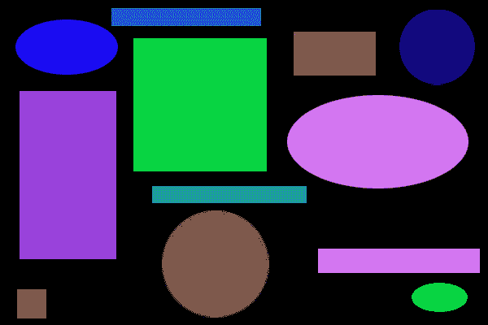
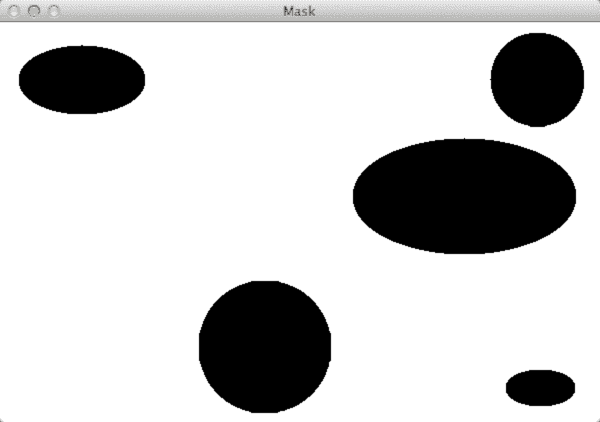
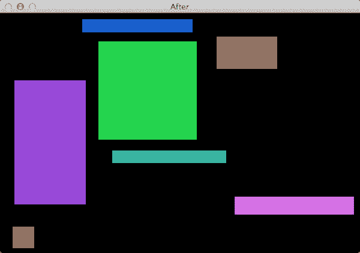

# 使用 Python 和 OpenCV 从图像中移除轮廓

> 原文：<https://pyimagesearch.com/2015/02/09/removing-contours-image-using-python-opencv/>

[](https://pyimagesearch.com/wp-content/uploads/2015/01/remove_contours_header.png)

不久前，我在浏览 [/r/computervision](http://www.reddit.com/r/computervision/) 时，偶然发现一个问题，问[如何使用 OpenCV](http://www.reddit.com/r/computervision/comments/2rhg3h/opencv_how_to_remove_contours_from_image/) 从图像中移除轮廓。

出于好奇，我发了一个回复。从图像中移除轮廓的基本算法是这样的:

*   **第一步:**检测并找到图像中的轮廓。
*   **第二步:**逐个循环遍历轮廓。
*   **第三步:**根据某种标准确定轮廓是否“坏”并且应该被去除。
*   **第四步:**积累一个要去除的“坏”轮廓的蒙版。
*   **第五步:**使用逐位“与”运算将累积的坏轮廓掩模应用于原始图像。

就是这样！

该算法本身非常简单，你需要注意和考虑的主要步骤是**步骤 3** ，确定是否应该移除一个轮廓。

这一步可能非常简单，也可能非常困难，具体取决于您的应用。虽然我无法猜测为什么要从图像中移除轮廓区域的标准，但这篇博文的剩余部分将展示一个玩具示例，您可以用它来从图像中移除轮廓。从这里开始，您将能够根据自己的需要使用这段代码并修改轮廓移除标准。

**OpenCV 和 Python 版本:**
这个例子将在 **Python 2.7/Python 3.4+** 和 **OpenCV 2.4.X** 上运行。

# 使用 Python 和 OpenCV 从图像中移除轮廓

[](https://pyimagesearch.com/wp-content/uploads/2015/01/shapes.png)

**Figure 1:** Our example toy image. Our goal is to **remove all circles/ellipses** while **retaining the rectangles.**

在这个玩具示例中，我们的目标是**从**上方的图像中移除圆形/椭圆形****，同时保留矩形。我们将通过对每个轮廓应用一个测试来决定它是否应该被删除来完成这个任务。

无论如何，让我们开始这个例子。打开一个新文件，命名为`remove_contours.py`，让我们开始编码:

```py
# import the necessary packages
import numpy as np
import imutils
import cv2

def is_contour_bad(c):
	# approximate the contour
	peri = cv2.arcLength(c, True)
	approx = cv2.approxPolyDP(c, 0.02 * peri, True)

	# the contour is 'bad' if it is not a rectangle
	return not len(approx) == 4

```

我们要做的第一件事是导入我们需要的包。我们将使用 NumPy 进行数值处理，使用`cv2`进行 OpenCV 绑定。

然后我们在第 6 行的**上定义我们的`is_contour_bad`函数。该函数处理上述**步骤 3** 的执行，并定义一个轮廓应被标记为“坏”并从图像中移除的标准。**

`is_contour_bad`函数需要一个参数`c`，这是我们将要测试的轮廓，以确定它是否应该被移除。

请记住，在上面的玩具示例图像中，我们的目标是移除圆形/椭圆形，同时保持矩形完整。

因此，让我们花点时间考虑一下是否可以利用这个问题的几何学。

长方形有四条边。圆没有边。

所以如果我们 ***近似轮廓*** ，然后 ***检查近似轮廓*** 内的点数，我们就能确定轮廓是否是正方形！

而这正是**行 7-11** 所做的。我们首先在**的第 8 行和第 9 行**上近似轮廓，而**的第 12 行**返回一个布尔值，指示是否应该移除轮廓。在这种情况下，如果近似有 4 个点(顶点)，轮廓将保持不变，表明轮廓是一个矩形。

让我们完成解决这个问题的其他步骤:

```py
# load the shapes image, convert it to grayscale, and edge edges in
# the image
image = cv2.imread("shapes.png")
gray = cv2.cvtColor(image, cv2.COLOR_BGR2GRAY)
edged = cv2.Canny(gray, 50, 100)
cv2.imshow("Original", image)

# find contours in the image and initialize the mask that will be
# used to remove the bad contours
cnts = cv2.findContours(edged.copy(), cv2.RETR_LIST, cv2.CHAIN_APPROX_SIMPLE)
cnts = imutils.grab_contours(cnts)
mask = np.ones(image.shape[:2], dtype="uint8") * 255

# loop over the contours
for c in cnts:
	# if the contour is bad, draw it on the mask
	if is_contour_bad(c):
		cv2.drawContours(mask, [c], -1, 0, -1)

# remove the contours from the image and show the resulting images
image = cv2.bitwise_and(image, image, mask=mask)
cv2.imshow("Mask", mask)
cv2.imshow("After", image)
cv2.waitKey(0)

```

为了找到并检测我们图像中的轮廓(**步骤 1** )，我们在**第 16-19 行**对我们的图像进行预处理，从磁盘加载，将其转换为灰度并检测边缘。

通过调用`cv2.findContours`，在**行 23** 找到实际轮廓。随后，我们用不同版本的 OpenCV 处理抓取轮廓(**第 24 行**)。

然后我们初始化第 25 行**上的`mask`来存储我们累积的“坏”轮廓。我们将在后面的代码中使用这个掩码和位运算来执行轮廓的实际移除。**

现在，我们可以继续进行**步骤 2** ，在**线 28** 上的各个轮廓上循环。

对于每个轮廓，我们调用第 30 行**上的`is_contour_bad`，如果轮廓确实是“坏的”，那么我们通过在掩膜上绘制轮廓，在第 31** 行**上累积要移除的轮廓。**

最后，我们所要做的就是使用累积蒙版对图像进行逐位“与”运算，去除第 34 行上的轮廓。**第 35-37 行**然后显示我们的结果。

# 结果

要执行我们的脚本，只需发出以下命令:

```py
$ python remove_contours.py

```

首先，你会看到我们的积累轮廓的面具将被删除:

[](https://pyimagesearch.com/wp-content/uploads/2015/01/remove_contours_mask.png)

**Figure 2:** Our accumulated mask of contours to be removed. Shapes to be removed appear as **black** whereas the regions of the image to be retained are **white**.

注意轮廓是如何在*白色背景*上显示为*黑色形状*。这是因为一旦我们应用`cv2.bitwise_and`功能，黑色形状将从原始图像中移除，而白色区域将被保留。

下面是应用累积遮罩后的输出:

[](https://pyimagesearch.com/wp-content/uploads/2015/01/remove_contours_output.png)

**Figure 3:** We have successfully removed the circles/ellipses while retaining the rectangles.

显然，我们已经删除了图像中的圆形/椭圆形，同时保留了矩形！

# 摘要

在这篇博文中，我展示了如何使用 Python 和 OpenCV 从图像中移除轮廓区域。从图像中移除轮廓非常简单，可以通过以下 5 个步骤完成:

1.  检测和寻找图像中的轮廓。
2.  分别在每个轮廓上循环。
3.  应用某种“测试”来确定是否应该移除轮廓。
4.  累积要移除的轮廓的掩模。
5.  将遮罩应用于原始图像。

要将这种算法应用到你自己的图像上，你需要花点时间考虑第三步，并确定你用来去除轮廓的标准。从那里，您可以按原样应用算法的其余部分。