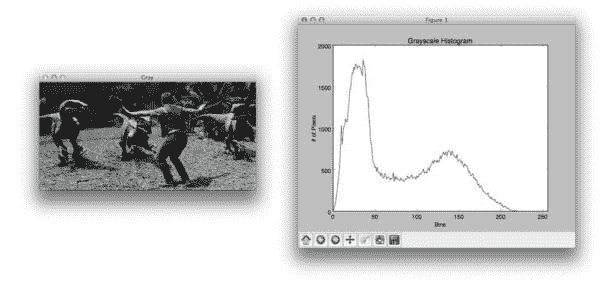
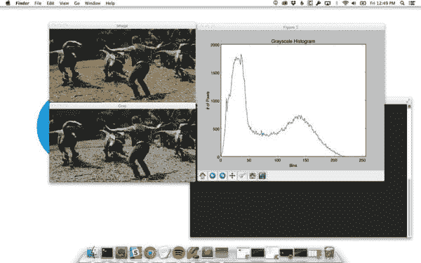
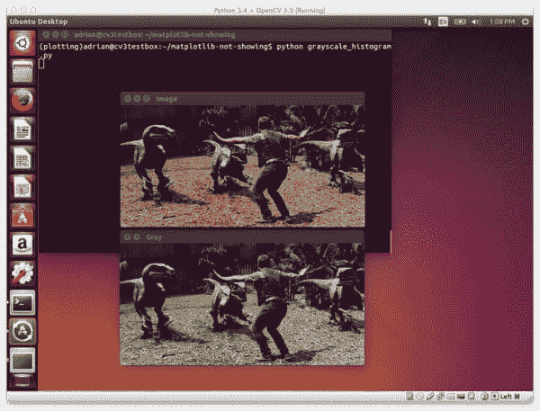
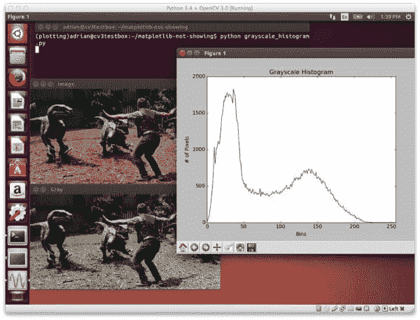

# 已解决:Matplotlib 图形不显示或不显示

> 原文：<https://pyimagesearch.com/2015/08/24/resolved-matplotlib-figures-not-showing-up-or-displaying/>

[](https://pyimagesearch.com/wp-content/uploads/2015/07/matplotlib_osx_vs_ubuntu.jpg)

我认为这篇博文更好的标题可能是: ***我如何因为 Ubuntu、虚拟环境、matplotlib 和渲染后端而损失了一天的生产力。***

周末，我在我的 Ubuntu 系统上玩深度学习，并绘制了我的分类器的准确度分数。我使用 [matplotlib](http://matplotlib.org/) 编写了一个快速的 Python 脚本，执行了脚本**，只是为了不让图形显示在我的屏幕上**。

我的脚本执行得很好。没有错误消息。没有警告。 ***但是还是没有发现阴谋！***

这实际上是我在过去几个月遇到的一个常见问题，*尤其是在使用基于 Debian 的操作系统如 Ubuntu 和 Raspbian 时。当通过 [virtualenv](https://virtualenv.pypa.io/en/latest/) 和 [virtualenvwrapper](https://virtualenvwrapper.readthedocs.org/en/latest/) 软件包利用虚拟环境时，这个问题只会变得更加复杂。*

这个问题实际上源于 matplotlib 后端没有正确设置，或者在编译和安装 matplotlib 时缺少依赖关系。幸运的是，经过大量的试验和错误(花了一整天的时间试图找到一个解决方案)，我已经能够解决这个问题，并在 Ubuntu 和 Raspbian 操作系统上(以及使用 Python 虚拟环境时)让 matplotlib 图形出现在我的屏幕上。

虽然这篇文章与计算机视觉或 OpenCV 不完全相关，但我仍然想与其他 PyImageSearch 读者分享我的经验和解决方案。Matplotlib 是 Python 科学界广泛使用的一个包，我希望这篇文章能帮助其他读者解决这个奇怪且难以确定的问题。

# 搭建舞台

让我们开始布置舞台吧。

*   我们使用的是基于 Debian 的操作系统，比如 Ubuntu 或 Raspbian。
*   我们(可选地)通过 virtualenv 和 virtualenvwrapper 利用 Python 虚拟环境。
*   我们的目标是拍摄下面的图像*(左)*，并使用 matplotlib *(右)*为其计算灰度像素强度直方图:

[](https://pyimagesearch.com/wp-content/uploads/2015/07/matplotlib_histogram_example.jpg)

**Figure 1:** Our end goal is to utilize matplotlib to display a grayscale pixel intensity for the image on the left.

由于我们正在使用 [matplotlib](http://matplotlib.org/) ，让我们创建一个名为`plotting`的新虚拟环境:

```py
$ mkvirtualenv plotting

```

现在我们在`plotting`环境中，让我们安装`numpy`、`scipy`和`matplotlib`:

```py
$ pip install numpy
$ pip install scipy
$ pip install matplotlib

```

太棒了——我们所有的 Python 依赖项都已安装。现在，让我们编写几行代码来加载图像，将其转换为灰度图像，计算灰度图像的直方图，最后将其显示在屏幕上。我将把所有这些代码放到一个名为`grayscale_histogram.py`的文件中:

```py
# import the necessary packages
from matplotlib import pyplot as plt
import cv2

# load the image, convert it to grayscale, and show it
image = cv2.imread("raptors.jpg")
gray = cv2.cvtColor(image, cv2.COLOR_BGR2GRAY)
cv2.imshow("Image", image)
cv2.imshow("Gray", gray)
cv2.waitKey(0)

# construct a grayscale histogram
hist = cv2.calcHist([gray], [0], None, [256], [0, 256])

# plot the histogram
plt.figure()
plt.title("Grayscale Histogram")
plt.xlabel("Bins")
plt.ylabel("# of Pixels")
plt.plot(hist)
plt.xlim([0, 256])
plt.show()
cv2.waitKey(0)

```

这里的代码相当简单。**1、2 号线**导入`matplotlib`和`cv2`。然后，我们加载我们的图像并将其转换为灰度(**第 4-9 行**)。从那里，`cv2.calcHist`函数被用来计算灰度像素强度的直方图。最后，**第 14-22 行**使用`matplotlib`绘制直方图。

要执行我们的脚本，我们需要做的就是启动 shell 并发出以下命令:

```py
$ python grayscale_histogram.py

```

当我在`plotting`虚拟环境中的 OSX 机器上执行代码时，直方图被计算出来，灰度图像和直方图都显示在我的屏幕上:

[](https://pyimagesearch.com/wp-content/uploads/2015/07/matplotlib_osx_plotting.jpg)

**Figure 2:** Using OSX, I can successfully plot and display my grayscale histogram using matplotlib.

然而，当我回到我的 Ubuntu 14.04 机器并执行*完全相同的代码*时，我看到的只是我的图像:

[](https://pyimagesearch.com/wp-content/uploads/2015/07/matplotlib_ubuntu_not_showing.jpg)

**Figure 3:** I have executed the *exact same* code on my Ubuntu system in the plotting virtual environment. All I see are my images — *where did my histogram go?* Why is there no error message?

这就引出了问题:*“**直方图在哪里？”***

正如我们从终端输出中看到的，脚本执行得很好。未显示任何错误。没有警告信息打印到我的控制台。 ***但是还没有剧情！***

# 已解决:Matplotlib 图形不显示或不显示

正如我在这篇文章的前面所暗示的，丢失数字的问题与 matplotlib 后端有关，它在幕后完成了准备数字的所有繁重工作。

进入 shell 后，我可以使用`matplotlib.get_backend()`访问 matplotlib 后端:

```py
$ python
Python 3.4.0 (default, Apr 11 2014, 13:05:11) 
[GCC 4.8.2] on linux
Type "help", "copyright", "credits" or "license" for more information.
>>> import matplotlib
>>> matplotlib.get_backend()
'agg'

```

在我的 Ubuntu 机器上，这给了我一个值`agg`；但通过我的测试调试，对于 TkInter 窗口系统，这个值需要是`TkAgg`(至少在使用 Ubuntu 和 Raspbian 时)。

幸运的是，我们可以通过使用`apt-get`安装几个库来解决这个问题:

```py
$ sudo apt-get install tcl-dev tk-dev python-tk python3-tk

```

但是我们还没有完成。为了让 matplotlib 识别 TkInter GUI 库，我们需要:

*   **第一步:**通过`workon plotting`访问我们的`plotting`虚拟环境。
*   **第二步:**使用 pip 来 ***卸载*** `matplotlib`(因为我们在本文前面已经通过 pip 安装了)。
*   **第三步:**从 GitHub repo 中下拉 [matplotlib。](https://github.com/matplotlib/matplotlib.git)
*   **第四步:**使用`setup.py`从源代码安装`matplotlib`。

我可以使用以下命令完成这些步骤:

```py
$ workon plotting
$ pip uninstall matplotlib
$ git clone https://github.com/matplotlib/matplotlib.git
$ cd matplotlib
$ python setup.py install

```

同样，在执行这些步骤之前，您需要确保已经通过`apt-get`安装了 TkInter。

在通过源代码安装了`matplotlib`之后，让我们再次执行`get_backend()`函数:

```py
$ python
Python 3.4.0 (default, Apr 11 2014, 13:05:11) 
[GCC 4.8.2] on linux
Type "help", "copyright", "credits" or "license" for more information.
>>> import matplotlib
>>> matplotlib.get_backend()
'TkAgg'

```

果然，我们现在看到`TkAgg`正被用作`matplotlib`后端。

***注意:*** *你可以通过调用`matplotlib.use("TkAgg")`来明确指示`matplotlib`使用`TkAgg`后端；然而，如果没有安装 TkInter 依赖项，这不会给你带来太多好处。*

现在，当我们执行我们的`grayscale_histogram.py`脚本时，就像上面一样:

```py
$ python grayscale_histogram.py

```

***我们现在应该看到我们的灰度图像和直方图:***

[](https://pyimagesearch.com/wp-content/uploads/2015/07/matplotlib_ubuntu_showing.jpg)

**Figure 4:** Success! Our matplotlib figure is now showing up! All we need to do was change the matplotlib backend.

我们现在已经修复了我们的问题— matplotlib 数字成功地显示在我们的屏幕上！

诚然，这种解决方案有点棘手，但它相当简单，可以完成工作。如果您有任何其他建议或意见，请随时在评论区留下。

# 树莓派怎么样？

Raspbian 操作系统，许多 Raspberry Pi 运行的，是基于 Debian 的，就像 Ubuntu 一样。如果你有同样的问题，matplotlib 图形不能在你的 Raspberry Pi 上显示，这篇博文中详细描述的修复方法将解决你的绘图问题。

# 不能直接通过 apt-get 安装 matplotlib 吗？

精明的 Debian 用户可能想知道为什么我不简单地通过`apt-get`安装`matplotlib`，就像这样:

```py
$ sudo apt-get install python-matplotlib

```

原因是因为我是 Python 虚拟环境 的 ***重度用户，并且坚信保持我的 Python 环境的隔离和相互独立。如果你使用`apt-get`来安装`matplotlib`，你就失去了对你想要安装的`matplotlib`版本的控制——你只需要使用`apt-get`库中的任何版本。这也使你的 Python 系统安装变得混乱，我试图保持它尽可能的干净。***

也就是说，每次我通过`apt-get`安装了`matplotlib`之后，我所有的依赖项都被正确地安装了，我可以毫无问题地显示我的数据，所以如果你不关心 Python 虚拟环境，那么`apt-get`解决方案是一个不错的选择。但是，我还是建议使用虚拟环境。

# 摘要

在这篇博文中，我详细介绍了如何解决一个棘手的问题，即`matplotlib`数字无法显示在屏幕上。此问题的症状包括清晰的脚本执行(即没有错误消息和警告)打印到您的终端，但您的绘图没有显示。我在使用基于 Debian 的操作系统如 Ubuntu 和 Raspbian 时经常遇到这个问题。当使用 Python 虚拟环境时，这个问题只会变得更加复杂。

解决这个`matplotlib`问题需要通过`apt-get`手动安装依赖项，并调整 [matplotlib 后端](http://matplotlib.org/faq/usage_faq.html#what-is-a-backend)以使用`TkAgg`，然后从源代码编译并安装`matplotlib`。后来，这个问题似乎解决了。

虽然这篇文章与计算机视觉无关，但是科学 Python 社区中大量使用了`matplotlib`库，因此没有显示您的`matplotlib`图会非常令人沮丧和烦恼。我希望这篇文章能帮助其他遇到类似问题的读者。

下周我会带着更多的计算机视觉帖子回来！