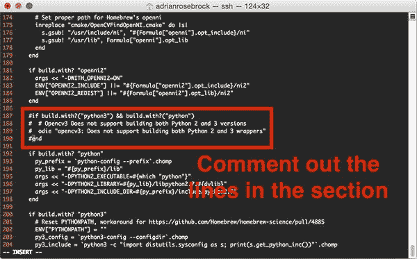
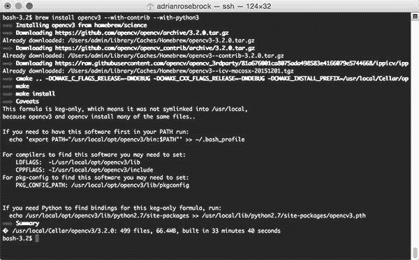
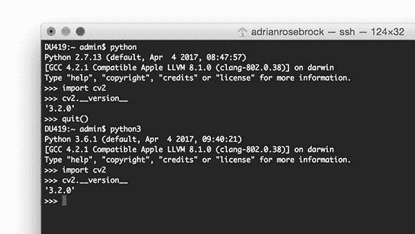

# 解决 macOS、OpenCV 和 Homebrew 安装错误

> 原文：<https://pyimagesearch.com/2017/05/15/resolving-macos-opencv-homebrew-install-errors/>


正如你无疑知道的，在你的 macOS 机器上配置和安装 OpenCV 可能*有点痛苦*。

为了帮助你和其他 PyImageSearch 读者更快地安装 OpenCV(并减少麻烦)，我整理了一个关于使用 [Homebrew 安装 OpenCV](https://pyimagesearch.com/2016/12/19/install-opencv-3-on-macos-with-homebrew-the-easy-way/) 的教程。

使用 Homebrew 允许您*跳过*手动配置您的构建并从源代码编译 OpenCV。

相反，你只需使用所谓的 *brew 公式*，它定义了*如何*自动*配置和安装给定的软件包*，类似于软件包管理器如何智能地在你的系统上安装库和软件。

然而，*几周前出现了一个小问题*,人们发现最近用于在 macOS 上构建和安装 OpenCV 的自制程序中有一些错误。

这个公式在通过自制程序在 macOS 上构建 OpenCV 时导致了 ***两类错误*** :

*   **错误#1:** 报告称*Python 2 和 Python 3 包装器都无法构建(这不是真的，你可以在同一个 Homebrew 命令中构建 Python 2.7 和 Python 3 绑定)。*
**   错误#2: 一个丢失的`downloader.cmake`文件。*

 *我自己，以及 PyImageSearch 的读者 Andreas Linnarsson、Francis 和 Patrick(血淋淋的细节见[家酿 OpenCV 安装帖子](https://pyimagesearch.com/2016/12/19/install-opencv-3-on-macos-with-homebrew-the-easy-way/)的评论部分)深入研究了这个问题，并正面解决了它。

今天我将分享我们的发现，希望它能帮助你和其他 PyImageSearch 的读者在你的 macOS 机器上安装 OpenCV。

在理想情况下，随着用于配置和安装 OpenCV 的家酿公式被更新以纠正这些错误，这些说明最终会过时。

**要了解更多关于安装 OpenCV 时解决自制软件错误的信息，*继续阅读*。**

## 解决 macOS、OpenCV 和 Homebrew 安装错误

在这篇博文的剩余部分，我将讨论在 macOS 系统上通过自制软件安装 OpenCV 时可能遇到的常见错误。

我还将提供关于检查 Python 版本的额外建议，以帮助您进一步调试这些错误。

### 错误#1: opencv3:不支持构建 Python 2 和 3 包装器

假设您遵循了我的[原始家酿+ OpenCV 安装帖子](https://pyimagesearch.com/2016/12/19/install-opencv-3-on-macos-with-homebrew-the-easy-way/)，您可能在尝试安装 OpenCV 时遇到了以下错误:

```py
$ brew install opencv3 --with-contrib --with-python3 --HEAD
...
Error: opencv3: Does not support building both Python 2 and 3 wrappers

```

这个错误是由下面的提交引入的[。我发现这个错误令人沮丧，原因有二:](https://github.com/Homebrew/homebrew-science/pull/5488/commits/67c4382a025ea834dc189785c0c0fcbfe8ee4fcc)

1.  没有必要进行这项检查…
2.  …因为 Homebrew 可以用来编译 OpenCV *两次*:一次用于 Python 2.7，一次用于 Python 3。

首先，OpenCV 3 *可以用 Python 2.7 和 Python 3 绑定来构建*。它只需要*两个单独的编译*。

第一次编译 e 处理构建 OpenCV 3 + Python 2.7 绑定，而第二次编译生成 OpenCV 3 + Python 3 绑定。这样做可以正确安装 OpenCV 3，同时为每个 Python 版本生成正确的`cv2.so`绑定。

有两种方法可以解决这个错误，如 [this StackOverflow thread](http://stackoverflow.com/questions/43666806/install-opencv3-on-mac-for-python-3-6) 中所讨论的。

第一种方法可以说更简单，**，但是没有解决真正的问题**。这里我们只是更新了`brew install opencv3`命令，以表明我们想要在没有 Python 3 绑定 的情况下构建 OpenCV 3 ***:***

```py
$ brew install opencv3 --with-contrib

```

注意我们是如何忽略了`--with-python3`开关的。在这种情况下，**自制*自动*为 OpenCV 3** 构建 Python 2.7 绑定(没有`--with-python2`开关；这是自动假定的)。

类似地，如果我们想用 Python 3 绑定 构建 OpenCV 3 ***，我们应该将`brew install opencv3`命令更新为:***

```py
$ brew install opencv3 --with-contrib --with-python3 --without-python

```

这里我们提供`--with-python3`来表示我们希望生成 OpenCV 3 + Python 3 绑定，但是*使用`--without-python`开关跳过*生成 OpenCV 3 + Python 2.7 绑定。

这个方法行得通；然而，我发现*令人沮丧*和*令人困惑*。开始，`--without-python`开关是*极不明确*。

如果我给 install 命令提供一个名为`--without-python`的开关，我会假设它会构建*不* Python 绑定什么的，*而不管 Python 版本* 。然而，事实并非如此。相反，`--without-python` *真的是*没有 Python 2.7 绑定的意思。

这些开关让像我这样的 OpenCV 安装老手和第一次尝试正确配置开发环境的新手感到困惑。

在我看来，一个 ***更好的解决方案*** (当然直到一个补丁完全发布)是编辑 OpenCV 3 安装公式本身。

要编辑 OpenCV 3 Homebrew 安装公式，请执行以下命令:

```py
$ brew edit opencv3

```

然后找到下面的配置块:

```py
if build.with?("python3") && build.with?("python")
  # Opencv3 Does not support building both Python 2 and 3 versions
  odie "opencv3: Does not support building both Python 2 and 3 wrappers"
end

```

从我下面的截图可以看到，这个配置在**第 187-190** 行(不过，这些行会随着 OpenCV 3 家酿公式的更新而改变)。


**Figure 1**: Finding the Homebrew + OpenCV 3 formula that needs to be edited.

找到这一部分后，请将这四行注释掉:

```py
#if build.with?("python3") && build.with?("python")
#  # Opencv3 Does not support building both Python 2 and 3 versions
#  odie "opencv3: Does not support building both Python 2 and 3 wrappers"
#end

```

我还提供了一个截图，展示了如何注释掉这些行:



**Figure 2:** Updating the Homebrew + OpenCV 3 install formula to resolve the error.

在注释掉这些行之后，保存并退出编辑器来更新 OpenCV 3 Homebrew 安装公式。

从那里，您应该能够使用以下命令通过 Homebrew 成功安装 OpenCV 3:

```py
$ brew install opencv3 --with-contrib --with-python3

```



**Figure 3:** Successfully compiling OpenCV 3 with Python 2.7 and Python 3 bindings on macOS via Homebrew.

***注意:**如果您收到与`downloader.cmake`相关的错误信息，请确保进入下一节。*

OpenCV 3 安装完成后，[回到最初的教程](https://pyimagesearch.com/2016/12/19/install-opencv-3-on-macos-with-homebrew-the-easy-way/)，按照从*“处理 Python 3 问题”*部分开始的说明进行操作。

从那里开始，你将安装 OpenCV 3，同时绑定了 Python 2.7 和 Python 3:



**Figure 4:** Importing the *cv2* library into a Python 2.7 and Python 3 shell.

再次请记住，为了生成这些绑定，进行了两次单独的编译。第一次编译生成了 OpenCV 3 + Python 2.7 绑定，而第二次编译创建了 OpenCV 3 + Python 3 绑定。

### 错误#2:没有这样的文件或目录 3rd party/IP picv/downloader . cmake

通过 Homebrew 安装 OpenCV 3 可能遇到的第二个错误与`downloader.cmake`文件有关。该错误仅在您向`brew install opencv3`命令提供`--HEAD`开关时出现。

该错误的原因是`3rdparty/ippicv/downloader.cmake`文件被*从回购中移除*；然而，家酿安装公式并没有更新，以反映这一点([来源](http://stackoverflow.com/questions/43113151/error-in-installing-opencv3-with-homebrew-and-python3))。

因此，避开这个错误的最简单的方法就是简单地将*省略掉*这个`--HEAD`开关。

例如，如果您之前的 OpenCV 3 + Homebrew 安装命令是:

```py
$ brew install opencv3 --with-contrib --with-python3 --HEAD

```

只需将其更新为:

```py
$ brew install opencv3 --with-contrib --with-python3

```

如果你已经遵循了上面的*“错误# 1”*部分的说明，Homebrew 现在应该安装 OpenCV 3 与 Python 2.7 *和* Python 3 绑定。现在你会想[回到最初的 Homebrew + OpenCV 教程](https://pyimagesearch.com/2016/12/19/install-opencv-3-on-macos-with-homebrew-the-easy-way/)，并遵循从*“处理 Python 3 问题”*部分开始的说明。

### 额外收获:检查您的 Python 版本并相应地更新路径

如果您是 Unix 环境和命令行的新手(或者如果这是您第一次一起使用 Python + OpenCV)，我看到新手犯的一个常见错误是 ***忘记检查他们的 Python 版本号。***

您可以使用以下命令检查您的 Python 2.7 版本:

```py
$ python --version
Python 2.7.13

```

类似地，该命令将为您提供 Python 3 版本:

```py
$ python3 --version
Python 3.6.1

```

为什么这如此重要？

[原创家酿+ OpenCV 安装教程](https://pyimagesearch.com/2016/12/19/install-opencv-3-on-macos-with-homebrew-the-easy-way/)是为 Python 2.7 和 Python 3.5 编写的。但是，Python 版本会更新。Python 3.6 已经正式发布，正在很多机器上使用。事实上，如果你通过自制软件安装 Python 3(在撰写本文时)，Python 3.6 就会被安装。

这很重要，因为你需要检查你的文件路径。

例如，如果我告诉您检查 Python 3 安装的`site-packages`目录，并提供一个示例命令:

```py
$ ls /usr/local/opt/opencv3/lib/python3.5/site-packages/

```

你应该*首先*检查你的 Python 3 版本。上面执行的命令假设 Python 3.5。但是，如果在运行`python3 --version`之后，您发现您正在使用 Python 3.6，则需要将您的路径更新为:

```py
$ ls /usr/local/opt/opencv3/lib/python3.6/site-packages/

```

注意`python3.5`是如何变成`python3.6`的。

忘记检查和验证文件路径是我看到的新手在用 Python 绑定安装和配置 OpenCV 时经常犯的错误。

***不要*在你的终端里盲目的复制粘贴命令。相反，花点时间去理解他们在做什么，这样你就可以根据你自己的开发环境来调整指令。**

一般来说，在系统上安装 OpenCV + Python 的指令*不会改变*——但是 Python 和 OpenCV 版本*会改变*，因此一些文件路径会稍微改变*。通常所有这些相当于改变一个文件路径中的一两个字符。*

 *## 摘要

在今天的博文中，我们回顾了通过自制软件安装 OpenCV 3 时可能会遇到的两个常见错误信息:

*   **错误#1:** 报告说*Python 2 和 Python 3 的包装器都无法构建。*
*   错误#2: 一个丢失的`downloader.cmake`文件。

在 PyImageSearch 读者 Andreas Linnarsson、Francis 和 Patrick 的帮助下，我提供了这些错误的解决方案。

我希望这些说明可以帮助你在 macOS 机器上通过 Homebrew 安装 OpenCV 3 时避免这些常见错误！

***出发前，请务必在下面的表格中输入您的电子邮件地址，以便在 PyImageSearch 上发布以后的博文时得到通知！*****