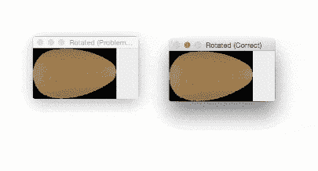
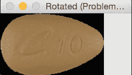
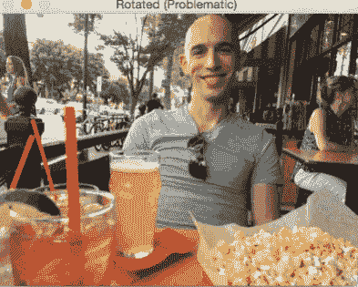
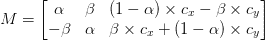
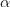
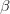
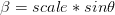
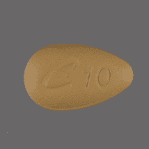
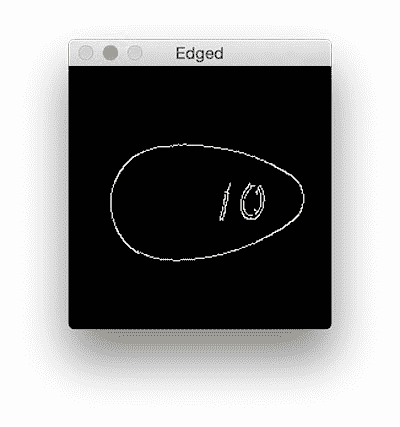
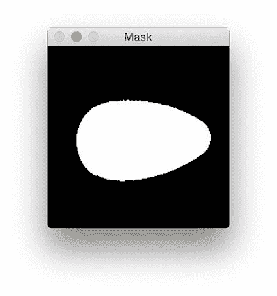

# 使用 OpenCV 和 Python(正确地)旋转图像

> 原文：<https://pyimagesearch.com/2017/01/02/rotate-images-correctly-with-opencv-and-python/>



让我告诉你一个尴尬的故事，六年前我是如何浪费了 T2 三周的研究时间。

那是我第二学期课程结束的时候。

我很早就参加了所有的考试，这学期所有的项目都已经提交了。

由于我的学校义务基本上为零，我开始尝试在图像中(自动)识别处方药(T1)，这是我知道的一件关于 T2 或 T4 的事情(但那时我才刚刚开始我的研究)。

当时，我的研究目标是找到并确定以*旋转不变*方式可靠量化药丸的方法。无论药丸如何旋转，我都希望输出的特征向量(近似)相同(由于光照条件、相机传感器、浮点误差等原因，特征向量永远不会与现实应用中的*完全相同*。).

第一周之后，我取得了惊人的进步。

我能够从我的药丸数据集中提取特征，对它们进行索引，然后*识别*我的测试药丸集，而不管它们是如何定位的…

…但是，有一个问题:

**我的方法只对*圆形药丸*有效——对*长方形药丸我得到了完全无意义的结果。***

怎么可能呢？

我绞尽脑汁寻找解释。

我的特征提取算法的逻辑有缺陷吗？

是我没有正确匹配特征吗？

还是完全是别的什么… ***比如我的图像预处理有问题。***

虽然作为一名研究生，我可能羞于承认这一点，但问题是后者:

我搞砸了。

结果是，在图像预处理阶段，我错误地旋转了我的图像。

由于圆形药丸的长宽比接近正方形，所以旋转错误对他们来说不是问题。这里你可以看到一个圆形药丸旋转了 360 度，没有问题:


**Figure 1:** Rotating a circular pill doesn’t reveal any obvious problems.

但对于椭圆形药丸，它们会在旋转过程中被“切断”,就像这样:



**Figure 2:** However, rotating oblong pills using the OpenCV’s standard *cv2.getRotationMatrix2D* and *cv2.warpAffine* functions caused me some problems that weren’t immediately obvious.

本质上，我只是量化了旋转的长方形药丸的部分。因此我得出了奇怪的结果。

我花了*三周*和*部分圣诞假期*试图诊断这个 bug——当我意识到这是由于我疏忽了`cv2.rotate`功能时，我感到非常尴尬。

你看，输出图像的尺寸需要*调整*，否则，我的图像的角会被切掉。

我是如何做到这一点并彻底消灭这个 bug 的呢？

**要学习如何用 OpenCV 旋转图像，使得*整个*图像被包含，而*没有*图像被切掉，*继续阅读。***

## 使用 OpenCV 和 Python(正确地)旋转图像

在这篇博文的剩余部分，我将讨论使用 OpenCV 和 Python 旋转图像时可能遇到的常见问题。

具体来说，我们将研究当图像的角在旋转过程中被“切掉”时会发生什么问题。

为了确保我们都理解 OpenCV 和 Python 的旋转问题，我将:

*   从演示旋转问题的简单示例开始。
*   提供旋转功能，确保图像在旋转过程中不会被切断。
*   讨论我是如何使用这种方法解决药片识别问题的。

### OpenCV 的一个简单旋转问题

让我们从一个示例脚本开始这篇博文。

打开一个新文件，将其命名为`rotate_simple.py`，并插入以下代码:

```py
# import the necessary packages
import numpy as np
import argparse
import imutils
import cv2

# construct the argument parse and parse the arguments
ap = argparse.ArgumentParser()
ap.add_argument("-i", "--image", required=True,
	help="path to the image file")
args = vars(ap.parse_args())

```

**第 2-5 行**从导入我们需要的 Python 包开始。

如果你还没有安装我的 OpenCV 便利功能系列 [imutils](https://github.com/jrosebr1/imutils) ，你现在就可以安装了:

```py
$ pip install imutils

```

如果您已经在安装了`imutils`，请确保您已经升级到最新版本:

```py
$ pip install --upgrade imutils

```

从那里，**第 8-10 行**解析我们的命令行参数。这里我们只需要一个开关，`--image`，它是我们的映像驻留在磁盘上的路径。

让我们继续实际旋转我们的图像:

```py
# load the image from disk
image = cv2.imread(args["image"])

# loop over the rotation angles
for angle in np.arange(0, 360, 15):
	rotated = imutils.rotate(image, angle)
	cv2.imshow("Rotated (Problematic)", rotated)
	cv2.waitKey(0)

# loop over the rotation angles again, this time ensuring
# no part of the image is cut off
for angle in np.arange(0, 360, 15):
	rotated = imutils.rotate_bound(image, angle)
	cv2.imshow("Rotated (Correct)", rotated)
	cv2.waitKey(0)

```

**第 14 行**从磁盘加载我们想要旋转的图像。

然后我们在范围*【0，360】*内以 15 度的增量循环各个角度(**第 17 行**)。

对于这些角度中的每一个，我们称之为`imutils.rotate`，它将我们的`image`围绕图像中心旋转指定数量的`angle`度。然后，我们在屏幕上显示旋转后的图像。

**第 24-27 行**执行相同的过程，但是这次我们调用`imutils.rotate_bound`(我将在下一节提供这个函数的实现)。

正如这个方法的名字所暗示的，我们将确保整个图像被绑定在窗口中，并且没有一个被切断。

要查看这个脚本的运行，请务必使用本文的 ***“下载”*** 部分下载源代码，然后执行下面的命令:

```py
$ python rotate_simple.py --image images/saratoga.jpg

```

在非正方形图像上使用`imutils.rotate`功能的输出如下所示:



**Figure 3:** An example of corners being cut off when rotating an image using OpenCV and Python.

如您所见，图像在旋转时被“截断”——整个图像不在视野范围内。

但是如果我们使用`imutils.rotate_bound`我们可以解决这个问题:


**Figure 4:** We can ensure the entire image is kept in the field of view by modifying the matrix returned by *cv2.getRotationMatrix2D*.

太棒了，我们解决了问题！

那么这是否意味着我们应该*总是*使用`.rotate_bound`而不是`.rotate`方法？

是什么让它如此特别？

引擎盖下发生了什么？

我将在下一节回答这些问题。

### 实现一个旋转功能，使*不会切断*你的图像

首先，我要说的是，OpenCV 中用于旋转图像的`cv2.getRotationMatrix2D`和`cv2.warpAffine`函数*没有任何问题*。

实际上，这些函数给了我们更多的自由，这可能是我们不习惯的(有点像用 C 语言比较手动内存管理和用 Java 比较自动垃圾收集)。

`cv2.getRotationMatrix2D`函数 ***并不关心*** 是否希望保留整个旋转后的图像。

它 ***不在乎*** 是否图像被切断。

如果你在使用这个功能的时候搬起石头砸自己的脚，它 ***也帮不了你*** (我发现这一点很难，花了 3 周才止住血)。

相反，你需要做的是理解*什么是*旋转矩阵以及*如何*构造它。

你看，当你用 OpenCV 旋转一个图像时，你调用`cv2.getRotationMatrix2D`，它返回一个矩阵 *M* ，看起来像这样:



**Figure 5:** The structure of the matrix *M* returned by *cv2.getRotationMatrix2D*.

这个矩阵看起来很恐怖，但我向你保证:它不是。

为了理解它，让我们假设我们想要旋转我们的图像

degrees about some center ")coordinates at some *scale* (i.e., smaller or larger).

然后我们可以插入的值

and :


and 

这对于简单的旋转来说很好，但它没有考虑到如果图像沿边界被切断会发生什么。我们如何补救？

答案在 imutils 的[便利. py 中的`rotate_bound`函数里面:](https://github.com/jrosebr1/imutils/blob/master/imutils/convenience.py#L41)

```py
def rotate_bound(image, angle):
    # grab the dimensions of the image and then determine the
    # center
    (h, w) = image.shape[:2]
    (cX, cY) = (w // 2, h // 2)

    # grab the rotation matrix (applying the negative of the
    # angle to rotate clockwise), then grab the sine and cosine
    # (i.e., the rotation components of the matrix)
    M = cv2.getRotationMatrix2D((cX, cY), -angle, 1.0)
    cos = np.abs(M[0, 0])
    sin = np.abs(M[0, 1])

    # compute the new bounding dimensions of the image
    nW = int((h * sin) + (w * cos))
    nH = int((h * cos) + (w * sin))

    # adjust the rotation matrix to take into account translation
    M[0, 2] += (nW / 2) - cX
    M[1, 2] += (nH / 2) - cY

    # perform the actual rotation and return the image
    return cv2.warpAffine(image, M, (nW, nH))

```

在第 41 行的**上，我们定义了我们的`rotate_bound`函数。**

这个方法接受一个输入`image`和一个`angle`来旋转它。

我们假设我们将围绕它的中心 *(x，y)*-坐标旋转我们的图像，所以我们在**行 44 和 45** 上确定这些值。

给定这些坐标，我们可以调用`cv2.getRotationMatrix2D`来获得我们的旋转矩阵 *M* ( **第 50 行**)。

然而，为了调整任何图像边界截断问题，我们需要应用一些我们自己的手动计算。

我们首先从旋转矩阵 *M* ( **第 51 行和第 52 行**)中获取余弦和正弦值。

这使我们能够计算旋转图像的新宽度和高度，确保图像没有任何部分被剪切掉。

一旦我们知道了新的宽度和高度，我们可以通过再次修改我们的旋转矩阵来调整第 59 行和第 60 行的平移。

最后，在第 63 行的**上调用`cv2.warpAffine`来使用 OpenCV 旋转实际的图像，同时确保没有图像被切掉。**

对于使用 OpenCV 时旋转切断问题的一些其他有趣的解决方案(有些比其他的更好)，请务必参考[这个](http://stackoverflow.com/questions/11764575/python-2-7-3-opencv-2-4-after-rotation-window-doesnt-fit-image) StackOverflow 线程和[这个](http://stackoverflow.com/questions/22041699/rotate-an-image-without-cropping-in-opencv-in-c)。

### 用 OpenCV 和 Python 修复旋转图像的“截断”问题

让我们回到我最初的旋转椭圆形药丸的问题，以及我如何使用`.rotate_bound`来解决这个问题(尽管那时我还没有创建`imutils` Python 包——它只是一个助手文件中的实用函数)。

我们将使用以下药丸作为我们的示例图像:



**Figure 6:** The example oblong pill we will be rotating with OpenCV.

首先，打开一个新文件，命名为`rotate_pills.py`。然后，插入以下代码:

```py
# import the necessary packages
import numpy as np
import argparse
import imutils
import cv2

# construct the argument parse and parse the arguments
ap = argparse.ArgumentParser()
ap.add_argument("-i", "--image", required=True,
	help="path to the image file")
args = vars(ap.parse_args())

```

**第 2-5 行**导入我们需要的 Python 包。同样，在继续之前，确保你已经安装和/或升级了 [imutils Python 包](https://github.com/jrosebr1/imutils)。

然后我们在第 8-11 行解析我们的命令行参数。就像博文开头的例子一样，我们只需要一个开关:`--image`，我们输入图像的路径。

接下来，我们从磁盘加载药丸图像，并通过将其转换为灰度、模糊和检测边缘对其进行预处理:

```py
# load the image from disk, convert it to grayscale, blur it,
# and apply edge detection to reveal the outline of the pill
image = cv2.imread(args["image"])
gray = cv2.cvtColor(image, cv2.COLOR_BGR2GRAY)
gray = cv2.GaussianBlur(gray, (3, 3), 0)
edged = cv2.Canny(gray, 20, 100)

```

执行这些预处理函数后，我们的药丸图像现在看起来像这样:



**Figure 7:** Detecting edges in the pill.

药丸的轮廓清晰可见，因此让我们应用轮廓检测来找到药丸的轮廓:

```py
# find contours in the edge map
cnts = cv2.findContours(edged.copy(), cv2.RETR_EXTERNAL,
	cv2.CHAIN_APPROX_SIMPLE)
cnts = imutils.grab_contours(cnts)

```

我们现在准备从图像中提取药丸 ROI:

```py
# ensure at least one contour was found
if len(cnts) > 0:
	# grab the largest contour, then draw a mask for the pill
	c = max(cnts, key=cv2.contourArea)
	mask = np.zeros(gray.shape, dtype="uint8")
	cv2.drawContours(mask, [c], -1, 255, -1)

	# compute its bounding box of pill, then extract the ROI,
	# and apply the mask
	(x, y, w, h) = cv2.boundingRect(c)
	imageROI = image[y:y + h, x:x + w]
	maskROI = mask[y:y + h, x:x + w]
	imageROI = cv2.bitwise_and(imageROI, imageROI,
		mask=maskROI)

```

首先，我们确保在边缘图(**线 26** )中找到至少*个*轮廓。

假设我们至少有一个轮廓，我们在第 29 行**和第 30 行**上为最大轮廓区域构建一个`mask`。

我们的`mask`长这样:



**Figure 8:** The mask representing the entire pill region in the image.

给定轮廓区域，我们可以计算该区域的边界框的坐标 *(x，y)*(**第 34 行**)。

使用边界框和`mask`，我们可以提取实际药丸区域 ROI ( **第 35-38 行**)。

现在，让我们继续对`imageROI`应用`imutils.rotate`和`imutils.rotate_bound`函数，就像我们在上面的简单例子中所做的一样:

```py
	# loop over the rotation angles
	for angle in np.arange(0, 360, 15):
		rotated = imutils.rotate(imageROI, angle)
		cv2.imshow("Rotated (Problematic)", rotated)
		cv2.waitKey(0)

	# loop over the rotation angles again, this time ensure the
	# entire pill is still within the ROI after rotation
	for angle in np.arange(0, 360, 15):
		rotated = imutils.rotate_bound(imageROI, angle)
		cv2.imshow("Rotated (Correct)", rotated)
		cv2.waitKey(0)

```

使用下面的 ***“下载”*** 部分将源代码下载到本教程后，您可以执行以下命令来查看输出:

```py
$ python rotate_pills.py --image images/pill_01.png

```

`imutils.rotate`的输出将如下所示:


**Figure 9:** Incorrectly rotating an image with OpenCV causes parts of the image to be cut off.

注意药丸在旋转过程中是如何被切掉的——我们需要*显式地*计算旋转后图像的新尺寸，以确保边界不会被切掉。

通过使用`imutils.rotate_bound`，我们可以确保在使用 OpenCV 时图像的任何部分都不会被切掉:


**Figure 10:** By modifying OpenCV’s rotation matrix we can resolve the issue and ensure the entire image is visible.

使用这个功能，我终于能够完成寒假的研究——但在此之前，我对自己的新手错误感到非常尴尬。

## 摘要

在今天的博文中，我讨论了如何在用 OpenCV 和`cv2.warpAffine`旋转图像时切断图像边框。

图像边框可以被剪掉的事实是*而不是*OpenCV 中的一个 bug 事实上，`cv2.getRotationMatrix2D`和`cv2.warpAffine`就是这么设计的。

虽然计算新的图像尺寸以确保你不会失去你的边界似乎令人沮丧和繁琐，但这实际上是塞翁失马焉知非福。

OpenCV 给了我们如此多的控制权，以至于我们可以修改我们的旋转矩阵，让它完全按照我们想要的那样做。

当然，这需要我们知道我们的旋转矩阵 *M* 是如何形成的，它的每个分量代表什么(本教程前面已经讨论过)。如果我们理解了这一点，数学自然就会水落石出。

要了解更多关于图像处理和计算机视觉的知识，一定要看看 [PyImageSearch 大师课程](https://pyimagesearch.com/pyimagesearch-gurus/)，在那里我会更详细地讨论这些话题。

否则，我鼓励您在下面的表格中输入您的电子邮件地址，以便在以后发布博文时得到通知。