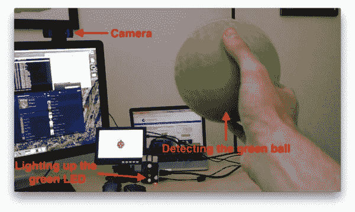

# 重启时运行 Python + OpenCV 脚本

> 原文：<https://pyimagesearch.com/2016/05/16/running-a-python-opencv-script-on-reboot/>

**这是我在 PyImageSearch 博客上被问到的一个常见问题:**

> 如何让 Python + OpenCV 脚本在我的系统一启动就启动？

有很多方法可以实现。我最喜欢的是使用 [crontab 和@reboot 选项](http://www.cyberciti.biz/faq/linux-execute-cron-job-after-system-reboot/)。

我如此喜欢这种方法的主要原因是因为 crontab 存在于几乎每一台 Unix 机器上(另外，crontab 是一个非常好的工具，我认为每个人都应该至少有一些经验)。

无论您使用的是 Raspbian、Linux 还是 OSX，crontab 都有可能安装在您的系统上。

<https://www.youtube.com/embed/yS-zke4xp_c?feature=oembed>