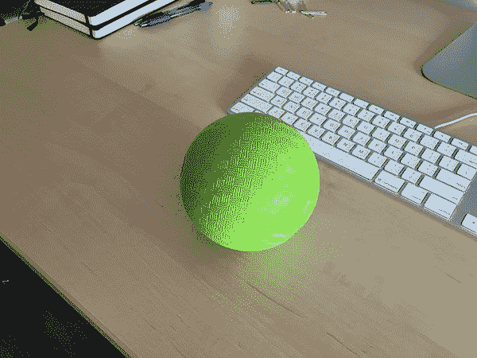

# 用 OpenCV 保存关键事件视频剪辑

> 原文：<https://pyimagesearch.com/2016/02/29/saving-key-event-video-clips-with-opencv/>

[](https://pyimagesearch.com/wp-content/uploads/2016/02/key_event_demo.gif)

上周的博客文章教我们如何使用 OpenCV 和 Python 将视频写入文件。这是一项了不起的技能，但它也提出了一个问题:

> ***我如何把包含*******有趣事件的*** **视频剪辑到文件中而不是把***** ****整个视频** ***？*****

 **在这种情况下，总体目标是构建一个 ***视频梗概*** ，将视频流中最关键、最显著、最有趣的部分提取到一系列短视频文件中。

什么真正定义了“关键或有趣的事件”完全取决于您和您的应用程序。关键事件的潜在示例包括:

*   在限制进入区检测到运动。
*   入侵者进入你的房子或公寓。
*   一辆汽车在你家附近繁忙的街道上闯红灯。

在每一种情况下，你对*整个*视频捕捉——***不感兴趣，相反，你只想要包含动作的视频剪辑！***

要了解如何使用 OpenCV 捕获关键事件视频剪辑(并构建您自己的视频概要)，请继续阅读。

## 用 OpenCV 保存关键事件视频剪辑

这篇博文的目的是演示当一个*特定动作*发生时，如何*将短视频剪辑写到文件*中。我们将利用从上周关于[用 OpenCV](https://pyimagesearch.com/2016/02/22/writing-to-video-with-opencv/) 写视频到文件的博文中获得的知识来实现这一功能。

正如我在这篇文章的开头提到的，在视频流中定义“关键”和“有趣”的事件完全取决于你的应用程序和你试图构建的整体目标。

你可能对探测房间里的运动感兴趣。监控你的房子。或者创建一个系统来观察交通状况并存储机动车司机违反法律的片段。

作为两者的简单例子:

1.  定义关键事件。
2.  将视频剪辑写入包含事件的文件。

我们将处理一个视频流，并寻找这个绿色球的出现:

[](https://pyimagesearch.com/wp-content/uploads/2016/02/key_event_green_ball.jpg)

**Figure 1:** An example of the green ball we are going to detect in video streams.

如果这个绿色的球出现在我们的视频流中，我们将打开一个新的文件视频(基于发生的时间戳)，将剪辑写入文件，然后一旦球从我们的视野中消失，就停止写入过程。

此外，我们的实现将具有许多理想的特性，包括:

1.  在 动作发生前几秒 ***向我们的视频文件写入帧。***
2.  在 动作结束后几秒钟 ***编写帧文件——在这两种情况下，我们的目标不仅是捕捉*整个事件*，还包括事件*的*上下文。***
3.  利用线程来确保我们的主程序在输入流和输出视频剪辑文件上执行 I/O 时不会变慢。
4.  利用内置的 Python 数据结构，比如`deque`和`Queue`，所以我们不需要依赖外部库(当然，除了 OpenCV 和 [imutils](https://github.com/jrosebr1/imutils) )。

## 项目结构

在我们开始实现我们的关键事件视频编写器之前，让我们看一下项目结构:

```py
|--- output
|--- pyimagesearch
|    |--- __init__.py
|    |--- keyclipwriter.py
|--- save_key_events.py

```

在`pyimagesearch`模块中，我们将在`keyclipwriter.py`文件中定义一个名为`KeyClipWriter`的类。这个类将处理从一个输入视频流中接收帧，并以一种安全、高效和线程化的方式将它们写入文件。

驱动程序脚本`save_key_events.py`将定义“有趣事件”的标准(即绿色球进入摄像机视野)，然后将这些帧传递给`KeyClipWriter`，后者将创建我们的视频概要。

### 关于 Python + OpenCV 版本的快速说明

这篇博文假设你使用的是 *Python 3+* 和 *OpenCV 3* 。正如我在上周的帖子的[中提到的，我无法让`cv2.VideoWriter`函数在我的 OpenCV 2.4 安装上工作，所以在几个小时的摸索之后，我最终放弃了 OpenCV 2.4，坚持使用 OpenCV 3。](https://pyimagesearch.com/2016/02/22/writing-to-video-with-opencv/)

本课中的代码在技术上与 Python 2.7 的*兼容(同样，假设你使用的是带有 OpenCV 3 绑定的 Python 2.7)，但是你需要修改一些`import`语句(我会在后面指出)。*

 *### 使用 OpenCV 将关键/有趣的视频剪辑写入文件

让我们开始复习我们的`KeyClipWriter`课:

```py
# import the necessary packages
from collections import deque
from threading import Thread
from queue import Queue
import time
import cv2

class KeyClipWriter:
	def __init__(self, bufSize=64, timeout=1.0):
		# store the maximum buffer size of frames to be kept
		# in memory along with the sleep timeout during threading
		self.bufSize = bufSize
		self.timeout = timeout

		# initialize the buffer of frames, queue of frames that
		# need to be written to file, video writer, writer thread,
		# and boolean indicating whether recording has started or not
		self.frames = deque(maxlen=bufSize)
		self.Q = None
		self.writer = None
		self.thread = None
		self.recording = False

```

我们从在**2-6 行**导入我们需要的 Python 包开始。本教程假设你使用的是 Python 3，所以如果你使用的是 Python 2.7，你需要将**第 4 行**从`from queue import Queue`改为简单的`import Queue`。

**第 9 行**定义了我们的`KeyClipWriter`的构造函数，它接受两个可选参数:

*   `bufSize`:内存缓冲区中缓存的最大帧数。
*   `timeout`:一个整数，表示当(1)将视频剪辑写入文件和(2)没有准备好写入的帧时休眠的秒数。

然后我们在第 18-22 行初始化四个重要的变量:

*   `frames`:用于存储最近从视频流中读取的最多`bufSize`帧的缓冲器。
*   `Q`:一个“先入先出”( [FIFO](https://en.wikipedia.org/wiki/FIFO_(computing_and_electronics)) ) Python [队列数据结构](https://docs.python.org/3/library/queue.html)，用于保存等待写入视频文件的帧。
*   `writer`:用于将帧实际写入输出视频文件的`cv2.VideoWriter`类的实例化。
*   `thread`:一个 Python `Thread`实例，我们将在将视频写入文件时使用它(以避免代价高昂的 I/O 延迟)。
*   `recording`:布尔值，表示我们是否处于“录制模式”。

接下来，让我们回顾一下`update`方法:

```py
	def update(self, frame):
		# update the frames buffer
		self.frames.appendleft(frame)

		# if we are recording, update the queue as well
		if self.recording:
			self.Q.put(frame)

```

`update`函数需要一个参数，即从视频流中读取的`frame`。我们获取这个`frame`，并将其存储在我们的`frames`缓冲区中(**第 26 行**)。如果我们已经处于录制模式，我们还会将`frame`存储在`Queue`中，这样它就可以刷新到视频文件(**第 29 行和第 30 行**)。

为了开始实际的视频剪辑记录，我们需要一个`start`方法:

```py
	def start(self, outputPath, fourcc, fps):
		# indicate that we are recording, start the video writer,
		# and initialize the queue of frames that need to be written
		# to the video file
		self.recording = True
		self.writer = cv2.VideoWriter(outputPath, fourcc, fps,
			(self.frames[0].shape[1], self.frames[0].shape[0]), True)
		self.Q = Queue()

		# loop over the frames in the deque structure and add them
		# to the queue
		for i in range(len(self.frames), 0, -1):
			self.Q.put(self.frames[i - 1])

		# start a thread write frames to the video file
		self.thread = Thread(target=self.write, args=())
		self.thread.daemon = True
		self.thread.start()

```

首先，我们更新我们的`recording`布尔值来表明我们处于“记录模式”。然后，我们使用提供给`start`方法的`outputPath`、`fourcc`和`fps`以及帧空间尺寸(即宽度和高度)来初始化`cv2.VideoWriter`。关于`cv2.VideoWriter`参数的完整回顾，[请参考这篇博文](https://pyimagesearch.com/2016/02/22/writing-to-video-with-opencv/)。

**第 39 行**初始化我们的`Queue`，用来存储准备写入文件的帧。然后，我们循环我们的`frames`缓冲区中的所有帧，并将它们添加到队列中。

最后，我们生成一个单独的线程来处理将帧写入视频——这样我们就不会因为等待 I/O 操作完成而减慢我们的主视频处理流水线。

如上所述，`start`方法创建了一个新线程，调用用于将`Q`中的帧写入文件的`write`方法。让我们来定义这个`write`方法:

```py
	def write(self):
		# keep looping
		while True:
			# if we are done recording, exit the thread
			if not self.recording:
				return

			# check to see if there are entries in the queue
			if not self.Q.empty():
				# grab the next frame in the queue and write it
				# to the video file
				frame = self.Q.get()
				self.writer.write(frame)

			# otherwise, the queue is empty, so sleep for a bit
			# so we don't waste CPU cycles
			else:
				time.sleep(self.timeout)

```

第 53 行开始一个无限循环，将继续轮询新帧并将它们写入文件，直到我们的视频录制完成。

第 55 和 56 行检查记录是否应该停止，如果是，我们从线程返回。

否则，如果`Q`不为空，我们抓取下一帧并将其写入视频文件(**第 59-63 行**)。

如果在`Q`中没有帧，我们就睡一会儿，这样我们就不会不必要地浪费 CPU 周期旋转(**第 67 行和第 68 行**)。这是*特别重要的*当使用`Queue`数据结构时，它是*线程安全的*，这意味着我们必须在更新内部缓冲区之前获取一个锁/信号量。如果我们在缓冲区为空时不调用`time.sleep`，那么`write`和`update`方法将不断地争夺锁。相反，最好让写入程序休眠一会儿，直到队列中有一堆帧需要写入文件。

我们还将定义一个`flush`方法，该方法简单地获取`Q`中剩余的所有帧，并将它们转储到文件中:

```py
	def flush(self):
		# empty the queue by flushing all remaining frames to file
		while not self.Q.empty():
			frame = self.Q.get()
			self.writer.write(frame)

```

当视频录制完成后，我们需要立即将所有帧刷新到文件中时，就会使用这样的方法。

最后，我们定义下面的`finish`方法:

```py
	def finish(self):
		# indicate that we are done recording, join the thread,
		# flush all remaining frames in the queue to file, and
		# release the writer pointer
		self.recording = False
		self.thread.join()
		self.flush()
		self.writer.release()

```

这个方法表示记录已经完成，将 writer 线程与主脚本连接，将`Q`中的剩余帧刷新到文件，最后释放`cv2.VideoWriter`指针。

既然我们已经定义了`KeyClipWriter`类，我们可以继续讨论用于实现“关键/有趣事件”检测的驱动程序脚本。

### 用 OpenCV 保存关键事件

为了让这篇博文简单易懂，我们将把这个绿色球进入我们的视频流定义为“关键事件”:

[](https://pyimagesearch.com/wp-content/uploads/2016/02/key_event_demo.gif)

**Figure 2:** An example of a key/interesting event in a video stream.

一旦我们看到这个绿球，我们将调用`KeyClipWriter`将包含绿球的所有帧写入文件。本质上，这将为我们提供一组简短的视频剪辑，它们巧妙地总结了*整个*视频流的事件——简而言之， ***一个视频概要*** 。

当然，您可以使用这段代码作为样板/起点来定义您自己的操作——我们将简单地使用“绿球”事件，因为我们之前在 PyImageSearch 博客上多次报道过它，包括[跟踪对象移动](https://pyimagesearch.com/2015/09/21/opencv-track-object-movement/)和[球跟踪](https://pyimagesearch.com/2015/09/14/ball-tracking-with-opencv/)。

在您继续本教程的其余部分之前，请确保您的系统上安装了 [imutils](https://github.com/jrosebr1/imutils) 软件包:

```py
$ pip install imutils

```

这将确保您可以使用`VideoStream`类来创建对内置/USB 网络摄像头和 Raspberry Pi 摄像头模块的[统一访问。](https://pyimagesearch.com/2016/01/04/unifying-picamera-and-cv2-videocapture-into-a-single-class-with-opencv/)

让我们开始吧。打开`save_key_events.py`文件并插入以下代码:

```py
# import the necessary packages
from pyimagesearch.keyclipwriter import KeyClipWriter
from imutils.video import VideoStream
import argparse
import datetime
import imutils
import time
import cv2

# construct the argument parse and parse the arguments
ap = argparse.ArgumentParser()
ap.add_argument("-o", "--output", required=True,
	help="path to output directory")
ap.add_argument("-p", "--picamera", type=int, default=-1,
	help="whether or not the Raspberry Pi camera should be used")
ap.add_argument("-f", "--fps", type=int, default=20,
	help="FPS of output video")
ap.add_argument("-c", "--codec", type=str, default="MJPG",
	help="codec of output video")
ap.add_argument("-b", "--buffer-size", type=int, default=32,
	help="buffer size of video clip writer")
args = vars(ap.parse_args())

```

**第 2-8 行**导入我们需要的 Python 包，而**第 11-22 行**解析我们的命令行参数。下面详细介绍了一组命令行参数:

*   `--output`:这是到*输出目录*的路径，我们将在这里存储输出的视频剪辑。
*   `--picamera`:如果你想使用你的 Raspberry Pi 摄像头(而不是内置/USB 摄像头)，那么提供一个值`--picamera 1`。你可以在这篇文章中阅读更多关于访问内置/USB 网络摄像头和 Raspberry Pi 摄像头模块的信息(无需更改一行代码)[。](https://pyimagesearch.com/2016/01/04/unifying-picamera-and-cv2-videocapture-into-a-single-class-with-opencv/)
*   `--fps`:此开关控制输出视频的所需 FPS。这个值应该类似于您的图像处理管道每秒可以处理的帧数。
*   `--codec`:输出视频剪辑的 [FourCC](http://www.fourcc.org/codecs.php) 编解码器。更多信息请见[前贴](https://pyimagesearch.com/2016/02/22/writing-to-video-with-opencv/)。
*   `--buffer-size`:内存缓冲区的大小，用于存储摄像头传感器最近轮询的帧。较大的`--buffer-size`将允许在输出视频剪辑中包含“关键事件”前后的更多上下文，而较小的`--buffer-size`将在“关键事件”前后存储较少的帧。

让我们执行一些初始化:

```py
# initialize the video stream and allow the camera sensor to
# warmup
print("[INFO] warming up camera...")
vs = VideoStream(usePiCamera=args["picamera"] > 0).start()
time.sleep(2.0)

# define the lower and upper boundaries of the "green" ball in
# the HSV color space
greenLower = (29, 86, 6)
greenUpper = (64, 255, 255)

# initialize key clip writer and the consecutive number of
# frames that have *not* contained any action
kcw = KeyClipWriter(bufSize=args["buffer_size"])
consecFrames = 0

```

**第 26-28 行**初始化我们的`VideoStream`并允许摄像机传感器预热。

从那里，**行 32 和 33** 定义了 HSV 颜色空间中绿色球的较低和较高颜色阈值边界。关于我们如何定义这些颜色阈值的更多信息，[请看这篇文章](https://pyimagesearch.com/2015/09/14/ball-tracking-with-opencv/)。

**第 37 行**使用我们提供的`--buffer-size`实例化我们的`KeyClipWriter`，同时初始化一个整数，用于计数*没有*包含任何有趣事件的*连续帧*的数量。

我们现在准备开始处理视频流中的帧:

```py
# keep looping
while True:
	# grab the current frame, resize it, and initialize a
	# boolean used to indicate if the consecutive frames
	# counter should be updated
	frame = vs.read()
	frame = imutils.resize(frame, width=600)
	updateConsecFrames = True

	# blur the frame and convert it to the HSV color space
	blurred = cv2.GaussianBlur(frame, (11, 11), 0)
	hsv = cv2.cvtColor(blurred, cv2.COLOR_BGR2HSV)

	# construct a mask for the color "green", then perform
	# a series of dilations and erosions to remove any small
	# blobs left in the mask
	mask = cv2.inRange(hsv, greenLower, greenUpper)
	mask = cv2.erode(mask, None, iterations=2)
	mask = cv2.dilate(mask, None, iterations=2)

	# find contours in the mask
	cnts = cv2.findContours(mask.copy(), cv2.RETR_EXTERNAL,
		cv2.CHAIN_APPROX_SIMPLE)
	cnts = imutils.grab_contours(cnts)

```

在第 41 行上，我们开始循环播放视频流中的帧。**第 45 行和第 46 行**从视频流中读取下一个`frame`，然后将它的宽度调整为 600 像素。

通过稍微模糊图像，然后将图像从 RGB 颜色空间转换到 HSV 颜色空间，对第 50 和 51 行进行进一步的预处理(因此我们可以应用我们的颜色阈值)。

使用`cv2.inRange`功能在**线 56** 上执行实际的颜色阈值处理。这个方法找到所有为`greenLower <= p <= greenUpper`的像素 *p* 。然后，我们执行一系列的腐蚀和扩张，以消除任何小斑点留在面具。

最后，**行 61-63** 在阈值图像中找到轮廓。

如果你对这个处理流程的任何一步感到困惑，我建议回到我们之前关于[球跟踪](https://pyimagesearch.com/2015/09/14/ball-tracking-with-opencv/)和[物体移动](https://pyimagesearch.com/2015/09/21/opencv-track-object-movement/)的帖子，进一步熟悉这个主题。

我们现在准备检查并查看是否在我们的图像中找到了绿色球:

```py
	# only proceed if at least one contour was found
	if len(cnts) > 0:
		# find the largest contour in the mask, then use it
		# to compute the minimum enclosing circle
		c = max(cnts, key=cv2.contourArea)
		((x, y), radius) = cv2.minEnclosingCircle(c)
		updateConsecFrames = radius <= 10

		# only proceed if the radius meets a minimum size
		if radius > 10:
			# reset the number of consecutive frames with
			# *no* action to zero and draw the circle
			# surrounding the object
			consecFrames = 0
			cv2.circle(frame, (int(x), int(y)), int(radius),
				(0, 0, 255), 2)

			# if we are not already recording, start recording
			if not kcw.recording:
				timestamp = datetime.datetime.now()
				p = "{}/{}.avi".format(args["output"],
					timestamp.strftime("%Y%m%d-%H%M%S"))
				kcw.start(p, cv2.VideoWriter_fourcc(*args["codec"]),
					args["fps"])

```

**第 66 行**进行检查以确保至少找到一个轮廓，如果找到，则**第 69 行和第 70 行**在掩模中找到最大的轮廓(根据面积)并使用该轮廓计算最小封闭圆。

如果圆的半径满足 10 个像素的最小尺寸(**第 74 行**，那么我们将假设我们已经找到了绿色的球。**第 78-80 行**重置不包含任何有趣事件的`consecFrames`的数量(因为一个有趣的事件“当前正在发生”)，并画一个圆圈突出显示我们在帧中的球。

最后，我们检查我们是否正在录制一个视频剪辑(**第 83 行**)。如果没有，我们基于当前时间戳为视频剪辑生成一个输出文件名，并调用`KeyClipWriter`的`start`方法。

否则，我们将假设没有关键/有趣的事件发生:

```py
	# otherwise, no action has taken place in this frame, so
	# increment the number of consecutive frames that contain
	# no action
	if updateConsecFrames:
		consecFrames += 1

	# update the key frame clip buffer
	kcw.update(frame)

	# if we are recording and reached a threshold on consecutive
	# number of frames with no action, stop recording the clip
	if kcw.recording and consecFrames == args["buffer_size"]:
		kcw.finish()

	# show the frame
	cv2.imshow("Frame", frame)
	key = cv2.waitKey(1) & 0xFF

	# if the `q` key was pressed, break from the loop
	if key == ord("q"):
		break

```

如果没有有趣的事件发生，我们更新`consecFrames`并将`frame`传递到我们的缓冲区。

**第 101 行**做了一个重要的检查——如果我们*正在记录*并且已经达到足够数量的*连续帧* ***而没有关键事件*** ，那么我们应该停止记录。

最后，**行 105-110** 将输出`frame`显示到我们的屏幕上，并等待按键。

我们的最后一个代码块确保视频已经成功关闭，然后执行一点清理:

```py
# if we are in the middle of recording a clip, wrap it up
if kcw.recording:
	kcw.finish()

# do a bit of cleanup
cv2.destroyAllWindows()
vs.stop()

```

### 视频概要结果

要为关键事件生成视频剪辑(例如，视频流中出现的绿色球)，只需执行以下命令:

```py
$ python save_key_events.py --output output

```

我把完整的**1 米 46 秒**的视频(*没有*提取突出的剪辑)放在下面:

<https://www.youtube.com/embed/QQxf0xV1WK0?feature=oembed>***