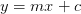

# 使用 XGBoost 扩展 Kaggle 竞赛:第 1 部分

> 原文：<https://pyimagesearch.com/2022/11/21/scaling-kaggle-competitions-using-xgboost-part-1/>

* * *

## **目录**

* * *

## [**用 XGBoost 缩放 Kaggle 比赛:第一部分**](#TOC)

深入处理深度学习主题有时会很困难。你可以一次又一次地尝试，但是就像作家的瓶颈一样，研究者的瓶颈也是非常真实的！

在我探索深度学习的最初几天，我曾经半日一遇。当然，我们都说坚定不移的奉献是取得突破的关键，但有时采取不同的方法也是好的。

对我来说，一股新鲜空气正在(不经意地)卡格尔竞赛中竞争。由于深度学习研究和实用深度学习需要截然不同的思维方式，这对我来说是一个很好的改变，因为我获得了解决问题的不同视角，也看到了最高水平的数据科学家如何利用深度学习解决现实生活中的问题。

竞争性的“卡格灵”实际上是一个非常容易上瘾的习惯，深度学习者很容易陷入其中。然而，提供成长和几个奖项的比赛足以吸引人们致力于成为最好的“卡格勒”。

然而，这仅占我们博客文章标题的 50%。那么另一半呢？

卡格勒人总是在寻找方法，使他们的竞争提交比别人更好。今天的卡格勒人的能力是这样的，几乎每个人都达到 99%的准确率，但只有 99.1%的准确率至高无上。

XGBoost 是一个可扩展的梯度增强库，当几个获胜的 Kaggle 竞赛团队在提交的作品中使用它时，它就出现了。如果你对“梯度推进”这个术语不熟悉；别担心，我们会保护你的。

今天，我们将深入探讨 Kaggle 竞赛的前奏，看看 XGBoost 如何将您的梯度推向最大潜力。

在本教程中，您将学习如何使用 XGBoost 来缩放 Kaggle 比赛。

本课是关于深度学习 108 的 4 部分系列的第 1 部分:

1.  [***缩放 Kaggle 招商会 U***](https://pyimg.co/0c9pb)***[s](https://pyimg.co/0c9pb)***[***ing XGBoost:Part 1***](https://pyimg.co/0c9pb)**(本教程)**
2.  *使用 XGBoost 扩展 Kaggle 竞赛:第 2 部分*
3.  *使用 XGBoost 扩展 Kaggle 竞赛:第 3 部分*
4.  *使用 XGBoost 扩展 Kaggle 竞赛:第 4 部分*

**要了解如何使用 XGBoost** 、*来**缩放 Kaggle 比赛，请继续阅读。***

* * *

## [**用 XGBoost 缩放 Kaggle 比赛:第一部分**](#TOC)

* * *

### [**前言**](#TOC)

要理解 XGBoost，我们首先需要理解一些先决条件。你需要熟悉的第一个概念是决策树。

至此，我们都熟悉线性回归。如果没有，就在你的脑海中重新叙述一条线的方程式，

. Take a look at **Figure 1**.

在这里，我们试图使用`X`对`Y`建模。我们绘制了一些数据点。因为这是一个理想的设置，我们已经找到了一个穿过所有点的线性函数。

现在，如果我们通过进入适当的分类任务来使事情变得更复杂，我们必须处理对应于标签的几个特征。理想情况下，假设我们有给定数据集的特征`X1`和`X2`，当绘制时，它们完美地将数据集分割成其相应的标签(**图 2** )。

这将是每个数据科学家的梦想，因为结果将在瞬间流动。然而，大多数现实生活中的数据集将具有极度非线性的数据，在这种情况下，使用线性函数对数据集进行分类将会很困难(**图 3** )。

令人欣慰的是，在我们的回归函数中引入非线性对于这样的数据集来说是我们已经驾轻就熟了。因此，决策树是处理这类复杂数据集的一种非常熟练的算法。

决策树可以被认为是一棵二叉树，它递归地分割数据集，使得至少一个叶节点包含一个单独的类。就个人而言，决策树是我在经典机器学习中遇到的最酷、最具欺骗性的算法。

我最酷的，我指的是它的设计，是这样的，即使是最多样化的数据集也可以很容易地使用决策树来驯服。但另一方面，决策树的实际使用使我相信，在使用决策树时，很容易对训练数据进行过度拟合，特别是对于复杂的数据集。

让我们看一下**图 4** ，它显示了一个决策树，该决策树将流行的 iris 数据集分成其相应的类。

十有八九，这张图片对你来说可能看起来超级复杂。所以，让我们破译它的意思；看根节点。我们在根节点中没有足够的信息来分离每个类。因此我们看到一个分布。

根节点的子节点根据花瓣长度条件进行分割。满足小于条件的数据点产生纯节点(即，引用单一类的节点)。在右边的孩子中，满足大于或等于条件的数据点下降，但它仍然是一个分布，因为还有两个类。

因此，在随后的节点中，分布将根据模型创建的条件进一步拆分，当我们沿着树向下移动时，我们会看到叶节点有单独的类。

让我们试着想象一下**图 3** 的示例数据集的决策树。

在**图 5** 中，我们尝试为给定数据集形成的可能决策树创建初始树结构。

现在，如果你仔细观察，我们有几个系统分割数据点的条件。虽然使用这些例子可以清楚决策树的一般思想，但直觉上，我们应该注意到许多条件可以极大地增加过度拟合的机会。

让我们继续下一个我们需要的重要前提:集成学习。

因此，决策树提供了一种由几个决策组成的方法，在这种方法中，我们可以将数据集分成相应的类。然而，这种方法有几个缺点，最明显的是过度拟合。

但是，如果我们不使用单一的树，而是使用多个决策树，它们互相帮助，消除薄弱环节，并确保一个健壮的树簇，也可以用来防止过度拟合，会怎么样？

答案在于使用多种机器学习模型来结合从它们的输出中获得的洞察力，以做出更加准确和改进的决策。让我们用多个决策树的例子来更好地理解它。

让我们假设您有一个包含`X`个特征的数据集。让我们从这些`X`特征中抽取`K`个特征，构建一个决策树。如果我们重复这个过程，每次我们的树将有随机数量的特征，并且结果树将是不同的。

现在，剩下的就是将结果汇总在一起，我们的准系统集合模型就准备好了。如果我们也为这一群决策树引入训练数据的随机采样，这就成为非常著名的决策树算法，现在仍在使用，称为随机森林(**图 6** )。

这个难题的第三部分是理解什么是梯度增强。虽然我们将在本系列的后续博客中讨论这一概念的数学方面，但让我们试着理解它背后的思想。

假设我们有一些基本数据集，其中基于 3 个特征给出了一个标签。首先，我们将从创建基础树开始。如果我们的任务是一个回归任务，这个树可以是一个输出标签平均值的单个节点。这没多大帮助，但这是我们的起点。

从我们的起始树产生的损失将告诉我们离接近标签有多远。现在，我们创建第二棵树，这将是一个正确的决策树。正如我们已经看到的，决策树可能会过度拟合，导致对方差的考虑非常低。

为了缓解这个问题，我们将确定一棵树在我们的整体结果中所占的比重。结果将是我们的初始根树的输出(标签的平均值)和第二个树的输出的总和，用学习率修改。

如果我们的方向是正确的，那么这个总和产生的损耗将低于初始损耗。我们重复这个过程，直到达到指定的树的数量。如果你想用更简单的术语来理解这一点，一组弱学习者被组合成一个单一的强学习者。

* * *

### [**XGBoost**](#TOC)

有了对所有先决条件的基本理解，我们就可以继续这个博客的重点了；XGBoost。

XGBoost 代表极端梯度增强，是梯度增强训练的优化解决方案。可以说是当今最强大的经典机器学习算法，它有几个结合了我们迄今为止所学概念的功能:

*   具有防止过度拟合(调整)的步骤
*   可以并行处理
*   具有内置的交叉验证和提前停止功能
*   产生高度优化的结果(更深的树)

在本系列的后续部分中，我们将了解更多关于我们提到的一些概念背后的数学知识，但是现在，让我们在实际场景中使用 XGBoost，并惊叹它是多么简单！

* * *

### [**配置您的开发环境**](#TOC)

要遵循本指南，您需要在系统上安装 OpenCV 库。

幸运的是，OpenCV 可以通过 pip 安装:

```py
$ pip install opencv-contrib-python
```

**如果您需要帮助配置 OpenCV 的开发环境，我们*强烈推荐*阅读我们的** [***pip 安装 OpenCV* 指南**](https://pyimagesearch.com/2018/09/19/pip-install-opencv/)——它将在几分钟内让您启动并运行。

* * *

### [**在配置开发环境时遇到了问题？**](#TOC)

说了这么多，你是:

*   时间紧迫？
*   了解你雇主的行政锁定系统？
*   想要跳过与命令行、包管理器和虚拟环境斗争的麻烦吗？
*   **准备好在您的 Windows、macOS 或 Linux 系统上运行代码*****？***

 *那今天就加入 [PyImageSearch 大学](https://pyimagesearch.com/pyimagesearch-university/)吧！

**获得本教程的 Jupyter 笔记本和其他 PyImageSearch 指南，这些指南是** ***预先配置的*** **，可以在您的网络浏览器中运行在 Google Colab 的生态系统上！**无需安装。

最棒的是，这些 Jupyter 笔记本可以在 Windows、macOS 和 Linux 上运行！

* * *

### [**配置先决条件**](#TOC)

由于我们与 Kaggle 合作，我们将使用笔记本和 Kaggle 笔记本来编写代码。对于我们今天的数据集，我们直接使用了来自`sklearn.datasets`的`iris`数据集。我们的目标是看看在我们的代码中使用 XGBoost 有多简单。

```py
# import necessary packages
import pandas as pd
import xgboost as xgb
from sklearn.datasets import load_iris
from sklearn.model_selection import train_test_split
from sklearn.metrics import mean_squared_error
```

在导入中，我们有`pandas`、`xgboost`和几个来自`sklearn`的帮助器包，其中包括 iris 数据集和`train_test_split` ( **第 2-6 行**)。

* * *

### [**插在 XGBoost**](#TOC)

现在我们将在代码中直接使用 XGBoost。

```py
# load the iris dataset and create the dataframe
iris = load_iris()
X = pd.DataFrame(iris.data, columns=iris.feature_names)
y = pd.Series(iris.target)
```

在**第 9 行**，我们使用`load_iris`功能直接加载所需的数据集，并创建了一个由我们的数据组成的数据框架(**第 10 行和第 11 行**)。

```py
# split the dataset 
xTrain, xTest, yTrain, yTest = train_test_split(X, y)

# define the XGBoost regressor according to your specifications
xgbModel = xgb.XGBRegressor(
    n_estimators=100,
    reg_lambda=1,
    gamma=0,
    max_depth=4
)
```

在**第 14 行**，我们使用另一个`sklearn`函数来创建我们的训练和测试分割。随后定义 XGBoost 回归器，它接受以下参数(**第 17-22 行**):

*   `n_estimators`:树木数量
*   `reg_lambda`:L2 正则化的λ值
*   `gamma`:分支机构拆分损失的最小减少额
*   `max_depth`:一棵树的最大深度

```py
# fit the training data in the model
xgbModel.fit(xTrain, yTrain)

# Store the importance of features in a separate dataframe
impFeat = pd.DataFrame(xgbModel.feature_importances_.reshape(1, -1), columns=iris.feature_names)
```

在**第 25 行**上，我们将训练中的数据放入我们的回归模型，并让它进行训练。XGBoost 会自动让我们分离出特性的重要性，我们已经在**第 28 行**完成了。

```py
# get predictions on test data
yPred = xgbModel.predict(xTest)

# store the msq error from the predictions
msqErr = mean_squared_error(yPred, yTest)
```

最后，我们可以使用训练好的模型对测试数据进行预测(**行 31** )，并从预测中手动计算均方误差(**行 34** )。

* * *

* * *

## [**汇总**](#TOC)

在这篇介绍性的文章中，我们回顾了理解 XGBoost 所需的一些关键概念。我们学习了决策树、集成模型和梯度提升背后的直觉，并使用 XGBoost 解决了一个解决 iris 数据集的基本问题。

像 XGBoost 这样强大的算法的易用性以及它在任何给定数据集上学习的能力都值得注意。

* * *

### [**引用信息**](#TOC)

**Martinez，H.** “使用 XGBoost 扩展 Kaggle 竞赛:第 1 部分”， *PyImageSearch* ，P. Chugh，A. R. Gosthipaty，S. Huot，K. Kidriavsteva，R. Raha 和 A. Thanki 编辑。，2022，[https:](https://pyimg.co/0c9pb)[//pyimg . co/0c9pb](https://pyimg.co/0c9pb)

```py
@incollection{Martinez_2022_XGBoost1,
  author = {Hector Martinez},
  title = {Scaling {Kaggle} Competitions Using {XGBoost}: Part 1},
  booktitle = {PyImageSearch},
  editor = {Puneet Chugh and Aritra Roy Gosthipaty and Susan Huot and Kseniia Kidriavsteva and Ritwik Raha and Abhishek Thanki},
  year = {2022},
  note = {https://pyimg.co/0c9pb},
}
```

* * *

* * *

**要下载这篇文章的源代码(并在未来教程在 PyImageSearch 上发布时得到通知)，*只需在下面的表格中输入您的电子邮件地址！****