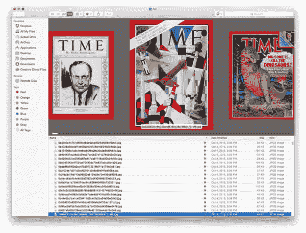
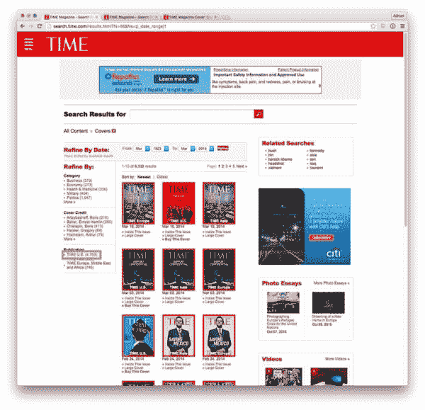
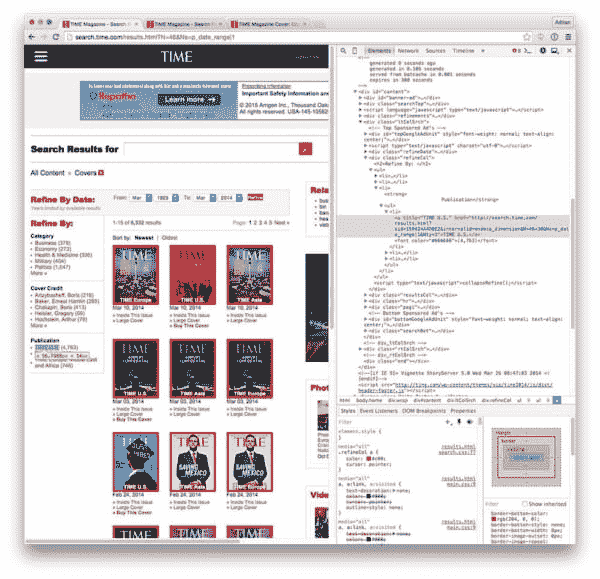
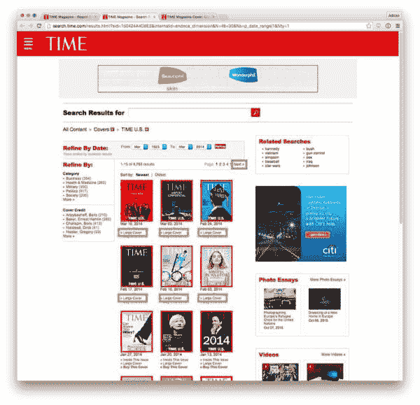
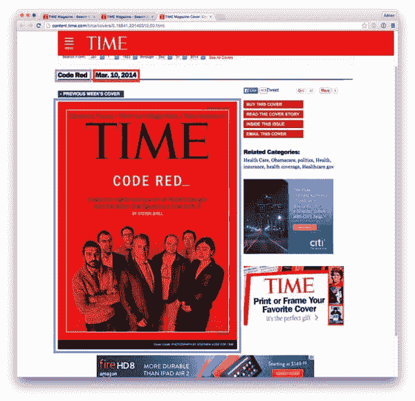
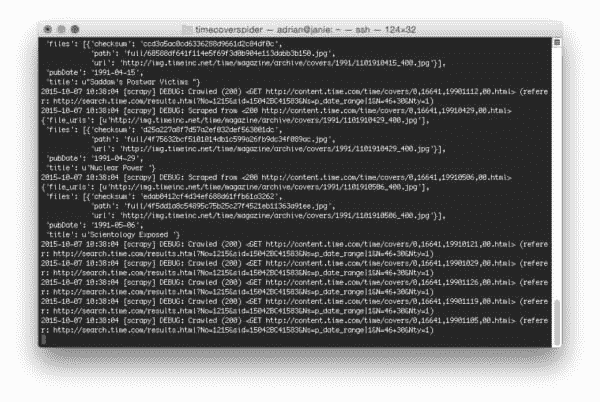
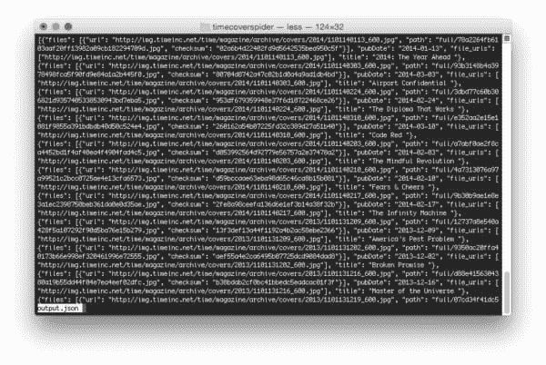

# 用 Python 和 Scrapy 抓取图像

> 原文：<https://pyimagesearch.com/2015/10/12/scraping-images-with-python-and-scrapy/>

[](https://pyimagesearch.com/wp-content/uploads/2015/10/time_scrape_dataset.jpg)既然这是一个计算机视觉和 OpenCV 的博客，你可能会奇怪:*“嘿，阿德里安，你到底为什么要谈论刮图像？”*

问得好。

***原因是因为图像采集是计算机视觉领域最少被谈论的课题之一！***

想想吧。无论您是利用机器学习来训练图像分类器，还是构建图像搜索引擎来在一组照片中找到相关图像，或者只是开发您自己的爱好计算机视觉应用程序— ***这一切都始于图像本身。***

这些图像从何而来？

嗯，如果你幸运的话，你可能会利用现有的图像数据集，如加州理工学院-256、 [ImageNet](http://www.image-net.org/) 或 [MNIST](http://yann.lecun.com/exdb/mnist/) 。

但是在你找不到适合你需求的数据集的情况下(或者当你想要创建你自己的定制数据集时)，你可能需要完成*收集你的图像*的任务。虽然从网站上抓取图片并不完全是*一种计算机视觉技术，但 ***仍然是一项你可以随身携带的好技能。****

 *在这篇博文的剩余部分，我将向你展示如何使用 [Scrapy 框架](http://scrapy.org/)和 Python 编程语言从网页中抓取图像。

具体来说，我们会刮 ***所有****[【Time.com】](http://time.com/)*杂志封面图片。然后，我们将在接下来的几篇博客文章中使用这个杂志封面图像数据集，因为我们应用了一系列图像分析和计算机视觉算法来更好地探索和理解数据集。

## 安装刮刀

实际上，在我的 OSX 机器上安装 [Scrapy](http://scrapy.org/) 时我遇到了一点问题——无论我做了什么，我就是无法正确安装依赖项(闪回到我在大学本科时第一次尝试安装 OpenCV)。

在几个小时的修补没有成功之后，我干脆放弃了，**切换到我的 Ubuntu 系统**，在那里我使用了 **Python 2.7** 。之后，安装变得轻而易举。

你需要做的第一件事是安装一些依赖项来帮助 Scrapy 解析文档(再次提醒，记住我是在我的 *Ubuntu* 系统上运行这些命令的):

```py
$ sudo apt-get install libffi-dev
$ sudo apt-get install libssl-dev
$ sudo apt-get install libxml2-dev libxslt1-dev

```

**注:**这个下一步是可选的， ***但是我** **强烈建议你去做*** 。

然后，我使用 [virtualenv](https://virtualenv.pypa.io/en/latest/) 和 [virtualenvwrapper](https://virtualenvwrapper.readthedocs.org/en/latest/) 创建了一个名为`scrapy`的 Python 虚拟环境，以保持我的系统`site-packages`独立，并与我即将设置的新 Python 环境隔离。同样，这是可选的，但是如果你是一个`virtualenv`用户，这样做没有坏处:

```py
$ mkvirtualenv scrapy

```

无论是哪种情况，现在我们都需要安装 Scrapy 和 [Pillow](https://python-pillow.github.io/) ，如果您计划抓取实际的二进制文件(比如图像)，这是一个必要条件:

```py
$ pip install pillow
$ pip install scrapy

```

Scrapy 应该花几分钟的时间来删除它的依赖项、编译和安装。

您可以通过打开一个 shell(如有必要，访问`scrapy`虚拟环境)并尝试导入`scrapy`库来测试 Scrapy 是否安装正确:

```py
$ python
>>> import scrapy
>>>

```

如果你得到一个导入错误(或任何其他错误)，很可能 Scrapy 没有正确地链接到一个特定的依赖项。再说一次，我不是争斗专家，所以如果你遇到问题，我会建议你咨询一下[文档](http://scrapy.org/doc/)或者在[争斗社区](http://scrapy.org/community/)上发帖。

## 创建 Scrapy 项目

如果你以前使用过 Django web 框架，那么你应该对 Scrapy 如鱼得水——至少在项目结构和模型-视图-模板模式方面；虽然，在这种情况下，它更像是一个*模型——蜘蛛*模式。

要创建我们的 Scrapy 项目，只需执行以下命令:

```py
$ scrapy startproject timecoverspider

```

运行该命令后，您将在当前工作目录中看到一个`timecoverspider`。进入`timecoverspider`目录，你会看到下面这个杂乱的项目结构:

```py
|--- scrapy.cfg
|    |--- timecoverspider
|    |    |--- __init__.py
|    |    |--- items.py
|    |    |--- pipelines.py
|    |    |--- settings.py
|    |    |--- spiders
|    |    |    |---- __init__.py
|    |    |    |---- coverspider.py # (we need to manually create this file)

```

为了开发我们的*时代*杂志封面爬虫，我们需要编辑以下两个文件:`items.py`和`settings.py`。我们还需要在`spiders`目录中创建我们的客户蜘蛛`coverspider.py`

让我们从只需要快速更新的`settings.py`文件开始。第一个是找到`ITEMS_PIPELINE`元组，取消对它的注释(如果它被注释掉了)，并添加如下设置:

```py
# Configure item pipelines
# See http://scrapy.readthedocs.org/en/latest/topics/item-pipeline.html
ITEM_PIPELINES = {
   'scrapy.contrib.pipeline.images.FilesPipeline': 1,
}

```

这个设置将激活 Scrapy 的默认文件抓取功能。

第二次更新可以附加到文件的底部。该值`FILES_STORE`只是输出目录的路径，下载图像将存储在该目录中:

```py
FILES_STORE = "/home/adrian/projects/time_magazine/timecoverspider/output"

```

同样，随意将这个设置添加到`settings.py`文件的底部——放在文件的什么地方并不重要。

现在我们可以继续讨论`items.py`，它允许我们为蜘蛛抓取的网页定义一个数据对象模型:

```py
# import the necessary packages
import scrapy

class MagazineCover(scrapy.Item):
	title = scrapy.Field()
	pubDate = scrapy.Field()
	file_urls = scrapy.Field()
	files = scrapy.Field()

```

这里的代码非常简单明了。在**第 2 行**我们导入我们的`scrapy`包，然后在**第 4 行**定义`MagazineCover`类。这个类封装了我们从每个`time.com`杂志封面网页上收集的数据。对于这些页面，我们将返回一个`MagazineCover`对象，其中包括:

*   `title`:当前*时间*杂志期的标题。例如，这可能是*、【红色代码】、*、【有用的文凭】、*、*、【无限机器】、*等。*
*   `pubDate`:该字段以`year-month-day`格式存储问题发布的日期。
*   `file_urls`:`file_urls`字段是一个 ***非常重要的*** 字段，你必须 ***显式*** 定义来抓取二进制文件(无论是图片、pdf、MP3)等。从一个网站上。你*不能*用不同的名字命名这个变量，它必须在你的`Item`子类中。
*   `files`:同样，抓取二进制数据时需要`files`字段。*不要*给它起任何不同的名字。要了解更多关于用于将二进制数据保存到磁盘的`Item`子类结构的信息，请务必阅读 Scrapy Google Groups 上的[这篇帖子。](https://groups.google.com/forum/#!msg/scrapy-users/kzGHFjXywuY/O6PIhoT3thsJ)

现在我们已经更新了我们的设置并创建了我们的数据模型，我们可以继续进行最难的部分——实际实现蜘蛛抓取封面图片的*时间*。在`spiders`目录中创建一个新文件，将其命名为`coverspider.py`，然后我们开始工作:

```py
# import the necessary packages
from timecoverspider.items import MagazineCover
import datetime
import scrapy

class CoverSpider(scrapy.Spider):
	name = "pyimagesearch-cover-spider"
	start_urls = ["http://search.time.com/results.html?N=46&Ns=p_date_range|1"]

```

**2-4 线**负责进口我们需要的包装。我们将确保导入我们的`MagazineCover`数据对象，`datetime`来解析来自*Time.com*网站的日期，然后是`scrapy`来访问我们实际的爬行和抓取工具。

从那里，我们可以定义**行 6** 上的`CoverSpider`类，它是`scrapy.Spider`的子类。这个类需要有两个预定义的值:

*   我们蜘蛛的名字。`name`应该是*描述蜘蛛做什么的*；然而，*不要让它太长*，因为你必须手动输入到你的命令行来触发和执行它。
*   这是蜘蛛将首先抓取的种子 URL 列表。我们在这里提供的 URL 是【Time.com 封面浏览器的[主页。](http://search.time.com/results.html?N=46&Ns=p_date_range|1)

每个 Scrapy spider 都需要(至少)有一个处理解析`start_urls`的`parse`方法。这个方法反过来可以产生其他请求，触发其他页面被抓取和爬行，但至少，我们需要定义我们的`parse`函数:

```py
# import the necessary packages
from timecoverspider.items import MagazineCover
import datetime
import scrapy

class CoverSpider(scrapy.Spider):
	name = "pyimagesearch-cover-spider"
	start_urls = ["http://search.time.com/results.html?N=46&Ns=p_date_range|1"]

	def parse(self, response):
		# let's only gather Time U.S. magazine covers
		url = response.css("div.refineCol ul li").xpath("a[contains(., 'TIME U.S.')]")
		yield scrapy.Request(url.xpath("@href").extract_first(), self.parse_page)

```

Scrapy 令人惊叹的一个方面是能够使用简单的 CSS 和 [XPath](https://en.wikipedia.org/wiki/XPath) 选择器遍历[文档对象模型](https://en.wikipedia.org/wiki/Document_Object_Model) (DOM)。在**第 12** 行，我们遍历 DOM 并获取包含文本`TIME U.S.`的链接的`href`(即 URL)。我在下面的截图中突出显示了*“美国时间”*链接:

[](https://pyimagesearch.com/wp-content/uploads/2015/10/time_scrape_start_page.jpg)

**Figure 1:** The first step in our scraper is to access the *“TIME U.S.”* page.

通过使用 Chrome 浏览器，右键单击 link 元素，选择 *Inspect 元素"*，并使用 Chrome 的开发工具遍历 DOM，我可以获得这个 CSS 选择器:

[](https://pyimagesearch.com/wp-content/uploads/2015/10/time_scrape_inspect_element.jpg)

**Figure 2:** Utilizing Chrome’s Developer tools to navigate the DOM.

现在我们有了链接的 URL，我们产生了该页面的一个`Request`(这实际上是告诉 Scrapy“点击那个链接”)，表明应该使用`parse_page`方法来处理对它的解析。

[*时间美国*页面](http://search.time.com/results.html?sid=150424A4D8E2&internalid=endeca_dimension&N=46+30&Ns=p_date_range|1&Nty=1)截图如下:

[](https://pyimagesearch.com/wp-content/uploads/2015/10/time_scrape_us_page.jpg)

**Figure 3:** On this page we need to extract all *“Large Cover”* links, followed by following the *“Next”* link in the pagination.

我们解析这个页面有两个主要目标:

*   **目标#1:** 抓取所有带文字*【大封面】*(上图中以 ***突出显示绿色*** )的链接的 URL。
*   **目标#2:** 一旦我们抓取了所有的*【大封面】*链接，我们需要点击*【下一页】*按钮(在**中高亮显示)，允许我们跟随分页并解析****的所有**** *期并抓取它们各自的封面。***

 ***下面是我们对`parse_page`方法的实现，以实现这一点:

```py
	def parse_page(self, response):
		# loop over all cover link elements that link off to the large
		# cover of the magazine and yield a request to grab the cove
		# data and image
		for href in response.xpath("//a[contains(., 'Large Cover')]"):
			yield scrapy.Request(href.xpath("@href").extract_first(),
				self.parse_covers)

		# extract the 'Next' link from the pagination, load it, and
		# parse it
		next = response.css("div.pages").xpath("a[contains(., 'Next')]")
		yield scrapy.Request(next.xpath("@href").extract_first(), self.parse_page)

```

我们从第 19 行的**开始，遍历所有包含文本`Large Cover`的链接元素。对于这些链接中的每一个，我们“点击”它，并使用`parse_covers`方法(我们将在几分钟内定义)向该页面发出请求。**

然后，一旦我们生成了对所有封面的请求，就可以安全地单击`Next`按钮，并使用相同的`parse_page`方法从下一页提取数据——这个过程一直重复，直到我们完成了杂志期的分页，并且在分页中没有其他页面要处理。

最后一步是提取`title`、`pubDate`，存储*时间*封面图像本身。从*时间* 开始的[封面截图示例如下:](http://content.time.com/time/covers/0,16641,20140310,00.html)

[](https://pyimagesearch.com/wp-content/uploads/2015/10/time_scrape_cover_page.jpg)

**Figure 4:** On the actual cover page, we need to extract the *issue title*, *publish date*, and cover *image URL*.

这里我用 ***绿色*** 突出显示了刊名，用 ***红色*** 突出显示了出版日期，用 ***紫色*** 突出显示了封面图片本身。剩下要做的就是定义`parse_covers`方法来提取这些数据:

```py
	def parse_covers(self, response):
		# grab the URL of the cover image
		img = response.css(".art-cover-photo figure a img").xpath("@src")
		imageURL = img.extract_first()

		# grab the title and publication date of the current issue
		title = response.css(".content-main-aside h1::text").extract_first()
		year = response.css(".content-main-aside h1 time a::text").extract_first()
		month = response.css(".content-main-aside h1 time::text").extract_first()[:-2]

		# parse the date
		date = "{} {}".format(month, year).replace(".", "")
		d = datetime.datetime.strptime(date, "%b %d %Y")
		pub = "{}-{}-{}".format(d.year, str(d.month).zfill(2), str(d.day).zfill(2))

		# yield the result
		yield MagazineCover(title=title, pubDate=pub, file_urls=[imageURL])

```

正如其他解析方法一样，`parse_covers`方法也很简单。**第 30 行和第 31 行**提取封面图片的 URL。

**第 33 行**抓取杂志期的标题，而**第 35 行和第 36 行**提取出版年月。

然而，出版日期可以使用一点格式——让我们在`year-month-day`中创建一个组合格式。虽然目前还不完全清楚为什么这种日期格式是有用的，但在下周的帖子中，当我们实际上对杂志封面本身执行*时间图像分析*时，这将是*非常明显的*。

最后，**第 44 行**产生一个`MagazineCover`对象，包括`title`、`pubDate`和`imageURL`(它将被下载并存储在磁盘上)。

## 运行蜘蛛

要运行 Scrapy spider 来抓取图像，只需执行以下命令:

```py
$ scrapy crawl pyimagesearch-cover-spider -o output.json

```

这将启动图像抓取过程，将每个`MagazineCover`项序列化为一个输出文件`output.json`。由此产生的图像将被保存在`full`中，这是 Scrapy 在`output`目录中自动创建的子目录，我们通过上面`settings.py`中的`FILES_STORE`选项指定该目录。

下面是图像抓取过程运行的屏幕截图:

[](https://pyimagesearch.com/wp-content/uploads/2015/10/time_scrape_running_scrape.jpg)

**Figure 5:** Kicking off our image scraper and letting it run.

在我的系统上，整个刮抢 ***全部*** *时间*杂志封面使用 Python + Scrapy 拍了一张迅疾的***2m 23s***——**不差近 4000 张图片！**

## 我们的全套*时代*杂志封面

既然我们的蜘蛛已经刮完了*时代*杂志封面，让我们来看看我们的`output.json`档案:

[](https://pyimagesearch.com/wp-content/uploads/2015/10/time_scrape_output_json.jpg)

**Figure 6:** A screenshot of our output.json file.

为了逐个检查它们，让我们启动一个 Python shell，看看我们在做什么:

```py
$ python
>>> import json
>>> data = open("output.json").read()
>>> data = json.loads(data)
>>> len(data)
3969

```

我们可以看到，我们总共刮到了*3969 张*图片。

`data`列表中的每个条目都是一个字典，它本质上映射到我们的`MagazineCover`数据模型:

```py
>>> data[0]
{u'files': [{u'url': u'http://img.timeinc.net/time/magazine/archive/covers/2014/1101140113_600.jpg', u'path': u'full/78a2264fb6103aaf20ff13982a09cb182294709d.jpg', u'checksum': u'02a6b4d22402fd9d5642535bea950c5f'}], u'file_urls': [u'http://img.timeinc.net/time/magazine/archive/covers/2014/1101140113_600.jpg'], u'pubDate': u'2014-01-13', u'title': u'2014: The Year Ahead '}
>>> data[0].keys()
[u'files', u'file_urls', u'pubDate', u'title']

```

我们可以像这样轻松地获取到*时间*封面图像的路径:

```py
>>> print("Title: {}\nFile Path: {}".format(data[0]["title"], data[0]["files"][0]["path"]))
Title: 2014: The Year Ahead 
File Path: full/78a2264fb6103aaf20ff13982a09cb182294709d.jpg

```

检查`output/full`目录我们可以看到我们有自己的*3969 张*图片:

```py
$ cd output/full/
$ ls -l *.jpg | wc -l
    3969

```

[](https://pyimagesearch.com/wp-content/uploads/2015/10/time_scrape_dataset.jpg)

**Figure 7:** Our dataset of Time magazine cover images.

现在我们有了所有这些图像，最大的问题是: ***“我们要用它们做什么？!"***

我将在接下来的几篇博文中回答这个问题。我们将花一些时间使用计算机视觉和图像处理技术来分析这个数据集，所以不要担心，*您的带宽没有白白浪费！*

**注意:**如果 Scrapy 没有为你工作(或者如果你不想麻烦地设置它)，不用担心——我已经在本页底部找到的帖子的源代码下载中包括了`output.json`和原始的、粗糙的`.jpg`图像。您仍然可以毫无问题地阅读即将发布的 PyImageSearch 帖子。

## 摘要

在这篇博文中，我们学习了如何使用 Python 抓取《时代》杂志的所有封面图片。为了完成这个任务，我们利用了 [Scrapy](http://scrapy.org/) ，一个快速而强大的网络抓取框架。总的来说，我们的整个蜘蛛文件由不到 ***44 行代码*** 组成，这真正展示了 Scrapy libray 背后的能力和抽象。

那么现在我们有了这个关于*时代*杂志封面、*的数据集，我们该怎么处理它们呢？*

好吧，这毕竟是一个计算机视觉博客——所以下周我们将从一个*视觉分析*项目开始，在那里我们对封面图像进行*时间调查*。这是一个非常酷的项目，我对此非常兴奋！

**请务必使用本文底部的表格注册 PyImageSearch 时事通讯— *当我们分析*时代*杂志封面数据集时，你不会想错过后续的文章！*******