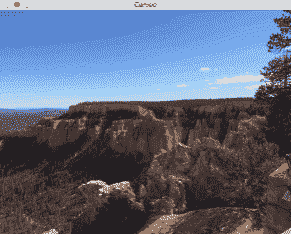
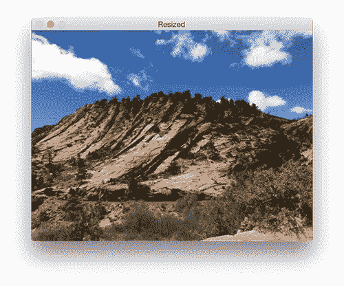
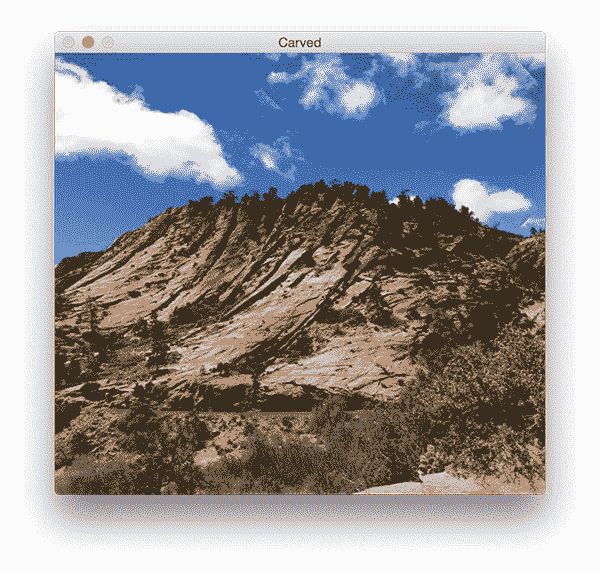
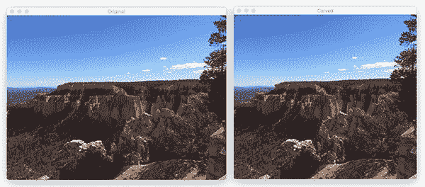
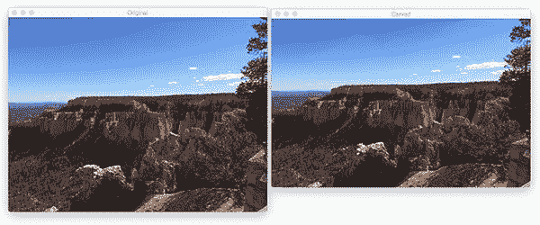

# 使用 OpenCV、Python 和 scikit 进行线缝雕刻-图像

> 原文：<https://pyimagesearch.com/2017/01/23/seam-carving-with-opencv-python-and-scikit-image/>



很容易，我一直以来最喜欢的计算机视觉文献之一是三菱电机研究实验室(MERL)的 Avidan 和 Shamir 的*[Seam Carving for Content-Aware Image Resizing](http://perso.crans.org/frenoy/matlab2012/seamcarving.pdf)*。

最初发表在 SIGGRAPH 2007 会议录上，我第一次读到这篇论文是在我的计算摄影课上，当时我还是一名本科生。

这篇论文，以及来自作者、**、*的演示视频，让该算法感觉像魔法*、**，尤其是对一个刚刚涉足计算机视觉和图像处理领域的学生来说。

接缝雕刻算法的工作原理是找到被称为*接缝*的具有*低能量*(即最不重要)的连接像素，这些像素从左到右或从上到下穿过整个图像。

然后从原始图像中移除这些接缝，允许我们在保留最显著区域的同时调整图像的大小(原始算法还支持*添加接缝*，允许我们*增加*图像大小)。

在今天博文的剩余部分，我将讨论 seam carving 算法，它是如何工作的，以及如何使用 Python、OpenCV 和 sickit-image 应用 seam carving。

***要了解更多关于这个经典的计算机视觉算法，就继续阅读吧！***

## 使用 OpenCV、Python 和 scikit 进行线缝雕刻-图像

这篇博文的第一部分将讨论*什么是*接缝雕刻算法以及*为什么*我们可能更喜欢使用它而不是传统的调整大小方法。

从那以后，我将使用 OpenCV、Python 和 scikit-image 演示如何使用 seam carving。

最后，我将通过提供一个实际的接缝雕刻算法演示来结束本教程。

### 接缝雕刻算法

由 Avidan 和 Shimar 在 2007 年引入的 seam carving 算法用于通过移除/添加具有低能量的*接缝*来调整(下采样和上采样)图像的大小。

接缝被定义为从左到右或从上到下流动的连接像素，只要它们穿过图像的整个宽度/高度。

因此，为了进行接缝雕刻，我们需要两个重要的输入:

1.  **原始图像。**这是我们想要调整大小的输入图像。
2.  **能量地图。**我们从原始图像中导出能量图。能量图应该代表图像中最显著的区域。通常，这是梯度幅度表示(即 Sobel、Scharr 等的输出)。算子)、熵图或显著图。

例如，让我们看看下面的图像:

![Figure 1: Our input image to the seam carving algorithm [source: Wikipedia].](img/c02560ae412de8ed74212660f82c48ba.png)

**图 1:** 我们将图像输入到缝雕算法中【来源:[维基](https://en.wikipedia.org/wiki/File:BroadwayTowerSeamCarvingA.png)。

使用此图像作为输入，我们可以计算梯度幅度作为我们的能量图:![Figure 2: Computing the gradient magnitude representation of of the input image. This representation will serve as our energy map [source: Wikipedia].](img/44855e72570f8eb9e263e81e7c1f442f.png)

**图 2:** 计算输入图像的渐变幅度表示。这种表现将作为我们的能量图【来源:[维基百科](https://en.wikipedia.org/wiki/File:BroadwayTowerSeamCarvingB.png)】。

给定我们的能量图，我们可以生成一组从左到右或从上到下跨越图像的接缝:![Figure 3: Generating seams from the energy map. Low energy seams can be removed/duplicated to perform the actual resizing [source: Wikipedia].](img/6240f5e00ff977c8320614c66bc1a072.png)

**图 3:** 从能量图中生成接缝。低能量接缝可以被移除/复制以执行实际的尺寸调整【来源:[维基百科](https://en.wikipedia.org/wiki/File:BroadwayTowerSeamCarvingC.png)】。

这些接缝通过[动态编程](https://en.wikipedia.org/wiki/Dynamic_programming)有效计算，并按其能量排序。*低能焊缝*位于列表的前面，而*高能焊缝*位于列表的后面。

为了调整图像的大小，我们或者*用低能量移除接缝*来下采样图像，或者我们*用低能量复制接缝*来上采样图像。

下面是一个示例，它获取原始图像，找到能量最低的接缝，然后移除它们以减小输出图像的最终大小:

![Figure 4: Removing low energy seams from an image using the seam carving algorithm [source: Wikipedia].](img/3108e377f1de2f4b01eb059998aa4ea1.png)

**图 4:** 使用线缝雕刻算法从图像中去除低能线缝【来源:[维基百科](https://en.wikipedia.org/wiki/File:BroadwayTowerSeamCarvingE.png)。

关于接缝雕刻算法的更多信息，[请参见原始出版物](http://perso.crans.org/frenoy/matlab2012/seamcarving.pdf)。

### 为什么使用传统的缝雕刻超过传统的调整大小？

请记住，线缝雕刻的目的是保留图像中最突出的(即“有趣的”)区域，同时仍然调整图像本身的大小。

使用传统的方法来调整大小会改变整个图像的尺寸——没有注意确定图像的哪个部分最重要或者最不重要。

相反，Seam carving 应用从能量图导出的试探法/路径查找来确定图像的哪些区域可以被移除/复制，以确保(1)图像的所有“感兴趣”区域被保留，以及(2)这是以美学上令人愉悦的方式完成的。

***注意:**以一种审美愉悦的方式保留图像中最有趣的区域比听起来要困难得多。虽然缝雕看起来像魔术，但实际上不是——它有其局限性。有关这些限制的更多信息，请参见“概述”部分。*

要比较传统的调整大小和线缝雕刻，请考虑以下输入图像:


**Figure 5:** An example image to resize.

这张图片的宽度是 600 像素，我想把它的大小调整到大约 500 像素。

使用传统的插值方法，我调整后的图像看起来像这样:



**Figure 6:** Resizing an image using traditional interpolation techniques. Notice how the height changes along with the width to retain the aspect aspect ratio.

然而，通过应用缝雕，我可以沿水平方向“缩小”图像，并且仍然保留图像中最有趣的区域*，而不需要*改变图像的高度:



**Figure 7:** Resizing the image using seam carving.

### 缝雕在计算机视觉和图像处理中的应用

在这一节中，我将演示如何在 OpenCV、Python 和 scikit-image 中使用 seam carving。

我假设您的系统上已经安装了 OpenCV——如果没有，[请参考本页](https://pyimagesearch.com/opencv-tutorials-resources-guides/),我在这里提供了在许多不同的操作系统上安装 OpenCV 的资源。

从那里，你应该确保你已经安装了 [scikit-image](http://scikit-image.org/) 。[本页](http://scikit-image.org/docs/stable/install.html)提供了关于安装 scikit-image 的更多信息，但是对于大多数系统，您可以使用`pip`:

```py
$ pip install --upgrade scikit-image

```

让我们来看看如何将缝雕应用到我们自己的图像中。

打开一个新文件，将其命名为`seam_carving.py`，并插入以下代码:

```py
# import the necessary packages
from skimage import transform
from skimage import filters
import argparse
import cv2

# construct the argument parse and parse the arguments
ap = argparse.ArgumentParser()
ap.add_argument("-i", "--image", required=True,
	help="path to input image file")
ap.add_argument("-d", "--direction", type=str,
	default="vertical", help="seam removal direction")
args = vars(ap.parse_args())

```

**第 2-5 行**导入我们需要的 Python 包，而**第 8-13 行**解析我们的命令行参数。这个脚本需要一个参数，后面跟着第二个可选参数:

*   `--image`:我们要应用线缝雕刻的输入图像的路径。
*   `--direction`:我们将应用缝雕的方向。值`vertical`将调整图像宽度，而值`horizontal`将调整图像高度。我们默认雕刻方向为`vertical`。

接下来，让我们从磁盘加载我们的输入图像，将其转换为灰度，并计算 Sobel 梯度幅度表示(即，我们的*能量图*):

```py
# load the image and convert it to grayscale
image = cv2.imread(args["image"])
gray = cv2.cvtColor(image, cv2.COLOR_BGR2GRAY)

# compute the Sobel gradient magnitude representation
# of the image -- this will serve as our "energy map"
# input to the seam carving algorithm
mag = filters.sobel(gray.astype("float"))

# show the original image
cv2.imshow("Original", image)

```

为了应用 seam carving，我们将使用 scikit-image 库中的[实现。`seam_carve`函数接受四个必需的参数:](http://scikit-image.org/docs/dev/api/skimage.transform.html#seam-carve)

1.  我们正在应用线缝雕刻的输入`image`。
2.  能源地图。
3.  我们将应用缝雕的方向(水平或垂直)。
4.  要移除的接缝数量。此时，`seam_carve`函数仅支持*下采样*图像——不支持上采样。

为了演示接缝雕刻的实际操作，让我们循环查看一些要移除的接缝:

```py
# loop over a number of seams to remove
for numSeams in range(20, 140, 20):
	# perform seam carving, removing the desired number
	# of frames from the image -- `vertical` cuts will
	# change the image width while `horizontal` cuts will
	# change the image height
	carved = transform.seam_carve(image, mag, args["direction"],
		numSeams)
	print("[INFO] removing {} seams; new size: "
		"w={}, h={}".format(numSeams, carved.shape[1],
			carved.shape[0]))

	# show the output of the seam carving algorithm
	cv2.imshow("Carved", carved)
	cv2.waitKey(0)

```

我们调用第 33 行**和第 34 行**上的`seam_carve`函数，删除当前的`numSeams`数。

新雕刻的图像尺寸打印在我们终端的第 35-37 行上。

我们还在屏幕的第 40 行和第 41 行上显示接缝雕刻图像。

### 接缝雕刻结果

要亲自尝试这个 seam carving 示例，请务必使用本文底部的 ***【下载】*** 部分下载源代码和示例图像。

从那里，执行以下命令:

```py
$ python seam_carving.py --image bryce_canyon.jpg

```



**Figure 8:** *(Left)* The original input image. *(Right)* Removing vertical seams from the image, thereby decreasing the image width.

在左边的*你可以看到原始输入图像——一张[布莱斯峡谷](https://www.nps.gov/brca/index.htm)的照片，布莱斯峡谷是美国最美丽的国家公园之一。然后在*右边*我们有缝刻图像。正如你所看到的，我们已经从图像中移除了垂直接缝，从而减小了图像宽度。*

我们可以通过*移除水平接缝*来降低图像高度:

```py
$ python seam_carving.py --image bryce_canyon.jpg --direction horizontal

```



**Figure 9:** *(Left)* The original image. *(Right)* Removing horizontal seams from the image to decrease height.

我还在下面包含了一个 GIF 动画，演示了一次一个像素的接缝雕刻，让您对算法有更好的感觉:


**Figure 10:** Applying seam carving to an image using OpenCV, Python, and scikit-image.

## 摘要

在今天的博文中，我讨论了用于图像内容感知大小调整的开创性 seam carving 算法。

这是计算机视觉文献中的一个经典算法，所以如果你还没有读过原始出版物，[我建议你把它加入你的阅读清单](http://perso.crans.org/frenoy/matlab2012/seamcarving.pdf)。

在这篇论文中，Avidan 和 Shimar 证明了线缝雕刻不仅可以用于缩小图像尺寸，还可以用于增大图像尺寸。然而，scikit-image 实现目前仅支持缩减采样。

虽然这个算法对我这个大学生来说可能感觉像是“魔法”，但我最终了解到，在计算机视觉世界中没有魔法这种东西——每种算法都有其局限性。

对于线缝雕刻，这些限制通常表现为视觉效果不佳，其中图像的重要语义信息被部分破坏或完全切除。一个很好的例子是将接缝雕刻应用于包含面的图像，并且面上的接缝被移除。

为了解决这个问题，我们可以注释我们的图像，为接缝雕刻算法提供“提示”，确保在接缝雕刻过程中标记的区域不会被切割。在理想情况下，我们可以提供更好地反映我们希望保留的图像的显著区域的能量图，从而不需要修改实际的接缝雕刻算法。

个人很有兴趣看看缝雕的未来景观。随着深度学习算法用于显著性检测等任务，这些显著图可以用于接缝雕刻。我们最终可能会看到一个端到端的缝雕网络。

无论如何，我希望你喜欢这篇经典计算机视觉论文的讨论！

***为了在以后的博客文章发布时得到通知，请务必在下表中输入您的电子邮件地址。***