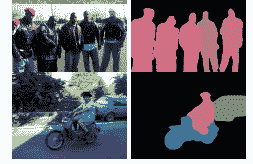

# 语义分割、实例分割和全景分割

> 原文：<https://pyimagesearch.com/2022/06/29/semantic-vs-instance-vs-panoptic-segmentation/>

* * *

## **目录**

* * *

## [**语义对比实例对比全景分割**](#TOC)

在本教程中，您将了解语义分割、实例分割和全景分割。

* * *

### [**这些图像分割技术有何不同？**](#TOC)

[基里洛夫等人(2018)](https://arxiv.org/abs/1801.00868) 提出了一种新型的图像分割技术，称为全景分割，这为确定三种(即语义、实例和全景)图像分割技术中的最佳技术展开了辩论。

在我们深入这场辩论之前，理解图像分割的基础知识是很重要的，包括`things`和`stuff`之间的比较。

图像分割是一种计算机视觉和图像处理技术，涉及在像素级别上对图像中的相似区域或片段进行分组或标记。类别标签或遮罩表示每个像素段。

在图像分割中，一幅图像有两个主要成分:`things`和`stuff`。事物对应于图像中的可数对象(例如，人、花、鸟、动物等。).相比之下，stuff 表示相似材料的无定形区域(或重复模式)，这是不可数的(例如，道路、天空和草地)。

在本课中，我们将根据语义、实例和全景图像分割技术如何对待`things`和`stuff`来区分它们。

我们开始吧！

* * *

### [**区别**](#TOC)

语义分割、实例分割和全景分割的区别在于它们如何处理图像中的`things`和`stuff`。

**语义分割**研究图像中的不可数`stuff`。它分析每个图像像素，并根据它所代表的纹理分配一个唯一的类别标签。例如，在图 1 的**中，一幅图像包含两辆汽车、三个行人、一条道路和天空。两辆车和三个行人代表了相同的纹理。**

语义分割将为这些纹理或类别中的每一个分配唯一的类别标签。然而，语义分割的输出不能分别区分或计数两辆汽车或三个行人。常用的语义分割技术包括 SegNet、U-Net、DeconvNet 和 FCNs。

**实例分割**通常处理与可计数`things`相关的任务。它可以检测图像中出现的每个对象或类的实例，并为其分配具有唯一标识符的不同遮罩或边界框。

例如，实例分段将把前一个例子中的两辆汽车分别标识为`car_1`和`car_2`。常用的实例分割技术有 Mask R-CNN、fast R-CNN、PANet 和 YOLACT。**图 2** 展示了不同的实例分割检测。

语义和实例分割技术的目标都是连贯地处理场景。自然，我们希望在场景中识别出`stuff`和`things`，以构建更实际的真实世界应用程序。研究人员设计了一种解决方案来协调场景中的`stuff`和`things`(即全景分割)。

**全景分割**两全其美。它提出了一种统一的图像分割方法，其中场景中的每个像素被分配一个语义标签(由于语义分割)和一个唯一的实例标识符(由于实例分割)。

全景分割只给每个像素分配一对语义标签和实例标识符。但是，对象可以有重叠的像素。在这种情况下，全景分割通过支持对象实例来解决差异，因为优先级是识别每个`thing`而不是`stuff`。**图 3** 展示了不同的全景分割检测。

*   
*   

**Figure 3:** Panoptic segmentation examples (source: [FPSNet](https://arxiv.org/abs/1910.03892)).

大多数全景分割模型都是基于[掩模 R-CNN](https://arxiv.org/abs/1703.06870) 方法。其骨干架构包括 [UPSNet](https://arxiv.org/abs/1901.03784) 、 [FPSNet](https://arxiv.org/abs/1910.03892) 、 [EPSNet](https://arxiv.org/abs/2003.10142) 和 [VPSNet](https://arxiv.org/abs/2006.11339v1) 。

* * *

### [**评价指标**](#TOC)

每种分割技术使用不同的评估度量来评估场景中的预测遮罩或标识符。这是因为`stuff`和`things`的处理方式不同。

语义分割通常采用联合 ( [IoU](https://arxiv.org/abs/1908.03851) )上的**交集度量(也称为 Jaccard 索引)，该度量检查预测的和基本事实掩码之间的相似性。它决定了两个遮罩之间有多少区域重叠。除了 IoU，我们还可以使用骰子系数、像素精度和平均精度指标来执行更鲁棒的评估。这些指标不考虑对象级标签。**

另一方面，实例分割使用**平均精度** (AP)作为标准评估度量。AP 指标对每个对象实例逐个像素地使用 IoU。

最后，全景分割使用**全景质量** (PQ)度量，该度量评估`things`和`stuff`的预测遮罩和实例标识符。PQ 通过乘以分割质量(SQ)和识别质量(RQ)项来统一所有类别的评估。SQ 表示匹配片段的平均 IoU 分数，而 RQ 是使用预测掩码的精度和召回值计算的 F1 分数。

* * *

### 

 **所有这三种图像分割技术在计算机视觉和图像处理中有重叠的应用。它们共同提供了许多现实世界的应用，帮助人类增加认知带宽。语义和实例分割的一些实际应用包括:

*   **自动驾驶汽车或自动驾驶汽车:** 3D 语义分割通过识别街道上的不同物体，让车辆更好地了解自己的环境。同时，实例分割识别每个对象实例，以便为计算速度和距离提供更大的深度。
*   **分析医学扫描:**这两种技术都可以在 MRI、CT 和 X 射线扫描中识别肿瘤和其他异常。
*   卫星或航空图像:这两种技术都提供了一种从太空或高空绘制世界地图的方法。它们可以勾勒出世界物体的轮廓，如河流、海洋、道路、农田、建筑物等。这类似于它们在场景理解中的应用。

全景分割将[自动驾驶汽车](https://blogs.nvidia.com/blog/2019/10/23/drive-labs-panoptic-segmentation/)的视觉感知提升到了一个新的水平。它可以产生像素级精度的精细掩模，使自动驾驶汽车能够做出更准确的驾驶决策。此外，全景分割在医学图像分析、数据注释、数据扩充、UAV(无人驾驶飞行器)遥感、视频监控和人群计数等方面得到了[更多的应用](https://arxiv.org/pdf/2111.10250.pdf)。在所有领域，全景分割提供了更大的深度和准确性，同时预测遮罩和边界框。

* * *

* * *

## [**总结:该用哪个？**](#TOC)

图像分割是人工智能革命的重要组成部分。它是各种行业(例如，制造业、零售业、医疗保健和运输业)的自主应用程序的核心组件。

历史上，由于硬件限制，图像分割在大范围内是无效的。如今，借助 GPU、云 TPUs 和边缘计算，普通消费者都可以使用图像分割应用。

在本课中，我们讨论了语义、实例和全景图像分割技术。这三种技术在学术界和现实世界中都有有效的应用。在过去的几年中，全景分割在研究人员中得到了更多的发展，以推进计算机视觉领域。相比之下，语义分割和实例分割有许多现实世界的应用，因为它们的算法更成熟。在任何形式下，图像分割对于推进各行业的超自动化都是至关重要的。

* * *

### [**参考**](#TOC)

Shiledarbaxi，n . .[语义 vs 实例 vs 全景:选择哪种图像分割技术](https://analyticsindiamag.com/semantic-vs-instance-vs-panoptic-which-image-segmentation-technique-to-choose/)，*开发者角落*，2021 年。

* * ***