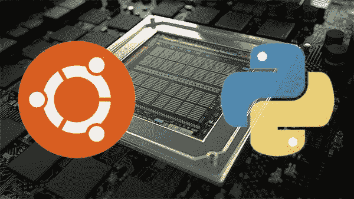
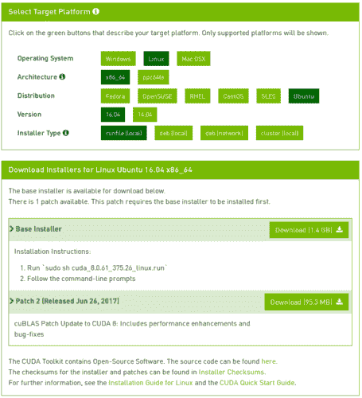
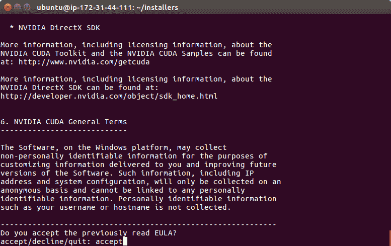
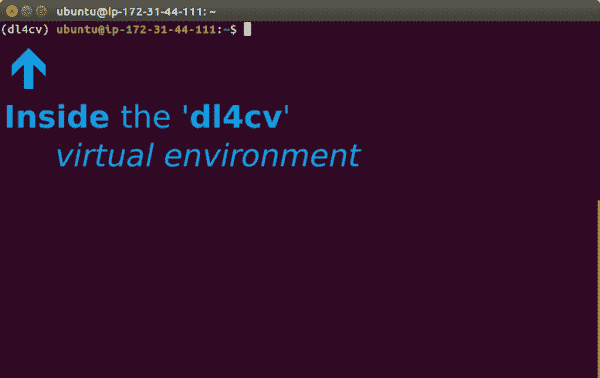
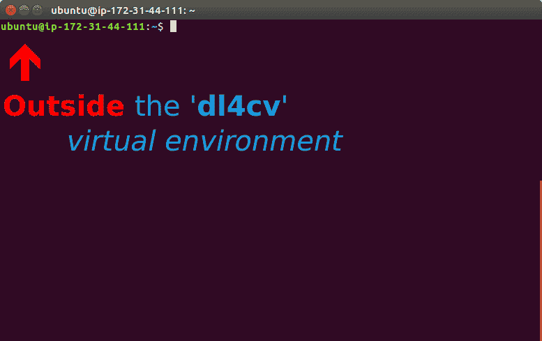

# 用 Python 设置 Ubuntu 16.04 + CUDA + GPU 进行深度学习

> 原文：<https://pyimagesearch.com/2017/09/27/setting-up-ubuntu-16-04-cuda-gpu-for-deep-learning-with-python/>



欢迎回来！这是深度学习开发环境配置系列的第四篇文章，伴随我的新书， *[用 Python 进行计算机视觉的深度学习](https://pyimagesearch.com/deep-learning-computer-vision-python-book/)。*

今天，我们将为您配置 Ubuntu + NVIDIA GPU + CUDA，让您在 GPU 上训练自己的深度学习网络时获得成功。

相关教程的链接可在此处找到:

*   [你的深度学习+ Python Ubuntu 虚拟机](https://pyimagesearch.com/2017/09/22/deep-learning-python-ubuntu-virtual-machine/)
*   [用 Python 预配置亚马逊 AWS 深度学习 AMI](https://pyimagesearch.com/2017/09/20/pre-configured-amazon-aws-deep-learning-ami-with-python/)
*   [用 Python](https://pyimagesearch.com/2017/09/25/configuring-ubuntu-for-deep-learning-with-python/) 为深度学习配置 Ubuntu(仅针对 CPU *的*环境)
*   用 Python 设置 Ubuntu 16.04 + CUDA + GPU 进行深度学习(本帖)
*   用 Python 配置 macOS 进行深度学习(周五发布)

如果你有一个兼容 NVIDIA CUDA 的 GPU，你可以使用本教程来配置你的深度学习开发，以在你优化的 GPU 硬件上训练和执行神经网络。

让我们开始吧！

## 用 Python 设置 Ubuntu 16.04 + CUDA + GPU 进行深度学习

如果你已经达到了这一点，你可能对深度学习很认真，并希望用 GPU 来训练你的神经网络。

图形处理单元因其并行处理架构而在深度学习方面表现出色——事实上，如今有许多专门为深度学习而构建的 GPU*——它们被用于计算机游戏领域之外。*

NVIDIA 是深度学习硬件的市场领导者，坦率地说，如果你进入这个领域，这是我推荐的主要选择。熟悉他们的产品系列(硬件和软件)是值得的，这样你就知道如果你在云中使用一个实例或者自己构建一台机器，你要付出什么。请务必查看开发者页面。

在大学和公司共享高端 GPU 机器是很常见的。或者，你可以构建一个，购买一个(就像我曾经做的那样)，或者在云中租用一个(就像我现在做的那样)。

如果你只是做几个实验，那么使用云服务提供商，如亚马逊、谷歌或 FloydHub，收取基于时间的使用费是一个不错的选择。

长期来看，如果你每天都在进行深度学习实验，那么出于节约成本的目的，手头上有一个是明智的(假设你愿意定期更新硬件和软件)。

***注意:**对于那些使用 **AWS 的 EC2** 的人，我建议你选择**p2 . xlage**、 **p2.8xlarge** 或**p 2.16 xlage**机器，以与这些指令兼容(取决于你的用例场景和预算)。较旧的实例 g2.2xlarge 和 g2.8xlarge 与本教程中的 CUDA 和 cuDNN 版本不兼容。我还建议你在你的操作系统驱动器/分区上有大约 32GB 的空间。在我的 EC2 实例上，16GB 并没有为我削减它。* 

需要特别指出的是 ***你不需要访问一台昂贵的 GPU 机器来开始深度学习*** 。大多数现代笔记本电脑的 CPU 可以很好地完成我书中前几章介绍的小实验。正如我所说的，“基础先于资金”——这意味着，在你用昂贵的硬件和云账单超出你的能力之前，先适应现代深度学习的基础和概念。我的书会让你做到这一点。

### 给 Ubuntu 配置 GPU 支持深度学习有多难？

你很快就会发现，配置一个 GPU 机器不是一件容易的事。事实上，事情变糟的步骤和可能性相当多。这就是为什么我构建了一个定制的 Amazon Machine Instance (AMI ),并为我的书附带的社区进行了预配置和预安装。

我在上一篇文章的[中详细介绍了如何将它加载到你的 AWS 账户中，以及如何启动它。](https://pyimagesearch.com/2017/09/20/pre-configured-amazon-aws-deep-learning-ami-with-python/)

使用 AMI 是迄今为止在 GPU 上开始深度学习的最快方式。即使你*有*的 GPU，也值得在 Amazon EC2 云中进行试验，这样你就可以拆除一个实例(如果你犯了一个错误)，然后立即启动一个新的、全新的实例。

自行配置环境直接关系到您的:

1.  使用 Linux 的经验
2.  注意细节
3.  耐心。

首先，您必须非常熟悉命令行。

下面的许多步骤都有命令，您可以简单地复制并粘贴到您的终端中；但是，在进入下一步之前，阅读输出、记录任何错误并尝试解决它们是很重要的。

你*必须*特别注意本教程中指令的顺序，此外还要注意命令本身。

实际上，我建议复制和粘贴，以确保你不会弄乱命令(在下面的一个例子中，反斜线和引号可能会让你卡住)。

如果您准备好迎接挑战，那么我会在那里与您一起准备好您的环境。事实上，我鼓励你留下评论，这样 PyImageSearch 社区可以为你提供帮助。在你发表评论之前，请务必查看**帖子**和**评论**，以确保你没有遗漏任何一步。

事不宜迟，让我们动手实践一下配置步骤。

### 步骤#0:关闭 X 服务器/X 窗口系统

在我们开始之前，我需要指出一个重要的先决条件**。在遵循以下说明之前，您需要执行以下操作之一:**

 **1.  SSH 到您的 GPU 实例中(关闭/禁用 X 服务器*)。*
**   直接在您的 GPU 机器上工作，无需运行您的 X 服务器(X 服务器，也称为 X11，是您在桌面上的图形用户界面)。我建议你试试本帖中[概述的方法之一。](https://askubuntu.com/questions/378046/how-to-run-ubuntu-xubuntu-in-a-complete-non-gui-mode)*

 *有几种方法可以做到这一点，有些很简单，有些则比较复杂。

第一种方法有点笨拙，但是很有效:

1.  关掉你的机器。
2.  拔掉你的显示器。
3.  重启。
4.  从一个单独的系统 SSH 到您的机器。
5.  执行安装说明。

这种方法非常有效，也是迄今为止最简单的方法。拔掉显示器的插头，X 服务器不会自动启动。从那里，你可以从一台单独的计算机 SSH 到你的机器，并遵循本文中概述的指示。

**第二种方法**假设你已经启动了你想要配置深度学习的机器:

1.  关闭所有正在运行的应用程序。
2.  按下`ctrl + alt + F2`。
3.  使用您的用户名和密码登录。
4.  通过执行`sudo service lightdm stop`停止 X 服务器。
5.  执行安装说明。

请注意，你需要一台单独的电脑来阅读指令或执行命令。或者，您可以使用基于文本的 web 浏览器。

### 步骤 1:安装 Ubuntu 系统依赖项

现在我们已经准备好了，让我们更新我们的 Ubuntu 操作系统:

```py
$ sudo apt-get update
$ sudo apt-get upgrade

```

然后，让我们安装一些必要的开发工具，图像/视频 I/O，GUI 操作和各种其他包:

```py
$ sudo apt-get install build-essential cmake git unzip pkg-config
$ sudo apt-get install libjpeg-dev libtiff5-dev libjasper-dev libpng12-dev
$ sudo apt-get install libavcodec-dev libavformat-dev libswscale-dev libv4l-dev
$ sudo apt-get install libxvidcore-dev libx264-dev
$ sudo apt-get install libgtk-3-dev
$ sudo apt-get install libhdf5-serial-dev graphviz
$ sudo apt-get install libopenblas-dev libatlas-base-dev gfortran
$ sudo apt-get install python-tk python3-tk python-imaging-tk

```

接下来，让我们安装 Python 2.7 和 Python 3 头文件，这样我们就可以使用 Python 绑定来编译 OpenCV:

```py
$ sudo apt-get install python2.7-dev python3-dev

```

我们还需要准备我们的系统，用 NVIDIA CUDA 驱动程序替换默认驱动程序:

```py
$ sudo apt-get install linux-image-generic linux-image-extra-virtual
$ sudo apt-get install linux-source linux-headers-generic

```

第一步到此为止，让我们继续。

### 步骤 2:安装 CUDA 工具包

CUDA 工具包安装步骤需要注意细节，以便顺利进行。

首先通过创建一个新文件来禁用新的内核驱动程序:

```py
$ sudo nano /etc/modprobe.d/blacklist-nouveau.conf

```

请随意使用您喜欢的终端文本编辑器，如`vim`或`emacs`，而不是`nano`。

添加以下行，然后保存并退出:

```py
blacklist nouveau
blacklist lbm-nouveau
options nouveau modeset=0
alias nouveau off
alias lbm-nouveau off

```

您的会话应该如下所示(如果您使用的是 nano):

[](https://pyimagesearch.com/wp-content/uploads/2017/09/blacklist-nouveau.conf_.png)

**Figure 1:** Editing the *blacklist-nouveau.conf* file with the *nano* text editor.

接下来，让我们更新初始 RAM 文件系统并重启机器:

```py
$ echo options nouveau modeset=0 | sudo tee -a /etc/modprobe.d/nouveau-kms.conf
$ sudo update-initramfs -u
$ sudo reboot

```

您将在重启时失去 SSH 连接，所以请耐心等待，然后在继续之前重新连接。

您将需要通过 NVIDIA CUDA Toolkit 网站下载 CUDA Toolkit v8.0 版:

[https://developer.nvidia.com/cuda-80-ga2-download-archive](https://developer.nvidia.com/cuda-80-ga2-download-archive)

进入下载页面后，选择`Linux => x86_64 => Ubuntu => 16.04 => runfile (local)`。

下面是下载页面的截图:

[](https://pyimagesearch.com/wp-content/uploads/2017/09/cuda_toolkit_download.png)

**Figure 2:** The CUDA Toolkit download page.

从那里下载文件名为`cuda_8.0.61_375.26_linux-run`或类似的`-run`文件。为此，只需右键单击复制下载链接，并在您的远程 GPU 框上使用`wget`:

```py
$ wget https://developer.nvidia.com/compute/cuda/8.0/Prod2/local_installers/cuda_8.0.61_375.26_linux-run

```

***重要提示:**在撰写本文时，NVIDIA 网站上有一个小的出入。如**图 2** 所示，在“基础安装程序”下载下，文件名(如所写)以`.run`结尾。实际可下载的文件以`-run`结尾。你现在应该可以复制我的`wget` + URL 命令了，除非 NVIDIA 再次更改文件名。*

***注意:**您需要点击上面代码块工具栏中的< = >按钮来展开代码块。这将使您能够将**的完整 URL** 复制到`-run`文件中。*

从那里，解压`-run`文件:

```py
$ chmod +x cuda_8.0.61_375.26_linux-run
$ mkdir installers
$ sudo ./cuda_8.0.61_375.26_linux-run -extract=`pwd`/installers

```

上面程序块中的最后一步可能需要 30-60 秒，这取决于您机器的速度。

现在是时候安装 NVIDIA 内核驱动程序了:

```py
$ cd installers
$ sudo ./NVIDIA-Linux-x86_64-375.26.run

```

在此过程中，接受许可证并按照屏幕上的提示进行操作。

[](https://pyimagesearch.com/wp-content/uploads/2017/09/accept_license.png)

**Figure 3:** Accepting the NVIDIA End User License Agreement.

从那里，将 NVIDIA 可加载内核模块(LKM)添加到 Linux 内核:

```py
$ modprobe nvidia

```

安装 CUDA 工具包和示例:

```py
$ sudo ./cuda-linux64-rel-8.0.61-21551265.run
$ sudo ./cuda-samples-linux-8.0.61-21551265.run

```

再次接受许可并遵循默认提示。你可能需要按“空格”来滚动许可协议，然后输入“接受”,就像我在上面的图片中所做的那样。当它询问您安装路径时，只需按`<enter>`接受默认值。

既然已经安装了 NVIDIA CUDA 驱动程序和工具，您需要更新您的`~/.bashrc`文件以包含 CUDA Toolkit(我建议使用终端文本编辑器，如`vim`、`emacs`或`nano`):

```py
# NVIDIA CUDA Toolkit
export PATH=/usr/local/cuda-8.0/bin:$PATH
export LD_LIBRARY_PATH=/usr/local/cuda-8.0/lib64/

```

现在，重新加载您的`~/.bashrc` ( `source ~/.bashrc`)，然后通过编译`deviceQuery`示例程序并运行它来测试 CUDA 工具包的安装:

```py
$ source ~/.bashrc
$ cd /usr/local/cuda-8.0/samples/1_Utilities/deviceQuery
$ sudo make
$ ./deviceQuery
deviceQuery, CUDA Driver = CUDART, CUDA Driver Version = 8.0, CUDA Runtime Version = 8.0, NumDevs = 1, Device0 = Tesla K80
Result = PASS

```

***注意:*** *在`~/.bashrc`上调用`source`对于我们当前的 shell 会话来说，只需要**一次**。每当我们打开一个新的终端，`~/.bashrc`的内容就会自动**执行**(包括我们的更新)。*

此时，如果你有`Result = PASS`，那么*祝贺*，因为你已经准备好进入下一步。

如果你看不到这个结果，我建议你重复第 2 步，仔细检查每一个命令*的输出，以确保安装过程中没有错误。*

### 第三步:安装 cuDNN (CUDA 深度学习神经网络库)

对于这一步，你需要[在 NVIDIA](https://developer.nvidia.com/accelerated-computing-developer-program) 创建一个免费账户，并[下载 cuDNN](https://developer.nvidia.com/cudnn) 。

对于本教程，我使用的是用于 Linux 的***cud nn v 6.0******也就是 TensorFlow 需要的*** 。

由于 NVIDIA 的*要求认证访问下载*，您可能无法在您的远程机器上使用`wget`进行下载。

相反，将文件下载到您的*本地机器*，然后(在您的本地机器上)使用`scp`(安全拷贝)，同时用适当的值替换`<username>`和`<password>`，以将文件更新到您的远程实例(同样，假设您通过 SSH 访问您的机器):

```py
scp -i EC2KeyPair.pem ~/Downloads/cudnn-8.0-linux-x64-v6.0.tgz \
	username@your_ip_address:~

```

接下来，解压缩文件，然后将结果文件分别复制到`lib64`和`include`中，使用`-P`开关保留符号链接:

```py
$ cd ~
$ tar -zxf cudnn-8.0-linux-x64-v6.0.tgz
$ cd cuda
$ sudo cp -P lib64/* /usr/local/cuda/lib64/
$ sudo cp -P include/* /usr/local/cuda/include/
$ cd ~

```

这就是**步骤#3** 的全部内容——这里没有太多可能出错的地方，所以您应该准备好继续进行。

### 步骤 4:创建您的 Python 虚拟环境

在本节中，我们将在您的系统上配置一个 Python 虚拟环境。

#### 安装 pip

第一步是安装`pip`，一个 Python 包管理器:

```py
$ wget https://bootstrap.pypa.io/get-pip.py
$ sudo python get-pip.py
$ sudo python3 get-pip.py

```

#### 安装 virtualenv 和 virtualenvwrapper

使用`pip`，我们可以很容易地安装 Python 包索引中的任何包，包括 [virtualenv](https://virtualenv.pypa.io/en/latest/) 和 [virtualenvwrapper](https://virtualenvwrapper.readthedocs.org/en/latest/) 。如你所知，我是 Python 虚拟环境的粉丝，我鼓励你也将它们用于深度学习。

如果您的机器上有多个项目，使用虚拟环境将允许您隔离它们并安装不同版本的包。简而言之，同时使用`virtualenv`和`virtualenvwrapper`可以让你解决*“项目 X 依赖于 1.x 版本，但项目 Y 需要 4.x* 的困境。

如果我没有说服你，RealPython 的人也许能说服你，所以[读一读 RealPython 上这篇精彩的博文](https://realpython.com/blog/python/python-virtual-environments-a-primer/)。

让我再次重申，在 Python 社区中，利用某种虚拟环境是**的标准做法，所以我建议你也这样做:**

```py
$ sudo pip install virtualenv virtualenvwrapper
$ sudo rm -rf ~/.cache/pip get-pip.py

```

一旦我们安装了`virtualenv`和`virtualenvwrapper`，我们需要更新我们的`~/.bashrc`文件，在文件的*底部*包含以下行:

```py
# virtualenv and virtualenvwrapper
export WORKON_HOME=$HOME/.virtualenvs
export VIRTUALENVWRAPPER_PYTHON=/usr/bin/python3
source /usr/local/bin/virtualenvwrapper.sh

```

编辑完我们的`~/.bashrc`文件后，我们需要重新加载修改:

```py
$ source ~/.bashrc

```

现在我们已经安装了`virtualenv`和`virtualenvwrapper`，下一步是实际上*创建*Python 虚拟环境——我们使用`mkvirtualenv`命令来完成。

#### 创建 dl4cv 虚拟环境

在过去的安装教程中，我介绍了 Python 2.7 或 Python 3 的选择。在 Python 3 开发周期的这一点上，我认为它是稳定和正确的选择。如果您有特定的兼容性需求，您可以选择使用 Python 2.7，但是出于我的书的目的，我们将使用 Python 3 。

也就是说，对于下面的命令，确保将`-p`标志设置为`python3`。

```py
$ mkvirtualenv dl4cv -p python3

```

您可以随意命名这个虚拟环境(并创建任意数量的 Python 虚拟环境)，但是目前，我建议坚持使用`dl4cv`名称，因为这是我将在本教程的剩余部分中使用的名称。

#### 验证您是否处于“dl4cv”虚拟环境中

如果你重启了你的 Ubuntu 系统；注销并重新登录；或者打开一个新的终端，您需要使用`workon`命令来重新访问您的`dl4cv`虚拟环境。下面是一个`workon`命令的例子:

```py
$ workon dl4cv

```

要验证您是否在`dl4cv`虚拟环境中，只需检查您的命令行— *如果您在提示前看到文本`(dl4cv)`，那么您**在`dl4cv`虚拟环境中是****:*

[](https://pyimagesearch.com/wp-content/uploads/2017/09/in_dl4cv.png.png)

**Figure 4:** Inside the *dl4cv* virtual environment.

否则，如果你 ***没有*** 看到`dl4cv`文本，那么你 ***在`dl4cv`虚拟环境中就不是*** :

[](https://pyimagesearch.com/wp-content/uploads/2017/09/outside_dl4cv.png.png)

**Figure 5:** Outside the *dl4cv* virtual environment. Execute *workon dl4cv* to activate the environment.

#### 安装 NumPy

在我们编译 OpenCV 之前的最后一步是安装 [NumPy](http://www.numpy.org/) ，一个用于数值处理的 Python 包。要安装 NumPy，请确保您处于`dl4cv`虚拟环境中(否则 NumPy 将被安装到 Python 的*系统*版本中，而不是`dl4cv`环境中)。

从那里执行以下命令:

```py
$ pip install numpy

```

一旦 NumPy 安装在您的虚拟环境中，我们就可以继续编译和安装 OpenCV。

### 步骤 5:编译并安装 OpenCV

首先你需要将 opencv 和 opencv_contrib 下载到你的主目录中。对于本安装指南，我们将使用 OpenCV 3.3:

```py
$ cd ~
$ wget -O opencv.zip https://github.com/Itseez/opencv/archive/3.3.0.zip
$ wget -O opencv_contrib.zip https://github.com/Itseez/opencv_contrib/archive/3.3.0.zip

```

然后，解压缩这两个文件:

```py
$ unzip opencv.zip
$ unzip opencv_contrib.zip

```

#### 运行 CMake

在这一步中，我们创建一个构建目录，然后运行 CMake:

```py
$ cd ~/opencv-3.3.0/
$ mkdir build
$ cd build
$ cmake -D CMAKE_BUILD_TYPE=RELEASE \
    -D CMAKE_INSTALL_PREFIX=/usr/local \
    -D WITH_CUDA=OFF \
    -D INSTALL_PYTHON_EXAMPLES=ON \
    -D OPENCV_EXTRA_MODULES_PATH=~/opencv_contrib-3.3.0/modules \
    -D BUILD_EXAMPLES=ON ..

```

***注意:**我关掉了 CUDA，因为它会导致一些机器上的编译错误。CUDA 优化将在内部用于 C++函数，所以它与 Python + OpenCV 没有太大区别。同样，CUDA 在这篇博文中的主要用途是优化我们的深度学习库，而不是 OpenCV 本身。* 

对于 CMake，为了兼容性，您的标志与我的标志匹配是很重要的。此外，确保你的`opencv_contrib`版本与你下载的`opencv`版本完全相同(这里是版本`3.3.0`)。

在我们进入实际的编译步骤之前，*确保检查 CMake* 的输出。

首先滚动到标题为`Python 3`的部分。

确保您的 Python 3 部分如下图所示:

[](https://pyimagesearch.com/wp-content/uploads/2017/09/cmake_ver.png)

**Figure 6:** Verifying that CMake has properly set up the compile to use the correct Python 3 Interpreter and version of NumPy. Both Python 3 and NumPy should be pulled from the *dl4cv* virtual environment.

确保解释器指向位于虚拟环境中的二进制文件，而 T2 指向我们的 NumPy 安装。

在任何一种情况下，如果您 ***没有*** 看到这些变量路径中的`dl4cv`虚拟环境，那么 ***几乎肯定是因为您在运行 CMake 之前不在`dl4cv`虚拟环境中！***

如果是这种情况，使用`workon dl4cv`访问`dl4cv`虚拟环境，并重新运行上述命令。

#### 编译 OpenCV

现在我们已经准备好编译 OpenCV 了:

```py
$ make -j4

```

***注意:*** *如果遇到编译错误，可以运行命令`make clean`，然后只编译不加标志:`make`。你可以通过`-j`开关来调整编译 OpenCV 所使用的处理器内核数量(在上面的例子中，我用四个内核来编译 OpenCV)。
*

从那里，你需要做的就是安装 OpenCV 3.3:

```py
$ sudo make install
$ sudo ldconfig
$ cd ~

```

您也可以删除您的`opencv`和`opencv_contrib`目录来释放系统空间；然而，我*强烈建议*等到本教程结束，并确保 OpenCV 已经正确安装*之后*再删除这些文件(否则你将不得不重新下载)。

#### 将 OpenCV 符号链接到您的虚拟环境

要将我们的 OpenCV 绑定符号链接到`dl4cv`虚拟环境中，发出以下命令

```py
$ cd ~/.virtualenvs/dl4cv/lib/python3.5/site-packages/
$ ln -s /usr/local/lib/python3.5/site-packages/cv2.cpython-35m-x86_64-linux-gnu.so cv2.so
$ cd ~

```

***注意:**确保点击上方工具栏中的< = >按钮展开代码块。在那里，确保正确地复制并粘贴了`ln`命令，否则您将创建一个无效的符号链接，Python 将无法找到您的 OpenCV 绑定。*

您的`.so`文件可能与上面显示的有些不同，所以一定要使用合适的文件。

#### 测试您的 OpenCV 3.3 安装

现在我们已经安装并链接了 OpenCV 3.3，让我们做一个快速的健全性测试来看看事情是否正常:

```py
$ python
>>> import cv2
>>> cv2.__version__
'3.3.0'

```

在启动 Python 之前，确保你处于`dl4cv`虚拟环境中。您可以通过运行`workon dl4cv`来实现这一点。

当您在 Python shell 中打印 OpenCV 版本时，它应该与您安装的 OpenCV 版本相匹配(在我们的例子中是 OpenCV `3.3.0`)。

当您的编译 100%完成时，您应该会看到类似如下的输出:

就这样——假设您没有导入错误，那么您就准备好继续进行**步骤#6** ,在这里我们将安装 [Keras](https://pyimagesearch.com/2018/04/16/keras-and-convolutional-neural-networks-cnns/) 。

### Step #6: Install [Keras](https://pyimagesearch.com/2018/04/16/keras-and-convolutional-neural-networks-cnns/)

对于这一步，通过发出`workon dl4cv`命令，确保您处于`dl4cv`环境中。

从那里我们可以安装一些需要的计算机视觉、图像处理和机器学习库:

```py
$ pip install scipy matplotlib pillow
$ pip install imutils h5py requests progressbar2
$ pip install scikit-learn scikit-image

```

接下来，安装 Tensorflow (GPU 版):

```py
$ pip install tensorflow-gpu

```

您可以通过在 Python shell 中导入 TensorFlow 来验证它是否已安装:

```py
$ python
>>> import tensorflow
>>>

```

现在我们准备安装 [Keras](https://pyimagesearch.com/2018/04/16/keras-and-convolutional-neural-networks-cnns/) :

```py
$ pip install keras

```

同样，您可以通过 Python shell 验证 Keras 是否已经安装:

```py
$ python
>>> import keras
Using TensorFlow backend.
>>>

```

您应该看到 Keras 已经被正确导入 ***和***tensor flow 后端正在被使用。

在进入第 7 步之前，花点时间熟悉一下`~/.keras/keras.json`文件:

```py
{
    "image_data_format": "channels_last",
    "backend": "tensorflow",
    "epsilon": 1e-07,
    "floatx": "float32"
}

```

确保`image_data_format`设置为`channels_last`并且`backend`为`tensorflow`。

**恭喜你！**你现在已经准备好开始你的用 Python 进行计算机视觉的*深度学习*之旅(*初学者包*和*实践者包*读者可以安全地*跳过* **步骤#7** )。

### 步骤 7 安装 mxnet(仅 ImageNet 捆绑包)

只有购买了使用 Python 进行计算机视觉的*深度学习的 *ImageNet 捆绑包*的读者才需要这一步。如果您想在系统上配置 mxnet，也可以选择使用这些说明。*

不管怎样，让我们首先克隆 mxnet 存储库和检出分支`0.11.0`:

```py
$ cd ~
$ git clone --recursive https://github.com/apache/incubator-mxnet.git mxnet --branch 0.11.0

```

我们可以编译 mxnet:

```py
$ cd mxnet
$ make -j4 USE_OPENCV=1 USE_BLAS=openblas USE_CUDA=1 USE_CUDA_PATH=/usr/local/cuda USE_CUDNN=1

```

然后是到我们 dl4cv 环境的符号链接。

```py
$ cd ~/.virtualenvs/dl4cv/lib/python3.5/site-packages/
$ ln -s ~/mxnet/python/mxnet mxnet
$ cd ~

```

最后，您可以在您的环境中启动 Python 来测试安装是否成功:

```py
$ python
>>> import mxnet
>>>

```

***注意:** **不要删除**你的 home 文件夹中的`mxnet`目录。不仅我们的 Python 绑定在那里，而且当创建序列化的图像数据集时，我们还需要`~/mxnet/bin`中的文件。*

**干杯！**当你阅读*使用 Python 的计算机视觉深度学习* (ImageNet bundle)时，你已经完成并值得一杯冰啤酒。

***注意:*** *为了避免大量的云费用(或者电费，如果你的盒子在桌子下面的话)，我建议你关掉你的机器，直到你准备好使用它。*

## 摘要

今天，我们学习了如何使用必要的工具来设置 Ubuntu + CUDA + GPU 机器，以便在训练自己的深度学习网络时取得成功。

如果您在这个过程中遇到了任何问题，我强烈建议您检查一下是否跳过了任何步骤。如果你还是被卡住了，请在下面留下评论。

我想重申，你不需要一台花哨、昂贵的 GPU 机器来开始你的计算机视觉深度学习之旅。你的 CPU 可以处理书中的介绍性例子。为了帮助你开始，我在这里为 Ubuntu CPU 用户提供了一个安装教程[。如果你喜欢简单的、预先配置好的路线，我的书附带了一个](https://pyimagesearch.com/2017/09/25/configuring-ubuntu-for-deep-learning-with-python/) [VirtualBox 虚拟机，随时可用](https://pyimagesearch.com/2017/09/22/deep-learning-python-ubuntu-virtual-machine/)。

希望这篇教程对你的深度学习之旅有所帮助！

如果你想深入研究深度学习，一定要看看我的新书， *[用 Python 进行计算机视觉的深度学习](https://pyimagesearch.com/deep-learning-computer-vision-python-book/)。*

**为了在 PyImageSearch 博客上发布以后的博文和教程时得到通知，*请务必在下面的表格中输入您的电子邮件地址！********