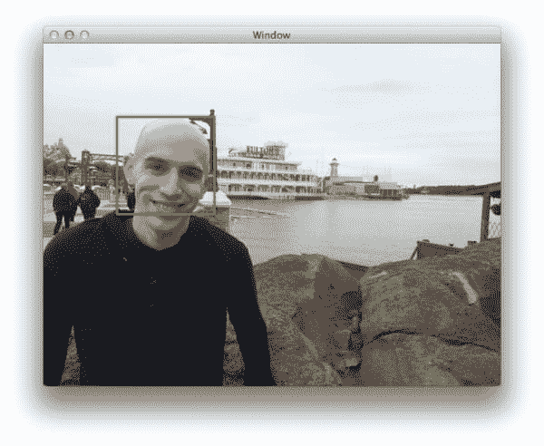
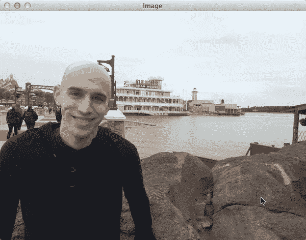
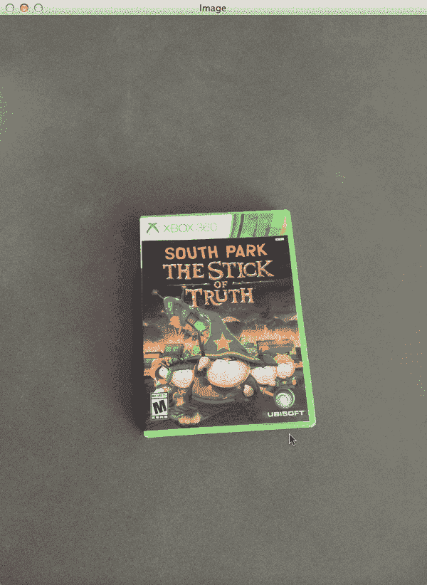

# 用 Python 和 OpenCV 实现对象检测的滑动窗口

> 原文：<https://pyimagesearch.com/2015/03/23/sliding-windows-for-object-detection-with-python-and-opencv/>

[](https://pyimagesearch.com/wp-content/uploads/2015/03/sliding_window_example.jpg)

所以在上周的博客文章中，我们发现了如何构建一个图像金字塔。

在今天的文章中，我们将扩展这个例子，引入一个 ***滑动窗口*** 的概念。滑动窗口在对象分类中起着不可或缺的作用，因为它们允许我们精确定位图像中对象所在的*位置。*

 *利用滑动窗口和图像金字塔，我们能够在不同的尺度和位置检测图像中的对象。

事实上，在我的 [6 步 HOG +线性 SVM](https://pyimagesearch.com/2014/11/10/histogram-oriented-gradients-object-detection/ "Histogram of Oriented Gradients and Object Detection") 对象分类框架中，滑动窗口和图像金字塔都被使用了！

要了解滑动窗口在对象分类和图像分类中的作用，请继续阅读。当你读完这篇博文时，你会对图像金字塔和滑动窗口如何用于分类有一个很好的理解。

# 什么是滑动窗口？

在计算机视觉的上下文中(顾名思义)，滑动窗口是一个固定宽度和高度的矩形区域，它在图像上“滑动”，如下图所示:

[](https://pyimagesearch.com/wp-content/uploads/2014/10/sliding_window_example.gif)

**Figure 1:** Example of the sliding a window approach, where we slide a window from left-to-right and top-to-bottom.

对于这些窗口中的每一个，我们通常会获取窗口区域并应用一个*图像分类器*来确定窗口中是否有我们感兴趣的对象——在本例中是一张脸。

结合[图像金字塔](https://pyimagesearch.com/2015/03/16/image-pyramids-with-python-and-opencv/)我们可以创建图像分类器，这些图像分类器能够**识别图像中不同*比例*和*位置*的物体。**

这些技术虽然简单，但在物体检测和图像分类中扮演着绝对关键的角色。

# 用 Python 和 OpenCV 实现对象检测的滑动窗口

让我们继续，在上周的形象金字塔示例的基础上继续。

但是首先要确保你已经安装了 OpenCV 和 [imutils](https://github.com/jrosebr1/imutils) :

*   [用我的一个向导安装 OpenCV](https://pyimagesearch.com/opencv-tutorials-resources-guides/)
*   要安装`imutils`，请使用 pip: `pip install --upgrade imutils`

还记得`helpers.py`文件吗？重新打开并插入`sliding_window`功能:

```py
# import the necessary packages
import imutils

def pyramid(image, scale=1.5, minSize=(30, 30)):
	# yield the original image
	yield image

	# keep looping over the pyramid
	while True:
		# compute the new dimensions of the image and resize it
		w = int(image.shape[1] / scale)
		image = imutils.resize(image, width=w)

		# if the resized image does not meet the supplied minimum
		# size, then stop constructing the pyramid
		if image.shape[0] < minSize[1] or image.shape[1] < minSize[0]:
			break

		# yield the next image in the pyramid
		yield image

def sliding_window(image, stepSize, windowSize):
	# slide a window across the image
	for y in range(0, image.shape[0], stepSize):
		for x in range(0, image.shape[1], stepSize):
			# yield the current window
			yield (x, y, image[y:y + windowSize[1], x:x + windowSize[0]])

```

`sliding_window`函数需要三个参数。第一个是我们将要循环的`image`。第二个论点是`stepSize`。

步长表示我们将在 *(x，y)* 两个方向上“跳过”多少像素。通常，我们会 ***而不是*** 想要循环图像的每个像素(即`stepSize=1`)，因为如果我们在每个窗口应用图像分类器，这在计算上将是禁止的。

相反，`stepSize`是基于每个数据集的*确定的，并根据您的图像数据集进行调整以提供最佳性能。实际上，通常使用 4 到 8 个像素的`stepSize`。请记住，你的步长越小，你需要检查的窗口就越多。*

最后一个参数`windowSize`定义了我们要从`image`中提取的窗口的宽度和高度(以像素为单位)。

第 24-27 行相当简单，处理窗口的实际“滑动”。

**第 24-26 行**定义了两个`for`循环，它们在图像的 *(x，y)* 坐标上循环，按照提供的步长递增它们各自的`x`和`y`计数器。

然后，**第 27 行**返回包含滑动窗口的`x`和`y`坐标以及窗口本身的元组。

为了看到滑动窗口的运行，我们必须为它写一个驱动脚本。创建一个新文件，命名为`sliding_window.py`，我们将完成这个例子:

```py
# import the necessary packages
from pyimagesearch.helpers import pyramid
from pyimagesearch.helpers import sliding_window
import argparse
import time
import cv2

# construct the argument parser and parse the arguments
ap = argparse.ArgumentParser()
ap.add_argument("-i", "--image", required=True, help="Path to the image")
args = vars(ap.parse_args())

# load the image and define the window width and height
image = cv2.imread(args["image"])
(winW, winH) = (128, 128)

```

在**2-6 号线**，我们进口必要的包装。我们将使用上周[中的`pyramid`函数](https://pyimagesearch.com/2015/03/16/image-pyramids-with-python-and-opencv/)来构建我们的图像金字塔。我们还将使用刚刚定义的`sliding_window`函数。最后，我们导入`argparse`来解析命令行参数，导入`cv2`来解析 OpenCV 绑定。

**第 9-12 行**处理解析我们的命令行参数。我们在这里只需要一个开关，我们想要处理的`--image`。

从那里，**行 14** 从磁盘上加载我们的图像，**行 15** 分别定义我们的窗口宽度和高度为 128 像素。

现在，让我们继续结合我们的图像金字塔和滑动窗口:

```py
# loop over the image pyramid
for resized in pyramid(image, scale=1.5):
	# loop over the sliding window for each layer of the pyramid
	for (x, y, window) in sliding_window(resized, stepSize=32, windowSize=(winW, winH)):
		# if the window does not meet our desired window size, ignore it
		if window.shape[0] != winH or window.shape[1] != winW:
			continue

		# THIS IS WHERE YOU WOULD PROCESS YOUR WINDOW, SUCH AS APPLYING A
		# MACHINE LEARNING CLASSIFIER TO CLASSIFY THE CONTENTS OF THE
		# WINDOW

		# since we do not have a classifier, we'll just draw the window
		clone = resized.copy()
		cv2.rectangle(clone, (x, y), (x + winW, y + winH), (0, 255, 0), 2)
		cv2.imshow("Window", clone)
		cv2.waitKey(1)
		time.sleep(0.025)

```

我们从第 18 行的**开始循环图像金字塔的每一层。**

对于图像金字塔的每一层，我们也将在第 20 行的`sliding_window`中循环每个窗口。我们还对第 22-23 行**进行了检查，以确保我们的滑动窗口符合最小尺寸要求。**

如果我们应用图像分类器来检测对象，我们将通过从窗口中提取特征并将它们传递给我们的分类器(这是在我们的 [6 步 HOG +线性 SVM 对象检测框架](https://pyimagesearch.com/2014/11/10/histogram-oriented-gradients-object-detection/ "Histogram of Oriented Gradients and Object Detection")中完成的)在**行 25-27** 上完成。

但是由于我们没有图像分类器，我们将通过在图像上绘制一个矩形来显示滑动窗口的结果，该矩形指示滑动窗口在第 30-34 行上的位置。

# 结果

要查看我们的图像金字塔和滑动窗口的运行情况，请打开一个终端并执行以下命令:

```py
$ python sliding_window.py --image images/adrian_florida.jpg

```

如果一切顺利，您应该会看到以下结果:

[](https://pyimagesearch.com/wp-content/uploads/2015/03/sliding-window-animated-adrian.gif)

**Figure 2:** An example of applying a sliding window to each layer of the image pyramid.

在这里你可以看到金字塔的每一层都有一个窗口滑过。同样，如果我们有一个准备好的图像分类器，我们可以对每个窗口进行分类。**一个例子可以是*“这个窗口是否包含人脸？”***

这是另一个不同图像的例子:

```py
$ python sliding_window.py --image images/stick_of_truth.jpg.jpg

```

[](https://pyimagesearch.com/wp-content/uploads/2015/03/sliding-window-animated-sot.gif)

**Figure 3:** A second example of applying a sliding window to each layer of the image pyramid.

我们可以再次看到，滑动窗口在金字塔的每一层滑过图像。金字塔的高级别(以及更小的层)需要检查的窗口更少。

# 摘要

在这篇博文中，我们了解了滑动窗口及其在物体检测和图像分类中的应用。

通过将滑动窗口与图像金字塔相结合，我们能够在多个*和 ***位置*** 定位和检测图像中的对象。*

 *虽然滑动窗口和图像金字塔都是非常简单的技术，但它们在对象检测中是绝对关键的。

你可以在这篇[博客文章](https://pyimagesearch.com/2014/11/10/histogram-oriented-gradients-object-detection/ "Histogram of Oriented Gradients and Object Detection")中了解更多关于它们扮演的全球角色的信息，在这篇文章中，我详细介绍了如何使用梯度方向直方图图像描述符和线性 SVM 分类器来构建自定义对象检测器的框架。**