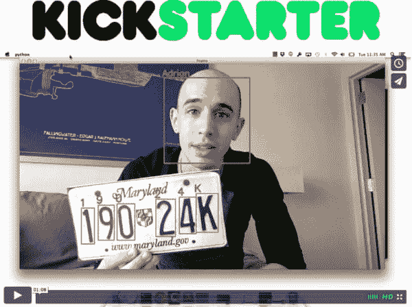

# 预览:PyImageSearch 大师

> 原文：<https://pyimagesearch.com/2015/01/08/sneak-preview-pyimagesearch-gurus/>

**哇，1 月 14 日的 Kickstarter 发布日期这么快就到了！**我还有一大堆事情要做，而且我深陷在 Kickstarter 的物流中，但今天早些时候我花了几分钟，为你录制了这个 PyImageSearch 大师的预览:

这段视频相当短，只有 1 分 08 秒，绝对值得一看，但是如果你没有足够的时间看，你可以阅读下面的要点:

*   0m07s:我演示了**人脸检测和识别**，我们将在 PyImageSearch Gurus 中介绍。
*   0m16s: [*实用 Python 和 OpenCV*](https://pyimagesearch.com/practical-python-opencv/) 将**作为 Kickstarter 独家奖励提供印刷版本。**这本书将**单独编号并亲笔签名**——这可能是这本书第*次*出版了！
*   0m23s:PyImageSearch 大师计算机视觉课程将 **6-8 个月**和**完全自定进度**。
*   0m38s:我演示了**自动车牌识别**，我们也会在 PyImageSearch Gurus 里面涉及到。
*   0m45s:加入 PyImageSearch 大师们的行列，利用 **Hadoop、Elasticsearch 和 Accumulo** 来构建大规模的图片搜索引擎。
*   0m50s: **深度学习和卷积神经网络**。是的，他们也会被覆盖。
*   **Kickstarter 将于美国东部时间*1 月 14 日*T3【上午 10 点】上线——我希望在 Kickstarter 支持者名单上看到你！**

就像我说的，如果你有时间，先睹为快绝对值得一看。

我希望你支持 1 月 14 日美国东部时间上午 10 点的 PyImageSearch 大师 Kickstarter 活动——如果你真的想提升你的计算机视觉和 OpenCV 技能，那么这将是你的完美课程！

明天我将发布另一个公告**，上面有**最终确定的计算机视觉主题列表，你将在 PyImageSearch 大师**中掌握这些主题。这是**大单**，你不会想错过的！**

要在这些公告发布时收到通知， **[请务必注册 Kickstarter 通知列表！](https://www.getdrip.com/forms/3607544/submissions/new)**