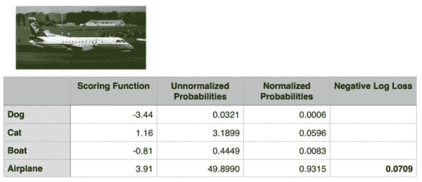
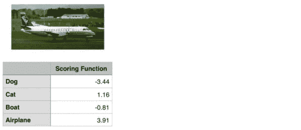
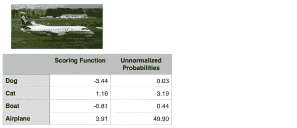
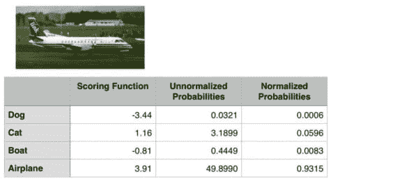
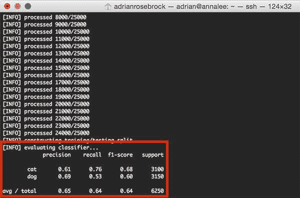
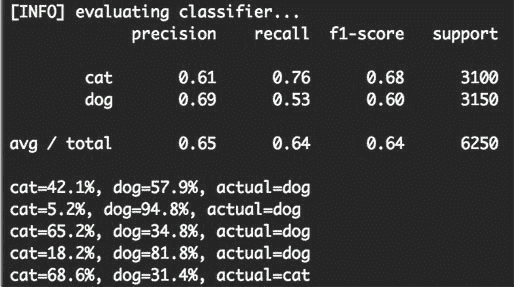

# softmax 分类广告解释

> 原文：<https://pyimagesearch.com/2016/09/12/softmax-classifiers-explained/>



上周我们讨论了[多级 SVM 损耗](https://pyimagesearch.com/2016/09/05/multi-class-svm-loss/)；具体来说，铰链损耗和平方铰链损耗函数。

在机器学习和深度学习的背景下，损失函数允许我们量化给定分类函数(也称为“得分函数”)在正确分类数据集中的数据点方面有多“好”或“坏”。

然而，虽然在训练机器学习/深度学习分类器时通常使用铰链损失和平方铰链损失，但还有另一种更常用的*方法…*

事实上，如果你以前做过深度学习方面的工作，你可能以前听说过这个函数——这些术语***【soft max 分类器】*** 和 ***交叉熵损失*** 听起来熟悉吗？

我甚至可以说，如果你在深度学习(特别是卷积神经网络)中做*任何*工作，你都会遇到术语“软最大值”:正是网络末端的*最后一层**为每个类别标签产生你的实际概率分数*。

要了解更多关于 Softmax 分类器和交叉熵损失函数的信息，请继续阅读。

## softmax 分类广告解释

虽然铰链损失非常普遍，但在深度学习和卷积神经网络的背景下，你更有可能遇到交叉熵损失和 Softmax 分类器。

这是为什么呢？

简单来说:

**Softmax 分类器给你每个类别标签的*概率*，而铰链损耗给你*余量* *。***

对我们人类来说，解释*概率*比解释差额分数(比如铰链损失和平方铰链损失)要容易得多。

此外，对于像 ImageNet 这样的数据集，我们经常查看卷积神经网络的 5 级精度(其中我们检查地面实况标签是否在网络为给定输入图像返回的前 5 个预测标签中)。

查看(1)真实类别标签是否存在于前 5 个预测中，以及(2)与预测标签相关联的*概率*是一个很好的属性。

### 了解多项式逻辑回归和 Softmax 分类器

Softmax 分类器是二进制形式的逻辑回归的推广。就像在铰链损失或平方铰链损失中一样，我们的映射函数 *f* 被定义为它获取一组输入数据 *x* 并通过数据 *x* 和权重矩阵 *W* 的简单(线性)点积将它们映射到输出类标签:

 = Wx_{i}")

然而，与铰链损失不同，我们将这些分数解释为每个类别标签的*非标准化对数概率*——这相当于用交叉熵损失替换我们的铰链损失函数:

")

那么，我是怎么来到这里的呢？让我们把功能拆开来看看。

首先，我们的损失函数应该最小化正确类别的负对数可能性:

")

这种概率陈述可以解释为:

 = e^{s_{y_{i}}} / \sum_{j} e^{s_{j}}")

我们使用标准的评分函数形式:

")

总的来说，这产生了一个*单个*数据点的最终损失函数，如上所示:

")

***注:*** *你这里的对数其实是以 e 为底(自然对数)由于我们前面是取 e 的幂的倒数，*

通过指数之和的实际取幂和归一化是我们实际的 *Softmax 函数*。负对数产生我们实际的*交叉熵损失。*

正如铰链损失或平方铰链损失一样，计算整个数据集的交叉熵损失是通过取平均值来完成的:


如果这些方程看起来很可怕，不要担心——在下一节中，我将给出一个实际的数值例子。

***注意:*** *我特意省略了正则化术语，以免使本教程臃肿或迷惑读者。我们将在未来的博客文章中回到正则化，并解释它是什么，如何使用，以及为什么它对机器学习/深度学习很重要。*

### 一个成功的 Softmax 示例

为了演示实际的交叉熵损失，请考虑下图:



**Figure 1:** To compute our cross-entropy loss, let’s start with the output of our scoring function (the first column).

我们的目标是分类上面的图像是否包含一只*狗*、*猫*、*船*或*飞机。*

我们可以清楚地看到，这个图像是一架“飞机”。但是我们的 Softmax 分类器呢？

为了找到答案，我在上面的**图 1** 中分别包含了四个类的评分函数 *f* 的输出。这些值是我们的四个类别的*非标准化对数概率*。

***注意:**我使用了一个随机数生成器来获得这个特定例子的这些值。这些值仅用于演示如何执行 Softmax 分类器/交叉熵损失函数的计算。实际上，这些值不是随机生成的——而是您的评分函数* f 的输出。

让我们对评分函数的输出进行指数运算，得到我们的*非标准化概率:*



**Figure 2:** Exponentiating the output values from the scoring function gives us our unnormalized probabilities.

下一步是取分母，对指数求和，然后除以总和，从而产生与每个类标签相关联的*实际概率:*



**Figure 3:** To obtain the actual probabilities, we divide each individual unnormalized probability by the sum of unnormalized probabilities.

最后，我们可以取负对数，得出我们的最终损失:


**Figure 4:** Taking the negative log of the probability for the correct ground-truth class yields the final loss for the data point.

在这种情况下，我们的 Softmax 分类器将以 93.15%的置信度正确地将图像报告为*飞机*。

### Python 中的 Softmax 分类器

为了用实际的 Python 代码演示我们到目前为止学到的一些概念，我们将使用一个带有日志丢失函数的 [SGDClassifier](http://scikit-learn.org/stable/modules/generated/sklearn.linear_model.SGDClassifier.html) 。

***注:*** *我们会在以后的博文中了解更多关于随机梯度下降和其他优化方法的内容。*

对于这个示例，我们将再次使用 Kaggle 狗与猫数据集，因此在开始之前，请确保您已经:

1.  使用本教程底部的 ***“下载”*** 表单下载了这篇博文的源代码。
2.  下载了 [Kaggle 狗对猫数据集](https://www.kaggle.com/c/dogs-vs-cats/data)。

在我们的特定示例中，Softmax 分类器实际上会简化为一种特殊情况——当有 *K=2* 个类时，Softmax 分类器会简化为简单的逻辑回归。如果我们有 *> 2* 类，那么我们的分类问题将变成*多项式逻辑回归*，或者更简单地说，一个 Softmax 分类器。

如上所述，打开一个新文件，将其命名为`softmax.py`，并插入以下代码:

```py
# import the necessary packages
from sklearn.preprocessing import LabelEncoder
from sklearn.linear_model import SGDClassifier
from sklearn.metrics import classification_report
from sklearn.cross_validation import train_test_split
from imutils import paths
import numpy as np
import argparse
import imutils
import cv2
import os

```

如果您在过去几周一直关注 PyImageSearch 博客，那么上面的代码可能看起来非常熟悉——我们在这里所做的只是导入我们需要的 Python 包。

我们将使用 [scikit-learn 库](http://scikit-learn.org/stable/)，因此如果您还没有安装它，请务必现在安装它:

```py
$ pip install scikit-learn

```

我们还将使用我的 [imutils 包](https://github.com/jrosebr1/imutils)，这是一系列方便的功能，用于使执行常见的图像处理操作变得更容易。如果您没有安装`imutils`,您也可以安装它:

```py
$ pip install imutils

```

接下来，我们定义我们的`extract_color_histogram`函数，该函数用于使用提供的`bins`的数量来量化我们的输入`image`的颜色分布:

```py
def extract_color_histogram(image, bins=(8, 8, 8)):
	# extract a 3D color histogram from the HSV color space using
	# the supplied number of `bins` per channel
	hsv = cv2.cvtColor(image, cv2.COLOR_BGR2HSV)
	hist = cv2.calcHist([hsv], [0, 1, 2], None, bins,
		[0, 180, 0, 256, 0, 256])

	# handle normalizing the histogram if we are using OpenCV 2.4.X
	if imutils.is_cv2():
		hist = cv2.normalize(hist)

	# otherwise, perform "in place" normalization in OpenCV 3 (I
	# personally hate the way this is done
	else:
		cv2.normalize(hist, hist)

	# return the flattened histogram as the feature vector
	return hist.flatten()

```

这个功能我之前已经复习过几次了，所以就不详细复习了。关于`extract_color_histogram`，我们为什么使用它，以及它是如何工作的更深入的讨论，[请看这篇博文](https://pyimagesearch.com/2016/08/08/k-nn-classifier-for-image-classification/)。

同时，请记住，这个函数**通过构建像素强度直方图来量化图像的内容。**

让我们解析我们的命令行参数，并从磁盘中获取 25，000 张狗和猫的图像的路径:

```py
# construct the argument parse and parse the arguments
ap = argparse.ArgumentParser()
ap.add_argument("-d", "--dataset", required=True,
	help="path to input dataset")
args = vars(ap.parse_args())

# grab the list of images that we'll be describing
print("[INFO] describing images...")
imagePaths = list(paths.list_images(args["dataset"]))

# initialize the data matrix and labels list
data = []
labels = []

```

这里我们只需要一个开关`--dataset`，它是我们输入狗和猫图像的路径。

一旦我们有了这些图像的路径，我们就可以逐个遍历它们，并提取每幅图像的颜色直方图:

```py
# loop over the input images
for (i, imagePath) in enumerate(imagePaths):
	# load the image and extract the class label (assuming that our
	# path as the format: /path/to/dataset/{class}.{image_num}.jpg
	image = cv2.imread(imagePath)
	label = imagePath.split(os.path.sep)[-1].split(".")[0]

	# extract a color histogram from the image, then update the
	# data matrix and labels list
	hist = extract_color_histogram(image)
	data.append(hist)
	labels.append(label)

	# show an update every 1,000 images
	if i > 0 and i % 1000 == 0:
		print("[INFO] processed {}/{}".format(i, len(imagePaths)))

```

同样，因为我已经在 PyImageSearch 博客上多次查看过这个样板代码，所以我会让你参考[这篇博文](https://pyimagesearch.com/2016/08/08/k-nn-classifier-for-image-classification/)以获得关于特征提取过程的更详细的讨论。

我们的下一步是构建培训和测试部分。我们将使用 75%的数据来训练我们的分类器，剩余的 25%用于测试和评估模型:

```py
# encode the labels, converting them from strings to integers
le = LabelEncoder()
labels = le.fit_transform(labels)

# partition the data into training and testing splits, using 75%
# of the data for training and the remaining 25% for testing
print("[INFO] constructing training/testing split...")
(trainData, testData, trainLabels, testLabels) = train_test_split(
	np.array(data), labels, test_size=0.25, random_state=42)

# train a Stochastic Gradient Descent classifier using a softmax
# loss function and 10 epochs
model = SGDClassifier(loss="log", random_state=967, n_iter=10)
model.fit(trainData, trainLabels)

# evaluate the classifier
print("[INFO] evaluating classifier...")
predictions = model.predict(testData)
print(classification_report(testLabels, predictions,
	target_names=le.classes_))

```

我们还使用`log`损失函数(**第 75 行和第 76 行**)来训练我们的`SGDClassifier`。使用`log`损失函数确保我们将在测试时获得每个类标签的*概率估计值*。

**第 79-82 行**然后为我们的分类器显示一个格式良好的准确性报告。

为了检查一些实际的*概率*，让我们循环几个随机抽样的训练示例，并检查分类器返回的输出概率:

```py
# to demonstrate that our classifier actually "learned" from
# our training data, randomly sample a few training images
idxs = np.random.choice(np.arange(0, len(trainData)), size=(5,))

# loop over the training indexes
for i in idxs:
	# predict class probabilities based on the extracted color
	# histogram
	hist = trainData[i].reshape(1, -1)
	(catProb, dogProb) = model.predict_proba(hist)[0]

	# show the predicted probabilities along with the actual
	# class label
	print("cat={:.1f}%, dog={:.1f}%, actual={}".format(catProb * 100,
		dogProb * 100, le.inverse_transform(trainLabels[i])))

```

***注意:**我从*训练数据*而不是*测试数据*中随机抽样，以证明每个类别标签的概率之间应该有明显的巨大差距。每个分类是否正确是另一回事——但是即使我们的预测是错误的，我们仍然应该看到某种差距，这表明我们的分类器实际上正在从数据中学习。*

**第 93 行**通过`.predict_proba`函数计算随机采样数据点的概率。

猫和狗类的预测概率随后显示在我们屏幕的第 97 和 98 行上。

### Softmax 分类器结果

一旦你:

1.  使用本教程底部的 ***“下载”*** 表单将源代码下载到这个博客。
2.  下载了 [Kaggle 狗对猫数据集](https://www.kaggle.com/c/dogs-vs-cats/data)。

您可以执行以下命令从我们的数据集中提取特征并训练我们的分类器:

```py
$ python softmax.py --dataset kaggle_dogs_vs_cats

```

训练完我们的`SGDClassifier`，你应该会看到下面的分类报告:



**Figure 5:** Computing the accuracy of our SGDClassifier with log loss — we obtain 65% classification accuracy.

请注意，我们的分类器已经获得了 **65%的准确度**，比在我们的[线性分类柱](https://pyimagesearch.com/2016/08/22/an-intro-to-linear-classification-with-python/)中使用线性 SVM 时的 **64%的准确度**有所提高。

要调查给定数据点的单个类别概率，请查看其余的`softmax.py`输出:



**Figure 6:** Investigating the class label probabilities for each prediction.

对于每一个随机采样的数据点，我们被给定了“狗”和“猫”的分类标签概率*，以及*实际地面实况标签。**

基于这个样本，我们可以看到我们获得了 *4 / 5 = 80%* 的准确率。

但更重要的是，注意在类别标签概率之间有一个特别大的差距。如果我们的 Softmax 分类器预测到“狗”，那么与“狗”相关联的概率将会很高。相反，与“猫”相关联的类别标签概率将会很低。

类似地，如果我们的 Softmax 分类器预测“猫”，那么与“猫”相关联的概率将是高的，而与“狗”相关联的概率将是“低的”。

这种行为意味着在我们的预测中有一些实际的*置信度*，并且我们的算法实际上是从数据集*学习*。

确切地说,*学习如何发生涉及更新我们的权重矩阵 *W* ，这归结为一个*优化问题*。我们将在未来的博客文章中回顾如何执行梯度体面和其他优化算法。*

## 摘要

在今天的博客文章中，我们看了 Softmax 分类器，它是二元逻辑回归分类器的简单推广。

当构建深度学习和卷积神经网络模型时，你将*无疑*遇到 Softmax 分类器和交叉熵损失函数。

虽然铰链损失和平方铰链损失都是受欢迎的选择，但我几乎可以绝对肯定地保证，你会看到更多频率的交叉熵损失——这主要是因为 Softmax 分类器输出*概率*而不是*余量*。概率对于我们人类来说更容易解释，所以这是 Softmax 分类器的一个特别好的特性。

现在我们理解了损失函数的基本原理，我们准备给我们的损失方法加上另一个术语— ***正则化。***

正则化项被附加到我们的损失函数中，并用于控制我们的权重矩阵 *W* 看起来如何。通过控制 *W* 并确保它“看起来”像某种方式，我们实际上可以*提高分类的准确性。*

在我们讨论正则化之后，我们可以继续进行*优化*——这个过程实际上采用我们的得分和损失函数的输出，并使用这个输出来调整我们的权重矩阵 *W* 以实际“学习”。

无论如何，我希望你喜欢这篇博文！

在您离开之前，请务必在下面的表格中输入您的电子邮件地址，以便在新博文发布时得到通知！