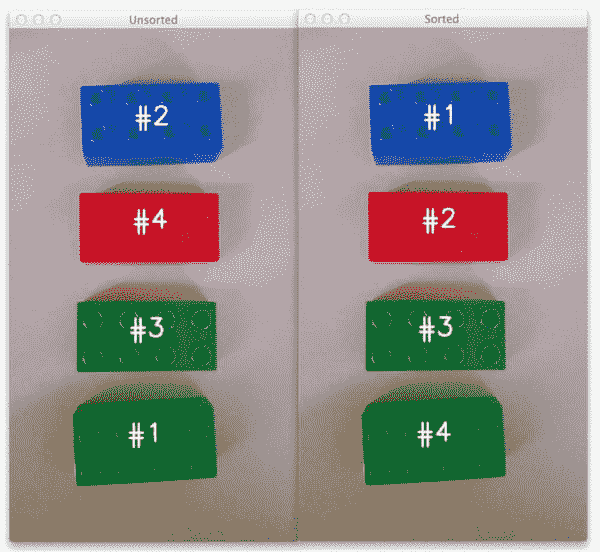
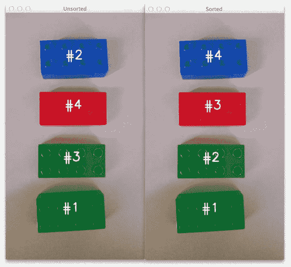
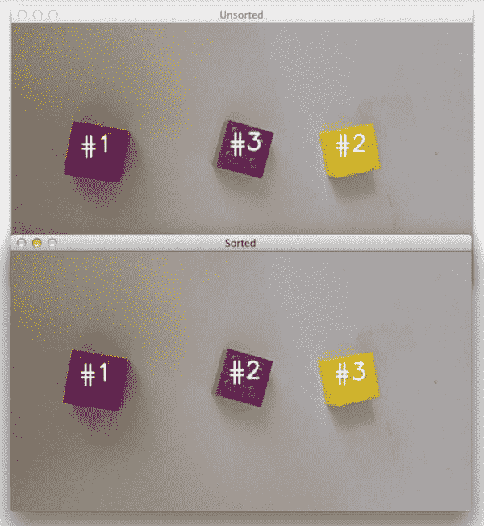
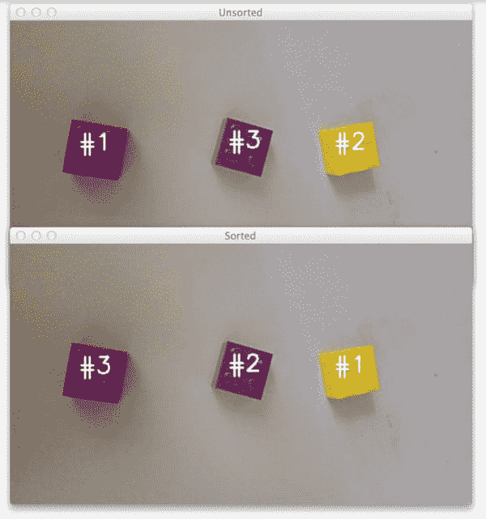

# 使用 Python 和 OpenCV 对等值线进行排序

> 原文：<https://pyimagesearch.com/2015/04/20/sorting-contours-using-python-and-opencv/>

[](https://pyimagesearch.com/wp-content/uploads/2015/04/sorted_contours_top_to_bottom.jpg)

好了，现在你已经在 PyImageSearch 博客上大量接触到轮廓了。

我们使用轮廓构建了一个强大的移动文档扫描仪。

轮廓使我们能够检测图像中的条形码。

我们甚至利用轮廓的力量来[找到相机到物体或标记的距离](https://pyimagesearch.com/2015/01/19/find-distance-camera-objectmarker-using-python-opencv/ "Find distance from camera to object/marker using Python and OpenCV")。

但是仍然有一个我们没有解决的棘手问题: ***我们究竟如何*从左到右、从上到下等排序*轮廓。***

奇怪的是，OpenCV *没有*提供一个内置函数或方法来执行轮廓的实际排序。

但是不用担心。

在这篇博客的其余部分，你将像专业人士一样使用 Python 和 OpenCV 对轮廓进行排序。

请继续阅读，了解更多信息…

**OpenCV 和 Python 版本:**
为了运行这个例子，你需要 **Python 2.7** 和 **OpenCV 2.4.X** 。

# 使用 Python 和 OpenCV 对等值线进行排序

在这篇博客文章结束时，你将能够:

1.  根据轮廓的*大小/面积*对轮廓进行分类，并使用一个模板根据任何其他任意标准对轮廓进行分类。

2.  仅使用一个 ***单一函数*** 从*从左到右*、*从右到左*、*从上到下*和*从下到上*对轮廓区域进行排序。

所以让我们开始吧。打开您最喜欢的代码编辑器，将其命名为`sorting_contours.py` ，让我们开始吧:

```py
# import the necessary packages
import numpy as np
import argparse
import imutils
import cv2

def sort_contours(cnts, method="left-to-right"):
	# initialize the reverse flag and sort index
	reverse = False
	i = 0

	# handle if we need to sort in reverse
	if method == "right-to-left" or method == "bottom-to-top":
		reverse = True

	# handle if we are sorting against the y-coordinate rather than
	# the x-coordinate of the bounding box
	if method == "top-to-bottom" or method == "bottom-to-top":
		i = 1

	# construct the list of bounding boxes and sort them from top to
	# bottom
	boundingBoxes = [cv2.boundingRect(c) for c in cnts]
	(cnts, boundingBoxes) = zip(*sorted(zip(cnts, boundingBoxes),
		key=lambda b:b[1][i], reverse=reverse))

	# return the list of sorted contours and bounding boxes
	return (cnts, boundingBoxes)

```

我们将从导入必要的包开始:NumPy 用于数值处理，`argparse`用于解析命令行参数，而`cv2`用于 OpenCV 绑定。

让我们暂时跳过这些步骤，直接开始定义我们的`sort_contours`函数，这将使我们能够对轮廓进行排序，而不是从解析参数、加载图像和处理其他正常过程开始。

实际的`sort_contours`函数在第 7 行的**上定义，有两个参数。第一个是`cnts`，我们要排序的轮廓列表，第二个是排序`method`，它表示我们要排序轮廓的*方向*(即从左到右、从上到下等)。).**

从这里开始，我们将初始化第 9 行**和第 10 行**上的两个重要变量。这些变量只是指示排序顺序(升序或降序)和我们将要用来执行排序的边界框的*索引*(稍后将详细介绍)。我们将初始化这些变量，按照*升序*排序，并沿着轮廓边界框的 *x* 轴位置排序。

如果我们从右到左或从下到上排序，我们需要按照轮廓在图像中的位置(**第 13 行和第 14 行**)按*降序排序。*

 *类似地，在第**行的第 18 和 19** 行，我们检查我们是从上到下还是从下到上进行排序。如果是这种情况，那么我们需要根据 *y* 轴的值而不是 *x* 轴的值进行排序(因为我们现在是垂直排序而不是水平排序)。

轮廓的实际分类发生在第 23-25 行的**行。**

我们首先计算每个轮廓的*边界框*，它只是边界框的起始 *(x，y)* 坐标，后跟宽度和高度(因此称为“边界框”)。(**第 23 行**)

`boundingBoxes`使我们能够对实际轮廓进行排序，我们在**第 24 行和第 25 行**使用一些 Python 魔法将两个列表排序在一起。使用这个代码，我们能够根据我们提供的标准对轮廓和边界框进行排序*。*

 *最后，我们将(现在已排序的)边界框和轮廓列表返回给第 28 行上的调用函数。

现在，让我们继续定义另一个助手函数，`draw_contour`:

```py
def draw_contour(image, c, i):
	# compute the center of the contour area and draw a circle
	# representing the center
	M = cv2.moments(c)
	cX = int(M["m10"] / M["m00"])
	cY = int(M["m01"] / M["m00"])

	# draw the countour number on the image
	cv2.putText(image, "#{}".format(i + 1), (cX - 20, cY), cv2.FONT_HERSHEY_SIMPLEX,
		1.0, (255, 255, 255), 2)

	# return the image with the contour number drawn on it
	return image

```

该功能简单地计算第 33-35 行**上所提供轮廓`c`的**中心** *(x，y)*-坐标，然后使用该中心坐标在第 38 和 39** 行**上绘制轮廓 ID`i`。**

最后，传入的`image`被返回给**行 42** 上的调用函数。

同样，这只是一个辅助函数，我们将利用它在实际图像上绘制轮廓 ID 号，这样我们就可以可视化我们的工作结果。

现在，助手函数已经完成，让我们把驱动程序代码放在适当的位置，以获取我们的实际图像，检测轮廓，并对它们进行排序:

```py
# construct the argument parser and parse the arguments
ap = argparse.ArgumentParser()
ap.add_argument("-i", "--image", required=True, help="Path to the input image")
ap.add_argument("-m", "--method", required=True, help="Sorting method")
args = vars(ap.parse_args())

# load the image and initialize the accumulated edge image
image = cv2.imread(args["image"])
accumEdged = np.zeros(image.shape[:2], dtype="uint8")

# loop over the blue, green, and red channels, respectively
for chan in cv2.split(image):
	# blur the channel, extract edges from it, and accumulate the set
	# of edges for the image
	chan = cv2.medianBlur(chan, 11)
	edged = cv2.Canny(chan, 50, 200)
	accumEdged = cv2.bitwise_or(accumEdged, edged)

# show the accumulated edge map
cv2.imshow("Edge Map", accumEdged)

```

**第 45-48 行**并不十分有趣——它们只是解析我们的命令行参数，`--image`是我们的图像在磁盘上驻留的路径，`--method`是我们想要排序轮廓的方向的文本表示。

从那里，我们在**行 51** 上加载我们的图像，并在**行 52** 上为边缘图分配内存。

构建实际的边缘图发生在**行 55-60** 上，其中我们循环图像的每个蓝色、绿色和红色通道(**行 55** )，稍微模糊每个通道以去除高频噪声(**行 58** )，执行边缘检测(**行 59** )，并在**行 60** 上更新累积的边缘图。

我们在**行 63** 上显示累积的边缘图，如下所示:

[](https://pyimagesearch.com/wp-content/uploads/2015/04/sorted_contours_edge_map.jpg)

**Figure 1:** *(Left)* Our original image. *(Right)* The edge map of the Lego bricks.

正如你所看到的，我们已经检测到图像中乐高积木的实际边缘轮廓。

现在，让我们看看能否(1)找到这些乐高积木的轮廓，然后(2)对它们进行分类:

```py
# find contours in the accumulated image, keeping only the largest
# ones
cnts = cv2.findContours(accumEdged.copy(), cv2.RETR_EXTERNAL,
	cv2.CHAIN_APPROX_SIMPLE)
cnts = imutils.grab_contours(cnts)
cnts = sorted(cnts, key=cv2.contourArea, reverse=True)[:5]
orig = image.copy()

# loop over the (unsorted) contours and draw them
for (i, c) in enumerate(cnts):
	orig = draw_contour(orig, c, i)

# show the original, unsorted contour image
cv2.imshow("Unsorted", orig)

# sort the contours according to the provided method
(cnts, boundingBoxes) = sort_contours(cnts, method=args["method"])

# loop over the (now sorted) contours and draw them
for (i, c) in enumerate(cnts):
	draw_contour(image, c, i)

# show the output image
cv2.imshow("Sorted", image)
cv2.waitKey(0)

```

很明显，这里的第一步是在第 67-69 行的**累积边缘图图像中找到实际轮廓。我们正在寻找乐高积木的*外部*轮廓，它仅仅对应于它们的*轮廓*。**

基于这些轮廓，我们现在将通过使用 Python `sorted`函数和`cv2.contourArea`方法的组合，根据它们的大小 对它们进行 ***排序——这允许我们根据它们的面积(即大小)从最大到最小对我们的轮廓进行排序(**行 70** )。***

我们获取这些排序后的轮廓(根据大小，*而不是*位置)，在**线 74** 上循环，并使用我们的`draw_contour`辅助函数在**线 76** 上绘制每个单独的轮廓。

该图像随后通过**线 78** 显示在我们的屏幕上。

然而，正如你会注意到的，我们的轮廓仅仅是根据它们的*大小*来分类的——没有注意到它们在图像中的实际*位置*。

我们在第 81 行解决了这个问题，在那里我们调用了我们的自定义函数。该方法接受我们的轮廓列表和排序方向方法(通过命令行参数提供),并对它们进行排序，分别返回一组排序的边界框和轮廓。

最后，我们获取这些排序后的轮廓，循环遍历它们，画出每一个单独的轮廓，最后将输出图像显示到我们的屏幕上(**行 84-89** )。

# 结果

让我们来检验一下我们的努力。

打开一个终端，导航到您的源代码并执行以下命令:

```py
$ python sorting_contours.py --image images/image_01.png --method "top-to-bottom"

```

您的输出应该如下所示:

[](https://pyimagesearch.com/wp-content/uploads/2015/04/sorted_contours_top_to_bottom.jpg)

**Figure 2:** Sorting our Lego bricks from top-to-bottom.

在左边的*上，我们有原始的未分类轮廓。很明显，我们可以看到轮廓非常混乱——第一个轮廓出现在最底部，第二个轮廓出现在最顶部！*

然而，通过应用我们的`sorted_contours`函数，我们能够从上到下对乐高积木进行排序。

让我们看另一个例子。

```py
$ python sorting_contours.py --image images/image_01.png --method "bottom-to-top"

```

[](https://pyimagesearch.com/wp-content/uploads/2015/04/sorting_contours_bottom_to_top.jpg)

**Figure 3:** Sorting our contours from bottom-to-top.

这里我们从下到上对轮廓进行了排序。

当然，我们也可以对轮廓进行水平排序:

```py
$ python sorting_contours.py --image images/image_02.png --method "left-to-right"

```

[](https://pyimagesearch.com/wp-content/uploads/2015/04/sorting_contours_left_to_right.jpg)

**Figure 4:** Sorting our contours from left-to-right.

同样，在*顶部*的图像中，我们的轮廓是无序的。但是在*底部的*图像中，我们能够成功地对轮廓进行分类，没有任何问题。

最后一个例子:

```py
$ python sorting_contours.py --image images/image_02.png --method "right-to-left"

```

[](https://pyimagesearch.com/wp-content/uploads/2015/04/sorting_contours_right_to_left.jpg)

**Figure 5:** Sorting our contours from right-to-left.

正如你所看到的，这没什么——我们只是利用图像中每个对象的边界框，使用 Python 和 OpenCV 按方向对轮廓进行排序。

将来，你只需要我们可靠的`sorted_contours`功能，你就可以毫无问题地根据方向对轮廓进行分类。

# 摘要

在这篇博客文章中，我们学习了如何从左到右、从右到左、从上到下和从下到上对轮廓进行排序。

实际上，我们只需要利用两个关键功能。

第一个关键函数是计算轮廓边界框区域的`cv2.boundingRect`方法。基于这些边界框，我们利用了一些 Python 魔法，并使用我们的第二个关键函数`sorted`，实际上按照我们想要的方向“排序”这些边界框。

这就是全部了！

如果你想玩这个帖子中的例子，只要在下面的表格中输入你的电子邮件地址，我会马上把代码通过电子邮件发给你。**