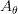

# 使用张量流的空间变压器网络

> 原文：<https://pyimagesearch.com/2022/05/23/spatial-transformer-networks-using-tensorflow/>

* * *

## **目录**

* * *

卷积神经网络(CNN)无疑改变了技术世界的运作方式。在图像处理领域站稳脚跟后，它所影响的子域数量多得无法计数。

就好像我们仅仅通过矩阵乘法和一些微积分就解决了向计算机教授图像的问题。然而，它并不像看起来那么完美。

让我们看看我这样说是什么意思。在图 1 中，我们有一个标准的 CNN 数字预测器。

有了足够的数据，它将完全按照预期的方式工作，展示 CNN 的力量。但是，当你旋转图形并馈入模型时会发生什么(**图 2** )？

尽管 CNN 具有独创性，但它并不是变换不变的。这意味着，如果我旋转图像，CNN 很可能会预测出错误的答案，让我们得出结论，CNN 是**而不是** *变换不变的*。

现在你可能认为这不是一个大问题。然而，这就是现实世界的不确定性因素的来源。

让我们以车牌检测器为例。即使它估计了车牌的大致区域，如果检测到的区域不是水平的，它也可能错误标记数字。想象一下这在繁忙的收费广场通勤中会造成多大的不便。

这背后的直觉很有意思。无论你如何扭曲输入图像，我们的眼睛都能发现数字 7。一个很大的原因是，当我们在大脑中处理图像时，我们只关心数字，而不是背景。

对于机器学习模型，会考虑完整的像素方向，而不仅仅是数字。毕竟机器学习模型是矩阵。因此，这些权重矩阵的值是根据输入数据的完整像素方向形成的。

因此，对于一个如此出色的概念来说，这难道不是一个大败笔吗？

令人欣慰的是，深度学习世界的快速研究人员已经提出了一个解决方案，即空间转换器网络。

**要了解如何**实现空间转换网络**，*就继续阅读吧。***

* * *

## [**使用张量流的空间变压器网络**](#TOC)

空间转换器网络模块背后的主要意图是帮助我们的模型**选择图像**的最相关 ROI。一旦模型成功计算出相关像素，空间变换模块将帮助模型决定图像成为标准格式所需的变换类型。

请记住，模型必须找出一种转换，使其能够预测图像的正确标签。对我们来说，这可能不是一个可以理解的变换，但是只要损失函数可以被降低，它对模型是有效的。

创建整个模块，以便模型可以根据情况访问各种变换:平移、裁剪、各向同性和倾斜。在下一节中，您将了解到更多相关信息。

将空间转换器模块视为模型的附加附件。在正向传递过程中，它会根据输入要求对要素地图应用特定的空间变换。对于特定的输入，我们有一个输出特征图。

它将帮助我们的模型决定像图 2 中的 7 这样的输入需要什么样的转换。对于多通道输入(例如，RGB 图像)，相同的更改将应用于所有三个通道(以保持空间一致性)。最重要的是，这个模块将学习模型权重的其余部分(它是可区分的)。

**图 3** 显示了空间转换器模块的三个部分:定位网络、网格生成器和采样器。

**定位网络:**该网络接收宽度 W、高度 H、通道 c 的输入特征图 **U** ，其工作是输出

, the transformation parameters to be applied to the feature map.

本地化网络可以是任何网络:全连接网络或卷积网络。唯一重要的是它必须包含一个最终回归层，它输出

.

**参数化采样网格:**我们有参数变换

. Let’s assume our input feature map to be U, as shown in **Figure 4**. We can see that U is a rotated version of the number 9\. Our output feature map V is a square grid. Hence we already know its indices (i.e., a normal rectangular grid).

虽然变换可以是任何东西，但让我们假设我们的输入特征需要仿射变换。

变换网格给我们:=A_{\theta} \times V")

. Let’s understand what this means. The matrix U is our input feature map. For each of its source coordinates, we are defining it as the transformation matrix multiplied by each of the target coordinates from the output feature map V.

所以，综上所述，矩阵

maps the output pixel coordinates back to the source pixel coordinates.

但说到底，这些只是坐标。我们如何知道这些像素的值呢？为此，我们将转移到采样器。

**采样器:**现在我们有了坐标，输出的特征图 V 值将使用我们的输入像素值来估计。也就是说，我们将使用输入像素对输出像素执行线性/双线性插值。双线性插值使用最近的像素值，这些像素值位于给定位置的对角线方向，以便找到该像素的适当颜色强度值。

在我们浏览代码时，我们将分别处理这些模块。

* * *

### [**配置您的开发环境**](#TOC)

要遵循这个指南，您需要在您的系统上安装 OpenCV 库。

幸运的是，OpenCV 可以通过 pip 安装:

```py
$ pip install tensorflow
$ pip install matplotlib
```

**如果您需要帮助配置 OpenCV 的开发环境，我们*强烈推荐*阅读我们的** [***pip 安装 OpenCV* 指南**](https://pyimagesearch.com/2018/09/19/pip-install-opencv/)——它将在几分钟内让您启动并运行。

* * *

### [**在配置开发环境时遇到了问题？**](#TOC)

说了这么多，你是:

*   时间紧迫？
*   了解你雇主的行政锁定系统？
*   想要跳过与命令行、包管理器和虚拟环境斗争的麻烦吗？
*   **准备好在您的 Windows、macOS 或 Linux 系统上运行代码*****？***

 *那今天就加入 [PyImageSearch 大学](https://pyimagesearch.com/pyimagesearch-university/)吧！

**获得本教程的 Jupyter 笔记本和其他 PyImageSearch 指南，这些指南是** ***预先配置的*** **，可以在您的网络浏览器中运行在 Google Colab 的生态系统上！**无需安装。

最棒的是，这些 Jupyter 笔记本可以在 Windows、macOS 和 Linux 上运行！

* * *

### [**项目结构**](#TOC)

我们首先需要回顾我们的项目目录结构。

首先访问本教程的 ***“下载”*** 部分，检索源代码和示例图像。

从这里，看一下目录结构:

```py
!tree .
.
├── create_gif.py
├── pyimagesearch
│   ├── callback.py
│   ├── classification_model.py
│   ├── config.py
│   └── stn.py
├── stn.gif
└── train.py

1 directory, 7 files
```

`create_gif.py`脚本将帮助我们从输出图像中创建一个 gif。

在`pyimagesearch`目录中，我们有 4 个脚本:

*   `callback.py`:包含模型训练时使用的回调。
*   `classification_model.py`:包含用于训练的基础模型。
*   `config.py`:包含项目的端到端配置管道。
*   `stn.py`:包含空间变换块的定义。

在核心目录中，我们有`train.py`，在那里进行模型训练，还有`stn.gif`，它是我们的输出 gif。

* * *

### [**准备配置脚本**](#TOC)

在开始实现之前，让我们跳到`pyimagesearch`目录中的`config.py`脚本。这个脚本将定义在整个项目中使用的全局变量和路径。

```py
# import the necessary packages
from tensorflow.data import AUTOTUNE
import os

# define AUTOTUNE
AUTO = AUTOTUNE

# define the image height, width and channel size
IMAGE_HEIGHT = 28
IMAGE_WIDTH = 28
CHANNEL = 1

# define the dataset path, dataset name, and the batch size
DATASET_PATH = "dataset"
DATASET_NAME = "emnist"
BATCH_SIZE = 1024
```

在**第 6 行**上，我们定义了`tensorflow.data`的`AUTOTUNE`特征。这样，`tfds`的运行时值(相关的参数在 CPU 中的分配)将被动态优化，以使用户受益。

接下来，我们定义输入图像的高度、宽度和通道值(**第 9-11 行**)。因为我们将使用黑白图像，我们的通道值是 1。

在**第 14 行，**我们已经定义了一个数据集路径，然后指定我们希望在我们的项目中使用哪个数据集(**第 15 行**)。最后，我们为我们的数据将被分割成的批次的大小定义一个值(**第 16 行**)。

```py
# define the number of epochs
EPOCHS = 100

# define the conv filters
FILTERS = 256

# define an output directory
OUTPUT_PATH = "output"

# define the loss function and optimizer
LOSS_FN = "sparse_categorical_crossentropy"
OPTIMIZER = "adam"

# define the name of the gif
GIF_NAME = "stn.gif"

# define the number of classes for classification
CLASSES = 62

# define the stn layer name
STN_LAYER_NAME = "stn"
```

接下来，我们定义一些超参数，如历元数(**第 19 行**)和卷积滤波器数(**第 22 行**)，后面是对输出文件夹路径的引用(**第 25 行**)。

对于今天的项目，我们将使用`sparse_categorical_crossentropy`作为我们的损失函数，使用`adam`作为我们的优化器(**第 28 和 29 行**)。

为了可视化我们的输出，我们将使用 GIF。我们在第 32 行的**中定义了一个对 GIF 的引用。`emnist`数据集有 62 个类，如**第 35 行**所定义。这是一个使用与`mnist`数据集相同的格式创建的数据集，但它具有更复杂的数据条目，用于更强大的训练。**

*关于这个数据集的更多信息，请访问官方* [*arXiv 链接*](https://arxiv.org/abs/1702.05373) *。*

最后，我们在第 38 行的**上有我们的空间转换器网络变量名。**

* * *

### [**实现输出 GIF 的回调函数**](#TOC)

这个函数将帮助我们建立我们的 GIF。它还允许我们在模型训练时跟踪模型的进度。这个函数可以在`pyimagesearch`中的`callback.py`脚本中找到。

```py
# import the necessary packages
from tensorflow.keras.callbacks import Callback
from tensorflow.keras import Model
import matplotlib.pyplot as plt

def get_train_monitor(testDs, outputPath, stnLayerName):
	# iterate over the test dataset and take a batch of test images
	(testImg, _) = next(iter(testDs))
```

我们在第 6 行的**上定义函数。它接受以下参数:**

*   `testDs`:测试数据集
*   `outputPath`:存储图像的文件夹
*   `stnLayerName`:分层输出的层名

在**的第 8 行**，我们使用`next(iter(dataset))`来迭代我们的完整数据集。这是因为我们的数据集具有类似生成器的属性。当前批次图像存储在`testImg`变量中。

```py
	# define a training monitor
	class TrainMonitor(Callback):
		def on_epoch_end(self, epoch, logs=None):
			model = Model(self.model.input,
				self.model.get_layer(stnLayerName).output)
			testPred = model(testImg)

			# plot the image and the transformed image
			_, axes = plt.subplots(nrows=5, ncols=2, figsize=(5, 10))
			for ax, im, t_im  in zip(axes, testImg[:5], testPred[:5]):
				ax[0].imshow(im[..., 0], cmap="gray")
				ax[0].set_title(epoch)
				ax[0].axis("off")

				ax[1].imshow(t_im[..., 0], cmap="gray")
				ax[1].set_title(epoch)
				ax[1].axis("off")

			# save the figures
			plt.savefig(f"{outputPath}/{epoch:03d}")
			plt.close()

	# instantiate the training monitor callback
	trainMonitor = TrainMonitor()

	# return the training monitor object
	return trainMonitor
```

在**第 11 行**，我们定义了一个训练监视器类，继承自 TensorFlow 的回调模块。在它里面，我们有另一个叫做`on_epoch_end`的函数，它将在每一个纪元后被激活(**第 12 行**)。它将当前的纪元编号和日志作为其参数。

在第**行第 13** **和第 14** 行，我们在函数内部定义了一个迷你模型。这个迷你模型将所有层从我们的主模型到空间变换层，因为我们需要这一层的输出。在**15 号线**，我们将当前测试批次通过迷你模型并获取其输出。

在**第 18-26 行**上，我们定义了一个完整的子图系统，其中前 5 个测试图像及其相应的预测并排绘制。然后我们将这个数字保存到我们的输出路径中(**第 29 行**)。

在我们关闭函数之前，我们实例化了一个`trainMonitor`类的对象(**第 33 行**)。

* * *

### [**空间转换器模块**](#TOC)

为了将空间转换器模块附加到我们的主模型，我们创建了一个单独的脚本，它将包含所有必要的辅助函数以及主`stn`层。因此，让我们转到`stn.py`脚本。

在我们进入代码之前，让我们简要回顾一下我们试图完成的任务。

*   我们的输入图像将为我们提供所需的转换参数。
*   我们将从输出要素地图映射输入要素地图。
*   我们将应用双线性插值来估计输出特征地图像素值。

如果你还记得这些指针，我们来分析一下代码。

```py
# import the necessary packages
from tensorflow.keras import Sequential
from tensorflow.keras.layers import Conv2D
from tensorflow.keras.layers import MaxPool2D
from tensorflow.keras.layers import GlobalAveragePooling2D
from tensorflow.keras.layers import Reshape
from tensorflow.keras.layers import Dense
from tensorflow.keras.layers import Layer
import tensorflow as tf

def get_pixel_value(B, H, W, featureMap, x, y):
	# create batch indices and reshape it
	batchIdx = tf.range(0, B)
	batchIdx = tf.reshape(batchIdx, (B, 1, 1))

	# create the indices matrix which will be used to sample the 
	# feature map
	b = tf.tile(batchIdx, (1, H, W))
	indices = tf.stack([b, y, x], 3)

	# gather the feature map values for the corresponding indices
	gatheredPixelValue = tf.gather_nd(featureMap, indices)

	# return the gather pixel values
	return gatheredPixelValue
```

这个脚本中第一个重要的函数是`get_pixel_value` ( **第 11 行**)。它包括:

*   批次大小、高度和宽度值
*   输入要素地图
*   给定像素的`x`和`y`坐标。

该函数将帮助您通过直接从特征图中访问角坐标来挽救像素值。

在**行的第 13** **和第 14** 行，我们正在创建占位符批次索引。接下来，我们创建一个索引矩阵，我们将使用它从特征图中进行采样(**第 18 行和第 19 行**)。在**第 22 行**上，我们使用`tf.gather_nd`获得相应坐标的特征映射值。

```py
def affine_grid_generator(B, H, W, theta):
	# create normalized 2D grid
	x = tf.linspace(-1.0, 1.0, H)
	y = tf.linspace(-1.0, 1.0, W)
	(xT, yT) = tf.meshgrid(x, y)

	# flatten the meshgrid
	xTFlat = tf.reshape(xT, [-1])
	yTFlat = tf.reshape(yT, [-1])

	# reshape the meshgrid and concatenate ones to convert it to 
	# homogeneous form
	ones = tf.ones_like(xTFlat)
	samplingGrid = tf.stack([xTFlat, yTFlat, ones])

	# repeat grid batch size times
	samplingGrid = tf.broadcast_to(samplingGrid, (B, 3, H * W))

	# cast the affine parameters and sampling grid to float32 
	# required for matmul
	theta = tf.cast(theta, "float32")
	samplingGrid = tf.cast(samplingGrid, "float32")

	# transform the sampling grid with the affine parameter
	batchGrids = tf.matmul(theta, samplingGrid)

	# reshape the sampling grid to (B, H, W, 2)
	batchGrids = tf.reshape(batchGrids, [B, 2, H, W])

	# return the transformed grid
	return batchGrids
```

显微镜下的下一个功能是第 27 行**上的`affine_grid_generator`。它接受以下参数:**

*   批量
*   高度
*   宽度
*   变换参数θ

让我们理解我们在这里试图做什么。在这篇博客的开始，我们已经告诉你网格生成器给了我们下面的公式:=A_{\theta} \times V")

, where U is our input feature map and V is our output feature map.

因此，我们将输出坐标映射回输入坐标的这一步是我们在这里尝试完成的。

为此，我们首先在第 29-31 行的**上创建一个标准化的 2D 网格。然后我们展平并创建一个均匀的网格(**第 34-40 行**)。注意，这些变量被命名为`xT, yT`，与我们在本教程第一部分中解释的目标坐标相呼应。**

由于我们需要与批量大小相等的网格，我们在**行 43** 重复网格大小。

我们的下一步是目标坐标和变换参数θ之间的矩阵乘法。为此，我们首先将它们转换为浮点型(**第 47 行和第 48 行**)，然后使用`tf.matmul`将它们相乘(**第 51 行**)。

最后，我们重塑`batchGrids`变量，让函数返回值(**第 54-57 行**)。注意，整形值是(`B, 2, H, W`)。值`2`是因为我们必须得到 X 坐标网格和 Y 坐标网格。

```py
def bilinear_sampler(B, H, W, featureMap, x, y):
	# define the bounds of the image
	maxY = tf.cast(H - 1, "int32")
	maxX = tf.cast(W - 1, "int32")
	zero = tf.zeros([], dtype="int32")

	# rescale x and y to feature spatial dimensions
	x = tf.cast(x, "float32")
	y = tf.cast(y, "float32")
	x = 0.5 * ((x + 1.0) * tf.cast(maxX-1, "float32"))
	y = 0.5 * ((y + 1.0) * tf.cast(maxY-1, "float32"))

	# grab 4 nearest corner points for each (x, y)
	x0 = tf.cast(tf.floor(x), "int32")
	x1 = x0 + 1
	y0 = tf.cast(tf.floor(y), "int32")
	y1 = y0 + 1

	# clip to range to not violate feature map boundaries
	x0 = tf.clip_by_value(x0, zero, maxX)
	x1 = tf.clip_by_value(x1, zero, maxX)
	y0 = tf.clip_by_value(y0, zero, maxY)
	y1 = tf.clip_by_value(y1, zero, maxY)
```

继续我们的`bilinear_sampler`函数将帮助我们获得完整的输出特征图。它接受以下参数:

*   批次大小、高度和宽度
*   输入要素地图
*   从前一个函数`affine_grid_generator`中获得的`x`和`y`坐标

在第 61-63 行上，我们根据高度和宽度索引定义了图像的边界。

在**的第 66-69 行**，我们正在重新调整`x`和`y`的比例，以匹配特征地图的空间维度(即，在从 0 到 400 的区间内)。

在**线 72-75** 上，我们为每个给定的`x`和`y`坐标抓取 4 个最近的角点。

接下来是剪切这些值，使它们不违反特征图边界(**行 78-81** )。

```py
	# get pixel value at corner coords
	Ia = get_pixel_value(B, H, W, featureMap, x0, y0)
	Ib = get_pixel_value(B, H, W, featureMap, x0, y1)
	Ic = get_pixel_value(B, H, W, featureMap, x1, y0)
	Id = get_pixel_value(B, H, W, featureMap, x1, y1)

	# recast as float for delta calculation
	x0 = tf.cast(x0, "float32")
	x1 = tf.cast(x1, "float32")
	y0 = tf.cast(y0, "float32")
	y1 = tf.cast(y1, "float32")

	# calculate deltas
	wa = (x1-x) * (y1-y)
	wb = (x1-x) * (y-y0)
	wc = (x-x0) * (y1-y)
	wd = (x-x0) * (y-y0)

	# add dimension for addition
	wa = tf.expand_dims(wa, axis=3)
	wb = tf.expand_dims(wb, axis=3)
	wc = tf.expand_dims(wc, axis=3)
	wd = tf.expand_dims(wd, axis=3)

	# compute transformed feature map
	transformedFeatureMap = tf.add_n(
		[wa * Ia, wb * Ib, wc * Ic, wd * Id])

	# return the transformed feature map
	return transformedFeatureMap
```

现在我们有了角坐标，我们使用之前创建的`get_pixel_value`函数获取像素值。这就结束了插值步骤(**第 84-87 行**)。

在第 90-93 行的**上，我们将坐标重新转换为`float`用于增量计算。最后，在**第 96-99 行**计算增量。**

让我们明白这是怎么回事。首先，我们的图像将根据我们的变换矩阵在某些区域进行插值。像素值将是这些区域中它们的角点的平均值。但是为了得到我们的实际输出，我们需要将我们修改过的特征图除以实际的特征图来得到想要的结果。

在**行 102-109** 上，我们使用增量来计算我们的转换后的最终特征图。

```py
class STN(Layer):
	def __init__(self, name, filter):
		# initialize the layer
		super().__init__(name=name)
		self.B = None
		self.H = None
		self.W = None
		self.C = None

		# create the constant bias initializer
		self.output_bias = tf.keras.initializers.Constant(
			[1.0, 0.0, 0.0,
			0.0, 1.0, 0.0]
		)

		# define the filter size
		self.filter = filter
```

现在是时候把我们的完整设置放在一起了。我们在**行 114** 上创建了一个名为`stn`的类，它继承了`keras.layer`类。

`__init__`函数用于初始化和分配我们将在`call`函数中使用的变量(**第 117-130 行**)。`output_bias`将在后面的密集函数中使用。

```py
	def build(self, input_shape):
		# get the batch size, height, width and channel size of the
		# input
		(self.B, self.H, self.W, self.C) = input_shape

		# define the localization network
		self.localizationNet = Sequential([
			Conv2D(filters=self.filter // 4, kernel_size=3,
				input_shape=(self.H, self.W, self.C), 
				activation="relu", kernel_initializer="he_normal"),
			MaxPool2D(),
			Conv2D(filters=self.filter // 2, kernel_size=3,
				activation="relu", kernel_initializer="he_normal"),
			MaxPool2D(),
			Conv2D(filters=self.filter, kernel_size=3,
				activation="relu", kernel_initializer="he_normal"),
			MaxPool2D(),
			GlobalAveragePooling2D()
		])

		# define the regressor network
		self.regressorNet = tf.keras.Sequential([
			Dense(units = self.filter, activation="relu",
				kernel_initializer="he_normal"),
			Dense(units = self.filter // 2, activation="relu",
				kernel_initializer="he_normal"),
			Dense(units = 3 * 2, kernel_initializer="zeros",
				bias_initializer=self.output_bias),
			Reshape(target_shape=(2, 3))
		])
```

如前所述，本地化网络会给我们转换参数`theta`作为输出。我们已经将本地化网络分成两个独立的部分。在**第 138-150 行**，我们有卷积定位网络，它会给我们特征图作为输出。

在**第 153-161 行**，我们有回归器网络，它将卷积输出作为其输入，并给我们变换参数`theta`。在这里，我们可以有把握地说`theta`成为一个可学习的参数。

```py
	def call(self, x):
		# get the localization feature map
		localFeatureMap = self.localizationNet(x)

		# get the regressed parameters
		theta = self.regressorNet(localFeatureMap)

		# get the transformed meshgrid
		grid = affine_grid_generator(self.B, self.H, self.W, theta)

		# get the x and y coordinates from the transformed meshgrid
		xS = grid[:, 0, :, :]
		yS = grid[:, 1, :, :]

		# get the transformed feature map
		x = bilinear_sampler(self.B, self.H, self.W, x, xS, yS)

		# return the transformed feature map
		return x
```

最后，我们来看一下`call`函数(**第 163 行**)。在这里，我们首先在**行 165** 上创建特征图，通过`regressorNet`传递它并获得我们的变换参数(**行 168** )。

现在我们有了θ，我们可以使用第 171 行的**函数来创建网格。现在，我们可以将`x`和`y`源坐标从网格中分离出来，方法是将它们编入索引，并通过我们的双线性采样器(**第 174-178 行**)。**

* * *

### [**分类模式**](#TOC)

我们完整的分类模型相对简单，因为我们已经创建了空间转换器模块。因此，让我们转到`classification_model.py`脚本并分析架构。

```py
# import the necessary packages
from tensorflow.keras import Input
from tensorflow.keras import Model
from tensorflow.keras.layers import Conv2D
from tensorflow.keras.layers import MaxPool2D
from tensorflow.keras.layers import Reshape
from tensorflow.keras.layers import GlobalAveragePooling2D
from tensorflow.keras.layers import Lambda
from tensorflow.keras.layers import Dense
from tensorflow.keras.layers import Dropout
import tensorflow as tf

def get_training_model(batchSize, height, width, channel, stnLayer,
	numClasses, filter):
	# define the input layer and pass the input through the STN
	# layer
	inputs = Input((height, width, channel), batch_size=batchSize)
	x = Lambda(lambda image: tf.cast(image, "float32")/255.0)(inputs)
	x = stnLayer(x) 
```

我们的主训练模型是使用第 14 行**上的函数`get_training_model`获得的。它接受以下参数:**

*   批次大小、高度、宽度和通道值
*   空间变换层
*   输出类的数量和过滤器的数量

在**第 18 行**上，我们初始化模型输入。接下来，我们将图像缩放到 0 和 1 ( **第 19 行**)。

接下来，我们在第 20 行添加空间变换层。创建一个模块的额外好处是我们的主架构脚本不那么杂乱。

```py
	# apply a series of conv and maxpool layers
	x = Conv2D(filter // 4, 3, activation="relu", 
		kernel_initializer="he_normal")(x)
	x = MaxPool2D()(x)
	x = Conv2D(filter // 2, 3, activation="relu",
		kernel_initializer="he_normal")(x)
	x = MaxPool2D()(x)
	x = Conv2D(filter, 3, activation="relu",
		kernel_initializer="he_normal")(x)
	x = MaxPool2D()(x)

	# global average pool the output of the previous layer
	x = GlobalAveragePooling2D()(x)

	# pass the flattened output through a couple of dense layers
	x = Dense(filter, activation="relu",
		kernel_initializer="he_normal")(x)
	x = Dense(filter // 2, activation="relu",
		kernel_initializer="he_normal")(x)

	# apply dropout for better regularization
	x = Dropout(0.5)(x)

	# apply softmax to the output for a multi-classification task
	outputs = Dense(numClasses, activation="softmax")(x)

	# return the model
	return Model(inputs, outputs)
```

其余的层非常简单。在**第 23-31 行**，我们有一个`Conv2D`层和一个最大池层的重复设置。

接下来是第 34 行的**全局平均池层。**

我们添加两个密集层，然后添加一个下降层，最后添加输出层，这样我们就可以得到一个关于类数量的 soft max(**37-46 行**)。

该函数然后返回一个初始化的模型(**行 49** )。

* * *

### [**训练模型**](#TOC)

完成所有的配置管道、助手函数和模型架构后，我们只需要插入数据并查看结果。为此，让我们继续讨论`train.py`。

```py
# USAGE
# python train.py

# setting seed for reproducibility
import tensorflow as tf
tf.random.set_seed(42)

# import the necessary packages
from pyimagesearch.stn import STN
from pyimagesearch.classification_model import get_training_model
from pyimagesearch.callback import get_train_monitor
from pyimagesearch import config
from tensorflow.keras.callbacks import EarlyStopping
import tensorflow_datasets as tfds
import os

# load the train and test dataset
print("[INFO] loading the train and test dataset...")
trainingDs = tfds.load(name=config.DATASET_NAME,
	data_dir=config.DATASET_PATH, split="train", shuffle_files=True,
	as_supervised=True)
testingDs = tfds.load(name=config.DATASET_NAME,
	data_dir=config.DATASET_PATH, split="test", as_supervised=True)
```

记住在导入部分调用我们的脚本很重要(**第 5-15 行**)。接下来，我们使用`tfds.load`直接下载我们需要的数据集(**第 19-23 行**)。我们这样做是为了同时获得训练和测试拆分。

```py
 # preprocess the train and test dataset
print("[INFO] preprocessing the train and test dataset...")
trainDs = (
	trainingDs
	.shuffle(config.BATCH_SIZE*100)
	.batch(config.BATCH_SIZE, drop_remainder=True)
	.prefetch(config.AUTO)
)
testDs = (
	testingDs
	.batch(config.BATCH_SIZE, drop_remainder=True)
	.prefetch(config.AUTO)
)

# initialize the stn layer
print("[INFO] initializing the stn layer...")
stnLayer = STN(name=config.STN_LAYER_NAME, filter=config.FILTERS)

# get the classification model for cifar10
print("[INFO] grabbing the multiclass classification model...")
model = get_training_model(batchSize=config.BATCH_SIZE,
	height=config.IMAGE_HEIGHT, width=config.IMAGE_WIDTH,
	channel=config.CHANNEL, stnLayer=stnLayer,
	numClasses=config.CLASSES, filter=config.FILTERS)
```

一旦我们有了训练和测试数据集，我们就在第 27-37 行对它们进行预处理。

在第**行第 41** 处，我们使用预先创建的脚本和配置变量初始化一个空间转换器模块层。

然后我们通过传递`stn`层和所需的配置变量来初始化我们的主模型(**第 45-48 行**)。

```py
# print the model summary
print("[INFO] the model summary...")
print(model.summary())

# create an output images directory if it not already exists
if not os.path.exists(config.OUTPUT_PATH):
	os.makedirs(config.OUTPUT_PATH)

# get the training monitor
trainMonitor = get_train_monitor(testDs=testDs,
	outputPath=config.OUTPUT_PATH, stnLayerName=config.STN_LAYER_NAME)

# compile the model
print("[INFO] compiling the model...")
model.compile(loss=config.LOSS_FN, optimizer=config.OPTIMIZER, 
	metrics=["accuracy"])

# define an early stopping callback
esCallback = EarlyStopping(patience=5, restore_best_weights=True)

# train the model
print("[INFO] training the model...")
model.fit(trainDs, epochs=config.EPOCHS, 
	callbacks=[trainMonitor, esCallback], validation_data=testDs)
```

为了进行健全性检查，我们在第 52 行的**处显示了模型概要。**

接下来，我们在第 55 和 56 行的**上使用`os.makedirs`创建一个输出目录。**

由于我们的模型已经创建，我们在第 59 和 60 行的**上初始化回调脚本的对象`trainMonitor`。总的来说，这将使我们可视化我们的训练如何影响我们的测试数据集的输出。**

然后，我们用我们的配置变量编译模型，并选择准确性作为我们的度量标准(**第 64 行和第 65** )。

为了提高效率，我们在第 68 行的**上定义了一个提前停止的回调函数。如果已经达到中等精度值，这将停止模型训练。**

在**第 72 行和第 73 行**，我们通过将数据集和回调函数放入我们的模型并开始训练步骤来结束脚本。

* * *

### [**模型训练和可视化**](#TOC)

让我们看看我们的模特训练进展如何！

```py
[INFO] compiling the model...
[INFO] training the model...
Epoch 1/100
681/681 [==============================] - 104s 121ms/step - loss: 0.9146 - accuracy: 0.7350 - val_loss: 0.4381 - val_accuracy: 0.8421
Epoch 2/100
681/681 [==============================] - 84s 118ms/step - loss: 0.4705 - accuracy: 0.8392 - val_loss: 0.4064 - val_accuracy: 0.8526
Epoch 3/100
681/681 [==============================] - 85s 119ms/step - loss: 0.4258 - ... 
Epoch 16/100
681/681 [==============================] - 85s 119ms/step - loss: 0.3192 - accuracy: 0.8794 - val_loss: 0.3483 - val_accuracy: 0.8725
Epoch 17/100
681/681 [==============================] - 85s 119ms/step - loss: 0.3151 - accuracy: 0.8803 - val_loss: 0.3487 - val_accuracy: 0.8736
Epoch 18/100
681/681 [==============================] - 85s 118ms/step - loss: 0.3113 - accuracy: 0.8814 - val_loss: 0.3503 - val_accuracy: 0.8719
```

我们可以看到，到了第 18 纪元，早期停止生效并停止了模型训练。最终的训练和验证准确率分别为 88.14%和 87.19%。

让我们来看看**图 6** 中的一些可视化效果。

在**图 6** 中，我们可以看到一批数字在每个历元中被转换。您可能会注意到，这些转换对于人眼来说不是很容易理解。

然而，你必须记住，这种转换不会总是基于我们对数字的看法而发生。这取决于哪种转换使损失更低。所以这可能不是我们理解的东西，但是如果它对损失函数有效，它对模型来说就足够好了！

* * *

* * *

## [**汇总**](#TOC)

转换不变性是当今深度学习世界中高度相关的因素。视觉任务以某种形式使用深度学习。当现实生活中的因素受到威胁时，创建健壮的、构建好的系统来处理尽可能多的场景是很重要的。

我们的结果表明，该系统协调工作；反向传播为我们提供了正确的变换参数，同时初始网格开始在每个时期固定自己。

如果你想想，我们从图像中识别一个数字，而整个画面对于深度学习系统来说很重要。因此，如果它能够识别出要处理的确切像素，那肯定会更有效率。

具有变换不变性的卷积网络确实有助于建立稳健的人工智能(AI)系统。额外的好处是，我们朝着让人工智能系统更接近人脑的方向迈进了一步。

CNN 的可连接模块最近越来越受欢迎。你可以在下周的博客上关注特色地图频道，它使用了另一个可连接的模块来改善你的模型。

* * *

### [**信用点**](#TOC)

本教程的灵感来自于塞亚克保罗和 T2 凯文扎克卡的作品。

* * *

### [**引用信息**](#TOC)

**Chakraborty，D.** “使用 TensorFlow 的空间变压器网络”， *PyImageSearch* ，P. Chugh，A. R. Gosthipaty，S. Huot，K. Kidriavsteva，R. Raha 和 A. Thanki 编辑。，2022 年，【https://pyimg.co/4ham6 

```py
@incollection{Chakraborty_2022_Spatial_Transformer,
  author = {Devjyoti Chakraborty},
  title = {Spatial Transformer Networks Using {TensorFlow}},
  booktitle = {PyImageSearch},
  editor = {Puneet Chugh and Aritra Roy Gosthipaty and Susan Huot and Kseniia Kidriavsteva and Ritwik Raha and Abhishek Thanki},
  year = {2022},
  note = {https://pyimg.co/4ham6},
}
```

* * *

**要下载这篇文章的源代码(并在未来教程在 PyImageSearch 上发布时得到通知)，*只需在下面的表格中输入您的电子邮件地址！****