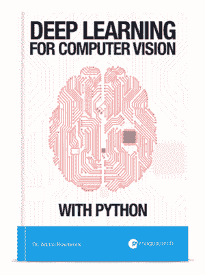

# 目录:使用 Python 进行计算机视觉的深度学习

> 原文：<https://pyimagesearch.com/2017/01/13/table-of-contents-deep-learning-for-computer-vision-with-python/>

[几天前](https://pyimagesearch.com/2017/01/11/my-deep-learning-kickstarter-will-go-live-on-wednesday-january-18th-at-10am-est/)我提到在**1 月 18 日星期三上午 10 点**我将启动 Kickstarter 来资助我的新书——*用 Python 进行计算机视觉的深度学习*。

正如你将在这篇文章的后面看到的，我将会涵盖大量的内容，所以我决定将这本书分成三册***【捆绑】**。*

 *一个 ***包*** 包括给定卷的电子书、视频教程和源代码。

每个包*建立在其他包*和*的基础上，包括来自较低包*的所有内容。你应该根据你对深度学习和计算机视觉的研究深度来选择捆绑包:

*   **Starter Bundle:** 非常适合那些向深度学习迈出第一步以掌握图像分类的人。
*   **从业者捆绑包:**非常适合准备深入学习深度学习、了解先进技术、发现常见最佳实践和经验法则的读者。
*   **ImageNet Bundle:***完成计算机视觉体验的深度学习*。在这个包中，我演示了如何在*大规模* ImageNet 数据集上从头开始训练大规模神经网络。你不能打败这个包。

下一节列出了每个包的*完整的*目录。

## 起始捆绑包

*入门包*包括以下主题:

#### 机器学习基础

**迈出第一步:**

*   了解如何设置和配置您的开发环境来研究深度学习。
*   了解图像基础知识，包括坐标系；宽度、高度、深度；和长宽比。
*   回顾用于测试机器学习、深度学习和卷积神经网络算法的流行图像数据集。

#### **形成对机器学习基础知识的扎实理解，包括:**

*   简单的 k-NN 分类器。
*   参数化学习(即“从数据中学习”)
*   数据和特征向量。
*   了解评分功能。
*   损失函数的工作原理。
*   定义权重矩阵和偏差向量(以及它们如何促进学习)。

#### **通过**学习基本的优化方法(即“学习”实际上是如何进行的)

*   梯度下降
*   随机梯度下降
*   分批随机梯度下降

#### 神经网络基础

**发现前馈网络架构:**

*   手工实现经典感知器算法。
*   使用感知器算法学习实际的*函数*(并理解感知器算法的局限性)。
*   取一个 ***深入潜*** 进入 ***反向传播算法*** 。
*   用 Python + NumPy 手工实现反向传播。
*   利用工作表来帮助你练习反向传播算法。
*   掌握多层网络(并从头开始训练)。
*   用手工和 *Keras 库*实现神经网络*。*

#### 卷积神经网络简介

**从卷积的基础开始:**

*   理解卷积(以及为什么它们比看起来容易理解)。
*   研究卷积神经网络(它们是用来做什么的，为什么它们对图像分类如此有效等等。).
*   从头开始训练你的第一个卷积神经网络。

**回顾卷积神经网络的构建模块，包括:**

*   卷积层
*   激活层
*   池层
*   批量标准化
*   拒绝传统社会的人

**揭示通用架构和培训模式:**

*   发现通用的网络体系结构模式，您可以使用这些模式来设计自己的体系结构，从而最大限度地减少挫折和麻烦。
*   利用现成的 CNN 进行分类，这些 CNN 已经过*预训练*并准备好应用于您自己的图像/图像数据集(VGG16、VGG19、ResNet50 等)。)
*   从磁盘保存和加载您自己的网络模型。
*   检查您的模型，发现高性能的时代，并重新开始训练。
*   了解如何发现欠拟合和过拟合，从而允许您纠正它们并提高分类精度。
*   利用衰减和学习率调度程序。
*   从零开始训练经典的 LeNet 架构来识别手写数字。

#### 使用您自己的自定义数据集

**使用自定义数据集+深度学习很简单:**

*   了解如何收集您自己的培训图像。
*   了解如何注释和标注数据集。
*   在数据集的基础上从头开始训练一个卷积神经网络。
*   评估你的模型的准确性。
*   所有这些都通过演示如何收集、注释和训练 CNN 破解图像验证码来解释。

## 从业者捆绑包

*从业者捆绑*包括*起步者捆绑*中的 ***一切*** 。它还包括以下主题。

#### 高级卷积神经网络

**了解如何使用*将学习*转移到:**

*   将预先训练的网络视为特征提取器，以不费吹灰之力获得高分类精度。
*   利用微调来提高预训练网络的准确性。
*   应用数据扩充来提高网络分类的准确性，而无需收集更多的训练数据。

**使用更深层次的网络架构:**

*   编写开创性的 AlexNet 架构。
*   实现 VGGNet 架构(以及的变体)。

**探索更高级的优化算法，包括:**

*   RMSprop
*   阿达格拉德
*   阿达德尔塔
*   圣经》和《古兰经》传统中）亚当（人类第一人的名字
*   阿达马斯
*   那达慕
*   *…以及微调 SGD 参数的最佳实践。*

#### 提升网络性能的最佳实践

**揭示通用技术&提高分类准确性的最佳实践:**

*   了解等级 1 和等级 5 的准确性(以及我们如何使用它们来衡量给定网络的分类能力)。
*   利用图像裁剪这种简单的方法来提高测试集的准确性。
*   探索如何简单地通过训练多个网络使用*网络集成*来提高分类精度。
*   发现我应用深度学习技术的最佳途径*最大化分类准确性*(以及以何种顺序应用这些技术来实现最大的有效性)。

#### 缩放至大型图像数据集

**处理太大而无法放入内存的数据集:**

*   了解如何将图像数据集从磁盘上的原始图像转换为 HDF5 格式，从而使网络训练更容易(更快)。
*   将大型图像数据集压缩到高效打包的记录文件中。

**参加深度学习挑战和比赛:**

*   参加斯坦福大学的 *cs231n 微型图像网络分类挑战赛……**并获得第一名*** 。
*   在 Kaggle Dogs vs. Cats challenge 上训练一个网络，不费吹灰之力就能在 25 强排行榜中占据一席之地。

#### 目标检测和定位

**通过以下方式使用深度学习检测图像中的对象:**

*   利用朴素图像金字塔和滑动窗口进行目标检测。

## imagenes 包

*ImageNet 捆绑包*包括*初学者捆绑包*和*实践者捆绑包*中的 ***一切*** 。它还包括以下附加主题:

#### ImageNet:大规模视觉识别挑战

**在 ImageNet 数据集上训练最先进的网络:**

*   了解什么是*海量*ImageNet(1000 个类别)数据集以及*为什么*它被认为是对基准图像分类算法的*事实上的*挑战。
*   获取 ImageNet 数据集。
*   将 ImageNet 转换成适合培训的格式。
*   学习如何利用*多个 GPU*在*并行*、**中训练你的网络，大大减少训练时间**。
*   从零开始在 ImageNet 上训练 AlexNet。
*   在 ImageNet 上从头开始训练 VGGNet。
*   将 SqueezeNet 架构应用于 ImageNet 以获得(高精度)模型，完全可部署到较小的设备，如 Raspberry Pi。

#### ImageNet:提示、技巧和经验法则

**解锁深度学习专家在 ImageNet 上使用的相同技术:**

*   通过**发现实际有效的** 学习进度*，节省数周(甚至数月)的培训时间。*
*   在 ImageNet 上发现过度拟合并在之前*发现它，你会浪费几个小时(或几天)看着你的验证准确性停滞不前。*
*   了解如何从保存的纪元重新开始训练，降低学习率，并提高准确性。
*   发现快速调整大规模网络超参数的方法。

#### 个案研究

**探索如何解决真实世界的深度学习问题，包括:**

*   使用深度学习技术训练一个网络来预测图像中人的性别和年龄。
*   使用卷积神经网络自动分类汽车类型。
*   使用 CNN 确定(并校正)图像方向。

这就是你要的——用 Python 进行计算机视觉深度学习的完整目录。我希望看完这份清单后，你会和我一样兴奋！

我也有一些*秘密奖金章节*，在 Kickstarter 正式发布之前我会保密——请继续关注更多细节。

当更多的 Kickstarter 通知发布时(包括我不会在这个博客上发布的通知)，请务必注册 Kickstarter 通知列表！*