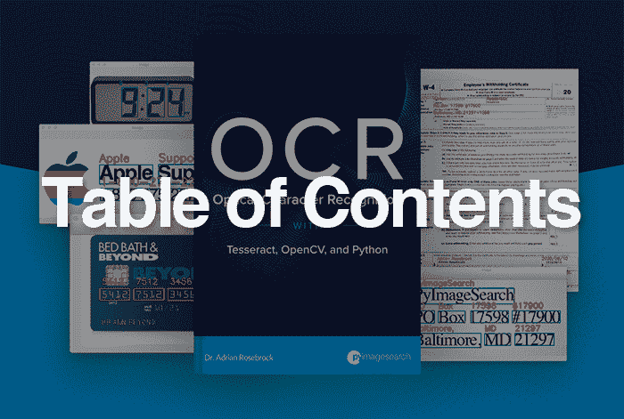
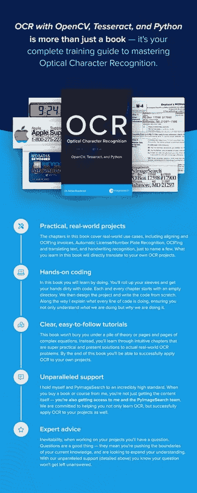
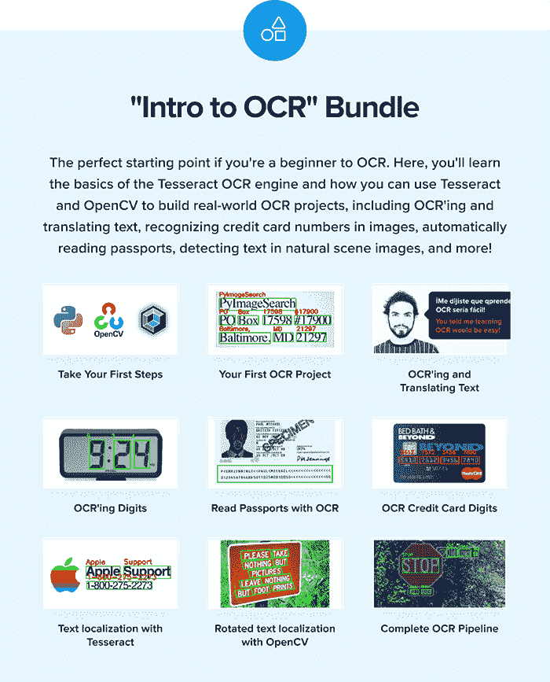
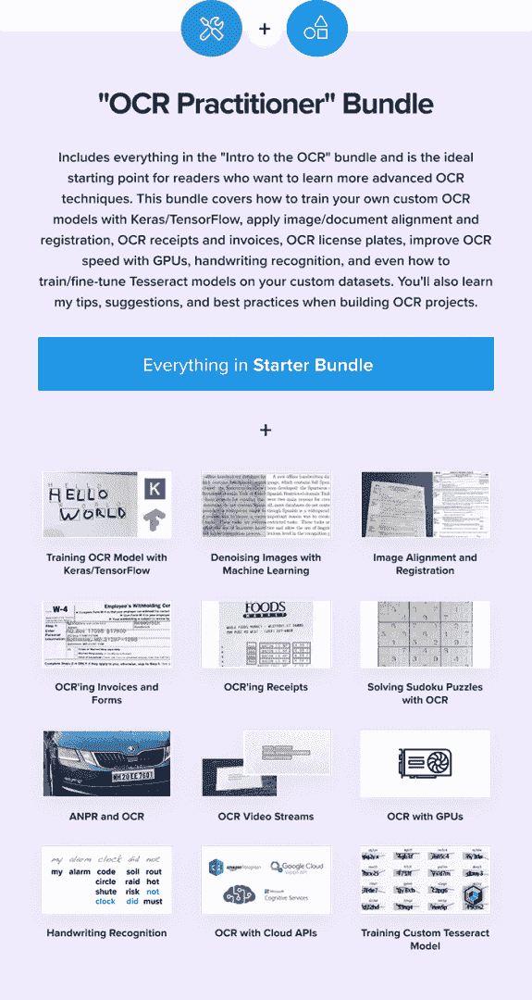
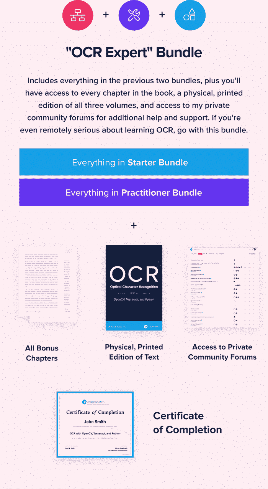

# 目录–OCR 与 OpenCV、Tesseract 和 Python

> 原文：<https://pyimagesearch.com/2020/08/14/table-of-contents-ocr-with-opencv-tesseract-and-python/>

[几天前](https://pyimagesearch.com/2020/08/12/my-ocr-with-opencv-tesseract-and-python-indiegogo-campaign-will-go-live-on-wednesday-august-19th-at-10am-edt/)我提到在**8 月 19 日星期三上午 10 点**我将为我的新书 *[OCR 与 OpenCV、Tesseract 和 Python](https://pyimagesearch.com/ocr-with-opencv-tesseract-and-python/) 发起 IndieGoGo 众筹活动。注意:活动现在已经结束了。但是你仍然可以通过点击这里来预订你的副本[。)](https://pyimagesearch.com/ocr-with-opencv-tesseract-and-python/)*

**今天我要和大家分享:**

*   这本书的目录
*   关于这本书结构的更多细节
*   书中包含的内容，包括源代码、预配置的 VM、访问私人社区论坛等。
*   完成所有与文本相关的测验/考试后，您将获得结业证书

让我们开始吧！

## 这是什么书？

*OCR 与 OpenCV、Tesseract 和 Python* 将教你**如何成功地将光学字符识别应用到你的工作、项目和研究中。**

您将通过实际的动手项目(包含大量代码)来学习，这样您不仅可以开发自己的 OCR 项目，而且在开发过程中会感到*自信*。

在本书中，我们将重点关注:

*   OCR 入门
*   了解 Tesseract OCR 引擎的基础知识
*   探索如何使用镶嵌选项和配置提高 OCR 准确性
*   通过 Python 编程语言与 Tesseract 接口
*   使用 OpenCV 和 Tesseract 定位和检测图像中的文本
*   利用 OpenCV 和图像处理技术提高 OCR 准确率
*   使用机器学习对我们的图像去噪以获得更好的 OCR 准确度
*   建立发票扫描项目的图像/文件登记和校准
*   用 Keras 和 TensorFlow 训练我们自己的定制深度学习模型
*   用 OCR、OpenCV 和 Keras/TensorFlow 解决数独难题
*   自动牌照/车牌识别(ANPR)
*   手写识别
*   在实时视频流中执行 OCR
*   利用 GPU 加快 OCR 推理
*   在云中使用 OCR 引擎，包括 Amazon Rekognition、微软认知服务和 Google Vison API
*   执行 OCR 时的提示、建议和最佳实践

目前我已经计划了 **35 章以上的章节，**还会有更多！

## 这本书的结构是怎样的？

因为我们将深入讨论这么多 OCR 技术，所以我决定将这本书分成三册**称为**“捆绑”。****

我在下面列出了三个包的简短分类:

***“OCR 简介”捆绑包*适合您，如果:**

*   你是 OCR 和计算机视觉领域的新手
*   你只是在测试 OCR 水域
*   你在预算之内

在这个包中，您将学习使用 Tesseract、OpenCV 和 Python 进行光学字符识别的基础知识。虽然这是最底层的捆绑包，但你仍然可以通过*获得大量*实践经验*获得很好的教育。*

本章主题的完整列表如下:

*   介绍
*   什么是光学字符识别(OCR)？
*   用于 OCR 的工具、库和包
*   安装我们的 OCR 库和工具
*   您的第一个使用宇宙魔方的 OCR 示例
*   用宇宙魔方检测数字
*   使用宇宙魔方将角色列入白名单和黑名单
*   使用 Tesseract 确定和校正文本方向
*   OCR 文本并翻译成不同的语言
*   对非英语语言使用 Tesseract
*   使用 Tesseract 页面分割模式(PSM)提高 OCR 准确性
*   利用 OpenCV 和图像处理改善 OCR 结果
*   利用 OCR 进行拼写检查
*   用计算机视觉识别护照
*   使用 OpenCV 和模板匹配进行 OCR 字符识别
*   用基本的计算机视觉和图像处理来识别字符
*   文本包围盒定位和 OCR 与 Tesseract
*   用 OpenCV 实现旋转文本包围盒定位
*   完整的文本检测和 OCR 管道
*   结论

*“OCR 简介”包*中的章节将为您打下坚实的基础。**要更深入地了解 OCR，我推荐*“OCR 从业者”套装*或*“OCR 专家”套装。***

**我的建议:***“OCR 简介”捆绑包*是将 OCR 应用于现实项目的第一步。您将学习 OCR 和 Tesseract 的基础知识，使您能够将 OCR 应用到自己的项目中。

也就是说，如果你是计算机视觉和 OCR 领域的新手，那么你绝对应该看看*[实用 Python 和 OpenCV](https://pyimagesearch.com/practical-python-opencv/)* 和 [PyImageSearch Gurus](https://pyimagesearch.com/pyimagesearch-gurus/) 插件。**这两者都可以用来帮助你快速提升你的计算机视觉技能**(并且在应用 OCR 时更加成功)。

*“OCR 从业者”捆绑包*建立在前一个捆绑包的基础上，包含了*“OCR 简介”捆绑包中的每一章。*该软件包面向更高级的 OCR 算法、技术和用例，包括深度学习、图像/文档对齐、实时视频流中的 OCR、使用 GPU 的 OCR、基于云的 OCR APIs、*等等！*

**你不仅会获得*“OCR 简介”捆绑包*中的每一章，还会收到以下内容:**

*   介绍
*   使用 Keras 和 TensorFlow 训练自定义 OCR 模型
*   使用机器学习对图像去噪以获得更好的 OCR 准确度
*   图像和文档注册
*   自动校准和识别文件、发票、表格等。
*   使用 OCR 构建 OpenCV 数独求解器
*   光学字符识别收据
*   使用 OCR 自动识别牌照/车牌
*   文本模糊检测
*   OCR 实时视频流
*   利用 OpenCV 和 GPU 提高文本检测速度
*   手写识别
*   使用 Amazon Rekognition API 进行文本检测和 OCR
*   使用 Microsoft 认知服务 API 进行 OCR
*   使用 Google Vision API 进行 OCR
*   培训自定义立方体 OCR 模型
*   微调 Tesseract OCR 模型
*   利用 EasyOCR 软件包实现快速、高效的 OCR
*   结论

**我的推荐:***“OCR 从业者捆绑包”*给你最好的回报。如果您想要对 OCR 进行超级深入的处理，但是负担不起*“OCR 专家”软件包，您应该选择这个软件包。*

如果你是计算机视觉和深度学习的新手，我*强烈建议*你还可以获得 [PyImageSearch Gurus](https://pyimagesearch.com/pyimagesearch-gurus/) 和/或 *[带有 Python](https://pyimagesearch.com/deep-learning-computer-vision-python-book/)* 插件的计算机视觉深度学习——这两种资源都将快速教会你计算机视觉和深度学习(确保你从购买 OCR 书籍中获得更多价值)。

*“OCR 专家”捆绑包*包括来自*“OCR 入门”捆绑包*和*“OCR 从业者”捆绑包**的所有内容。***

 **它还包括:

*   IndieGoGo 活动期间延伸目标的所有奖励章节(包括活动结束后创作的章节)。
*   **纸质印刷版本**包含 OpenCV、Tesseract 和 Python 的全部三卷*OCR*—***这是唯一包含硬拷贝版本的捆绑包。***
*   **访问我的*私人*社区论坛**获取更多帮助和支持。你的问题会得到更快、更详细的答案，你也能更好地与我和其他读者交流。(同样，另外两个捆绑包*没有*访问这些论坛的权限)。
*   在成功完成与课文相关的所有课程和测验后，获得**结业证书**。

**我的建议:**如果(1)你想深入学习 OCR，并且(2)你想在学习过程中获得额外的帮助和支持，你应该选择*“OCR 专家”套装*。**说到学习光学字符识别，*你就是不能打败这个包袱！***

此外，*“OCR 专家”套装*包含一份结业证书。要获得证书，您需要完成与该文本相关的所有课程和测验。

成功完成所有课程/测验后，您将获得证书，并能够将其直接嵌入到您的 LinkedIn 个人资料中，从而展示您的光学字符识别技能。

## 下一步是什么？

现在，您已经有了 OpenCV、Tesseract 和 Python 的 *OCR 的完整目录。*我希望看完这份清单后，你会和我一样兴奋！

我也有一些*秘密奖励章节*可用。

如果您对 OCR 感兴趣，已经有了 OCR 项目的想法，或者您的公司需要它，**请点击下面的按钮获取您的特别预购本《我的 OCR 图书》**:**