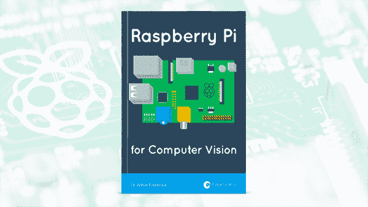
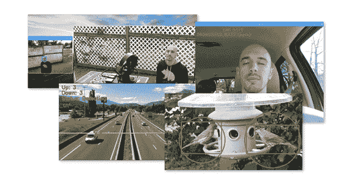
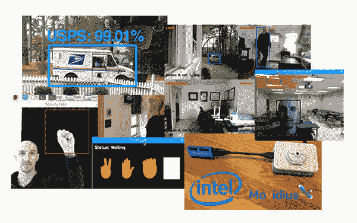
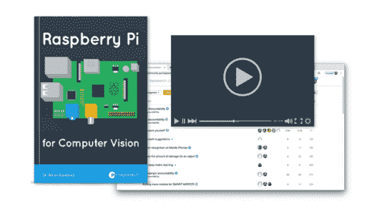

# 目录–用于计算机视觉的树莓 Pi

> 原文：<https://pyimagesearch.com/2019/04/05/table-of-contents-raspberry-pi-for-computer-vision/>

[几天前](https://pyimagesearch.com/2019/04/03/my-raspberry-pi-for-computer-vision-kickstarter-will-go-live-on-wednesday-april-10th-at-10am-est/)我提到过，美国东部时间 4 月 10 日星期三上午 10 点我将在 Kickstarter 上发布我的新书《计算机视觉的 T4 树莓 Pi》。

正如你将在这篇文章的后面看到的，我将会涵盖大量的内容，所以我决定将这本书分成三册****【捆绑】。****

 *一个 ***捆绑包*** 包含给定卷的电子书和源代码(以及一个预配置的 Raspbian。img 文件，预装所有你需要的计算机视觉+深度学习库)。

每个包*都建立在其他包*和*的基础上，包括来自较低包的所有内容。*您应该根据您希望深入学习 Pi 中的 CV 和 DL、您最感兴趣的项目/章节以及您的具体预算来选择一个组合:

*   爱好者套装:如果这是你第一次使用计算机视觉或树莓派，这是一个很好的选择。在这里，您将学习可以轻松应用于 Pi 的基本计算机视觉算法。您将构建动手应用程序，包括野生动物监视器/探测器、家庭视频监控、平移/倾斜伺服跟踪、*等等！*
*   **Hacker Bundle:** 非常适合希望学习更高级技术的读者，包括深度学习、使用 Movidius NCS、OpenVINO toolkit 和自动驾驶汽车应用程序。您还将了解我的技巧、建议和在 Raspberry Pi 上应用计算机视觉时的最佳实践。
*   **完整捆绑:***完整的树莓派和计算机视觉体验。*你可以**访问书中的每一章**、**视频教程**、文本的**硬拷贝，以及**访问我的*私人*社区和论坛**以获得额外的帮助和支持。**

下一节列出了每个包的完整目录。

## 业余爱好者包

**Figure 1:** Raspberry Pi for Computer Vision – Hobbyist Bundle

*爱好者包*包括以下主题。

**使用树莓派**

*   为什么是树莓派？
*   为你的树莓 Pi 配置计算机视觉+深度学习(包括所有库、包等。)
*   或者，跳过安装过程，使用我的**预配置的 Raspbian。img 文件**，其中带有**你需要的一切预装！**只是闪了一下。img 文件和引导。
*   简化您的开发流程，了解如何在 Raspberry Pi 上以最佳方式编写代码(包括建议的 ide 和推荐的设置/配置)
*   在 Pi 上访问*您的 USB 网络摄像头和/或 Raspberry Pi 摄像头模块*
*   使用**黑色摄像头模块**
*   了解如何**利用树莓 Pi 的多个摄像头**

**树莓派计算机视觉入门**

*   通过在 Pi 上创建延时视频，体验 OpenCV 和您的 Raspberry Pi 相机
*   建立一个自动喂鸟监视器，当鸟出现时进行检测
*   建立**自动处方药丸识别系统**(减少每年因服用错误药丸而发生的 120 万起伤亡)
*   了解如何从树莓派向您的网络浏览器传输帧

**树莓派的计算机视觉和物联网项目**

*   回顾**在物联网应用中使用 Raspberry Pi 时的硬件考虑和建议**
*   了解如何**在弱光条件下工作，**包括相机和算法建议
*   建造并部署一个**远程野生动物监视器，**能够探测野生动物并保存野生动物活动的片段
*   了解如何在 Pi 上启动/重启时自动运行您的计算机视觉应用程序
*   从 Pi 向您的手机发送文本消息(包括带有图像和视频的消息)
*   创建一个**车辆交通和行人流量计数系统**,能够检测和计数道路上的车辆数量/进出一个区域的人员数量

**伺服和 PID**

*   PID 是什么？
*   了解如何使用平移/倾斜伺服跟踪来**跟踪面部和物体**

**人类活动和家庭监控**

*   建立一个基本的视频监控系统，检测人们何时进入“未授权”区域
*   **将你的树莓派部署到车辆上**,检测疲劳、困倦的司机(并发出警报叫醒他们)
*   建造一个**自动人/脚步计数器**来计算进出商店、房子等的人数。

**提示、建议和最佳实践**

*   了解 **OpenCV 优化、**包括 **OpenCL** 以及如何访问*树莓 Pi 的所有四个内核*，提升您的系统性能
*   了解我关于如何**设计您自己的计算机视觉+ Raspberry Pi 应用程序以获得最佳性能的蓝图**
*   使用线程和多处理提高 FPS 吞吐率

## 黑客捆绑包

**Figure 2:** Raspberry Pi for Computer Vision – Hacker Bundle

*黑客捆绑包*包括*爱好者捆绑包中的**一切**。*还包括以下主题。

**高级计算机视觉和物联网项目与 Pi**

*   将帧从 Raspberry Pi 相机传输到您的**笔记本电脑、台式机或云实例，**处理这些帧，然后**将结果返回给 Pi**
*   建立一个**邻居车辆速度监视器**,检测车辆，估计它们的速度，并记录司机的活动
*   通过**自动识别递送卡车**和**检测包裹递送**来减少包裹盗窃

**高级人类活动和面部应用**

*   扩展您的视频监控系统，以包括**基于深度学习的对象检测**和带注释的输出视频剪辑
*   **使用多个摄像头和多个树莓派**在整个房子**内追踪你的家人和宠物**
*   利用树莓派进行**手势识别**
*   在树莓 Pi 上执行**人脸识别**
*   创建一个**智能教室和自动考勤系统**，能够检测哪些学生在场(和不在场)
*   利用 **TensorFlow Lite** 进行**人体姿态估计**

**对树莓派的深度学习**

*   了解如何在资源受限的设备上执行深度学习
*   利用 Movidius NCS 和 OpenVINO 在树莓 Pi 上进行**更快、更高效的深度学习**
*   使用 Pi 上的 **TinyYOLO 物体检测器**进行物体检测
*   在 Raspberry Pi 上使用**单次检测器(SSDs)**
*   在您的 Pi 上训练和部署一个**深度学习手势识别模型**
*   通过培训和部署深度学习模型来减少包裹盗窃**识别送货卡车**
*   使用**深度学习和多个树莓 pi**创建一个“智能摄像机”网络
*   回顾一下我的**指南和最佳实践**关于何时使用 Pi CPU、Movidius NCS 或者将帧传输到更强大的系统

**Movidius NCS 和 OpenVINO**

*   探索 OpenVINO 如何显著提高树莓 Pi 的推理时间
*   了解如何配置和**安装支持 OpenVINO 的 OpenCV**
*   在您的 Raspberry Pi 上配置 **Movidius NCS** 开发套件
*   **在您的 Pi 上使用深度学习和 Movidius NCS** 对图像进行分类
*   在 Movidius NCS 上执行**物体检测，以创建人员计数器和跟踪器**
*   在 Raspberry Pi 上使用 Movidius NCS 创建一个**人脸识别系统**
*   为 NCS 训练**定制 Caffe + TensorFlow 模型，并将其部署到 RPi**

**自动驾驶汽车应用和树莓派**

*   了解 GoPiGo3 以及它如何通过 Raspberry Pi 促进无人驾驶汽车的研究
*   了解如何用树莓派驾驶您的 GoPiGo3
*   **使用 GoPiGo3 和 Raspberry Pi 驾驶课程**
*   **用树莓派识别红绿灯**
*   **使用 GoPiGo3 和 Raspberry Pi 驾驶至特定物体**
*   **用覆盆子 Pi 创建一个线路/车道跟随器**

## 完全捆绑

**Figure 3:** Raspberry Pi for Computer Vision – Complete Bundle

*完整套装*包括*爱好者套装*和*黑客套装中的**一切**。*

**此外，还包括:**

*   所有附加的**奖励章节、指南和教程**
*   **每章的视频教程和演练**
*   访问我的**私人 Raspberry Pi 和计算机视觉社区和论坛**
*   一份送到你家门口的纸质文本

**谷歌珊瑚和树莓派**

*   配置您的谷歌珊瑚 USB 加速器
*   使用 Google Coral 执行**图像分类**
*   用 Coral 创建**实时物体探测器**
*   使用 Coral 训练和部署**您自己的定制模型**

**NVIDIA Jetson Nano 实践教程和指南**

*   配置您的 Jetson Nano
*   用 Nano 执行**图像分类**
*   **使用 Jetson Nano 进行实时物体检测**
*   培训并部署**您自己的定制模型到 Nano**

现在你有了——用于计算机视觉的树莓 Pi 的完整目录。我希望看完这份清单后，你会和我一样兴奋！

我也有一些*秘密奖金章节*，在 Kickstarter 发布之前我会保密。详情敬请关注。

为了在更多 Kickstarter 公告发布时得到通知(包括我不会在本博客上发布的公告)， **[请务必注册*Raspberry Pi for Computer Vision*Kickstarter 通知列表！](https://app.monstercampaigns.com/c/lmpypnxz7n0g1h4v2puy/)***