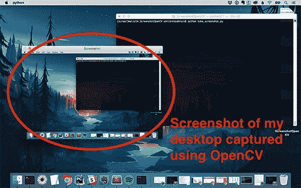
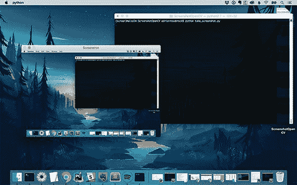

# 用 OpenCV 和 Python 截图

> 原文：<https://pyimagesearch.com/2018/01/01/taking-screenshots-with-opencv-and-python/> 截图

[](https://pyimagesearch.com/wp-content/uploads/2017/12/screenshot_opencv_header.jpg)

新年快乐

现在正式 2018… ***这也意味着 PyImageSearch(差不多)四岁了！***

我在 2014 年 1 月 12 日星期一发表了第一篇博文。从那以后**已经发布了 230 个帖子**，还有**两本书和一门成熟的课程**。

每年新年伊始，我都会花些时间进行反思。

我抓起我的笔记本+几支笔(把我的笔记本电脑和手机留在家里；不要分心)然后去我家附近的咖啡馆。然后，我坐在那里，反思过去的一年，问自己以下问题:

*   什么顺利，给了我生命？
*   是什么让我的生活变得很糟糕？
*   我怎样才能在积极的、赋予生命的方面加倍努力呢？
*   我怎样才能摆脱消极的一面(或者至少最小化它们对我生活的影响)？

这四个问题(以及我对它们的想法)最终决定了即将到来的一年。

但最重要的是，在过去的四年里，运行 PyImageSearch 一直在我的“赋予生命”列表中名列前茅。

感谢您让 PyImageSearch 成为可能。运行这个博客是我一天中最美好的时光。

没有你，PyImageSearch 就不可能实现。

为此，今天我要回答一个来自 Shelby 的问题，她是一个 PyImageSearch 的读者:

> 嗨，阿德里安，过去几年我一直在阅读 PyImageSearch。我很好奇的一个话题是用 OpenCV 截图。这可能吗？
> 
> 我想建立一个应用程序，可以自动控制用户的屏幕，它需要截图。但我不确定该如何着手。

谢尔比的问题很好。

构建一个计算机视觉系统来自动控制或分析用户屏幕上的内容是一个伟大的项目。

一旦有了屏幕截图，我们就可以使用模板匹配、关键点匹配或局部不变描述符来识别屏幕上的元素。

问题其实是*首先获取*截图。

我们称之为*数据获取*——在某些情况下，获取数据实际上比
应用计算机视觉或机器学习本身更难。

**要学习如何用 OpenCV 和 Python 截图，*继续阅读*。**

```py
$ workon your_virtualenv
$ pip install pillow imutils
$ pip install pyobjc-core
$ pip install pyobjc
$ pip install pyautogui

```

#### Ubuntu 或 Raspbian

要为 Ubuntu(或 Raspbian)安装 PyAutoGUI，您需要同时使用 Aptitude 和 pip。同样，在执行 pip 命令之前，请确保您正在 Python 虚拟环境中工作:

```py
$ sudo apt-get install scrot
$ sudo apt-get install python-tk python-dev
$ sudo apt-get install python3-tk python3-dev
$ workon your_virtualenv
$ pip install pillow imutils
$ pip install python3_xlib python-xlib
$ pip install pyautogui

```

### OpenCV 和 Python 的屏幕截图和截屏

现在 PyAutoGUI 已经安装好了，让我们用 OpenCV 和 Python 来拍第一张截图。

打开一个新文件，将其命名为`take_screenshot.py`，并插入以下代码:

```py
# import the necessary packages
import numpy as np
import pyautogui
import imutils
import cv2

```

在**2-5 行**我们正在导入我们需要的包，特别是`pyautogui`。

在那里，我们将通过两种不同的方法截取一个截图**。**

在第一种方法中，我们获取屏幕截图并将其存储在内存中以供立即使用:

```py
# take a screenshot of the screen and store it in memory, then
# convert the PIL/Pillow image to an OpenCV compatible NumPy array
# and finally write the image to disk
image = pyautogui.screenshot()
image = cv2.cvtColor(np.array(image), cv2.COLOR_RGB2BGR)
cv2.imwrite("in_memory_to_disk.png", image)

```

**第 10 行**显示我们正在用`pyautogui.screenshot`抓取一个屏幕截图，并将其存储为`image`(同样，这个图像存储在内存中，它是*而不是*保存到磁盘)。

简单吧。

没那么快！

PyAutoGUI 实际上将图像存储为 PIL/枕头图像，因此在图像可以与 OpenCV 一起使用之前，我们需要执行额外的步骤。

在**第 11 行**我们将图像转换成一个 NumPy 数组，并将颜色通道从 RGB 排序(PIL/枕头使用的)转换成 BGR(OpenCV 期望的)。这就是让我们的截图图像兼容 OpenCV 所需的全部内容。

从这里开始，天空是你能做的极限。您可以检测屏幕上显示的按钮，甚至可以确定鼠标在屏幕上的坐标。

这些任务我们今天都不做。相反，让我们用`cv2.imwrite`将映像写入磁盘，以确保进程正确运行(**第 12 行**)。

第二种方法(将屏幕截图写入磁盘)更简单:

```py
# this time take a screenshot directly to disk
pyautogui.screenshot("straight_to_disk.png")

```

如图所示，这个一行程序将图像直接写入磁盘。说够了。

我们可以就此打住，但是为了检查一下，让我们确保 OpenCV 也可以打开并显示截图:

```py
# we can then load our screenshot from disk in OpenCV format
image = cv2.imread("straight_to_disk.png")
cv2.imshow("Screenshot", imutils.resize(image, width=600))
cv2.waitKey(0)

```

在这里，我们从磁盘读取图像。然后我们调整它的大小并显示在屏幕上，直到按下一个键。

就是这样！

如你所知， **PyAutoGui 非常简单**多亏了[阿尔·斯威加特](https://twitter.com/AlSweigart)的努力工作。

让我们看看它是否有效。

要测试这个脚本，请打开一个终端并执行以下命令:

```py
$ python take_screenshot.py

```

这是我们的桌面截图，显示在我们的桌面内…证明截图已拍摄并显示:

[](https://pyimagesearch.com/wp-content/uploads/2017/12/screenshot_opencv_output.jpg)

**Figure 1:** Taking a screenshot with Python, OpenCV, and PyAutoGUI on macOS.

请注意 Python 脚本是如何在终端中运行的(暗示当前正在拍摄屏幕截图)。

脚本退出后，我的工作目录中有两个新文件:`in_memory_to_disk.png`和`straight_to_disk.png`。

让我们列出目录的内容:

```py
$ ls -al
total 18760
drwxr-xr-x@ 5 adrian  staff      160 Jan 01 10:04 .
drwxr-xr-x@ 8 adrian  staff      256 Jan 01 20:38 ..
-rw-r--r--@ 1 adrian  staff  4348537 Jan 01 09:59 in_memory_to_disk.png
-rw-r--r--@ 1 adrian  staff  5248098 Jan 01 09:59 straight_to_disk.png
-rw-r--r--@ 1 adrian  staff      703 Jan 01 09:59 take_screenshot.py

```

如你所见，我已经拿到了我的`take_screenshot.py`脚本和两张截图

现在我们有了 OpenCV 格式的截图，我们可以应用任何“标准”的计算机视觉或图像处理操作，包括边缘检测、模板匹配、关键点匹配、对象检测等。

在以后的博客文章中，我将展示如何检测屏幕上的元素，然后根据我们的计算机视觉算法检测到的内容从 PyAutoGUI 库中控制整个 GUI。

敬请关注 2018 年初本帖！

## 摘要

在今天的博文中，我们学习了如何使用 OpenCV、Python 和 [PyAutoGUI](https://pyautogui.readthedocs.io) 库来截图。

使用 PyAutoGUI，我们可以轻松地将截图直接捕获到磁盘或内存中，然后我们可以将其转换为 OpenCV/NumPy 格式。

在创建可以自动控制屏幕上 GUI 操作的计算机视觉软件时，截图是重要的第一步，包括自动移动鼠标、单击鼠标和注册键盘事件。

在未来的博客文章中，我们将学习如何通过计算机视觉和 PyAutoGUI 自动控制我们的整个计算机。

**要在 PyImageSearch 上发布博客文章时得到通知，*只需在下表中输入您的电子邮件地址！***