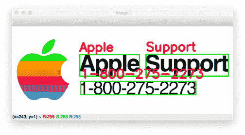

# Tesseract OCR:文本定位和检测

> 原文：<https://pyimagesearch.com/2020/05/25/tesseract-ocr-text-localization-and-detection/>

在本教程中，您将学习如何利用 Tesseract 来检测、本地化和 OCR 文本，所有这些都在一个有效的函数调用中完成。



回到九月份，我向您展示了如何使用 OpenCV 检测和 OCR 文本。该方法分为三个阶段:

1.  使用 [OpenCV 的东方文本检测模型](https://pyimagesearch.com/2018/08/20/opencv-text-detection-east-text-detector/)来**检测图像中文本的存在**
2.  **使用基本图像裁剪/数字阵列切片从图像**中提取文本感兴趣区域(ROI)
3.  获取文本 ROI，然后**将它传递到 Tesseract 中以实际 OCR 文本**

我们的方法工作得很好，但由于多阶段的过程，有点复杂和效率较低。

PyImageSearch 读者 Bryan 想知道是否有更好、更简化的方法:

> *嗨，阿德里安，*
> 
> *我注意到 OpenCV 的使用了东文检测模型。我假设文本检测也存在于宇宙魔方内部？*
> 
> 如果是这样的话，我们是否可以利用 Tesseract 来检测文本并对其进行 OCR，而无需调用额外的 OpenCV 函数？

你很幸运，布莱恩。**宇宙魔方*有能力在一个函数调用****中执行文本检测和 OCR 吗——你会发现，这很容易做到！*

 ***要了解如何使用 Tesseract 检测、定位和 OCR 文本，*请继续阅读。***

## Tesseract OCR:文本定位和检测

在本教程的第一部分，我们将讨论文本检测和定位的概念。

从这里开始，我将向您展示如何在您的系统上安装 Tesseract。

然后，我们将使用 Tesseract 和 Python 实现文本本地化、检测和 OCR。

最后，我们将回顾我们的结果。

### 什么是文本定位和检测？

**文本检测是定位*图像文本所在*的过程。**

您可以将文本检测视为**对象检测的一种特殊形式。**

在对象检测中，我们的目标是(1)检测并计算图像中所有对象的*边界框*，以及(2)确定每个边界框的*类别标签*，类似于下图:

在文本检测中，我们的目标是自动计算图像中每个文本区域的边界框:

一旦我们有了这些区域，我们就可以对它们进行 OCR。

### 如何为宇宙魔方 OCR 安装宇宙魔方

在我的博客文章 [*OpenCV OCR 和使用 Tesseract 的文本识别中，我已经提供了安装*](https://pyimagesearch.com/2018/09/17/opencv-ocr-and-text-recognition-with-tesseract/) *[Tesseract OCR 引擎](https://github.com/tesseract-ocr/tesseract)以及 [pytesseract](https://github.com/madmaze/pytesseract) (用于与 tesseract 接口的 Python 绑定)的说明。*

按照该教程的*“如何安装 Tesseract 4”*部分中的说明，确认您的 Tesseract 安装，然后回到这里学习如何使用 tessera CT 检测和本地化文本。

### 项目结构

去拿今天的。这篇博文的 ***【下载】*** 部分的 zip 文件。提取文件后，您将看到一个特别简单的项目布局:

```py
% tree
.
├── apple_support.png
└── localize_text_tesseract.py

0 directories, 2 files
```

## 使用 Tesseract 实现文本本地化、文本检测和 OCR

```py
# import the necessary packages
from pytesseract import Output
import pytesseract
import argparse
import cv2

# construct the argument parser and parse the arguments
ap = argparse.ArgumentParser()
ap.add_argument("-i", "--image", required=True,
	help="path to input image to be OCR'd")
ap.add_argument("-c", "--min-conf", type=int, default=0,
	help="mininum confidence value to filter weak text detection")
args = vars(ap.parse_args())
```

我们从导入包开始，即 pytesseract 和 OpenCV。有关安装链接，请务必参考上面的*“如何为 Tesseract OCR 安装 pytessera CT”*部分。

接下来，我们解析两个[命令行参数](https://pyimagesearch.com/2018/03/12/python-argparse-command-line-arguments/):

```py
# load the input image, convert it from BGR to RGB channel ordering,
# and use Tesseract to localize each area of text in the input image
image = cv2.imread(args["image"])
rgb = cv2.cvtColor(image, cv2.COLOR_BGR2RGB)
results = pytesseract.image_to_data(rgb, output_type=Output.DICT)
```

```py
# loop over each of the individual text localizations
for i in range(0, len(results["text"])):
	# extract the bounding box coordinates of the text region from
	# the current result
	x = results["left"][i]
	y = results["top"][i]
	w = results["width"][i]
	h = results["height"][i]

	# extract the OCR text itself along with the confidence of the
	# text localization
	text = results["text"][i]
	conf = int(results["conf"][i])
```

```py
# filter out weak confidence text localizations
	if conf > args["min_conf"]:
		# display the confidence and text to our terminal
		print("Confidence: {}".format(conf))
		print("Text: {}".format(text))
		print("")

		# strip out non-ASCII text so we can draw the text on the image
		# using OpenCV, then draw a bounding box around the text along
		# with the text itself
		text = "".join([c if ord(c) < 128 else "" for c in text]).strip()
		cv2.rectangle(image, (x, y), (x + w, y + h), (0, 255, 0), 2)
		cv2.putText(image, text, (x, y - 10), cv2.FONT_HERSHEY_SIMPLEX,
			1.2, (0, 0, 255), 3)

# show the output image
cv2.imshow("Image", image)
cv2.waitKey(0)
```

用宇宙魔方和宇宙魔方执行 OCR 非常棒。

### 镶嵌文本本地化、文本检测和 OCR 结果

我们现在准备好用 Tesseract 执行文本检测和定位了！

确保使用本教程的 ***“下载”*** 部分下载源代码和示例图像。

从那里，打开一个终端，并执行以下命令:

```py
$ python localize_text_tesseract.py --image apple_support.png
Confidence: 26
Text: a

Confidence: 96
Text: Apple

Confidence: 96
Text: Support

Confidence: 96
```

```py
$ python localize_text_tesseract.py --image apple_support.png --min-conf 50
Confidence: 96
Text: Apple

Confidence: 96
Text: Support

Confidence: 96
Text: 1-800-275-2273
```

## 摘要

在本教程中，您学习了如何使用 Tesseract 来检测文本，将其本地化，然后进行 OCR。

使用 Tesseract 执行文本检测和 OCR 的好处是，我们可以在一个函数调用中完成*，这比[多级 OpenCV OCR 过程](https://pyimagesearch.com/2018/09/17/opencv-ocr-and-text-recognition-with-tesseract/)更容易。*

也就是说，OCR 仍然是计算机视觉的一个远未解决的领域。

每当遇到 OCR 项目时，一定要应用这两种方法，看看哪种方法能给你最好的结果——让你的经验结果来指导你。

**要下载这篇文章的源代码(并在未来教程在 PyImageSearch 上发布时得到通知)，*只需在下面的表格中输入您的电子邮件地址！****