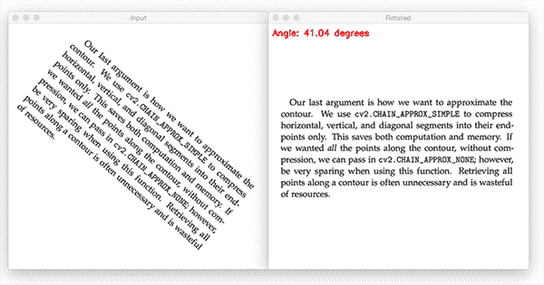
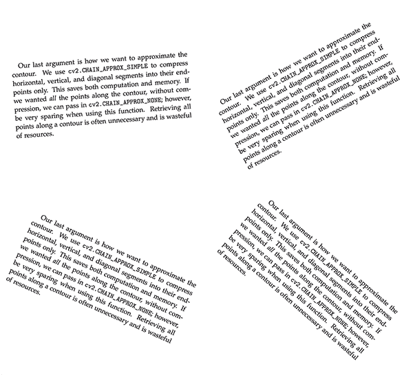
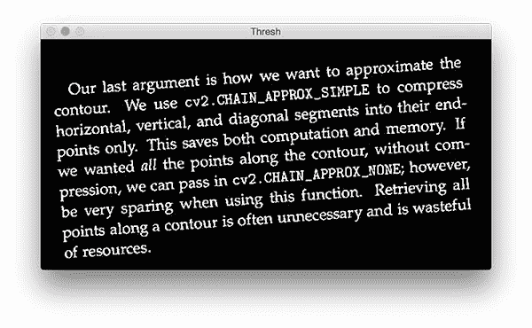
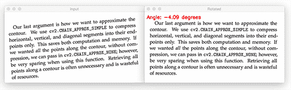
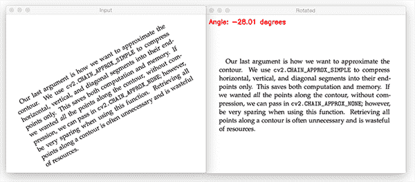
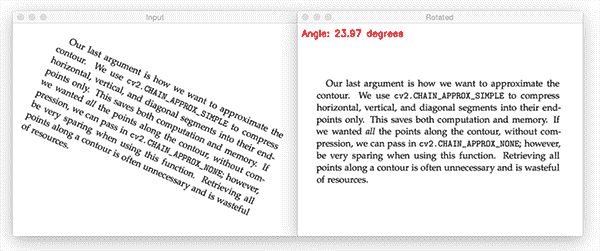

# 使用 OpenCV 和 Python 进行文本倾斜校正

> 原文：<https://pyimagesearch.com/2017/02/20/text-skew-correction-opencv-python/>



今天的教程是我最喜欢的博文的 Python 实现 [Félix Abecassis](http://felix.abecassis.me/2011/10/opencv-rotation-deskewing/) 关于使用 OpenCV 和图像处理函数进行*文本倾斜校正*(即“文本去倾斜”)的过程。

给定一个包含未知角度的旋转文本块的图像，我们需要通过以下方式校正文本倾斜:

1.  检测图像中的文本块。
2.  计算旋转文本的角度。
3.  旋转图像以校正倾斜。

我们通常在自动文档分析领域应用文本倾斜校正算法，但是该过程本身也可以应用于其他领域。

要了解更多关于文本倾斜校正的信息，请继续阅读。

## 使用 OpenCV 和 Python 进行文本倾斜校正

这篇博文的剩余部分将演示如何使用 Python 和 OpenCV 的基本图像处理操作来消除文本倾斜。

我们将从创建一个简单的数据集开始，我们可以用它来评估我们的文本倾斜校正器。

然后我们将编写 Python 和 OpenCV 代码来自动*检测*和*校正*图像中的文本倾斜角度。

### 创建简单的数据集

与 Félix 的例子类似，我准备了一个小数据集，其中包含四幅旋转了给定度数的图像:



**Figure 1:** Our four example images that we’ll be applying text skew correction to with OpenCV and Python.

文本块本身来自我的书的第 11 章， [*实用 Python 和 OpenCV*](https://pyimagesearch.com/practical-python-opencv/) *，*，我在这里讨论轮廓以及如何利用它们进行图像处理和计算机视觉。

四个文件的文件名如下:

```py
$ ls images/
neg_28.png	neg_4.png	pos_24.png	pos_41.png

```

文件名的第一部分指定我们的图像是逆时针旋转了*(负)还是顺时针旋转了*(正)。**

 **文件名的第二部分是图像旋转的实际度数*。*

 *我们的文本倾斜校正算法的目标是正确地确定旋转的*方向*和*角度*，然后进行校正。

要了解我们的文本倾斜校正算法是如何用 OpenCV 和 Python 实现的，请务必阅读下一节。

### 用 OpenCV 和 Python 实现文本去倾斜

首先，打开一个新文件，命名为`correct_skew.py`。

从那里，插入以下代码:

```py
# import the necessary packages
import numpy as np
import argparse
import cv2

# construct the argument parse and parse the arguments
ap = argparse.ArgumentParser()
ap.add_argument("-i", "--image", required=True,
	help="path to input image file")
args = vars(ap.parse_args())

# load the image from disk
image = cv2.imread(args["image"])

```

**第 2-4 行**导入我们需要的 Python 包。我们将通过我们的`cv2`绑定来使用 OpenCV，所以如果你的系统上还没有安装 OpenCV，请参考我的 [OpenCV 安装教程](https://pyimagesearch.com/opencv-tutorials-resources-guides/)列表来帮助你设置和配置你的系统。

然后我们在第 7-10 行解析我们的命令行参数。这里我们只需要一个参数，`--image`，它是输入图像的路径。

然后从磁盘的**线 13** 载入图像。

我们的下一步是分离图像中的文本:

```py
# convert the image to grayscale and flip the foreground
# and background to ensure foreground is now "white" and
# the background is "black"
gray = cv2.cvtColor(image, cv2.COLOR_BGR2GRAY)
gray = cv2.bitwise_not(gray)

# threshold the image, setting all foreground pixels to
# 255 and all background pixels to 0
thresh = cv2.threshold(gray, 0, 255,
	cv2.THRESH_BINARY | cv2.THRESH_OTSU)[1]

```

我们的输入图像包含在*亮*背景上*暗*的文本；然而，要应用我们的文本倾斜校正过程，我们首先需要反转图像(即，文本现在在*暗*背景上是*亮*——我们需要反转)。

在应用计算机视觉和图像处理操作时，前景通常表现为*亮*，而背景(图像中我们不感兴趣的部分)则表现为*暗*。

然后应用阈值操作(**行 23 和 24** )来二值化图像:



**Figure 2:** Applying a thresholding operation to binarize our image. Our text is now white on a black background.

给定这个阈值图像，我们现在可以计算包含文本区域的最小旋转边界框:

```py
# grab the (x, y) coordinates of all pixel values that
# are greater than zero, then use these coordinates to
# compute a rotated bounding box that contains all
# coordinates
coords = np.column_stack(np.where(thresh > 0))
angle = cv2.minAreaRect(coords)[-1]

# the `cv2.minAreaRect` function returns values in the
# range [-90, 0); as the rectangle rotates clockwise the
# returned angle trends to 0 -- in this special case we
# need to add 90 degrees to the angle
if angle < -45:
	angle = -(90 + angle)

# otherwise, just take the inverse of the angle to make
# it positive
else:
	angle = -angle

```

**第 30 行**找到`thresh`图像中作为前景一部分的所有 *(x，y)* 坐标。

我们将这些坐标传递给`cv2.minAreaRect`，然后它计算包含整个*T2 文本区域的最小旋转矩形。*

`cv2.minAreaRect`函数返回范围 *[-90，0]内的角度值。*当矩形顺时针旋转时，角度值向零增加。当达到零度时，角度被再次设置回-90 度，并且该过程继续。

***注:**更多关于`cv2.minAreaRect`的信息，请看[这篇亚当古德温的精彩解说](http://stackoverflow.com/questions/15956124/minarearect-angles-unsure-about-the-angle-returned)。*

**第 37 行和第 38 行**处理角度小于-45 度的情况，在这种情况下，我们需要给角度加上 90 度，然后取反。

否则，**行 42 和 43** 简单取角度的倒数。

既然我们已经确定了文本倾斜角度，我们需要应用仿射变换来校正倾斜:

```py
# rotate the image to deskew it
(h, w) = image.shape[:2]
center = (w // 2, h // 2)
M = cv2.getRotationMatrix2D(center, angle, 1.0)
rotated = cv2.warpAffine(image, M, (w, h),
	flags=cv2.INTER_CUBIC, borderMode=cv2.BORDER_REPLICATE)

```

**第 46 和 47 行**确定图像的中心 *(x，y)*-坐标。我们将`center`坐标和旋转角度传入`cv2.getRotationMatrix2D` ( **行 48** )。这个旋转矩阵`M`然后被用于在**行 49 和 50** 上执行实际的变换。

最后，我们将结果显示在屏幕上:

```py
# draw the correction angle on the image so we can validate it
cv2.putText(rotated, "Angle: {:.2f} degrees".format(angle),
	(10, 30), cv2.FONT_HERSHEY_SIMPLEX, 0.7, (0, 0, 255), 2)

# show the output image
print("[INFO] angle: {:.3f}".format(angle))
cv2.imshow("Input", image)
cv2.imshow("Rotated", rotated)
cv2.waitKey(0)

```

**第 53 行**在我们的图像上画出了`angle`，这样我们就可以验证输出图像是否与旋转角度相匹配(很明显，您希望在文档处理管道中删除这一行)。

**第 57-60 行**处理显示输出图像。

### 歪斜校正结果

要获得这篇博文中使用的代码+示例图片，请务必使用这篇博文底部的 ***“下载”*** 部分。

从那里，执行以下命令来纠正我们的`neg_4.png`图像的倾斜:

```py
$ python correct_skew.py --image images/neg_4.png 
[INFO] angle: -4.086

```



**Figure 3:** Applying skew correction using OpenCV and Python.

这里我们可以看到输入图像有 4 度逆时针倾斜。通过 OpenCV 应用我们的偏斜校正可以检测到这种 4 度的偏斜，并对其进行校正。

这是另一个例子，这次逆时针倾斜 28 度:

```py
$ python correct_skew.py --image images/neg_28.png 
[INFO] angle: -28.009

```



**Figure 4:** Deskewing images using OpenCV and Python.

同样，我们的倾斜校正算法能够校正输入图像。

这一次，让我们试试顺时针倾斜:

```py
$ python correct_skew.py --image images/pos_24.png 
[INFO] angle: 23.974

```



**Figure 5:** Correcting for skew in text regions with computer vision.

最后是更极端的 41 度顺时针倾斜:

```py
$ python correct_skew.py --image images/pos_41.png 
[INFO] angle: 41.037

```


**Figure 6:** Deskewing text with OpenCV.

不管倾斜角度如何，我们的算法能够使用 OpenCV 和 Python 来校正图像中的倾斜。

## 摘要

在今天的博文中，我提供了菲利克斯·阿贝卡西斯的方法的 Python 实现。

该算法本身非常简单，仅依赖于基本的图像处理技术，例如阈值处理、计算最小面积旋转矩形，然后应用仿射变换来校正倾斜。

我们通常会在自动文档分析管道中使用这种类型的文本倾斜校正，我们的目标是数字化一组文档，校正文本倾斜，然后应用 OCR 将图像中的文本转换为机器编码的文本。

我希望你喜欢今天的教程！

**为了在以后发表博文时得到通知，*请务必在下面的表格中输入您的电子邮件地址！******